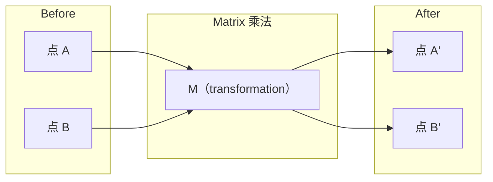
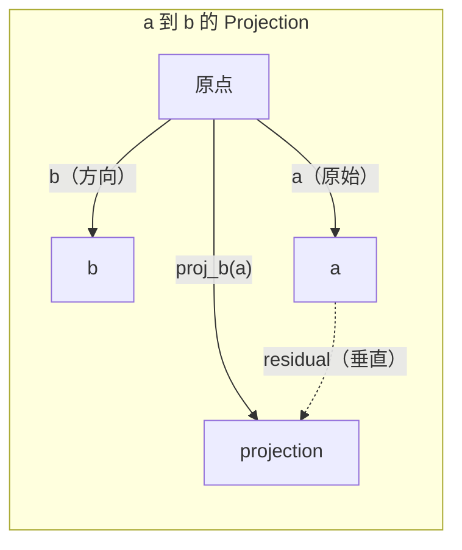

# Algebra linéaire 直觉

> Chaque modèle d'IA est une mathématique de Matrix avec un magnifique chapeau.

**类型：**Apprendre à apprendre
**语言：**Python, Julia
**先修要求：**Phase 0
**时间：**- 60 minutes

## Objectif de l'apprentissage

- Dans Python, de zéro à zéro réaliser Vecteur et Matrice 运算 (à augmenter, à augmenter, à augmenter, à augmenter, à augmenter)
- D'un point de vue géographique, expliquer le produit, la projection et le processus de Gram-Schmidt
- Utilisation de la réduction de ranges 判断一组 Indépendance linéaire du vecteur ランク 和 basis
- L'algebra linéaire est liée à l'application de l'IA:

##  problématique

打开任意一篇 ML论文──在第一页之内, vous verrez le Vecteur、矩阵、点产品和变化──没有线性代数直觉时,这些只是符号──有它,你就能看到神经网络 实际上在做什么-- 在空间中移动点──

Vous n'avez pas besoin d'être mathématicien. Vous devez voir ce que ces calculs signifient en géométrie, puis les écrire en code.

## 概念

### Les vecteurs sont des points (les directions)

Le vecteur n'est qu'une liste numérique. Mais ces chiffres ont une signification.

**2D Vector [3, 2]：**

| x | y | 点 |
|---|---|-------|
| 3 | 2 | 这个 Vector 从原点 (0,0) 指向平面上的 (3, 2) |

Cette magnitude du vecteur est = 3^2 + 2^2) = 13), direction à l'en haut et à droite.

Dans l'IA, Vector dit tout:
- Un mot → Un mot contient 768 个数字的矢量 (il est en intégration dans l'espace)
- Une image → Un vecteur composé de millions de images
- Un utilisateur → Un vecteur de préférence de la représentation

### Les matrices sont des transformations

La matrice transformera un vecteur en un autre vecteur. Il peut tourner, se réduire, se étendre ou projeter.



Dans l'IA, la Matrice est le modèle:
- Poids du réseau neuronal → Matrices de saisie  transformer en sortie
- Points d'attention → décider de se concentrer sur quoi
- Embeddings → 将词映射到 Vectors of Matrices

### Produit de point 衡量相似性

Le produit des points de deux vecteurs vous dira qu'ils ont beaucoup de similitudes.

```
a · b = a₁×b₁ + a₂×b₂ + ... + aₙ×bₙ

方向相同：      a · b > 0  （相似）
相互垂直：      a · b = 0  （无关）
方向相反：      a · b < 0  （不相似）
```

C'est exactement la façon dont les moteurs de recherche, les systèmes de recommandation et RAG travaillent - trouver des vecteurs de produits dotés plus élevés.

### Indépendance linéaire

Si aucun vecteur ne peut être écrit dans un ensemble d'autres vecteurs, alors ces vecteurs sont indépendants de manière linéaire. Si v1、v2、v3 sont indépendants, ils couvrent un espace 3D. Si l'un d'eux est un ensemble d'autres vecteurs, ils couvrent seulement un plan.

Il est important pour l'IA: votre matrice de caractéristiques  devrait avoir des colonnes linéairement indépendantes ⋅ Si deux caractéristiques   sont complètement liées ⋅ dépendantes ⋅ linéairement, le modèle ⋅ ne peut pas distinguer leurs effets respectifs ⋅ Cela entraînera une multicollineurité dans la régression ⋅ la matrice de poids ⋅ deviendra instable, les petites variations de l'entrée entraînera une grande fluctuation ⋅

**具体示例：**

```
v1 = [1, 0, 0]
v2 = [0, 1, 0]
v3 = [2, 1, 0]   # v3 = 2*v1 + v2
```

v1 et v2 sont indépendants de - 二者都不是另一个标量倍数或组合──但 v3 = 2*v1 + v2,所以 {v1, v2, v3} est un ensemble dépendant──这些三个向量都位于 xy-plane──无论你如何组合它们,都无法达到 [0, 0, 1]──你有三个向量,但只有两个自由维度──

Dans le jeu de données: si feature_3 = 2*feature_1 + feature_2, ajouter feature_3 ne donnera pas de nouvelles informations au modèle.

### Base et rang

La base est un groupe de vecteurs linéairement indépendants les plus petits, qui couvrent l'ensemble de l'espace.

La base standard de l'espace 3D est {1,0,0], [0,1,0], [0,0,1]}──mais les trois vecteurs indépendants du 3D peuvent constituer une base valide── la base de choix se trouve dans la base de la sélection.

Si le rang < min(rires, colons), cette matrice est de rang déficient. Ceci signifie:
- Le système a une infinité de solutions
- Transformation dans le vide
- Matrice non peut être inversée

| 情况 | Rank | 对 ML 的含义 |
|-----------|------|---------------------|
| Full rank (rank = min(m, n)) | 最大可能值 | 存在唯一 least-squares solution。Model well-conditioned。 |
| Rank deficient (rank < min(m, n)) | 低于最大值 | Features 冗余。有无穷多个 weight solutions。需要 regularization。 |
| Rank 1 | 1 | 每一列都是某个 Vector 的缩放副本。所有数据都位于一条线上。 |
| Near rank-deficient（较小的 singular values） | 数值上较低 | Matrix ill-conditioned。极小的 input noise 会造成很大的 output changes。使用 SVD truncation 或 ridge regression。 |

### Projection

Vecteur**a**投影到 Vector **b**Je vais le faire.**a**Dans le**b**方向上的分量:

```
proj_b(a) = (a dot b / b dot b) * b
```

La décomposition orthogonale est la base de l'ajustement des carrés les plus petits.

Projection en ML:
- Régrésion linéaire, les observations minimales à la distance de l'espace de colonnes -- 解本身就是一个投影
- PCA projettera les données dans la direction de la plus grande variance
- Les transformateurs de l'attention calculent les requêtes vers les projections des clés



**示例：**a = [3, 4], b = [1, 0]

Le nombre de points de référence est le nombre de points de référence.

Cette projection a perdu y de la quantité. C'est la plus simple forme de réduction de dimension -- la direction dont vous n'avez pas à vous soucier.

### Processus Gram-Schmidt

Pour chaque vecteur, la longueur est de 1, et pour chaque vecteur, les points sont tous égalés.

- Je suis un peu déçu.
1. Prenez le premier vecteur, il va se normaliser
2. Prenez un deuxième vecteur, en le déduisant dans la projection du premier vecteur, normalize à nouveau
3. Prenez le troisième vecteur, en le déduisant de toutes les projections précédentes, ré-normalizer
4. Pour les vecteurs restants 重复该过程

```
Input:  v1, v2, v3, ...（linearly independent）

u1 = v1 / |v1|

w2 = v2 - (v2 dot u1) * u1
u2 = w2 / |w2|

w3 = v3 - (v3 dot u1) * u1 - (v3 dot u2) * u2
u3 = w3 / |w3|

Output: u1, u2, u3, ...（orthonormal basis）
```

C'est la décomposition interne du Q. Q est une base orthonnormale, R capture des coefficients de projection.
- 求解线性系统(比高斯的消除 更稳定)
- 计算 propres valeurs(algorithme de RQ)
- Régrésion des carrés minimaux (standard数值方法)


```figure
eigen-directions
```

## - Je le construis.

### 步骤 1: From zero réalisation des vecteurs (Python)

```python
class Vector:
    def __init__(self, components):
        self.components = list(components)
        self.dim = len(self.components)

    def __add__(self, other):
        return Vector([a + b for a, b in zip(self.components, other.components)])

    def __sub__(self, other):
        return Vector([a - b for a, b in zip(self.components, other.components)])

    def dot(self, other):
        return sum(a * b for a, b in zip(self.components, other.components))

    def magnitude(self):
        return sum(x**2 for x in self.components) ** 0.5

    def normalize(self):
        mag = self.magnitude()
        return Vector([x / mag for x in self.components])

    def cosine_similarity(self, other):
        return self.dot(other) / (self.magnitude() * other.magnitude())

    def __repr__(self):
        return f"Vector({self.components})"


a = Vector([1, 2, 3])
b = Vector([4, 5, 6])

print(f"a + b = {a + b}")
print(f"a · b = {a.dot(b)}")
print(f"|a| = {a.magnitude():.4f}")
print(f"cosine similarity = {a.cosine_similarity(b):.4f}")
```

### 步骤 2: From零 réalisation des matrices (Python)

```python
class Matrix:
    def __init__(self, rows):
        self.rows = [list(row) for row in rows]
        self.shape = (len(self.rows), len(self.rows[0]))

    def __matmul__(self, other):
        if isinstance(other, Vector):
            return Vector([
                sum(self.rows[i][j] * other.components[j] for j in range(self.shape[1]))
                for i in range(self.shape[0])
            ])
        rows = []
        for i in range(self.shape[0]):
            row = []
            for j in range(other.shape[1]):
                row.append(sum(
                    self.rows[i][k] * other.rows[k][j]
                    for k in range(self.shape[1])
                ))
            rows.append(row)
        return Matrix(rows)

    def transpose(self):
        return Matrix([
            [self.rows[j][i] for j in range(self.shape[0])]
            for i in range(self.shape[1])
        ])

    def __repr__(self):
        return f"Matrix({self.rows})"


rotation_90 = Matrix([[0, -1], [1, 0]])
point = Vector([3, 1])

rotated = rotation_90 @ point
print(f"Original: {point}")
print(f"Rotated 90°: {rotated}")
```

### Étape 3: Pourquoi c' est important pour l' IA ?

```python
import random

random.seed(42)
weights = Matrix([[random.gauss(0, 0.1) for _ in range(3)] for _ in range(2)])
input_vector = Vector([1.0, 0.5, -0.3])

output = weights @ input_vector
print(f"Input (3D): {input_vector}")
print(f"Output (2D): {output}")
print("This is what a neural network layer does -- matrix multiplication.")
```

### 步骤 4: Julia 版本

```julia
a = [1.0, 2.0, 3.0]
b = [4.0, 5.0, 6.0]

println("a + b = ", a + b)
println("a · b = ", a ⋅ b)       # Julia supports unicode operators
println("|a| = ", √(a ⋅ a))
println("cosine = ", (a ⋅ b) / (√(a ⋅ a) * √(b ⋅ b)))

# Matrix-vector multiplication
W = [0.1 -0.2 0.3; 0.4 0.5 -0.1]
x = [1.0, 0.5, -0.3]
println("Wx = ", W * x)
println("This is a neural network layer.")
```

### 步骤 5: de zéro réaliser l'indépendance linéaire 和 projection (Python)

```python
def is_linearly_independent(vectors):
    n = len(vectors)
    dim = len(vectors[0].components)
    mat = Matrix([v.components[:] for v in vectors])
    rows = [row[:] for row in mat.rows]
    rank = 0
    for col in range(dim):
        pivot = None
        for row in range(rank, len(rows)):
            if abs(rows[row][col]) > 1e-10:
                pivot = row
                break
        if pivot is None:
            continue
        rows[rank], rows[pivot] = rows[pivot], rows[rank]
        scale = rows[rank][col]
        rows[rank] = [x / scale for x in rows[rank]]
        for row in range(len(rows)):
            if row != rank and abs(rows[row][col]) > 1e-10:
                factor = rows[row][col]
                rows[row] = [rows[row][j] - factor * rows[rank][j] for j in range(dim)]
        rank += 1
    return rank == n


def project(a, b):
    scalar = a.dot(b) / b.dot(b)
    return Vector([scalar * x for x in b.components])


def gram_schmidt(vectors):
    orthonormal = []
    for v in vectors:
        w = v
        for u in orthonormal:
            proj = project(w, u)
            w = w - proj
        if w.magnitude() < 1e-10:
            continue
        orthonormal.append(w.normalize())
    return orthonormal


v1 = Vector([1, 0, 0])
v2 = Vector([1, 1, 0])
v3 = Vector([1, 1, 1])
basis = gram_schmidt([v1, v2, v3])
for i, u in enumerate(basis):
    print(f"u{i+1} = {u}")
    print(f"  |u{i+1}| = {u.magnitude():.6f}")

print(f"u1 · u2 = {basis[0].dot(basis[1]):.6f}")
print(f"u1 · u3 = {basis[0].dot(basis[2]):.6f}")
print(f"u2 · u3 = {basis[1].dot(basis[2]):.6f}")
```

## Utilisez-le

Maintenant, avec NumPy, faites la même chose -- c'est la façon dont vous allez vraiment l'utiliser en pratique:

```python
import numpy as np

a = np.array([1, 2, 3], dtype=float)
b = np.array([4, 5, 6], dtype=float)

print(f"a + b = {a + b}")
print(f"a · b = {np.dot(a, b)}")
print(f"|a| = {np.linalg.norm(a):.4f}")
print(f"cosine = {np.dot(a, b) / (np.linalg.norm(a) * np.linalg.norm(b)):.4f}")

W = np.random.randn(2, 3) * 0.1
x = np.array([1.0, 0.5, -0.3])
print(f"Wx = {W @ x}")
```

### Utilisation NumPy  traitement Rank、Projection 和 QR

```python
import numpy as np

A = np.array([[1, 2], [2, 4]])
print(f"Rank: {np.linalg.matrix_rank(A)}")

a = np.array([3, 4])
b = np.array([1, 0])
proj = (np.dot(a, b) / np.dot(b, b)) * b
print(f"Projection of {a} onto {b}: {proj}")

Q, R = np.linalg.qr(np.random.randn(3, 3))
print(f"Q is orthogonal: {np.allclose(Q @ Q.T, np.eye(3))}")
print(f"R is upper triangular: {np.allclose(R, np.triu(R))}")
```

### PyTorch -- Les tensions sont des vecteurs avec autodiff

```python
import torch

x = torch.randn(3, requires_grad=True)
y = torch.tensor([1.0, 0.0, 0.0])

similarity = torch.dot(x, y)
similarity.backward()

print(f"x = {x.data}")
print(f"y = {y.data}")
print(f"dot product = {similarity.item():.4f}")
print(f"d(dot)/dx = {x.grad}")
```

Le produit de point  concernant x est le gradient y── PyTorch a automatiquement calculé ce point── Chaque opération du réseau neural est constituée de ce type de calcul -- Matrice multiplie、 produits de point、 projections -- auto-définition --

Tu viens de construire un code numérique qui peut être réalisé à partir de zéro.

## Je le livre.

Le cours est ouvert à:
- `outputs/prompt-linear-algebra-tutor.md`-- un pour faire aider l' IA à travers la géographie directe professeur de l' algèbre linéaire

## connexion

Chaque contenu de cette classe est lié à la partie spécifique de l'IA moderne:

| 概念 | 出现位置 |
|---------|------------------|
| Dot product | Transformers 中的 Attention scores，RAG 中的 cosine similarity |
| Matrix multiply | 每个 Neural Network layer，每个 linear transformation |
| Linear independence | Feature selection，避免 multicollinearity |
| Rank | 判断一个系统是否可解，LoRA（low-rank adaptation） |
| Projection | Linear Regression（投影到 column space）、PCA |
| Gram-Schmidt / QR | Numerical solvers，eigenvalue computation |
| Orthonormal basis | 稳定的 numerical computation，whitening transforms |

LoRA  vale une mention particulière. Il passe par des mises à jour de poids divisées en matrices de faible rang pour LLM à réglage fin. Avec elle, il renouvelle une matrice de poids de 4096x4096 (paramètres 16M), LoRA 更新两个尺寸为 4096x16和 16x4096 (paramètres 131K) 约束

## 练习

1.  réaliser `Vector.angle_between(other)`, retour entre deux vecteurs
2.  Créer une matrice d'échelle 2D, faire x-coordonnées 翻倍、y-coordonnées 变为三倍, puis le appliquer à Vecteur [1, 1]
3. 给定 5 个随机类词 矢量(dimension 50), en utilisant la similitude cosyène 找出最相似的两个
4. 验证 Gram-Schmidt output 确实是正规的:检查每一对的点产品都为 0,并且每个向量的大小都为 1
5. Créer un rang 为 2 de 3x3 Matrice.`rank()`La méthode 验证── puis expliquer ce que sont les objets de la sphère de ces colonnes.
6. Pour le vecteur [1, 2, 3] 投影到 [1, 1, 1] 上──结果在几何上表示什么?

## 关键术语

| 术语 | 人们常说 | 实际含义 |
|------|----------------|----------------------|
| Vector | “一个箭头” | 一个数字列表，表示 n-dimensional space 中的点或方向 |
| Matrix | “一个数字表” | 一种 transformation，将 Vectors 从一个空间映射到另一个空间 |
| Dot product | “相乘再求和” | 衡量两个 Vectors 对齐程度的指标 -- similarity search 的核心 |
| Embedding | “某种 AI 魔法” | 一个表示某物含义（词、图像、用户）的 Vector |
| Linear independence | “它们不重叠” | 集合中没有任何 Vector 可以写成其他 Vector 的组合 |
| Rank | “有多少维” | Matrix 中 linearly independent columns（或 rows）的数量 |
| Projection | “影子” | 一个 Vector 在另一个 Vector 方向上的分量 |
| Basis | “坐标轴” | 一组最小的 independent Vectors，它们 span 该空间 |
| Orthonormal | “垂直的单位 Vectors” | 彼此互相垂直且各自长度为 1 的 Vectors |
