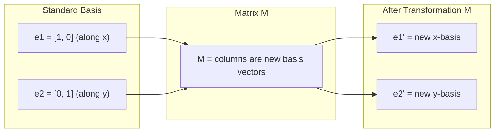
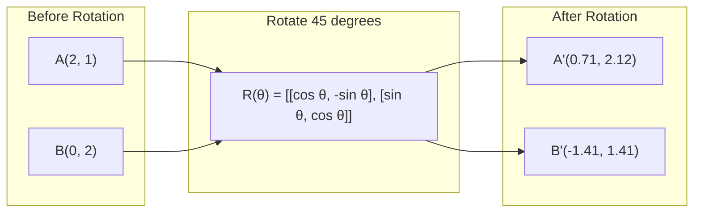
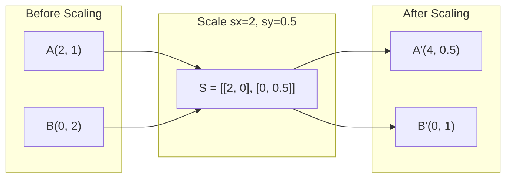
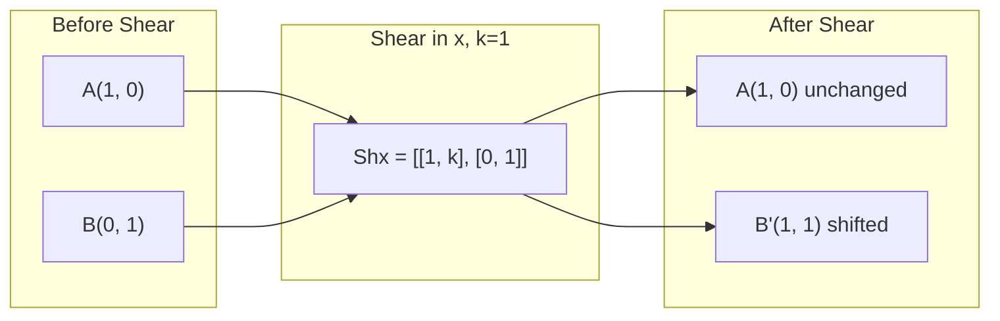
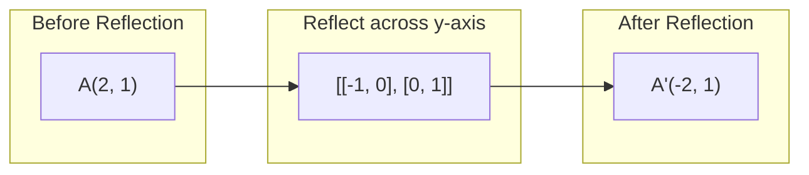
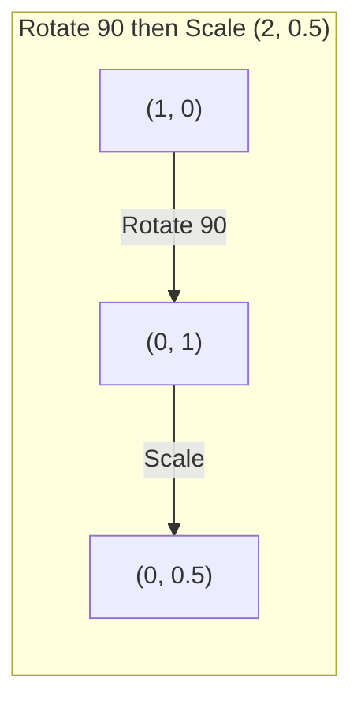
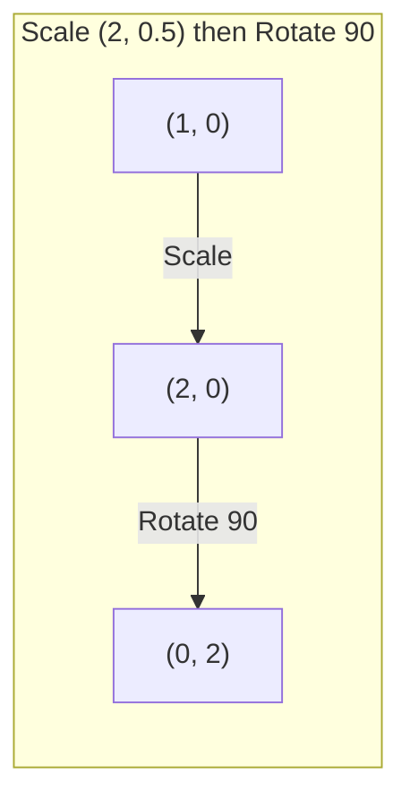

# Matrice 变换

> La Matrice est une machine de ré-formation de l'espace. Comprendre ce qu'elle fait à chaque point, vous comprenez tout le changement.

**类型：**Construction
**语言：**Python, Julia
**先修要求：**Phase 1, leçons 01-02 (Intuition de l'algèbre linéaire, vecteurs et matrice)
**时间：**- 75 minutes

## Objectif de l'apprentissage

- Construire des matrices de rotation, de scalissage, de découpe et de réflexion, et les appliquer à des points 2D et 3D
- 通过矩阵乘法 组合多个变换,并验证顺序 est très important
- De l'équation caractéristique  calcul des valeurs propres des matrices 2x2 et des vecteurs propres
-  expliquer pourquoi les valeurs propres décident de la direction PCA  RNN  stabilité et regroupement spectrique  comportement

##  problématique

Vous lisez le PCA, vous lisez le modèle de stabilité, vous lisez le modèle de stabilité, vous lisez le PCA, vous lisez le modèle de stabilité, vous lisez le PCA, vous lisez le modèle de stabilité, vous lisez le modèle de stabilité, vous lisez le PCA, vous lisez le modèle de stabilité, vous lisez le modèle de stabilité, vous lisez le modèle de stabilité, vous lisez le document de stabilité, vous lisez le document de stabilité, vous lisez le document de stabilité, vous lisez le document de stabilité, vous lisez le document de stabilité, vous lisez le document de stabilité, vous lisez le document de stabilité, vous lisez le document de stabilité, vous lisez le document de stabilité, vous lisez le document de stabilité, vous lisez le document de stabilité, vous lisez le document de stabilité, vous lisez le document de stabilité, vous lisez le document de stabilité, vous lisez le document de stabilité, vous lisez le document de stabilité, vous lisez le document de stabilité, vous lisez le document de la matière, et vous savez ce que vous avez fait, vous avez fait avant que vous avez fait.

Les matrices ne sont pas seulement des réseaux numériques. Elles sont des machines spatiales. La matrice de rotation se tourne à travers les points. La matrice de scallages se déplace à travers les points. La matrice de déchirage se déplace vers les points. Le réseau neural change chaque fois qu'il y a une opération ou une combinaison de ces opérations.

## 核心概念

### 作为矩阵的变化

Chaque transformation linéaire en 2D peut être écrite en une matrice 2x2 . Cette matrice va vous dire exactement les vecteurs de base [1, 0] et [0, 1] .



### Retour

La rotation 2D de l'angle pour l'angle de l'angle conserve une distance et un angle inchangé.



En 3D, vous tournez autour d'un axe. Chaque axe a sa propre matrice de rotation:

```
Rz(theta) = | cos  -sin  0 |     Rotate around z-axis
            | sin   cos  0 |     (x-y plane spins, z stays)
            |  0     0   1 |

Rx(theta) = | 1   0     0    |   Rotate around x-axis
            | 0  cos  -sin   |   (y-z plane spins, x stays)
            | 0  sin   cos   |

Ry(theta) = |  cos  0  sin |     Rotate around y-axis
            |   0   1   0  |     (x-z plane spins, y stays)
            | -sin  0  cos |
```

### Écalement

Échantillonnage et compréhension



### Coupe de poing

Le coupage se fait en tenant un axe fixe tout en tendant vers un autre axe.



Matrices de découpe:
- `Shx = [[1, k], [0, 1]]`Va x déplacer k * y
- `Shy = [[1, 0], [k, 1]]`Va y être déplacé

### Réflexion

Réflexion se fera à un point sur un axe ou une ligne droite du miroir passé.



Matrices de réflexion:
- À l'extrémité de l'axe y:`[[-1, 0], [0, 1]]`
- À l'extrémité de l'axe x:`[[1, 0], [0, -1]]`

### Composition:串联变换

Avant de changer A, de changer B, il est nécessaire de les multiplier par matrices:`result = B @ A @ point`◊ ◊ ◊ ◊ ◊ ◊ ◊ ◊ ◊ ◊ ◊ ◊ ◊ ◊ ◊ ◊ ◊ ◊ ◊ ◊ ◊ ◊ ◊ ◊ ◊ ◊ ◊ ◊ ◊ ◊ ◊ ◊ ◊ ◊ ◊ ◊ ◊ ◊ ◊ ◊ ◊ ◊ ◊ ◊ ◊ ◊ ◊ ◊ ◊ ◊ ◊ ◊ ◊ ◊ ◊ ◊ ◊ ◊ ◊ ◊ ◊ ◊ ◊ ◊ ◊ ◊ ◊ ◊ ◊ ◊ ◊ ◊ ◊ ◊ ◊ ◊ ◊ ◊ ◊ ◊ ◊ ◊ ◊ ◊ ◊ ◊ ◊ ◊ ◊ ◊ ◊ ◊ ◊ ◊ ◊ ◊ ◊ ◊ ◊ ◊ ◊ ◊ ◊ ◊ ◊ ◊ ◊ ◊ ◊ ◊ ◊ ◊ ◊ ◊ ◊ ◊ ◊ ◊ ◊ ◊ ◊ ◊ ◊ ◊ ◊ ◊ ◊ ◊ ◊ ◊ ◊ ◊ ◊ ◊ ◊ ◊ ◊ ◊ ◊ ◊ ◊ ◊ ◊     ◊ ◊      ◊     ◊ ◊                                                                                                                                                                                                         



组合后:`S @ R = [[0, -2], [0.5, 0]]`



组合后:`R @ S = [[0, -0.5], [2, 0]]`

结果不同──matrix multiplication 不满足交换律──

### Value propre et vecteurs propres

La plupart des vecteurs sont affectés par une matrice, mais ils changent de direction. Les vecteurs d'équilibre sont particuliers: la matrice ne se réduit qu'à leur taille et ne tourne jamais autour d'eux.

```
A @ v = lambda * v

v is the eigenvector (direction that survives)
lambda is the eigenvalue (how much it stretches)

Example: A = | 2  1 |
             | 1  2 |

Eigenvector [1, 1] with eigenvalue 3:
  A @ [1,1] = [3, 3] = 3 * [1, 1]     (same direction, scaled by 3)

Eigenvector [1, -1] with eigenvalue 1:
  A @ [1,-1] = [1, -1] = 1 * [1, -1]  (same direction, unchanged)
```

Cette matrice 会沿 [1, 1] 方向把空间拉伸 3x,并保持 [1, -1] 不变──其他每个方向都是 les deux directions.

### Composition propre

Si une matrice a n'importe quel vecteur propre, elle peut être décomposée:

```
A = V @ D @ V^(-1)

V = matrix whose columns are eigenvectors
D = diagonal matrix of eigenvalues
V^(-1) = inverse of V

This says: rotate into eigenvector coordinates, scale along each axis, rotate back.
```

### Pourquoi les valeurs propres sont-elles importantes ?

**PCA。**Les propres vecteurs de la matrice de covariance sont les principaux composants. Les valeurs propres vous diront combien de variance chaque composant a capturé.

**稳定性。**Dans les réseaux récurrents et les systèmes dynamiques, les valeurs propres de magnitude > 1 entraîneraient une explosion de sortie.

**Spectral methods。**Graph Neural Networks Utilise les valeurs propres de la matrice adjacente;; Clusterage spectrale Utilise les valeurs propres du Laplacien;; Eigenvecteurs 会揭示graph的结构;;

### Déterminant 作为体积缩放因子

Le déterminant de la matrice de transformation vous dira qu'elle a réduit le volume de la surface.

```
det = 1:   area preserved (rotation)
det = 2:   area doubled
det = 0:   space crushed to lower dimension (singular)
det = -1:  area preserved but orientation flipped (reflection)

| det(Rotation) | = 1        (always)
| det(Scale sx, sy) | = sx * sy
| det(Shear) | = 1           (area preserved)
| det(Reflection) | = -1     (orientation flipped)
```


```figure
matrix-transform
```

## - Je le construis.

### 步骤 1: de zéro réaliser des matrices de transformation (Python)

```python
import math

def rotation_2d(theta):
    c, s = math.cos(theta), math.sin(theta)
    return [[c, -s], [s, c]]

def scaling_2d(sx, sy):
    return [[sx, 0], [0, sy]]

def shearing_2d(kx, ky):
    return [[1, kx], [ky, 1]]

def reflection_x():
    return [[1, 0], [0, -1]]

def reflection_y():
    return [[-1, 0], [0, 1]]

def mat_vec_mul(matrix, vector):
    return [
        sum(matrix[i][j] * vector[j] for j in range(len(vector)))
        for i in range(len(matrix))
    ]

def mat_mul(a, b):
    rows_a, cols_b = len(a), len(b[0])
    cols_a = len(a[0])
    return [
        [sum(a[i][k] * b[k][j] for k in range(cols_a)) for j in range(cols_b)]
        for i in range(rows_a)
    ]

point = [1.0, 0.0]
angle = math.pi / 4

rotated = mat_vec_mul(rotation_2d(angle), point)
print(f"Rotate (1,0) by 45 deg: ({rotated[0]:.4f}, {rotated[1]:.4f})")

scaled = mat_vec_mul(scaling_2d(2, 3), [1.0, 1.0])
print(f"Scale (1,1) by (2,3): ({scaled[0]:.1f}, {scaled[1]:.1f})")

sheared = mat_vec_mul(shearing_2d(1, 0), [1.0, 1.0])
print(f"Shear (1,1) kx=1: ({sheared[0]:.1f}, {sheared[1]:.1f})")

reflected = mat_vec_mul(reflection_y(), [2.0, 1.0])
print(f"Reflect (2,1) across y: ({reflected[0]:.1f}, {reflected[1]:.1f})")
```

### 步骤 2: changement de composition

```python
R = rotation_2d(math.pi / 2)
S = scaling_2d(2, 0.5)

rotate_then_scale = mat_mul(S, R)
scale_then_rotate = mat_mul(R, S)

point = [1.0, 0.0]
result1 = mat_vec_mul(rotate_then_scale, point)
result2 = mat_vec_mul(scale_then_rotate, point)

print(f"Rotate 90 then scale: ({result1[0]:.2f}, {result1[1]:.2f})")
print(f"Scale then rotate 90: ({result2[0]:.2f}, {result2[1]:.2f})")
print(f"Same? {result1 == result2}")
```

### 步骤 3: de la valeur propre à partir de zéro calculs(2x2)

Pour une matrice 2x2`[[a, b], [c, d]]`,eigenvalues par équation caractéristique 求解:`lambda^2 - (a+d)*lambda + (ad - bc) = 0`Il y a une autre.

```python
def eigenvalues_2x2(matrix):
    a, b = matrix[0]
    c, d = matrix[1]
    trace = a + d
    det = a * d - b * c
    discriminant = trace ** 2 - 4 * det
    if discriminant < 0:
        real = trace / 2
        imag = (-discriminant) ** 0.5 / 2
        return (complex(real, imag), complex(real, -imag))
    sqrt_disc = discriminant ** 0.5
    return ((trace + sqrt_disc) / 2, (trace - sqrt_disc) / 2)

def eigenvector_2x2(matrix, eigenvalue):
    a, b = matrix[0]
    c, d = matrix[1]
    if abs(b) > 1e-10:
        v = [b, eigenvalue - a]
    elif abs(c) > 1e-10:
        v = [eigenvalue - d, c]
    else:
        if abs(a - eigenvalue) < 1e-10:
            v = [1, 0]
        else:
            v = [0, 1]
    mag = (v[0] ** 2 + v[1] ** 2) ** 0.5
    return [v[0] / mag, v[1] / mag]

A = [[2, 1], [1, 2]]
vals = eigenvalues_2x2(A)
print(f"Matrix: {A}")
print(f"Eigenvalues: {vals[0]:.4f}, {vals[1]:.4f}")

for val in vals:
    vec = eigenvector_2x2(A, val)
    result = mat_vec_mul(A, vec)
    scaled = [val * vec[0], val * vec[1]]
    print(f"  lambda={val:.1f}, v={[round(x,4) for x in vec]}")
    print(f"    A@v = {[round(x,4) for x in result]}")
    print(f"    l*v = {[round(x,4) for x in scaled]}")
```

### 步骤 4: Déterminant 作为体积缩放因子

```python
def det_2x2(matrix):
    return matrix[0][0] * matrix[1][1] - matrix[0][1] * matrix[1][0]

print(f"det(rotation 45) = {det_2x2(rotation_2d(math.pi/4)):.4f}")
print(f"det(scale 2,3)   = {det_2x2(scaling_2d(2, 3)):.1f}")
print(f"det(shear kx=1)  = {det_2x2(shearing_2d(1, 0)):.1f}")
print(f"det(reflect y)   = {det_2x2(reflection_y()):.1f}")

singular = [[1, 2], [2, 4]]
print(f"det(singular)     = {det_2x2(singular):.1f}")
print("Singular: columns are proportional, space collapses to a line.")
```

## Utilisez-le

NumPy utilisera des méthodes d'optimisation pour traiter tout cela.

```python
import numpy as np

theta = np.pi / 4
R = np.array([[np.cos(theta), -np.sin(theta)],
              [np.sin(theta),  np.cos(theta)]])

point = np.array([1.0, 0.0])
print(f"Rotate (1,0) by 45 deg: {R @ point}")

S = np.diag([2.0, 3.0])
composed = S @ R
print(f"Scale(2,3) after Rotate(45): {composed @ point}")

A = np.array([[2, 1], [1, 2]], dtype=float)
eigenvalues, eigenvectors = np.linalg.eig(A)
print(f"\nEigenvalues: {eigenvalues}")
print(f"Eigenvectors (columns):\n{eigenvectors}")

for i in range(len(eigenvalues)):
    v = eigenvectors[:, i]
    lam = eigenvalues[i]
    print(f"  A @ v{i} = {A @ v}, lambda * v{i} = {lam * v}")

print(f"\ndet(R) = {np.linalg.det(R):.4f}")
print(f"det(S) = {np.linalg.det(S):.1f}")

B = np.array([[3, 1], [0, 2]], dtype=float)
vals, vecs = np.linalg.eig(B)
D = np.diag(vals)
V = vecs
reconstructed = V @ D @ np.linalg.inv(V)
print(f"\nEigendecomposition A = V @ D @ V^-1:")
print(f"Original:\n{B}")
print(f"Reconstructed:\n{reconstructed}")
```

### Utiliser NumPy  effectuer des rotations 3D

```python
def rotation_3d_z(theta):
    c, s = np.cos(theta), np.sin(theta)
    return np.array([[c, -s, 0], [s, c, 0], [0, 0, 1]])

def rotation_3d_x(theta):
    c, s = np.cos(theta), np.sin(theta)
    return np.array([[1, 0, 0], [0, c, -s], [0, s, c]])

point_3d = np.array([1.0, 0.0, 0.0])
rotated_z = rotation_3d_z(np.pi / 2) @ point_3d
rotated_x = rotation_3d_x(np.pi / 2) @ point_3d

print(f"\n3D point: {point_3d}")
print(f"Rotate 90 around z: {np.round(rotated_z, 4)}")
print(f"Rotate 90 around x: {np.round(rotated_x, 4)}")
```

## Je le livre.

Le cours est consacré à la PCA (Phase 2) et au réseau neuronal (NN) et à l'analyse des données.

## 练习

1. Pour les points de rotation, les points de rotation sont les points de rotation de l'unité de la pièce.

2. Utilisez l'équation caractéristique 手算 matrice de [4, 2], [1, 3]] propres valeurs── puis utilisez vous de la fonction et NumPy  effectuer une vérification──

3. 创建三个变换的组成(旋转30°,按 [1.5, 0.8] scale,使用 kx=0.3 shear),并将其应用到按圆形排列的8个点上――印变换前后的坐标――计算组成矩阵的决定数,并验证它等于各决定数的乘积――

## 关键术语

| Term | 人们通常怎么说 | 它实际意味着什么 |
|------|----------------|----------------------|
| Rotation matrix | “旋转东西” | 一个 orthogonal matrix，会让点沿圆弧移动，同时保持距离和角度不变。Determinant 始终为 1。 |
| Scaling matrix | “让东西变大” | 一个 diagonal matrix，会沿每个轴独立地拉伸或压缩。Determinant 是 scale factors 的乘积。 |
| Shearing matrix | “让东西倾斜” | 一个 matrix，会让一个坐标按另一个坐标成比例平移，把矩形变成平行四边形。Determinant 为 1。 |
| Reflection | “镜像东西” | 一个 matrix，会把空间沿某个轴或平面翻转。Determinant 为 -1。 |
| Composition | “做两件事” | 通过相乘 transformation matrices 来串联操作。顺序很重要：B @ A 表示先应用 A，再应用 B。 |
| Eigenvector | “特殊方向” | 一个只会被 matrix 缩放、绝不会被旋转的方向。它是该变换的指纹。 |
| Eigenvalue | “拉伸了多少” | Matrix 缩放其 eigenvector 的标量因子。可以是负数（翻转），也可以是复数（rotation）。 |
| Eigendecomposition | “把 matrix 拆开” | 将一个 matrix 写成 V @ D @ V^(-1)，把它分离为基本缩放方向和幅度。 |
| Determinant | “来自 matrix 的一个数字” | 该变换缩放面积（2D）或体积（3D）的因子。零表示该变换不可逆。 |
| Characteristic equation | “eigenvalues 从哪里来” | det(A - lambda * I) = 0。它的根就是 eigenvalues。 |

## 延伸阅读

- [3Blue1Brown: Linear Transformations](https://www.3blue1brown.com/lessons/linear-transformations)--                                                                                                                                                                                                                                                                                                                                                                                                                                                                                                                             
- [3Blue1Brown: Eigenvectors and Eigenvalues](https://www.3blue1brown.com/lessons/eigenvalues)-- l'explication visuelle optimale de la signification des vecteurs propres
- [MIT 18.06 Lecture 21: Eigenvalues and Eigenvectors](https://ocw.mit.edu/courses/18-06-linear-algebra-spring-2010/)- Le récit classique de Gilbert Strang
