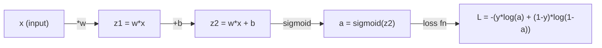
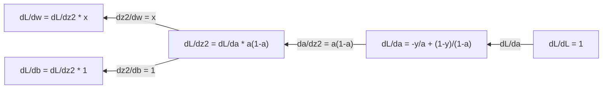
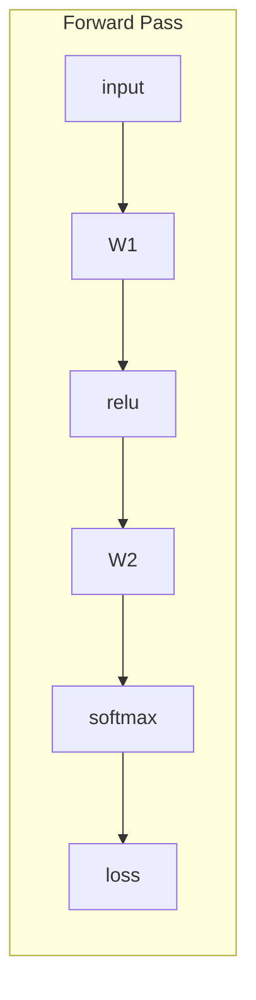
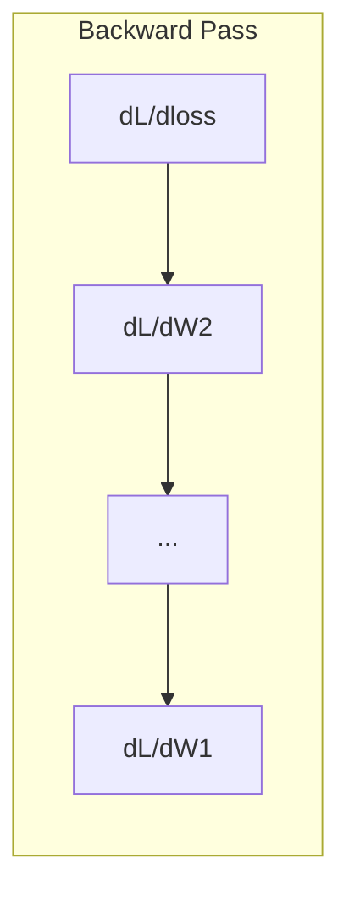

# Apprentissage automatique

> C'est tout ce que vous avez besoin pour apprendre à utiliser le réseau neural.

**Type:** Learn
**Language:**Python
**Prerequisites:** Phase 1, Lessons 01-03
**Time:** ~60 minutes

## Objectif de l'apprentissage

- 计算常见 ML 函数(x^2、sigmoïde、cross-entropie) de la valeur de l'élément et de la valeur de l'élément
- De zéro réaliser la descente gradiente, en 1D et 2D Minimiser la fonction de perte
- 推导 régression linéaire 模型的渐变,并通过手动更新权重来训练它
- Expliquer la matrice hessienne, la série Taylor, les similitudes, ainsi que leur lien avec les méthodes d'optimisation

##  problématique

Vous avez un réseau neural qui contient des millions de poids. Chaque poids est un spin. Vous devez comprendre dans quelle direction chaque spin doit se déplacer pour que les erreurs du modèle soient légèrement inférieures.

没有微积分,训练神经网络就意味着随时尝试各种变化,然后寄希望于好运. 有导数,你就能准确地知道每个权重如何影响错误.  每次,你都能把每个旋转朝正确方向调整.

## 概念

### Qu'est ce que le nombre de guides ?

Pour la fonction y = f(x), la valeur de la fonction f'(x) vous dira: si vous faites avancer x 微小地, y 会变化多少?

D'un point de vue géologique, le nombre de guides est l'inclinaison d'un point sur une ligne.

**f(x) = x^2：**

| x | f(x) | f'(x)（斜率） |
|---|------|---------------|
| 0 | 0    | 0（平坦，在底部） |
| 1 | 1    | 2 |
| 2 | 4    | 4（该点处切线的斜率） |
| 3 | 9    | 6 |

Lorsque x est égal à 2, le taux d'inclinaison est de 4 ⋅ si vous mettez x vers la droite très petit un point, y grandir augmenter ce volume de mouvement de 4 fois ⋅ lorsque x est égal à 0, le taux d'inclinaison est de 0 ⋅ si vous êtes situé au fond de la tasse ⋅

 формально определение:

```
f'(x) = lim   f(x + h) - f(x)
        h->0  -----------------
                     h
```

Dans le code, vous sautez le maximum, directement en utilisant un très petit h.

### 偏导数: une seule fois

La perte de réseau neural dépend des milliers de poids. Les paramètres restent inchangés à l'exception d'une variable, puis se tournent vers cette variable.

```
f(x, y) = x^2 + 3xy + y^2

df/dx = 2x + 3y     (treat y as a constant)
df/dy = 3x + 2y     (treat x as a constant)
```

Chaque particule répond: si je ne fais que réduire ce poids, comment la perte va-t-elle changer ?

### Gradient: vecteur de tous les éléments de la structure

Gradient 会把每个偏导数集合成一个向量──对函数 f ((x, y, z),Gradient est:

```
grad f = [ df/dx, df/dy, df/dz ]
```

Gradient indique la direction la plus élevée. Pour minimiser une fonction, on va vers la direction opposée.

**f(x,y) = x^2 + y^2 的等高线图：**

Cette fonction forme une forme de bowl, égal à la ligne haute est le même.

| 点 | grad f | -grad f（下降方向） |
|-------|--------|----------------------------|
| (1, 1) | [2, 2]（指向上坡，远离最小值） | [-2, -2]（指向下坡，朝向最小值） |
| (0, 0) | [0, 0]（平坦，在最小值处） | [0, 0] |

C'est une descente de gradient dans le tableau.

### Le lien avec l'optimisation

训练 Neural Network 就是优化──你有一个损失函数 L(w1,w2, ..., wn), elle mesure le modèle avec de nombreuses erreurs──你想最小化它──

```
Gradient descent update rule:

  w_new = w_old - learning_rate * dL/dw

For every weight:
  1. Compute the partial derivative of loss with respect to that weight
  2. Subtract a small multiple of it from the weight
  3. Repeat
```

Le taux d'apprentissage  contrôler le pas long― trop grand pour dépasser l'objectif― trop petit pour grimper très lent―

**Loss landscape（1D 切片）：**

La fonction de perte L(w)  Avec la variation du poids w forme une courbe de sommet avec un sommet.

| 特征 | 描述 |
|---------|-------------|
| Global minimum | 整条曲线上的最低点，即最佳解 |
| Local minimum | 比邻近位置更低、但不是整体最低点的谷 |
| Slope | Gradient Descent 会从任意起点沿斜率向下走 |

La dérive progressive se fait en dessous du niveau de l'inclinaison. Elle peut être enfoncée dans les minima locaux, mais dans le grand espace (environ plusieurs millions de poids), c'est rarement un problème réel.

### Numéro de valeur par rapport à résolution

Il y a deux façons de calculer le nombre.

解析方式:手动应用微积分规则──对 f(x) = x^2,导数是 f'(x) = 2x──精确,快速──

Pour calculer le nombre de points, on peut utiliser la définition de la valeur de la valeur de la valeur de la valeur de la valeur de la valeur de la valeur de la valeur de la valeur de la valeur de la valeur de la valeur de la valeur de la valeur de la valeur de la valeur de la valeur de la valeur de la valeur de la valeur de la valeur de la valeur de la valeur de la valeur de la valeur de la valeur de la valeur de la valeur de la valeur de la valeur de la valeur de la valeur de la valeur de la valeur de la valeur de la valeur de la valeur de la valeur de la valeur de la valeur de la valeur de la valeur de la valeur de la valeur de la valeur de la valeur de la valeur de la valeur de la valeur de la valeur de la valeur de la valeur de la valeur de la valeur de la valeur de la valeur de la valeur de la valeur de la valeur de la valeur de la valeur de la valeur de la valeur de la valeur de la valeur de la valeur de la valeur de la valeur de la valeur de la valeur de la valeur de la valeur de la valeur de la valeur de la valeur de la valeur de la valeur de la valeur de la valeur de la valeur de la valeur de la valeur de la valeur de la valeur de la valeur de la valeur de la valeur de la valeur de la valeur de la valeur de la valeur de la valeur de la valeur de la valeur de la valeur de la valeur de la valeur de la valeur de la valeur de la valeur de la valeur de la valeur de la valeur de la valeur de la valeur de la valeur de la valeur de la valeur de la valeur de la valeur de la valeur de la valeur de la valeur de la valeur de la valeur de la valeur de la valeur de la valeur de la valeur de la valeur de la valeur de la valeur de la valeur de la valeur de la valeur de la valeur de la valeur de la valeur de la valeur de la valeur de la valeur de la valeur de la valeur de la valeur de la valeur de la valeur de la valeur de la valeur de la valeur de la valeur de la valeur de la valeur de la valeur de la valeur de la valeur de la valeur de la valeur de la valeur de la valeur de la valeur de la valeur de la valeur.

```
Numerical (central difference):

f'(x) ~= f(x + h) - f(x - h)
          -----------------------
                  2h

h = 0.0001 works well in practice
```

Le nombre de valeurs de la structure est plus lent, mais il est applicable à toute fonction. Le nombre de valeurs de la structure est rapide, mais il a besoin de vous.

### L'indice de la fonction simple

Ce sont les nombres de guides que vous verrez à plusieurs reprises dans le ML.

```
Function        Derivative       Used in
--------        ----------       -------
f(x) = x^2     f'(x) = 2x      Loss functions (MSE)
f(x) = wx + b  f'(w) = x        Linear layer (gradient w.r.t. weight)
                f'(b) = 1        Linear layer (gradient w.r.t. bias)
                f'(x) = w        Linear layer (gradient w.r.t. input)
f(x) = e^x     f'(x) = e^x     Softmax, attention
f(x) = ln(x)   f'(x) = 1/x     Cross-entropy loss
f(x) = 1/(1+e^-x)  f'(x) = f(x)(1-f(x))   Sigmoid activation
```

Pour f (x) = x^2:

```
f(x) = x^2    f'(x) = 2x

  x    f(x)   f'(x)   meaning
  -2    4      -4      slope tilts left (decreasing)
  -1    1      -2      slope tilts left (decreasing)
   0    0       0      flat (minimum!)
   1    1       2      slope tilts right (increasing)
   2    4       4      slope tilts right (increasing)
```

对于 f(w) = wx + b,且 x=3、b=1:

```
f(w) = 3w + 1    f'(w) = 3

The derivative with respect to w is just x.
If x is big, a small change in w causes a big change in output.
```

### 链式法则

Lorsque des fonctions se composent, la loi de la chaîne vous indique comment demander des instructions.

```
If y = f(g(x)), then dy/dx = f'(g(x)) * g'(x)

Example: y = (3x + 1)^2
  outer: f(u) = u^2       f'(u) = 2u
  inner: g(x) = 3x + 1    g'(x) = 3
  dy/dx = 2(3x + 1) * 3 = 6(3x + 1)
```

Le réseau neural est une série de fonction:input -> linéaire -> activation -> linéaire -> activation -> perte。Répagation est de la sortie à la sortie de l'application à la répétition de la chaîne de références‖.

### Matrice hessienne

Gradient 告诉你斜率──Hessian 告诉你曲率──

Le Hessian est un matrice composée de deux phases de particules. Pour les fonctions f ((x1, x2, ..., xn), le Hessian de (i, j) 项是:

```
H[i][j] = d^2f / (dx_i * dx_j)
```

对于二变量函数 f ((x, y):

```
H = | d^2f/dx^2    d^2f/dxdy |
    | d^2f/dydx    d^2f/dy^2 |
```

**Hessian 在临界点（Gradient = 0 的地方）告诉你什么：**

| Hessian 性质 | 含义 | 示例曲面 |
|-----------------|---------|-----------------|
| 正定（所有 eigenvalues > 0） | Local minimum | 向上开口的碗 |
| 负定（所有 eigenvalues < 0） | Local maximum | 向下开口的碗 |
| 不定（eigenvalues 正负混合） | Saddle point | 马鞍形 |

**示例：**f(x, y) = x^2 - y^2(une selle 函数)

```
df/dx = 2x       df/dy = -2y
d^2f/dx^2 = 2    d^2f/dy^2 = -2    d^2f/dxdy = 0

H = | 2   0 |
    | 0  -2 |

Eigenvalues: 2 and -2 (one positive, one negative)
--> Saddle point at (0, 0)
```

Avec f ((x, y) = x^2 + y^2 ((a bowlform function)

```
H = | 2  0 |
    | 0  2 |

Eigenvalues: 2 and 2 (both positive)
--> Local minimum at (0, 0)
```

**为什么 Hessian 在 ML 中重要：**

La méthode de Newton utilise Hessian pour prendre des mesures d'optimisation plus efficaces que la descente gradiente.

```
Newton's update:    w_new = w_old - H^(-1) * gradient
Gradient descent:   w_new = w_old - lr * gradient
```

La méthode de Newton est plus rapide, car l'assemblage hessien se réaccroît à un petit pas de direction, plus grand de direction.

Le problème réside dans le fait que pour un réseau neural avec N 个参数, Hessian est N x N. Un modèle de 100 millions de paramètres nécessite une matrice contenant 1 milliard d'éléments. C'est la raison pour laquelle nous utilisons la méthode approximative.

| 方法 | 使用什么 | 成本 | 收敛 |
|--------|-------------|------|-------------|
| Gradient Descent | 只使用一阶导数 | 每步 O(N) | 慢（线性） |
| Newton's method | 完整 Hessian | 每步 O(N^3) | 快（二次） |
| L-BFGS | 从 Gradient 历史近似 Hessian | 每步 O(N) | 中等（超线性） |
| Adam | 每参数自适应 rate（对角 Hessian 近似） | 每步 O(N) | 中等 |
| Natural gradient | Fisher information matrix（统计 Hessian） | 每步 O(N^2) | 快 |

En pratique, Adam est l'optimisateur par défaut de Deep Learning. Il suit chaque paramètre de la moyenne et de la différence de fonctionnement du gradient, à faible coût approximatif.

### La série Taylor

Toute fonction de plane peut être approximée localement en plusieurs termes:

```
f(x + h) = f(x) + f'(x)*h + (1/2)*f''(x)*h^2 + (1/6)*f'''(x)*h^3 + ...
```

包含的项越多,近似越好, mais seulement au point x 附近成立──

**为什么 Taylor series 对 ML 重要：**

- **一阶 Taylor = Gradient Descent。**Lorsque vous utilisez f(x + h) ~ f(x) + f'(x) *h 时, vous êtes en train de faire une approximation de ligne.

- **二阶 Taylor = Newton's method。**Utilisation f(x + h) ~ f(x) + f'(x) *h + (1/2) *f'(x) *h^2 时, vous obtenez un deuxième modèle── minimisation elle obtiendra h = -f'(x) /f'(x),也就是牛顿的步──

- **Loss Function 设计。**Les émissions de MSE et d'entropie croisée sont étalées, ce qui signifie que leurs élargissements Taylor se sont bien comportés.

```
Approximation order    What it captures    Optimization method
-------------------    -----------------   -------------------
0th order (constant)   Just the value      Random search
1st order (linear)     Slope               Gradient descent
2nd order (quadratic)  Curvature           Newton's method
Higher orders          Finer structure     Rarely used in ML
```

关键洞见是: Toutes les optimisations basées sur le gradient, en substance, sont en fonction locale proche de la perte, et vers la valeur minimale de cette fonction proche.

### ML en moyenne

Le nombre de la ligne vous indique le taux de variation.

Dans le ML, vous avez très peu de calcul manuel, mais ce concept n'existe pas:

**概率。**Pour une densité de p (x) de continuité:
```
P(a < X < b) = integral from a to b of p(x) dx
```
La densité de la courbe de probabilité est située dans la zone de probabilité entre a et b.

**期望值。**按概率加权的平均结果:
```
E[f(X)] = integral of f(x) * p(x) dx
```
La perte attendue sur la distribution des données est un积分―― entraînement minimisé par son expérience approximatif――

**KL divergence。**Œuvre de mesure de deux répartitions différentes:
```
KL(p || q) = integral of p(x) * log(p(x) / q(x)) dx
```
Utilisé pour la distillation des connaissances et l'inférence bayésienne.

**归一化常数。**Dans l'inférence bayésienne:
```
p(w | data) = p(data | w) * p(w) / integral of p(data | w) * p(w) dw
```
La fraction est le résultat de toutes les valeurs de paramètres possibles. Elle est généralement impossible à traiter, c'est pourquoi nous utilisons MCMC et des méthodes similaires comme l'inférence variante.

| 积分概念 | 在 ML 中出现的位置 |
|-----------------|----------------------|
| 曲线下面积 | 由 density functions 得到概率 |
| 期望值 | Loss Functions、risk minimization |
| KL divergence | VAEs、policy optimization、distillation |
| 归一化 | Bayesian posteriors、softmax denominator |
| Marginal likelihood | Model comparison、evidence lower bound (ELBO) |

### Graphe de calcul Le code de la chaîne de plusieurs variables

La loi de la chaîne ne s'applique pas seulement à la fonction de la quantité de signal sur une ligne. Dans le réseau neuronal, la variable se déplace et se concentre.



Pass en arrière 会从右到左计算 Gradient:



Chaque arrow se multiplie par le nombre de directions locales. Le gradient de chaque paramètre est la multiplication de toutes les directions locales sur le chemin de la perte à ce paramètre.

Tout le contenu de la répartition est: de la sortie à l'entrée, systémiquement appliquée dans le graphique de calcul.

### Matrice jacobienne

Lorsqu'une fonction traite un vecteur 映射到 Vector 时((par exemple, la couche de réseau neuronal), son orientation est une matrice。Jacobian 包含每个输出对每个输入的所有偏导数。

Pour f: R^n -> R^m, Jacobian J est une matrice:

| | x1 | x2 | ... | xn |
|---|---|---|---|---|
| f1 | df1/dx1 | df1/dx2 | ... | df1/dxn |
| f2 | df2/dx1 | df2/dx2 | ... | df2/dxn |
| ... | ... | ... | ... | ... |
| fm | dfm/dx1 | dfm/dx2 | ... | dfm/dxn |

Vous ne serez pas en mesure de calculer le Jacobian pour le réseau neural. PyTorch le traitera. Mais sachant qu'il existe, vous aidera à comprendre la forme de la Backpropagation. Si une couche met R^n en R^m, son Jacobian est m x n. Gradient va passer par le transfert vers l'arrière de cette matrice.

### Pourquoi c' est important pour le réseau neuronal ?

Chaque poids de réseau neural obtient un gradient. Le gradient vous indique comment régler ce poids pour réduire les pertes.





Chaque fois que vous avez le droit de le faire:
- `W1 = W1 - lr * dL/dW1`
- `W2 = W2 - lr * dL/dW2`

Passage en avant 计算预测和损失──passage en arrière 计算 Loss 相对每权重的格里亚因──然后每权重都向下坡方向迈一小步──重复数百万步──这就是深度学习──


```figure
derivative-tangent
```

## - Je le construis.

### 步骤 1: réaliser à partir de zéro la valeur de la valeur

```python
def numerical_derivative(f, x, h=1e-7):
    return (f(x + h) - f(x - h)) / (2 * h)

def f(x):
    return x ** 2

for x in [-2, -1, 0, 1, 2]:
    numerical = numerical_derivative(f, x)
    analytical = 2 * x
    print(f"x={x:2d}  f'(x) numerical={numerical:.6f}  analytical={analytical:.1f}")
```

Les valeurs de la valeur et de la valeur de la résolution correspondent à de nombreux nombres.

### 步骤 2: dérivation du nombre de points et degré

```python
def numerical_gradient(f, point, h=1e-7):
    gradient = []
    for i in range(len(point)):
        point_plus = list(point)
        point_minus = list(point)
        point_plus[i] += h
        point_minus[i] -= h
        partial = (f(point_plus) - f(point_minus)) / (2 * h)
        gradient.append(partial)
    return gradient

def f_multi(point):
    x, y = point
    return x**2 + 3*x*y + y**2

grad = numerical_gradient(f_multi, [1.0, 2.0])
print(f"Numerical gradient at (1,2): {[f'{g:.4f}' for g in grad]}")
print(f"Analytical gradient at (1,2): [2*1+3*2, 3*1+2*2] = [{2*1+3*2}, {3*1+2*2}]")
```

### 步骤 3: avec la descente gradiente 找到 f(x) = x^2 de la valeur minimale

```python
x = 5.0
lr = 0.1
for step in range(20):
    grad = 2 * x
    x = x - lr * grad
    print(f"step {step:2d}  x={x:8.4f}  f(x)={x**2:10.6f}")
```

De x = 5                                                                                                                                                                                                                                                                                                                                                                                                                                                                                                                          

### 步骤 4: Exécuter la descente gradiente sur une fonction 2D

```python
def f_2d(point):
    x, y = point
    return x**2 + y**2

point = [4.0, 3.0]
lr = 0.1
for step in range(30):
    grad = numerical_gradient(f_2d, point)
    point = [p - lr * g for p, g in zip(point, grad)]
    loss = f_2d(point)
    if step % 5 == 0 or step == 29:
        print(f"step {step:2d}  point=({point[0]:7.4f}, {point[1]:7.4f})  f={loss:.6f}")
```

### Étape 5: Comparer les valeurs de référence et les valeurs de référence

```python
import math

test_functions = [
    ("x^2",      lambda x: x**2,          lambda x: 2*x),
    ("x^3",      lambda x: x**3,          lambda x: 3*x**2),
    ("sin(x)",   lambda x: math.sin(x),   lambda x: math.cos(x)),
    ("e^x",      lambda x: math.exp(x),   lambda x: math.exp(x)),
    ("1/x",      lambda x: 1/x,           lambda x: -1/x**2),
]

x = 2.0
print(f"{'Function':<12} {'Numerical':>12} {'Analytical':>12} {'Error':>12}")
print("-" * 50)
for name, f, df in test_functions:
    num = numerical_derivative(f, x)
    ana = df(x)
    err = abs(num - ana)
    print(f"{name:<12} {num:12.6f} {ana:12.6f} {err:12.2e}")
```

### 步骤 6: calcul de la valeur en hessien

```python
def hessian_2d(f, x, y, h=1e-5):
    fxx = (f(x + h, y) - 2 * f(x, y) + f(x - h, y)) / (h ** 2)
    fyy = (f(x, y + h) - 2 * f(x, y) + f(x, y - h)) / (h ** 2)
    fxy = (f(x + h, y + h) - f(x + h, y - h) - f(x - h, y + h) + f(x - h, y - h)) / (4 * h ** 2)
    return [[fxx, fxy], [fxy, fyy]]

def saddle(x, y):
    return x ** 2 - y ** 2

def bowl(x, y):
    return x ** 2 + y ** 2

H_saddle = hessian_2d(saddle, 0.0, 0.0)
H_bowl = hessian_2d(bowl, 0.0, 0.0)
print(f"Saddle Hessian: {H_saddle}")  # [[2, 0], [0, -2]] -- mixed signs
print(f"Bowl Hessian:   {H_bowl}")    # [[2, 0], [0, 2]]  -- both positive
```

la fonction de la selle  Hessian a des valeurs propres 2 和 -2(符号混合,确认是 Saddle Point) ・・・ bowl 函数有 eigenvalues 2 和 2(均为正,确认是最小) ・・・

### 步骤 7:Taylor 近似的实际效果

```python
import math

def taylor_approx(f, f_prime, f_double_prime, x0, h, order=2):
    result = f(x0)
    if order >= 1:
        result += f_prime(x0) * h
    if order >= 2:
        result += 0.5 * f_double_prime(x0) * h ** 2
    return result

x0 = 0.0
for h in [0.1, 0.5, 1.0, 2.0]:
    true_val = math.sin(h)
    t1 = taylor_approx(math.sin, math.cos, lambda x: -math.sin(x), x0, h, order=1)
    t2 = taylor_approx(math.sin, math.cos, lambda x: -math.sin(x), x0, h, order=2)
    print(f"h={h:.1f}  sin(h)={true_val:.4f}  order1={t1:.4f}  order2={t2:.4f}")
```

Dans le cas de la plus petite h, cette approche est très bonne, mais dans le cas de la plus grande h, elle ne fonctionne pas.

### Étape 8: Pourquoi c' est important pour le réseau neuronal

```python
import random

random.seed(42)

w = random.gauss(0, 1)
b = random.gauss(0, 1)
lr = 0.01

xs = [1.0, 2.0, 3.0, 4.0, 5.0]
ys = [3.0, 5.0, 7.0, 9.0, 11.0]

for epoch in range(200):
    total_loss = 0
    dw = 0
    db = 0
    for x, y in zip(xs, ys):
        pred = w * x + b
        error = pred - y
        total_loss += error ** 2
        dw += 2 * error * x
        db += 2 * error
    dw /= len(xs)
    db /= len(xs)
    total_loss /= len(xs)
    w -= lr * dw
    b -= lr * db
    if epoch % 40 == 0 or epoch == 199:
        print(f"epoch {epoch:3d}  w={w:.4f}  b={b:.4f}  loss={total_loss:.6f}")

print(f"\nLearned: y = {w:.2f}x + {b:.2f}")
print(f"Actual:  y = 2x + 1")
```

Chaque cycle de formation basé sur le gradient suit ce modèle: prédiction, calcul de perte, calcul du gradient, modification du poids.

## Utilisez-le

Utilisez NumPy 时, la même opération sera plus rapide, plus simple:

```python
import numpy as np

x = np.array([1, 2, 3, 4, 5], dtype=float)
y = np.array([3, 5, 7, 9, 11], dtype=float)

w, b = np.random.randn(), np.random.randn()
lr = 0.01

for epoch in range(200):
    pred = w * x + b
    error = pred - y
    loss = np.mean(error ** 2)
    dw = np.mean(2 * error * x)
    db = np.mean(2 * error)
    w -= lr * dw
    b -= lr * db

print(f"Learned: y = {w:.2f}x + {b:.2f}")
```

Vous avez juste construit Gradient Descent depuis le zéro. PyTorch va compléter automatiquement Gradient  calcul, mais le cycle de mise à jour est le même.

## 练习

1. Utilisation à deux reprises`numerical_derivative`Comment réaliser `numerical_second_derivative(f, x)` L'essai x^3 dans x=2 est de 12 ⋅
2. Utilisation de la dérive de la dérive de la dérive de la dérive de la dérive de la dérive de la dérive de la dérive de la dérive de la dérive de la dérive de la dérive de la dérive de la dérive de la dérive de la dérive de la dérive de la dérive de la dérive de la dérive de la dérive de la dérive de la dérive de la dérive de la dérive de la dérive de la dérive de la dérive de la dérive de la dérive de la dérive de la dérive de la dérive de la dérive de la dérive de la dérive de la dérive de la dérive de la dérive de la dérive de la dérive de la dérive de la dérive de la dérive de la dérive de la dérive de la dérive de la dérive de la dérive de la dérive de la dérive de la dérive de la dérive de la dérive de la dérive de la dérive de la dérive de la dérive de la dérive de la dérive de la dérive de la dérive de la dérive de la dérive de la dérive de la dérive de la dérive de la dérive de la dérive de la dérive de la dérive de la dérive de la dérive de la dérive de la dérive de la dérive de la dérive de la dérive de la dérive de la dérive de la dérive de la dérive de la dérive de la dérive de la dérive de la dérive de la dérive de la dérive de la dérive de la dérive de la dérive de la dérive de la dérive de la dérive de la dérive de la dérive de la dérive de la dérive de la dérive de la dérive de la dérive de la dérive de la dérive de la dérive de la dérive de la dérive de la dérive de la dérive de la dérive de la dérive de la dérive de la dérive de la dérive de la dérive de la dérive de la dérive de la dérive de la dérive de la dérive de la dérive de la dérive de la dérive de la dérive de la dérive de la dérive de la dérive de la dé
3. Dans le cycle de déclin gradient, rejoignez l'élan:维护一个会累积过去 Le vecteur de vitesse du gradient f (x) = x^4 - 3x^2 上比较有没有动态的收速度──

## 关键术语

| 术语 | 人们常说 | 实际含义 |
|------|----------------|----------------------|
| Derivative | “斜率” | 函数在某一点的变化率。告诉你输入每变化一个单位，输出会变化多少。 |
| Partial derivative | “一个变量的导数” | 在保持其他所有变量不变时，对某一个变量求导。 |
| Gradient | “最陡上升方向” | 由所有偏导数组成的 Vector。指向让函数增长最快的方向。 |
| Gradient Descent | “往下坡走” | 从参数中减去 Gradient（乘以 learning rate），从而降低 Loss。Neural Network 训练的核心。 |
| Learning rate | “步长” | 控制每一步 Gradient Descent 有多大的标量。太大：发散。太小：收敛缓慢。 |
| Chain rule | “把导数相乘” | 对复合函数求导的规则：df/dx = df/dg * dg/dx。Backpropagation 的数学基础。 |
| Jacobian | “导数 Matrix” | 当一个函数把 Vector 映射到 Vector 时，Jacobian 是所有输出相对于输入的偏导数组成的 Matrix。 |
| Numerical derivative | “有限差分” | 通过在两个相邻点上评估函数并计算它们之间的斜率来近似导数。 |
| Backpropagation | “Reverse-mode autodiff” | 使用链式法则，从输出到输入逐层计算 Gradient。Neural Network 就是这样学习的。 |
| Hessian | “二阶导数 Matrix” | 所有二阶偏导数组成的 Matrix。描述函数的曲率。在临界点处 Hessian 正定意味着 local minimum。 |
| Taylor series | “多项式近似” | 使用函数的导数在某一点附近近似函数：f(x+h) ~ f(x) + f'(x)h + (1/2)f''(x)h^2 + ... 它是理解 Gradient Descent 和 Newton's method 为什么有效的基础。 |
| Integral | “曲线下面积” | 某个量在一个范围内的累积。在 ML 中，积分定义概率、期望值和 KL divergence。 |

## 延伸阅读

- [3Blue1Brown: Essence of Calculus](https://www.3blue1brown.com/topics/calculus)-                                                                                                                                                                                                                                                                                                                                                                                                                                                                                                                             
- [Stanford CS231n: Backpropagation](https://cs231n.github.io/optimization-2/)- Gradient  comment se déplace la couche de réseau neuronal
