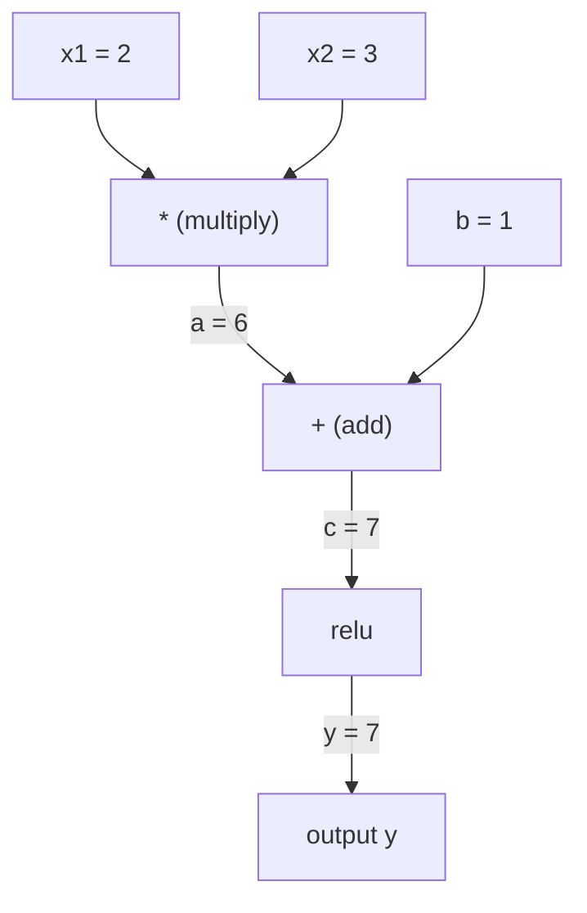
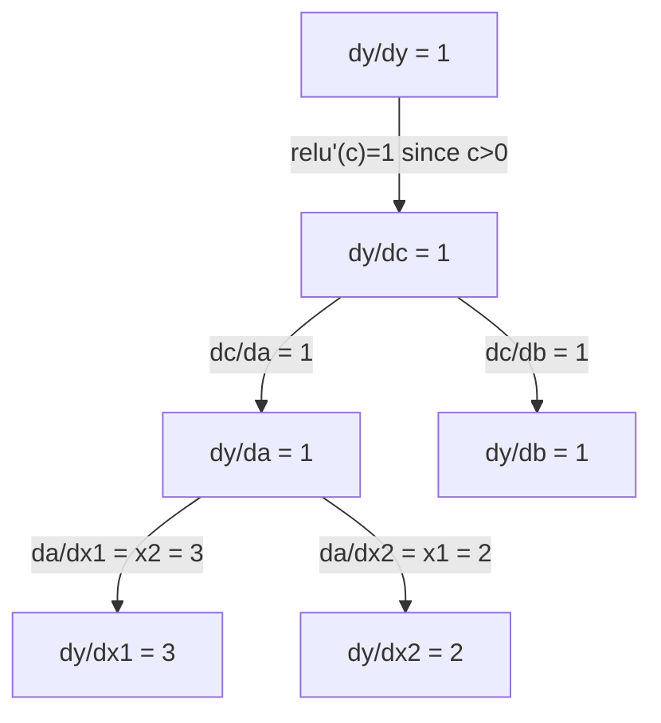

# Règlement de la chaîne et différenciation automatique

> La règle de la chaîne est le moteur de chaque réseau neural capable d'apprendre.

**类型：**Construire
**语言：**Python
**前置要求：**Phase 1, leçon 04 (Dérivatifs et gradients)
**时间：**À environ 90 minutes.

## Objectif de l'apprentissage

- 构建一个极简 autograd 引擎(Value class),记录操作并通过逆模式自动调动 计算 Gradient
- Utilisation de type topologique dans le graphique de calcul 中实现前和后传
-  Utiliser uniquement un moteur de mise à niveau automatique réalisé à partir de zéro, construire et entraîner un percepteur multi-couches sur XOR
- Utilisation de la vérification des gradients, des différences de valeur finie par rapport à la valeur de la valeur, vérification de la validité

##  problématique

Vous pouvez calculer le nombre de lignes directrices de simples fonctions. Mais le réseau neural n'est pas une simple fonction. Il est composé de centaines de compositions de fonctions: matrice multiplie, ajouter biais, appliquer activation, multiplier à nouveau la matrice, douceur max, perte de croisée entropie.

Pour entraîner le réseau, vous devez perdre par rapport à chaque gradient de poids. Pour des millions de manuels de paramètres, il est impossible de le faire.

Règle de chaîne  donner une base mathématique。 Différence automatique  donner un algorithme。 Deuxièmement, combiner, vous permettre de traverser tout ensemble de fonctions calculant un gradient précis en temps réel avec un passage à l'avant 成正比的时间内──

C'est le travail de PyTorch, TensorFlow et JAX. Vous allez construire une version micro à partir de zéro.

## 核心概念

### Règlement de la chaîne

Si `y = f(g(x))`Alors ...`y`Par rapport à`x`Le nombre de conducteurs est:

```
dy/dx = dy/dg * dg/dx = f'(g(x)) * g'(x)
```

沿着链条将导数相乘―― Chaque élément contribue à sa propre direction local――

Pour le cas:`y = sin(x^2)`

```
g(x) = x^2       g'(x) = 2x
f(g) = sin(g)     f'(g) = cos(g)

dy/dx = cos(x^2) * 2x
```

Pour la composition plus profonde, la chaîne se poursuit:

```
y = f(g(h(x)))

dy/dx = f'(g(h(x))) * g'(h(x)) * h'(x)
```

Chaque couche du réseau neural est une partie de cette chaîne.

### Graphiques de calcul

Le graphe de calcul 让链规则可视化──每个操作都将成为一个节点──数据沿图向前流动──渐进向后流动──

**Forward pass（计算值）：**



**Backward pass（计算 Gradient）：**



Le passage arrière sera appliqué à chaque point de la règle de la chaîne, la gradient de la sortie de propagation à l'entrée.

### Modèle avant vers le mode arrière

Il y a deux façons d'appliquer la règle de chaîne sur le graphique.

**Forward mode**De l'entrée en arrière, le nombre sera orienté vers l'avant.`dx/dx = 1`, et par chaque opération de diffusion.

```
Forward mode: seed dx/dx = 1, propagate forward

  x = 2       (dx/dx = 1)
  a = x^2     (da/dx = 2x = 4)
  y = sin(a)  (dy/dx = cos(a) * da/dx = cos(4) * 4 = -2.615)
```

**Reverse mode**De la sortie à la sortie, le gradient vers le retrait.`dy/dy = 1`, et en ordre inversé par chaque opération de propagation, pour adapter les situations de plus en plus petites.

```
Reverse mode: seed dy/dy = 1, propagate backward

  y = sin(a)  (dy/dy = 1)
  a = x^2     (dy/da = cos(a) = cos(4) = -0.654)
  x = 2       (dy/dx = dy/da * da/dx = -0.654 * 4 = -2.615)
```

Le réseau neural a plusieurs millions d'entrées et de pertes. Le mode inverse peut être utilisé en une seule fois.

| Mode | Seed | Direction | Best when |
|------|------|-----------|-----------|
| Forward | `dx_i/dx_i = 1` | 输入到输出 | 输入少、输出多 |
| Reverse | `dy/dy = 1` | 输出到输入 | 输入多、输出少（neural nets） |

### Utilisé en mode avant pour les doubles numéros

Le mode avant peut être réalisé en utilisant des nombres doubles.`a + b*epsilon`, parmi lesquels `epsilon^2 = 0`Il y a une autre.

```
Dual number: (value, derivative)

(2, 1) means: value is 2, derivative w.r.t. x is 1

Arithmetic rules:
  (a, a') + (b, b') = (a+b, a'+b')
  (a, a') * (b, b') = (a*b, a'*b + a*b')
  sin(a, a')         = (sin(a), cos(a)*a')
```

Le nombre de variables d'entrée sera de 1 à 1 ⋅ ⋅ ⋅ ⋅ ⋅ ⋅ ⋅ ⋅ ⋅ ⋅ ⋅ ⋅ ⋅ ⋅ ⋅ ⋅ ⋅ ⋅ ⋅ ⋅ ⋅ ⋅ ⋅ ⋅ ⋅ ⋅ ⋅ ⋅ ⋅ ⋅ ⋅ ⋅ ⋅ ⋅ ⋅ ⋅ ⋅ ⋅ ⋅ ⋅ ⋅ ⋅ ⋅ ⋅ ⋅ ⋅ ⋅ ⋅ ⋅ ⋅ ⋅ ⋅ ⋅ ⋅ ⋅ ⋅ ⋅ ⋅ ⋅ ⋅ ⋅ ⋅ ⋅ ⋅ ⋅ ⋅ ⋅ ⋅ ⋅ ⋅ ⋅ ⋅ ⋅ ⋅ ⋅ ⋅ ⋅ ⋅ ⋅ ⋅ ⋅ ⋅ ⋅ ⋅ ⋅ ⋅ ⋅ ⋅ ⋅ ⋅ ⋅ ⋅ ⋅ ⋅ ⋅ ⋅ ⋅ ⋅ ⋅ ⋅ ⋅ ⋅ ⋅ ⋅ ⋅ ⋅ ⋅ ⋅ ⋅ ⋅ ⋅ ⋅ ⋅ ⋅ ⋅ ⋅ ⋅ ⋅                                                                                                                                                                                                                                                                      

### 构建 Autograd 引擎

Un moteur auto-grader a besoin de trois choses:

1. **Value wrapping。**Envelopper chaque chiffre dans un objet, pour stocker sa valeur et son gradient.
2. **Graph recording。**Chaque opération enregistre ses entrées et localisations Gradient  Function
3. **Backward pass。**Pour le graphe faire une sorte topologique, puis revers vers travers, à chaque point appliquer la règle de chaîne.

C' est la PyTorch.`autograd`Ce qu'il faut faire.`torch.Tensor`classe 包裹值, dans `requires_grad=True`时记录操作, et vous调用 `.backward()`时计算 Gradient。

### PyTorch Autograd 底层如何工作

Quand tu écrivais PyTorch code:

```python
x = torch.tensor(2.0, requires_grad=True)
y = x ** 2 + 3 * x + 1
y.backward()
print(x.grad)  # 7.0 = 2*x + 3 = 2*2 + 3
```

PyTorch dans l'intérieur:

1. Pour`x`Créer une`Tensor`节点,并设置 `requires_grad=True`
2. Chaque opération`**`- Je suis là.`*`- Je suis là.`+`) tous vont créer un nouveau nœud,并记录后退 函数
3. `y.backward()`触发对已记录图的反转模式自动调节
4. Chaque point de l'`grad_fn`计算局部 Gradient,并将它们传递给父节点
5. Gradient 通过加法(不是替换) accumulé jusqu' à `.grad`属性中

Ce graphique est un modèle de contrôle de chaque passage en avant, et c'est la raison pour laquelle PyTorch utilise le flux de contrôle dans le modèle.


```figure
chain-rule
```

## - Je le construis.

### 步骤 1:Classe de valeur

```python
class Value:
    def __init__(self, data, children=(), op=''):
        self.data = data
        self.grad = 0.0
        self._backward = lambda: None
        self._prev = set(children)
        self._op = op

    def __repr__(self):
        return f"Value(data={self.data:.4f}, grad={self.grad:.4f})"
```

Chaque .`Value`Ils stockent leurs propres données numériques, Gradient, une fonction arrière, ainsi que les points de référence de ses nœuds enfants.

### 步骤 2: avec suivi des degrés de l'opération d' calcul

```python
    def __add__(self, other):
        other = other if isinstance(other, Value) else Value(other)
        out = Value(self.data + other.data, (self, other), '+')
        def _backward():
            self.grad += out.grad
            other.grad += out.grad
        out._backward = _backward
        return out

    def __mul__(self, other):
        other = other if isinstance(other, Value) else Value(other)
        out = Value(self.data * other.data, (self, other), '*')
        def _backward():
            self.grad += other.data * out.grad
            other.grad += self.data * out.grad
        out._backward = _backward
        return out

    def relu(self):
        out = Value(max(0, self.data), (self,), 'relu')
        def _backward():
            self.grad += (1.0 if out.data > 0 else 0.0) * out.grad
        out._backward = _backward
        return out
```

Chaque opération créera une fermeture, il sait comment calculer le degré local,并乘以上游 Gradient(`out.grad`)。`+=`处理 est la situation où une valeur est utilisée par plusieurs opérateurs.

### 步骤 3: Pass rétrograde

```python
    def backward(self):
        topo = []
        visited = set()
        def build_topo(v):
            if v not in visited:
                visited.add(v)
                for child in v._prev:
                    build_topo(child)
                topo.append(v)
        build_topo(self)

        self.grad = 1.0
        for v in reversed(topo):
            v._backward()
```

Type topologique  assurer chaque point de Gradient dans la propagation à ses noeuds enfants 之前已完整计算──种子 Gradient est 1.0(dy/dy = 1)──

### Étape 4: plus d'opération nécessaire pour un moteur complet

基础 Value class 支持加法、乘法和 relu──真正的自升级 引擎需要更多能力──下面是构建神经网络所需的操作:

```python
    def __neg__(self):
        return self * -1

    def __sub__(self, other):
        return self + (-other)

    def __radd__(self, other):
        return self + other

    def __rmul__(self, other):
        return self * other

    def __rsub__(self, other):
        return other + (-self)

    def __pow__(self, n):
        out = Value(self.data ** n, (self,), f'**{n}')
        def _backward():
            self.grad += n * (self.data ** (n - 1)) * out.grad
        out._backward = _backward
        return out

    def __truediv__(self, other):
        return self * (other ** -1) if isinstance(other, Value) else self * (Value(other) ** -1)

    def exp(self):
        import math
        e = math.exp(self.data)
        out = Value(e, (self,), 'exp')
        def _backward():
            self.grad += e * out.grad
        out._backward = _backward
        return out

    def log(self):
        import math
        out = Value(math.log(self.data), (self,), 'log')
        def _backward():
            self.grad += (1.0 / self.data) * out.grad
        out._backward = _backward
        return out

    def tanh(self):
        import math
        t = math.tanh(self.data)
        out = Value(t, (self,), 'tanh')
        def _backward():
            self.grad += (1 - t ** 2) * out.grad
        out._backward = _backward
        return out
```

**每个操作为什么重要：**

| Operation | Backward rule | Used in |
|-----------|--------------|---------|
| `__sub__` | 复用 add + neg | Loss 计算（pred - target） |
| `__pow__` | n * x^(n-1) | Polynomial activations、MSE（error^2） |
| `__truediv__` | 复用 mul + pow(-1) | Normalization、learning rate scaling |
| `exp` | exp(x) * upstream | Softmax、log-likelihood |
| `log` | (1/x) * upstream | Cross-entropy loss、log probabilities |
| `tanh` | (1 - tanh^2) * upstream | 经典 activation function |

Il y a des choses à faire:`__sub__`et `__truediv__`Elles obtiennent automatiquement le bon gradient, car la règle de chaîne va passer par le plus bas de l'add/mul/pow.

### étape 5: réalisation mini MLP à partir de zéro

Avec une classe de valeurs complète, on peut construire un réseau neuronal.

```python
import random

class Neuron:
    def __init__(self, n_inputs):
        self.w = [Value(random.uniform(-1, 1)) for _ in range(n_inputs)]
        self.b = Value(0.0)

    def __call__(self, x):
        act = sum((wi * xi for wi, xi in zip(self.w, x)), self.b)
        return act.tanh()

    def parameters(self):
        return self.w + [self.b]

class Layer:
    def __init__(self, n_inputs, n_outputs):
        self.neurons = [Neuron(n_inputs) for _ in range(n_outputs)]

    def __call__(self, x):
        return [n(x) for n in self.neurons]

    def parameters(self):
        return [p for n in self.neurons for p in n.parameters()]

class MLP:
    def __init__(self, sizes):
        self.layers = [Layer(sizes[i], sizes[i+1]) for i in range(len(sizes)-1)]

    def __call__(self, x):
        for layer in self.layers:
            x = layer(x)
        return x[0] if len(x) == 1 else x

    def parameters(self):
        return [p for layer in self.layers for p in layer.parameters()]
```

Une .`Neuron`计算 `tanh(w1*x1 + w2*x2 + ... + b)`Une.`Layer`C'est une neurone.`MLP`Il y a plusieurs couches de poids.`Value`, donc调用 `loss.backward()`La progression se répand à chaque paramètre.

**在 XOR 上训练：**

```python
random.seed(42)
model = MLP([2, 4, 1])  # 2 inputs, 4 hidden neurons, 1 output

xs = [[0, 0], [0, 1], [1, 0], [1, 1]]
ys = [-1, 1, 1, -1]  # XOR pattern (using -1/1 for tanh)

for step in range(100):
    preds = [model(x) for x in xs]
    loss = sum((p - y) ** 2 for p, y in zip(preds, ys))

    for p in model.parameters():
        p.grad = 0.0
    loss.backward()

    lr = 0.05
    for p in model.parameters():
        p.data -= lr * p.grad

    if step % 20 == 0:
        print(f"step {step:3d}  loss = {loss.data:.4f}")

print("\nPredictions after training:")
for x, y in zip(xs, ys):
    print(f"  input={x}  target={y:2d}  pred={model(x).data:6.3f}")
```

C'est le micrograd. Une formation en réseau neural complet réalisée avec Python et une différenciation automatique.

### 步骤 6: vérification du degré

Comment savoir si votre auto-diff est correct ?

```python
def gradient_check(build_expr, x_val, h=1e-7):
    x = Value(x_val)
    y = build_expr(x)
    y.backward()
    autodiff_grad = x.grad

    y_plus = build_expr(Value(x_val + h)).data
    y_minus = build_expr(Value(x_val - h)).data
    numerical_grad = (y_plus - y_minus) / (2 * h)

    diff = abs(autodiff_grad - numerical_grad)
    return autodiff_grad, numerical_grad, diff
```

Dans une expression complexe, il est dit:

```python
def expr(x):
    return (x ** 3 + x * 2 + 1).tanh()

ad, num, diff = gradient_check(expr, 0.5)
print(f"Autodiff:  {ad:.8f}")
print(f"Numerical: {num:.8f}")
print(f"Difference: {diff:.2e}")
# Difference should be < 1e-5
```

实现新操作时,gradient checking 至关重要――如果你的倒退通过有 bug,数值检查会发现它――每个严的深度学习 实现都会在开发期间运行梯度检查――

**什么时候使用 gradient checking：**

| Situation | Do gradient check? |
|-----------|-------------------|
| 向 autograd 添加新操作 | 是，始终要做 |
| 调试无法收敛的训练循环 | 是，先检查 Gradient |
| 生产训练 | 否，太慢（每个参数需要 2 次 forward pass） |
| autograd 代码的 unit tests | 是，将它自动化 |

### Étape 7: vérification des résultats du calcul

```python
x1 = Value(2.0)
x2 = Value(3.0)
a = x1 * x2          # a = 6.0
b = a + Value(1.0)    # b = 7.0
y = b.relu()          # y = 7.0

y.backward()

print(f"y = {y.data}")          # 7.0
print(f"dy/dx1 = {x1.grad}")   # 3.0 (= x2)
print(f"dy/dx2 = {x2.grad}")   # 2.0 (= x1)
```

Je suis en train de vous dire:`y = relu(x1*x2 + 1)`❖ Parce que`x1*x2 + 1 = 7 > 0`Le relou est l'identité.
`dy/dx1 = x2 = 3`Il y a une autre.`dy/dx2 = x1 = 2`Les résultats de l'engin sont conformes.

## Utilisez-le

### Avec PyTorch 验证

```python
import torch

x1 = torch.tensor(2.0, requires_grad=True)
x2 = torch.tensor(3.0, requires_grad=True)
a = x1 * x2
b = a + 1.0
y = torch.relu(b)
y.backward()

print(f"PyTorch dy/dx1 = {x1.grad.item()}")  # 3.0
print(f"PyTorch dy/dx2 = {x2.grad.item()}")  # 2.0
```

Gradient 相同── Your Engine Calculation Result with PyTorch 一致, parce que la base mathématique est la même: à travers la règle de la chaîne 实现 inverse-mode autodiff―

### Une expression plus complexe

```python
a = Value(2.0)
b = Value(-3.0)
c = Value(10.0)
f = (a * b + c).relu()  # relu(2*(-3) + 10) = relu(4) = 4

f.backward()
print(f"df/da = {a.grad}")  # -3.0 (= b)
print(f"df/db = {b.grad}")  #  2.0 (= a)
print(f"df/dc = {c.grad}")  #  1.0
```

## 交付内容

Le cours est ouvert à:
- `outputs/skill-autodiff.md`-- une compétence pour la construction et le contrôle des systèmes d'autogradation
- `code/autodiff.py`-- un moteur de développement automatique

La classe de valeur de cette construction est la base du cycle d'entraînement du réseau neuronal de la phase 3.

## 练习

1. À la classe de valeur 添加 `__pow__`Tu peux compter .`x ** n`                                                                                                                                                                                                                                                              `x=2`时,`d/dx(x^3)`Ça va .`12.0`Il y a une autre.

2. 添加 `tanh`作为激活函数──验证 `tanh'(0) = 1`且 `tanh'(2) = 0.0707`(valeur proche)

3. Pour un seul neurone , construire un graphique de calcul:`y = relu(w1*x1 + w2*x2 + b)`△ calculs de tous les cinq degrés,并与 PyTorch 验证──

4. Utilisez des nombres doubles pour réaliser l'autodéfinition en mode avancé.`Dual`classe,并验证 il donne le même nombre de directions que le moteur en mode inverse.

## 关键术语

| Term | What people say | What it actually means |
|------|----------------|----------------------|
| Chain rule | “把导数相乘” | 组合函数的导数等于每个函数在正确位置处的局部导数之积 |
| Computational graph | “网络图” | 一个有向无环图，其中节点是操作，边承载值（forward）或 Gradient（backward） |
| Forward mode | “向前推导数” | 将导数从输入传播到输出的 autodiff。每个输入变量需要一次 pass。 |
| Reverse mode | “Backpropagation” | 将 Gradient 从输出传播到输入的 autodiff。每个输出变量需要一次 pass。 |
| Autograd | “自动 Gradient” | 一个系统：记录对值执行的操作、构建 graph，并通过 Chain Rule 计算精确 Gradient |
| Dual numbers | “值加导数” | 形式为 a + b*epsilon（epsilon^2 = 0）的数字，可以在算术运算中携带导数信息 |
| Topological sort | “依赖顺序” | 对 graph 节点排序，使每个节点都位于其所有依赖之后。正确传播 Gradient 所必需。 |
| Gradient accumulation | “相加，不要替换” | 当一个值流入多个操作时，它的 Gradient 是所有传入 Gradient 贡献的总和 |
| Dynamic graph | “Define by run” | 每次 forward pass 都重新构建的 computation graph，允许模型内部使用 Python 控制流（PyTorch 风格） |
| Gradient checking | “数值验证” | 将 autodiff Gradient 与数值 finite-difference Gradient 对比，以验证正确性。调试时必不可少。 |
| MLP | “Multi-layer perceptron” | 一个包含一层或多层隐藏 neuron 的 Neural Network。每个 neuron 计算加权和加 bias，然后应用 activation function。 |
| Neuron | “加权和 + activation” | 基本单元：output = activation(w1*x1 + w2*x2 + ... + b)。weights 和 bias 是可学习参数。 |

## 延伸阅读

- [3Blue1Brown: Backpropagation calculus](https://www.youtube.com/watch?v=tIeHLnjs5U8)-- La réflexion visuelle de la règle de la chaîne au sein du réseau neuronal
- [PyTorch Autograd mechanics](https://pytorch.org/docs/stable/notes/autograd.html)-- vraiment système de travail
- [Baydin et al., Automatic Differentiation in Machine Learning: a Survey](https://arxiv.org/abs/1502.05767)-- 综合参考
