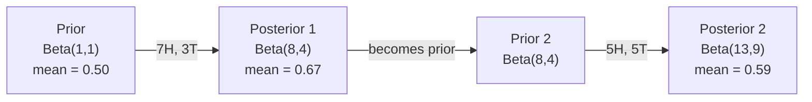

# Le théorème de Bayes

> La probabilité est la préoccupation de ce que vous attendez de vous. Le théorème de Bayes est la préoccupation de ce que vous avez appris.

**类型：**Construire
**语言：**Python
**前置要求：**Phase 1, leçon 06 (Fondamentaux de la probabilité)
**时间：**- 75 minutes

## Objectif de l'apprentissage

- Applique le théorème de Bayes, selon la probabilité antérieure et les preuves
- De la conception à partir de zéro un avec un Laplace lissage et le calcul de l'espace log Naïf Bayes 文本分类器
- Comparer les estimations MLE et MAP,并解释MAP 如何应对L2 régularisation
- Utilisation de précurseurs conjugués bêta-binomial pour les tests A/B  réaliser la mise à jour séquentielle bayésienne

##  problématique

Un examen médical a une précision de 99%... vos résultats sont positifs... quelle est la probabilité que vous soyez vraiment malade ?

La plupart des gens diront que 99%... la vraie réponse dépend de la rareté de cette maladie... si seulement 1 personne sur 10 000 est malade, alors un résultat positif signifie seulement que vous avez environ 1% de probabilité de maladie... les autres 99% des résultats positifs sont des erreurs de santé...

C'est le théorème de Bayes. Chaque filtre de spam, chaque diagnostic médical, chaque modèle de mécanique d'incertitude, utilise la même hypothèse.

Si vous ne comprenez pas cela, construisez un système de gestion de machines à sous, vous comprenez mal les résultats des modèles, vous définissez de mauvais seuils et publiez des prédictions trop confiantes.

## 概念

### De la probabilité commune à Bayes

Vous savez déjà dans la leçon 06 que la probabilité conditionnelle est:

```
P(A|B) = P(A and B) / P(B)
```

Pour la première fois:

```
P(B|A) = P(A and B) / P(A)
```

两个表达式共享同一个分子:P(A et B)。令它们相等并重新整理:

```
P(A and B) = P(A|B) * P(B) = P(B|A) * P(A)

Therefore:

P(A|B) = P(B|A) * P(A) / P(B)
```

C'est le théorème de Bayes.

### Quatre parties

| Part | Name | What it means |
|------|------|---------------|
| P(A\|B) | Posterior | 看到 evidence B 之后，你对 A 的更新后 belief |
| P(B\|A) | Likelihood | 如果 A 为真，evidence B 出现的概率有多大 |
| P(A) | Prior | 在看到任何 evidence 之前，你对 A 的 belief |
| P(B) | Evidence | 在所有可能性下看到 B 的总概率 |

Les preuves 项 P(B) 起到归一化因子的作用── vous pouvez l'étudier avec la loi de la probabilité totale:

```
P(B) = P(B|A) * P(A) + P(B|not A) * P(not A)
```

### 医学检测 exemple

Une maladie affecte 1 personne sur 10 000 personnes. Le taux de dépistage est de 99%; le taux d'erreur est de 1%.

```
P(sick)          = 0.0001     (prior: disease is rare)
P(positive|sick) = 0.99       (likelihood: test catches it)
P(positive|healthy) = 0.01    (false positive rate)

P(positive) = P(positive|sick) * P(sick) + P(positive|healthy) * P(healthy)
            = 0.99 * 0.0001 + 0.01 * 0.9999
            = 0.000099 + 0.009999
            = 0.010098

P(sick|positive) = P(positive|sick) * P(sick) / P(positive)
                 = 0.99 * 0.0001 / 0.010098
                 = 0.0098
                 = 0.98%
```

Il est vrai que les tests de pré-connaissance sont très rares, même si les tests de précision sont très rares, et qu'ils produisent de faux résultats.

### Filtre de spam exemple

Vous avez reçu un e-mail contenant le mot "loterie" ― c'est du spam ?

```
P(spam)                = 0.3      (30% of email is spam)
P("lottery"|spam)      = 0.05     (5% of spam emails contain "lottery")
P("lottery"|not spam)  = 0.001    (0.1% of legitimate emails contain "lottery")

P("lottery") = 0.05 * 0.3 + 0.001 * 0.7
             = 0.015 + 0.0007
             = 0.0157

P(spam|"lottery") = 0.05 * 0.3 / 0.0157
                  = 0.955
                  = 95.5%
```

Un mot a tendance à augmenter de 30% à 95,5%. Le filtre de spam réel sera appliqué simultanément sur des centaines de mots.

### Bayes naïf: supposition d'indépendance

Naïf Bayes                                                                                                                                                                                                                                                                                                                                                                                                                                                                                                                         

```
P(class | feature_1, feature_2, ..., feature_n)
  = P(class) * P(feature_1|class) * P(feature_2|class) * ... * P(feature_n|class)
    / P(feature_1, feature_2, ..., feature_n)
```

La partie "naïve" est l'hypothèse d'indépendance. Dans le texte, l'émergence de mots n'est pas indépendante. "Nouveau" et "York" sont liés. Mais cette hypothèse a un effet remarquable dans la pratique, car les classifications ne nécessitent que la classification des classes, et non la génération de bonnes probabilités de classement.

Parce que la partition est la même pour toutes les classes, vous pouvez le surpasser en comparant les molécules:

```
score(class) = P(class) * product of P(feature_i | class)
```

Choisir le meilleur de la classe.

### Évaluation maximale de probabilité (MLE)

Comment obtenir des données de formation sur les caractéristiques de la classe ?

```
P("free"|spam) = (number of spam emails containing "free") / (total spam emails)
```

C'est MLE: choisir la valeur paramétrique la plus probable de l'observation des données.

问题: si un mot n'est jamais apparu dans le spam pendant l'entraînement, MLE va lui donner une probabilité de distribution de zéro.

```
P(word|class) = (count(word, class) + 1) / (total_words_in_class + vocabulary_size)
```

Donnez à chaque chiffre plus 1, assurez-vous que les probabilités ne seront pas à zéro.

### Le maximum a posteriori (MAP)

MLE 问的是: quels paramètres maximiser les paramètres de données ?

Le MAP 问的是: quels paramètres maximiser les paramètres de données ?

Selon le théorème de Bayes:

```
P(parameters|data) proportional to P(data|parameters) * P(parameters)
```

Si vous pensez que les paramètres  devraient être plus petits, alors c'est le cas de la régulation de L2 dans ML. La régression de Ridge est la même que la régression de la "riche" dans la pénalité de la "riche".

| Estimation | Optimizes | ML equivalent |
|------------|-----------|---------------|
| MLE | P(data\|params) | 未 regularize 的训练 |
| MAP | P(data\|params) * P(params) | L2 / L1 regularization |

### Bayésien versus fréquentiste:

Les fréquentistes mettent les paramètres en quantité fixe mais inconnue. Ils demandent:

Les Bayésiens mettent des paramètres en vue de distributions. Ils demandent: " Sur la base du contenu que j'ai déjà observé, quelle est ma croyance à ces paramètres ? "

Pour la construction de systèmes de gestion des données, les différences de pratique sont les suivantes:

| Aspect | Frequentist | Bayesian |
|--------|-------------|----------|
| Output | 点估计 | 值上的 distribution |
| Uncertainty | Confidence intervals（关于过程） | Credible intervals（关于 parameter） |
| Small data | 可能 overfit | Prior 起到 regularization 的作用 |
| Computation | 通常更快 | 通常需要 sampling（MCMC） |

La plupart des méthodes de production de l'enseignement supérieur sont des méthodes de formation de base (SGD, point estimation) et lorsqu'il est nécessaire de préparer une bonne incertitude (médical, décision, sécurité ou système clé), ou bien de très peu de données (apprentissage à court terme, début à froid), les méthodes bayésiennes seront très utiles.

### Pourquoi la pensée bayésienne est-elle importante pour le ML ?

Cette relation est plus profonde:

**Priors 就是 regularization。**Les valeurs de paramètre de l'expectation sont calculées en fonction de l'expérience de l'expérience de l'expérience de l'expérience de l'expérience de l'expérience de l'expérience de l'expérience de l'expérience de l'expérience de l'expérience de l'expérience de l'expérience de l'expérience de l'expérience de l'expérience de l'expérience de l'expérience de l'expérience de l'expérience de l'expérience de l'expérience de l'expérience de l'expérience de l'expérience de l'expérience de l'expérience de l'expérience de l'expérience de l'expérience de l'expérience de l'expérience de l'expérience de l'expérience de l'expérience de l'expérience de l'expérience de l'expérience de l'expérience de l'expérience de l'expérience de l'expérience de l'expérience de l'expérience de l'expérience de l'expérience de l'expérience de l'expérience de l'expérience de l'expérience de l'expérience de l'expérience de l'expérience de l'expérience de l'expérience de l'expérience de l'expérience de l'expérience de l'expérience de l'expérience de l'expérience de l'expérience de l'expérience de l'expérience de l'expérience de l'expérience de l'expérience de l'expérience de l'expérience de l'expérience de l

**Posteriors 就是不确定性。**单个预测概率 ne peut pas vous dire le modèle a beaucoup de confiance dans cette estimation. Les méthodes bayésiennes vous donneront une distribution: 我认为P(spam) entre 0,8 à 0,95 

**Bayes updates 就是 online learning。**Le futur d'aujourd'hui deviendra le futur de demain. Lorsque votre modèle voit de nouveaux données, il renouvelle ses croyances au lieu de se remettre en forme à partir de zéro.

**Model comparison 是 Bayesian 的。**Le critère d'information bayésien (BIC) 、la probabilité marginale 和 les facteurs bayésiens sont utilisés dans le raisonnement bayésien dans des situations de choix de modèles non adaptés―.


```figure
bayes-update
```

## - Je le construis.
### 步骤 1: fonction du théorème de Bayes

```python
def bayes(prior, likelihood, false_positive_rate):
    evidence = likelihood * prior + false_positive_rate * (1 - prior)
    posterior = likelihood * prior / evidence
    return posterior

result = bayes(prior=0.0001, likelihood=0.99, false_positive_rate=0.01)
print(f"P(sick|positive) = {result:.4f}")
```

### 步骤 2: Classifiateur de Bayes

```python
import math
from collections import defaultdict

class NaiveBayes:
    def __init__(self, smoothing=1.0):
        self.smoothing = smoothing
        self.class_counts = defaultdict(int)
        self.word_counts = defaultdict(lambda: defaultdict(int))
        self.class_word_totals = defaultdict(int)
        self.vocab = set()

    def train(self, documents, labels):
        for doc, label in zip(documents, labels):
            self.class_counts[label] += 1
            words = doc.lower().split()
            for word in words:
                self.word_counts[label][word] += 1
                self.class_word_totals[label] += 1
                self.vocab.add(word)

    def predict(self, document):
        words = document.lower().split()
        total_docs = sum(self.class_counts.values())
        vocab_size = len(self.vocab)
        best_class = None
        best_score = float("-inf")
        for cls in self.class_counts:
            score = math.log(self.class_counts[cls] / total_docs)
            for word in words:
                count = self.word_counts[cls].get(word, 0)
                total = self.class_word_totals[cls]
                score += math.log((count + self.smoothing) / (total + self.smoothing * vocab_size))
            if score > best_score:
                best_score = score
                best_class = cls
        return best_class
```

Les probabilités de log peuvent empêcher le sous-flow. Beaucoup de très petites probabilités se multiplient par un point flottant pour obtenir de plus petits chiffres.

### 步骤 3: entraînement sur les données de spam

```python
train_docs = [
    "win free money now",
    "free lottery ticket winner",
    "claim your prize today free",
    "urgent offer free cash",
    "congratulations you won free",
    "meeting tomorrow at noon",
    "project update attached",
    "can we schedule a call",
    "quarterly report review",
    "lunch on thursday sounds good",
    "team standup notes attached",
    "please review the pull request",
]

train_labels = [
    "spam", "spam", "spam", "spam", "spam",
    "ham", "ham", "ham", "ham", "ham", "ham", "ham",
]

classifier = NaiveBayes()
classifier.train(train_docs, train_labels)

test_messages = [
    "free money waiting for you",
    "meeting rescheduled to friday",
    "you won a free prize",
    "please review the attached report",
]

for msg in test_messages:
    print(f"  '{msg}' -> {classifier.predict(msg)}")
```

### Étape 4: Prévision de la probabilité d'apprentissage

```python
def show_top_words(classifier, cls, n=5):
    vocab_size = len(classifier.vocab)
    total = classifier.class_word_totals[cls]
    probs = {}
    for word in classifier.vocab:
        count = classifier.word_counts[cls].get(word, 0)
        probs[word] = (count + classifier.smoothing) / (total + classifier.smoothing * vocab_size)
    sorted_words = sorted(probs.items(), key=lambda x: x[1], reverse=True)
    for word, prob in sorted_words[:n]:
        print(f"    {word}: {prob:.4f}")

print("\nTop spam words:")
show_top_words(classifier, "spam")
print("\nTop ham words:")
show_top_words(classifier, "ham")
```

## Utilisez-le
Scikit-learning a fourni des Bayes naïfs à produire:

```python
from sklearn.feature_extraction.text import CountVectorizer
from sklearn.naive_bayes import MultinomialNB
from sklearn.metrics import classification_report

vectorizer = CountVectorizer()
X_train = vectorizer.fit_transform(train_docs)
clf = MultinomialNB()
clf.fit(X_train, train_labels)

X_test = vectorizer.transform(test_messages)
predictions = clf.predict(X_test)
for msg, pred in zip(test_messages, predictions):
    print(f"  '{msg}' -> {pred}")
```

Avec un algorithme, le compte-vectorificateur traite la tokenization et le bâtiment du vocabulaire, le multivisme et les log-probabilités, vous avez terminé la même chose avec la version de 40 行代码.

## Je le livre.
La classe NaiveBayes a été construite en montrant un pipeline complet: la tokenization, l'estimation de la probabilité de l'allumage de Laplace, la prédiction de l'espace log.`code/bayes.py`Le code intermédiaire peut être utilisé de bout en bout, à l'exception de la bibliothèque standard Python.

### Les prédécesseurs conjugaux

Lorsque le précurseur et le postérieur appartiennent à la même famille de distribution, ce précurseur est appelé "conjugé". Ceci permet de mettre à jour le bayésien en fonction du facteur.

| Likelihood | Conjugate Prior | Posterior | Example |
|-----------|----------------|-----------|---------|
| Bernoulli | Beta(a, b) | Beta(a + successes, b + failures) | Coin flip bias estimation |
| Normal (known variance) | Normal(mu_0, sigma_0) | Normal(weighted mean, smaller variance) | Sensor calibration |
| Poisson | Gamma(a, b) | Gamma(a + sum of counts, b + n) | Modeling arrival rates |
| Multinomial | Dirichlet(alpha) | Dirichlet(alpha + counts) | Topic modeling, language models |

Ceci est important: quand il n'y a pas de précurseurs conjugués, vous avez besoin d'échantillonnage de Monte Carlo ou d'inférence variationnelle pour approcher la suite.

La distribution bêta est la plus fréquente de la pratique de la conjoncture pré­rior. Beta, b) Indique votre croyance en un certain paramètre de probabilité.

Les spécificités de la bêta précédente:
- Beta(1, 1) = uniforme── tu as pas d'avis
- Beta(10, 10) = = = = = = = = = = = = = = = = = = = = = = = = = = = = = = = = = = = = = = = = = = = = = = = = = = = = = = = = = = = = = = = = = = = = = = = = = = = = = = = = = = = = = = = = = = = = = = = = = = = = = = = = = = = = = = = = = = = = = = = = = = = = = = = = = = = = = = = = = = = = = = = = = = = = = = = = = = = = = = = = = = = = = = = = = = = = = = = = = = = = = = = = = = = = = = = = = = = = = = = = = = = = = = = = = = = = = = = = = = = = = = = = = = = = = = = = = = = = = = = = = = = = = = = = = = = = = = = = = = = = = = = = = = = = = = = = = = = = = = = = = = = = = = = = = = = = = = = = = = = = = = = = = = = = = = = = = = = = = = = = = = = = = = = = = = = = = = = = = = = = = = = = = = = = = = = = = = = = = = = = = = = = = = = = = = = = = = = = = = = = = = = = = = = = = = = = = = = = = = = = = = = = = = = = = = = = = = = = = = = = = = = = = = = = = = = = = = = = = = = = = = = = = = = = = = = = = = = = = = = = = = = = = = = = = = = = = = = = = = = = = = = = = = = = = = = = = = = = = = = = = = = = = =
- Beta(1, 10) = À l'orientation de la direction de l'inclinaison.

更新规则极其简单:

```
Prior:     Beta(a, b)
Data:      s successes, f failures
Posterior: Beta(a + s, b + f)
```

Il n'y a pas de prélèvement.

### Mise à jour séquentielle bayésienne

L'inference bayésienne 天然是序列的──今天的后后者会成为明天的前者──这就是现实系统如何在不重新处理所有历史数据的情况下增量学习──

具体例: estimation de l'équité d'une pièce de monnaie

**Day 1：还没有数据。**
Depuis Beta(1, 1) 开始一个制服前──你没有意见──
- Moyenne antérieure: 0,5
- Précurseur dans [0, 1] 上是平坦的

**Day 2：观察到 7 次正面，3 次反面。**
Le référentiel est le référentiel de la carte de crédit.
- Moyenne postérieure: 8/12 = 0,667
- Les preuves montrent que la monnaie est orientée vers la droite

**Day 3：又观察到 5 次正面，5 次反面。**
Utilisez le passé d'hier comme le passé d'aujourd'hui.
Le arrière est Beta(8 + 5, 4 + 5) = Beta(13, 9)
- Moyenne postérieure: 13/22 = 0,591
- Les données de l'équilibre ont ramené la valeur estimée à près de 0,5



观测顺序不重要――Beta(1,1) 一次性用全部12次正面和8次反面更新,也会得到Beta(13, 9) 结果相同──Séquentielle mise à jour 和 batch mise à jour 在数学上等价──但序列更新 允许你在每一步做决策,而不必存储原始数据──

C'est la base de l'apprentissage en ligne dans le système ML de production. Pour les bandits, le prélèvement de Thompson, le système de recommandation de volume et les détecteurs d'anomalies de streaming utilisent ce modèle.

### Contact avec les tests A/B

Les tests A/B sont en fait une hypothèse bayéenne.

设定: 你正在测试两种按颜色──Variante A(blue) et variante B(green)──你想知道哪一个得到更多点击──

Test de l'A/B de Bayesian:

1. **Prior。**两个 variant 都从 Beta(1, 1) 开始──没有先进偏好──
2. **Data。**La variante A:1000 fois montrée dans 50 fois de clics.
3. **Posteriors。**
   - R:Béta(1 + 50, 1 + 950) = Beta(51, 951)。Média = 0,051
   - B:Béta(1 + 65, 1 + 935) = Beta(66, 936)。Média = 0,066
4. **Decision。**计算 P(B > A)B's vrai taux de conversion 高于 A's概率──

解析地计算 P(B > A) 很困难――但蒙特卡罗 让它变得非常简单:

```
1. Draw 100,000 samples from Beta(51, 951)  -> samples_A
2. Draw 100,000 samples from Beta(66, 936)  -> samples_B
3. P(B > A) = fraction of samples where B > A
```

Si P(B > A) > 0,95, nous émettons la variante B ~~ Si elle est entre 0,05 et 0,95, nous continuons à collecter les données ~~ Si P(B > A) < 0,05, nous émettons la variante A ~~

Les avantages des tests A/B fréquentistes:
- Vous obtiendrez une probabilité directe:
- 没有 p-value 混──没有 fail to reject the null hypothesis  这种回避表述──
- Vous pouvez toujours regarder les résultats, sans augmenter les taux de faux positifs.
- Vous pouvez saisir les connaissances préalables, par exemple, les tests précédents ont montré que les taux de conversion étaient généralement de 3-8%.

| Aspect | Frequentist A/B | Bayesian A/B |
|--------|----------------|--------------|
| Output | p-value | P(B > A) |
| Interpretation | “如果 A=B，这些数据有多令人意外？” | “B 比 A 更好的可能性有多大？” |
| Early stopping | 会抬高 false positives | 任意时点都是安全的（前提是 prior 选择合理且 model specification 正确） |
| Prior knowledge | 不使用 | 编码为 Beta prior |
| Decision rule | p < 0.05 | P(B > A) > threshold |

## 练习
1. **Multiple tests。**Un patient a été positif à deux tests indépendants, deux tests à 99% de précision, le taux de prévalence de la maladie est de 1 personne sur 10 000 personnes.

2. **Smoothing impact。**Utilisez les valeurs de lissage de 0.01、0.1、1.0 和 10.0 运行垃圾邮件分类器──Top word probabilities 会如何变化?当 smoothing=0 且某个词只出现 中时会发生什么?

3. **Add features。**扩展 NaiveBayes class, faire en dehors du nombre de mots 之外, également utiliser la longueur du message  short/long) comme fonctionnement──从训练数据中估计 P short    和 P short  ),并把它合并到预测分中──

4. **MAP by hand。**给定观测数据(10 fois des lancements de pièces de monnaie en moyenne 7 fois des têtes), utiliser Beta(2,2) précédent 计算 bias MAP estimation──把它与 MLE estimation(7/10) faire une comparaison──

## 关键术语
| Term | What people say | What it actually means |
|------|----------------|----------------------|
| Prior | “我的初始猜测” | 观测 evidence 之前的 P(hypothesis)。在 ML 中：regularization 项。 |
| Likelihood | “数据拟合得有多好” | P(evidence\|hypothesis)。在特定 hypothesis 下，观测数据出现的概率有多大。 |
| Posterior | “我更新后的 belief” | P(hypothesis\|evidence)。Prior 乘以 likelihood，然后归一化。 |
| Evidence | “归一化常数” | 所有 hypotheses 下的 P(data)。确保 posterior 求和为 1。 |
| Naive Bayes | “那个简单的文本分类器” | 一个假设 features 在给定 class 时相互独立的分类器。尽管该假设不成立，效果仍然很好。 |
| Laplace smoothing | “Add-one smoothing” | 给每个 feature 增加一个小计数，以防止未见数据产生零概率。 |
| MLE | “直接用频率” | 选择最大化 P(data\|parameters) 的 parameters。没有 prior。在小数据上可能 overfit。 |
| MAP | “带 prior 的 MLE” | 选择最大化 P(data\|parameters) * P(parameters) 的 parameters。等价于 regularized MLE。 |
| Log-probability | “在 log space 中工作” | 使用 log(P) 而不是 P，避免许多小数相乘时发生 floating-point underflow。 |
| False positive | “错误警报” | 检测结果为阳性，但真实状态为阴性。它会推动 base rate fallacy。 |

## 延伸阅读
- [3Blue1Brown: Bayes' theorem](https://www.youtube.com/watch?v=HZGCoVF3YvM)- Expliquer visuellement l'exemple de l'examen médical
- [Stanford CS229: Generative Learning Algorithms](https://cs229.stanford.edu/notes2022fall/cs229-notes2.pdf)- la naïveté de Bayes et son lien avec les modèles discriminatoires
- [Think Bayes](https://greenteapress.com/wp/think-bayes/)- 免费书籍, contenant des statistiques bayésiennes de Python 代码
- [scikit-learn Naive Bayes](https://scikit-learn.org/stable/modules/naive_bayes.html)- réalisation des niveaux de production et à quel moment utiliser les variantes
