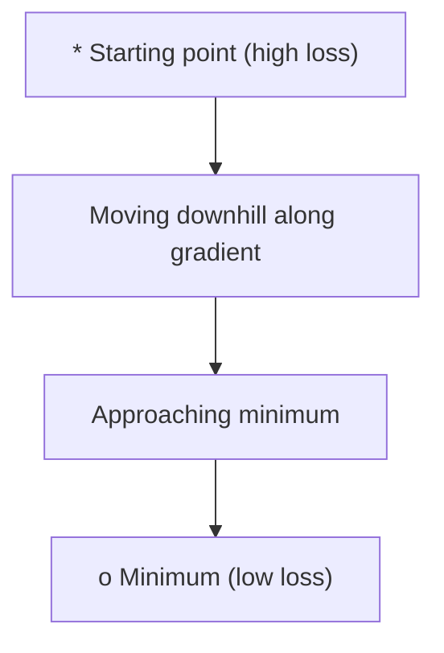
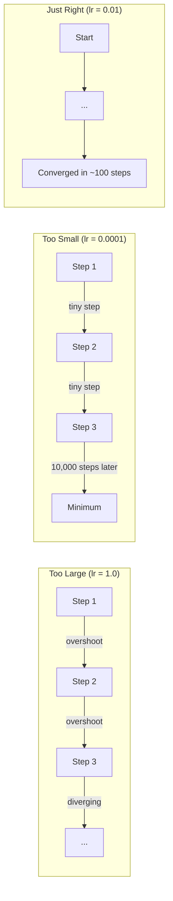
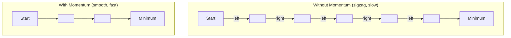
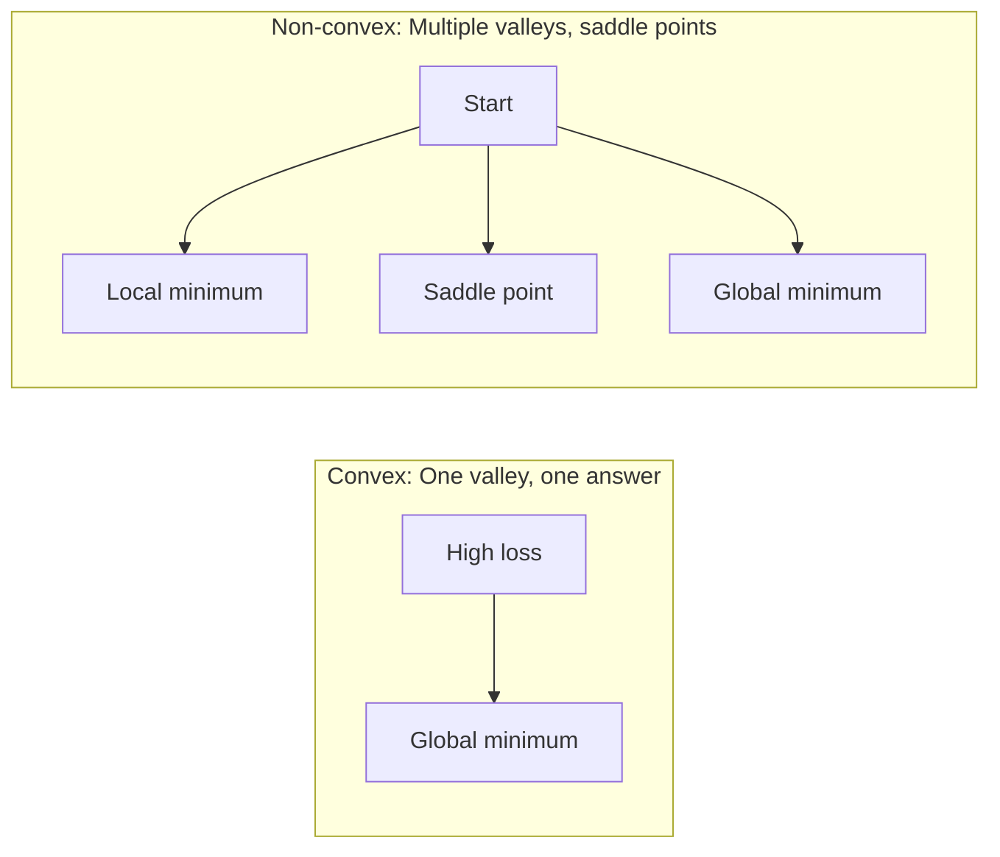
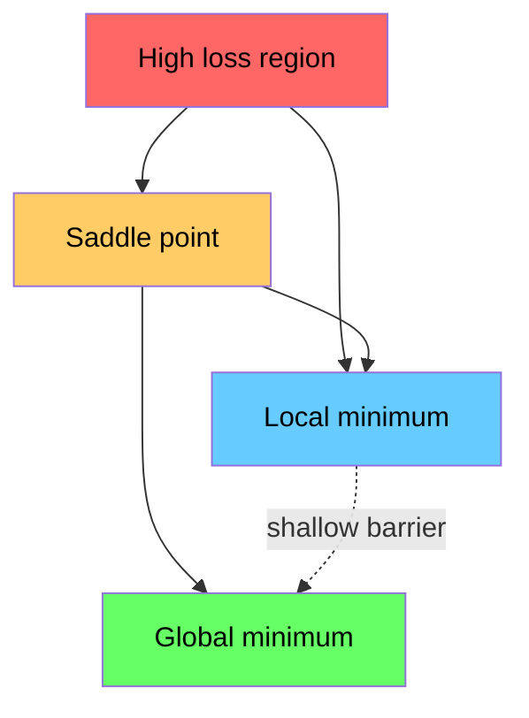

# Optimisation

> Entraîner un réseau neuronal, c'est en fait trouver le point le plus bas de la vallée.

**Type:** Build
**Language:**Python
**Prerequisites:** Phase 1, Lessons 04-05 (Derivatives, Gradients)
**Time:** ~75 minutes

## Objectif de l'apprentissage
- De la réalisation de la baisse du gradient de la vanille à zéro, de la SGD avec le momentum, ainsi que de l'Adam
- Comparer la fonction Rosenbrock Optimiser de la performance,并 expliquer pourquoi Adam va pour chaque poids
- 区分 convex et non convex Loss paysage,并解释 selle point 在高维空间中的作用
- Configurer des horaires de taux d'apprentissage  étapes de décomposition  annealisation de la coquille  réchauffement) pour améliorer la stabilité de l'entraînement

##  problématique
Vous avez une fonction de perte. Elle vous dit que le modèle est mal à l'échelle. Vous avez des gradients. Elles vous disent dans quelle direction la perte va s'aggraver.

Le moyen le plus simple est de déplacer dans le sens inverse du gradient. Avec un nombre de mouvements appelés taux d'apprentissage, on peut réduire le degré de déclin du gradient. C'est le degré de déclin du gradient, et il est vraiment efficace. Mais le taux d'apprentissage est trop élevé, on peut traverser directement toute la vallée, entre les deux côtés.

Chaque optimisateur de Deep Learning répond à la même question: comment arriver plus rapidement au fond de la vallée ?

## 概念
### Ce que signifie l'optimisation

L'optimisation est la recherche de la valeur d'entrée de la fonction qui peut la minimiser ou la maximiser. Dans l'apprentissage automatique, cette fonction est la perte.

```
minimize L(w) where:
  L = loss function
  w = model weights (could be millions of parameters)
```

### Descent graduel (vanille)

Le plus simple est d'optimiser. Le calcul de perte de poids par rapport à chaque gradient.

```
w = w - lr * gradient
```

C'est le parfait algorithme.



### Taux d'apprentissage: le plus important hyperparamètre

Le taux d'apprentissage est déterminé par le contrôle de la croissance.



Il n'existe pas de formule qui puisse directement donner un taux d'apprentissage correct. Vous devez le trouver par expérience.

### SGD vs lot vs mini lot

Avant de franchir une étape, la baisse du gradient de vanille se fera dans l'ensemble du ensemble de données.

La dérive du gradient stochastique (SGD) est calculée sur un seul échantillon de gradient,并立即更新──.

Le débit de gradient mini-batch est calculé en petit lot, puis mis à jour. C'est la méthode que tout le monde utilise réellement.

| Variant | Batch size | Gradient quality | Speed per step | Noise |
|---------|-----------|-----------------|---------------|-------|
| Batch GD | 整个 dataset | 精确 | 慢 | 无 |
| SGD | 1 个样本 | 噪声很大 | 快 | 高 |
| Mini-batch | 32-256 | 良好估计 | 均衡 | 中等 |

Le bruit du SGD et du mini-batch n'est pas un bug. Il aide à échapper aux minima locaux et aux points de selle.

### Momentum: une petite boule qui roule vers le bas

La baisse du gradient de la vanille est la seule observation du gradient actuel. Si le gradient revient à la même vitesse, il est très courant de progresser dans une vallée étroite.

```
v = beta * v + gradient
w = w - lr * v
```

类比是: une boule qui se roule vers le bas de la montagne. Elle ne s'arrête pas à chaque petit rebond, elle ne recommence pas. Elle accumule une vitesse dans la même direction, elle réprime les chocs.



`beta`(habituellement pour 0,9) contrôler la conservation de l'information historique.

### Adam: taux d'apprentissage adaptatif

Les différents poids nécessitent des taux d'apprentissage différents. Certains très peu obtiennent un grand poids, alors qu'ils doivent prendre des mesures plus importantes.

Adam, l'estimation du moment adaptatif est pour chaque poids.

1. 1er moment ((m): moyenne de fonctionnement des gradients ((( similaire à l'élan)
2. Deuxième moment ((v): gradients carrés de moyenne de fonctionnement ((magnitude de gradient)

```
m = beta1 * m + (1 - beta1) * gradient
v = beta2 * v + (1 - beta2) * gradient^2

m_hat = m / (1 - beta1^t)    bias correction
v_hat = v / (1 - beta2^t)    bias correction

w = w - lr * m_hat / (sqrt(v_hat) + epsilon)
```

À l' exception de`sqrt(v_hat)`Il est important de comprendre que les poids des grands gradients seront enlevés par un grand nombre de phases.

默认 hyperparametres:`lr=0.001, beta1=0.9, beta2=0.999, epsilon=1e-8` Ces valeurs de référence sont efficaces pour la plupart des problèmes.

### Les horaires de taux d'apprentissage

Le taux d'apprentissage fixe est un type de décalage. Au début de l'entraînement, vous voulez que les élèves progressent rapidement.

常见 agendas:

| Schedule | Formula | Use case |
|----------|---------|----------|
| Step decay | lr = lr * factor every N epochs | 简单，手动控制 |
| Exponential decay | lr = lr_0 * decay^t | 平滑降低 |
| Cosine annealing | lr = lr_min + 0.5 * (lr_max - lr_min) * (1 + cos(pi * t / T)) | Transformers，现代训练 |
| Warmup + decay | 线性上升，然后 decay | 大模型，防止早期不稳定 |

### Convexe contre non convexe

La fonction convexe 只有一个最小──渐进下降 总能找到它──像 `f(x) = x^2`C'est une convexe.

Les fonctions de perte de réseau neural sont non convexes. Elles ont de nombreux minima locaux.



En pratique, les minima locaux de réseaux neuraux de haute taille sont très peu de vrais problèmes. La plupart des minima locaux sont proches du minimum mondial.

### Visualisation du paysage perdu

La perte est une fonction de tous les poids. Pour un modèle qui possède 100 millions de poids, le paysage de perte existe dans 1.000,001 dimensions de l'espace.



Le niveau de l'échantillon est de plus en plus élevé que celui de l'échantillon.


```figure
gradient-descent
```

## - Je le construis.
### 步骤 1: Définir une fonction d'essai

La fonction Rosenbrock est un critère de référence classique de l'optimisation. Son minimum est situé (1, 1), est situé dans une vallée étroite, facile à trouver mais difficile à suivre.

```
f(x, y) = (1 - x)^2 + 100 * (y - x^2)^2
```

```python
def rosenbrock(params):
    x, y = params
    return (1 - x) ** 2 + 100 * (y - x ** 2) ** 2

def rosenbrock_gradient(params):
    x, y = params
    df_dx = -2 * (1 - x) + 200 * (y - x ** 2) * (-2 * x)
    df_dy = 200 * (y - x ** 2)
    return [df_dx, df_dy]
```

### 步骤 2: descente du gradient de la vanille

```python
class GradientDescent:
    def __init__(self, lr=0.001):
        self.lr = lr

    def step(self, params, grads):
        return [p - self.lr * g for p, g in zip(params, grads)]
```

### 步骤 3: SGD avec dynamique

```python
class SGDMomentum:
    def __init__(self, lr=0.001, momentum=0.9):
        self.lr = lr
        self.momentum = momentum
        self.velocity = None

    def step(self, params, grads):
        if self.velocity is None:
            self.velocity = [0.0] * len(params)
        self.velocity = [
            self.momentum * v + g
            for v, g in zip(self.velocity, grads)
        ]
        return [p - self.lr * v for p, v in zip(params, self.velocity)]
```

### 步骤 4: Adam

```python
class Adam:
    def __init__(self, lr=0.001, beta1=0.9, beta2=0.999, epsilon=1e-8):
        self.lr = lr
        self.beta1 = beta1
        self.beta2 = beta2
        self.epsilon = epsilon
        self.m = None
        self.v = None
        self.t = 0

    def step(self, params, grads):
        if self.m is None:
            self.m = [0.0] * len(params)
            self.v = [0.0] * len(params)

        self.t += 1

        self.m = [
            self.beta1 * m + (1 - self.beta1) * g
            for m, g in zip(self.m, grads)
        ]
        self.v = [
            self.beta2 * v + (1 - self.beta2) * g ** 2
            for v, g in zip(self.v, grads)
        ]

        m_hat = [m / (1 - self.beta1 ** self.t) for m in self.m]
        v_hat = [v / (1 - self.beta2 ** self.t) for v in self.v]

        return [
            p - self.lr * mh / (vh ** 0.5 + self.epsilon)
            for p, mh, vh in zip(params, m_hat, v_hat)
        ]
```

### 步骤 5: Exécuter et comparer

```python
def optimize(optimizer, func, grad_func, start, steps=5000):
    params = list(start)
    history = [params[:]]
    for _ in range(steps):
        grads = grad_func(params)
        params = optimizer.step(params, grads)
        history.append(params[:])
    return history

start = [-1.0, 1.0]

gd_history = optimize(GradientDescent(lr=0.0005), rosenbrock, rosenbrock_gradient, start)
sgd_history = optimize(SGDMomentum(lr=0.0001, momentum=0.9), rosenbrock, rosenbrock_gradient, start)
adam_history = optimize(Adam(lr=0.01), rosenbrock, rosenbrock_gradient, start)

for name, history in [("GD", gd_history), ("SGD+M", sgd_history), ("Adam", adam_history)]:
    final = history[-1]
    loss = rosenbrock(final)
    print(f"{name:6s} -> x={final[0]:.6f}, y={final[1]:.6f}, loss={loss:.8f}")
```

预期输出:Adam 收最快──带动的 SGD 路径更平滑──瓦尼拉 GD progression lente dans une vallée étroite──

## Utilisez-le
实践中, utiliser PyTorch ou JAX Optimizers── elles traitent les groupes de paramètres、décomposition du poids、coupage gradient et accélération de la GPU──

```python
import torch

model = torch.nn.Linear(784, 10)

sgd = torch.optim.SGD(model.parameters(), lr=0.01, momentum=0.9)
adam = torch.optim.Adam(model.parameters(), lr=0.001)
adamw = torch.optim.AdamW(model.parameters(), lr=0.001, weight_decay=0.01)

scheduler = torch.optim.lr_scheduler.CosineAnnealingLR(adam, T_max=100)
```

经验法则:

- Il est nécessaire de modifier le travail.
- Lorsque vous avez besoin de la meilleure précision finale, et être en mesure de supporter plus de coûts de modification, la SGD de l'échange avec l'élan est de 0,01, l'élan de 0,9)
- Pour les transformateurs utilisant AdamW(带 découplé déclin de poids Adam)
- Pour des exercices qui ont duré plus de plusieurs périodes, utilisez toujours un calendrier de taux d'apprentissage.
- Si l'entraînement est instable, réduire le taux d'apprentissage. Si l'entraînement est trop lent, l'améliorer.

## Je le livre.
Le cours est publié dans un prompt utilisé pour choisir un optimisateur adapté.`outputs/prompt-optimizer-guide.md`Il y a une autre.

Les classes d'optimisation qui y sont construites apparaîtront à nouveau dans la phase 3, alors nous entraînerons un réseau neural à partir de zéro.

## 练习
1. **Learning rate sweep.**Dans la fonction Rosenbrock, utilisez les taux d'apprentissage [0.0001, 0.0005, 0.001, 0.005, 0.01] 运行瓦尼拉梯度下降──对每一个学习率,在5000步后图图或印最终损失──找到仍能收的最大学习率──

2. **Momentum comparison.**Dans la fonction Rosenbrock 上 utiliser les valeurs de momentum [0,0, 0,5, 0,9, 0,99] 运行带动势的 SGD──跟踪每一步的损失──哪个动势值 收最快?哪个会超越?

3. **Saddle point escape.**定义函数  définir une fonction`f(x, y) = x^2 - y^2`(original point où il y a un point de selle) ∼ de (0.01, 0.01) 开始── Comparer la vanille GD、带动态 的 SGD 和 Adam 的行为──哪个能逃离坐点?

4. **Implement learning rate decay.**Pour la classe GradientDescent 添加 l'horaire de déclin exponentiel:`lr = lr_0 * 0.999^step` Comparer les résultats de la fonction Rosenbrock de la décomposition de l'utilisation supérieure à celle de la décomposition de l'utilisation inférieure.

## 关键术语
| Term | What people say | What it actually means |
|------|----------------|----------------------|
| Gradient descent | “Go downhill” | 通过减去按 learning rate 缩放后的 Gradient 来更新 weights。最基础的 Optimizer。 |
| Learning rate | “Step size” | 控制每次更新让 weights 移动多远的标量。太大会导致发散。太小会浪费计算。 |
| Momentum | “Keep rolling” | 将过去的 Gradients 累积到一个 velocity Vector 中。抑制震荡，并加速沿一致方向的移动。 |
| SGD | “Random sampling” | Stochastic gradient descent。用随机子集而不是完整 dataset 计算 Gradient。实践中几乎总是指 mini-batch SGD。 |
| Mini-batch | “A chunk of data” | 用于估计 Gradient 的一小部分训练数据（32-256 个样本）。平衡速度与 Gradient 准确性。 |
| Adam | “The default optimizer” | Adaptive Moment Estimation。跟踪每个 weight 的 Gradients 和 squared gradients 的 running averages，从而为每个 weight 提供自己的 learning rate。 |
| Bias correction | “Fix the cold start” | Adam 的 first 和 second moments 初始化为零。Bias correction 在早期步骤中通过除以 (1 - beta^t) 进行补偿。 |
| Learning rate schedule | “Change lr over time” | 在训练过程中调整 learning rate 的函数。早期大步，后期小步。 |
| Convex function | “One valley” | 任意 local minimum 都是 global minimum 的函数。Gradient descent 总能找到它。Neural Network losses 不是 convex。 |
| Saddle point | “Flat but not a minimum” | Gradient 为零，但在某些方向上是 minimum、在另一些方向上是 maximum 的点。高维空间中很常见。 |
| Loss landscape | “The terrain” | 在 weight space 上绘制出的 Loss function。通过沿两个随机方向切片来可视化。 |
| Convergence | “Getting there” | Optimizer 已到达一个继续更新也无法显著降低 Loss 的点。 |

## 延伸阅读
- [Sebastian Ruder: An overview of gradient descent optimization algorithms](https://ruder.io/optimizing-gradient-descent/)- Un aperçu complet de tous les principaux optimisateurs
- [Why Momentum Really Works (Distill)](https://distill.pub/2017/momentum/)- la dynamique de l'élan
- [Adam: A Method for Stochastic Optimization (Kingma & Ba, 2014)](https://arxiv.org/abs/1412.6980)- Origini Adam papier, facile à lire et court
- [Visualizing the Loss Landscape of Neural Nets (Li et al., 2018)](https://arxiv.org/abs/1712.09913)-  montrer des papiers nettes contre des minima plats
