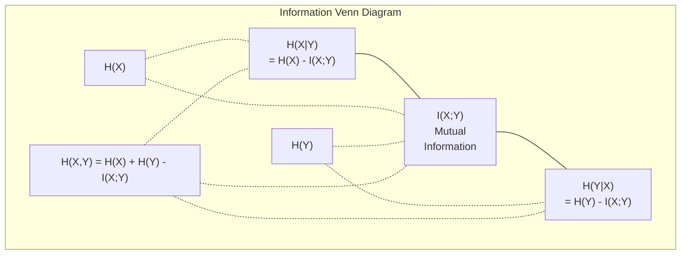

# Théorie de l'information

> Théorie de l'information  Mesurer la surprise―Perte de fonctions  bâtir dessus―

**Type:** Learn
**Language:**Python
**Prerequisites:** Phase 1, Lesson 06 (Probability)
**Time:** ~60 分钟

## Objectif de l'apprentissage

- De l'entropie à zéro, de l'entropie croisée et de la divergence KL, et d'expliquer la relation entre elles
- 推导为什么最小化交叉热损等价格最大化日志概率
- 计算 caractéristiques et informations mutuelles entre cible , pour la séquence de l'importance des caractéristiques
- 将 perplexity  expliquer pour le modèle de langue 从中选择的有效词汇规模

##  problématique

Vous allez utiliser chaque modèle de classification dans l' entraînement.`CrossEntropyLoss()` Vous verrez dans chaque modèle de langage  vous verrez dans chaque article  la perplexité  vous verrez dans les VAEs  la distillation et RLHF  la divergence KL  Ces concepts ne sont pas séparés l'un de l'autre  ils sont tous la même idée de différents vêtements 

La théorie de l'information pour vous a fourni un raisonnement sur l'incertitude, la compression et la prédiction du langage. Claude Shannon l'a inventé en 1948 pour résoudre les problèmes de communication.

Ce cours va construire chaque formule à partir de zéro, vous permettra de voir d'où elles viennent et pourquoi elles sont efficaces.

## 概念

### Une surprise !

Quand quelque chose d'inattendu se produit, il est plus facile de le voir.

概率 pour l'événement 信息量是:

```
I(x) = -log(p(x))
```

Utilisation de 2 logs de base  obtenez des bits ⋅ Utilisation de logs naturels  obtenez des nats ⋅ la même idée, différentes unités ⋅

```
Event              Probability    Surprise (bits)
Fair coin heads    0.5            1.0
Rolling a 6        0.167          2.58
1-in-1000 event    0.001          9.97
Certain event      1.0            0.0
```

La détermination de l'événement est sans information.

### Entropy (environ une moyenne de la taille)

L'entropie est une distribution de toutes les surprises possibles.

```
H(P) = -sum( p(x) * log(p(x)) )  for all x
```

公平硬币对二元变量 具有最大エントロピー:1 bit──偏置硬币(99% 正面) 具有低エントロピー:0.08 bits──你已经知道会发生什么,因此每次抛几乎不会告诉你任何信息──

```
Fair coin:    H = -(0.5 * log2(0.5) + 0.5 * log2(0.5)) = 1.0 bit
Biased coin:  H = -(0.99 * log2(0.99) + 0.01 * log2(0.01)) = 0.08 bits
```

L'entropie mesure une distribution de l'incertitude incontournable.

### La fonction de perte (en anglais seulement)

Entrappe croisée  mesure lorsque vous utilisez la distribution Q 编码 réellement provenant de la distribution P 事件时, surprise moyenne 是多少──

```
H(P, Q) = -sum( p(x) * log(q(x)) )  for all x
```

P est la vraie distribution des étiquettes. Q est la prédiction de votre modèle. Si Q correspond parfaitement à P, la croisée entropie est similaire à l'entropie.

Dans la classification, P est un vecteur à chaud (true class) dont la probabilité est de 1, les autres sont de 0).

```
H(P, Q) = -log(q(true_class))
```

C'est la classification de la perte de l'entropie croisée complète 公式―最大化正确类的预测概率―

### KL Divergence (distribution  distance entre les deux)

La différence KL  mesure l'utilisation de Q et non P                                                                                                                                                                                                                                                                                                                                                                                                                                                                                                                

```
D_KL(P || Q) = sum( p(x) * log(p(x) / q(x)) )  for all x
             = H(P, Q) - H(P)
```

L'entropie croisée est l'entropie plus la divergence KL. En raison de l'entropie réelle de la distribution pendant l'entraînement est constante, l'entropie croisée minimisée est la même que la divergence KL.

La différence KL 不是对称的:D_KL P  Q) != D_KL  Q  P) 

### Informations mutuelles

Les informations mutuelles mesurent savoir une variable peut vous dire une autre variable, peu d'informations.

```
I(X; Y) = H(X) - H(X|Y)
        = H(X) + H(Y) - H(X, Y)
```

Si X et Y sont indépendants, l'information mutuelle est pour rien. Si l'une d'elles ne vous dit rien de l'autre, l'information mutuelle est comme l'entropie d'une variable.

Dans la sélection de fonctionnalités, les informations mutuelles entre fonctionnalité et cible High, signifie que cette fonctionnalité a un usage.

### Entropie conditionnelle

H(Y de X) 衡量观察到X 后, quant à Y, il reste encore beaucoup d'incertitude.

```
H(Y|X) = H(X,Y) - H(X)
```

Les deux extrémités:
- Si X 完全决定 Y, alors H (YX ≠) = 0── savoir X                                                                                                                                                                                                                                                     
- Si X à Y 没有任何信息, alors H (Y 任何信息X) = H () ──知道 X 完全不会降低你的不确定性──例:X = 抛硬币结果,Y = 明天的天气──

Entropie conditionnelle 始终非负,并且永远不超过 H(Y):

```
0 <= H(Y|X) <= H(Y)
```

Dans l'apprentissage automatique, l'entropie conditionnelle apparaît dans les arbres de décision. Dans chaque fraction, l'algorithme choisit de rendre H(Y=X) la plus petite caractéristique X, c'est-à-dire le déménagement de la plus grande incertitude de la fonction Y.

### Entropie conjointe

H(X,Y) est l'entropie de la distribution commune de X 和 Y 一起.

```
H(X,Y) = -sum sum p(x,y) * log(p(x,y))   for all x, y
```

关键性质:

```
H(X,Y) <= H(X) + H(Y)
```

Lorsque X et Y sont formés, elles sont aussi des entropes communes. Si elles partagent des informations, l'entropie commune est plus petite que leur entropie.



Ces relations:
- H(X,Y) = H(X) + H(Y
- Le nombre de personnes concernées est de 0,5% à 0,5%
- H(X,Y) = H(X) + H(Y) - I(X;Y)

### Une information commune (deep dive)

Information mutuelle I(X;Y) 量化知道一个变量会减少关于另一个变量的多少不确定性──

```
I(X;Y) = H(X) - H(X|Y)
       = H(Y) - H(Y|X)
       = H(X) + H(Y) - H(X,Y)
       = sum sum p(x,y) * log(p(x,y) / (p(x) * p(y)))
```

Sexualité:
- Je suis toujours là pour voir quelque chose qui ne te laissera jamais perdre de l'information.
- Lorsque et seulement quand X et Y sont indépendantes, I(X;Y) = 0。
- Il est en effet différent de la divergence KL.
- I(X;X) = H(X)。 une variable avec elle-même partage toute l'information。

**用于 feature selection 的 mutual information。**Dans le ML, vous souhaitez des fonctionnalités pour la cible avec une quantité d'informations.

1. Pour chaque fonction X_i, calcul I(X_i; Y), Y est la variable cible.
2. 按 MI score 排序 caractéristiques。
3. Gardez les caractéristiques.

Ceci s'applique à toute relation entre caractéristique et objectif: linéaire, non linéaire, monotonique ou autre relation.

| Method | Detects | Computational cost | Handles categorical? |
|--------|---------|-------------------|---------------------|
| Pearson correlation | Linear relationships | O(n) | No |
| Spearman correlation | Monotonic relationships | O(n log n) | No |
| Mutual information | 任意 statistical dependency | O(n log n) with binning | Yes |

### Légalisation des étiquettes et entropie croisée

标准 classification Utilisez des cibles difficiles:[0, 0, 1, 0]── vraie classe 概率 = 1,其他全部 = 0── Étiquette de lissage 会用软目标 替换它们:

```
soft_target = (1 - epsilon) * hard_target + epsilon / num_classes
```

Quand l'epsilon = 0,1 et il y a 4 classes
- Cible difficile: [0, 0, 1, 0]
- Cible douce: [0,025, 0,025, 0,925, 0,025]

De la théorie de l'information 视角看, étiquette lissage  a augmenté l'entropie de la distribution cible。 entropie des cibles difficiles à un seul coup de feu − 0, y'a-t-il aucune incertitude─ cibles douces  possèdent une entropie correcte─

Pourquoi ça aide ?
- 防止模型 将 logits 推向极端值(在交叉内,要完美匹配一个热目标 需要无限大的 logits)
- 作为规范化:model 不能100% confiant
- amélioration de l'étalonnage: pré测概率更好地 refléter l'incertitude réelle
-                                                                                                                                                                                                                                                                                                                                                                                                                                                                                                                              

Utilisation de l' étiquette de lissage de la perte d' entropie croisée 变为:

```
L = (1 - epsilon) * CE(hard_target, prediction) + epsilon * H_uniform(prediction)
```

Deuxièmement, il est nécessaire de régulariser les prédictions de la confiance.

### Pourquoi la croisée des entropes est au cœur de la perte de classification

Trois points de vue, la même conclusion.

**Information Theory 视角。**L'entropie croisée mesure la distribution de votre modèle au lieu de la distribution réelle.

**Maximum likelihood 视角。**对于 N 个 true classes 为 y_i de l'échantillon de formation:

```
Likelihood     = product( q(y_i) )
Log-likelihood = sum( log(q(y_i)) )
Negative log-likelihood = -sum( log(q(y_i)) )
```

La dernière ligne est la perte de l'entropie croisée. La perte de l'entropie croisée minimale = les données de formation maximisées dans votre modèle.

**Gradient 视角。**La transpiration de l'entropie est la raison de sa parfaite combinaison avec la logique.

### Les bits contre les nats

La seule différence est le nombre de logs.

```
log base 2   -> bits      (information theory tradition)
log base e   -> nats      (machine learning convention)
log base 10  -> hartleys  (rarely used)
```

1 nat = 1/ln(2) bits = 1,4427 bits。PyTorch 和 TensorFlow 默认使用自然log(nats)。

### La perplexité

La perplexité est un indicateur de l'entropie croisée. Elle vous dit que le modèle est incertain.

```
Perplexity = 2^H(P,Q)   (if using bits)
Perplexity = e^H(P,Q)   (if using nats)
```

La perplexité du modèle de langue 50 est, en moyenne, comme si nous devions choisir parmi les 50 prochains jetons possibles.

GPT-2 dans les critères de référence habituels atteint une perplexité d'environ 30%. Les modèles modernes peuvent atteindre un nombre de personnels dans les domaines bien couverts.


```figure
entropy-kl
```

## - Je le construis.

### Section 1 步: Contenu d'information et entropie

```python
import math

def information_content(p, base=2):
    if p <= 0 or p > 1:
        return float('inf') if p <= 0 else 0.0
    return -math.log(p) / math.log(base)

def entropy(probs, base=2):
    return sum(
        p * information_content(p, base)
        for p in probs if p > 0
    )

fair_coin = [0.5, 0.5]
biased_coin = [0.99, 0.01]
fair_die = [1/6] * 6

print(f"Fair coin entropy:   {entropy(fair_coin):.4f} bits")
print(f"Biased coin entropy: {entropy(biased_coin):.4f} bits")
print(f"Fair die entropy:    {entropy(fair_die):.4f} bits")
```

### 步骤 2: Entropie croisée et divergence KL

```python
def cross_entropy(p, q, base=2):
    total = 0.0
    for pi, qi in zip(p, q):
        if pi > 0:
            if qi <= 0:
                return float('inf')
            total += pi * (-math.log(qi) / math.log(base))
    return total

def kl_divergence(p, q, base=2):
    return cross_entropy(p, q, base) - entropy(p, base)

true_dist = [0.7, 0.2, 0.1]
good_model = [0.6, 0.25, 0.15]
bad_model = [0.1, 0.1, 0.8]

print(f"Entropy of true dist:     {entropy(true_dist):.4f} bits")
print(f"CE (good model):          {cross_entropy(true_dist, good_model):.4f} bits")
print(f"CE (bad model):           {cross_entropy(true_dist, bad_model):.4f} bits")
print(f"KL divergence (good):     {kl_divergence(true_dist, good_model):.4f} bits")
print(f"KL divergence (bad):      {kl_divergence(true_dist, bad_model):.4f} bits")
```

### 步骤 3: L'entropie croisée en tant que perte de classification

```python
def softmax(logits):
    max_logit = max(logits)
    exps = [math.exp(z - max_logit) for z in logits]
    total = sum(exps)
    return [e / total for e in exps]

def cross_entropy_loss(true_class, logits):
    probs = softmax(logits)
    return -math.log(probs[true_class])

logits = [2.0, 1.0, 0.1]
true_class = 0

probs = softmax(logits)
loss = cross_entropy_loss(true_class, logits)

print(f"Logits:      {logits}")
print(f"Softmax:     {[f'{p:.4f}' for p in probs]}")
print(f"True class:  {true_class}")
print(f"Loss:        {loss:.4f} nats")
print(f"Perplexity:  {math.exp(loss):.2f}")
```

### 步骤 4: L'entropie croisée est égale à la probabilité de log négatif

```python
import random

random.seed(42)

n_samples = 1000
n_classes = 3
true_labels = [random.randint(0, n_classes - 1) for _ in range(n_samples)]
model_logits = [[random.gauss(0, 1) for _ in range(n_classes)] for _ in range(n_samples)]

ce_loss = sum(
    cross_entropy_loss(label, logits)
    for label, logits in zip(true_labels, model_logits)
) / n_samples

nll = -sum(
    math.log(softmax(logits)[label])
    for label, logits in zip(true_labels, model_logits)
) / n_samples

print(f"Cross-entropy loss:      {ce_loss:.6f}")
print(f"Negative log-likelihood: {nll:.6f}")
print(f"Difference:              {abs(ce_loss - nll):.2e}")
```

### 步骤 5: Informations mutuelles

```python
def mutual_information(joint_probs, base=2):
    rows = len(joint_probs)
    cols = len(joint_probs[0])

    margin_x = [sum(joint_probs[i][j] for j in range(cols)) for i in range(rows)]
    margin_y = [sum(joint_probs[i][j] for i in range(rows)) for j in range(cols)]

    mi = 0.0
    for i in range(rows):
        for j in range(cols):
            pxy = joint_probs[i][j]
            if pxy > 0:
                mi += pxy * math.log(pxy / (margin_x[i] * margin_y[j])) / math.log(base)
    return mi

independent = [[0.25, 0.25], [0.25, 0.25]]
dependent = [[0.45, 0.05], [0.05, 0.45]]

print(f"MI (independent): {mutual_information(independent):.4f} bits")
print(f"MI (dependent):   {mutual_information(dependent):.4f} bits")
```

## Utilisez-le

Utilisez NumPy pour exprimer le même concept, c'est la façon dont vous l'utilisez en pratique:

```python
import numpy as np

def np_entropy(p):
    p = np.asarray(p, dtype=float)
    mask = p > 0
    result = np.zeros_like(p)
    result[mask] = p[mask] * np.log(p[mask])
    return -result.sum()

def np_cross_entropy(p, q):
    p, q = np.asarray(p, dtype=float), np.asarray(q, dtype=float)
    mask = p > 0
    return -(p[mask] * np.log(q[mask])).sum()

def np_kl_divergence(p, q):
    return np_cross_entropy(p, q) - np_entropy(p)

true = np.array([0.7, 0.2, 0.1])
pred = np.array([0.6, 0.25, 0.15])
print(f"Entropy:    {np_entropy(true):.4f} nats")
print(f"Cross-ent:  {np_cross_entropy(true, pred):.4f} nats")
print(f"KL div:     {np_kl_divergence(true, pred):.4f} nats")
```

Tu l'as construit à partir de zéro.`torch.nn.CrossEntropyLoss()`◯ Les choses faites en interne── Maintenant, vous savez pourquoi les pertes diminuent pendant le processus d'entraînement: la distribution prévue de votre modèle approche la vraie distribution, en utilisant des nats de déchets d'information pour mesurer──

## 练习

1. 假设英文字母表服从统一分布(26 个字母), calculer son entropie― puis utiliser la fréquence des lettres réelles pour estimer― lequel est plus élevé, pourquoi ?

2. Un modèle pour l'échantillon de la classe vraie de n°1  sortie logits [5.0, 2.0, 0.5]  calculer la perte d'entropie croisée, puis utiliser votre `cross_entropy_loss`Quelle est la fonction de l'analyse ?

3. 证明 KL divergence 不是对称的──选择两个分布 P 和 Q,计算 D_KL(P   Q) 和 D_K  L(Q  P)──解释它们为什么不同──

4. 构建一个函数,为一段代币预测 序列计算困难――给定一个由 (true_token_index, predicted_logits) paires 组成的列表,返回该序列的困难――

## 关键术语

| Term | What people say | What it actually means |
|------|----------------|----------------------|
| Information content | “Surprise” | 编码一个事件所需的 bits（或 nats）数量：-log(p) |
| Entropy | “Randomness” | 一个 distribution 中所有 outcomes 的平均 surprise。衡量不可约 uncertainty。 |
| Cross-entropy | “The loss function” | 使用 model distribution Q 编码来自 true distribution P 的事件时的平均 surprise。 |
| KL divergence | “Distance between distributions” | 使用 Q 而不是 P 所浪费的额外 bits。等于 cross-entropy 减 entropy。不是对称的。 |
| Mutual information | “How related are X and Y” | 知道 Y 后，关于 X 的 uncertainty 减少量。为零表示独立。 |
| Softmax | “Turn logits into probabilities” | 取指数并归一化。将任意 real-valued vector 映射为有效 probability distribution。 |
| Perplexity | “How confused the model is” | Cross-entropy 的指数。model 在每一步从中选择的有效 vocabulary size。 |
| Bits | “Shannon's unit” | 使用以 2 为底的 log 衡量的信息。一个 bit 解决一次公平抛硬币。 |
| Nats | “ML's unit” | 使用 natural log 衡量的信息。PyTorch 和 TensorFlow 默认使用。 |
| Negative log-likelihood | “NLL loss” | 对 one-hot labels 来说，与 cross-entropy loss 完全相同。最小化它会最大化正确 predictions 的概率。 |

## 延伸阅读

- [Shannon 1948: A Mathematical Theory of Communication](https://people.math.harvard.edu/~ctm/home/text/others/shannon/entropy/entropy.pdf)- Originaire, encore facile à lire
- [Visual Information Theory (Chris Olah)](https://colah.github.io/posts/2015-09-Visual-Information/)- La meilleure explication visible de l'entropie et de la divergence KL
- [PyTorch CrossEntropyLoss docs](https://pytorch.org/docs/stable/generated/torch.nn.CrossEntropyLoss.html)- cadre  comment réaliser le contenu que vous venez de construire
