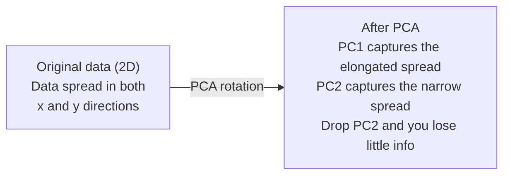

# Réduction de la dimensionnalité

> Les données sont structurées. Vous devez les observer du bon angle.

**Type:** Build
**Language:**Python
**Prerequisites:** Phase 1, Lessons 01（Linear Algebra Intuition）、02（Vectors, Matrices & Operations）、03（Eigenvalues & Eigenvectors）、06（Probability & Distributions）
**Time:** ~90 分钟

## Objectifs d'apprentissage

- De la réalisation de PCA:centre de données, calcul de matrice de covariance, composer et réaliser un projet
- Utilisation expliqué ratio de variance 和 méthode coude  sélectionner les principaux composants
- Comparer les effets des chiffres MNIST visualisés en 2D avec PCA, t-SNE et UMAP, et expliquer leur poids
- Utilisation avec RBF du noyau du noyau PCA séparé des normes PCA  incapable de traiter des structures de données non linéaires

## Le problème

Vous avez un ensemble de données de 784 caractéristiques dans chaque échantillon. Peut-être que c'est des valeurs de pixels numériques écrites à la main. Peut-être que c'est des niveaux d'expression des gènes. Peut-être que c'est des signaux de comportement de l'utilisateur. Vous ne pouvez pas visualiser 784 dimensions. Vous ne pouvez pas les dessiner. Vous ne pouvez même pas les penser.

Mais la plupart des 784 caractéristiques sont redondantes. La vraie information se trouve sur une surface beaucoup plus petite. Un "7" écrit à la main n'a pas besoin de 784 chiffres indépendants pour le décrire.

La réduction de dimensionnalité trouvera une surface plus petite. Elle réduira vos données 784 dimensions à 2 10 ou 50 dimensions, tout en conservant une structure importante.

## Le concept

### La malédiction de la dimensionnalité

Avec la croissance de la dimension, trois choses vont manquer.

**距离变得没有意义。**En hauteur, la distance entre deux points aléatoires recevra la même valeur. Si chaque point est différent de l'autre, la recherche du voisin le plus proche échouera.

```
Dimension    Avg distance ratio (max/min between random points)
2            ~5.0
10           ~1.8
100          ~1.2
1000         ~1.02
```

**体积集中在角落。**d 维 unité hypercube a 2 个角. Dans 100 维, presque tous les objets sont dans un coin, loin du centre.

**你需要指数级更多的数据。**Pour maintenir la même densité d'échantillon dans un espace, de 2D à 20D signifie que vous avez besoin de 10 à 18 fois plus de données. Vous n'aurez jamais assez de données.

### PCA: trouver les directions qui comptent

L'analyse des composants principaux (PCA) trouvera les données qui changent le plus. Elle tourne votre coordonné, ce qui permet à la première ligne de capter la plus grande variance, à la seconde ligne de capter la plus grande variance, selon ce type de suggestion.

- Je suis un peu déçu.

```
1. Center the data        (subtract the mean from each feature)
2. Compute covariance     (how features move together)
3. Eigendecomposition     (find the principal directions)
4. Sort by eigenvalue     (biggest variance first)
5. Project               (keep top k eigenvectors, drop the rest)
```

Pourquoi utiliser la composition propre ?La matrice de covariance est symétrique et semi-définie. Ses propres vecteurs sont des directions orthogonales dans l'espace de caractéristiques. Les valeurs propres vous disent dans chaque direction combien de variance a été capturée.



- **Before PCA:**Nuage de données  along x 和 y 两个 axes présentant vers le côté de la ligne de propagation
- **After PCA:**坐标系 sont tournés, permettant au PC1 de faire face à une variance maximale de direction (extrait prolongé), au PC2 de faire face à une variance minimale de direction (étroit écartage)
- **Dimensionality reduction:**J'ai perdu le PC2 et j'ai projeté les données sur le PC1, j'ai perdu très peu d'informations.

### Ratio de variance expliqué

Chaque composant principal capture une partie de la variance totale.

```
Component    Eigenvalue    Explained ratio    Cumulative
PC1          4.73          0.473              0.473
PC2          2.51          0.251              0.724
PC3          1.12          0.112              0.836
PC4          0.89          0.089              0.925
...
```

Lorsque la variance cumulée expliquée atteint 0,95, vous savez que ces composants captent 95% de l'information.

### Choisir le nombre de composants

Trois stratégies:

1. **Threshold.**Conserver suffisamment de composants pour expliquer la variance de 90 à 95%.
2. **Elbow method.** tracer une variance expliquée de chaque composant chercher des points de rapidité et de baisse évidents
3. **Downstream performance.**Pour utiliser PCA en pré-traitement, la précision du modèle de scan et de mesure est la meilleure.

### T-SNE: préserver les quartiers

t-Distributed Stochastic Neighbor Embedding (t-SNE) est une conception visuelle. Elle permet de visualiser les données en 2D ou en 3D, tout en conservant les points qui sont proches les uns des autres.

直觉是: dans l'espace initial, en fonction de la distance entre les points, on calcule une répartition de probabilité. Le point proche obtient une probabilité élevée. Le point éloigné obtient une probabilité faible.

Le t-SNE est de la même nature que le t-SNE.
- Non linéaire. Il peut déployer des variétés complexes de PCA incapables de traiter.
- Les différentes fonctions peuvent avoir un autre format.
- Parfait de la complexité 参数控制考虑多少邻居 (typique champ: 5 à 50)
- 输出中 clusters  Distance entre les clusters  n'a pas d'importance                                                                                                                                                                                                                                                                                                                                                                                                                                                                                                     
- Dans les grands ensembles de données, il est très lent.

### UMAP: une structure globale plus rapide et meilleure

Le mode de travail de l'approche et de la projection unifiées (UMAP) est similaire à celui de la T-SNE, mais présente deux avantages:
- Mieux vite, il utilise des graphiques proches approximatifs, plutôt que de calculer toutes les distances parallèles.
- Une meilleure structure globale, la position relative des groupes de sortie est souvent plus significative que la t-SNE.

UMAP dans un espace élevé construit un graphique pondéré, puis recherche un plan bas, conservez ce graphique autant que possible.

关键参数:
- `n_neighbors`: combien de voisins définissent la structure locale ((semblable à la perplexité)──
- `min_dist`Les points de sortie se rassemblent plus fortement.

### Quand utiliser quel

| Method | Use case | Preserves | Speed |
|--------|----------|-----------|-------|
| PCA | Preprocessing before training | Global variance | Fast (exact), works on millions of samples |
| PCA | Quick exploratory visualization | Linear structure | Fast |
| t-SNE | Publication-quality 2D plots | Local neighborhoods | Slow (< 10k samples ideal) |
| UMAP | 2D visualization at scale | Local + some global structure | Medium (handles millions) |
| PCA | Feature reduction for models | Variance-ranked features | Fast |
| t-SNE / UMAP | Understanding cluster structure | Cluster separation | Medium to slow |

經驗法则: utiliser PCA pour effectuer un préprocessage et une compression de données.

### PCA du noyau

標準PCA trouvera des sous-espaces linéaires── il tourne votre coordinate ≠ ≠ ≠ ⋅ ⋅ ⋅ ⋅ ⋅ ⋅ ⋅ ⋅ ⋅ ⋅ ⋅ ⋅ ⋅ ⋅ ⋅ ⋅ ⋅ ⋅ ⋅ ⋅ ⋅ ⋅ ⋅ ⋅ ⋅ ⋅ ⋅ ⋅ ⋅ ⋅ ⋅ ⋅ ⋅ ⋅ ⋅ ⋅ ⋅ ⋅ ⋅ ⋅ ⋅ ⋅ ⋅ ⋅ ⋅ ⋅ ⋅ ⋅ ⋅ ⋅ ⋅ ⋅ ⋅ ⋅ ⋅ ⋅ ⋅ ⋅ ⋅ ⋅ ⋅ ⋅ ⋅ ⋅ ⋅ ⋅ ⋅ ⋅ ⋅ ⋅ ⋅ ⋅ ⋅ ⋅ ⋅ ⋅ ⋅ ⋅ ⋅ ⋅ ⋅ ⋅ ⋅ ⋅ ⋅ ⋅ ⋅ ⋅ ⋅ ⋅ ⋅ ⋅ ⋅ ⋅ ⋅ ⋅ ⋅ ⋅ ⋅ ⋅ ⋅ ⋅ ⋅ ⋅ ⋅ ⋅ ⋅ ⋅ ⋅ ⋅ ⋅ ⋅ ⋅ ⋅ ⋅ ⋅ ⋅ ⋅ ⋅ ⋅ ⋅ ⋅ ⋅ ⋅ ⋅ ⋅ ⋅ ⋅ ⋅ ⋅ ⋅ ⋅ ⋅ ⋅ ⋅ ⋅ ⋅ ⋅ ⋅ ⋅ ⋅ ⋅ ⋅ ⋅ ⋅ ⋅ ⋅ ⋅ ⋅ ⋅ ⋅ ⋅ ⋅     ⋅                                                                                                                                                                           

Le noyau PCA est utilisé dans l'espace de fonction de haute taille induit par la fonction de noyau, sans calculer explicitement le cadran de cet espace.

- Je suis un peu déçu.
1. 计算 matrice du noyau K, dont K_ij = k(x_i, x_j)
2. Dans l'espace de fonctionnalités, la matrice du noyau central
3. Pour une matrice de noyau centrée faire son propre composé
4. 顶部 eigenvectors(按1/sqrt(eigenvalue) 缩放) sont des projections

常见 fonctions du noyau:

| Kernel | Formula | Good for |
|--------|---------|----------|
| RBF (Gaussian) | exp(-gamma * \|\|x - y\|\|^2) | 大多数 nonlinear data、smooth manifolds |
| Polynomial | (x . y + c)^d | Polynomial relationships |
| Sigmoid | tanh(alpha * x . y + c) | Neural network-like mappings |

何時使用内核 PCA plutôt que PCA standard:

| Criterion | Standard PCA | Kernel PCA |
|-----------|-------------|------------|
| Data structure | Linear subspace | Nonlinear manifold |
| Speed | O(min(n^2 d, d^2 n)) | O(n^2 d + n^3) |
| Interpretability | Components are linear combinations of features | Components lack direct feature interpretation |
| Scalability | Works on millions of samples | Kernel matrix is n x n, memory-limited |
| Reconstruction | Direct inverse transform | Requires pre-image approximation |

经典例: Les cercles concentriques de 2D: deux cercles, un cercle à l'intérieur d'un autre cercle.

### Erreur de reconstruction

Tu as réduit la dimension à 50 dimensions, tu as perdu quoi ?

测量 erreur de reconstruction:
1. Pour projeter les données à k 维: X_réduit = X @ W_k
2. 重建: X_hat = X_reducé @ W_k^T
3. 计算 MSE:mean((X - X_hat) ^2)

Pour PCA, erreur de reconstruction avec variance expliquée

```
Reconstruction error = sum of eigenvalues NOT included
Total variance = sum of ALL eigenvalues
Fraction lost = (sum of dropped eigenvalues) / (sum of all eigenvalues)
```

Le ratio de variance expliqué de chaque composant est:

```
explained_ratio_k = eigenvalue_k / sum(all eigenvalues)
```

Pour obtenir une variance cumulative expliquée des composants, la quantité de coups est de la courbe "coup d'épaule".
- 曲线变平的位置 (收益递减)
- Variance cumulative  travers votre seuil de position(habituellement 0,90 ou 0,95)
- Performance des tâches en aval 进入平台期的位置

L'erreur de reconstruction n'est pas seulement utilisée pour sélectionner les anomalies. Vous pouvez l'utiliser pour la détection des anomalies: les erreurs de reconstruction sont des échantillons élevés, ils ne correspondent pas à l'espace de sous-espace appris.


```figure
pca-axes
```

## Faites-le

### Étape 1: PCA à partir de zéro

```python
import numpy as np

class PCA:
    def __init__(self, n_components):
        self.n_components = n_components
        self.components = None
        self.mean = None
        self.eigenvalues = None
        self.explained_variance_ratio_ = None

    def fit(self, X):
        self.mean = np.mean(X, axis=0)
        X_centered = X - self.mean

        cov_matrix = np.cov(X_centered, rowvar=False)

        eigenvalues, eigenvectors = np.linalg.eigh(cov_matrix)

        sorted_idx = np.argsort(eigenvalues)[::-1]
        eigenvalues = eigenvalues[sorted_idx]
        eigenvectors = eigenvectors[:, sorted_idx]

        self.components = eigenvectors[:, :self.n_components].T
        self.eigenvalues = eigenvalues[:self.n_components]
        total_var = np.sum(eigenvalues)
        self.explained_variance_ratio_ = self.eigenvalues / total_var

        return self

    def transform(self, X):
        X_centered = X - self.mean
        return X_centered @ self.components.T

    def fit_transform(self, X):
        self.fit(X)
        return self.transform(X)
```

### Étape 2: Test sur les données synthétiques

```python
np.random.seed(42)
n_samples = 500

t = np.random.uniform(0, 2 * np.pi, n_samples)
x1 = 3 * np.cos(t) + np.random.normal(0, 0.2, n_samples)
x2 = 3 * np.sin(t) + np.random.normal(0, 0.2, n_samples)
x3 = 0.5 * x1 + 0.3 * x2 + np.random.normal(0, 0.1, n_samples)

X_synthetic = np.column_stack([x1, x2, x3])

pca = PCA(n_components=2)
X_reduced = pca.fit_transform(X_synthetic)

print(f"Original shape: {X_synthetic.shape}")
print(f"Reduced shape:  {X_reduced.shape}")
print(f"Explained variance ratios: {pca.explained_variance_ratio_}")
print(f"Total variance captured: {sum(pca.explained_variance_ratio_):.4f}")
```

### Étape 3: chiffres MNIST en 2D

```python
from sklearn.datasets import fetch_openml

mnist = fetch_openml("mnist_784", version=1, as_frame=False, parser="auto")
X_mnist = mnist.data[:5000].astype(float)
y_mnist = mnist.target[:5000].astype(int)

pca_mnist = PCA(n_components=50)
X_pca50 = pca_mnist.fit_transform(X_mnist)
print(f"50 components capture {sum(pca_mnist.explained_variance_ratio_):.2%} of variance")

pca_2d = PCA(n_components=2)
X_pca2d = pca_2d.fit_transform(X_mnist)
print(f"2 components capture {sum(pca_2d.explained_variance_ratio_):.2%} of variance")
```

### Étape 4: Comparer avec sklearn

```python
from sklearn.decomposition import PCA as SklearnPCA
from sklearn.manifold import TSNE

sklearn_pca = SklearnPCA(n_components=2)
X_sklearn_pca = sklearn_pca.fit_transform(X_mnist)

print(f"\nOur PCA explained variance:     {pca_2d.explained_variance_ratio_}")
print(f"Sklearn PCA explained variance: {sklearn_pca.explained_variance_ratio_}")

diff = np.abs(np.abs(X_pca2d) - np.abs(X_sklearn_pca))
print(f"Max absolute difference: {diff.max():.10f}")

tsne = TSNE(n_components=2, perplexity=30, random_state=42)
X_tsne = tsne.fit_transform(X_mnist)
print(f"\nt-SNE output shape: {X_tsne.shape}")
```

### Étape 5: Comparation de l'UMAP

```python
try:
    from umap import UMAP

    reducer = UMAP(n_components=2, n_neighbors=15, min_dist=0.1, random_state=42)
    X_umap = reducer.fit_transform(X_mnist)
    print(f"UMAP output shape: {X_umap.shape}")
except ImportError:
    print("Install umap-learn: pip install umap-learn")
```

## Utilisez-le

Pour les PCA utilisés comme classifiants  précédent pré-traitement:

```python
from sklearn.decomposition import PCA as SklearnPCA
from sklearn.linear_model import LogisticRegression
from sklearn.model_selection import train_test_split
from sklearn.metrics import accuracy_score

X_train, X_test, y_train, y_test = train_test_split(
    X_mnist, y_mnist, test_size=0.2, random_state=42
)

results = {}
for k in [10, 30, 50, 100, 200]:
    pca_k = SklearnPCA(n_components=k)
    X_tr = pca_k.fit_transform(X_train)
    X_te = pca_k.transform(X_test)

    clf = LogisticRegression(max_iter=1000, random_state=42)
    clf.fit(X_tr, y_train)
    acc = accuracy_score(y_test, clf.predict(X_te))
    var_captured = sum(pca_k.explained_variance_ratio_)
    results[k] = (acc, var_captured)
    print(f"k={k:>3d}  accuracy={acc:.4f}  variance={var_captured:.4f}")
```

Les performances seront inférieures à 784 维时进入平台期.

## La faire partir

Le cours est ouvert à:
- `outputs/skill-dimensionality-reduction.md`- une compétence technique utilisée pour choisir une tâche donnée adaptée à la réduction de la dimensionnalité

## Exercices

1. 修改 PCA class 以支持 `inverse_transform` Utiliser 10、50 和 200 composants pour recréer les chiffres MNIST──分别打印重建错误(par rapport à la différence moyenne au carré des données originales)

2. Dans le même sous-ensemble MNIST 上运行 t-SNE, la valeur de perplexité 分别为 5、30 和 100─ description how to change output── Pourquoi la perplexité affecterait-elle la fermeté du cluster ?

3. Prenez un ensemble de données avec 50 fonctionnalités, mais seulement 5 fonctionnalités informatives`sklearn.datasets.make_classification`生成) ・ appliquer PCA,并检查 expliqué la courbe de variance Y否正确识别出数据实际是五维的──

## Les termes clés

| Term | What people say | What it actually means |
|------|----------------|----------------------|
| Curse of dimensionality | "Too many features" | 随着维度增长，距离、体积和数据密度都会表现得反直觉。Models 需要指数级更多的数据来补偿。 |
| PCA | "Reduce dimensions" | 旋转你的坐标系，使各轴与 maximum variance 的方向对齐，然后丢弃 low-variance axes。 |
| Principal component | "An important direction" | Covariance matrix 的一个 eigenvector。Feature space 中数据变化最大的方向。 |
| Explained variance ratio | "How much info this component has" | 一个 principal component 捕获的 total variance 比例。对前 k 个 ratios 求和，就能看到 k 个 components 保留了多少信息。 |
| Covariance matrix | "How features correlate" | 一个 symmetric matrix，其中 entry (i,j) 衡量 feature i 和 feature j 如何共同变化。Diagonal entries 是各自的 variances。 |
| t-SNE | "That cluster plot" | 一种 nonlinear 方法，通过保留 pairwise neighborhood probabilities 将高维数据映射到 2D。适合可视化，不适合 preprocessing。 |
| UMAP | "Faster t-SNE" | 一种基于 topological data analysis 的 nonlinear 方法。既保留 local structure，也保留部分 global structure。比 t-SNE 更容易扩展。 |
| Perplexity | "A t-SNE knob" | 控制每个点考虑的有效邻居数量。低 perplexity 聚焦非常 local 的结构。高 perplexity 捕获更宽泛的模式。 |
| Manifold | "The surface the data lives on" | Embedding在更高维空间中的低维表面。一张在 3D 中揉皱的纸是一个 2D manifold。 |

## Pour en savoir plus

- [A Tutorial on Principal Component Analysis](https://arxiv.org/abs/1404.1100)(Shlens) - Depuis le zéro
- [How to Use t-SNE Effectively](https://distill.pub/2016/misread-tsne/)(Wattenberg et coll.) -                                                                                                                                                                                                                                                                                                                                                                                                                                                                                                                      
- [UMAP documentation](https://umap-learn.readthedocs.io/)- des guides théoriques et pratiques de l'auteur de l'UMAP
