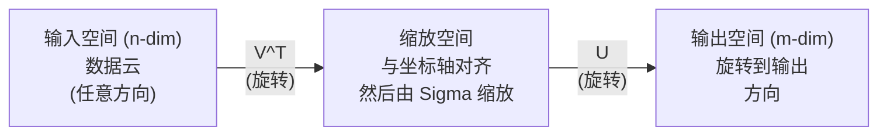
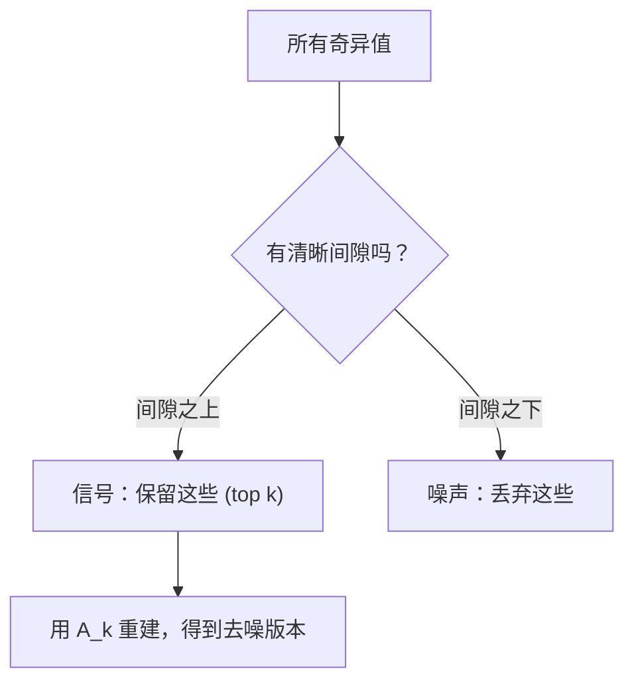

# Décomposition de la valeur singulière

> Le SVD est un outil de référence dans le calcul de la ligne. Chaque matrice a un SVD.

**Type:** Build
**Languages:** Python, Julia
**Prerequisites:** Phase 1，Lessons 01 (Linear Algebra Intuition)、02 (Vectors & Matrices Operations)、03 (Matrix Transformations)
**Time:** ~120 minutes

## Objectif de l'apprentissage
- 通过动力代代实现 SVD,并解释 U、Sigma 和 V^T 的几何含义
-  appliquer des SVD tronqués  effectuer des compressions d'image,并 mesurer la relation entre le taux de compression et les erreurs de reconstruction
- À travers le SVD  calcul du pseudo-inverse Moore-Penrose, à la recherche de résoudre le super-déterminé les plus petits carrés  système
- Pour les SVD et les PCA, les facteurs latente et l'analyse sémantique latente de la PNL sont liés.

##  problématique
Vous avez une matrice de 1000x2000. Il peut être un utilisateur de films. Il peut être un document. Il peut aussi être une image de la valeur de la image. Vous devez la compresser, faire du bruit, trouver une structure cachée, ou l'utiliser pour résoudre un système de minuscules carrés. La composition de l'image ne peut être utilisée que pour les dimensions.

SVD est applicable à toute matrice. Il est de forme ou de rang. Il est divisé en trois facteurs, révélant la géométrie de la matrice. Il est la factualisation la plus commune et la plus utile de tous les facteurs.

## 概念
### SVD dans quelque chose à faire

Chaque matrice, quelle que soit sa forme, exécute trois opérations en ordre: rotation, resserrement, rotation.

```
A = U * Sigma * V^T

      m x n     m x m    m x n    n x n
     (任意)    (旋转)   (缩放)   (旋转)
```

给定任意 Matrix A,SVD le décomposera en:
- V^T 旋转输入空间 (n 维) dans le vecteur
- Sigma  sur chaque axe pour se réduire
- Vous allez faire le tour du résultat à l' espace de sortie



Vous pouvez comprendre ainsi. Vous avez donné une matrice à SVD. Elle vous dira:  Cette matrice va d'abord utiliser V^T pour faire tourner l'objet, puis utiliser Sigma pour le faire tourner en boule, puis utiliser U pour faire tourner cette boule.  Une valeur étrange est la longueur de chaque axe de cette boule.

### La décomposition complète

Pour la forme m x n de la matrice A:

```
A = U * Sigma * V^T

其中：
  U     是 m x m，正交 (U^T U = I)
  Sigma 是 m x n，对角（奇异值位于对角线上）
  V     是 n x n，正交 (V^T V = I)

奇异值 sigma_1 >= sigma_2 >= ... >= sigma_r > 0
其中 r = rank(A)
```

Les éléments opposés à la sigme sont appelés étranges. Ils sont toujours négatifs et suivent la règle suivant.

### Vecteurs singuliers gauche  valeurs singulières  vecteurs singuliers droits

Chaque composante du SVD a des significations géographiques différentes.

**Right singular vectors（V 的列）：**Elles sont des directions de l'espace de sortie, la matrice les traverse vers les directions de l'espace de sortie.

**Singular values（Sigma 的对角线）：**它们是缩放因子──第一个奇异值告诉你,Matrix 沿第一个右奇异Vèctor 方向将将向向拉伸多少──奇异值为零 signifie que la Matrice将将该方向完全压──

**Left singular vectors（U 的列）：**它们为输出空间(R^m) constituent un ensemble de bases orthonnormales。第 i 个左奇异向量是第 i个右奇异向量 经过缩放后在输出空间中落到的方向──

¦ Les relations entre elles:

```
A * v_i = sigma_i * u_i

Matrix A 接收第 i 个右奇异Vector v_i，
用 sigma_i 对其缩放，并将其映射到第 i 个左奇异Vector u_i。
```

Cela donne une image de matrice de chaque élément.

### Forme de produit externe

SVD peut être écrit en rang-1 Matrix de:

```
A = sigma_1 * u_1 * v_1^T + sigma_2 * u_2 * v_2^T + ... + sigma_r * u_r * v_r^T

每一项 sigma_i * u_i * v_i^T 都是一个 rank-1 Matrix（一个 outer product）。
完整 Matrix 是 r 个这类 Matrix 的和，其中 r 是 rank。
```

Cette forme est la base de l'approximation de rang inférieur. Chaque élément ajoute une structure de couche. La première est de capturer le modèle unique le plus important. La deuxième est de capturer le modèle secondaire le plus important.

```
Rank-1 approx:    A_1 = sigma_1 * u_1 * v_1^T
                  (捕获主导模式)

Rank-2 approx:    A_2 = sigma_1 * u_1 * v_1^T + sigma_2 * u_2 * v_2^T
                  (捕获两个最重要的模式)

Rank-k approx:    A_k = top k 项之和
                  (根据 Eckart-Young theorem，这是最优的)
```

### Relation avec la composition propre

SVD et composition propre ont un lien profond. Un vecteur étrange et une valeur étrange proviennent directement des valeurs propres d'A^T et d'A^T avec les vecteurs propres.

```
A^T A = V * Sigma^T * U^T * U * Sigma * V^T
      = V * Sigma^T * Sigma * V^T
      = V * D * V^T

其中 D = Sigma^T * Sigma 是一个对角 Matrix，其对角线上为 sigma_i^2。

因此：
- 右奇异Vector (V) 是 A^T A 的 eigenvectors
- 奇异值的平方 (sigma_i^2) 是 A^T A 的 eigenvalues

类似地：
A A^T = U * Sigma * V^T * V * Sigma^T * U^T
      = U * Sigma * Sigma^T * U^T

因此：
- 左奇异Vector (U) 是 A A^T 的 eigenvectors
- A A^T 的 eigenvalues 也都是 sigma_i^2
```

Ce lien vous dit trois choses:
1. 奇异值总是实数且非负 (elles sont les valeurs propres de la matrice semi-définie positive) ⋅
2. Vous pouvez faire votre propre composition à travers A^T A pour calculer SVD, mais ce sera le nombre de condition carrée et la perte de la valeur numérique.
3. Lorsque A est symétrique et positive semi-définie, SVD et sa propre composition sont la même chose.

### SVD tronqué: approximation de rang inférieur

Le théorème d'Eckart-Young-Mirsky indique qu'un meilleur rang-k proche de la norme Frobenius et de la norme spectrale (en bas) peut être obtenu en conservant uniquement la valeur supérieure de la valeur étrange et de son vecteur de correspondance:

```
A_k = U_k * Sigma_k * V_k^T

其中：
  U_k     是 m x k  (U 的前 k 列)
  Sigma_k 是 k x k  (Sigma 的左上 k x k 块)
  V_k     是 n x k  (V 的前 k 列)

近似误差 = sigma_{k+1}  (在 spectral norm 下)
         = sqrt(sigma_{k+1}^2 + ... + sigma_r^2)  (在 Frobenius norm 下)
```

Ce n'est pas seulement un bon approximation. C'est le meilleur classement de la classe K.

| Component | Relative magnitude | Kept in rank-3 approx? |
|-----------|-------------------|------------------------|
| sigma_1 | 最大 | 是 |
| sigma_2 | 大 | 是 |
| sigma_3 | 中等偏大 | 是 |
| sigma_4 | 中等 | 否（误差） |
| sigma_5 | 中等偏小 | 否（误差） |
| sigma_6 | 小 | 否（误差） |
| sigma_7 | 很小 | 否（误差） |
| sigma_8 | 极小 | 否（误差） |

保留 top 3: A_3 捕获三个最大的奇异值──误差 = 剩值(sigma_4 到 sigma_8)。

Si la détérioration est lente, cette matrice n'a pas de structure de bas rang.

### Utiliser SVD  pour effectuer une compression d'image

L'image de gris est une matrice composée de la force de la image. Une image de 800x600 a une valeur de 480.000.

```
原始图像：800 x 600 = 480,000 个值

rank k 的 SVD：
  U_k:      800 x k 个值
  Sigma_k:  k 个值
  V_k:      600 x k 个值
  总计:     k * (800 + 600 + 1) = k * 1401 个值

  k=10:   14,010 个值   (原始的 2.9%)
  k=50:   70,050 个值  (原始的 14.6%)
  k=100: 140,100 个值  (原始的 29.2%)

  k 越小，压缩率越好，
  但视觉质量会下降。
```

关键洞察: Les images naturelles de la nature sont en train de se dégrader rapidement. Les premières images captent des structures à grande échelle, les formes et les degrés.

### SVD utilise le système de recommandation

Netflix Prize 让这个点广为人知──你有一个用户电影评分矩阵, dont la plupart des articles sont manquants──

```
             Movie1  Movie2  Movie3  Movie4  Movie5
  User1      [  5      ?       3       ?       1  ]
  User2      [  ?      4       ?       2       ?  ]
  User3      [  3      ?       5       ?       ?  ]
  User4      [  ?      ?       ?       4       3  ]

  ? = 未知评分
```

核心思想: cette note Matrix 具有低级别──用户的品味不是完全独立──有几个隐藏因素──动作对剧情、旧对新、理性对感官)能够解释大多数偏好──

Pour les matrices de remplissage, il sera divisé en:
- U: espace de facteur latent 中的用户配置
- Sigma: importance de chaque facteur latent
- V^T: espace facteur latent 中的电影资料

Le profil de l'utilisateur est le produit dot du profil du film.

En pratique, vous utiliserez le SVD ou ALS de Simon Funk (alternant les plus petits carrés) qui peuvent traiter directement les variations de données manquantes.

### SVD:Analyse sémantique latente de la PNL

L'analyse sémantique latente (LSA), également appelée indexation sémantique latente (LSI), sera utilisé dans le document matrice à terme.

```
             Doc1   Doc2   Doc3   Doc4
  "cat"      [  3      0      1      0  ]
  "dog"      [  2      0      0      1  ]
  "fish"     [  0      4      1      0  ]
  "pet"      [  1      1      1      1  ]
  "ocean"    [  0      3      0      0  ]

rank k=2 的 SVD 之后：

  每个文档变成 2D “概念空间”中的一个点。
  每个词项变成同一个 2D 空间中的一个点。
  主题相似的文档会聚在一起。
  含义相似的词项会聚在一起。

  "cat" 和 "dog" 最终会靠近彼此（陆地宠物）。
  "fish" 和 "ocean" 最终会靠近彼此（水相关概念）。
  如果 Doc1 和 Doc3 共享相似主题，它们会聚在一起。
```

LSA est l'une des premières méthodes de réussite pour capturer la similitude des termes dans les textes originaux. Elle est donc efficace, car les termes sont souvent présents dans les documents similaires, de sorte que les SVD les considèrent comme étant les mêmes dimensions latentes.

### SVD pour la réduction du bruit

Les données de bruit se concentrent généralement sur les valeurs les plus élevées, tandis que le bruit est dispersé sur toutes les valeurs les plus élevées.

**干净信号的奇异值：**

| Component | Magnitude | Type |
|-----------|-----------|------|
| sigma_1 | 非常大 | 信号 |
| sigma_2 | 大 | 信号 |
| sigma_3 | 中等 | 信号 |
| sigma_4 | 接近零 | 可忽略 |
| sigma_5 | 接近零 | 可忽略 |

**有噪声信号的奇异值（噪声会加到所有分量上）：**

| Component | Magnitude | Type |
|-----------|-----------|------|
| sigma_1 | 非常大 | 信号 |
| sigma_2 | 大 | 信号 |
| sigma_3 | 中等 | 信号 |
| sigma_4 | 小 | 噪声 |
| sigma_5 | 小 | 噪声 |
| sigma_6 | 小 | 噪声 |
| sigma_7 | 小 | 噪声 |



Il est utilisé pour le traitement des signaux, la mesure scientifique et le nettoyage des données. À tout moment, tant que votre matrice est contaminée par le bruit, le SVD tronqué est une méthode de séparation du bruit de la foi.

### Pseudo-inverse par voie de SVD

Moore-Penrose pseudo-inverse A+ va faire inversion de la matrice  promouvoir à la non-faction et à la matrice étrange。SVD faire sa calculation devenir très simple。

```
如果 A = U * Sigma * V^T，那么：

A+ = V * Sigma+ * U^T

其中 Sigma+ 的构造方式为：
  1. 转置 Sigma（交换行和列）
  2. 将每个非零对角元素 sigma_i 替换为 1/sigma_i
  3. 零保持为零

对于 A (m x n)：      A+ 是 (n x m)
对于 Sigma (m x n)：  Sigma+ 是 (n x m)
```

pseudoinverse peut être demandé les plus petits carrés 问题──如果 Ax = b 没有精确解(超定系统), alors x = A+ b 就是最小的平方 解(最小化的Ax - b 时时时) ‖

```
超定系统（方程数多于未知数）：

  [1  1]         [3]
  [2  1] x   =   [5]       不存在精确解。
  [3  1]         [6]

  x_ls = A+ b = V * Sigma+ * U^T * b

  这给出了使残差平方和最小的 x。
  结果与 normal equations (A^T A)^(-1) A^T b 相同，
  但数值上更稳定。
```

### Stabilité numérique 优势

計算 A^T A's eigencomposition 会平方奇异值(A^T A's eigenvalues sont sigma_i^2)。

```
示例：
  A 的奇异值为 [1000, 1, 0.001]
  A 的 condition number：1000 / 0.001 = 10^6

  A^T A 的 eigenvalues 为 [10^6, 1, 10^{-6}]
  A^T A 的 condition number：10^6 / 10^{-6} = 10^{12}

  直接计算 SVD：使用 condition number 10^6
  通过 A^T A 计算：使用 condition number 10^{12}
                   （额外损失 6 位精度）
```

现代 SVD 算法(Golub-Kahan bi-diagonalization) directement dans A 上工作,从不构建 A^T A── voilà pourquoi vous devriez toujours prioriser l'utilisation `np.linalg.svd(A)`, au lieu de `np.linalg.eig(A.T @ A)`Il y a une autre.

### Connexion à PCA

Le PCA est le SVD à l'égard des données centralisées.

```
给定数据 Matrix X (n_samples x n_features)，已中心化（减去均值）：

Covariance Matrix: C = (1/(n-1)) * X^T X

PCA 寻找 C 的 eigenvectors。但：

  X = U * Sigma * V^T    (X 的 SVD)

  X^T X = V * Sigma^2 * V^T

  C = (1/(n-1)) * V * Sigma^2 * V^T

所以 principal components 恰好就是右奇异Vector V。
每个 component 的 explained variance 是 sigma_i^2 / (n-1)。

在 sklearn 中，PCA 使用 SVD 实现，而不是 eigendecomposition。
它更快，数值上也更稳定。
```

Cela signifie que tout ce que vous avez appris dans la leçon 10 sur la réduction de la dimensionnalité, le fond est SVD;;PCA est l'application la plus courante de SVD dans le ML;;


```figure
svd-rank-reconstruction
```

## - Je le construis.
### 步骤 1: SVD à partir de zéro en utilisant l'itération de puissance

Pour trouver la plus grande valeur étrange et son vecteur, on peut utiliser l'itération de puissance A^T A^T ou A^T A^T.

```python
import numpy as np

def power_iteration(M, num_iters=100):
    n = M.shape[1]
    v = np.random.randn(n)
    v = v / np.linalg.norm(v)

    for _ in range(num_iters):
        Mv = M @ v
        v = Mv / np.linalg.norm(Mv)

    eigenvalue = v @ M @ v
    return eigenvalue, v

def svd_from_scratch(A, k=None):
    m, n = A.shape
    if k is None:
        k = min(m, n)

    sigmas = []
    us = []
    vs = []

    A_residual = A.copy().astype(float)

    for _ in range(k):
        AtA = A_residual.T @ A_residual
        eigenvalue, v = power_iteration(AtA, num_iters=200)

        if eigenvalue < 1e-10:
            break

        sigma = np.sqrt(eigenvalue)
        u = A_residual @ v / sigma

        sigmas.append(sigma)
        us.append(u)
        vs.append(v)

        A_residual = A_residual - sigma * np.outer(u, v)

    U = np.column_stack(us) if us else np.empty((m, 0))
    S = np.array(sigmas)
    V = np.column_stack(vs) if vs else np.empty((n, 0))

    return U, S, V
```

### 步骤 2: Test et comparer avec NumPy

```python
np.random.seed(42)
A = np.random.randn(5, 4)

U_ours, S_ours, V_ours = svd_from_scratch(A)
U_np, S_np, Vt_np = np.linalg.svd(A, full_matrices=False)

print("Our singular values:", np.round(S_ours, 4))
print("NumPy singular values:", np.round(S_np, 4))

A_reconstructed = U_ours @ np.diag(S_ours) @ V_ours.T
print(f"Reconstruction error: {np.linalg.norm(A - A_reconstructed):.8f}")
```

### 步骤 3: démo de compression d'image

```python
def compress_image_svd(image_matrix, k):
    U, S, Vt = np.linalg.svd(image_matrix, full_matrices=False)
    compressed = U[:, :k] @ np.diag(S[:k]) @ Vt[:k, :]
    return compressed

image = np.random.seed(42)
rows, cols = 200, 300
image = np.random.randn(rows, cols)

for k in [1, 5, 10, 20, 50]:
    compressed = compress_image_svd(image, k)
    error = np.linalg.norm(image - compressed) / np.linalg.norm(image)
    original_size = rows * cols
    compressed_size = k * (rows + cols + 1)
    ratio = compressed_size / original_size
    print(f"k={k:>3d}  error={error:.4f}  storage={ratio:.1%}")
```

### 步骤 4: Réduction du bruit

```python
np.random.seed(42)
clean = np.outer(np.sin(np.linspace(0, 4*np.pi, 100)),
                 np.cos(np.linspace(0, 2*np.pi, 80)))
noise = 0.3 * np.random.randn(100, 80)
noisy = clean + noise

U, S, Vt = np.linalg.svd(noisy, full_matrices=False)
denoised = U[:, :5] @ np.diag(S[:5]) @ Vt[:5, :]

print(f"Noisy error:    {np.linalg.norm(noisy - clean):.4f}")
print(f"Denoised error: {np.linalg.norm(denoised - clean):.4f}")
print(f"Improvement:    {(1 - np.linalg.norm(denoised - clean) / np.linalg.norm(noisy - clean)):.1%}")
```

### 步骤 5: Pseudoinverse

```python
A = np.array([[1, 1], [2, 1], [3, 1]], dtype=float)
b = np.array([3, 5, 6], dtype=float)

U, S, Vt = np.linalg.svd(A, full_matrices=False)
S_inv = np.diag(1.0 / S)
A_pinv = Vt.T @ S_inv @ U.T

x_svd = A_pinv @ b
x_lstsq = np.linalg.lstsq(A, b, rcond=None)[0]
x_pinv = np.linalg.pinv(A) @ b

print(f"SVD pseudoinverse solution:  {x_svd}")
print(f"np.linalg.lstsq solution:   {x_lstsq}")
print(f"np.linalg.pinv solution:    {x_pinv}")
```

## Utilisez-le
完整可运行 démo 位于 `code/svd.py` L'utilisation de la SVD dans les systèmes de compression d'images, de l'analyse sémantique latente et du réduit du bruit.

```bash
python svd.py
```

`code/svd.jl`中的Julia 版本使用Julia Originaire `svd()`函数和 `LinearAlgebra`Le paquet 演示相同概念──

```bash
julia svd.jl
```

## Je le livre.
Le cours est ouvert à:
- `outputs/skill-svd.md`- une compétence pour comprendre quand et comment appliquer le SVD dans un projet réel

## 练习
1. De la réalisation de la SVD complète à zéro, pas d'itération de puissance.

2. L'image est en grêle de taille. Elle est compressée par le graphiste.

3. Construire un système de recommandation micro ⋅ Créer une matrice de notation d'utilisateur de films 10x8 qui contient des articles connus ⋅ utiliser la valeur moyenne pour remplir les articles manquants ⋅ calculer les SVD 并重建级-3 近似── utiliser la matrice de notation de défauts ⋅ vérifier les résultats des prévisions sont raisonnables ⋅

4.  Créer une matrice documental à terme de 100x50, contenant 3 thèmes synthétiques. Chaque thème a 5 mots associés. ∙ ∙ ∙ ∙ ∙ ∙ ∙ ∙ ∙ ∙ ∙ ∙ ∙ ∙ ∙ ∙ ∙ ∙ ∙ ∙ ∙ ∙ ∙ ∙ ∙ ∙ ∙ ∙ ∙ ∙ ∙ ∙ ∙ ∙ ∙ ∙ ∙ ∙ ∙ ∙ ∙ ∙ ∙ ∙ ∙ ∙ ∙ ∙ ∙ ∙ ∙ ∙ ∙ ∙ ∙ ∙ ∙ ∙ ∙ ∙ ∙ ∙ ∙ ∙ ∙ ∙ ∙ ∙ ∙ ∙ ∙ ∙ ∙ ∙ ∙ ∙ ∙ ∙ ∙ ∙ ∙ ∙ ∙ ∙ ∙ ∙ ∙ ∙ ∙ ∙ ∙ ∙ ∙ ∙ ∙ ∙ ∙ ∙ ∙ ∙ ∙ ∙ ∙ ∙ ∙ ∙ ∙ ∙ ∙ ∙ ∙ ∙ ∙ ∙ ∙ ∙ ∙    ∙ ∙ ∙       ∙        ∙              ∙                                                                                                                                                                                                         

5. 生成一个干净的低级矩阵(ranking 3,大小 50x40),并不同水平下添加高斯噪音(sigma = 0,1、0.5、1.0、2.0)。 Pour chaque niveau de bruit, en passant par k=1 à 40 扫描并测量对干净矩阵的重建错误, trouver le meilleur tranchage rang。绘制最优 k 如何随噪水平变化。

## 关键术语
| Term | What people say | What it actually means |
|------|----------------|----------------------|
| SVD | “Factor 任意 Matrix” | 将 A 分解为 U Sigma V^T，其中 U 和 V 是正交的，Sigma 是具有非负元素的对角 Matrix。适用于任意形状的任意 Matrix。 |
| Singular value | “这个 component 有多重要” | Sigma 的第 i 个对角元素。衡量 Matrix 沿第 i 个 principal direction 拉伸的程度。总是非负，并按降序排列。 |
| Left singular vector | “输出方向” | U 的一列。第 i 个右奇异Vector 经过 sigma_i 缩放后映射到的输出空间方向。 |
| Right singular vector | “输入方向” | V 的一列。输入空间中的一个方向，Matrix 会将其映射到第 i 个左奇异Vector（经过 sigma_i 缩放后）。 |
| Truncated SVD | “Low-rank approximation” | 只保留 top k 个奇异值及其 Vector。生成原始 Matrix 的可证明最佳 rank-k 近似（Eckart-Young theorem）。 |
| Rank | “真实维度” | 非零奇异值的数量。告诉你 Matrix 实际使用了多少个独立方向。 |
| Pseudoinverse | “广义逆” | V Sigma+ U^T。对非零奇异值取倒数，零保持为零。为非方阵或奇异 Matrix 求解 least-squares 问题。 |
| Condition number | “对误差有多敏感” | sigma_max / sigma_min。大的 condition number 意味着很小的输入变化会造成很大的输出变化。SVD 直接揭示这一点。 |
| Latent factor | “隐藏变量” | SVD 发现的 low-rank space 中的一个维度。在推荐中，latent factor 可能对应类型偏好。在 NLP 中，它可能对应一个主题。 |
| Frobenius norm | “Matrix 的总大小” | 所有元素平方和的平方根。等于所有奇异值平方和的平方根。用于衡量近似误差。 |
| Eckart-Young theorem | “SVD 给出最佳压缩” | 对任意目标 rank k，truncated SVD 会在所有可能的 rank-k Matrix 中最小化近似误差。 |
| Power iteration | “找到最大的 eigenvector” | 反复用 Matrix 乘以一个随机 Vector 并归一化。会收敛到具有最大 eigenvalue 的 eigenvector。它是许多 SVD 算法的构建模块。 |

## 延伸阅读
- [Gilbert Strang: Linear Algebra and Its Applications, Chapter 7](https://math.mit.edu/~gs/linearalgebra/)- une analyse approfondie des SVD et de leur application
- [3Blue1Brown: But what is the SVD?](https://www.youtube.com/watch?v=vSczTbgc8Rc)- La réaction de la SVD
- [We Recommend a Singular Value Decomposition](https://www.ams.org/publicoutreach/feature-column/fcarc-svd)- Société américaine de mathématiques  facile à comprendre
- [Netflix Prize and Matrix Factorization](https://sifter.org/~simon/journal/20061211.html)- Simon Funk  sur le SVD utilisé pour la recommandation original blog articles
- [Latent Semantic Analysis](https://en.wikipedia.org/wiki/Latent_semantic_analysis)- SVD dans les premières applications de la PNL
- [Numerical Linear Algebra by Trefethen and Bau](https://people.maths.ox.ac.uk/trefethen/text.html)- Comprendre les algorithmes de SVD et leur nature numérique
