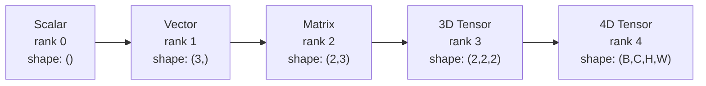
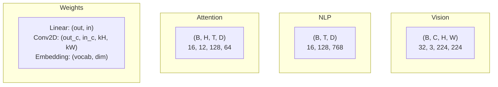
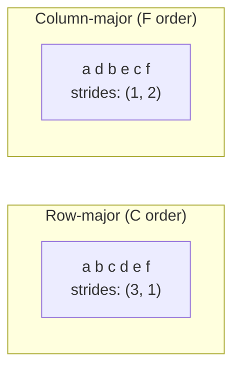
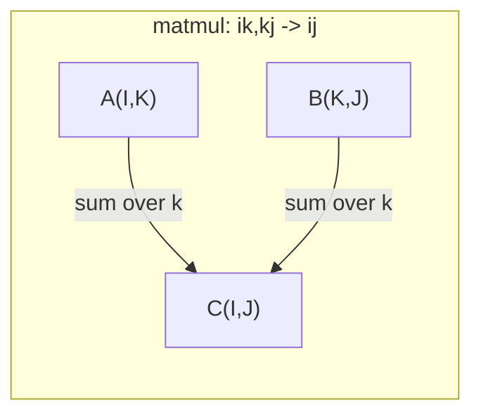

# Opérations de tensions

> Les tensors sont le langage commun entre les données et l'apprentissage profond. Chaque image, chaque phrase, chaque gradient les traverse.

**Type:** Build
**Language:**Python
**前置要求：**Phase 1, Leçons 01 (Intuition de l'algèbre linéaire),02 (Vecteurs, matrices et opérations)
**Time:** ~90 分钟

## Objectif de l'apprentissage
- De la réalisation d'une classe de tensor, soutenir la forme, les étapes, la remise en forme, la transposition et les opérations à base d'éléments
-  application de la radiodiffusion  règles, en cas de données non compilées  effectuer des calculs sur des tensors de différentes formes 
- Pour les produits dotés, les multiplications de matrice, les produits externes et les opérations en lots
-  Suivre attention multi-tête à chaque étape de la forme de la tension exacte

##  problématique
Tu as construit un transformateur... passe-pour-avant, il est très propre...`RuntimeError: mat1 and mat2 shapes cannot be multiplied (32x768 and 512x768)`Tu es en train de transposer ces formes.`Expected 4D input (got 3D input)`Tu as ajouté un peu de dépression.

Les erreurs de forme sont les plus courantes dans le code d'apprentissage profond. Elles ne sont pas difficiles à concevoir. Chaque opération a un contrat de forme. Mais elles se superposent rapidement. Un transformateur met plusieurs dizaines de formes, de transpositions et de transmissions en ligne. Un axe est malformé, l'erreur se produit au niveau de la connexion.

Matrices  traitement  relations entre deux groupes de choses                                                                                                                                                                                                                                                                                                                                                                                                                                                                                                                   `(32, 3, 224, 224)`Avec 12 têtes de l'Autonomie, c'est aussi 4D:`(batch, heads, seq_len, head_dim)`◊ vous avez besoin d'une structure de données qui peut être généralisée dans toutes les dimensions, et dont les opérations peuvent être en toutes dimensions.

## 概念
### Ce qu'est un tensor

Le tensor est un nombre de nombres multiples de types de données unifiés.**rank**(ou **order**)― Chaque dimension est une**axis**Il y a une autre.**shape**C'est un tuple, à chaque axe.



总元素数 = toutes les tailles de la multiplicité`(2, 3, 4)`包含 `2 * 3 * 4 = 24`Il y a des éléments.

### Des formes de tensions dans le milieu de l'apprentissage profond

Selon la coutume, différents types de données seront cartographiés à des formes spécifiques de tensor.



PyTorch utilise NCHW (channels-first) ――TensorFlow 默认使用 NHWC (channels-last)──

### Comment fonctionne la mise en page de la mémoire

L'array 2D de l'inventaire est un passage de la séquence de octets 1D.**Strides**Je vais vous dire combien d'éléments il faudra sauter sur chaque axe.



Transposez les données inertes. Il échange les pas, rendant le Tensor 变为 **non-contiguous**-- Les éléments d'une ligne ne sont plus proches de l'autre.

### Règles de radiodiffusion

La radiodiffusion vous permet de calculer des tensions de différentes formes en cas de non-réplique de données.

```
Tensor A:     (8, 1, 6, 1)
Tensor B:        (7, 1, 5)
Padded B:     (1, 7, 1, 5)
Result:       (8, 7, 6, 5)
```

### Einsum: opération de tensor à usage général

La somme d'Einstein avec les lettres marquant chaque axe. Les axes du milieu seront recherchés et seront conservés.



关键模式:`i,i->`(produit de point)`i,j->ij`(produit externe)`ii->`Je suis là.`ij->ji`(transposer)`bij,bjk->bik`(partie de matmul)`bhtd,bhsd->bhts`(Poule d'attention)


```figure
tensor-broadcast
```

## - Je le construis.
Le code se trouve`code/tensors.py`                                                                                                                                                                                                                                                              

### 步骤 1: Tensor 存储和步骤

Le tenseur  stockage d'une liste numérique 平, ainsi que des métadonnées de forme。 Les étapes  indiquent la logique d'indexation  comment placer plusieurs indices  mappage à 平 positions。

```python
class Tensor:
    def __init__(self, data, shape=None):
        if isinstance(data, (list, tuple)):
            self._data, self._shape = self._flatten_nested(data)
        elif isinstance(data, np.ndarray):
            self._data = data.flatten().tolist()
            self._shape = tuple(data.shape)
        else:
            self._data = [data]
            self._shape = ()

        if shape is not None:
            total = reduce(lambda a, b: a * b, shape, 1)
            if total != len(self._data):
                raise ValueError(
                    f"Cannot reshape {len(self._data)} elements into shape {shape}"
                )
            self._shape = tuple(shape)

        self._strides = self._compute_strides(self._shape)

    @staticmethod
    def _compute_strides(shape):
        if len(shape) == 0:
            return ()
        strides = [1] * len(shape)
        for i in range(len(shape) - 2, -1, -1):
            strides[i] = strides[i + 1] * shape[i + 1]
        return tuple(strides)
```

Pour la forme`(3, 4)`, pas de pas est `(4, 1)`-- avant de se lancer dans une ligne saute quatre éléments, avant de se lancer dans une ligne saute un élément.

### 步骤 2: Ressouffler, serrer, déserrer

Ressemble  modifier la forme, mais pas changer l'ordre des éléments ∙ ∙ ∙ ∙ ∙ ∙ ∙ ∙ ∙ ∙ ∙ ∙ ∙ ∙ ∙ ∙ ∙ ∙ ∙ ∙ ∙ ∙ ∙ ∙ ∙ ∙ ∙ ∙ ∙ ∙ ∙ ∙ ∙ ∙ ∙ ∙ ∙ ∙ ∙ ∙ ∙ ∙ ∙ ∙ ∙ ∙ ∙ ∙ ∙ ∙ ∙ ∙ ∙ ∙ ∙ ∙ ∙ ∙ ∙ ∙ ∙ ∙ ∙ ∙ ∙ ∙  ∙ ∙    ∙ ∙        ∙                                                                                                                                                                                                                                                                                                                                                    `-1`Laissez une dimension décrire sa taille.

```python
t = Tensor(list(range(12)), shape=(2, 6))
r = t.reshape((3, 4))
r = t.reshape((-1, 3))
```

Squeeze 会移除大小为 1 的轴──Unsqueeze 会插入一个──Unsqueezing对广播 至关重要 -- 一个偏向向向`(D,)`Ajout à lot `(B, T, D)`Ça va être un peu plus long.`(1, 1, D)`Il y a une autre.

```python
t = Tensor(list(range(6)), shape=(1, 3, 1, 2))
s = t.squeeze()
v = Tensor([1, 2, 3])
u = v.unsqueeze(0)
```

### Section 3 步: Transposer et permute

Transposez  échangez deux axes。 Permuter 重新排序所有轴── voilà la façon de transformer entre NCHW et NHWC。

```python
mat = Tensor(list(range(6)), shape=(2, 3))
tr = mat.transpose(0, 1)

t4d = Tensor(list(range(24)), shape=(1, 2, 3, 4))
perm = t4d.permute((0, 2, 3, 1))
```

Après transposition ou permution, le Tensor est non contigu à l'intérieur de l'inventaire.`view`会在非连接的子 上失败 -- 使用 `reshape`, ou d'abord`.contiguous()`Il y a une autre.

### 步骤 4: Opérations et réductions selon les éléments

Les opérations à base d'éléments (add, multiplie, soustraire) s'appliquent indépendamment à chaque élément, et conservent une forme différente.

```python
a = Tensor([[1, 2], [3, 4]])
b = Tensor([[10, 20], [30, 40]])
c = a + b
d = a * 2
s = a.sum(axis=0)
```

Le rapport mondial de la moyenne de CNN:`(B, C, H, W).mean(axis=[2, 3])` générer `(B, C)` L'interaction entre les parties concernées:`(B, T, D).mean(axis=1)` générer `(B, D)`Il y a une autre.

### 步骤 5: Radiodiffusion avec NumPy

`tensors.py`Le centre`demo_broadcasting_numpy()`La fonction  a montré le modèle central 

```python
activations = np.random.randn(4, 3)
bias = np.array([0.1, 0.2, 0.3])
result = activations + bias

images = np.random.randn(2, 3, 4, 4)
scale = np.array([0.5, 1.0, 1.5]).reshape(1, 3, 1, 1)
result = images * scale

a = np.array([1, 2, 3]).reshape(-1, 1)
b = np.array([10, 20, 30, 40]).reshape(1, -1)
outer = a * b
```

通过广播 计算对距离:将 `(M, 2)`réformé`(M, 1, 2)`,将 `(N, 2)`réformé`(1, N, 2)`,相减、平方、沿最后一个轴 求和、取平方根──结果为:`(M, N)`Il y a une autre.

### 步骤 6: opérations d'Einsum

`demo_einsum()`et `demo_einsum_gallery()`Les fonctions vont progressivement montrer chaque mode habituel.

```python
a = np.array([1.0, 2.0, 3.0])
b = np.array([4.0, 5.0, 6.0])
dot = np.einsum("i,i->", a, b)

A = np.array([[1, 2], [3, 4], [5, 6]], dtype=float)
B = np.array([[7, 8, 9], [10, 11, 12]], dtype=float)
matmul = np.einsum("ik,kj->ij", A, B)

batch_A = np.random.randn(4, 3, 5)
batch_B = np.random.randn(4, 5, 2)
batch_mm = np.einsum("bij,bjk->bik", batch_A, batch_B)
```

Le coût de calcul d'une contraction est le multiplicité de toutes les tailles de l'indice (reservées et recherchées) pour B=32、I=128、J=64、K=128`bij,bjk->bik`- Le numéro de la liste:`32 * 128 * 64 * 128 = 33,554,432`Deux fois plus.

### 步骤 7: Mécanisme d'attention par unité

`demo_attention_einsum()`fonction 端到端实现了多头注意力──

```python
B, H, T, D = 2, 4, 8, 16
E = H * D

X = np.random.randn(B, T, E)
W_q = np.random.randn(E, E) * 0.02

Q = np.einsum("bte,ek->btk", X, W_q)
Q = Q.reshape(B, T, H, D).transpose(0, 2, 1, 3)

scores = np.einsum("bhtd,bhsd->bhts", Q, K) / np.sqrt(D)
weights = softmax(scores, axis=-1)
attn_output = np.einsum("bhts,bhsd->bhtd", weights, V)

concat = attn_output.transpose(0, 2, 1, 3).reshape(B, T, E)
output = np.einsum("bte,ek->btk", concat, W_o)
```

Chaque étape est une opération de tension: projection (à travers l'insume) 执行 matmul) 、head splitting (à travers l'insume)  shape + transpose (à travers le matmul) 、 attention scores (à travers l'insume) 执行 batch matmul) 、 pondéré (à travers l'insume) 执行 batch matmul) 、head merging (à travers le matmul) ˆ transpose + reshape (à travers le matmul) 、 output projection (à travers l'insume 执行 matmul) ⋅

## Utilisez-le
### Scratch vs NumPy

| Operation | Scratch (Tensor class) | NumPy |
|---|---|---|
| Create | `Tensor([[1,2],[3,4]])` | `np.array([[1,2],[3,4]])` |
| Reshape | `t.reshape((3,4))` | `a.reshape(3,4)` |
| Transpose | `t.transpose(0,1)` | `a.T` or `a.transpose(0,1)` |
| Squeeze | `t.squeeze(0)` | `np.squeeze(a, 0)` |
| Sum | `t.sum(axis=0)` | `a.sum(axis=0)` |
| Einsum | N/A | `np.einsum("ij,jk->ik", a, b)` |

### Scratch contre PyTorch

```python
import torch

t = torch.tensor([[1, 2, 3], [4, 5, 6]], dtype=torch.float32)
t.shape
t.stride()
t.is_contiguous()

t.reshape(3, 2)
t.unsqueeze(0)
t.transpose(0, 1)
t.transpose(0, 1).contiguous()

torch.einsum("ik,kj->ij", A, B)
```

PyTorch  a augmenté le support pour l'autogradation 、GPU 和 optimisation des noyaux BLAS。 La sémantique de la forme est la même。 Si vous comprenez la version de grattage, les erreurs de forme PyTorch deviendront lisibles。

### Chaque couche de réseau neural est une opération de tension .

| Operation | Tensor Form | Einsum |
|---|---|---|
| Linear layer | `Y = X @ W.T + b` | `"bd,od->bo"` + bias |
| Attention QKV | `Q = X @ W_q` | `"btd,dh->bth"` |
| Attention scores | `Q @ K.T / sqrt(d)` | `"bhtd,bhsd->bhts"` |
| Attention output | `softmax(scores) @ V` | `"bhts,bhsd->bhtd"` |
| Batch norm | `(X - mu) / sigma * gamma` | element-wise + broadcast |
| Softmax | `exp(x) / sum(exp(x))` | element-wise + reduction |

## Je le livre.
Le cours est composé de deux instructions récurrentes:

1. **`outputs/prompt-tensor-shapes.md`**-- Une mise à jour de la mise en place de la procédure de débogage des dysfonctionnements de forme de Tensor. Elle contient chaque type d'opération habituelle (matmul, diffusion, chat, linéaire, convection, série, série, série) ainsi qu'une table de recherche de correction.

2. **`outputs/prompt-tensor-debugger.md`**-- Une mise à jour progressive, lorsque l'erreur de forme vous bloque, vous pouvez la coller à n'importe quel assistant d'IA.

## 练习
1. **Easy -- Reshape round-trip.**Prenez une forme`(2, 3, 4)`La tension va se remodeler pour`(6, 4)`, refait pour`(24,)`, puis revenir en arrière`(2, 3, 4)` En imprimant des données plates 验证 证每一步的元素顺序都被保留──

2. **Medium -- Implement broadcasting.**Pour`Tensor`classe 扩展一个 `broadcast_to(shape)`méthode, va grandir en 1 dimensions  étendre à la forme cible― puis modifier `_elementwise_op`, faire en sorte que la diffusion automatique soit effectuée avant l'exploitation.`(3, 1)`et `(1, 4)` effectuer des tests, les résultats devraient être produits `(3, 4)`Il y a une autre.

3. **Hard -- Build einsum from scratch.**                                                                                                                                                                                                                                                                                                                                                                                                                                                                                                                             `einsum(subscripts, *tensors)`fonction, au moins support:dot produit`i,i->`)、matrice multipliée`ij,jk->ik`)、produit extérieur`i,j->ij`) et transposer`ij->ji`)。 résoudre la chaîne de sous-scripts, identifier les indices contractés,并遍历所有指数组合──将你的结果与 `np.einsum`Pour le contraste.

4. **Hard -- Attention shape tracker.**编写一个函数,输入 `batch_size`- Je suis là.`seq_len`- Je suis là.`embed_dim`et `num_heads`,并印印多头注意每一步的精确形状:input、Q/K/V projection、head split、attention scores、softmax weights、weighted sum、head merge、output projection──与`demo_attention_einsum()`Les résultats de l'analyse

## 关键术语
| Term | What people say | What it actually means |
|---|---|---|
| Tensor | “一个 Matrix，但有更多 dimensions” | 一个具有统一 type 以及已定义 shape、strides 和 operations 的多维数组 |
| Rank | “dimensions 的数量” | axes 的数量。一个 Matrix 的 rank 是 2，而不是等于它的 matrix rank |
| Shape | “Tensor 的大小” | 一个 tuple，列出每个 axis 上的大小。`(2, 3)` 表示 2 行、3 列 |
| Stride | “内存如何排列” | 沿每个 axis 前进一个位置需要跳过的元素数量 |
| Broadcasting | “shapes 不同时它也能直接工作” | 一组严格规则：从右对齐，dimensions 必须相等，或其中一个必须是 1 |
| Contiguous | “Tensor 是正常的” | 元素在内存中按逻辑 layout 顺序连续存储，没有间隙或重排 |
| Einsum | “一种花哨的 matmul 写法” | 一种通用记法，可以用一行表达任意 Tensor contraction、outer product、trace 或 transpose |
| View | “和 reshape 一样” | 一个共享相同 memory buffer，但具有不同 shape/stride metadata 的 Tensor。会在 non-contiguous data 上失败 |
| Contraction | “对某个 index 求和” | Tensor 之间共享的 index 被相乘并求和，从而产生更低 rank 结果的一般 operation |
| NCHW / NHWC | “PyTorch vs TensorFlow format” | image tensors 的 memory layout conventions。NCHW 把 channels 放在 spatial dims 之前，NHWC 把它们放在之后 |

## 延伸阅读
- [NumPy Broadcasting](https://numpy.org/doc/stable/user/basics.broadcasting.html)-- 带有可见化示例的规范规则
- [PyTorch Tensor Views](https://pytorch.org/docs/stable/tensor_view.html)-- vues, comment utiliser, comment copier
- [einops](https://github.com/arogozhnikov/einops)-- une refaçon de la tenseur plus facile à lire, plus sûre
- [The Illustrated Transformer](https://jalammar.github.io/illustrated-transformer/)-- 可視化 Attention des formes de tenseur en mouvement
- [Einstein Summation in NumPy](https://numpy.org/doc/stable/reference/generated/numpy.einsum.html)-- 带有示例的完整的统计文件
