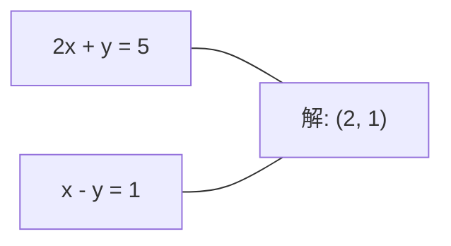
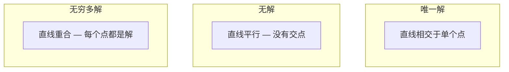

# Systèmes linéaires

> Ax = b est l'un des plus anciens problèmes de mathématiques, et il fonctionne encore aujourd'hui sur votre réseau neuronal.

**Type:** Build
**Language:**Python
**前置要求：**Phase 1,Léances 01 (Intuition de l'algèbre linéaire),02 (Vecteurs et matrices),03 (Transformations de matrice)
**Time:** ~120 minutes

## Objectif de l'apprentissage
- Utilisation avec pivots partiels et substitution de retour de l'élimination gaussienne 求解 Ax = b
- Utilisez LU、QR 和 Cholesky décompositions, décomposez la matrice, et expliquez chaque méthode appropriée scénario
- 推导 les équations normales des carrés les plus faibles,并将其与线性回归和脊回归 联系起来
- Utilisation de la condition numérotée  diagnostiquer les systèmes mal conçus,并 appliquer la régularisation de la position

##  problématique
Chaque entraînement de régression linéaire, vous êtes à la recherche de la résolution d'un système linéaire. Chaque fois que vous calculez les carrés les plus petits, vous êtes à la recherche de la résolution d'un système linéaire. Chaque couche de réseau neural.`y = Wx + b`Lorsque vous êtes en train d'évaluer le système linéaire, vous êtes en train de modifier ce système. Lorsque vous utilisez les processus gaussiens, vous êtes en train de décomposer une matrice.

方程 Ax = b 无处不在──A est une matrice composée de nombres connus──b est un vecteur composé de nombres connus──x est un vecteur dont on veut trouver l'inconnu──x est un vecteur dont on veut trouver l'inconnu──x est un vecteur de données.

Ce cours va vous aider à comprendre pourquoi certaines méthodes sont plus rapides et d'autres plus stables, pourquoi certaines méthodes ne sont applicables qu'aux systèmes carrés et d'autres peuvent traiter des systèmes surdéterminés, ainsi que pourquoi le nombre de conditions de la matrice décide si votre réponse a du sens.

## 概念
### Ax = b dans la géographie signifie quoi

Un système d'équations linéaires 具有几何解释──每方程 定义一个超平面──解就是所有超平面相交的点(或点集)──

```
2x + y = 5          2D 中的两条直线。
x - y  = 1          它们相交于 x=2, y=1。
```



Il peut survenir trois situations:



Dans une matrice, "une solution" signifie A est inversible, et "aucune solution" signifie système est incohérent, et "solution infini" signifie A a un espace nul, et la plupart des problèmes de l'outil ML appartiennent à une catégorie, car vos équations (point de données) sont plus petites que les inconnus.

### image de colonne contre image de rangée

Il y a deux façons de comprendre Ax = b:

**Row picture.**Chaque ligne d'un a définit une équation. Chaque équation est un hyperplane.

**Column picture.**Chaque rangée d'un A est un vecteur. Question transformée: Quelle combinaison linéaire de colonnes d'un A peut produire un b ?

```
A = | 2  1 |    b = | 5 |
    | 1 -1 |        | 1 |

Row picture: 同时求解 2x + y = 5 和 x - y = 1。

Column picture: 找到 x1, x2，使得：
  x1 * [2, 1] + x2 * [1, -1] = [5, 1]
  2 * [2, 1] + 1 * [1, -1] = [4+1, 2-1] = [5, 1]   check.
```

Si b est situé dans l'espace de colonne de A, le système a une solution. Si b n'est pas dans l'espace de colonne, vous trouverez l'espace de colonne au milieu de son point le plus proche.

### Élimination gaussienne

L'élimination gaussienne va ax = b 转换为上方三角形系统 Ux = c, puis revenir en arrière en substitution 求解──这是最直接的方法──

- Je suis un peu déçu.

```
1. 对每一列 k（pivot column）：
   a. 在第 k 行及其下方，找到 column k 中最大的 entry（partial pivoting）。
   b. 将该行与第 k 行交换。
   c. 对 k 下方的每一行 i：
      - 计算 multiplier m = A[i][k] / A[k][k]
      - 从第 i 行中减去 m 倍的第 k 行。
2. Back substitute：从最后一个 equation 向上求解。
```

Pour le cas:

```
Original:
| 2  1  1 | 8 |       R2 = R2 - (2)R1     | 2  1   1 |  8 |
| 4  3  3 |20 |  -->  R3 = R3 - (1)R1 --> | 0  1   1 |  4 |
| 2  3  1 |12 |                            | 0  2   0 |  4 |

                       R3 = R3 - (2)R2     | 2  1   1 |  8 |
                                       --> | 0  1   1 |  4 |
                                           | 0  0  -2 | -4 |

Back substitute:
  -2 * x3 = -4    -->  x3 = 2
  x2 + 2  = 4     -->  x2 = 2
  2*x1 + 2 + 2 = 8 --> x1 = 2
```

Le coût de calcul de l'élimination gaussienne est de O (n^3) ⋅ pour un système 1000x1000, c'est environ 10 milliards de fois d'opérations à point flottant ⋅ c'est très rapide, mais si vous avez besoin d'utiliser le même système ⋅ pour résoudre plusieurs systèmes, vous pouvez aussi faire mieux ⋅

### Le pivot partiel: Pourquoi est-il important ?

 sans pivotation, élimination gaussienne pourrait échouer ou produire des résultats déchetés

```
Bad pivot:                       With partial pivoting:
| 0.001  1 | 1.001 |            先交换行：
| 1      1 | 2     |            | 1      1 | 2     |
                                 | 0.001  1 | 1.001 |
m = 1/0.001 = 1000              m = 0.001/1 = 0.001
R2 = R2 - 1000*R1               R2 = R2 - 0.001*R1
| 0.001  1     | 1.001   |      | 1      1     | 2     |
| 0     -999   | -999.0  |      | 0      0.999 | 0.999 |

x2 = 1.000（正确）              x2 = 1.000（正确）
x1 = (1.001 - 1)/0.001          x1 = (2 - 1)/1 = 1.000（正确）
   = 0.001/0.001 = 1.000        稳定，因为 multiplier 很小。
```

Dans l'arithmétique des points flottants à précision limitée, la version non pivotée peut perdre des chiffres significatifs.

### Décomposition de l' LU

La décomposition de LU va faire une division en matrice triangulaire inférieure L et matrice triangulaire supérieure U:A = LU──L Matrice  stockage Élimination gaussienne En milieu de multiplicateurs──U Matrice est le résultat de l'élimination──

```
A = L @ U

| 2  1  1 |   | 1  0  0 |   | 2  1   1 |
| 4  3  3 | = | 2  1  0 | @ | 0  1   1 |
| 2  3  1 |   | 1  2  1 |   | 0  0  -2 |
```

Pourquoi faire un facteur plutôt que de l'éliminer directement ? Parce qu'une fois que l'on a L et U, il faut seulement O (n^2) pour trouver un nouveau b:

```
Ax = b
LUx = b
令 y = Ux:
  Ly = b    (forward substitution, O(n^2))
  Ux = y    (back substitution, O(n^2))
```

Le coût de l'O (n^3) ne se fait qu'en facteurisation, et il est payé une fois par jour.

Utilisez pivoter partiel 时, vous obtenez PA = LU, dont P est la matrice de permutation des swaps de rangées enregistrées.

### Décomposition de la QR

La décomposition QR va être divisée en matrice orthogonale Q 和 matrice triangulaire supérieure R:A = QR。

La matrice orthogonale 具有 Q^T Q = I 的性质──ses colonnes sont des vecteurs orthonnormes──乘以 Q 会保持长度和角──

```
A = Q @ R

Q has orthonormal columns: Q^T Q = I
R is upper triangular

To solve Ax = b:
  QRx = b
  Rx = Q^T b    (只需乘以 Q^T，不需要 inversion)
  Back substitute to get x.
```

Dans la recherche de solutions aux problèmes des carrés les plus petits, QR par rapport à LU dans la stabilité numérique 上更好── processus de Gram-Schmidt 逐列构建 Q:

```
Given columns a1, a2, ... of A:

q1 = a1 / ||a1||

q2 = a2 - (a2 . q1) * q1        (减去到 q1 上的 projection)
q2 = q2 / ||q2||                (normalize)

q3 = a3 - (a3 . q1) * q1 - (a3 . q2) * q2
q3 = q3 / ||q3||

R[i][j] = qi . aj    for i <= j
```

Chaque étape déplace le composant de tous les vecteurs Q précédents, ne laissant que la nouvelle direction orthogonale.

### Décomposition de Cholesky

Lorsque A est symétrique (((A = A^T) et positive définie (((toutes les valeurs propres sont normales), vous pouvez le décomposer en A = L^T, dont L est triangulaire inférieur.

```
A = L @ L^T

| 4  2 |   | 2  0 |   | 2  1 |
| 2  5 | = | 1  2 | @ | 0  2 |

L[i][i] = sqrt(A[i][i] - sum(L[i][k]^2 for k < i))
L[i][j] = (A[i][j] - sum(L[i][k]*L[j][k] for k < j)) / L[j][j]    for i > j
```

Cholesky est plus rapide que LU, et ne nécessite que la moitié de l'espace de stockage. Il ne s'applique qu'aux matrices symétriques positives déterminées, mais ce type de matrice apparaît fréquemment:

- Les matrices de covariance sont symétriques positives semi-définites (à travers la régulation, elles peuvent être transformées en positives définites).
- La matrice du noyau du processus gaussien est une définition positive symétrique.
- La fonction convexe dans le Hessian minimum est une définition positive symétrique.
- A^T A 总是 symétrique positive semi-définie.

Dans les processus gaussiens, vous utilisez Cholesky pour déchiffrer la matrice du noyau K, puis vous recherchez K alpha = y pour obtenir une signification prédictive── Cholesky facteur donne également un log-déterminant de probabilité marginale: log det(K) = 2 * somme(log(diag(L)))。

### Les carrés les plus faibles:当 Ax = b 没有精确解时

Si A est m x n 且 m > n(équations 多于未知), le système est surdéterminé.

```
minimize ||Ax - b||^2

这是 squared residuals 的总和：
  sum((A[i,:] @ x - b[i])^2 for i in range(m))
```

Minimiser  satisfaire les équations normales:

```
A^T A x = A^T b
```

推导:展开A 求 Gradient,并令其为零:2 A                                                                                                                                                                                                                                                     

```
Original system (overdetermined, 4 equations, 2 unknowns):
| 1  1 |         | 3 |
| 1  2 | x     = | 5 |       没有精确的 x 能满足全部 4 个 equations。
| 1  3 |         | 6 |
| 1  4 |         | 8 |

Normal equations:
A^T A = | 4  10 |    A^T b = | 22 |
        | 10 30 |            | 63 |

Solve: x = [1.5, 1.7]

这就是 linear regression。x[0] 是 intercept，x[1] 是 slope。
```

### Equations normales = régression linéaire

Cette relation est précise. Dans la régression linéaire, la matrice de données X Chaque ligne correspond à un échantillon, chaque rangée à une caractéristique, vecteur cible et chaque entrée à un échantillon, vecteur de poids est satisfaite:

```
X^T X w = X^T y
w = (X^T X)^(-1) X^T y
```

C'est une solution de régression linéaire en forme fermée.`sklearn.linear_model.LinearRegression.fit()`Pour les résultats de cette étude, il est nécessaire de calculer les prix de l'équipement.

À la matrice, vous obtenez une régression de crête.

```
(X^T X + lambda * I) w = X^T y
w = (X^T X + lambda * I)^(-1) X^T y
```

Régularisation va faire conditionner la matrice mieux (à savoir plus facilement) et réduire les poids vers l'inverse.

### Pseudoinverse (Moore-Penrose)

Pseudoinverse A+ va inverser la matrice 推广到非平方 和 singular matrices。 Pour n'importe quelle Matrice A:

```
x = A+ b

where A+ = V Sigma+ U^T    (computed via SVD)
```

Sigma + 通過對每個非零單位值 取相互并转置結果构成──如果 A = U Sigma V^T,那么 A+ = V Sigma+ U^T──

```
A = U Sigma V^T        (SVD)

Sigma = | 5  0 |       Sigma+ = | 1/5  0  0 |
        | 0  2 |                | 0  1/2  0 |
        | 0  0 |

A+ = V Sigma+ U^T
```

Pseudoinverse  donner une solution de la norme minimale des carrés les plus faibles―si le système a:
- 唯一解: A+ b 给出该解──
- 无解:A+b 给出 solution des carrés les moins élevés
- A+ b 给出 给出 给出 给出 给出 给出 给出 给出 给出 给出 给出 给出 给出 给出 给出 给出 给出 给出 给出 给出 给出 给出 给出 给出 给出 给出 给出 给出 给出 给出 给出 给出 给出 给出 给出 给出 给出 给出 给出 给出 给出 给出 给出 给出 给出 给出 给出 给出 给出 给出 给出 给出 给出 给出 给出 给出 给出 给出 给出 给出 给出 给出 给出 给出 给 给出 给 给 给 给 给 给 给 给 给 给 给 给 给 给 给 给 给 给 给 给 给 给 给 给 给 给 给 给 给 给 给 给 给 给 给 给 给 给 给 给 给 给 给 给 给 给 给 给 给 给 给 给 给 给 给 给 给 给 给 给 给

NumPy `np.linalg.lstsq`et `np.linalg.pinv`内部都使用 SVD。

### Numéro de condition

Le nombre de conditions  mesure de la solution à la petite variation de l'entrée                                                                                                                                                                                                                                                                                                                                                                                                                                                                                                            

```
kappa(A) = ||A|| * ||A^(-1)|| = sigma_max / sigma_min
```

Parmi elles, sigma_max 和 sigma_min 分别是最大和最小单数值──

```
Well-conditioned (kappa ~ 1):        Ill-conditioned (kappa ~ 10^15):
b 中的小变化 -->                    b 中的小变化 -->
x 中的小变化                         x 中的巨大变化

| 2  0 |   kappa = 2/1 = 2          | 1   1          |   kappa ~ 10^15
| 0  1 |   safe to solve            | 1   1+10^(-15) |   solution is garbage
```

经验法则:
- Il y a une solution.
- Vous avez perdu votre précision en calcul à point flottant.
- Pour le float64):solution 没有意义──Matrice 实际上是单数──

Dans le ML, le mal-conditionnement se produit dans les caractéristiques  quasi collineaire 时――régularisation(Add lambda * I) va être le numéro de condition de sigma_max / sigma_min 改善为 (sigma_max + lambda) / (sigma_min + lambda) ⋅

### Métodes itératives: gradient conjugé

Pour les systèmes très grands et rares, des millions d'inconnus, des méthodes directes comme LU ou Cholesky, des méthodes Iteratives seront utilisées à plusieurs reprises pour améliorer une approche de la solution.

Le gradient conjugué (CG) de A est symétrique positive définie 时求解 Ax = b。 il est précisé en arithmétique exacte le plus souvent n fois代找到精确解, mais si les valeurs propres de A 聚集, généralement会更快收──

```
Algorithm sketch:
  x0 = initial guess (often zero)
  r0 = b - A x0           (residual)
  p0 = r0                 (search direction)

  For k = 0, 1, 2, ...:
    alpha = (rk . rk) / (pk . A pk)
    x_{k+1} = xk + alpha * pk
    r_{k+1} = rk - alpha * A pk
    beta = (r_{k+1} . r_{k+1}) / (rk . rk)
    p_{k+1} = r_{k+1} + beta * pk
    if ||r_{k+1}|| < tolerance: stop
```

CG Utilisé par:
- Optimisation à grande échelle (méthode Newton-CG)
- 求解 Discrétations de la PDE
- Les méthodes du noyau, dont la matrice du noyau 太大无法因素
- 作为其他反复解决器的预定条件

Le taux de convergence dépend du nombre de conditions. Le meilleur système de conditionnement est plus rapide.

### Le tableau complet:何时使用哪种方法

| Method | Requirements | Cost | Use case |
|--------|-------------|------|----------|
| Gaussian elimination | Square, nonsingular A | O(n^3) | 对 square system 的一次性求解 |
| LU decomposition | Square, nonsingular A | O(n^3) factor + O(n^2) solve | 使用相同 A 的多次求解 |
| QR decomposition | Any A (m >= n) | O(mn^2) | Least squares，numerically stable |
| Cholesky | Symmetric positive definite A | O(n^3/3) | Covariance matrices，Gaussian processes，ridge regression |
| Normal equations | Overdetermined (m > n) | O(mn^2 + n^3) | Linear regression（小 n） |
| SVD / pseudoinverse | Any A | O(mn^2) | Rank-deficient systems，minimum-norm solutions |
| Conjugate gradient | Symmetric positive definite, sparse A | O(n * k * nnz) | Large sparse systems，k = iterations |

### Connexion à ML

Chaque méthode de cette classe apparaît dans la classe ML de production:

**Linear regression.**Solution de forme fermée 求解 équations normales X^T X w = X^T y。 Ceci peut être passé par Cholesky 如果 n 很小)、QR 如果数学的稳定性 很重要) 或 SVD 如果矩阵可能级缺)完成──

**Ridge regression.**Pour X^T X 添加 lambda * I。 Système régulier (X^T X + lambda * I) w = X^T y 总是可以通过Cholesky 求解,因为当 lambda > 0 时,X^T X + lambda * I 是对称正确的──

**Gaussian processes.**La moyenne prédictive 需要求解 K alpha = y, dont K est la matrice du noyau。对 K 做 Cholesky factualisation 是标准方法。Log probabilité marginale 使用 log det(K) = 2 somme(log(diag(L)))。

**Neural network initialization.**Initialization orthogonale Utilisation de décomposition QR Créer des colonnes pour des matrices de poids orthonnormales. Cela peut empêcher l'effondrement du signal des réseaux profonds.

**Preconditioning.**Optimisateurs à grande échelle Utilisez Cholesky incomplet ou LU incomplet 作为结合梯度溶剂的预先条件──

**Feature engineering.**Le numéro de condition X^T X  vous indique si les caractéristiques sont collineuses ⋅ si la kappa  très grande, supprimer les caractéristiques ou ajouter une régulation ⋅


```figure
linear-system-conditioning
```

## - Je le construis.
### 步骤 1: Élimination gaussienne avec pivots partiels

```python
import numpy as np

def gaussian_elimination(A, b):
    n = len(b)
    Ab = np.hstack([A.astype(float), b.reshape(-1, 1).astype(float)])

    for k in range(n):
        max_row = k + np.argmax(np.abs(Ab[k:, k]))
        Ab[[k, max_row]] = Ab[[max_row, k]]

        if abs(Ab[k, k]) < 1e-12:
            raise ValueError(f"Matrix is singular or nearly singular at pivot {k}")

        for i in range(k + 1, n):
            m = Ab[i, k] / Ab[k, k]
            Ab[i, k:] -= m * Ab[k, k:]

    x = np.zeros(n)
    for i in range(n - 1, -1, -1):
        x[i] = (Ab[i, -1] - Ab[i, i+1:n] @ x[i+1:n]) / Ab[i, i]

    return x
```

### 步骤 2: décomposition de l' LU

```python
def lu_decompose(A):
    n = A.shape[0]
    L = np.eye(n)
    U = A.astype(float).copy()
    P = np.eye(n)

    for k in range(n):
        max_row = k + np.argmax(np.abs(U[k:, k]))
        if max_row != k:
            U[[k, max_row]] = U[[max_row, k]]
            P[[k, max_row]] = P[[max_row, k]]
            if k > 0:
                L[[k, max_row], :k] = L[[max_row, k], :k]

        for i in range(k + 1, n):
            L[i, k] = U[i, k] / U[k, k]
            U[i, k:] -= L[i, k] * U[k, k:]

    return P, L, U

def lu_solve(P, L, U, b):
    n = len(b)
    Pb = P @ b.astype(float)

    y = np.zeros(n)
    for i in range(n):
        y[i] = Pb[i] - L[i, :i] @ y[:i]

    x = np.zeros(n)
    for i in range(n - 1, -1, -1):
        x[i] = (y[i] - U[i, i+1:] @ x[i+1:]) / U[i, i]

    return x
```

### 步骤 3: Décomposition de Cholesky

```python
def cholesky(A):
    n = A.shape[0]
    L = np.zeros_like(A, dtype=float)

    for i in range(n):
        for j in range(i + 1):
            s = A[i, j] - L[i, :j] @ L[j, :j]
            if i == j:
                if s <= 0:
                    raise ValueError("Matrix is not positive definite")
                L[i, j] = np.sqrt(s)
            else:
                L[i, j] = s / L[j, j]

    return L
```

### 步骤 4: Les carrés minimaux par les équations normales

```python
def least_squares_normal(A, b):
    AtA = A.T @ A
    Atb = A.T @ b
    return gaussian_elimination(AtA, Atb)

def ridge_regression(A, b, lam):
    n = A.shape[1]
    AtA = A.T @ A + lam * np.eye(n)
    Atb = A.T @ b
    L = cholesky(AtA)
    y = np.zeros(n)
    for i in range(n):
        y[i] = (Atb[i] - L[i, :i] @ y[:i]) / L[i, i]
    x = np.zeros(n)
    for i in range(n - 1, -1, -1):
        x[i] = (y[i] - L.T[i, i+1:] @ x[i+1:]) / L.T[i, i]
    return x
```

### 步骤 5: Numéro de condition

```python
def condition_number(A):
    U, S, Vt = np.linalg.svd(A)
    return S[0] / S[-1]
```

## Utilisez-le
Pour compiler ces parties, effectuer une régression linéaire et une régression de crête sur les données réelles:

```python
np.random.seed(42)
X_raw = np.random.randn(100, 3)
w_true = np.array([2.0, -1.0, 0.5])
y = X_raw @ w_true + np.random.randn(100) * 0.1

X = np.column_stack([np.ones(100), X_raw])

w_ols = least_squares_normal(X, y)
print(f"OLS weights (ours):    {w_ols}")

w_np = np.linalg.lstsq(X, y, rcond=None)[0]
print(f"OLS weights (numpy):   {w_np}")
print(f"Max difference: {np.max(np.abs(w_ols - w_np)):.2e}")

w_ridge = ridge_regression(X, y, lam=1.0)
print(f"Ridge weights (ours):  {w_ridge}")

from sklearn.linear_model import Ridge
ridge_sk = Ridge(alpha=1.0, fit_intercept=False)
ridge_sk.fit(X, y)
print(f"Ridge weights (sklearn): {ridge_sk.coef_}")
```

## Je le livre.
Le programme de formation
- `code/linear_systems.py`, contenant de zéro réalisation de l'élimination gaussienne, décomposition LU, décomposition Cholesky, carrés minimaux et régression de la crête
- Une démonstration de fonctionnalités, montrant les équations normales et la régression linéaire de sklearn  produisant les mêmes poids

## 练习
1. Utilisez votre élimination gaussienne, votre solvant LU et `np.linalg.solve`求解 système `[[1,2,3],[4,5,6],[7,8,10]] x = [6, 15, 27]` Testing  Tolérance au point flottant  Envoyer la même réponse

2. 生成一个50x5 matrice aléatoire X 和 cible y = X @ w_true + noise──分别使用正常方程、QR(通过 `np.linalg.qr`)、SVD(par le biais `np.linalg.svd`) et `np.linalg.lstsq`求解 w―比较四个解决方案──测量 X^T X 的条件数,并解释它如何影响你信任哪种方法──

3. 通過让两列几乎相同来创建一个几乎单一矩阵 (例如, colonne 2 = colonne 1 + 1e-10 * noise) ⋅ calculer son nombre de condition ⋅分别在有规律化和无规律化的情况下求解 Ax = b(加0.01 * I) ⋅ Compare solutions 和残留──解释为什么规律化有帮助──

4. Pour une matrice définie positive symétrique aléatoire 100x100  réaliser un algorithme de gradient conjugué 统计它收到容忍 1e-8 需要多少次反复――与 n 代复的理论最大值进行比较――

5. Dans les matrices symétriques positives de 10 50 200 500, sur votre solveur Cholesky, votre solveur LU et`np.linalg.solve`计时――绘制结果――验证 Cholesky 大约比 LU 快 2倍――

## 关键术语
| Term | What people say | What it actually means |
|------|----------------|----------------------|
| Linear system | "Solve for x" | 一组 linear equations Ax = b。找到 x 意味着找到在 transformation A 下产生 output b 的 input。 |
| Gaussian elimination | "Row reduce" | 使用 row operations 系统性地将 diagonal 下方的 entries 置零，产生可通过 back substitution 求解的 upper triangular system。O(n^3)。 |
| Partial pivoting | "Swap rows for stability" | 在 column k 中进行 elimination 前，将该 column 中 absolute value 最大的行交换到 pivot 位置。防止除以很小的数。 |
| LU decomposition | "Factor into triangles" | 写成 A = LU，其中 L 是 lower triangular（存储 multipliers），U 是 upper triangular（eliminated matrix）。将 O(n^3) 成本摊销到多次求解中。 |
| QR decomposition | "Orthogonal factorization" | 写成 A = QR，其中 Q 的 columns 是 orthonormal，R 是 upper triangular。对于 least squares，比 LU 更稳定。 |
| Cholesky decomposition | "Square root of a matrix" | 对 symmetric positive definite A，写成 A = LL^T。成本是 LU 的一半。用于 covariance matrices、kernel matrices 和 ridge regression。 |
| Least squares | "Best fit when exact is impossible" | 当 system overdetermined（equations 多于 unknowns）时，最小化 squared residuals 的总和 ||Ax - b||^2。 |
| Normal equations | "The calculus shortcut" | A^T A x = A^T b。将 ||Ax - b||^2 的 Gradient 设为零。这就是 linear regression 的 closed-form solution。 |
| Pseudoinverse | "Inversion for non-square matrices" | A+ = V Sigma+ U^T via SVD。对于任意 Matrix，无论 square 或 rectangular、singular 与否，给出 minimum-norm least-squares solution。 |
| Condition number | "How trustworthy is this answer" | kappa = sigma_max / sigma_min。衡量对 input perturbations 的敏感性。大约损失 log10(kappa) 位精度。 |
| Ridge regression | "Regularized least squares" | 求解 (X^T X + lambda I) w = X^T y。添加 lambda I 改善 conditioning，并将 weights 向零收缩。防止 overfitting。 |
| Conjugate gradient | "Iterative Ax=b for big matrices" | 用于 symmetric positive definite systems 的 iterative solver。最多 n 步收敛。适合 factorization 成本过高的大型 sparse systems。 |
| Overdetermined system | "More data than parameters" | 在 m-by-n system 中 m > n。不存在精确解。Least squares 找到最佳近似。这就是每个 regression problem。 |
| Back substitution | "Solve from the bottom up" | 给定 upper triangular system，先求解最后一个 equation，然后向后 substitute。O(n^2)。 |
| Forward substitution | "Solve from the top down" | 给定 lower triangular system，先求解第一个 equation，然后向前 substitute。O(n^2)。用于 LU solves 中的 L step。 |

## 延伸阅读
- [MIT 18.06: Linear Algebra](https://ocw.mit.edu/courses/18-06-linear-algebra-spring-2010/)(Gilbert Strang) --                                                                                                                                                                                                                                                                                                                                                                                                                                                                                                                      
- [Numerical Linear Algebra](https://people.maths.ox.ac.uk/trefethen/text.html)(Trefethen & Bau) -- Comprendre la stabilité numérique, la conditionnement et les algorithmes
- [Matrix Computations](https://www.cs.cornell.edu/cv/GolubVanLoan4/golubandvanloan.htm)(Golub & Van Loan) -- couvrant toutes sortes d'algorithmes de matrice
- [3Blue1Brown: Inverse Matrices](https://www.3blue1brown.com/lessons/inverse-matrices)-- pour la demande de résolution Ax = b 几何义的可视化直觉
