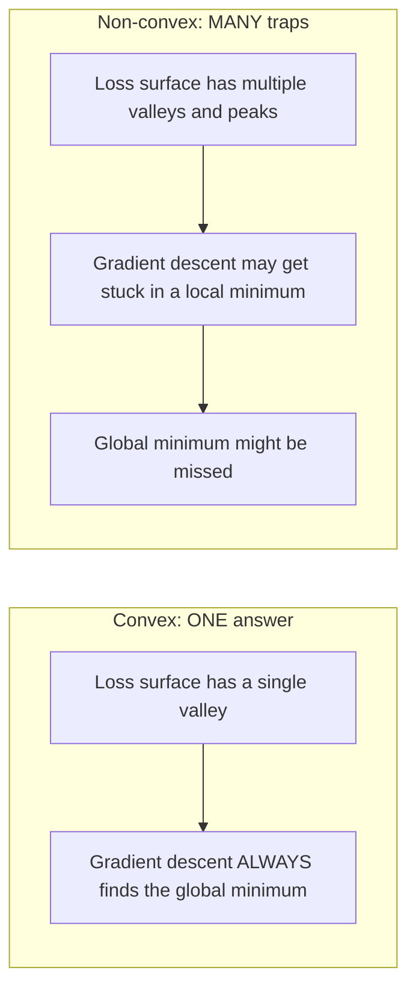
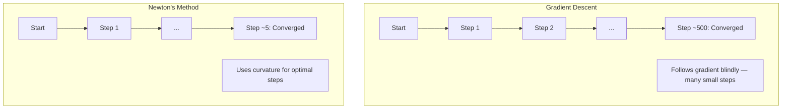
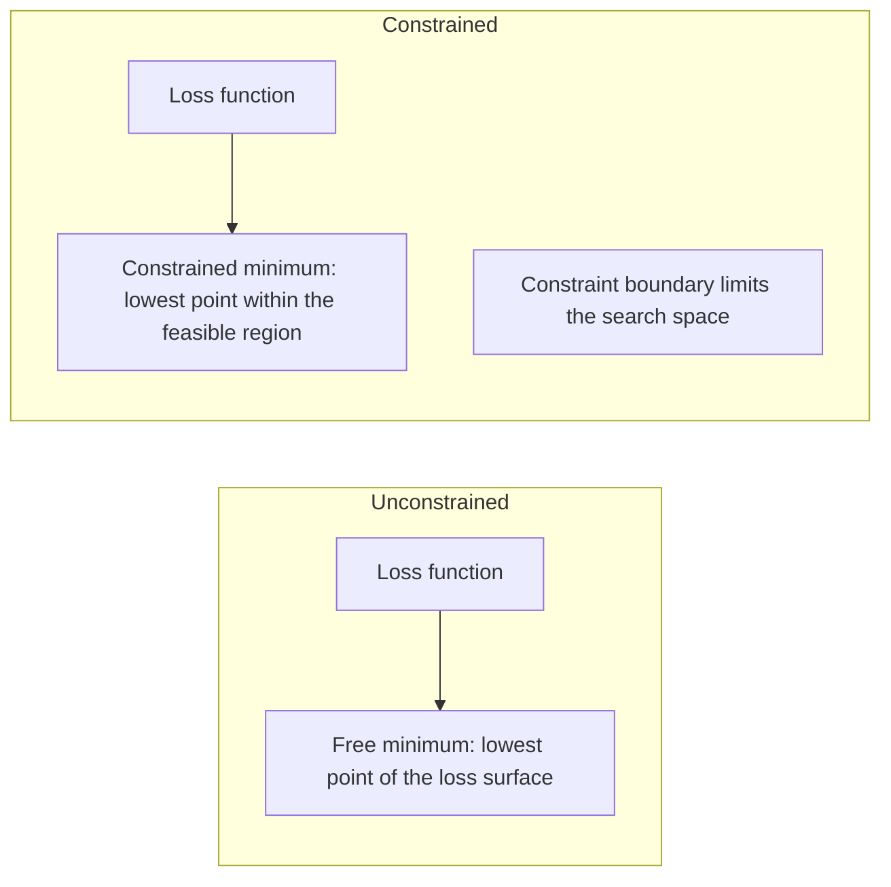
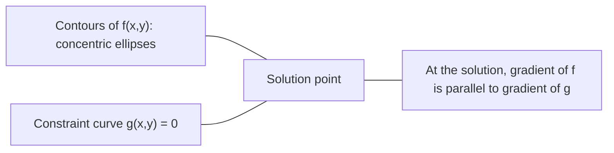

# 凸优化

> Il n'y a qu'un seul problème. Il y a des millions de réseaux neuraux.

**类型：**Construction
**语言：**Python
**前置要求：**Phase 1, leçons 04 ((Calcul pour le ML)
**时间：**À environ 90 minutes.

## Objectif de l'apprentissage

- Utilisation définition、二阶导数和 Hessian 判据测试
-  réaliser la méthode de Newton, et comparer sa seconde vitesse de réception avec la descente gradiente 
- Utiliser des multiplicateurs de lagrange 求解带约束的优化问题,并解释 KKT conditions
- Le paysage de la perte de réseau neural n'est pas confortable, mais la SGD peut toujours trouver une bonne solution.

##  problématique

Leçon 08 Vous avez appris la descente graduelle, le momentum et Adam. Ces optimisateurs peuvent se déplacer à n'importe quelle surface, mais ils ne sont pas garanties. La descente graduelle peut être une mauvaise valeur locale, car elle se trouve au point de saddle, ou toujours en mouvement.

Mais de nombreux problèmes du ML sont de la ronde. La régression linéaire, la régression logistique, les SVM, les LASSO, la régression des ronds. Pour ces problèmes, il existe des outils plus forts: avec une optimisation mathématique assurée. La ronde n'est qu'à un seul fond.

Comprendre la connotation a trois valeurs. Premièrement, elle vous dit quand le problème est simple, quand il est difficile, quand il est non connoté. Deuxièmement, elle fournit des outils plus rapides, comme la méthode de Newton. Troisièmement, elle explique le concept de régularisation dans le ML: la dualité entre les SVM, ainsi que pourquoi l'apprentissage en profondeur peut toujours fonctionner dans le cadre de la bonne nature de tout ce qui est offert par la connotation.

## 概念

### 凸集

Si, pour le groupe S, les deux points sont totalement situés au milieu de S, le groupe S est un groupe de points.

| 凸集 | 非凸 |
|---|---|
| **矩形**：内部任意两点都可以用一条仍在内部的线段连接 | **星形/月牙形**：两个内部点之间的线段可能穿过集合外部 |
| **三角形**：对所有内部点都满足相同性质 | **甜甜圈/环形**：中间的孔意味着某些线段会离开集合 |
| 任意两点之间的线段都留在集合内 | 某些点对之间的线段会离开集合 |

形式化测试: Pour S 中任意点 x、y, ainsi que pour t dans [0, 1],点 tx + (1-t) y 也在 S 中。

凸集 exemple:
- Une ligne droite, un plan, toute la R^n
- Une boule (ou une boule)
- Un espace de la moitié: {x: a^T x <= b}
- L'interaction de l'ensemble

Exemple non conjugué:
- Une petite boîte à outils
- 两个不相交交的并集
- Tout ensemble de pièges ou de trous

### 凸函数

Si la définition de la fonction f est un ensemble de couches, et pour les deux points x、y, ainsi que pour l'ensemble t dans [0, 1]:

```
f(tx + (1-t)y) <= t*f(x) + (1-t)*f(y)
```

几何上看: la ligne entre les deux points de l'image se trouve au-dessus de l'image ou sur l'image.

| 属性 | 凸函数 | 非凸函数 |
|---|---|---|
| **线段测试** | 图像上任意两点之间的线段位于曲线**之上或之上** | 图像上某些点之间的线段会下探到曲线**之下** |
| **形状** | 单个向上弯曲的碗/谷底 | 多个峰和谷，曲率混合 |
| **局部最小值** | 每个局部最小值都是全局最小值 | 可能存在多个高度不同的局部最小值 |

常见凸函数:
- f(x) = x^2( parallèle
- F(x) =) X est une valeur absolue
- F (x) = é^x (x)
- f(x) = max(0, x)
- f(x) = -log(x) pour x > 0(负对数)
- 任意线性函数 f(x) = a^T x + b(既凸又)

### 测试凸性

Trois tests pratiques, du plus facile au plus strict.

**测试 1：二阶导数测试（1D）。**Si pour tous les x il y a une f'(x) >= 0, alors f est une fonction de coupe.

- f(x) = x^2:f'(x) = 2 >= 0。凸。
- f(x) = x^3:f'(x) = 6x。x < 0 时为负──非凸──
- f(x) = e^x: f''(x) = e^x > 0。凸。

**测试 2：Hessian 测试（多变量）。**Si la matrice hessienne H ((x) est semi-définie pour tous les x, alors f est une fonction de coupe.

**测试 3：定义测试。**直接检查不等式 f(tx + (1-t) y) <= t*f(x) + (1-t) *f(y)。适用于导数难以计算的函数。

### Pourquoi est-ce important ?

Le concept central de l'optimisation:

**对于凸函数，每个局部最小值都是全局最小值。**

Cela signifie que la descente graduelle ne sera pas piégée. Tout chemin vers le bas va vers la même réponse.



结果:
- Pas besoin de refaire
- Ne nécessite pas de régulation complexe du taux d'apprentissage
- La fréquence dépend de la nature de la fonction)
- 解是唯一的 (à l'extérieur de la région)

### Les couches et les couches non couches

| 问题 | 凸？ | 原因 |
|---------|---------|-----|
| Linear regression (MSE) | 是 | Loss 关于权重是二次的 |
| Logistic regression | 是 | Log-loss 关于权重是凸的 |
| SVM (hinge loss) | 是 | 线性函数的最大值 |
| LASSO (L1 regression) | 是 | 凸函数之和是凸的 |
| Ridge regression (L2) | 是 | 二次 + 二次 = 凸 |
| Neural Network（任意 Loss） | 否 | 非线性 activations 会产生非凸 landscape |
| k-means clustering | 否 | 离散分配步骤 |
| Matrix factorization | 否 | 未知量的乘积 |

Le modèle de la perte de la camouflage est de la camouflage. Une fois que l'on s'est joint à la couche cachée de l'activation de la camouflage, la camouflage est détruite.

### Matrice hessienne

函数 f: R^n -> Hessian H de R est constitué de n x n matrices

```
H[i][j] = d^2 f / (dx_i dx_j)
```

对于 f ((x, y) = x^2 + 3xy + y^2:

```
df/dx = 2x + 3y       d^2f/dx^2 = 2      d^2f/dxdy = 3
df/dy = 3x + 2y       d^2f/dydx = 3      d^2f/dy^2 = 2

H = [ 2  3 ]
    [ 3  2 ]
```

Hessian 告诉你曲率信息:
- Value propre: fonction dans chaque direction sur tout le dessus
- Value propre, valeur maximale de chaque direction
- 符号混合: point de selle ((certains directions à l'en haut, d'autres directions à l'en bas))
- 零 propre valeur: cette direction est plate de

Pour la connotation, Hessian doit être à toutes les positions positives semi-définie, toutes les valeurs propres >= 0, et non seulement à un seul point.

### La méthode de Newton

Gradient Descendance Utilisation d'une phase information (Gradient) ――Métode de Newton Utilisation de la phase information (Hessian) ― Il est en cours de préparation à un second approximation, puis saute directement à la valeur minimale de cette seconde fonction.

```
Update rule:
  x_new = x - H^(-1) * gradient

Compare to gradient descent:
  x_new = x - lr * gradient
```

La méthode de Newton utilise le taux d'apprentissage de la méthode hessienne.



优点:
- 接近最小值时二次收(每一步误差平方级下降)
- Il n'y a pas besoin de modifier le taux d'apprentissage
- La taille ne change pas (je peux travailler sur la taille)

缺点:
- 計算 Hessian 需要 O(n^2) 内存,求逆需要 O(n^3)
- Pour un réseau neural de 1 million de pouvoirs, cela signifie 10 à 12 articles et 10 à 18 opérations.
- Pour l'apprentissage en profondeur non pratique

### 约束优化

无约束优化: 在所有 x 上最小化 f(x)。
约束优化: dans les conditions de la limite, le f (x) ⋅

̇ vous voulez minimiser les coûts, mais le budget est limité ̇ vous voulez minimiser les erreurs, mais la complexité du modèle est limitée ̇



### Multiplicateurs de lagrange

Les multiplicateurs de la lagrange 方法把束问题转换为无束问题──

问题: dans g(x) = 0 of约束下最小化 f(x)。

解法: introduire un nouveau changement (Lagrange multiplier lambda),并求解无约束问题:

```
L(x, lambda) = f(x) + lambda * g(x)
```

Dans le cas de l'élément L, le gradient n'est pas:

```
dL/dx = df/dx + lambda * dg/dx = 0
dL/dlambda = g(x) = 0
```

几何直觉: dans le faisceau de la valeur minimale, le gradient f doit être en phase avec le gradient g du faisceau.



Example: dans x + y = 1 de la résolution sous la minimisation f(x,y) = x^2 + y^2。

```
L = x^2 + y^2 + lambda(x + y - 1)

dL/dx = 2x + lambda = 0  =>  x = -lambda/2
dL/dy = 2y + lambda = 0  =>  y = -lambda/2
dL/dlambda = x + y - 1 = 0

From first two: x = y
Substituting: 2x = 1, so x = y = 0.5, lambda = -1
```

L'intersection directe x + y = 1 est (0,5, 0,5)

### Conditions de la TCC

Les conditions de Karush-Kuhn-Tucker vont augmenter les multiplicateurs de Lagrange à une certaine échelle.

问题: dans g_i(x) <= 0,i = 1, ..., m of约束下最小化 f(x)。

Conditions de la TCC:

```
1. Stationarity:    df/dx + sum(lambda_i * dg_i/dx) = 0
2. Primal feasibility:  g_i(x) <= 0  for all i
3. Dual feasibility:    lambda_i >= 0  for all i
4. Complementary slackness:  lambda_i * g_i(x) = 0  for all i
```

La lâcheté complémentaire est un facteur clé.

Les conditions KKT sont au cœur des SVM. Les vecteurs de support sont à la limite des points de données actifs.

### Régularisation  作为约束优化

La régularisation de L1 et L2 n'est pas une technique aléatoire.

**L2 regularization (Ridge)：**

```
minimize  Loss(w)  subject to  ||w||^2 <= t

Equivalent unconstrained form:
minimize  Loss(w) + lambda * ||w||^2
```

约束 约束 约束 约束 约束 约束 约束 约束 约束 约束 约束 约束 约束 约束 约束 约束 约束 约束 约束 约束 约束 约束 约束 约束 约束 约束 约束 约束 约束 约束 约束 约束 约束 约束 约束 约束 约束 约束 约束 约束 约束 约束 约束 约束 约束 约束 约束 约束 约束 约束 约束 约束 约束 约束 约束 约束 约束 约束 约束 约束 约束 约束 约束 约束 约束 约束 约束 约束 约束 约束 约束 约束 约束 约 约 约 约 约 约 约 约 约 约 约 约 约 约 约 约 约 约 约 约 约 约 约 约 约 约 约 约 约 约 约 约 约 约 约 约 约 约 约 约 约 约 约 约 约 约 约 约 约 约 约 约 约 约 约 约 约 约 约 约 约 约 约 约 约 约 约 约 约 约 约 约 约 约 约 约 约 约 约 约 约 约 约 约 约 约 约 约 约 约 约 约 约 约 约 约 约 约 约    约 约     约 约               约                                                              

**L1 regularization (LASSO)：**

```
minimize  Loss(w)  subject to  ||w||_1 <= t

Equivalent unconstrained form:
minimize  Loss(w) + lambda * ||w||_1
```

约束 约束 约束 约束 约束 约束 约束 约束 约束 约束 约束 约束 约束 约束 约束 约束 约束 约束 约束 约束 约束 约束 约束 约束 约束 约束 约束 约束 约束 约束 约束 约束 约束 约束 约束 约束 约束 约束 约束 约束 约束 约束 约束 约束 约束 约束 约束 约束 约束 约束 约束 约束 约束 约束 约束 约束 约束 约束 约束 约束 约束 约束 约束 约束 约束 约束 约束 约束 约束 约束 约束 约束 约束 约束 约束 约束 约束 约束 约束 约束 约束 约束 约束 约束 约束 约束 约束 约束 约束 约束 约 约 约 约 约 约 约 约 约 约 约 约 约 约 约 约 约 约 约 约 约 约 约 约 约 约 约 约 约 约 约 约 约 约 约 约 约 约 约 约 约 约 约 约 约 约 约 约 约 约 约 约 约 约 约 约 约 约 约 约 约 约 约 约 约 约 约 约 约 约 约 约 约 约 约 约 约 约 约 约 约 约 约 约 约 约 约 约 约 约 约 约 约 约 约 约 约 约 约 约 约 约 约 约 约 约 约 约 

| 属性 | L2 约束（圆） | L1 约束（菱形） |
|---|---|---|
| **约束形状** | 圆（更高维中是球面） | 菱形（2D 中旋转的正方形） |
| **Loss 等高线接触的位置** | 光滑边界：圆上的任意点 | 角点：与某个轴对齐 |
| **解的行为** | 权重较小但非零 | 某些权重恰好为零（稀疏） |
| **结果** | 权重收缩 | 特征选择 |

Cela explique pourquoi L1 produirait un modèle rare (la sélection des caractéristiques), tandis que L2 ne fait que réduire le poids.

### La dualité

Chaque problème de résolution de la différence est un problème de résolution de différence.

La fonction de Lagrange est double:

```
Primal: minimize f(x) subject to g(x) <= 0
Lagrangian: L(x, lambda) = f(x) + lambda * g(x)
Dual function: d(lambda) = min_x L(x, lambda)
Dual problem: maximize d(lambda) subject to lambda >= 0
```

Pourquoi la dualité est importante:
- Le problème double est parfois plus facile à résoudre que le problème primaire
- SVM à double forme 求解, dont le problème dépend des produits dot entre les données points (en utilisant le truc du noyau)
- double  fournir un primaire optimal de la limite inférieure, utilisable pour vérifier la qualité

 concrètement aux SVM:

```
Primal: find w, b that maximize the margin 2/||w|| subject to
        y_i(w^T x_i + b) >= 1 for all i

Dual:   maximize sum(alpha_i) - 0.5 * sum_ij(alpha_i * alpha_j * y_i * y_j * x_i^T x_j)
        subject to alpha_i >= 0 and sum(alpha_i * y_i) = 0

The dual only involves dot products x_i^T x_j.
Replace x_i^T x_j with K(x_i, x_j) to get the kernel trick.
```

### Pourquoi l'apprentissage en profondeur peut-il fonctionner malgré le manque de formation ?

La fonction de perte de réseau neural 极其非凸── selon chaque norme classique, l'optimisation de ces derniers devrait échouer── cependant, la dérive du gradient stochastique peut trouver une bonne solution.

**大多数局部最小值已经足够好。**Dans l'espace élevé, les points critiques de chaque point sont des points de selle, et non des valeurs minimales locales. La probabilité de perte de la valeur minimale de la zone minimale est très faible.

**真正的障碍是 saddle points，而不是局部最小值。**Dans une fonction avec n 个参数, le point de selle a également une direction de courbure positive et de courbure négative. Pour un point critique aléatoire à haute altitude, toutes les valeurs propres sont en valeur minimale locale (environ 2^(-n) ⋅ la probabilité est d'environ 2^(-n) ⋅ presque tous les points critiques sont des points de selle.

**Overparameterization 会平滑 landscape。**Le nombre de paramètres est plus élevé que le nombre de réseaux d'échantillons d'entraînement ayant des surfaces de perte plus plates, plus connectées.

**Loss landscape 结构：**

| 属性 | 低维空间 | 高维空间 |
|---|---|---|
| **Landscape** | 许多孤立的峰和谷 | 平滑连通的谷 |
| **最小值** | 许多孤立局部最小值 | 很少有糟糕局部最小值；大多数接近最优 |
| **导航** | 难以找到全局最小值 | 许多路径通向好的解 |
| **Critical points** | 局部最小值和 saddle points 混合 | 压倒性地是 saddle points，而非局部最小值 |

**随机噪声充当隐式 regularization。**Les SGD mini-partie  introduire le bruit, empêcher la chute dans des minima netts ⋅ Les minima netts ⋅ facilement adaptés ⋅ les minima plats ⋅ généralement améliorés ⋅ Le bruit va optimiser la direction du paysage plat de la perte ⋅

###  pratique dans la pratique

La méthode de Newton pour un grand modèle n'est pas pratique.

**L-BFGS (Limited-memory BFGS)：**Utilisation de l'option de l'option de l'option de l'option de l'option de l'option de l'option de l'option de l'option de l'option de l'option de l'option de l'option de l'option de l'option de l'option de l'option de l'option de l'option de l'option de l'option de l'option de l'option de l'option de l'option de l'option de l'option de l'option de l'option de l'option de l'option de l'option de l'option de l'option de l'option de l'option de l'option de l'option de l'option de l'option de l'option de l'option de l'option de l'option de l'option de l'option de l'option de l'option de l'option de l'option de l'option de l'option de l'option de l'option de l'option de l'option de l'option de l'option de l'option de l'option de l'option de l'option de l'option de l'option de l'option de l'option de l'option de l'option de l'option de l'option de l'option de l'option de l'option de l'option de l'option de l'option de l'option de l'option de l'option de l'option de l'option de l'option de l'option de l'option de l'option de l'option de l'option de l'option de l'option de l'option de l'option de l'option de l'option de l'option de l'option de l'option de l'option de l'option de l'option de l'option de l'option de l

**Natural gradient：**Utiliser la matrice d'information Fisher (en anglais: Fisher Information Matrix) et non pas la norme Hessian. Ceci met en considération la probabilité de la distribution de la structure géologique.

**Hessian-free optimization：**Utiliser le gradient conjugué 求解 Hx = g, sans apparemment former H―ne nécessite que des produits vectoriels hessiens, ce qui peut être fait par différenciation automatique dans O n 时间内计算―.

**Diagonal approximations：**Le second moment d'Adam est la proximité hessienne à l'angle de la ligne. AdaHessian a élargi ce point à travers l'estimatrice de Hutchinson en utilisant des éléments diagonales hessiennes réels.

| 方法 | 内存 | 每步成本 | 何时使用 |
|--------|--------|--------------|-------------|
| Gradient Descent | O(n) | O(n) | Baseline，大模型 |
| Newton's method | O(n^2) | O(n^3) | 小型凸问题 |
| L-BFGS | O(mn) | O(mn) | 中型凸问题 |
| Adam | O(n) | O(n) | Deep Learning 默认选择 |
| K-FAC | O(n) | 每层 O(n) | 研究、大 batch training |


```figure
convex-vs-nonconvex
```

## - Je le construis.

### 步骤 1: vérificateur de couleur

Construire une fonction, en utilisant des échantillons et en examinant la définition de la fonction.

```python
import random
import math

def check_convexity(f, dim, bounds=(-5, 5), samples=1000):
    violations = 0
    for _ in range(samples):
        x = [random.uniform(*bounds) for _ in range(dim)]
        y = [random.uniform(*bounds) for _ in range(dim)]
        t = random.uniform(0, 1)
        mid = [t * xi + (1 - t) * yi for xi, yi in zip(x, y)]
        lhs = f(mid)
        rhs = t * f(x) + (1 - t) * f(y)
        if lhs > rhs + 1e-10:
            violations += 1
    return violations == 0, violations
```

### Étape 2: Utiliser la méthode de Newton en 2D

Utilisation apparente Hessian 实现 la méthode de Newton 将收速度与渐进下降比较

```python
def newtons_method(f, grad_f, hessian_f, x0, steps=50, tol=1e-12):
    x = list(x0)
    history = [x[:]]
    for _ in range(steps):
        g = grad_f(x)
        H = hessian_f(x)
        det = H[0][0] * H[1][1] - H[0][1] * H[1][0]
        if abs(det) < 1e-15:
            break
        H_inv = [
            [H[1][1] / det, -H[0][1] / det],
            [-H[1][0] / det, H[0][0] / det],
        ]
        dx = [
            H_inv[0][0] * g[0] + H_inv[0][1] * g[1],
            H_inv[1][0] * g[0] + H_inv[1][1] * g[1],
        ]
        x = [x[0] - dx[0], x[1] - dx[1]]
        history.append(x[:])
        if sum(gi ** 2 for gi in g) < tol:
            break
    return history
```

### 步骤 3: Multiplicateur de grandeur 求解器

通過在拉格兰吉上执行 Gradient Descent 求解约束优化──

```python
def lagrange_solve(f_grad, g_val, g_grad, x0, lr=0.01,
                   lr_lambda=0.01, steps=5000):
    x = list(x0)
    lam = 0.0
    history = []
    for _ in range(steps):
        fg = f_grad(x)
        gv = g_val(x)
        gg = g_grad(x)
        x = [
            xi - lr * (fgi + lam * ggi)
            for xi, fgi, ggi in zip(x, fg, gg)
        ]
        lam = lam + lr_lambda * gv
        history.append((x[:], lam, gv))
    return history
```

### 步骤 4: Comparer une phase avec une seconde phase

Dans la même fonction secondaire, fonctionne la méthode de déclin gradient et de Newton.

```python
def quadratic(x):
    return 5 * x[0] ** 2 + x[1] ** 2

def quadratic_grad(x):
    return [10 * x[0], 2 * x[1]]

def quadratic_hessian(x):
    return [[10, 0], [0, 2]]
```

La méthode de Newton se déroule en 1 étape. La descente de gradient nécessite des centaines de étapes, car les valeurs propres d'Hessian se différencient 5 fois, formant une vallée de longueur.

## Utilisez-le

Lors du choix de l'analyse de l'analyse de l'analyse de l'analyse de l'analyse de l'analyse de l'analyse de l'analyse de l'analyse de l'analyse de l'analyse de l'analyse de l'analyse de l'analyse de l'analyse de l'analyse de l'analyse de l'analyse de l'analyse de l'analyse de l'analyse de l'analyse de l'analyse de l'analyse de l'analyse de l'analyse de l'analyse de l'analyse de l'analyse de l'analyse de l'analyse de l'analyse de l'analyse de l'analyse de l'analyse de l'analyse de l'analyse de l'analyse de l'analyse de l'analyse de l'analyse de l'analyse de l'analyse de l'analyse de l'analyse de l'analyse de l'analyse de l'analyse de l'analyse de l'analyse de l'analyse de l'analyse de l'analyse de l'analyse de l'analyse de l'analyse de l'analyse de l'analyse de l'analyse de l'analyse de l'analyse de l'analyse de l'analyse de l'analyse de l'analyse de l'analyse.

对于凸问题(régrésion logistique、SVMs、LASSO):
- Utilisation de solvaire spécial (liblinear, CVXPY, scipy, optimiser, minimiser avec la méthode)
-  prévue obtenir la seule solution globale
- Deuxième étape: pratique et rapide

对于非凸问题:
- Utilisez une méthode de sélection
-  acceptation de la dépendance à la préliminaire et au hasard
- Utilisation de la surparamétrisation, du bruit et du taux d'apprentissage comme régularisation de l'apparence
- Ne perdez pas de temps à chercher le minimum de la situation.

```python
from scipy.optimize import minimize

result = minimize(
    fun=lambda w: sum((y - X @ w) ** 2) + 0.1 * sum(w ** 2),
    x0=np.zeros(d),
    method='L-BFGS-B',
    jac=lambda w: -2 * X.T @ (y - X @ w) + 0.2 * w,
)
```

Pour les SVM, la double formulation vous permet d'utiliser le truc du noyau:

```python
from sklearn.svm import SVC

svm = SVC(kernel='rbf', C=1.0)
svm.fit(X_train, y_train)
print(f"Support vectors: {svm.n_support_}")
```

## 练习

1. **凸性画廊。**Utilisation de l'analyse de ces fonctions: f(x) = x^4、f(x) = sin(x)、f(x,y) = x^2 + y^2、f(x,y) = x*y、f(x) = max(x, 0)。 explique pourquoi chaque résultat est raisonnable。

2. **Newton vs Gradient Descent 竞赛。**De la première (10, 10) émerge, dans f ((x,y) = 50*x^2 + y^2 上运行两种方法──每种方法需要多少步才能达到损失 < 1e-10?

3. **Lagrange multiplier 几何。**Dans le cadre de x + 2y = 4 下最小化 f(x,y) = (x-3)^2 + (y-3)^2──en passant par le contrôle de la position du gradient f et du gradient g du gradient.

4. **Regularization 约束。**实现 L1-optimisation restreinte: dans le \ x de la + y de la <= 1 de la résistance sous minimisation (x-3) ^2 + (y-2) ^2  démontrer la résolution d'un sit-on égal à zéro (par la rareté de la résistance de la forme) 

5. **Hessian eigenvalue 分析。** calculer la fonction Rosenbrock dans (1,1) et (-1,1) 处 Hessian。 calculer les valeurs propres de deux points。 Les valeurs propres  vous disent quelles sont les différences entre la courbe de la valeur minimale proche et la courbe de la valeur minimale éloignée ?

## 关键术语

| 术语 | 含义 |
|------|---------------|
| 凸集 | 集合中任意两点之间的线段仍留在集合内部的集合 |
| 凸函数 | 图像上任意两点之间的线段位于图像之上或图像上的函数。等价地，Hessian 在所有位置都是 positive semidefinite |
| 局部最小值 | 比所有邻近点都低的点。对于凸函数，每个局部最小值都是全局最小值 |
| 全局最小值 | 函数在其整个定义域上的最低点 |
| Hessian Matrix | 所有二阶偏导数组成的 Matrix。编码曲率信息 |
| Positive semidefinite | Eigenvalues 全部非负的 Matrix。是“二阶导数 >= 0”的多维类比 |
| Condition number | Hessian 的最大 eigenvalue 与最小 eigenvalue 的比值。高 condition number 意味着拉长的谷和缓慢的 Gradient Descent |
| Newton's method | 使用逆 Hessian 确定步进方向和大小的二阶 Optimizer。接近最小值时二次收敛 |
| Lagrange multiplier | 为了将约束优化问题转换为无约束问题而引入的变量 |
| KKT conditions | 不等式约束下最优性的必要条件。推广了 Lagrange multipliers |
| Complementary slackness | 在解处，约束要么是 active 的，要么其 multiplier 为零。二者不会同时非零 |
| Duality | 每个约束问题都有一个伴随的 dual problem。对于凸问题，二者具有相同的最优值 |
| Strong duality | Primal 和 dual 的最优值相等。对满足 Slater's condition 的凸问题成立 |
| L-BFGS | 近似二阶方法，存储最近 m 个 Gradient 差分，而不是完整 Hessian |
| Saddle point | Gradient 为零，但在某些方向上是最小值、在另一些方向上是最大值的点 |
| Overparameterization | 使用比训练样本更多的参数。会平滑 Loss landscape 并减少糟糕局部最小值 |

## 延伸阅读

- [Boyd & Vandenberghe: Convex Optimization](https://web.stanford.edu/~boyd/cvxbook/)- Les cours sont gratuits en ligne
- [Bottou, Curtis, Nocedal: Optimization Methods for Large-Scale Machine Learning (2018)](https://arxiv.org/abs/1606.04838)- 连接凸优化理论与深度学习 实践
- [Choromanska et al.: The Loss Surfaces of Multilayer Networks (2015)](https://arxiv.org/abs/1412.0233)- Pourquoi les paysages de réseaux neuraux non confortables ne ressemblent pas à ça ?
- [Nocedal & Wright: Numerical Optimization](https://link.springer.com/book/10.1007/978-0-387-40065-5)- La méthode de Newton, L-BFGS et l'optimisation des
