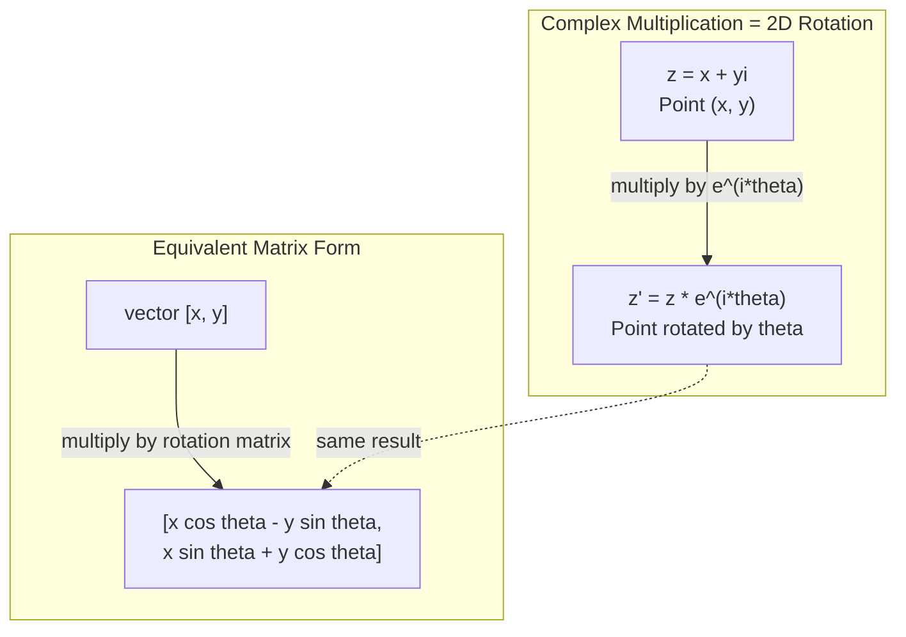
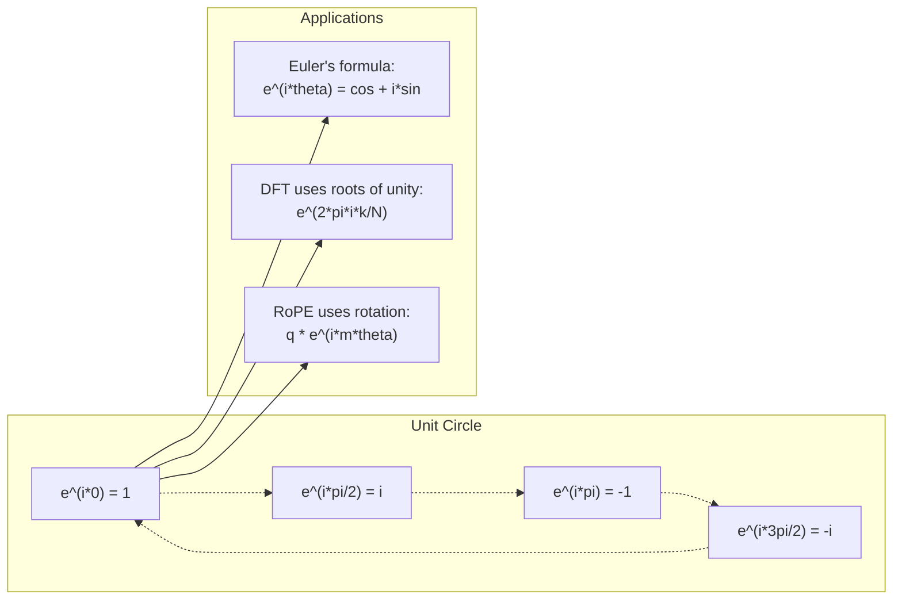

# Le nombre de références

> La racine carrée de -1 n'est pas fausse. Elle est la clé du domaine de la rotation, de la fréquence et de la moitié du traitement des signaux.

**Type:** Learn
**Language:**Python
**Prerequisites:** Phase 1, Lessons 01-04（linear algebra, calculus）
**Time:** ~60 分钟

## Objectif de l'apprentissage
- Dans le langage direct et le langage exécuté, il est possible de calculer le nombre de fois.
-  appliquer la formule d'Euler en transformation entre le récapitulatif et le triangle
- Utilisation de la transformation discrète Fourier
- 解释复数旋转 Comment se compose le transformateur 中 RoPE 和正弦位置编码的基础

##  problématique
Vous avez ouvert un article sur les transformations de Fourier, partout.`i`◊ vous regardez Transformer  position code, voir différentes fréquences `sin`et `cos` 也就是复指数的实部和虚部──你读到量子计算,又发现一切都用复向 空间来表达──

Le nombre de fois est un système numérique construit sur la racine carrée de -1 et qui ressemble à une sorte de technique mathématique. Mais ce n'est pas un technique. C'est le langage naturel du tour et de la vibration. Chaque fois que quelque chose tourne, vibrera ou se balancera, le nombre de fois est un outil adapté.

Si vous ne comprenez pas le nombre de fois, vous ne pouvez pas comprendre la transformation discrète Fourier. Vous ne pouvez pas comprendre la transformation FFT. Vous ne pouvez pas comprendre la RoPE dans le modèle de langage moderne.

Ce cours va de la conception du calcul de complexité à la géométrie, et il va démontrer la position du complexité dans l'apprentissage automatique.

## 概念
### C'est quoi le nombre ?

Il y a deux parties: le vrai et le faux.

```
z = a + bi

where:
  a is the real part
  b is the imaginary part
  i is the imaginary unit, defined by i^2 = -1
```

C'est ainsi que tu as fait de l'axe numérique une plateforme. Le nombre réel est sur un axe, le nombre nul est sur un autre axe.

### 复数运算

**加法。**Il y a aussi le fait de faire des choses.

```
(a + bi) + (c + di) = (a + c) + (b + d)i

Example: (3 + 2i) + (1 + 4i) = 4 + 6i
```

**乘法。**Il est vrai que le nombre de personnes qui sont en train de vivre dans un pays de l'autre est de moins de deux ans.

```
(a + bi)(c + di) = ac + adi + bci + bdi^2
                 = ac + adi + bci - bd
                 = (ac - bd) + (ad + bc)i

Example: (3 + 2i)(1 + 4i) = 3 + 12i + 2i + 8i^2
                            = 3 + 14i - 8
                            = -5 + 14i
```

**共轭。**翻转虚部的符号──

```
conjugate of (a + bi) = a - bi
```

Un nombre multiplicé par son ensemble est un nombre réel:

```
(a + bi)(a - bi) = a^2 + b^2
```

**除法。**分子和分母同时乘以分母的共──

```
(a + bi) / (c + di) = (a + bi)(c - di) / (c^2 + d^2)
```

Il disparaîtra la partie vide de la matrice, et on obtiendra un nombre de fois net.

### 复平面

复平面把每复数映射到一个2D点──水平轴是实轴,垂直轴是虚轴──

```
z = 3 + 2i  corresponds to the point (3, 2)
z = -1 + 0i corresponds to the point (-1, 0) on the real axis
z = 0 + 4i  corresponds to the point (0, 4) on the imaginary axis
```

Le nombre de fois est un point, et aussi un vecteur issu du point d'origine. Cette double interprétation est la raison pour laquelle le nombre de fois est utile dans la géométrie.

### 极坐标形式

Tout point de la planche peut être utilisé pour décrire sa distance du point d'origine, ainsi que son angle par rapport à l'axe réel.

```
z = r * (cos(theta) + i*sin(theta))

where:
  r = |z| = sqrt(a^2 + b^2)     (magnitude, or modulus)
  theta = atan2(b, a)             (phase, or argument)
```

Pour les personnes âgées, il est nécessaire de prendre des mesures pour les aider à atteindre leur objectif.

**极坐标形式下的乘法。**Il est très important de savoir si vous êtes un homme.

```
z1 = r1 * e^(i*theta1)
z2 = r2 * e^(i*theta2)

z1 * z2 = (r1 * r2) * e^(i*(theta1 + theta2))
```

C'est pourquoi le nombre de fois est très adapté pour faire le tour.

### La formule d'Euler

Le pont entre la réelle et la réelle:

```
e^(i*theta) = cos(theta) + i*sin(theta)
```

C'est la formule la plus importante de la classe.

```
e^(i*pi) = cos(pi) + i*sin(pi) = -1 + 0i = -1

Therefore: e^(i*pi) + 1 = 0
```

五个基本常数 ((e, i, pi, 1, 0) sont connectés ensemble dans un équation.

### Pourquoi la formule d'Euler est importante pour le ML

La formule d'Euler indique,`e^(i*theta)`Lorsque le theta = 0 时, tu es dans (1, 0) 时, tu es dans (0, 1) ・ lorsque le theta = pi 时, tu es dans (-1, 0) ・ lorsque le theta = 3 * pi / 2 时, tu es dans (0, -1) ・ complet

Cela signifie que le référentiel est rotatif, tandis que le rotatif est absent dans le traitement des signaux et la gestion des données.

### Contact avec le 2D

将复数 (x + yi) 乘以 e^(i*theta),会把点 (x, y) 周围原点旋转的角──

```
Rotation via complex multiplication:
  (x + yi) * (cos(theta) + i*sin(theta))
  = (x*cos(theta) - y*sin(theta)) + (x*sin(theta) + y*cos(theta))i

Rotation via matrix multiplication:
  [cos(theta)  -sin(theta)] [x]   [x*cos(theta) - y*sin(theta)]
  [sin(theta)   cos(theta)] [y] = [x*sin(theta) + y*cos(theta)]
```

它们产生完全相同的结果──复数乘法就是 2D 旋转──旋转矩阵 只是用矩阵记法写出的复数乘法──



### Phasor et signal de rotation

复指数 e^(i*omega*t) est un point de rotation à un rythme de ronde de l'omega à travers un cycle t. Avec l'augmentation de t, ce point se dessine en rond.

Cette rotation est une partie du cosmos.

```
e^(i*omega*t) = cos(omega*t) + i*sin(omega*t)

Real part:      cos(omega*t)    -- a cosine wave
Imaginary part: sin(omega*t)    -- a sine wave
```

C'est le phasor qui exprime la façon de faire. Vous ne suivez plus une onde de la flèche, mais une flèche de rotation plane.

### Unité de base

N° de base d'unité est N° de point de distribution de l'unité de l'espace:

```
w_k = e^(2*pi*i*k/N)    for k = 0, 1, 2, ..., N-1
```

Quand N = 4 时,根是:1, i, -1, -i(四个罗盘方向)
Quand N = 8, vous obtiendrez quatre directions de roulement, puis quatre directions de contre-angle.

L'unité de base est la base de la transformation discrète de Fourier.

### Contacts avec DFT

La transformation discrète de Fourier de 信号 x[0], x[1], ..., x[N-1] est:

```
X[k] = sum_{n=0}^{N-1} x[n] * e^(-2*pi*i*k*n/N)
```

Chaque X[k] mesure la proportion de signal à la racine de l'unité de la seconde K, c'est-à-dire la proportion de fréquence à la seconde d'une onde de la seconde K. Le DFT va décomposer le signal en N 个旋转phasor, et vous indiquer la portée et la phase de chacun.

### Pourquoi je ne suis pas faux

Imaginary Ce mot est un hasard historique。 Descartes 曾带带着轻蔑的意思使用它──但 i并非比负数更虚──负数回答是:从3减到什么才能得到5? 虚数单位回答是:什么数平方后得到 -1?

Il est plus utile de comprendre: i est un calcul de rotation à 90 degrés. Pour multiplier un nombre réel à un seul coup, vous faites le tour à 90 degrés jusqu'à un faux axe.

C'est pourquoi le complexe n'existe pas dans l'ingénierie. Tout ce qui tourne est naturellement adapté à la description du complexe.

### 复指数 vs 三角函数

Avant la formule d'Euler, l'ingénieur a écrit le signal en A*cos (Omega)  振幅 A、 fréquence omega、相位 phi。 c'est possible, mais ça va faire le calcul de douleur。

Utilisation de l'indice de réaction, le même signal peut être écrit comme A*e^(i*(omega*t + phi))。相加两个信号只是相加两个复数。相乘(调制)只是模长相乘、角度相加。相位偏移变成角加法。频率偏移变成乘相──

Le domaine entier du traitement des signaux est devenu plus propre, car les mathématiques sont plus propres.

### Contacts avec Transformer

**正弦位置编码**(original Transformer 论文):

```
PE(pos, 2i) = sin(pos / 10000^(2i/d))
PE(pos, 2i+1) = cos(pos / 10000^(2i/d))
```

Les variations de fréquence sont différentes, mais elles sont différentes. Chaque fréquence est codée en fonction de la position de la fréquence.

**RoPE（Rotary Position Embedding）**En outre, il est évidemment utilisé pour faire le tour de la matrice à la fois à la requête et à la clé Vecteur. La position relative entre deux symboles devient un angle de rotation. Attention à l'utilisation de ces rotations vecteurs de calcul, ce qui rend le modèle par le biais de multiplication de la position relative sensible.

| Operation | Algebraic Form | Geometric Meaning |
|-----------|---------------|-------------------|
| 加法 | (a+c) + (b+d)i | 平面中的 Vector 加法 |
| 乘法 | (ac-bd) + (ad+bc)i | 旋转并缩放 |
| 共轭 | a - bi | 关于实轴反射 |
| 模长 | sqrt(a^2 + b^2) | 到原点的距离 |
| 相位 | atan2(b, a) | 相对正实轴的角度 |
| 除法 | multiply by conjugate | 反向旋转并重新缩放 |
| 幂 | r^n * e^(i*n*theta) | 旋转 n 次，按 r^n 缩放 |




```figure
roots-of-unity
```

## - Je le construis.
### 步骤 1: classe complexe

Construire un nombre complexe, soutenir le calcul, la forme, la phase, ainsi que la transformation entre forme directe et forme maximale de la position.

```python
import math

class Complex:
    def __init__(self, real, imag=0.0):
        self.real = real
        self.imag = imag

    def __add__(self, other):
        return Complex(self.real + other.real, self.imag + other.imag)

    def __mul__(self, other):
        r = self.real * other.real - self.imag * other.imag
        i = self.real * other.imag + self.imag * other.real
        return Complex(r, i)

    def __truediv__(self, other):
        denom = other.real ** 2 + other.imag ** 2
        r = (self.real * other.real + self.imag * other.imag) / denom
        i = (self.imag * other.real - self.real * other.imag) / denom
        return Complex(r, i)

    def magnitude(self):
        return math.sqrt(self.real ** 2 + self.imag ** 2)

    def phase(self):
        return math.atan2(self.imag, self.real)

    def conjugate(self):
        return Complex(self.real, -self.imag)
```

### 步骤 2: extrême conjonction avec la formule d'Euler

```python
def to_polar(z):
    return z.magnitude(), z.phase()

def from_polar(r, theta):
    return Complex(r * math.cos(theta), r * math.sin(theta))

def euler(theta):
    return Complex(math.cos(theta), math.sin(theta))
```

验证:`euler(theta).magnitude()`Il faut le faire.`euler(0)`应给出 (1, 0)`euler(pi)`应给出 (-1, 0)

### 步骤 3: tour

将点 (x, y) 旋转 theta 角, seulement besoin d'une fois répétée multiplication:

```python
point = Complex(3, 4)
rotated = point * euler(math.pi / 4)
```

模长保持不变── seulement les angles changent──

### Étape 4: DFT basé sur le calcul de multiples opérations

```python
def dft(signal):
    N = len(signal)
    result = []
    for k in range(N):
        total = Complex(0, 0)
        for n in range(N):
            angle = -2 * math.pi * k * n / N
            total = total + Complex(signal[n], 0) * euler(angle)
        result.append(total)
    return result
```

C'est le DFT de O(N^2) ⋅ pour chaque sortie X[k] ⋅ c'est le signal échantillon multiplié par le total de l'unité de la racine ⋅

### 步骤 5: DFT inversé

La différence unique entre le DFT inverse et le signal original est que le symbole du référentiel de transformation est divisé par N.

```python
def idft(spectrum):
    N = len(spectrum)
    result = []
    for n in range(N):
        total = Complex(0, 0)
        for k in range(N):
            angle = 2 * math.pi * k * n / N
            total = total + spectrum[k] * euler(angle)
        result.append(Complex(total.real / N, total.imag / N))
    return result
```

Cela donnera une reconstruction parfaite. D'abord l'application DFT, puis l'application IDFT, vous obtiendrez le signal original dans la précision de l'appareil.

### 步骤 6: Unité de base

```python
def roots_of_unity(N):
    return [euler(2 * math.pi * k / N) for k in range(N)]
```

验证 Deux qualités:
- Chaque racine est strictement à 1.
- Les propriétés n'ont pas de racines et ne sont pas à l'origine de leurs propres propriétés.

Ces caractéristiques rendent la DFT réversible.

## Utilisez-le
Python Intro support récapitulatif`j`Indiquer le nombre d'unités.

```python
z = 3 + 2j
w = 1 + 4j

print(z + w)
print(z * w)
print(abs(z))

import cmath
print(cmath.phase(z))
print(cmath.exp(1j * cmath.pi))
```

Pour le nombre, numpy

```python
import numpy as np

z = np.array([1+2j, 3+4j, 5+6j])
print(np.abs(z))
print(np.angle(z))
print(np.conj(z))
print(np.real(z))
print(np.imag(z))

signal = np.sin(2 * np.pi * 5 * np.linspace(0, 1, 128))
spectrum = np.fft.fft(signal)
freqs = np.fft.fftfreq(128, d=1/128)
```

## Je le livre.
运行  référencement`code/complex_numbers.py`Pour générer`outputs/skill-complex-arithmetic.md`Il y a une autre.

## 练习
1. **手算复数运算。**計算 (2 + 3i) * (4 - i),并用代码验证──然后计算 (5 + 2i) / (1 - 3i)──把两个结果都画在复平面上,并检查乘法是否旋转并缩放第一数──

2. **旋转序列。**De point (1, 0) 开始──连续乘以 e^(i*pi/6) 十二次──验证 12次乘法后你会回到 (1, 0)──打印每一步的坐标,并确认它们描绘出一个正 12边形──

3. **已知信号的 DFT。**创建一个信号,它在32个点上采样 sin(2*pi*3*t) 与0.5*sin(2*pi*7*t) 之和──运行你的DFT──验证幅度频谱在频率 3 和 7 处有峰值,并且频率 7 处的峰值高度是频率 3 处的一半──

4. **单位根可视化。**計算 8 次单位根──验证它们的和为零──验证任意根乘以本原根 e^(2 * pi*i/8) 都会得到下一个根──

5. **旋转 Matrix 等价性。**Pour 10 angles et 10 points de variation, les résultats de l'essai de multiplication sont les mêmes que ceux de l'utilisation de la matrice rotative 2x2 pour effectuer le calcul de la multiplication de la matrice-vecteur.

## 关键术语
| Term | What it means |
|------|---------------|
| 复数 | 形如 a + bi 的数，其中 a 是实部，b 是虚部，并且 i^2 = -1 |
| 虚数单位 | 数 i，定义为 i^2 = -1。它在哲学意义上并不“虚”——它是一个旋转算子 |
| 复平面 | x 轴为实轴、y 轴为虚轴的 2D 平面。也称为 Argand plane |
| 模长（模） | 到原点的距离：sqrt(a^2 + b^2)。写作 \|z\| |
| 相位（辐角） | 相对正实轴的角度：atan2(b, a)。写作 arg(z) |
| 共轭 | 关于实轴的镜像：a + bi 的共轭是 a - bi |
| 极坐标形式 | 将 z 表示为 r * e^(i*theta)，而不是 a + bi。让乘法变得容易 |
| Euler's formula | e^(i*theta) = cos(theta) + i*sin(theta)。连接指数函数与三角函数 |
| Phasor | 表示正弦信号的旋转复数 e^(i*omega*t) |
| 单位根 | k = 0 到 N-1 时的 N 个复数 e^(2*pi*i*k/N)。单位圆上等间隔的 N 个点 |
| DFT | Discrete Fourier Transform。使用单位根将信号分解为复正弦分量 |
| RoPE | Rotary Position Embedding。使用复数乘法在 Transformer Attention 中编码相对位置 |

## 延伸阅读
- [Visual Introduction to Euler's Formula](https://betterexplained.com/articles/intuitive-understanding-of-eulers-formula/)- dans le cas de l'utilisation du journal de la vie
- [Su et al.: RoFormer (2021)](https://arxiv.org/abs/2104.09864)-  proposer des travaux d'intégration de position rotative à l'aide de plusieurs rotations
- [Vaswani et al.: Attention Is All You Need (2017)](https://arxiv.org/abs/1706.03762)-  proposer position de transformateur original 论文
- [3Blue1Brown: Euler's formula with introductory group theory](https://www.youtube.com/watch?v=mvmuCPvRoWQ)- Pour ce qui est de l'explication visible
- [Needham: Visual Complex Analysis](https://global.oup.com/academic/product/visual-complex-analysis-9780198534464)-                                                                                                                                                                                                                                                                                                                                                                                                                                                                                                                             
- [Strang: Introduction to Linear Algebra, Ch. 10](https://math.mit.edu/~gs/linearalgebra/)- nombre de caractères et de caractères
