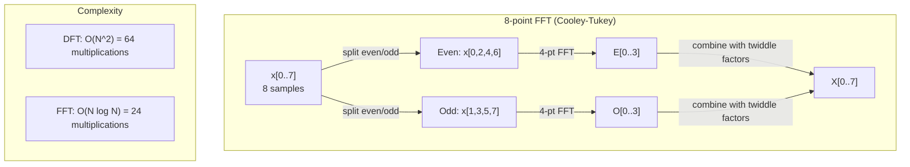
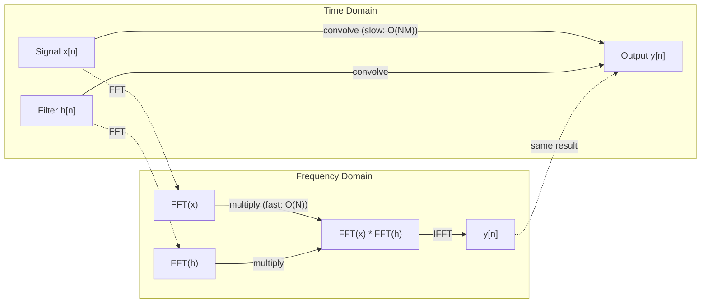

# Transformation de Fourier

> Chaque signal est une superposition d'ondes sinusoïdes. La transformation de Fourier vous dira quelles sont les autres.

**Type:** Build
**Language:**Python
**Prerequisites:** Phase 1, Lessons 01-04, 19 (complex numbers)
**Time:** ~90 分钟

## Objectif de l'apprentissage
- De la réalisation de DFT,并使用 O(N log N) de Cooley-Tukey FFT 验证它
- Comprendre les coefficients de fréquence: de signal à amplitude, phase et spectre de puissance
-  appliquer le théorème de la convulsion, par la multiplication FFT  exécuter la convulsion
- La décomposition de la fréquence Fourier avec les encodements positionnels du transformateur et les couches de convection de la CNN  connectez-vous

##  problématique
Une image est une série de valeurs de mesure de la pression qui changent avec le temps. Une image est une série de valeurs de la densité des pixels dans l'espace.

Mais de nombreux modèles sont invisibles dans le domaine temporel. Ce signal audio est un ton pur ou un accord.

La transformation de Fourier transformera les données du domaine temporel  transformées en domaine de fréquences― elle reçoit un signal, et le décompose en ondes sinusoïdes de différentes fréquences― chaque onde sinusoïde a une amplitude (intensité) et une phase (situation de départ)― la transformation de Fourier vous en dira les deux en même temps―

Ceci est important pour le ML, car la pensée du domaine de fréquence est partout à voir. Les réseaux neuraux de convulsion exécutent une convulsion, tandis que la convulsion dans le domaine de fréquence est une multiplication.

## 概念
### La définition de la DFT

给定 N 个 échantillons x[0], x[1], ..., x[N-1],Discrete Fourier Transform 会生成 N 个 fréquence coefficients X[0], X[1], ..., X[N-1]:

```
X[k] = sum_{n=0}^{N-1} x[n] * e^(-2*pi*i*k*n/N)

for k = 0, 1, ..., N-1
```

Chaque X[k] est un nombre complexe. Sa magnitude. X[k] aussi indique l'amplitude de la fréquence k. Son angle de phase.

关键洞见:`e^(-2*pi*i*k*n/N)`est un phasor qui tourne à la fréquence k. Le DFT calcule la corrélation entre chaque signal et N 个等间隔频率. Si le signal contenant l'énergie de la fréquence k, la corrélation est très grande.

### Le sens de chaque facteur

**X[0]: DC component。**Ceci est la somme de tous les échantillons, avec la moyenne de la proportion. Il représente la constante du signal à fréquence zéro.

```
X[0] = sum_{n=0}^{N-1} x[n] * e^0 = sum of all samples
```

**X[k] for 1 <= k <= N/2: positive frequencies。**X[k] indique chaque N 个 échantillons 中 k 个周期 的频率──k 越大,频率 越高(oscillation 越快)──

**X[N/2]: Nyquist frequency。**C'est la fréquence la plus élevée que N 个 échantillons peuvent représenter.

**X[k] for N/2 < k < N: negative frequencies。**Pour les signaux à valeur réelle, X[N-k] = conj(X[k])。 les fréquences négatives sont celles positives de l'image── c'est pourquoi l'information utile se trouve entre les coefficients N/2 + 1 ‖──

### DFT inversé

Révélation de la fréquence de la DFT inverse

```
x[n] = (1/N) * sum_{k=0}^{N-1} X[k] * e^(2*pi*i*k*n/N)

for n = 0, 1, ..., N-1
```

La seule différence entre le DFT à l'avant et le DFT à l'exposant est que le symbole du milieu est correct (pas négatif) et qu'il a un facteur de normalisation 1/N.

Le DFT inverse est une reconstruction parfaite. Il ne perdra aucun message. Vous pouvez passer du domaine temporel au domaine fréquenté, revenir sans produire aucune erreur.

### Le FFT: le rendre rapide

Comme le définit ci-dessus, le DFT est O(N^2): pour chaque coefficient de sortie de N, il faut pour chaque échantillon de N ≠1, c'est 10^12 fois.

La transformation rapide de Fourier (FFT) sera calculée avec O(N log N) 计算同样结果──当N = 1 million 时, c'est environ 20000000 fois des opérations, et non pas un milliards de fois──.

L'algorithme Cooley-Tukey (le plus courant de FFT) utilise le divisé et conquérir:

1. Le signal sera divisé en échantillons indiqués par et par.
2. Retour à la moitié du DFT.
3. Utilisation de "facteurs jumeaux" e^(-2*pi*i*k/N) 合并两个 DFT de taille moyenne

```
X[k] = E[k] + e^(-2*pi*i*k/N) * O[k]          for k = 0, ..., N/2 - 1
X[k + N/2] = E[k] - e^(-2*pi*i*k/N) * O[k]    for k = 0, ..., N/2 - 1

where E = DFT of even-indexed samples
      O = DFT of odd-indexed samples
```

Cette symétrie signifie que chaque étape de la récurrence exécute un travail O (N) et qu'il y a aussi un log2 (N) de la couche O (N).



FFT  exige la longueur du signal est de 2 ── en pratique, les signaux vont généralement à zéro jusqu'à la prochaine 2 ──

### Analyse spectrale

**power spectrum**Il y a X [k] ^ 2, c'est la magnitude carrée de chaque coefficient de fréquence.

**phase spectrum**C'est le côté X (x) qui est le décalage de phase de chaque fréquence. Pour la plupart des tâches d'analyse, vous vous souciez du spectre de puissance, et vous négligez la phase.

```
Power at frequency k:  P[k] = |X[k]|^2 = X[k].real^2 + X[k].imag^2
Phase at frequency k:  phi[k] = atan2(X[k].imag, X[k].real)
```

### Résolution de fréquence

La résolution de fréquence du DFT dépend des échantillons numéros N et taux d'échantillonnage fs。

```
Frequency of bin k:      f_k = k * fs / N
Frequency resolution:    delta_f = fs / N
Maximum frequency:       f_max = fs / 2  (Nyquist)
```

Pour distinguer deux fréquences très proches, vous avez besoin de plus d'échantillons. Pour capturer des fréquences élevées, vous avez besoin d'un taux d'échantillonnage plus élevé.

### Le théorème de la convolutions

C'est l'un des résultats les plus importants du traitement des signaux et il est directement lié aux CNN.

**time domain 中的 convolution 等于 frequency domain 中的 pointwise multiplication。**

```
x * h = IFFT(FFT(x) . FFT(h))

where * is convolution and . is element-wise multiplication
```

Pourquoi c' est important ?

- 两个长度为 N 和 M de signaux 直接卷曲 需要 O(N*M) opérations。
- 基于 FFT 的卷曲 需要 O(N log N):transform 两者、乘、transform back──
- Pour les grands noyaux, la convulsion FFT sera rapide.
- C'est exactement ce qui se passe dans les couches convolutives de grands champs réceptifs.

Attention:DFT  calcul est une convolutions circulaires (signal 会 wrap around) ・・・ Pour une convolutions linéaires (linear convolutions) ∞, veuillez calculer que les deux signaux sont zéro-pad jusqu'à la longueur N + M - 1―



### Les fenêtres

Si le signal DFT n'est pas le même point de départ et de fin, il se produit une discontinuité à la frontière, et se présente comme un faux contenu à haute fréquence.

Le système de fenêtre se comporte en fonction du DFT avant de signaler que les deux extrémités sont en train de diminuer à zéro, ce qui réduit les fuites.

常见 fenêtres:

| Window | Shape | Main lobe width | Side lobe level | Use case |
|--------|-------|----------------|-----------------|----------|
| Rectangular | 平坦（无 window） | 最窄 | 最高 (-13 dB) | 当 signal 在 N 个 samples 中正好 periodic 时 |
| Hann | Raised cosine | 中等 | 低 (-31 dB) | 通用 spectral analysis |
| Hamming | Modified cosine | 中等 | 更低 (-42 dB) | Audio processing、speech analysis |
| Blackman | Triple cosine | 宽 | 非常低 (-58 dB) | 当 side lobe suppression 至关重要时 |

```
Hann window:    w[n] = 0.5 * (1 - cos(2*pi*n / (N-1)))
Hamming window: w[n] = 0.54 - 0.46 * cos(2*pi*n / (N-1))
```

Avant DFT, la fenêtre sera utilisée pour la multiplication par élément avec le signal:`X = DFT(x * w)`Il y a une autre.

### Propriétés de DFT

| Property | Time Domain | Frequency Domain |
|----------|-------------|-----------------|
| Linearity | a*x + b*y | a*X + b*Y |
| Time shift | x[n - k] | X[f] * e^(-2*pi*i*f*k/N) |
| Frequency shift | x[n] * e^(2*pi*i*f0*n/N) | X[f - f0] |
| Convolution | x * h | X * H (pointwise) |
| Multiplication | x * h (pointwise) | X * H (circular convolution, scaled by 1/N) |
| Parseval's theorem | sum \|x[n]\|^2 | (1/N) * sum \|X[k]\|^2 |
| Conjugate symmetry (real input) | x[n] real | X[k] = conj(X[N-k]) |

Le théorème de Parseval exprime l'énergie totale dans deux domaines identiques.

### Contact avec les codage positionnel

Origini Transformer Utilisation de codage positionnel sinusoïdale:

```
PE(pos, 2i)   = sin(pos / 10000^(2i/d_model))
PE(pos, 2i+1) = cos(pos / 10000^(2i/d_model))
```

Chaque parcours de dimensions (2i, 2i+1) oscillait à différentes fréquences. Les fréquences de haute (dimension 0,1) à bas (dimension finale) sont classées selon l'espacement géométrique. Cela permet à chaque position de toutes les bandes de fréquences de voir un motif unique, comme les coefficients de Fourier.

Il fournit des propriétés clés:

- **Uniqueness:**Les deux positions ne seront pas encodées de la même façon.
- **Bounded values:**Sin 和 cos 始终在 [-1, 1] 内。
- **Relative position:**La position p+k peut être représentée par la fonction linéaire de position p 处 encoding。 le modèle peut apprendre à se concentrer sur les positions relatives。

### Connexion à la CNN

La couche de convection 通过在信号或图像 上滑动一个学习过器 (en anglais: convection layer) ), sera appliquée à l'entrée.

Selon le théorème de la convolutions, ce qui est le même:
1. Pour l'entrée  exécution FFT
2. Pour le noyau  exécuter FFT
3. Multipliez dans le domaine de fréquence
4. Pour les résultats de l'exécution de la FIFT

标准 CNN 实现使用直接卷积 (conversion directe) 对小型3x3 kernels 更快) 但是对于大型 kernels或全球卷积,基于FFT的方法会显著更快──一些架构 (例如Fnet) 完全使用FFT 替代注意,在O(N log N) 而非O(N^2) 复杂度下获得有竞争力的精度──

### Les spectrogrammes et la transformation Fourier à court terme

单次 FFT fournira le contenu de la fréquence de l'ensemble du signal, mais ne peut pas vous dire ces fréquences qu'elles apparaissent à quel moment. chirp 频率 随着时间的增加信号) 和弦 (所有频率同时存在) 可能具有相同的 magnitudes谱──

La transformation Fourier à court temps (STFT) 通过在信号的重叠窗户上计算 FFT 来解决这个问题──结果是光谱:一种 représentation 2D, dont un axe est le temps, un autre axe est la fréquence── chaque point indique l'intensité du temps sur cette fréquence──

```
STFT procedure:
1. Choose a window size (e.g., 1024 samples)
2. Choose a hop size (e.g., 256 samples -- 75% overlap)
3. For each window position:
   a. Extract the windowed segment
   b. Apply a Hann/Hamming window
   c. Compute FFT
   d. Store the magnitude spectrum as one column of the spectrogram
```

Les spectrogrammes sont la représentation standard des modèles audio ML. Les modèles de reconnaissance de la parole (Shisper, DeepSpeech) traitent les spectrogrammes de mélange, c'est-à-dire que les fréquences sont 映射到 mel scale des spectrogrammes, ce qui correspond davantage à la perception du pitch humain.

### Le nom de l'alias

Si le signal contient des fréquences élevées à fs/2 (fréquence Nyquist), le taux de prélèvement de fs produira des copies alias.

```
Example:
  True signal: 90 Hz sine wave
  Sampling rate: 100 Hz
  Apparent frequency: 100 - 90 = 10 Hz

  The samples from the 90 Hz signal at 100 Hz sampling rate
  are identical to the samples from a 10 Hz signal.
  No amount of math can recover the original 90 Hz.
```

C'est pourquoi les convertisseurs analogiques en numérique contiendront des filtres anti-aliasing, avant de déplacer les fréquences de Nyquist.

### Le rembourrage zéro n' améliorera pas la résolution

Un malentendu commun est: lors du FFT avant le signal  effectuer un rembourrage à zéro 会提升频分辨率──它不会──零 rembourrage 只是插在现有频段之间,让光谱看起来更平滑──但它无法揭露原始样品中不存在的频率细节──

La résolution de la fréquence réelle dépend seulement du temps d'observation T = N / fs。 pour distinguer la différence entre les deux fréquences delta_f, vous avez au moins besoin de T = 1 / delta_f 秒 de données。 peu importe le nombre de zéro-padding, aucun ne peut changer cette limite fondamentale。


```figure
fourier-synthesis
```

## - Je le construis.
### 步骤 1: DFT à partir de zéro

O(N^2) DFT 直接来自定义──

```python
import math

class Complex:
    ...

def dft(x):
    N = len(x)
    result = []
    for k in range(N):
        total = Complex(0, 0)
        for n in range(N):
            angle = -2 * math.pi * k * n / N
            w = Complex(math.cos(angle), math.sin(angle))
            xn = x[n] if isinstance(x[n], Complex) else Complex(x[n])
            total = total + xn * w
        result.append(total)
    return result
```

### 步骤 2: DFT inversé

结构 est la même, l'exponent 为正,并除以 N。

```python
def idft(X):
    N = len(X)
    result = []
    for n in range(N):
        total = Complex(0, 0)
        for k in range(N):
            angle = 2 * math.pi * k * n / N
            w = Complex(math.cos(angle), math.sin(angle))
            total = total + X[k] * w
        result.append(Complex(total.real / N, total.imag / N))
    return result
```

### 步骤 3: FFT (Cooley-Tukey)

La FFT récursive 要求长度为 2 的──拆分为 even 和 odd,递归, puis avec des facteurs de double 合并──

```python
def fft(x):
    N = len(x)
    if N <= 1:
        return [x[0] if isinstance(x[0], Complex) else Complex(x[0])]
    if N % 2 != 0:
        return dft(x)

    even = fft([x[i] for i in range(0, N, 2)])
    odd = fft([x[i] for i in range(1, N, 2)])

    result = [Complex(0)] * N
    for k in range(N // 2):
        angle = -2 * math.pi * k / N
        twiddle = Complex(math.cos(angle), math.sin(angle))
        t = twiddle * odd[k]
        result[k] = even[k] + t
        result[k + N // 2] = even[k] - t
    return result
```

### 步骤 4: Aideurs à l'analyse spectrale

```python
def power_spectrum(X):
    return [xk.real ** 2 + xk.imag ** 2 for xk in X]

def convolve_fft(x, h):
    N = len(x) + len(h) - 1
    padded_N = 1
    while padded_N < N:
        padded_N *= 2

    x_padded = x + [0.0] * (padded_N - len(x))
    h_padded = h + [0.0] * (padded_N - len(h))

    X = fft(x_padded)
    H = fft(h_padded)

    Y = [xk * hk for xk, hk in zip(X, H)]

    y = idft(Y)
    return [y[n].real for n in range(N)]
```

## Utilisez-le
Dans le travail réel, en utilisant FFT numpy, il est soutenu par des bibliothèques C hautement optimisées.

```python
import numpy as np

signal = np.sin(2 * np.pi * 5 * np.arange(256) / 256)
spectrum = np.fft.fft(signal)
freqs = np.fft.fftfreq(256, d=1/256)

power = np.abs(spectrum) ** 2

positive_freqs = freqs[:len(freqs)//2]
positive_power = power[:len(power)//2]
```

Pour l'analyse spectrale de fenêtres et plus haut niveau:

```python
from scipy.signal import windows, stft

window = windows.hann(256)
windowed = signal * window
spectrum = np.fft.fft(windowed)
```

 Pour la convulsion:

```python
from scipy.signal import fftconvolve

result = fftconvolve(signal, kernel, mode='full')
```

pour les spectrogrammes:

```python
from scipy.signal import stft

frequencies, times, Zxx = stft(signal, fs=sample_rate, nperseg=256)
spectrogram = np.abs(Zxx) ** 2
```

Le spectrogramme Matrix est la forme de (n_frequences, n_time_frames) ⋅ chaque rangée est un spectre de puissance de la fenêtre de temps supérieure ⋅ c'est le modèle audio ML ⋅ comme entrée ⋅ consommer ⋅ contenu

## Je le livre.
运行  référencement`code/fourier.py`                  `outputs/prompt-spectral-analyzer.md`Il y a une autre.

## 练习
1. **Pure tone identification。**创建一个信号,其中包含一个未知频率(1到50 Hz 之间) 的单个阴影波,以128 Hz采样1秒――使用你的DFT 识别频率――验证答案是否匹配――现在加入标准偏差为0.5的高斯噪音,并重复――噪音 如何影响光谱?

2. **FFT vs DFT verification。**生成一个长度为 64 的随机信号――同时计算 DFT(O(N^2)) 和 FFT──验证所有系数在 1e-10 以内匹配──在长度为 256、512、1024 和 2048 的信号上分别计时两个函数──绘制 DFT时间与 FFT时间的比例──

3. **Convolution theorem proof by example。**创建信号 x = [1, 2, 3, 4, 0, 0, 0, 0] 和 filter h = [1, 1, 1, 0, 0, 0, 0, 0]──直接计算它们的圆圈卷积 (圆圈)──然后通过FFT 计算(转变、乘变、逆转变)──验证结果匹配──现在通过适当的零执行线路卷积──

4. **Windowing effects。** Créer un signal, c'est 10 Hz et 12 Hz (très proche) de deux ondes sinusoïdes 和──以 128 Hz échantillonnage 1 seconde──分别在无窗、汉窗 和汉窗 下计算功率谱──哪个窗是最容易区分两个峰?为什么?

5. **Positional encoding analysis。**Pour d_modèle = 128 和 max_pos = 512 生成 sinuside positional encodings。对每对位置 (p1, p2),计算它们的点产品──说明点产品 只依赖于p1 - p2的位置,而不依赖于绝对位置──随着距离 增加,点产品会发生什么?

## 关键术语
| Term | What it means |
|------|---------------|
| DFT (Discrete Fourier Transform) | 将 N 个 time-domain samples 转换为 N 个 frequency-domain coefficients。每个 coefficient 都是与该 frequency 上 complex sinusoid 的 correlation |
| FFT (Fast Fourier Transform) | 用于计算 DFT 的 O(N log N) algorithm。Cooley-Tukey algorithm 递归拆分 even/odd indices |
| Inverse DFT | 从 frequency coefficients 重建 time-domain signal。公式与 DFT 相同，但 exponent sign 相反，并带有 1/N scaling |
| Frequency bin | DFT output 中的每个 index k 表示 frequency k*fs/N Hz。"bin" 是离散的 frequency slot |
| DC component | X[0]，zero-frequency coefficient。与 signal mean 成比例 |
| Nyquist frequency | fs/2，在 sampling rate fs 下可表示的最大 frequency。高于它的 frequencies 会 alias |
| Power spectrum | \|X[k]\|^2，每个 frequency coefficient 的 squared magnitude。显示 energy 在 frequencies 上的分布 |
| Phase spectrum | angle(X[k])，每个 frequency component 的 phase offset。在 analysis 中通常会忽略 |
| Spectral leakage | 将 non-periodic signal 当作 periodic 处理导致的虚假 frequency content。可通过 windowing 减少 |
| Window function | 在 DFT 前应用的 tapering function（Hann、Hamming、Blackman），用于减少 spectral leakage |
| Twiddle factor | FFT butterfly computation 中用于合并 sub-DFTs 的 complex exponential e^(-2*pi*i*k/N) |
| Convolution theorem | time domain 中的 convolution 等于 frequency domain 中的 pointwise multiplication。它是 signal processing 和 CNNs 的基础 |
| Circular convolution | signal 会 wrap around 的 convolution。这是 DFT 自然计算的内容 |
| Linear convolution | 没有 wraparound 的标准 convolution。通过在 DFT 前 zero-padding 实现 |
| Parseval's theorem | 总 energy 在 Fourier transform 中保持不变。sum \|x[n]\|^2 = (1/N) sum \|X[k]\|^2 |
| Aliasing | 当 sampling rate 不足时，高于 Nyquist 的 frequencies 表现为较低 frequencies |

## 延伸阅读
- [Cooley & Tukey: An Algorithm for the Machine Calculation of Complex Fourier Series (1965)](https://www.ams.org/journals/mcom/1965-19-090/S0025-5718-1965-0178586-1/)- 改变 computing 的原始 FFT 论文
- [3Blue1Brown: But what is the Fourier Transform?](https://www.youtube.com/watch?v=spUNpyF58BY)-                                                                                                                                                                                                                                                                                                                                                                                                                                                                                                                             
- [Lee-Thorp et al.: FNet: Mixing Tokens with Fourier Transforms (2021)](https://arxiv.org/abs/2105.03824)- Dans les transformateurs en utilisant FFT  substituant l' auto-attention
- [Smith: The Scientist and Engineer's Guide to Digital Signal Processing](http://www.dspguide.com/)- 免费在线教材, en profondeur couvrant la FFT, la fenêtre et l'analyse spectrale
- [Vaswani et al.: Attention Is All You Need (2017)](https://arxiv.org/abs/1706.03762)- Des codage positionnels sinusoïdes de décomposition de fréquence Fourier
- [Radford et al.: Whisper (2022)](https://arxiv.org/abs/2212.04356)- Utilisation de mé-spectrogrammes  comme représentation de l'entrée de la reconnaissance de la parole
