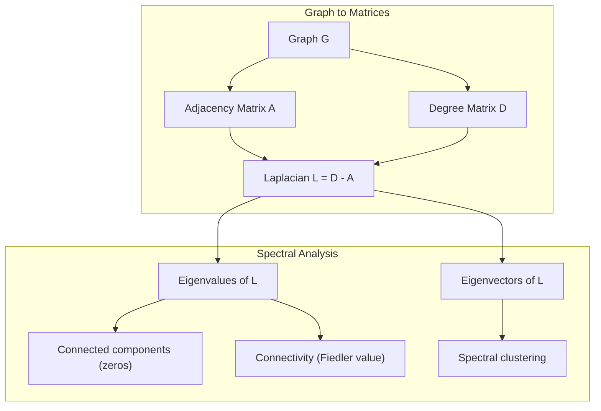
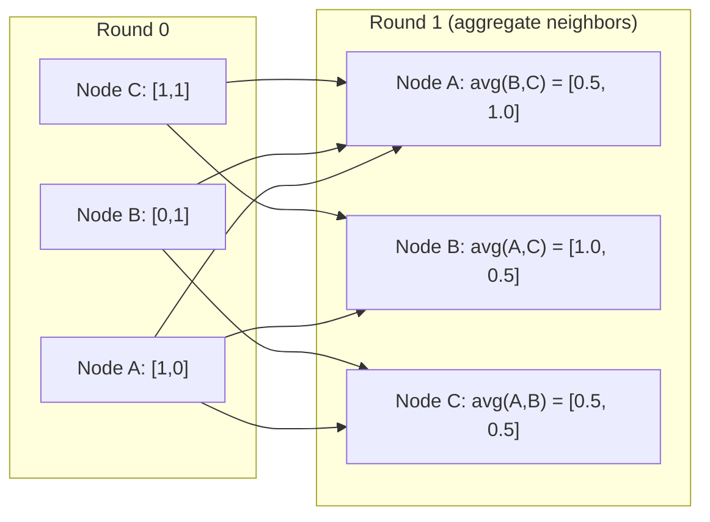

# 面向 Machine Learning   La théorie des graphiques

> Le graphique est une structure de données relationnelle. Si vos données contiennent des connexions, vous avez besoin de la théorie des graphiques.

**Type:** Build
**Language:**Python
**Prerequisites:** Phase 1, Lessons 01-03（linear algebra, matrices）
**Time:** ~90 分钟

## Objectif de l'apprentissage
- Construire une classe de graphes, contenant une matrice/une liste d'adjacence
- 计算 graph Laplacien,并使用其自身值 检测连接组件 和对节点 聚类
- Pour réaliser une matrice d'adjacence normalisée de multiplication
- Utiliser vecteur Fiedler  appliquer le regroupement spectrale

##  problématique
Les réseaux sociaux, les molécules, les bases de connaissances, les réseaux de citations, les cartes routières sont des graphiques.

考虑一个社交网络――你想预测某用户会购买什么产品――他们的购买历史很重要――但他们朋友的购买历史更重要――连接本身承载信号――

Ou pensez à une molécule. Vous pensez à prévoir si elle se combinera avec une protéine. Les atomes sont importants, mais ce qui est vraiment important, c'est la façon dont les atomes se composent.

Les réseaux neuraux graphiques (GNN) sont les domaines les plus rapides de l'apprentissage profond. Ils stimulent la découverte de médicaments, la recommandation sociale, la détection de la fraude et le raisonnement graphique des connaissances.

Vous avez besoin de quatre choses:
1. Une sorte de graphes indiquer pour les matrices de la façon que vous pouvez faire multiplication à leur sujet)
2. Utilisé pour explorer les algorithmes de traversée de la structure du graphique
3. Laplacien, c'est la théorie des graphiques spectraux.
4. Le message passe, c'est faire GNN 工作的操作

## 概念
### Graphiques: nœuds et bords

Un graphique G = (V, E) par les sommets (nœuds) V 和 les bords E 组成──每条 edge 连接两个节点──

**Directed vs undirected。**Dans le graphique non dirigé, l'extrémité (u, v) indique u 连接到 v,并且 v 也连接到 u── dans le graphique non dirigé, l'extrémité (u, v) indique u 指向 v,但反向不一定成立──

**Weighted vs unweighted。**Dans un graphique non pondéré, les bords doivent ou non exister. Dans un graphique pondéré, chaque bord a un poids de valeur numérique, par exemple distance, coût ou force.

| Graph type | Example |
|-----------|---------|
| Undirected, unweighted | Facebook friendship network |
| Directed, unweighted | Twitter follow network |
| Undirected, weighted | Road map（distances） |
| Directed, weighted | Web page links（PageRank scores） |

### La matrice d'adjacence

Matrice d'adjacence A est le centre de la représentation. Pour un graphique contenant n 个节点:

```
A[i][j] = 1    if there is an edge from node i to node j
A[i][j] = 0    otherwise
```

Pour les graphiques non dirigés,A est symétrique:A[i][j] =A[j][i]。 Pour les graphiques pondérés,A[i][j] = poids de bord (i, j)。

**示例：一个 triangle：**

```
Nodes: 0, 1, 2
Edges: (0,1), (1,2), (0,2)

A = [[0, 1, 1],
     [1, 0, 1],
     [1, 1, 0]]
```

Matrice d'adjacence est chaque entrée de GNN.

### Diplôme

Le degré du nœud est connecté à ses bords 数量── Pour les graphiques dirigés, vous avez des bords de degré ((entrée) et de degré ((sortie)──

Matrice de degré D est diagonale:

```
D[i][i] = degree of node i
D[i][j] = 0    for i != j
```

Pour le triangle, exemple:D = diagonal (2, 2, 2), parce que chaque nœud est connecté à deux autres nœuds.

Le degré  vous dit l'importance du nœud. Le degré élevé = nœud de centre. La distribution de degrés d'un réseau dévoile sa structure. Les réseaux sociaux suivent les lois de la puissance.

### BFS et DFS

Il y a deux algorithmes de traversée de graphes.

**Breadth-First Search (BFS)：**Pour les voisins, il faut faire la queue de recherche.

```
BFS from node 0:
  Visit 0
  Queue: [1, 2]        (neighbors of 0)
  Visit 1
  Queue: [2, 3]        (add neighbors of 1)
  Visit 2
  Queue: [3]           (neighbors of 2 already visited)
  Visit 3
  Queue: []            (done)
```

BFS est utilisé dans les graphiques non pondérés pour trouver les chemins les plus courts. La distance entre le point de départ et le nœud de référence est la même que celle du niveau BFS de ce nœud.

**Depth-First Search (DFS)：**Dans le cas d'un système de récupération, il est possible de faire une utilisation de la pile (LIFO) ou de la récursion.

```
DFS from node 0:
  Visit 0
  Stack: [1, 2]        (neighbors of 0)
  Visit 2               (pop from stack)
  Stack: [1, 3]         (add neighbors of 2)
  Visit 3               (pop from stack)
  Stack: [1]
  Visit 1               (pop from stack)
  Stack: []             (done)
```

DFS peut être utilisé:
- 查找 connectés des composants ((从未访问的节点 运行 DFS)
- Détection du cycle ((arbre DFS 中的后边)
- Réglage topologique (ordre de finition du DFS)

| Algorithm | Data structure | Finds | Use case |
|-----------|---------------|-------|----------|
| BFS | Queue | Shortest paths | Social network distance, knowledge graph traversal |
| DFS | Stack | Components, cycles | Connectivity, topological sort |

### Le graphe laplacien

L = D - A。 théorie des graphiques spectraux 中最重要的矩阵──

Pour le triangle:

```
D = [[2, 0, 0],    A = [[0, 1, 1],    L = [[2, -1, -1],
     [0, 2, 0],         [1, 0, 1],         [-1, 2, -1],
     [0, 0, 2]]         [1, 1, 0]]         [-1, -1,  2]]
```

La Laplacie a une nature très importante:

1. **L 是 positive semi-definite。**Toutes les valeurs propres sont >= 0

2. **zero eigenvalues 的数量等于 connected components 的数量。**Un graphique connecté 恰恰有一个零 eigenvalue──un graphique de trois composants déconnectés ٬a trois valeurs propres zéro──

3. **最小的 non-zero eigenvalue（Fiedler value）衡量 connectivity。**较大的Fiedler value 表示图 连接良好──较小的Fiedler value 表示图 有一个薄弱点,也就是瓶──

4. **Fiedler value 的 eigenvector（Fiedler vector）揭示最佳切分。**值为正的节点 进入一组,值为负的节点 进入另一组──这就是光谱集群──



### Propriétés spectrales

Les valeurs propres de la matrice adjacente et de la Laplacienne peuvent être révélées en cas de traversée non faite.

**Spectral clustering**Le mode de travail est le suivant:
1. 计算 Laplacien L
2. 找到 L's k 个最小 eigenvectors(跳过第一个; Pour les graphiques connectés, c'est tout 1)
3. Utiliser ces vecteurs propres comme un nouveau symbole de chaque nœud
4. Dans ces couloirs, on va à la ronde.

Pourquoi est-ce que c'est efficace ? Les vecteurs propres de L  codé sur le graphique                                                                                                                                                                                                                                                    

**Random walk connection。**La distribution stationnaire de la marche aléatoire avec le degré de nœud, le temps de mélange, dépend de l'écart spectrique.

### Le message est passé

C'est le cœur de l'opération des réseaux neuraux graphiques. Chaque nœud de ses voisins collecte des messages, les regroupe, puis renouvelle son état.

```
h_v^(k+1) = UPDATE(h_v^(k), AGGREGATE({h_u^(k) : u in neighbors(v)}))
```

Dans la forme la plus simple, AGGREGATE = moyenne,UPDATE = transformation linéaire + activation:

```
h_v^(k+1) = sigma(W * mean({h_u^(k) : u in neighbors(v)}))
```

Ceci est en fait une autre forme de multiplication de matrice. Si H est la matrice de toutes les caractéristiques du nœud, A est la matrice d'adjacence:

```
H^(k+1) = sigma(A_norm * H^(k) * W)
```

Parmi eux, la norme A est une matrice d'adjacentité normalisée (x) (x) (x) (x) (x) (x) (x) (x) (x) (x) (x) (x) (x) (x) (x) (x) (x) (x) (x) (x) (x) (x) (x) (x) (x) (x) (x) (x) (x) (x) (x) (x) (x) (x) (x) (x) (x) (x) (x) (x) (x) (x) (x) (x) (x) (x) (x) (x) (x) (x) (x) (x) (x) (x) (x) (x) (x) (x) (x) (x) (x) (x) (x) (x) (x) (x) (x) (x) (x) (x) (x) (x) (x) (x) (x) (x) (x) (x) (x) (x) (x) (x) (x) (x) (x) (x) (x) (x) (x) (x) (x) (x) (x) (x) (x) (x) (x) (x) (x) (x) (x) (x) (x) (x) (x) (x) (x) (x) (x) (x) (x) (x) (x) (x) (x) (x) (x) (x) (x) (x) (x) (x) (x) (x) (x) (x) (x) (x) (x) (x) (x)) (x) (x) (x) (x))) (x) (x)) (x)))) (x) (x)) (x) (x))) (x) (x) (x)) (x) (x)) (x) (x)) (x)

Un message passe 让每个节点 看到它的邻居――两轮让它看到邻居的邻居――K 轮让每个节点 获得来自其K-hop社区的信息――



### 概念与 ML 应用

| Concept | ML Application |
|---------|---------------|
| Adjacency matrix | GNN input representation |
| Graph Laplacian | Spectral clustering, community detection |
| BFS/DFS | Knowledge graph traversal, path finding |
| Degree distribution | Node importance, feature engineering |
| Message passing | GNN layers (GCN, GAT, GraphSAGE) |
| Eigenvalues of L | Community detection, graph partitioning |
| Spectral clustering | Unsupervised node grouping |
| PageRank | Node importance, web search |


```figure
graph-degree-distribution
```

## - Je le construis.
### 步骤 1: réalisation de la carte

```python
class Graph:
    def __init__(self, n_nodes, directed=False):
        self.n = n_nodes
        self.directed = directed
        self.adj = {i: {} for i in range(n_nodes)}

    def add_edge(self, u, v, weight=1.0):
        self.adj[u][v] = weight
        if not self.directed:
            self.adj[v][u] = weight

    def neighbors(self, node):
        return list(self.adj[node].keys())

    def degree(self, node):
        return len(self.adj[node])

    def adjacency_matrix(self):
        import numpy as np
        A = np.zeros((self.n, self.n))
        for u in range(self.n):
            for v, w in self.adj[u].items():
                A[u][v] = w
        return A

    def degree_matrix(self):
        import numpy as np
        D = np.zeros((self.n, self.n))
        for i in range(self.n):
            D[i][i] = self.degree(i)
        return D

    def laplacian(self):
        return self.degree_matrix() - self.adjacency_matrix()
```

liste de l'adjacence`self.adj`) peut être utilisé pour stocker des matrices adjacentes, car toutes les opérations spectrales en ont besoin.

### 步骤 2: BFS et DFS

```python
from collections import deque

def bfs(graph, start):
    visited = set()
    order = []
    distances = {}
    queue = deque([(start, 0)])
    visited.add(start)
    while queue:
        node, dist = queue.popleft()
        order.append(node)
        distances[node] = dist
        for neighbor in graph.neighbors(node):
            if neighbor not in visited:
                visited.add(neighbor)
                queue.append((neighbor, dist + 1))
    return order, distances


def dfs(graph, start):
    visited = set()
    order = []
    stack = [start]
    while stack:
        node = stack.pop()
        if node in visited:
            continue
        visited.add(node)
        order.append(node)
        for neighbor in reversed(graph.neighbors(node)):
            if neighbor not in visited:
                stack.append(neighbor)
    return order
```

BFS 使用 deque(double-finition queue) pour réaliser O(1) popleft。DFS Utilisation liste 作为堆──两者都会恰好访问每个节点 一次,时间复杂度为 O(V + E)。

### 步骤 3:Components connectés et valeurs propres Laplaciens

```python
def connected_components(graph):
    visited = set()
    components = []
    for node in range(graph.n):
        if node not in visited:
            order, _ = bfs(graph, node)
            visited.update(order)
            components.append(order)
    return components


def laplacian_eigenvalues(graph):
    import numpy as np
    L = graph.laplacian()
    eigenvalues = np.linalg.eigvalsh(L)
    return eigenvalues
```

`eigvalsh`Il est utilisé pour les matrices symétriques, tandis que le Laplacien pour les graphiques non dirigés est toujours symétrique. Il revient à des valeurs propres.

### 步骤 4: Clusterage spectrale

```python
def spectral_clustering(graph, k=2):
    import numpy as np
    L = graph.laplacian()
    eigenvalues, eigenvectors = np.linalg.eigh(L)
    features = eigenvectors[:, 1:k+1]

    labels = np.zeros(graph.n, dtype=int)
    for i in range(graph.n):
        if features[i, 0] >= 0:
            labels[i] = 0
        else:
            labels[i] = 1
    return labels
```

Pour k = 2, le graphe sera divisé en deux groupes. Pour k>2, vous serez dans les prévisions de k 个 eigenvectors.

### 步骤 5: Passage du message

```python
def message_passing(graph, features, weight_matrix):
    import numpy as np
    A = graph.adjacency_matrix()
    row_sums = A.sum(axis=1, keepdims=True)
    row_sums[row_sums == 0] = 1
    A_norm = A / row_sums
    aggregated = A_norm @ features
    output = aggregated @ weight_matrix
    return output
```

C'est une série de messages GNN qui passent. Les nouvelles fonctionnalités de chaque nœud sont la moyenne pondérée des fonctionnalités de ses voisins, en repassant la matrice de poids.

## Utilisez-le
Utilisation réseau x et numpy, les mêmes opérations sont un-liners:

```python
import networkx as nx
import numpy as np

G = nx.karate_club_graph()

A = nx.adjacency_matrix(G).toarray()
L = nx.laplacian_matrix(G).toarray()

eigenvalues = np.linalg.eigvalsh(L.astype(float))
print(f"Smallest eigenvalues: {eigenvalues[:5]}")
print(f"Connected components: {nx.number_connected_components(G)}")

communities = nx.community.greedy_modularity_communities(G)
print(f"Communities found: {len(communities)}")

pr = nx.pagerank(G)
top_nodes = sorted(pr.items(), key=lambda x: x[1], reverse=True)[:5]
print(f"Top 5 PageRank nodes: {top_nodes}")
```

réseaux peut s'appuyer sur des backends C optimisés pour traiter des graphiques de taille souhaitée.

### analyse spectrale de la nudité

```python
import numpy as np

A = np.array([
    [0, 1, 1, 0, 0],
    [1, 0, 1, 0, 0],
    [1, 1, 0, 1, 0],
    [0, 0, 1, 0, 1],
    [0, 0, 0, 1, 0]
])

D = np.diag(A.sum(axis=1))
L = D - A

eigenvalues, eigenvectors = np.linalg.eigh(L)
print(f"Eigenvalues: {np.round(eigenvalues, 4)}")
print(f"Fiedler value: {eigenvalues[1]:.4f}")
print(f"Fiedler vector: {np.round(eigenvectors[:, 1], 4)}")

fiedler = eigenvectors[:, 1]
group_a = np.where(fiedler >= 0)[0]
group_b = np.where(fiedler < 0)[0]
print(f"Cluster A: {group_a}")
print(f"Cluster B: {group_b}")
```

Le vecteur Fiedler 承担了主要工作──正值条目位于 un cluster,负值条目位于 un autre cluster──不需要再进化优化,只需要一次自构──

## Je le livre.
Le programme de formation
- `outputs/skill-graph-analysis.md`: pour l'analyse des données structurées par graphes

## Les liens

| Concept | Where it shows up |
|---------|------------------|
| Adjacency matrix | GCN, GAT, GraphSAGE input |
| Laplacian | Spectral clustering, ChebNet filters |
| BFS | Knowledge graph traversal, shortest path queries |
| Message passing | Every GNN layer, neural message passing |
| Spectral gap | Graph connectivity, mixing time of random walks |
| Degree distribution | Power-law networks, node feature engineering |
| Connected components | Preprocessing, handling disconnected graphs |
| PageRank | Node importance ranking, attention initialization |

GNN 值得特别说明──GCN(Kipf & Welling, 2017) utilisant une opération de convection de graphes utilisant une matrice d'adjacence de boucles autonomes, A_hat = A + I:

```text
H^(l+1) = sigma(D_hat^(-1/2) * A_hat * D_hat^(-1/2) * H^(l) * W^(l))
```

Parmi eux A_hat = A + I(adjacence加自环),D_hat est une matrice de degré A_hat。auto-loops 确保每个节在集结期间包含自身特征──这正是带有对称正常化的信息传递──D_hat^(-1/2) *A_hat *D_hat^(-1/2) 是正常化的邻属性矩阵──Laplacien apparaît ici, c'est parce que cette normalisation est associée à L_sym = I - D^(-1/2) *A * D^(-1/2) 相关──理解Laplacien,就意味着理解GCNs为什么有效──

## 练习
1. **从零实现 PageRank。**Depuis les scores uniformes 开始──每一步:score(v) = (1-d) /n + d * somme(score(u) /out_degree(u)), dont u 是所有指向 v 的节点──使用d=0.85──运行直到收(变化 < 1e-6)──在一个小型网页图 上测试──

2. **使用 spectral clustering 查找 communities。**创建一个包含两个明显分离的集群的图片 (例如,两个点击 通过一条边缘 连接) 运行光谱集群,并验证它能找到正确分──当你添加更多跨集群边缘时会发生什么?

3. **为 weighted graphs 中的 shortest paths 实现 Dijkstra's algorithm。**Dans le même graphique de poids uniformes, les résultats seront comparés à la BFS.

4. **构建一个 2-layer message passing network。**Utilisez différentes matrices de poids  appliquer deux fois le message de passage.

5. **分析一个真实世界 graph。**Utilisation du graphique du Karate Club ((34 nœuds, 78 bords) ⋅ calcul de la répartition des degrés、 valeurs propres Laplaciennes 和 clustering spectrale。

## 关键术语
| Term | What people say | What it actually means |
|------|----------------|----------------------|
| Graph | “Nodes and edges” | 一种数学结构 G=(V,E)，用于编码 pairwise relationships |
| Adjacency matrix | “The connection table” | 一个 n x n matrix，其中如果 nodes i 和 j 相连，则 A[i][j] = 1 |
| Degree | “一个 node 有多 connected” | 接触某个 node 的 edges 数量 |
| Laplacian | “D minus A” | L = D - A，其 eigenvalues 会揭示 graph structure 的 matrix |
| Fiedler value | “The algebraic connectivity” | L 的最小 non-zero eigenvalue，用于衡量 graph 连接得有多好 |
| BFS | “Level-by-level search” | 在深入之前先访问所有 neighbors 的 traversal，可找到 shortest paths |
| DFS | “Go deep first” | 在回溯之前沿一条 path 走到末端的 traversal |
| Message passing | “Nodes talk to neighbors” | 每个 node 从其 neighbors 聚合信息，这是 GNNs 的核心 |
| Spectral clustering | “Cluster by eigenvectors” | 使用 graph 的 Laplacian 的 eigenvectors 来划分 graph |
| Connected component | “A separate piece” | 一个 maximal subgraph，其中每个 node 都能到达其他每个 node |

## 延伸阅读
- **Kipf & Welling (2017)**:Classification semi-surveillée avec des réseaux convectuels de graphes―开启现代 GNNs 的论文── a montré comment les convulsions de graphes spectraux peuvent être simplifiées pour transmettre des messages―
- **Spielman (2012)**: Théorie des graphes spectraux notes de conférence。 À propos des Laplaciens、 les lacunes spectrales 和 la partition des graphes──
- **Hamilton (2020)**Le livre de la base à l'application couvre les GNN.
- **Bronstein et al. (2021)**:L'apprentissage en profondeur géométrique: grilles, groupes, graphiques, géodésiques et gauges。统一框架论文。
- **Veličković et al. (2018)**:Graph Attention Networks──Utilisez des mécanismes d'attention   élargir le passage de messages──
