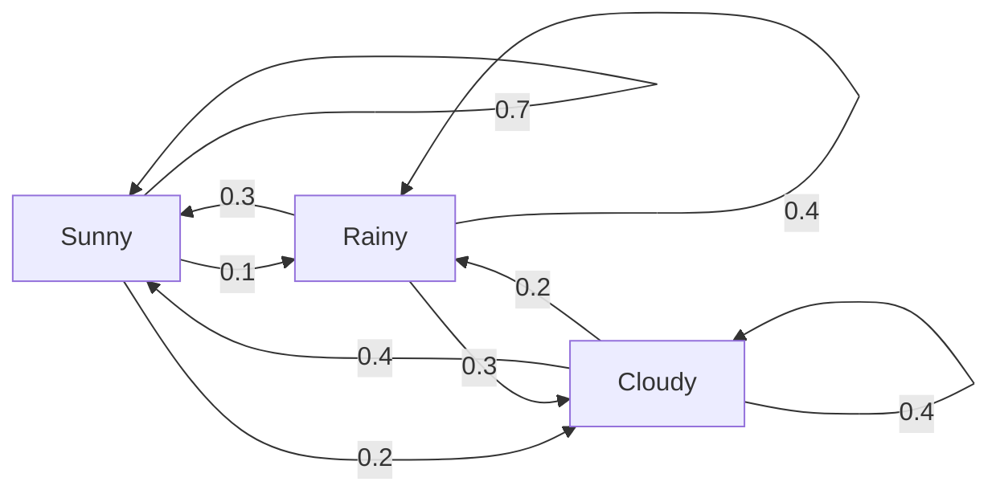
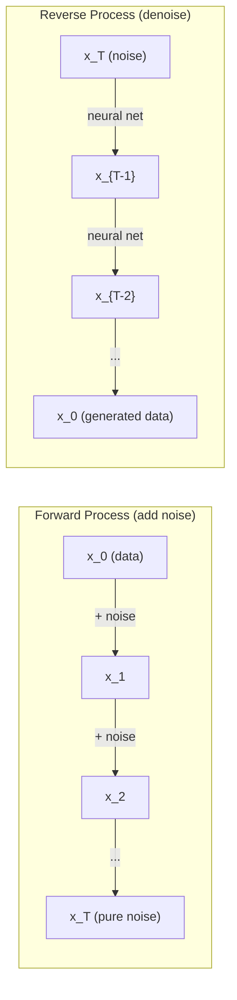

# Procédures stochastiques

> 具有结构的随机性──random walks、Markov chains 和 diffusion modèles 背后的数学──

**Type:** Learn
**Language:**Python
**Prerequisites:** Phase 1, Lessons 06-07（probability, Bayes）
**Time:** ~75 分钟

## Objectif de l'apprentissage
- 模拟 1D 和 2D randomisés,并验证位移的平方(n) 缩放规律
- Construire la chaîne Markov 模拟器,并通过自己的组合 计算其静止分布
- réaliser la dynamique MCMC et Langevin de Metropolis-Hastings, utilisée à partir de la distribution cible
- Pour établir un lien avec le mouvement brownien, expliquer le processus inverse

##  problématique
De nombreux systèmes d'IA sont liés au hasard de l'évolution au fil du temps.

Les modèles de langage une fois génèrent un jeton. Chaque jeton dépend du contexte de l'avant. Le modèle produit une distribution de probabilité, de l'extrait, puis continue.

Les modèles de diffusion étape par étape vers l'image ajoutent du bruit, jusqu'à ce qu'il devienne un bruit purement statique ⋅ puis ils reversent ce processus, dénonçant progressivement, jusqu'à ce qu'il apparaisse un nouveau image ⋅ processus à l'avant est une chaîne de Markov ⋅ processus inverse est une chaîne de Markov apprise à fonctionner à l'envers ⋅

Les agents d'apprentissage renforcé prennent des actions dans l'environnement. Chaque action conduit à un nouvel état.

Le prélèvement MCMC est le pilier de l'inférence bayésienne, il constitue une chaîne de Markov, sa distribution stationnaire est la suivante:

Tout cela est fondé sur quatre idées fondamentales:
1. Marches aléatoires  Le processus stochastique le plus simple
2. Chaînes de Markov  带有过渡矩阵的结构化随机性
3. Dynamique de Langevin  带噪音 de déclin graduel
4. Metropolis-Hastings                                                                                                                                                                                                                                                            

## 概念
### Des promenades aléatoires

De la position 0 开始── chaque étape, lancer une égale pièce de monnaie──正面:向右移动(+1)──反面:向左移动(-1)──

经过 n 步后, votre position est n 个随机 +/-1 值的总和──期望位置是 0((((((((((((((((((((((((((((((((((((((((((((((((((((((((((((((((((((((((((((((((((((((((((((((((((((((((((((((((((((((((((((((((((((((((((((((((((((((((((((((((((((((((((((((((((((((((((((((((((((((((((((((((((((((((((((((((((((((((((((((((((((((((((((((((((((((((((((((((((((((((((((((((((((((((((((((((((((((((((((((((((((((((((((((((((((((((((((((((((((((((((((((((((((((((((((((((((((((((((((((((((((((((((((((((((((((((((((((((((((((((((((((((((((((((((((((((((((((((((((((((

Ceci est un point de déviation, mais avec le temps, il s'écarte du point de départ et s'éloigne de la distance.

```
Step 0:  Position = 0
Step 1:  Position = +1 or -1
Step 2:  Position = +2, 0, or -2
...
Step 100: Expected distance from origin ~ 10 (sqrt(100))
Step 10000: Expected distance from origin ~ 100 (sqrt(10000))
```

**在 2D 中**,walk 以相等概率上、向下、向左或向右移动──距离原点同样遵循平方n 缩放规律──路径将描绘出类似碎形的模式──

**为什么是 sqrt(n)？**Chaque étape est en phase et la probabilité est de +1 ou -1──n 步后, position S_n = X_1 + X_2 + ... + X_n, dont chaque X_i est +/-1──n chaque étape est différente de 1, et chaque étape est indépendante de l'autre, donc Var(S_n) = n―Décécart standard = sqrt(n)──en fonction du théorème de limite centrale, S_n / sqrt(n) 收到标准正常分布──

Cette catégorie est composée de deux parties:

**与 Brownian motion 的联系。**取一个步尺为 1/sqrt(n) 、每单位时间 n 步的随机走---当 n 趋近无穷时, cette marche 会收到布朗运动 B(t)  一个连续时间过程,其中 B(t) 服从平均值为 0、变量为 t 的正常分布──

Le mouvement brownien est la base mathématique de la diffusion. Il décrit le mouvement de la fluctuation des particules dans le corps, ainsi que le processus de bruit dans les modèles de diffusion.

**Gambler's ruin。**Un marcheur aléatoire de la position k 开始, en 0 和 N 处有吸收障碍──到达 N 早于到达 0 的概率是多少?

### Chaînes de Markov

La chaîne de Markov est un système qui se transforme selon la probabilité fixe entre les États.

```
P(X_{t+1} = j | X_t = i, X_{t-1} = ...) = P(X_{t+1} = j | X_t = i)
```

C'est la propriété de Markov. Cela signifie que vous pouvez utiliser une matrice de transition P pour décrire toute la dynamique:

```
P[i][j] = probability of going from state i to state j
```

Pour chaque ligne de demande et pour 1... tu dois aller quelque part.

**示例 —— Weather：**

```
States: Sunny (0), Rainy (1), Cloudy (2)

P = [[0.7, 0.1, 0.2],    (if sunny: 70% sunny, 10% rainy, 20% cloudy)
     [0.3, 0.4, 0.3],    (if rainy: 30% sunny, 40% rainy, 30% cloudy)
     [0.4, 0.2, 0.4]]    (if cloudy: 40% sunny, 20% rainy, 40% cloudy)
```

De l'état arbitral 开始──经过多次过渡 后, les états de la distribution seront reçus jusqu'à la distribution stationnaire pi, dont pi * P = pi── c'est la valeur propre de P 为 1 de l'oïvectore propre gauche──

Pour la chaîne météo, la distribution stationnaire est [0,53, 0,18, 0,29]  长期来看, peu importe l'état de départ, soit quoi, 53% du temps est ensoleillé.



**计算 stationary distribution。**Il y a deux façons:

1. **Power method**: sera une distribution initiale arbitraire répétée par P. Après avoir eu suffisamment d'itérations, elle sera reçue.
2. **Eigenvalue method**: trouver la valeur propre de P pour le propre vecteur gauche de 1♦ Ceci équivaut à la valeur propre de P^T pour le propre vecteur de 1♦

Les deux méthodes exigent une chaîne de satisfaction des conditions.

**收敛条件。**Si une chaîne Markov satisfait aux conditions suivantes, elle recevra une distribution stationnaire unique:
- **Irreducible**Chaque État peut aller de n'importe quel autre État
- **Aperiodic**: la chaîne ne se déroulera pas en cycle fixe

La plupart des chaînes rencontrées dans le ML satisfont à ces deux conditions.

**Absorbing states。**Si une fois que vous entrez dans un état, vous ne quitterez jamais ((P[i][i] = 1), cet état est absorbant de la. Absorption des chaînes de Markov peut être utilisé pour construire avec des états terminaux.

**Mixing time。**需要多少步,chain 才会接近stationary distribution?形式化地说,就是 la distance totale de variation avec la distance de stationarité qui descend à un certain值以下所需的步数――Fast mixing = 需要的步数少──P's spectral gap(1 减去第二大自值) contrôler le temps de mélange──gap 越大,mixing 越快──

### Contact avec Modèles de langage

Modèle de langage 中的代币生成 近似是一个马科夫过程──给定当前文text,模型输出下一个代币 上的分布──温度 控制敏度:

```
P(token_i) = exp(logit_i / temperature) / sum(exp(logit_j / temperature))
```

- Température = 1,0: standard distribution
- Température < 1,0: plus pointe(
- Température > 1,0:更平坦(更随机)
- Température -> 0:argmax(compulsif)

Le top-k de l'échantillonnage 截断至概率最高的 k 个代币――Top-p(nucleus) de l'échantillonnage 截断至累积概率 超过 p 的最小代币 集合──两者都会修改马科夫过渡概率──

### Motion brown

La limite de temps continue de marche aléatoire.
1. B(0) = 0
2. B(t) - B(s) 服从均值为 0、variance 为 t - s de la répartition normale de t - s
3. Increements de la région de la différence

Le mouvement brownien est continu, mais il est indéfini. Il est en mouvement à chaque dimension.

Dans le mouvement dispersé, vous pouvez approcher ainsi le mouvement brownien:

```
B(t + dt) = B(t) + sqrt(dt) * z,    where z ~ N(0, 1)
```

Le thème de la réduction est important. Il est dérivé du théorème de la limite centrale des promenades aléatoires.

### Dynamique de Langevin

Déclin gradient 寻找函数的最小值──Langevin Dynamics 寻找与 exp(-U(x)/T) 成正比的概率分布, dont U est la fonction énergétique, T est la température──

```
x_{t+1} = x_t - dt * gradient(U(x_t)) + sqrt(2 * T * dt) * z_t
```

Il y a deux forces qui agissent sur la particule:
1. **Gradient force**- (dt * gradient(U)): pour une énergie inférieure (( similaire à la baisse du gradient)
2. **Random force**(sqrt(2*T*dt) * z):

Lorsque la température T = 0 时, c'est la pure descente gradiente. La température est élevée. La température est basse.

**与 diffusion models 的联系。**Le processus de diffusion du modèle est:

```
x_t = sqrt(alpha_t) * x_{t-1} + sqrt(1 - alpha_t) * noise
```

C'est une chaîne de Markov qui mélange les données et le bruit. Après avoir suivi suffisamment d'étapes, le bruit gaussien est pur.

Le processus inverse  du bruit à la data  est aussi une chaîne de Markov, mais ses probabilités de transition sont obtenues par le réseau neural                                                                                                                                                                                                                                            



### MCMC: Chaîne de Markov à Monte Carlo

Parfois, vous avez besoin d'une valeur que vous pouvez obtenir (la possibilité de différer d'un nombre constant) mais vous ne pouvez pas directement adopter une distribution de p (x) en forme de modèle.

**Metropolis-Hastings**构建一个静止分布 为 p(x) de la chaîne de Markov:

1. De quelque part à x
2. 提议一个新位置 x'
3. 计算 acceptance ratio:a) * Q (x) = p (x)
4. Pour les autres, il est nécessaire de prendre en compte les données de l'analyse.
5. Je vous en prie.

Si Q est symétrique de (exemple Q) x'x de) = Q (x, x) = N (x, x) = sigma^2)), le rapport 可简化为 a = p (x) / p (x) 你只需要概率的比率 正常化常态 会相互抵消──

Dans des conditions tempérées, cette chaîne assure la réception jusqu'à la p(x) ⋅ mais si la proposition 太小(random walk) ou trop grande(高拒绝), la réception est très lente.

**为什么它有效。**Le rapport d'acceptation  assure l'équilibre détaillé: situé x et déplacé jusqu'à x' probabilité, égale à situé x' et déplacé jusqu'à x' probabilité。 l'équilibre détaillé signifie p(x) est la distribution stationnaire de la chaîne。 par conséquent, il a été traversé suffisamment d'étapes 后, échantillons de p(x)。

**实践注意事项：**
- **Burn-in**: abandonné, n'ont pas été testés, la chaîne a besoin de temps pour atteindre la distribution stationnaire.
- **Thinning**Pour chaque échantillon, conservez-en un, afin de réduire l'autocorrélation.
- **Multiple chains**Si elles sont réparties dans la même distribution, il existe des preuves de réception.
- **Acceptance rate**Pour les propositions de Gauss, le taux d'acceptation optimal est d'environ 23% (Roberts & Rosenthal, 2001):

### Processus stochastiques dans l'IA

| Process | AI Application |
|---------|---------------|
| Random walk | RL 中的 exploration、Node2Vec embeddings |
| Markov chain | Text generation、MCMC sampling |
| Brownian motion | Diffusion models（forward process） |
| Langevin dynamics | Score-based generative models、SGLD |
| Markov decision process | Reinforcement learning |
| Metropolis-Hastings | Bayesian inference、posterior sampling |


```figure
random-walk-diffusion
```

## - Je le construis.
### 步骤 1: Simulateur de marche aléatoire

```python
import numpy as np

def random_walk_1d(n_steps, seed=None):
    rng = np.random.RandomState(seed)
    steps = rng.choice([-1, 1], size=n_steps)
    positions = np.concatenate([[0], np.cumsum(steps)])
    return positions


def random_walk_2d(n_steps, seed=None):
    rng = np.random.RandomState(seed)
    directions = rng.choice(4, size=n_steps)
    dx = np.zeros(n_steps)
    dy = np.zeros(n_steps)
    dx[directions == 0] = 1   # right
    dx[directions == 1] = -1  # left
    dy[directions == 2] = 1   # up
    dy[directions == 3] = -1  # down
    x = np.concatenate([[0], np.cumsum(dx)])
    y = np.concatenate([[0], np.cumsum(dy)])
    return x, y
```

1D marche stockage de la somme cumulée── chaque étape est +1 ou -1── traversé n 步后, position est总和──variance 随 n 线性增长, donc déviation standard 按平方(n) 增长──

### 步骤 2: Chaîne de Markov

```python
class MarkovChain:
    def __init__(self, transition_matrix, state_names=None):
        self.P = np.array(transition_matrix, dtype=float)
        self.n_states = len(self.P)
        self.state_names = state_names or [str(i) for i in range(self.n_states)]

    def step(self, current_state, rng=None):
        if rng is None:
            rng = np.random.RandomState()
        probs = self.P[current_state]
        return rng.choice(self.n_states, p=probs)

    def simulate(self, start_state, n_steps, seed=None):
        rng = np.random.RandomState(seed)
        states = [start_state]
        current = start_state
        for _ in range(n_steps):
            current = self.step(current, rng)
            states.append(current)
        return states

    def stationary_distribution(self):
        eigenvalues, eigenvectors = np.linalg.eig(self.P.T)
        idx = np.argmin(np.abs(eigenvalues - 1.0))
        stationary = np.real(eigenvectors[:, idx])
        stationary = stationary / stationary.sum()
        return np.abs(stationary)
```

La distribution stationnaire est la valeur propre de P pour le propre vecteur gauche de 1。 nous calculons les propres vecteurs de P^T pour le trouver(transposer les propres vecteurs gauche en propres vecteurs droits)。

### 步骤 3: Dynamique de Langevin

```python
def langevin_dynamics(grad_U, x0, dt, temperature, n_steps, seed=None):
    rng = np.random.RandomState(seed)
    x = np.array(x0, dtype=float)
    trajectory = [x.copy()]
    for _ in range(n_steps):
        noise = rng.randn(*x.shape)
        x = x - dt * grad_U(x) + np.sqrt(2 * temperature * dt) * noise
        trajectory.append(x.copy())
    return np.array(trajectory)
```

Le gradient x va être poussé vers une énergie basse, le bruit empêche sa chute en phase de stagnation, le taux d'échantillonnage est de 0,7 °C.

### 步骤 4: Métropole-Hastings

```python
def metropolis_hastings(target_log_prob, proposal_std, x0, n_samples, seed=None):
    rng = np.random.RandomState(seed)
    x = np.array(x0, dtype=float)
    samples = [x.copy()]
    accepted = 0
    for _ in range(n_samples - 1):
        x_proposed = x + rng.randn(*x.shape) * proposal_std
        log_ratio = target_log_prob(x_proposed) - target_log_prob(x)
        if np.log(rng.rand()) < log_ratio:
            x = x_proposed
            accepted += 1
        samples.append(x.copy())
    acceptance_rate = accepted / (n_samples - 1)
    return np.array(samples), acceptance_rate
```

L'algorithme propose un nouveau point, vérifie s'il a une probabilité plus élevée (ou en proportion de la probabilité de réussite), puis répète-le. Pour obtenir un bon mélange, le taux d'acceptation devrait être d'environ 23 à 50% entre-

## Utilisez-le
En pratique, vous utiliserez des bibliothèques mûres pour réaliser ces algorithmes.

```python
import numpy as np

rng = np.random.RandomState(42)
walk = np.cumsum(rng.choice([-1, 1], size=10000))
print(f"Final position: {walk[-1]}")
print(f"Expected distance: {np.sqrt(10000):.1f}")
print(f"Actual distance: {abs(walk[-1])}")
```

### Utilisé pour les matrices de transition

```python
import numpy as np

P = np.array([[0.7, 0.1, 0.2],
              [0.3, 0.4, 0.3],
              [0.4, 0.2, 0.4]])

distribution = np.array([1.0, 0.0, 0.0])
for _ in range(100):
    distribution = distribution @ P

print(f"Stationary distribution: {np.round(distribution, 4)}")
```

Après avoir fait suffisamment d'itérations, il sera réussi à obtenir une distribution stationnaire, peu importe de quoi vous commencez.

### Connexion avec le cadre réel

- **PyTorch diffusion：**Une face en train de s' embrasser`diffusers`Le centre`DDPMScheduler`实现了前进和反转马科夫链
- **NumPyro / PyMC：**Utilisez le modèle MCMC(NUTS, il est amélioré par Metropolis-Hastings) pour effectuer une inférence bayésienne
- **Gymnasium (RL)：**fonction de l'environnement étape  définir un processus de décision Markov

### 验证 Convergence de la chaîne de Markov

```python
import numpy as np

P = np.array([[0.9, 0.1], [0.3, 0.7]])

eigenvalues = np.linalg.eigvals(P)
spectral_gap = 1 - sorted(np.abs(eigenvalues))[-2]
print(f"Eigenvalues: {eigenvalues}")
print(f"Spectral gap: {spectral_gap:.4f}")
print(f"Approximate mixing time: {1/spectral_gap:.1f} steps")
```

L'écart spectrale  vous dire la chaîne  oublier sa vitesse initiale ⋅ écart est 0.2 signifie environ 5 étapes ⋅ mélangeable ⋅ écart est 0.01 signifie environ 100 étapes ⋅ fonctionnement de la simulation ⋅ avant ⋅ vérifier cet élément ⋅ mélange ⋅ très lent de la chaîne 会浪费计算。

## Je le livre.
Le programme de formation
- `outputs/prompt-stochastic-process-advisor.md` Un prompt, pour aider à identifier un problème déterminé adapté à quel cadre de processus stochastique

## Les liens

| Concept | Where it shows up |
|---------|------------------|
| Random walk | Node2Vec graph embeddings、RL 中的 exploration |
| Markov chain | LLMs 中的 Token generation、MCMC sampling |
| Brownian motion | DDPM 中的 forward diffusion process、SDE-based models |
| Langevin dynamics | Score-based generative models、stochastic gradient Langevin dynamics (SGLD) |
| Stationary distribution | MCMC convergence target、PageRank |
| Metropolis-Hastings | Bayesian posterior sampling、simulated annealing |
| Temperature | LLM sampling、RL 中的 Boltzmann exploration、simulated annealing |
| Mixing time | MCMC 的 convergence speed、spectral gap analysis |
| Absorbing state | End-of-sequence token、RL 中的 terminal states |
| Detailed balance | MCMC samplers 的 correctness guarantee |

Les modèles de diffusion 值得特别关注──DDPM(Ho et al., 2020) définissent une chaîne Markov avancée:

```
q(x_t | x_{t-1}) = N(x_t; sqrt(1-beta_t) * x_{t-1}, beta_t * I)
```

Parmi eux, beta_t est un schéma de bruit.

```
p_theta(x_{t-1} | x_t) = N(x_{t-1}; mu_theta(x_t, t), sigma_t^2 * I)
```

Chaque étape de la génération est une étape apprise dans la chaîne de Markov. Comprendre les chaînes de Markov signifie comprendre les modèles de diffusion  comment et pourquoi peuvent-ils générer des données.

SGLD(Stochastic Gradient Langevin Dynamics) va combiner le petit lot Gradient Descent avec le bruit de Langevin 结起来──你不计算完整的 Gradient,而是使用 Stochastic estimation并添加校准的噪音──随着学习率 衰退,SGLD 会从优化 过渡到样品采样  你几乎免费得到近似的贝叶斯后方样品──这是从神经网络 获得不确定性估计的最简单方式之一──

穿越这些联系的关键洞见是: les processus stochastiques ne sont pas seulement des outils théoriques. Ils sont des mécanismes de calcul modernes à l'intérieur du système AI. Lorsque vous réglez la température de votre LLM, vous réglez une chaîne de Markov. Lorsque vous entraînez un modèle de diffusion, vous apprenez à inverser un processus similaire au mouvement brownien. Lorsque vous effectuez une inférence bayésienne, vous construisez une chaîne de réception à l'arrière.

## 练习
1. **模拟 1000 条 10000 步的 random walks。**绘制最终位置的分布──验证它近似为平均 0、标准偏差平方rt(10000) = 100 的高斯──

2. **使用 Markov chain 构建 text generator。**Dans un petit corpus, on apprend à chaque mot à construire une matrice de transition.

3. **使用 Metropolis-Hastings 实现 simulated annealing。**De haute température 开始 (pratiquement tout accepter), puis progressivement降温 (pratiquement seulement amélioration) ⋅ utiliser pour trouver la valeur minimale de la fonction avec de nombreux minima locaux.

4. **比较不同 temperatures 下的 Langevin dynamics。**De potentiel de puits à double U(x) = (x^2 - 1)^2 中采样──低温 时,échantillons 聚集在一个井中──高温 时,它们分布在两个井中──找到链 在井中──混合的关键温度──

5. **实现 forward diffusion process。**De un signal 1D (par exemple une onde sine) commencer à utiliser un calendrier de bruit linéaire, en ajoutant progressivement du bruit à 100 étapes, pour montrer comment le signal se décompose en bruit pur, puis réaliser un dénicheur simple pour revenir à ce processus, même en réduisant une version naïve du bruit estimé.

## 关键术语
| Term | What people say | What it actually means |
|------|----------------|----------------------|
| Random walk | “抛硬币式移动” | 一个 position 在每一步按随机 increments 改变的过程 |
| Markov property | “无记忆性” | future 只依赖当前 state，而不依赖 history |
| Transition matrix | “概率表” | P[i][j] = 从 state i 移动到 state j 的概率 |
| Stationary distribution | “长期平均” | 满足 pi*P = pi 的分布 pi —— chain 的 equilibrium |
| Brownian motion | “随机抖动” | random walk 的 continuous-time limit，B(t) ~ N(0, t) |
| Langevin dynamics | “带噪声的 Gradient Descent” | 结合 deterministic Gradient 与 random perturbation 的 update rule |
| MCMC | “向目标行走” | 构造一个 stationary distribution 为你想要的分布的 Markov chain |
| Metropolis-Hastings | “提议并接受/拒绝” | 使用 acceptance ratios 来确保收敛的 MCMC algorithm |
| Temperature | “随机性旋钮” | 控制 exploration 与 exploitation 之间权衡的参数 |
| Diffusion process | “噪声进，噪声出” | Forward：逐渐添加 noise。Reverse：逐渐移除 noise。生成 data。 |

## 延伸阅读
- **Ho, Jain, Abbeel (2020)** Dénoncer les modèles probabilistiques de diffusion.   démarrer le modèle de diffusion 革命的 DDPM 论文──清晰推导了前进和反转马科夫链──
- **Song & Ermon (2019)**  Modélisation générative en estimant les gradients de la distribution des données. Utiliser la dynamique de Langevin  effectuer des échantillonnages 方法 basée sur le score。
- **Roberts & Rosenthal (2004)**  Généraux de l'espace de l'état chaînes Markov et MCMC algorithmes.                                                                                                                                                                                                                                                 
- **Norris (1997)** Markov Chains. 标准教材──涵盖融合、stationary distributions 和 hitting times──
- **Welling & Teh (2011)**  Apprendre bayésien par la dynamique de Langevin au degré stochastique. Conjoindre SGD et dynamique de Langevin, pour étendre l'inférence bayésienne。
