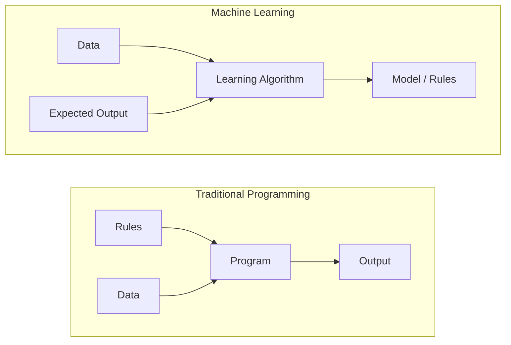
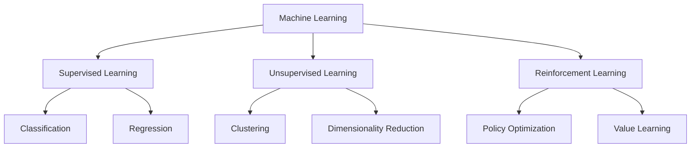
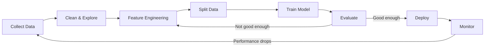
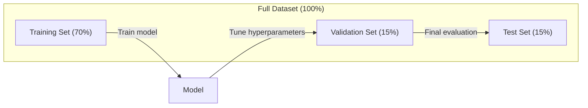
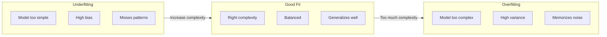
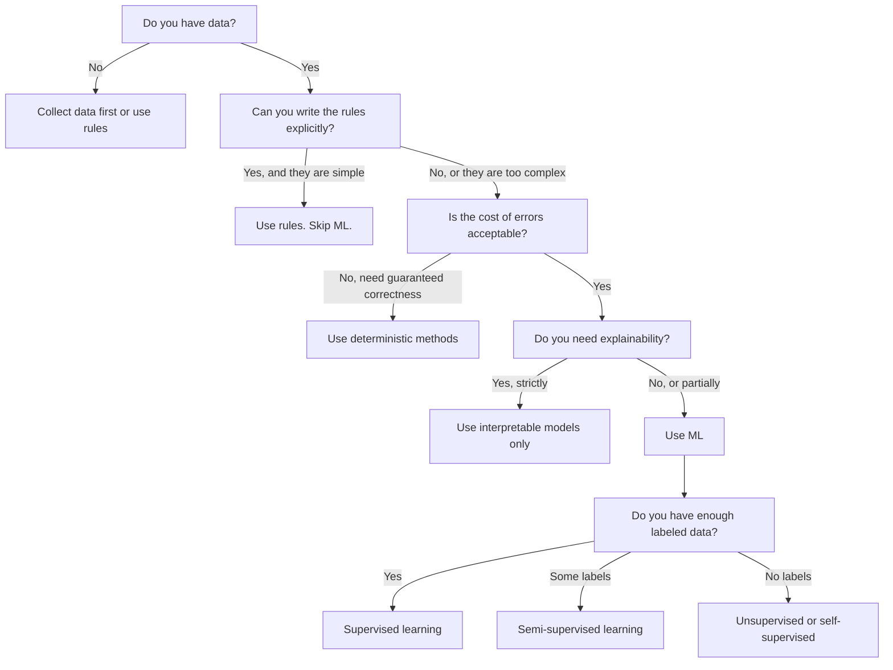

# Qu'est-ce que le Machine Learning ?

> L'apprentissage automatique est une méthode utilisée par les ordinateurs pour rechercher des modèles dans les données, et non des règles d'écriture manuelle.

**类型：**Apprendre à apprendre
**语言：**Python
**先修要求：**Phase 1 (fondations mathématiques)
**时间：**Il est 45 minutes.

## Objectif de l'apprentissage

- 解释监督无监督和加强学习的区别,并判断给定问题适用哪种类型的问题
- De zéro à réaliser le classifiateur centroid le plus proche, ne pas utiliser la ligne de base aléatoire pour évaluer
- 区分 Classification 和 Régressation  tâches,并为每种任务选择合适的损失函数
-  évaluer si les problèmes d'entreprise déterminés sont adaptés à l'utilisation de la méthode de calcul ou mieux adaptés à la réglementation de la détermination

##  problématique

Vous voulez construire un filtre à ordures. La pratique traditionnelle est de: si vous êtes assis pour écrire quelques centaines de règles. Si un message contient de l'argent gratuit, marquez-le comme un spam. Si il y a plus de trois signes, marquez-le comme un spam.

L'apprentissage automatique a changé cette façon de faire. Vous ne rédigez plus de règles, mais donnez à l'ordinateur des milliers de messages avec des balises (spam ou non), laissez-le trouver lui-même des règles.

Ce changement de la règle de rédaction à la transition de l'apprentissage des données est au cœur de l'apprentissage automatique.

## 概念

### Il faut apprendre de la données, pas de la règle.

La programmation traditionnelle et l'apprentissage automatique sont à l'opposé de la résolution des problèmes.



传统编程:你编写规则──程序把规则应用到数据上并产生输出──

Machine Learning: vous fournissez des données et vous souhaitez des résultats.

Modèle                                                                                                                                                                                                                                                             

### Les trois types d'apprentissage automatique



**Supervised Learning**Vous avez une paire d'entrée-sortie.
-  Il y a ici 10 000 张 marqués pour les photos de chats ou de chiens.
-  ici il y a des caractéristiques et des prix.

**Unsupervised Learning**Vous avez besoin de votre propre modèle.
-  Ici il y a 10 000 条客户购买历史──找出自然分组──
-  Ici il y a 1000 points de données                                                                                                                                                                                                                                                          

**Reinforcement Learning**L'agent dans l'environnement prend des mesures, et obtient une récompense ou une pénalité.
- J'ai gagné +1, perdu -1... et trouvé une stratégie.
- - Je suis en train de prendre le contrôle de ce robot.

Vous construisez en pratique la majorité du contenu à l'aide de l'apprentissage supervisé.

### 超越三大类型

Les trois classes ci-dessus sont très claires, mais les ML du monde réel sont souvent confuses.

**Semi-supervised learning**Utilisez une petite partie de données étiquetées et une grande quantité de données non étiquetées. Vous pouvez avoir 100 张带标签的医学图像和 100,000 张未标签的图像.

- **Label propagation：**Construire un lien similaire à un graphe de données. 标签 通过graph 从标签节点 传播到未标签邻居.
- **Pseudo-labeling：**Dans les données étiquetées, le modèle de formation, avec elle prévoir l'étiquette des données non étiquetées, puis dans l'ensemble des données, le modèle va démarrer son propre ensemble de formation.
- **Consistency regularization：**Pour une entrée et sa version légère, le modèle devrait donner la même prédiction.

**Self-supervised learning**De la surveillance de création de données en soi.

- **Masked language modeling (BERT)：**隐藏句中 15% 的词,训练模型 预测缺失的词──标签 来自原始文本──
- **Contrastive learning (SimCLR)：**取一张图像, créer deux versions renforcées── un modèle d'entraînement 识别它们来自同一张图像,同时将它们与其他图像的增强版本区分──
- **Next-token prediction (GPT)：**给定前面所有词,预测下一个词―― chaque texte dans le document devenait un modèle d'entraînement――

Ces classes ne sont pas indépendantes des trois grands types. Elles sont combinées avec des stratégies de pensées supervisées et non supervisées.

### Classification par rapport à régression

C'est deux tâches principales de l'apprentissage supervisé.

| 方面 | Classification | Regression |
|--------|---------------|------------|
| 输出 | 离散类别 | 连续数值 |
| 示例 | “这封邮件是垃圾邮件吗？” | “房价会是多少？” |
| 输出空间 | {cat, dog, bird} | 任意实数 |
| Loss Function | Cross-entropy, accuracy | Mean squared error, MAE |
| 决策 | 类别之间的边界 | 拟合数据的曲线 |

Classification 回答属于哪个类别?Régression 回答多少?

Certains problèmes peuvent être exprimés de deux manières: prédiction de la hausse ou de la baisse des actions: classification; prédiction de la régression; prédiction de la baisse des prix: régression.

### ML 工作流

Chaque projet d'apprentissage automatique suit le même pipeline, quel que soit l'algorithme utilisé.



**Collect Data**Rassembler des données originales: plus de données est presque toujours mieux, mais la qualité est plus importante que la quantité.

**Clean & Explore**Cette étape représente généralement 60 à 80% du temps total du projet.

**Feature Engineering**: La fonctionnalité de transformation des données originales en modèle utilisable. La fonctionnalité de transformation des données originales en modèle est plus importante que l'algorithme de l'expédition.

**Split Data**Le modèle de formation, le modèle de formation, le modèle de validation, le modèle de test, le modèle de test, le modèle de test, le modèle de test, le modèle de test, le modèle de test, le modèle de test, le modèle de test, le modèle de test, le modèle de test, le modèle de test, le modèle de test, le modèle de test, le modèle de test, le modèle de test, le modèle de test, le modèle de test, le modèle de test, le modèle de test, le modèle de test, le modèle de test, le modèle de test, le modèle de test, le modèle de test, le modèle de test, le modèle de test, le modèle de test, le modèle de test, le modèle de test, le modèle de test, le modèle de test, le modèle de test, le modèle de test, le modèle de test, le modèle de test, le modèle de test, le modèle de test, le modèle de test, le modèle de test, le modèle de test, le modèle de test, le modèle de test, le modèle de test, le modèle de test, le modèle de test, le modèle de test, le modèle de test, le modèle de test, le modèle de test, le modèle de test, le modèle de test, le modèle de test, le modèle de test, le modèle de test, le modèle de test, le modèle de test, le modèle de test, etc.

**Train Model**: 把 training data 输入算法──算法调整内部参数, afin de minimiser la fonction de perte──

**Evaluate**Si le rendement est inacceptable, on peut revenir essayer différentes caractéristiques, algorithmes ou hyperparamètres.

**Deploy**: mettre le modèle dans l'environnement de production, le faire prévoir les nouvelles données.

**Monitor**Les résultats de la formation sont les suivants:

### Formation, validation et test

C'est le concept clé le plus facile à tromper pour les débutants. Vous devez évaluer le modèle sur les données jamais vues pendant l'entraînement.



| 划分 | 目的 | 使用时机 | 典型大小 |
|-------|---------|-----------|-------------|
| Training | model 从这些数据中学习 | 训练期间 | 60-80% |
| Validation | 调整 hyperparameter、比较 model | 每次训练运行之后 | 10-20% |
| Test | 最终无偏 performance 估计 | 只在最后使用一次 | 10-20% |

Si vous continuez à régler le modèle de performance des tests, vous êtes en fait en train de vous entraîner, votre chiffre de rapport n'a pas d'importance.

Pour les petits ensembles de données, utilisez la validation croisée k-fold: faites la division des données en k ̇, entraînez-vous sur k-1 ̇, vérifiez-les sur le reste de 1 ̇, faites un roulement, et faites la moyenne des résultats.

### Sur-adaptation contre sous-adaptation



**Underfitting**Le modèle est trop simple, impossible à saisir dans les données.

**Overfitting**Le modèle est trop complexe, il se rappelle les données de formation, y compris le bruit.

**Good fit**:modèle 捕捉真模式,而不记忆噪音──formation erreur 和 test error 都相对较低──

Signes de surcharge:
- Accuracité de formation 远高于 précision de validation
- Les résultats de la formation sont très bons, mais les résultats des nouvelles données sont très mauvais.
- 增加更多训练数据 会提升性能(model 原本是记忆而不是学习)

修复 surmatch:
- obtenir plus de données de formation
- 降低模型复杂性(更少参数、更简单架构)
- Régularisation (à un poids plus élevé)
- Arrêter pendant l'entraînement
- Arrêt précoce (à l'heure de l'erreur de validation)

修复 sous-ajustement:
- Utilisation de modèle plus complexe
- 添加更多 fonctionnalité
- Réduction de la régularisation
- 训练更久

### Commerce des variantes partielles

C'est le cadre mathématique derrière le sur-classement et le sous-classement.

**Bias**Le modèle est un modèle de conception de la conception de la conception de la conception de la conception de la conception de la conception de la conception de la conception de la conception de la conception de la conception de la conception de la conception de la conception de la conception de la conception de la conception de la conception de la conception de la conception de la conception de la conception de la conception de la conception de la conception de la conception de la conception de la conception de la conception de la conception de la conception de la conception de la conception de la conception de la conception de la conception de la conception de la conception de la conception de conception de conception de conception de conception de conception de conception de conception de conception de conception de conception de conception de conception de conception de conception de conception de conception de conception de conception de conception de conception de conception de conception de conception de conception de conception de conception de conception de conception de conception de conception de conception de conception de conception de conception de conception de conception de conception de conception de conception de conception de conception de conception de conception de conception de conception de conception de conception de conception de conception de conception de conception de conception de conception de conception de conception de conception de conception de conception de conception de conception de conception de conception de conception de conception de conception de conception de conception de conception de conception de conception de conception de conception de conception de conception de conception de conception de conception de conception de conception de conception de conception de conception de conception de conception de conception de conception de conception de conception de conception de conception de conception de conception de conception de conception de conception de conception de conception de conception de conception de conception de conception de conception de conception de conception de conception de conception de conception de conception de conception de conception de conception de conception de conception de conception de conception de

**Variance**Les données de formation sont données par:

| Model complexity | Bias | Variance | 结果 |
|-----------------|------|----------|--------|
| 过低（用 linear model 拟合弯曲数据） | High | Low | Underfitting |
| 刚好合适 | Medium | Medium | 良好的 generalization |
| 过高（用 degree-20 polynomial 拟合 10 个点） | Low | High | Overfitting |

总 error = Bias^2 + Variance + bruit incontournable

Vous ne pouvez pas réduire le bruit irréductible, c'est le cas de données elles-mêmes. Vous devez trouver le meilleur point.

### Il n'y a pas de théorème du déjeuner gratuit

Il n'existe pas d'algorithme unique optimal pour tous les problèmes.

实践中, la sélection dépend de:
- Vous avez beaucoup de données
- Il y a beaucoup de caractéristiques
- La relation est linéaire ou non linéaire
- Oui ou non, il faut une interprétation
- Vous pouvez faire des calculs

### 什么时候不要使用机器学习

ML est très puissant, mais ce n'est pas toujours un bon outil. Avant d'utiliser le modèle, demandez-vous si vous en avez vraiment besoin.

**不要在以下情况下使用 ML：**

- **规则简单且定义明确。**税费计算、排序算法、单位转换── si vous pouvez utiliser plusieurs énoncés 写出逻辑, le modèle ne fera que s'accroître en complexité, sans aucun avantage──
- **你没有数据或数据很少。**ML 需要从样本中学习──只有10数据点时,无法训练出有意义的东西──先收集数据──
- **错误成本是灾难性的，并且你需要保证正确性。**Le modèle ML est probabiliste. Si l'erreur est parfois inacceptable, on utilise une méthode de détermination.
- **lookup table 或 heuristic 可以解决问题。**Si un seuil ou une table simple couvrait 99% des situations, l'ajout de ML augmenterait le coût de maintenance, mais sans amélioration significative.
- **你无法解释决策，而 explainability 又是必需的。**Il y a des situations où chaque décision peut être entièrement expliquée.
- **问题变化得比你重新训练还快。**Si les règles changent chaque jour, et que la réentraînement demande une semaine, le modèle est toujours passé.

Utilisez ce diagramme de flux de décision:




```figure
f3-learning-boundary
```

## - Je le construis.

`code/ml_intro.py`Le code central de zéro a réalisé un classifiateur centroid le plus proche, c'est le plus simple de l'algorithme ML. Il montre l'idée centrale: apprendre de données, puis prédire de nouvelles données.

### 步骤 1: réaliser le Classificateur Centroid le plus proche de zéro

Classificateur centroid le plus proche 会计算 training data 中每个类的中心 (中级)  (中级)  (中级)  (中级)  (中级)  (中级) )  (中级)  (中级)  (中级)  (中级)  (中级)  (中级)  (中级)  (中级)  (中级)  (中级)  (中级)  (中级)  (中级)  (中级)  (中级)  (中级)  (中级)  (中级)  (中级)  (中级)  (中级)  (中级)  (中级)  (中级)  (中级)  (中级)  (中级)  (中级)  (中级)  (中级)  (中级)  (中级)

```python
class NearestCentroid:
    def fit(self, X, y):
        self.classes = np.unique(y)
        self.centroids = np.array([
            X[y == c].mean(axis=0) for c in self.classes
        ])

    def predict(self, X):
        distances = np.array([
            np.sqrt(((X - c) ** 2).sum(axis=1))
            for c in self.centroids
        ])
        return self.classes[distances.argmin(axis=0)]
```

Voilà tout l'algorithme. Il suffit de calculer deux moyens. Prédiction de distance.

### 步骤 2: dans les données synthétiques 上训练

Nous avons créé un ensemble de données de classification 2D, dont deux classes ont une légère superposition.

```python
rng = np.random.RandomState(42)
X_class0 = rng.randn(100, 2) + np.array([1.0, 1.0])
X_class1 = rng.randn(100, 2) + np.array([-1.0, -1.0])
X = np.vstack([X_class0, X_class1])
y = np.array([0] * 100 + [1] * 100)
```

### 步骤 3: Comparer avec la ligne de référence

Chaque modèle ML devrait être comparé à une ligne de base triviale. La ligne de base ici sera de prévoir une classe. Si votre modèle ML ne peut pas dépasser la ligne de prédiction, cela montre qu'il y a un problème.

```python
baseline_preds = rng.choice([0, 1], size=len(y_test))
baseline_acc = np.mean(baseline_preds == y_test)
```

Dans ce ensemble de données, le classifiateur de centroid devrait atteindre une précision d'environ 90% et plus.

### Pourquoi c' est important ?

Le classifiateur centroid le plus proche 极其简单―― il n'a pas d'hyperparamètre, aucune itération, aucune descente gradiente―― mais il capture le modèle ML de base:

1. Des données de formation**学习**Une sorte de "centroids"
2. Utilisation de la référencement à de nouvelles données**预测**(à distance la plus proche)
3. Avec la ligne de base **评估**(souvent deviner)

Chaque algorithme de gestion de la gestion des ressources, de la régression logistique aux transformateurs, suit le même modèle en trois étapes.

### 步骤 4: Classificateur Centroid faire pas à quoi

Le classement centroid le plus proche  suppose que chaque classe forme une seule tache― il dessine une limite de décision linéaire― il échouera dans les cas suivants:

- classe Il y a plusieurs clusters (par exemple, numéros 1  1  peuvent être écrits de différentes manières)
- La limite de décision est non linéaire (par exemple, une classe entoure une autre classe)
- caractéristique de l'échelle 差异很大(distance 被最大规模的特点 主导)

Ces restrictions ont dérivé toutes les autres algorithmes que vous allez apprendre. Les voisins les plus proches de K peuvent traiter plusieurs clusters. L'arbre de décision peut traiter des limites non linéaires.

## Utilisez-le

magasin  fournir `NearestCentroid`Générateur de données synthétiques:

```python
from sklearn.neighbors import NearestCentroid
from sklearn.datasets import make_classification
from sklearn.model_selection import train_test_split

X, y = make_classification(
    n_samples=500, n_features=2, n_redundant=0,
    n_clusters_per_class=1, random_state=42
)
X_train, X_test, y_train, y_test = train_test_split(X, y, test_size=0.3)

clf = NearestCentroid()
clf.fit(X_train, y_train)
print(f"Accuracy: {clf.score(X_test, y_test):.3f}")
```

## Je le livre.

本课会生成 `outputs/prompt-ml-problem-framer.md`, c'est un prompt, peut être transformé en tâche ML spécifique. Donnez-lui une description de problème. Nous voulons réduire le churn ou prédire la demande pour le prochain trimestre.

## 关键术语

| 术语 | 人们常说 | 实际含义 |
|------|----------------|----------------------|
| Model | “The AI” | 一个带有可学习 parameter 的数学函数，用于把输入映射到输出 |
| Training | “Teaching the AI” | 运行 optimization algorithm 来调整 model parameter，使预测匹配已知输出 |
| Feature | “An input column” | 数据中可测量的属性，model 用它进行预测 |
| Label | “The answer” | training example 的已知输出，用于计算 error signal |
| Hyperparameter | “A setting you tweak” | 训练前设置的 parameter，用于控制学习过程（learning rate、layer 数量） |
| Loss Function | “How wrong the model is” | 衡量预测输出与实际输出之间差距的函数，训练会尝试将其最小化 |
| Overfitting | “It memorized the test” | model 学到了 training-specific noise，而不是通用模式，因此在新数据上失败 |
| Underfitting | “It didn't learn anything” | model 太简单，无法捕捉数据中的真实模式 |
| Generalization | “It works on new data” | model 对未训练过的数据做出准确预测的能力 |
| Cross-validation | “Testing on different chunks” | 反复把数据拆分为 train/test fold 并对结果取平均，从而得到更稳健的 performance 估计 |
| Regularization | “Keeping weights small” | 向 Loss Function 添加 penalty term，以抑制过于复杂的 model |
| Data drift | “The world changed” | 传入数据的统计分布随时间发生变化，导致 model performance 下降 |

## 练习

1. 选择任意数据集 (例如 Iris、Titanic) 』按 70/15/15 拆分为火车/验证/测试――解释为什么不应该在测试集上调整超参数――
2. Pour chaque problème, jugez-le Classification, Régrésion ou Clustering, ainsi qu'il est supervisé ou non supervisé.
3. Un modèle atteint 99% d'exactitude dans les données de formation, mais dans les données de test, seulement 60% de diagnostic, et il existe trois méthodes de réparation que vous allez essayer.

## 延伸阅读

- [An Introduction to Statistical Learning](https://www.statlearning.com/)- 免费教材, couvrant tous les méthodes classiques de l'apprentissage,并配有实践示例
- [Google's Machine Learning Crash Course](https://developers.google.com/machine-learning/crash-course)- une présentation simplifiée du concept de l'outil de communication
- [Scikit-learn User Guide](https://scikit-learn.org/stable/user_guide.html)- référence pratique de la mise en œuvre de l' ML en Python
