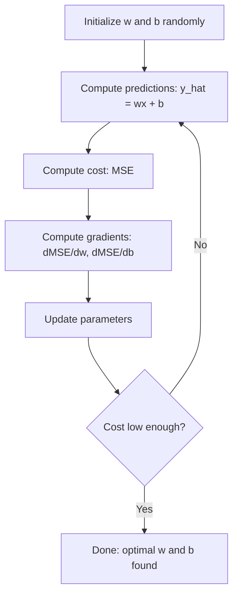

# Régrésion linéaire

> La régression linéaire trace la meilleure ligne dans vos données. C'est le monde de l'apprentissage automatique.

**Type:** Build
**Languages:** Python
**Prerequisites:** Phase 1 (Linear Algebra, Calculus, Optimization), Phase 2 Lesson 1
**Time:** ~90 minutes

## Objectif de l'apprentissage

- 推导 moyenne erreur carré de déclin gradient 更新规则,并从零 réaliser la régression linéaire
- Comparer la complexité du calcul et l'angle de l'application de la situation avec l'équation normale
- 构建带特性标准化的多线性回归模型,并解释学到的权重
-  Explication de la régression de la crête (régularisation de L2)  Comment par le biais de punition de poids plus grands pour éviter le surpassage

##  problématique

Vous avez un ensemble de données: la surface de la maison et son prix de livraison. Vous pensez en fonction de la surface prévue du prix de la nouvelle maison. Vous pouvez en faire une estimation sur le terrain de dispersion, mais vous avez besoin d'une formule.

La régression linéaire vous donnera cette ligne. Plus important encore, elle introduit un cycle de formation complet de ML: définir le modèle, définir la fonction de coût, optimiser les paramètres. Chaque algorithme de ML suit le même modèle.

Ceci n'est pas seulement applicable à de simples problèmes. La régression linéaire est utilisée dans les systèmes de production pour la prévision de la demande, l'analyse des tests A/B, la modélisation financière et est la base de chaque tâche de régression.

## 概念

### Modèle

Régrésion linéaire  présupposer qu'il existe une relation linéaire entre l'entrée (x) et la sortie (y):

```
y = wx + b
```

- `w`(poids/inclinaison): lorsque x augmenté 1 时, y 改变多少
- `b`(bias/intercept): lorsque x = 0 时,y 的值

Pour de nombreuses entrées (features), il s'étend à:

```
y = w1*x1 + w2*x2 + ... + wn*xn + b
```

Ou écrire en forme vectorielle:`y = w^T * x + b`

目標: trouver la valeur de w 和 b, faire prévoir de y dans tous les exemples de formation 上尽可能接近真实 y。

### Fonction de coût (erreur moyenne carré)

如何衡量尽可能接近? Vous avez besoin d'un seul chiffre pour indiquer la prédiction d'avoir plusieurs erreurs.

```
MSE = (1/n) * sum((y_predicted - y_actual)^2)
```

Pourquoi faut-il squadrée? Il y a deux raisons. Premièrement, il punit les gros défauts plus que les petits défauts.

La fonction de coût va former une courbe. Pour un seul poids w 和 bias b, le MSE 曲面 ressemble à un bol.

### Descent graduel

Gradient Descent, à travers des pas constants vers le bas, pour trouver le fond de la bouteille.



Les gradés vous diront deux choses: chaque paramètre devrait se déplacer dans quelle direction, et combien.

Pour les émissions de l'émission de l'année:

```
dMSE/dw = (2/n) * sum((y_hat - y) * x)
dMSE/db = (2/n) * sum(y_hat - y)
```

更新规则:

```
w = w - learning_rate * dMSE/dw
b = b - learning_rate * dMSE/db
```

Rate d'apprentissage 控制步长──太大:会越过最小值并发散──太小:training 会耗时很久──典型起始值: 0.01、0.001 或 0.0001──

### Équation normale (closed)

Special pour la régression linéaire, une formule directe peut donner les poids optimaux dans les cas sans aucun génération:

```
w = (X^T * X)^(-1) * X^T * y
```

Il est très adapté à un petit ensemble de données. Pour un grand ensemble de données, il est recommandé de faire une descente graduelle, car l'inversion de la matrice est une complexion numérique.

### Régrésion linéaire multiple

Pour de nombreuses caractéristiques, le modèle est transformé en:

```
y = w1*x1 + w2*x2 + ... + wn*xn + b
```

Toutes les méthodes de travail sont les mêmes: MSE est une fonction de coût, la descente de gradient, la même période de mise à jour de tous les poids. La seule différence est que vous êtes adapté à un hyperplane, et non à une ligne.

L'échelle des caractéristiques est très importante ici. Si une caractéristique est de 0 à 1, une autre est de 0 à 1,000,000, la baisse de la fréquence est difficile à obtenir, car la surface de coût va être plus longue.

### Régrésion polynomielle

Si la relation n'est pas linéaire, vous pouvez toujours créer des caractéristiques polynomielles en utilisant la régression linéaire:

```
y = w1*x + w2*x^2 + w3*x^3 + b
```

Ceci est toujours une régression linéaire, car le modèle des poids (w1, w2, w3) est linéaire.

Les polynômes de plus haut niveau peuvent s'adapter à des courbes plus complexes, mais aussi à des risques de sur-adaptation.

### R-quadrés

MSE  vous dit que vous avez beaucoup d'écran, mais ce chiffre dépend de la taille de y. R-quadré (R^2)  fournit un indicateur de mesure non dépendant de la taille:

```
R^2 = 1 - (sum of squared residuals) / (sum of squared deviations from mean)
    = 1 - SS_res / SS_tot
```

- R^2 = 1,0:完美预测
- R^2 = 0,0: modèle pas mieux que chaque fois
- R^2 < 0,0:modèle 比预测 moyenne 更差

### Régularisation 预览 (régrésion de la côte)

Lorsque vous avez beaucoup de caractéristiques, le modèle peut être distribué par des poids plus importants pour surcharger.

```
Cost = MSE + lambda * sum(w_i^2)
```

惩罚项会抑制较大的重量──hyperparameter lambda 控制权衡: lambda 越高,重量 越小,规范化 越强──后课程会深入讲解这一点──现在只需要知道它存在,以及为什么它有帮助──

## Construction

### étape 1: générer des données d'exemple

```python
import random
import math

random.seed(42)

TRUE_W = 3.0
TRUE_B = 7.0
N_SAMPLES = 100

X = [random.uniform(0, 10) for _ in range(N_SAMPLES)]
y = [TRUE_W * x + TRUE_B + random.gauss(0, 2.0) for x in X]

print(f"Generated {N_SAMPLES} samples")
print(f"True relationship: y = {TRUE_W}x + {TRUE_B} (+ noise)")
print(f"First 5 points: {[(round(X[i], 2), round(y[i], 2)) for i in range(5)]}")
```

### 步骤 2: utilisation de la descente graduelle de zéro pour réaliser la régression linéaire

```python
class LinearRegression:
    def __init__(self, learning_rate=0.01):
        self.w = 0.0
        self.b = 0.0
        self.lr = learning_rate
        self.cost_history = []

    def predict(self, X):
        return [self.w * x + self.b for x in X]

    def compute_cost(self, X, y):
        predictions = self.predict(X)
        n = len(y)
        cost = sum((pred - actual) ** 2 for pred, actual in zip(predictions, y)) / n
        return cost

    def compute_gradients(self, X, y):
        predictions = self.predict(X)
        n = len(y)
        dw = (2 / n) * sum((pred - actual) * x for pred, actual, x in zip(predictions, y, X))
        db = (2 / n) * sum(pred - actual for pred, actual in zip(predictions, y))
        return dw, db

    def fit(self, X, y, epochs=1000, print_every=200):
        for epoch in range(epochs):
            dw, db = self.compute_gradients(X, y)
            self.w -= self.lr * dw
            self.b -= self.lr * db
            cost = self.compute_cost(X, y)
            self.cost_history.append(cost)
            if epoch % print_every == 0:
                print(f"  Epoch {epoch:4d} | Cost: {cost:.4f} | w: {self.w:.4f} | b: {self.b:.4f}")
        return self

    def r_squared(self, X, y):
        predictions = self.predict(X)
        y_mean = sum(y) / len(y)
        ss_res = sum((actual - pred) ** 2 for actual, pred in zip(y, predictions))
        ss_tot = sum((actual - y_mean) ** 2 for actual in y)
        return 1 - (ss_res / ss_tot)


print("=== Training Linear Regression (Gradient Descent) ===")
model = LinearRegression(learning_rate=0.005)
model.fit(X, y, epochs=1000, print_every=200)
print(f"\nLearned: y = {model.w:.4f}x + {model.b:.4f}")
print(f"True:    y = {TRUE_W}x + {TRUE_B}")
print(f"R-squared: {model.r_squared(X, y):.4f}")
```

### 步骤 3: équation normale (closed)

```python
class LinearRegressionNormal:
    def __init__(self):
        self.w = 0.0
        self.b = 0.0

    def fit(self, X, y):
        n = len(X)
        x_mean = sum(X) / n
        y_mean = sum(y) / n
        numerator = sum((X[i] - x_mean) * (y[i] - y_mean) for i in range(n))
        denominator = sum((X[i] - x_mean) ** 2 for i in range(n))
        self.w = numerator / denominator
        self.b = y_mean - self.w * x_mean
        return self

    def predict(self, X):
        return [self.w * x + self.b for x in X]

    def r_squared(self, X, y):
        predictions = self.predict(X)
        y_mean = sum(y) / len(y)
        ss_res = sum((actual - pred) ** 2 for actual, pred in zip(y, predictions))
        ss_tot = sum((actual - y_mean) ** 2 for actual in y)
        return 1 - (ss_res / ss_tot)


print("\n=== Normal Equation (Closed-Form) ===")
model_normal = LinearRegressionNormal()
model_normal.fit(X, y)
print(f"Learned: y = {model_normal.w:.4f}x + {model_normal.b:.4f}")
print(f"R-squared: {model_normal.r_squared(X, y):.4f}")
```

### 步骤 4:Régression linéaire multiple

```python
class MultipleLinearRegression:
    def __init__(self, n_features, learning_rate=0.01):
        self.weights = [0.0] * n_features
        self.bias = 0.0
        self.lr = learning_rate
        self.cost_history = []

    def predict_single(self, x):
        return sum(w * xi for w, xi in zip(self.weights, x)) + self.bias

    def predict(self, X):
        return [self.predict_single(x) for x in X]

    def compute_cost(self, X, y):
        predictions = self.predict(X)
        n = len(y)
        return sum((pred - actual) ** 2 for pred, actual in zip(predictions, y)) / n

    def fit(self, X, y, epochs=1000, print_every=200):
        n = len(y)
        n_features = len(X[0])
        for epoch in range(epochs):
            predictions = self.predict(X)
            errors = [pred - actual for pred, actual in zip(predictions, y)]
            for j in range(n_features):
                grad = (2 / n) * sum(errors[i] * X[i][j] for i in range(n))
                self.weights[j] -= self.lr * grad
            grad_b = (2 / n) * sum(errors)
            self.bias -= self.lr * grad_b
            cost = self.compute_cost(X, y)
            self.cost_history.append(cost)
            if epoch % print_every == 0:
                print(f"  Epoch {epoch:4d} | Cost: {cost:.4f}")
        return self

    def r_squared(self, X, y):
        predictions = self.predict(X)
        y_mean = sum(y) / len(y)
        ss_res = sum((actual - pred) ** 2 for actual, pred in zip(y, predictions))
        ss_tot = sum((actual - y_mean) ** 2 for actual in y)
        return 1 - (ss_res / ss_tot)


random.seed(42)
N = 100
X_multi = []
y_multi = []
for _ in range(N):
    size = random.uniform(500, 3000)
    bedrooms = random.randint(1, 5)
    age = random.uniform(0, 50)
    price = 50 * size + 10000 * bedrooms - 1000 * age + 50000 + random.gauss(0, 20000)
    X_multi.append([size, bedrooms, age])
    y_multi.append(price)


def standardize(X):
    n_features = len(X[0])
    means = [sum(X[i][j] for i in range(len(X))) / len(X) for j in range(n_features)]
    stds = []
    for j in range(n_features):
        variance = sum((X[i][j] - means[j]) ** 2 for i in range(len(X))) / len(X)
        stds.append(variance ** 0.5)
    X_scaled = []
    for i in range(len(X)):
        row = [(X[i][j] - means[j]) / stds[j] if stds[j] > 0 else 0 for j in range(n_features)]
        X_scaled.append(row)
    return X_scaled, means, stds


y_mean_val = sum(y_multi) / len(y_multi)
y_std_val = (sum((yi - y_mean_val) ** 2 for yi in y_multi) / len(y_multi)) ** 0.5
y_scaled = [(yi - y_mean_val) / y_std_val for yi in y_multi]

X_scaled, x_means, x_stds = standardize(X_multi)

print("\n=== Multiple Linear Regression (3 features) ===")
print("Features: house size, bedrooms, age")
multi_model = MultipleLinearRegression(n_features=3, learning_rate=0.01)
multi_model.fit(X_scaled, y_scaled, epochs=1000, print_every=200)

print(f"\nWeights (standardized): {[round(w, 4) for w in multi_model.weights]}")
print(f"Bias (standardized): {multi_model.bias:.4f}")
print(f"R-squared: {multi_model.r_squared(X_scaled, y_scaled):.4f}")
```

### 步骤 5: Régrésion polynomielle

```python
class PolynomialRegression:
    def __init__(self, degree, learning_rate=0.01):
        self.degree = degree
        self.weights = [0.0] * degree
        self.bias = 0.0
        self.lr = learning_rate

    def make_features(self, X):
        return [[x ** (d + 1) for d in range(self.degree)] for x in X]

    def predict(self, X):
        features = self.make_features(X)
        return [sum(w * f for w, f in zip(self.weights, row)) + self.bias for row in features]

    def fit(self, X, y, epochs=1000, print_every=200):
        features = self.make_features(X)
        n = len(y)
        for epoch in range(epochs):
            predictions = [sum(w * f for w, f in zip(self.weights, row)) + self.bias for row in features]
            errors = [pred - actual for pred, actual in zip(predictions, y)]
            for j in range(self.degree):
                grad = (2 / n) * sum(errors[i] * features[i][j] for i in range(n))
                self.weights[j] -= self.lr * grad
            grad_b = (2 / n) * sum(errors)
            self.bias -= self.lr * grad_b
            if epoch % print_every == 0:
                cost = sum(e ** 2 for e in errors) / n
                print(f"  Epoch {epoch:4d} | Cost: {cost:.6f}")
        return self

    def r_squared(self, X, y):
        predictions = self.predict(X)
        y_mean = sum(y) / len(y)
        ss_res = sum((actual - pred) ** 2 for actual, pred in zip(y, predictions))
        ss_tot = sum((actual - y_mean) ** 2 for actual in y)
        return 1 - (ss_res / ss_tot)


random.seed(42)
X_poly = [x / 10.0 for x in range(0, 50)]
y_poly = [0.5 * x ** 2 - 2 * x + 3 + random.gauss(0, 1.0) for x in X_poly]

x_max = max(abs(x) for x in X_poly)
X_poly_norm = [x / x_max for x in X_poly]
y_poly_mean = sum(y_poly) / len(y_poly)
y_poly_std = (sum((yi - y_poly_mean) ** 2 for yi in y_poly) / len(y_poly)) ** 0.5
y_poly_norm = [(yi - y_poly_mean) / y_poly_std for yi in y_poly]

print("\n=== Polynomial Regression (degree 2 vs degree 5) ===")
print("True relationship: y = 0.5x^2 - 2x + 3")

print("\nDegree 2:")
poly2 = PolynomialRegression(degree=2, learning_rate=0.1)
poly2.fit(X_poly_norm, y_poly_norm, epochs=2000, print_every=500)
print(f"  R-squared: {poly2.r_squared(X_poly_norm, y_poly_norm):.4f}")

print("\nDegree 5:")
poly5 = PolynomialRegression(degree=5, learning_rate=0.1)
poly5.fit(X_poly_norm, y_poly_norm, epochs=2000, print_every=500)
print(f"  R-squared: {poly5.r_squared(X_poly_norm, y_poly_norm):.4f}")

print("\nDegree 2 fits the true curve well. Degree 5 fits training data slightly better")
print("but risks overfitting on new data.")
```

### 步骤 6: régression de la montée (régularisation de l2)

```python
class RidgeRegression:
    def __init__(self, n_features, learning_rate=0.01, alpha=1.0):
        self.weights = [0.0] * n_features
        self.bias = 0.0
        self.lr = learning_rate
        self.alpha = alpha

    def predict_single(self, x):
        return sum(w * xi for w, xi in zip(self.weights, x)) + self.bias

    def predict(self, X):
        return [self.predict_single(x) for x in X]

    def fit(self, X, y, epochs=1000, print_every=200):
        n = len(y)
        n_features = len(X[0])
        for epoch in range(epochs):
            predictions = self.predict(X)
            errors = [pred - actual for pred, actual in zip(predictions, y)]
            mse = sum(e ** 2 for e in errors) / n
            reg_term = self.alpha * sum(w ** 2 for w in self.weights)
            cost = mse + reg_term
            for j in range(n_features):
                grad = (2 / n) * sum(errors[i] * X[i][j] for i in range(n))
                grad += 2 * self.alpha * self.weights[j]
                self.weights[j] -= self.lr * grad
            grad_b = (2 / n) * sum(errors)
            self.bias -= self.lr * grad_b
            if epoch % print_every == 0:
                print(f"  Epoch {epoch:4d} | Cost: {cost:.4f} | L2 penalty: {reg_term:.4f}")
        return self


print("\n=== Ridge Regression (L2 Regularization) ===")
print("Same data as multiple regression, with alpha=0.1")
ridge = RidgeRegression(n_features=3, learning_rate=0.01, alpha=0.1)
ridge.fit(X_scaled, y_scaled, epochs=1000, print_every=200)
print(f"\nRidge weights: {[round(w, 4) for w in ridge.weights]}")
print(f"Plain weights: {[round(w, 4) for w in multi_model.weights]}")
print("Ridge weights are smaller (shrunk toward zero) due to the L2 penalty.")
```


```figure
linear-regression-fit
```

## Utilisez-le

Maintenant, avec un petit apprentissage, faites la même chose, c'est la façon dont vous l'utiliserez en production.

```python
from sklearn.linear_model import LinearRegression as SklearnLR
from sklearn.linear_model import Ridge
from sklearn.preprocessing import PolynomialFeatures, StandardScaler
from sklearn.model_selection import train_test_split
from sklearn.metrics import mean_squared_error, r2_score
import numpy as np

np.random.seed(42)
X_sk = np.random.uniform(0, 10, (100, 1))
y_sk = 3.0 * X_sk.squeeze() + 7.0 + np.random.normal(0, 2.0, 100)

X_train, X_test, y_train, y_test = train_test_split(X_sk, y_sk, test_size=0.2, random_state=42)

lr = SklearnLR()
lr.fit(X_train, y_train)
y_pred = lr.predict(X_test)

print("=== Scikit-learn Linear Regression ===")
print(f"Coefficient (w): {lr.coef_[0]:.4f}")
print(f"Intercept (b): {lr.intercept_:.4f}")
print(f"R-squared (test): {r2_score(y_test, y_pred):.4f}")
print(f"MSE (test): {mean_squared_error(y_test, y_pred):.4f}")

poly = PolynomialFeatures(degree=2, include_bias=False)
X_poly_sk = poly.fit_transform(X_train)
X_poly_test = poly.transform(X_test)

lr_poly = SklearnLR()
lr_poly.fit(X_poly_sk, y_train)
print(f"\nPolynomial degree 2 R-squared: {r2_score(y_test, lr_poly.predict(X_poly_test)):.4f}")

scaler = StandardScaler()
X_train_scaled = scaler.fit_transform(X_train)
X_test_scaled = scaler.transform(X_test)

ridge = Ridge(alpha=1.0)
ridge.fit(X_train_scaled, y_train)
print(f"Ridge R-squared: {r2_score(y_test, ridge.predict(X_test_scaled)):.4f}")
print(f"Ridge coefficient: {ridge.coef_[0]:.4f}")
```

Vous êtes en train de réaliser et de commencer à apprendre à partir de zéro, vous obtiendrez les mêmes résultats.

## 交付

Le cours est ouvert à:
- `outputs/skill-regression.md`- une compétence, utilisée pour choisir la régression adaptée selon le problème

## 练习

1. 实现 batch gradient descent, stochastic gradient descent (SGD) et mini-batch gradient descent, dans le même ensemble de données, comparer la vitesse de réception à la même vitesse.
2. De la fonction cube (y = ax^3 + bx^2 + cx + d + bruit) 生成数据──拟合度 1、3 和 10 的多項式──比较训练 R^2 和测试 R^2──到哪个度时过匹配 变得明显?
3. 实现 Lasso regression(L1 régulation: pénalité * alpha sum *(((((((((((((((((((((((((((((((((((((((((((((((((((((((((((((((((((((((((((((((((((((((((((((((((((((((((((((((((((((((((((((((((((((((((((((((((((((((((((((((((((((((((((((((((((((((((((((((((((((((((((((((((((((((((((((((((((((((((((((((((((((((((((((((((((((((((((((((((((((((((((((((((((((((((((((((((((((((((((((((((((((((((((((((((((((((((((((((((((((((((((((((((((((((((((((((((((((((((((((((((((((((((((((((((((((((((((((((((((((((((((((((((((((((((((((((((((((((((((((((((((((((((((

## 关键术语

| Term | 人们常说 | 实际含义 |
|------|----------------|----------------------|
| Linear regression | “在数据中画一条线” | 找到 weight w 和 bias b，使 wx+b 与真实 y 值之间的平方差之和最小 |
| Cost function | “model 有多差” | 一个将 model parameters 映射为单一数字的函数，用于衡量 prediction error，并由 optimization 最小化 |
| Mean squared error | “平方误差的平均值” | (1/n) * (predicted - actual)^2 的求和，对大误差施加不成比例的惩罚 |
| Gradient descent | “往下坡走” | 使用偏导数，沿着降低 cost function 的方向迭代调整 parameters |
| Learning rate | “步长” | 控制每一步 Gradient Descent 中 parameters 改变量的标量 |
| Normal equation | “直接求解” | 闭式解 w = (X^T X)^-1 X^T y，无需迭代即可得到最优 weights |
| R-squared | “拟合有多好” | model 所解释的 y 方差比例，范围从负无穷到 1.0 |
| Feature scaling | “让 features 可比较” | 将 features 转换到相近范围（例如 zero mean、unit variance），使 Gradient Descent 更快收敛 |
| Regularization | “惩罚复杂度” | 向 cost function 添加一个会缩小 weights 的项，以防止 overfitting |
| Ridge regression | “L2 regularization” | 向 MSE 添加 lambda * sum(w_i^2) 惩罚项的 linear regression |
| Polynomial regression | “用线性数学拟合曲线” | 对 polynomial features (x, x^2, x^3, ...) 做 linear regression，对 weights 仍然是线性的 |
| Overfitting | “记住 training data” | 使用过于复杂的 model，以至于拟合了 training data 中的噪声，并在新数据上失效 |

## 延伸阅读

- [An Introduction to Statistical Learning (ISLR)](https://www.statlearning.com/)-- 免费 PDF, chapitre 3 et chapitre 6 couvrent la régression linéaire et la régularisation, et contiennent des exemples pratiques de R
- [The Elements of Statistical Learning (ESL)](https://hastie.su.domains/ElemStatLearn/)- 免费 PDF, est ISLR plus préférentiel mathématique, pour la crête et les lasso
- [Stanford CS229 Lecture Notes on Linear Regression](https://cs229.stanford.edu/main_notes.pdf)-- Andrew Ng's notes, du principe de la première nature à l'équation normale et à la descente gradiente
- [scikit-learn LinearRegression documentation](https://scikit-learn.org/stable/modules/linear_model.html)-- Régrésion linéaire, Ridge, Lasso et ElasticNet, contenant des exemples de code
