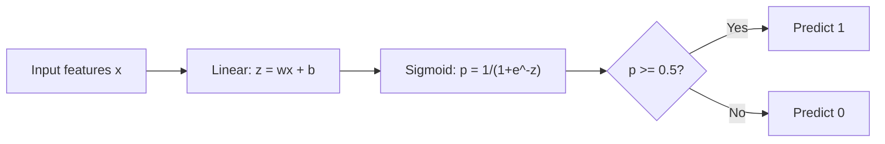
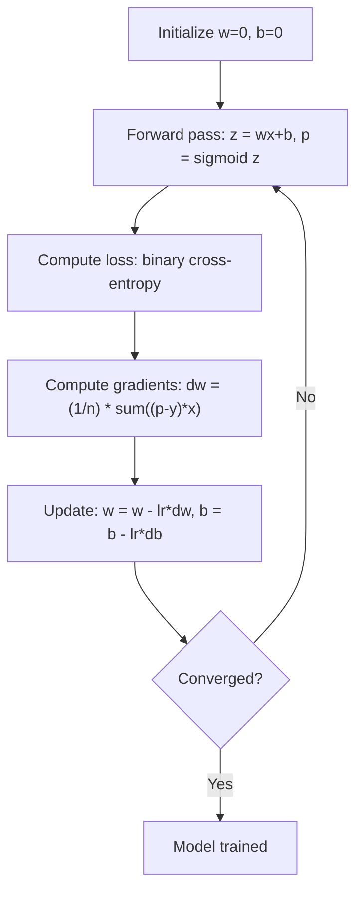

# Régré­sion logistique

> La régression logistique se transforme en une courbe S, avec la probabilité de répondre à la question "ou non".

**类型：**Construire
**语言：**Python
**先修要求：**Phase 2 Leçon 1-2 (Qu'est-ce que le ML, régression linéaire)
**时间：**À environ 90 minutes.

## Objectif de l'apprentissage

- Utilisation de la fonction sigmoïde 和 perte de l'entropie croisée binaire de zéro réaliser la régression logistique
- 計算并解释二进制分类 中的精度、回忆、F1 score 和混矩阵
- Expliquer pourquoi les émissions de masse ne sont pas adaptées à la classification, ainsi que pourquoi l'entropie binaire croisée générera une surface de coûts convexe
- Construire un modèle de régression de softmax de classification multi-classe,并 évaluer le seuil de réglage de la balance

##  problématique

Vous pensez que selon le nombre de tumeurs, il est maligne ou bénigne. Vous essayez d'utiliser une régression linéaire. Il en sortira 0.3 ‒ 1.7 ‒ 0.5 ‒ 0.5 ‒ 0.7 ‒ très maligne ‒ 0.5 ‒ très bénigne ‒ ‒ ‒ ‒ ‒ ‒ ‒ ‒ ‒ ‒ ‒ ‒ ‒ ‒ ‒ ‒ ‒ ‒ ‒ ‒ ‒ ‒ ‒ ‒ ‒ ‒ ‒ ‒ ‒ ‒ ‒ ‒ ‒ ‒ ‒ ‒ ‒ ‒ ‒ ‒ ‒ ‒ ‒ ‒ ‒ ‒ ‒ ‒ ‒ ‒ ‒ ‒ ‒ ‒ ‒ ‒ ‒ ‒ ‒ ‒ ‒ ‒ ‒ ‒ ‒ ‒ ‒ ‒ ‒ ‒ ‒ ‒ ‒ ‒ ‒ ‒ ‒ ‒ ‒ ‒ ‒ ‒ ‒ ‒ ‒ ‒ ‒ ‒ ‒ ‒ ‒ ‒ ‒ ‒ ‒ ‒ ‒ ‒ ‒ ‒ ‒ ‒ ‒ ‒ ‒ ‒ ‒ ‒ ‒ ‒ ‒ ‒ ‒ ‒ ‒ ‒ ‒ ‒ ‒ ‒ ‒ ‒ ‒ ‒ ‒ ‒ ‒ ‒ ‒ ‒ ‒ ‒ ‒ ‒ ‒ ‒ ‒ ‒ ‒ ‒ ‒ ‒ ‒ ‒ ‒ ‒ ‒ ‒ ‒ ‒ ‒ ‒ ‒ ‒ ‒ ‒ ‒ ‒ ‒ ‒ ‒ ‒ ‒ ‒ ‒ ‒ ‒ ‒ ‒ ‒ ‒ ‒ ‒ ‒ ‒ ‒ ‒ ‒ ‒ ‒ ‒ ‒ ‒ ‒ ‒ ‒ ‒ ‒ ‒ ‒ ‒ ‒ ‒ ‒ ‒ ‒ ‒ ‒ ‒ ‒ ‒ ‒ ‒ ‒ ‒ ‒ ‒ ‒ ‒ ‒ ‒ ‒ ‒ ‒ ‒ ‒ ‒ ‒ ‒ ‒ ‒ 

La régression logistique résolve ce problème. Elle utilise le même composé de lignes (wx + b), puis, par la fonction sigmoïde, elle se concentre sur (0, 1) 范围内.

C'est l'un des algorithmes les plus largement utilisés en pratique. Bien qu'il existe une régression, la régression logistique est un algorithme de classification, et non un algorithme de régression.

## 核心概念

### Pourquoi la régression linéaire ne convient pas à la classification

假设根据学习时长预测通过/未通过(1/0)。Régression linéaire 会拟合一条穿越数据的直线:

```
hours:  1   2   3   4   5   6   7   8   9   10
actual: 0   0   0   0   1   1   1   1   1   1
```

Les valeurs de l'équation de ligne peuvent être -0,2 à la première heure, et 1,3 à la deuxième heure. Ces valeurs ne sont pas des probabilités. Elles sont inférieures à 0, ou plus élevées à 1.

Classification  nécessite une fonction pour satisfaire les conditions suivantes:
- 输出 0 à 1  之间的 valeur (概率)
- 产生清晰的转变 (limitation de la décision)
- Il ne sera pas éloigné de la frontière

### Fonction sigmoïde

La fonction sigmoïde est exactement la même:

```
sigmoid(z) = 1 / (1 + e^(-z))
```

Sexualité:
- Quand z est un grand nombre, c'est un peu plus proche de 1.
- Quand z est un grand nombre négatif,sigmoid(z)  approchant 0
- Quand z = 0 时,sigmoid(z) = 0,5
- 输出始终位于 entre 0 et 1 
- La fonction est simple et facile à utiliser

Il est dérivé de la formule suivante:sigmoid'(z) = sigmoid(z) * (1 - sigmoid(z))

### Régrésion logistique = modèle linéaire + sigmoïde

模型先计算 z = wx + b(= avec régression linéaire 相同), puis appliquer sigmoïde:



输出 p est expliqué comme P(y=1 ∈ x), c'est-à-dire que l'entrée appartient à la classe 1 ∈ X. La limite de décision se trouve à l'emplacement de wx + b = 0, alors que le sigmoïde 输出恰好为0.5 ∈ X.

### Perte de l'entropie croisée binaire

Il existe de nombreux minimums locaux. Il faut utiliser la double entropie croisée (log loss):

```
Loss = -(1/n) * sum(y * log(p) + (1-y) * log(1-p))
```

Pourquoi est-ce que ça marche ?
- Lorsque y = 1 et p 接近 1 时:log(1) = 0, donc la perte 接近 0(正确,低成本)
- Lorsque y = 1 et p 接近 0 时:log(0) 接近负无穷, donc la perte 很大(错误,高成本)
- Lorsque y = 0 et p 接近 0 时:log(1) = 0, donc la perte 接近 0(正确,低成本)
- Lorsque y = 0 et p 接近 1 时:log(0) 接近负无穷, donc la perte 很大(错误,高成本)

Pour la régression logistique, cette fonction de perte est concave, ce qui garantit qu'il n'y a qu'un minimum mondial.

### Réduction progressive de la logistique

sigmoïde 搭配 en entropie croisée binaire 时,Gradient 具有简洁形式:

```
dL/dw = (1/n) * sum((p - y) * x)
dL/db = (1/n) * sum(p - y)
```

Le gradient de régression linéaire est complètement le même. La différence se trouve dans le p = sigmoïde (wx + b), plutôt que dans le p = wx + b. Le sigmoïde est introduit en non linéaire, mais le gradient est un nouveau règlement.



### Limite de décision

Pour les deux caractéristiques, la limite de décision est de satisfaire les conditions suivantes:

```
w1*x1 + w2*x2 + b = 0
```

Un côté de point est classé pour 1, l'autre côté de point est classé pour 0――régrésion logique 总是产生线性决定界面――如果需要曲的界限,要么添加多项的特征,要么使用非线性模型――

### Utilisation Softmax  effectuer une classification multi-classe

Régression logistique binaire  traitement de deux classes。 Pour les classes k 个, utilisez la fonction softmax:

```
softmax(z_i) = e^(z_i) / sum(e^(z_j) for all j)
```

Chaque classe a son propre vecteur de poids. Le modèle pour chaque classe compte un score z_i, puis le softmax va transformer les scores en probabilité totale et pour 1 . La classe de prédiction est la classe la plus probable.

La fonction de perte 变为 entropie croisée catégorique:

```
Loss = -(1/n) * sum(sum(y_k * log(p_k)))
```

Parmi eux y_k pour la vraie classe 为 1, pour toutes les autres classes 为 0(une codage chaude)

### Les mesures d'évaluation

Dans le seul ordre d'exactitude insuffisant, un modèle de 95% négatif 5% positif peut obtenir 95% d'exactitude, mais sans aucun intérêt.

**Confusion Matrix**- Le numéro de la liste:

| | Predicted Positive | Predicted Negative |
|---|---|---|
| Actually Positive | True Positive (TP) | False Negative (FN) |
| Actually Negative | False Positive (FP) | True Negative (TN) |

**Precision**: parmi tous les exemples de prévisions positives, combien sont réellement positives ?
```
Precision = TP / (TP + FP)
```

**Recall**(Sensibilité): Parmi tous les exemples positifs, combien avons-nous pris ?
```
Recall = TP / (TP + FN)
```

**F1 Score**: précision 和 rappel de la moyenne harmonieuse──équilibre deux mesures──
```
F1 = 2 * (Precision * Recall) / (Precision + Recall)
```

 priorité:
- **Precision**: lorsque les faux positifs 代价高时(filtre de spam, tu ne veux pas bloquer le courrier électronique légitime)
- **Recall**Quand les faux négatifs sont en cours, vous ne voulez pas perdre la tumeur.
- **F1**: quand vous avez besoin d'un équilibre de la seule métrique


```figure
logistic-sigmoid
```

## - Je le construis.

### 步骤 1: Fonction sigmoïde et génération de données

```python
import random
import math

def sigmoid(z):
    z = max(-500, min(500, z))
    return 1.0 / (1.0 + math.exp(-z))


random.seed(42)
N = 200
X = []
y = []

for _ in range(N // 2):
    X.append([random.gauss(2, 1), random.gauss(2, 1)])
    y.append(0)

for _ in range(N // 2):
    X.append([random.gauss(5, 1), random.gauss(5, 1)])
    y.append(1)

combined = list(zip(X, y))
random.shuffle(combined)
X, y = zip(*combined)
X = list(X)
y = list(y)

print(f"Generated {N} samples (2 classes, 2 features)")
print(f"Class 0 center: (2, 2), Class 1 center: (5, 5)")
print(f"First 5 samples:")
for i in range(5):
    print(f"  Features: [{X[i][0]:.2f}, {X[i][1]:.2f}], Label: {y[i]}")
```

### 步骤 2: réaliser la régression logistique à partir de zéro

```python
class LogisticRegression:
    def __init__(self, n_features, learning_rate=0.01):
        self.weights = [0.0] * n_features
        self.bias = 0.0
        self.lr = learning_rate
        self.loss_history = []

    def predict_proba(self, x):
        z = sum(w * xi for w, xi in zip(self.weights, x)) + self.bias
        return sigmoid(z)

    def predict(self, x, threshold=0.5):
        return 1 if self.predict_proba(x) >= threshold else 0

    def compute_loss(self, X, y):
        n = len(y)
        total = 0.0
        for i in range(n):
            p = self.predict_proba(X[i])
            p = max(1e-15, min(1 - 1e-15, p))
            total += y[i] * math.log(p) + (1 - y[i]) * math.log(1 - p)
        return -total / n

    def fit(self, X, y, epochs=1000, print_every=200):
        n = len(y)
        n_features = len(X[0])
        for epoch in range(epochs):
            dw = [0.0] * n_features
            db = 0.0
            for i in range(n):
                p = self.predict_proba(X[i])
                error = p - y[i]
                for j in range(n_features):
                    dw[j] += error * X[i][j]
                db += error
            for j in range(n_features):
                self.weights[j] -= self.lr * (dw[j] / n)
            self.bias -= self.lr * (db / n)
            loss = self.compute_loss(X, y)
            self.loss_history.append(loss)
            if epoch % print_every == 0:
                print(f"  Epoch {epoch:4d} | Loss: {loss:.4f} | w: [{self.weights[0]:.3f}, {self.weights[1]:.3f}] | b: {self.bias:.3f}")
        return self

    def accuracy(self, X, y):
        correct = sum(1 for i in range(len(y)) if self.predict(X[i]) == y[i])
        return correct / len(y)


split = int(0.8 * N)
X_train, X_test = X[:split], X[split:]
y_train, y_test = y[:split], y[split:]

print("\n=== Training Logistic Regression ===")
model = LogisticRegression(n_features=2, learning_rate=0.1)
model.fit(X_train, y_train, epochs=1000, print_every=200)

print(f"\nTrain accuracy: {model.accuracy(X_train, y_train):.4f}")
print(f"Test accuracy:  {model.accuracy(X_test, y_test):.4f}")
print(f"Weights: [{model.weights[0]:.4f}, {model.weights[1]:.4f}]")
print(f"Bias: {model.bias:.4f}")
```

### Étape 3: De zéro à réaliser la confusion matrice et les métriques

```python
class ClassificationMetrics:
    def __init__(self, y_true, y_pred):
        self.tp = sum(1 for t, p in zip(y_true, y_pred) if t == 1 and p == 1)
        self.tn = sum(1 for t, p in zip(y_true, y_pred) if t == 0 and p == 0)
        self.fp = sum(1 for t, p in zip(y_true, y_pred) if t == 0 and p == 1)
        self.fn = sum(1 for t, p in zip(y_true, y_pred) if t == 1 and p == 0)

    def accuracy(self):
        total = self.tp + self.tn + self.fp + self.fn
        return (self.tp + self.tn) / total if total > 0 else 0

    def precision(self):
        denom = self.tp + self.fp
        return self.tp / denom if denom > 0 else 0

    def recall(self):
        denom = self.tp + self.fn
        return self.tp / denom if denom > 0 else 0

    def f1(self):
        p = self.precision()
        r = self.recall()
        return 2 * p * r / (p + r) if (p + r) > 0 else 0

    def print_confusion_matrix(self):
        print(f"\n  Confusion Matrix:")
        print(f"                  Predicted")
        print(f"                  Pos   Neg")
        print(f"  Actual Pos     {self.tp:4d}  {self.fn:4d}")
        print(f"  Actual Neg     {self.fp:4d}  {self.tn:4d}")

    def print_report(self):
        self.print_confusion_matrix()
        print(f"\n  Accuracy:  {self.accuracy():.4f}")
        print(f"  Precision: {self.precision():.4f}")
        print(f"  Recall:    {self.recall():.4f}")
        print(f"  F1 Score:  {self.f1():.4f}")


y_pred_test = [model.predict(x) for x in X_test]
print("\n=== Classification Report (Test Set) ===")
metrics = ClassificationMetrics(y_test, y_pred_test)
metrics.print_report()
```

### 步骤 4: Limite de décision  analyse

```python
print("\n=== Decision Boundary ===")
w1, w2 = model.weights
b = model.bias
print(f"Decision boundary: {w1:.4f}*x1 + {w2:.4f}*x2 + {b:.4f} = 0")
if abs(w2) > 1e-10:
    print(f"Solved for x2:     x2 = {-w1/w2:.4f}*x1 + {-b/w2:.4f}")

print("\nSample predictions near the boundary:")
test_points = [
    [3.0, 3.0],
    [3.5, 3.5],
    [4.0, 4.0],
    [2.5, 2.5],
    [5.0, 5.0],
]
for point in test_points:
    prob = model.predict_proba(point)
    pred = model.predict(point)
    print(f"  [{point[0]}, {point[1]}] -> prob={prob:.4f}, class={pred}")
```

### 步骤 5: Utiliser softmax  traitement multi-classe

```python
class SoftmaxRegression:
    def __init__(self, n_features, n_classes, learning_rate=0.01):
        self.n_features = n_features
        self.n_classes = n_classes
        self.lr = learning_rate
        self.weights = [[0.0] * n_features for _ in range(n_classes)]
        self.biases = [0.0] * n_classes

    def softmax(self, scores):
        max_score = max(scores)
        exp_scores = [math.exp(s - max_score) for s in scores]
        total = sum(exp_scores)
        return [e / total for e in exp_scores]

    def predict_proba(self, x):
        scores = [
            sum(self.weights[k][j] * x[j] for j in range(self.n_features)) + self.biases[k]
            for k in range(self.n_classes)
        ]
        return self.softmax(scores)

    def predict(self, x):
        probs = self.predict_proba(x)
        return probs.index(max(probs))

    def fit(self, X, y, epochs=1000, print_every=200):
        n = len(y)
        for epoch in range(epochs):
            grad_w = [[0.0] * self.n_features for _ in range(self.n_classes)]
            grad_b = [0.0] * self.n_classes
            total_loss = 0.0
            for i in range(n):
                probs = self.predict_proba(X[i])
                for k in range(self.n_classes):
                    target = 1.0 if y[i] == k else 0.0
                    error = probs[k] - target
                    for j in range(self.n_features):
                        grad_w[k][j] += error * X[i][j]
                    grad_b[k] += error
                true_prob = max(probs[y[i]], 1e-15)
                total_loss -= math.log(true_prob)
            for k in range(self.n_classes):
                for j in range(self.n_features):
                    self.weights[k][j] -= self.lr * (grad_w[k][j] / n)
                self.biases[k] -= self.lr * (grad_b[k] / n)
            if epoch % print_every == 0:
                print(f"  Epoch {epoch:4d} | Loss: {total_loss / n:.4f}")
        return self

    def accuracy(self, X, y):
        correct = sum(1 for i in range(len(y)) if self.predict(X[i]) == y[i])
        return correct / len(y)


random.seed(42)
X_3class = []
y_3class = []

centers = [(1, 1), (5, 1), (3, 5)]
for label, (cx, cy) in enumerate(centers):
    for _ in range(50):
        X_3class.append([random.gauss(cx, 0.8), random.gauss(cy, 0.8)])
        y_3class.append(label)

combined = list(zip(X_3class, y_3class))
random.shuffle(combined)
X_3class, y_3class = zip(*combined)
X_3class = list(X_3class)
y_3class = list(y_3class)

split_3 = int(0.8 * len(X_3class))
X_train_3 = X_3class[:split_3]
y_train_3 = y_3class[:split_3]
X_test_3 = X_3class[split_3:]
y_test_3 = y_3class[split_3:]

print("\n=== Multi-class Softmax Regression (3 classes) ===")
softmax_model = SoftmaxRegression(n_features=2, n_classes=3, learning_rate=0.1)
softmax_model.fit(X_train_3, y_train_3, epochs=1000, print_every=200)
print(f"\nTrain accuracy: {softmax_model.accuracy(X_train_3, y_train_3):.4f}")
print(f"Test accuracy:  {softmax_model.accuracy(X_test_3, y_test_3):.4f}")

print("\nSample predictions:")
for i in range(5):
    probs = softmax_model.predict_proba(X_test_3[i])
    pred = softmax_model.predict(X_test_3[i])
    print(f"  True: {y_test_3[i]}, Predicted: {pred}, Probs: [{', '.join(f'{p:.3f}' for p in probs)}]")
```

### 步骤 6: réglage du seuil

```python
print("\n=== Threshold Tuning ===")
print("Default threshold: 0.5. Adjusting the threshold trades precision for recall.\n")

thresholds = [0.3, 0.4, 0.5, 0.6, 0.7]
print(f"{'Threshold':>10} {'Accuracy':>10} {'Precision':>10} {'Recall':>10} {'F1':>10}")
print("-" * 52)

for t in thresholds:
    y_pred_t = [1 if model.predict_proba(x) >= t else 0 for x in X_test]
    m = ClassificationMetrics(y_test, y_pred_t)
    print(f"{t:>10.1f} {m.accuracy():>10.4f} {m.precision():>10.4f} {m.recall():>10.4f} {m.f1():>10.4f}")
```

## Utilisez-le

Maintenant, apprends à faire la même chose avec un petit doigt.

```python
from sklearn.linear_model import LogisticRegression as SklearnLR
from sklearn.metrics import accuracy_score, precision_score, recall_score, f1_score
from sklearn.metrics import confusion_matrix, classification_report
from sklearn.model_selection import train_test_split
from sklearn.preprocessing import StandardScaler
import numpy as np

np.random.seed(42)
X_0 = np.random.randn(100, 2) + [2, 2]
X_1 = np.random.randn(100, 2) + [5, 5]
X_sk = np.vstack([X_0, X_1])
y_sk = np.array([0] * 100 + [1] * 100)

X_tr, X_te, y_tr, y_te = train_test_split(X_sk, y_sk, test_size=0.2, random_state=42)

scaler = StandardScaler()
X_tr_sc = scaler.fit_transform(X_tr)
X_te_sc = scaler.transform(X_te)

lr = SklearnLR()
lr.fit(X_tr_sc, y_tr)
y_pred = lr.predict(X_te_sc)

print("=== Scikit-learn Logistic Regression ===")
print(f"Accuracy:  {accuracy_score(y_te, y_pred):.4f}")
print(f"Precision: {precision_score(y_te, y_pred):.4f}")
print(f"Recall:    {recall_score(y_te, y_pred):.4f}")
print(f"F1:        {f1_score(y_te, y_pred):.4f}")
print(f"\nConfusion Matrix:\n{confusion_matrix(y_te, y_pred)}")
print(f"\nClassification Report:\n{classification_report(y_te, y_pred)}")
```

Vous avez réalisé à partir de zéro produire la même limite de décision et les mesures.

## Je le livre.

Le cours est ouvert à:
- `code/logistic_regression.py`- Régrésion logistique réalisée à partir de zéro, contenant des mesures

## 练习

1. 生成一个不是线性分离的数据集 (例如两个同心圆) ――训练物流回归并观察它的失败――然后添加多项式特征(x1^2、x2^2、x1*x2)并再次训练――展示精度 得到提升──
2. Pour le modèle softmax de 3 classes  réaliser une matrice de confusion multi-classe ⋅ calcul par classe de précision 和 rappel ⋅ Quelle classe la plus difficile à classer ?
3. De la conception de la courbe ROC à partir de zéro, les valeurs de 100 seuils entre 0 et 1 sont calculées selon le taux positif vrai et le taux faux positif.

## 关键术语

| Term | 人们常说 | 实际含义 |
|------|----------------|----------------------|
| Logistic regression | “用于 Classification 的 Regression” | 一个 linear model 后接 sigmoid function，用于输出 class probabilities |
| Sigmoid function | “S-curve” | function 1/(1+e^(-z))，将任意实数映射到 (0, 1) 范围 |
| Binary cross-entropy | “Log loss” | Loss Function -[y*log(p) + (1-y)*log(1-p)]，会严厉惩罚自信但错误的预测 |
| Decision boundary | “分界线” | 模型输出概率等于 0.5 的 surface，用于分隔 predicted classes |
| Softmax | “Multi-class sigmoid” | 将 scores 的 Vector 转换为总和为 1 的概率的 function |
| Precision | “选中的有多少是相关的” | TP / (TP + FP)，positive predictions 中实际为 positive 的比例 |
| Recall | “相关的有多少被选中” | TP / (TP + FN)，actual positives 中被模型正确识别的比例 |
| F1 score | “平衡 Accuracy” | precision 和 recall 的 harmonic mean：2*P*R / (P+R) |
| Confusion matrix | “错误分解” | 展示每个 class pair 的 TP、TN、FP、FN 计数的表格 |
| Threshold | “cutoff” | 超过该 probability value 时模型预测 class 1（默认 0.5，可调） |
| One-hot encoding | “类别的二进制列” | 将 class k 表示为一个 Vector：除位置 k 为 1 外，其余位置均为 0 |
| Categorical cross-entropy | “Multi-class log loss” | binary cross-entropy 到 k 个 classes 的扩展，使用 one-hot encoded labels |
