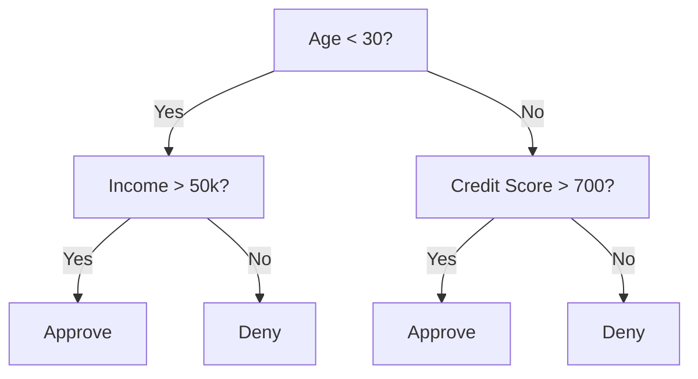
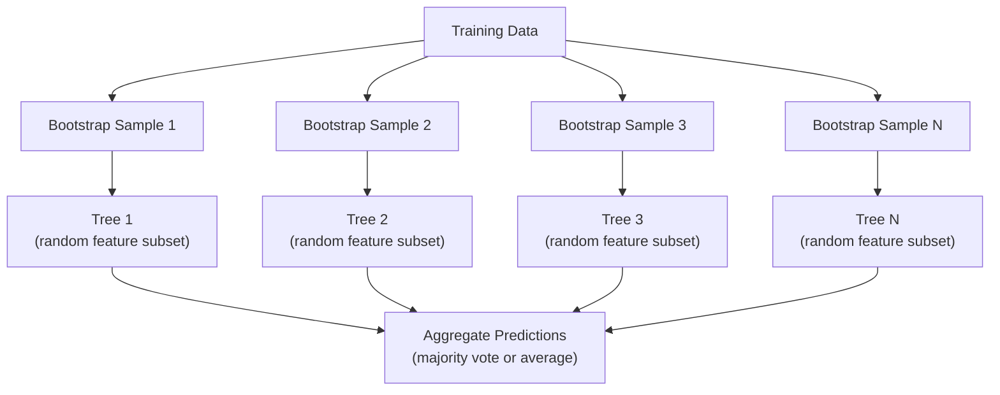

# Les arbres décisionnels et les forêts aléatoires

> L'arbre de décision n'est qu'un schéma de processus. Mais la forêt composée de nombreux arbres est l'un des outils les plus puissants de l'AM.

**类型：**Construire
**语言：**Python
**先修要求：**Phase 1 ((Léctions 09 Théorie de l'information, 06 Probabilité)
**时间：**À environ 90 minutes.

## Objectif de l'apprentissage

- atteindre l'impureté Gini ∞ entropie ∞ information gain ∞ calcul, pour trouver la meilleure division de l'arbre de décision
- De零 construire un classifiateur d'arbre de décision,并加入 pré-pruning 控制(max depth、min échantillons)
- Utiliser le prélèvement de démarrage et la fonctionnalité de randomisation  Construire une forêt aléatoire,并解释为什么它能降低变异
- Comparer l'importance des caractéristiques MDI à l'importance de la permutation,并识别 MDI

##  problématique

Vous avez des données tabulaires, des échantillons, des fonctionnalités, une colonne cible que vous voulez prévoir. Vous pouvez accéder directement à un réseau neural. Mais pour les données tabulaires, les modèles basés sur des arbres, les arbres de décision, les forêts aléatoires, les arbres augmentés par gradient, il est préférable à Deep Learning.

Pourquoi ?L'arbre  sans pré-traitement 就能处理混合特征 类型(numérique 和 categorical) ── elles n'ont pas besoin d'ingénierie de caractéristiques 就能处理非线性关系── elles ont une interprétation: vous pouvez regarder l'arbre, voir exactement une prédiction de comment il se produit── alors que les forêts aléatoires 会对许多树 求平均,对中等规模数据集 上的过性具有很强的抵抗力──

Cette classe utilisera la fraction récursive de la construction de décisionnels à zéro, puis de la construction de forêts aléatoires sur elle. Vous réaliserez les critères de fractionnement.

## 核心概念

### L' arbre de décision faire quoi

En proposant une série de questions, le décisionnel répartit l'espace de fonctionnalités en région régulière.



Chaque nœud interne utilise un seuil de test de quelque chose. Chaque nœud de feuille fait une prédiction.

Arbre                                                                                                                                                                                                                                                                                                                                                                                                                                                                                                                            

### Critères de partage: Mesurer l'impureté

Dans chaque nœud, nous avons un groupe d'échantillons. Nous voulons les séparer, pour que les nœuds enfants générés soient aussi purs que possible.

**Gini impurity**Évaluer est: si selon la distribution de classe de ce nœud  donne une étiquette piste d'échantillon de choix, il est mal classé probabilité 

```
Gini(S) = 1 - sum(p_k^2)

where p_k is the proportion of class k in set S.
```

Pour les nœuds purs, tous appartiennent à la même classe, Gini = 0. Pour les classes 50/50, Gini = 0,5...

```
Example: 6 cats, 4 dogs

Gini = 1 - (0.6^2 + 0.4^2) = 1 - (0.36 + 0.16) = 0.48
```

**Entropy**衡量节 中的信息量(混乱程度) ――Phase 1 Leçon 09 已覆盖──

```
Entropy(S) = -sum(p_k * log2(p_k))
```

Pour le nœud pur, entropie = 0♦ Pour la fraction binaire 50/50, entropie = 1,0♦

```
Example: 6 cats, 4 dogs

Entropy = -(0.6 * log2(0.6) + 0.4 * log2(0.4))
        = -(0.6 * -0.737 + 0.4 * -1.322)
        = 0.442 + 0.529
        = 0.971 bits
```

**Information gain**est la réduction de l'impureté après la division de l'entropie ou de la Gini).

```
IG(S, feature, threshold) = Impurity(S) - weighted_avg(Impurity(S_left), Impurity(S_right))

where the weights are the proportions of samples in each child.
```

L'algorithme de chaque nœud: essayer chaque fonction et chaque seuil possible.`(feature, threshold)`Le groupe de travail

### Répartition 如何工作

Pour le nœud actuel 上 contient n 个 caractéristiques m 个 échantillons de l'ensemble de données:

1. Pour chaque fonction j ((j = 1 à n):
   - 按 feature j pour les échantillons 排序
   - L'essai de chaque point de milieu entre les différentes valeurs
   - 计算每个门 的信息获取
2. 选择 information gain La meilleure fonctionnalité et le seuil
3. Pour les données divisées en gauche, fonction <= seuil) et droite, fonction > seuil)
4. Pour chaque enfant

Cette méthode avide n'est pas garantie d'obtenir la meilleure arbre de la planète.

### 停止条件

Si aucune condition ne s'arrête, l'arbre continuera à croître jusqu'à ce que chaque feuille soit pure, chaque feuille un échantillon.

**Pre-pruning**J'ai arrêté de voir le fruit de l'arbre.
- Profondeur maximale: lorsque l' arbre atteint une profondeur déterminée, il cesse de se diviser.
- Primes minimales par feuille: si les prémices d'un nœud sont inférieures à k, alors arrête
- Obtention d'informations minimale: si la meilleure division des impuretés est inférieure à un certain seuil, alors cessez
- Nœuds de feuilles maximaux: limite le nombre total de feuilles

**Post-pruning**Il faut d'abord créer un arbre complet, puis revenir en arrière.
- Prise de taille de la complexité des coûts: ajouter un avec des feuilles, nombre de pénalités en proportion.
- Réduction de l'erreur de taille: si le déménagement d'un sous-arbre ne augmente pas l'erreur de validation, le déménagement

La pré-tissage est plus simple et plus rapide. La post-tissage produit généralement de meilleurs arbres, car il ne s'arrête pas trop tôt ces branches qui pourraient être utiles après la coupure.

### Avec des arbres de décision de régression

Pour la régression, la prédiction de la feuille est la moyenne des valeurs cibles de la feuille.

**Variance reduction**替代 information gain:

```
VR(S, feature, threshold) = Var(S) - weighted_avg(Var(S_left), Var(S_right))
```

选择使变化 降低最多的分化――Tree 会把输入空间 划分为多个区域,并预测一个常数 (平均值) 在每个区域中预测一个常数 (平均值) ――

### Les forêts aléatoires: ensemble de forces

单树决策树 具有高变化──数据中的微小变化可能产生完全不同的树木──随机森林 通过许多树木 寻求平均来解决这个问题──



Les arbres sont très variés.

**Bagging（bootstrap aggregating）：**Chaque arbre est situé dans un échantillon de bande-annonce.

**Feature randomization：**Pour chaque division, il suffit de considérer un sous-ensemble de caractéristiques aléatoires. Pour la classification, le mot de passe est sqrt(n_façons)

关键洞见: Pour de nombreux arbres décorérés 求平均, peut être réduite en cas de biais non accru ⋅ chaque arbre individuel peut se manifester en général, mais ensemble ⋅ très fort ⋅

### Importance des caractéristiques

Les forêts aléatoires 天然提供 caractéristiques de la notation d'importance.

**Mean Decrease in Impurity (MDI)：**Pour chaque caractéristique, tous les arbres utilisant cette caractéristique de tous les nœuds  apportent une réduction de l'impureté 总量── dans les fractions plus tôt apportent des caractéristiques de réduction de l'impureté plus importante──

```
importance(feature_j) = sum over all nodes where feature_j is used:
    (n_samples_at_node / n_total_samples) * impurity_decrease
```

Cette méthode est très rapide (à la fois calculable et facile à utiliser), mais elle a des caractéristiques de grande cardinalité et de nombreux points de fraction possibles.

**Permutation importance**C'est une autre méthode: de perturber les valeurs d'une caractéristique, de mesurer la précision du modèle, de diminuer le nombre de fois.

### Arbre 何時胜过 Neural Network

Les arbres et les forêts, dans les données de table, ont généralement surpassé les réseaux neuraux.

| Factor | Trees | Neural networks |
|--------|-------|----------------|
| Mixed types (numeric + categorical) | 原生支持 | 需要 encoding |
| Small datasets (< 10k rows) | 表现良好 | 容易 overfit |
| Feature interactions | 通过 splitting 找到 | 需要 architecture design |
| Interpretability | 完全透明 | Black box |
| Training time | 分钟级 | 小时级 |
| Hyperparameter sensitivity | 低 | 高 |

Lorsque les données ont une structure spatiale ou séquentielle (images, texte, audio) alors, les réseaux neuraux sont plus forts.


```figure
decision-tree-depth
```

## - Je le construis.

### 步骤 1:Inpureté de gin et entropie

De la conception de ces deux critères de division, il est vérifié qu'ils sont en accord pour juger de quelle division il est bon de se diviser.

```python
import math

def gini_impurity(labels):
    n = len(labels)
    if n == 0:
        return 0.0
    counts = {}
    for label in labels:
        counts[label] = counts.get(label, 0) + 1
    return 1.0 - sum((c / n) ** 2 for c in counts.values())

def entropy(labels):
    n = len(labels)
    if n == 0:
        return 0.0
    counts = {}
    for label in labels:
        counts[label] = counts.get(label, 0) + 1
    return -sum(
        (c / n) * math.log2(c / n) for c in counts.values() if c > 0
    )
```

### 步骤 2: trouver la meilleure division

尝试每个特征 和每个门──Retourner l'information gagne le plus élevé.

```python
def information_gain(parent_labels, left_labels, right_labels, criterion="gini"):
    measure = gini_impurity if criterion == "gini" else entropy
    n = len(parent_labels)
    n_left = len(left_labels)
    n_right = len(right_labels)
    if n_left == 0 or n_right == 0:
        return 0.0
    parent_impurity = measure(parent_labels)
    child_impurity = (
        (n_left / n) * measure(left_labels) +
        (n_right / n) * measure(right_labels)
    )
    return parent_impurity - child_impurity
```

### 步骤 3: Construire une classe de décisionArbre

Récursive division, prédiction et suivi de l'importance des caractéristiques

```python
class DecisionTree:
    def __init__(self, max_depth=None, min_samples_split=2,
                 min_samples_leaf=1, criterion="gini",
                 max_features=None):
        self.max_depth = max_depth
        self.min_samples_split = min_samples_split
        self.min_samples_leaf = min_samples_leaf
        self.criterion = criterion
        self.max_features = max_features
        self.tree = None
        self.feature_importances_ = None

    def fit(self, X, y):
        self.n_features = len(X[0])
        self.feature_importances_ = [0.0] * self.n_features
        self.n_samples = len(X)
        self.tree = self._build(X, y, depth=0)
        total = sum(self.feature_importances_)
        if total > 0:
            self.feature_importances_ = [
                fi / total for fi in self.feature_importances_
            ]

    def predict(self, X):
        return [self._predict_one(x, self.tree) for x in X]
```

### 步骤 4: Construire une classe de Forêt aléatoire

Prise d'échantillons à partir de la barre de démarrage, randomisation des caractéristiques et vote majoritaire.

```python
class RandomForest:
    def __init__(self, n_trees=100, max_depth=None,
                 min_samples_split=2, max_features="sqrt",
                 criterion="gini"):
        self.n_trees = n_trees
        self.max_depth = max_depth
        self.min_samples_split = min_samples_split
        self.max_features = max_features
        self.criterion = criterion
        self.trees = []

    def fit(self, X, y):
        n = len(X)
        for _ in range(self.n_trees):
            indices = [random.randint(0, n - 1) for _ in range(n)]
            X_boot = [X[i] for i in indices]
            y_boot = [y[i] for i in indices]
            tree = DecisionTree(
                max_depth=self.max_depth,
                min_samples_split=self.min_samples_split,
                max_features=self.max_features,
                criterion=self.criterion,
            )
            tree.fit(X_boot, y_boot)
            self.trees.append(tree)

    def predict(self, X):
        all_preds = [tree.predict(X) for tree in self.trees]
        predictions = []
        for i in range(len(X)):
            votes = {}
            for preds in all_preds:
                v = preds[i]
                votes[v] = votes.get(v, 0) + 1
            predictions.append(max(votes, key=votes.get))
        return predictions
```

完整实现及所有辅助方法 见 `code/trees.py`Il y a une autre.

## Utilisez-le

Utilisez un petit-apprendre, entraînez la forêt aléatoire

```python
from sklearn.ensemble import RandomForestClassifier
from sklearn.datasets import load_iris
from sklearn.model_selection import train_test_split

X, y = load_iris(return_X_y=True)
X_train, X_test, y_train, y_test = train_test_split(X, y, random_state=42)

rf = RandomForestClassifier(n_estimators=100, random_state=42)
rf.fit(X_train, y_train)
print(f"Accuracy: {rf.score(X_test, y_test):.4f}")
print(f"Feature importances: {rf.feature_importances_}")
```

En pratique, les arbres augmentés par degré (XGBoost, LightGBM, CatBoost) sont généralement plus forts que les forêts aléatoires, car ils sont construits en ordre d'arbre, chaque arbre est en train de corriger les erreurs des arbres en face de lui.

## Je le livre.

本课会产出 `outputs/prompt-tree-interpreter.md`, c'est une solution utilisée pour expliquer les divisions d'arbres de décision pour les parties concernées à l'entreprise. Pour y entrer la structure de l'arbre déjà formé, elle traduit le modèle en règle générale, en indiquant l'importance des caractéristiques, en indiquant l'excès de coût ou la fuite, et en suggérant la prochaine étape.

## 练习

1. Dans un ensemble de données 2D contenant 3 classes, il est possible de traiter un seul arbre de décision.

2. Pour les arbres de régression  réaliser la réduction de la variance de division ∙∙为 200 个点生成 y = sin(x) + noise,并拟合你的回归树──将树的分别-constante预测与真实曲线一起绘图──

3. La construction comprend 1、5、10、50 和 200 arbres de forêt aléatoire.

4. Dans 5 ensembles de données différents, la comparaison entre l'impureté de Gini et l'entropie est une caractéristique de la division des critères.

5. 实现 permutation importance。 Dans un ensemble de données 上将它与 MDI importance Compare, une caractéristique est le bruit aléatoire, mais avec une grande cardinalité。 MDI 会把噪音特征排得很高──Permutation importance 不会──

## 关键术语

| Term | 人们常说 | 实际含义 |
|------|----------------|----------------------|
| Decision tree | “用于 predictions 的流程图” | 一种通过学习一系列 if/else splits，将 feature space 划分为矩形区域的 model |
| Gini impurity | “node 有多混杂” | 在某个 node 上 misclassify 一个 random sample 的概率。0 = pure，0.5 = binary 情况下的最大 impurity |
| Entropy | “node 中的混乱程度” | node 上的信息量。0 = pure，1.0 = binary 情况下的最大 uncertainty。来自 information theory |
| Information gain | “split 有多好” | split 后 impurity 的降低量。用于选择 splits 的 greedy criterion |
| Pre-pruning | “提前停止 tree” | 通过设置 max depth、min samples 或 min gain thresholds，提前停止 tree growth |
| Post-pruning | “事后修剪 tree” | 先生成完整 tree，再移除不会提升 validation performance 的 subtrees |
| Bagging | “在随机 subsets 上训练” | Bootstrap aggregating。在不同的有放回 random sample 上训练每个 model |
| Random forest | “一堆 trees” | Decision trees 的 ensemble，每棵 tree 都在 bootstrap sample 上训练，并在每次 split 使用 random feature subsets |
| Feature importance (MDI) | “哪些 features 重要” | 每个 feature 贡献的总 impurity decrease，在所有 trees 和 nodes 上求和 |
| Permutation importance | “打乱后检查” | 随机打乱某个 feature 的 values 时 accuracy 的下降量。对于 noisy features，比 MDI 更可靠 |
| Variance reduction | “info gain 的 regression 版本” | Information gain 的 regression tree 对应形式。选择使 target variance 降低最多的 split |
| Bootstrap sample | “带重复的 random sample” | 从原始 dataset 中有放回抽取得到的 random sample。大小相同，但包含 duplicates |

## 延伸阅读

- [Breiman: Random Forests (2001)](https://link.springer.com/article/10.1023/A:1010933404324)- Origini forêt aléatoire 论文
- [Grinsztajn et al.: Why do tree-based models still outperform deep learning on tabular data? (2022)](https://arxiv.org/abs/2207.08815)-   À propos des arbres vs réseaux neuraux dans les tâches de tableau
- [scikit-learn Decision Trees documentation](https://scikit-learn.org/stable/modules/tree.html)- 带视觉化工具 的实践指南
- [XGBoost: A Scalable Tree Boosting System (Chen & Guestrin, 2016)](https://arxiv.org/abs/1603.02754)- 主导 Kaggle' s gradient augmentant 论文
