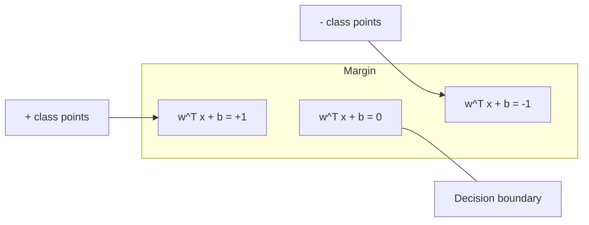
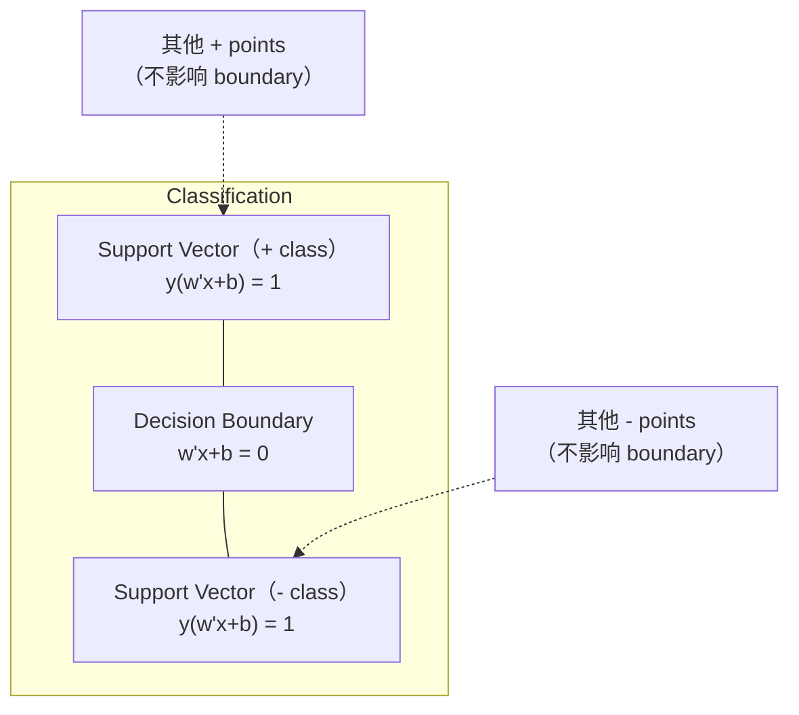
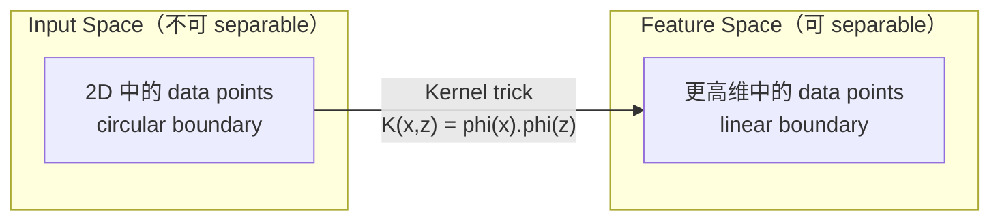

# Machines vectorielles de soutien

> C'est la plus large rue entre les deux catégories.

**Type:** Build
**Language:**Python
**先修要求：**Phase 1 ((Léctions 08 Optimisation, 14 Normes et distances, 18 Optimisation convexe)
**Time:** ~90 分钟

## Objectif de l'apprentissage
- Utilisation de la perte de charnière et de la formulation primaire de la descente de gradient supérieure, de zéro à réaliser un SVM linéaire
-                                                                                                                                                                                                                                                                                                                                                                                                                                                                                                                              
- Comparer les noyaux linéaires, polynomiels et RBF, et expliquer le truc du noyau  comment éviter une apparente hauteur de la projection
-  évaluer par le paramètre C  contrôler la largeur de marge et les erreurs de classification 

##  problématique
Vous avez deux types de points de données, vous devez dessiner une ligne droite (ou hyperplane) pour les séparer.

La marge de choix est la limite de décision avec la distance entre les points de données les plus proches des deux côtés.

Cette intuition a donné naissance aux machines vectorielles de soutien, l'un des algorithmes les plus élégants de la mathématique ML. Avant le Deep Learning, les VM étaient une méthode de classification dominante, et sont toujours le meilleur choix parmi les problèmes de petits ensembles de données, de grands données et de modèles qui nécessitent une compréhension complète.

Les SVM sont directement connectés à la phase 1: l'optimisation est convexe de la leçon 18), la marge avec les normes de mesure de la leçon 14), tandis que le truc du noyau utilise les produits dotés, dans un contexte non réel de calcul de haute dimension de l'espace, pour traiter les limites non linéaires.

## 概念
### Classifiateur de séparations maximale

给定 labels y_i dans {-1, +1} 和 feature vectors x_i de données séparables linéairement, nous souhaitons trouver un hyperplane w^T x + b = 0 来分离类别。

La distance entre x_i et hyperplane est:

```
distance = |w^T x_i + b| / ||w||
```

Pour le point de type: y_i * (w^T x_i + b) > 0──marge est de l'hyperplane à la position du point le plus proche à la distance de deux fois──



problème d'optimisation:

```
maximize    2 / ||w||     (margin width)
subject to  y_i * (w^T x_i + b) >= 1  for all i
```

Égalité de travail:

```
minimize    (1/2) ||w||^2
subject to  y_i * (w^T x_i + b) >= 1  for all i
```

Ceci est un programme quadratique convexe. Il a une solution globale unique. Il est situé dans les limites de la marge.

### Vecteurs de soutien:关键的少数点



La plupart des points de formation sont sans importance. Seuls les vecteurs de support sont importants. C'est pourquoi les SVM sont plus efficaces en temps de prévision: vous n'avez besoin que de vecteurs de support de stockage, et non de tout l'ensemble de la formation.

Le nombre de vecteurs de support a également donné une erreur de généralisation.

### Marge douce: Utilisation du paramètre C  traitement du bruit

Les données réelles sont très peu complètement séparables. Certains points peuvent être situés sur le côté de l'erreur de la limite ou sur la marge interne.

```
minimize    (1/2) ||w||^2 + C * sum(xi_i)
subject to  y_i * (w^T x_i + b) >= 1 - xi_i
            xi_i >= 0  for all i
```

la variable de laxité xi_i 衡量点 i 违反差距的程度──C 控制这种 trade-off:

| C value | Behavior |
|---------|----------|
| Large C | 对 violations 施加重罚。margin 窄，misclassifications 更少。Overfits |
| Small C | 允许更多 violations。margin 宽，misclassifications 更多。Underfits |

C est la force de régularisation de la régularisation.

### Perte de crevasse: fonction de perte de SVM

SVM de marge douce peut être réécrit pour une optimisation sans contrainte:

```
minimize    (1/2) ||w||^2 + C * sum(max(0, 1 - y_i * (w^T x_i + b)))
```

项 max(0, 1 - y_i * f(x_i)) est la perte de la charnière.

```
单个点的 Hinge loss：

loss
  |
  | \
  |  \
  |   \
  |    \
  |     \_______________
  |
  +-----|-----|-------->  y * f(x)
       0     1

当 y*f(x) >= 1 时为 zero loss（正确分类，位于 margin 外）。
当 y*f(x) < 1 时为 linear penalty。
```

Comparer avec la perte logistique (régrésion logistique)

```
Hinge:     max(0, 1 - y*f(x))          在 margin 处 hard cutoff
Logistic:  log(1 + exp(-y*f(x)))        平滑，永远不会精确为零
```

Perte de ciseaux  générer des solutions rares(seuls des vecteurs de support 有非零贡献) ――perte logistique Utilize tous les points de données―, ce qui rend les SVM plus efficaces en temps de prévision―.

### Utiliser la descente de gradient  entraînement SVM linéaire

Vous pouvez utiliser la perte de charnière avec la régulation de L2 de la descente de gradient supérieure pour entraîner le SVM linéaire, sans avoir besoin de résoudre le QP restreint:

```
L(w, b) = (lambda/2) * ||w||^2 + (1/n) * sum(max(0, 1 - y_i * (w^T x_i + b)))

关于 w 的 Gradient：
  If y_i * (w^T x_i + b) >= 1:  dL/dw = lambda * w
  If y_i * (w^T x_i + b) < 1:   dL/dw = lambda * w - y_i * x_i

关于 b 的 Gradient：
  If y_i * (w^T x_i + b) >= 1:  dL/db = 0
  If y_i * (w^T x_i + b) < 1:   dL/db = -y_i
```

Ceci est appelé la formule primaire. Il est utilisé pour chaque époque comme un temps de fonctionnement O (n * d), dont n est le nombre d'échantillons, d est le nombre de caractéristiques. Pour la classification du texte, c'est très rapide.

### La double formulation et le truc du noyau

Le problème de SVM du double Lagrangien (de la phase 1 de la leçon 18, conditions de la KKKT) est:

```
maximize    sum(alpha_i) - (1/2) * sum_ij(alpha_i * alpha_j * y_i * y_j * (x_i . x_j))
subject to  0 <= alpha_i <= C
            sum(alpha_i * y_i) = 0
```

Il s'agit de produits de points de données x_i. x_j. Ceci est un élément clé de la fonction de noyau K(x_i, x_j)  Remplacez chaque produit de point, SVM s peut apprendre les limites non linéaires, sans avoir besoin de transformation de calcul évidente

```
Linear kernel:      K(x, z) = x . z
Polynomial kernel:  K(x, z) = (x . z + c)^d
RBF (Gaussian):     K(x, z) = exp(-gamma * ||x - z||^2)
```

Le noyau RBF va cartographier les données dans un espace dimensionnel infini. Dans l'espace d'entrée, le point de proximité, la valeur du noyau, le point de proximité est proche de 1.



Le truc du noyau dans le cas où il n'entre pas dans le haute dimension de l'espace, calculer le produit de point dans l'espace. Pour le noyau polynomial de D 维中度 d, l'espace de fonctionnement est évident.

### MTS pour la régression (MTS)

Régression vectorielle de support Régression vectorielle de support Régression vectorielle de support vectoriel Régression vectorielle Régression vectorielle Régression vectorielle Régression vectorielle Régression vectorielle Régression vectorielle Régression vectorielle Régression vectorielle Régression vectorielle Régression vectorielle Régression vectorielle Régression vectorielle Régression vectorielle Régression vectorielle Régression vectorielle Régression vectorielle Régression vectorielle Régression vectorielle Régression vectorielle Régression vectorielle Régression

```
minimize    (1/2) ||w||^2 + C * sum(xi_i + xi_i*)
subject to  y_i - (w^T x_i + b) <= epsilon + xi_i
            (w^T x_i + b) - y_i <= epsilon + xi_i*
            xi_i, xi_i* >= 0
```

Paramètre epsilon  contrôler la largeur du tube, tube, plus large = vecteurs de support, plus petit = plus petit = plus petit, tube, plus petit = vecteurs de support, plus grand = plus grand, plus grand, plus grand, plus grand, plus grand, plus grand, plus grand, plus grand, plus grand, plus grand, plus grand, plus grand, plus grand, plus grand, plus grand, plus grand, plus grand, plus grand, plus grand, plus grand, plus grand, plus grand, plus grand, plus grand, plus grand, plus grand, plus grand, plus grand, plus grand, plus grand, plus grand, plus grand, plus grand, plus grand, plus grand, plus grand, plus grand, plus grand, plus grand, plus grand, plus grand, plus grand, plus grand, plus grand, plus grand, plus grand, plus grand, plus grand, plus grand, plus grand, plus grand, plus grand, plus grand, plus grand, plus grand, plus grand, plus grand, plus grand, plus grand, plus grand, plus plus plus, plus plus, plus, plus, plus, plus, plus, plus, plus, plus, plus, plus, plus, plus, plus, plus, plus, plus, plus, plus, plus, plus, plus, plus, plus, plus, plus, plus, plus, plus, plus, plus plus, plus, plus, plus, plus, plus.

### Pourquoi les SVM donnent-ils un apprentissage profond et quand ils sont encore en train de gagner ?

Les SVM ont dominé le ML de la fin des années 1990 au début des années 2010. L'apprentissage en profondeur les a dépassés pour plusieurs raisons:

| Factor | SVMs | Deep learning |
|--------|------|---------------|
| Feature engineering | 需要它 | 学习 features |
| Scalability | kernel 为 O(n^2) 到 O(n^3) | 使用 SGD 时每个 epoch 为 O(n) |
| Image/text/audio | 需要 handcrafted features | 从 raw data 学习 |
| Large datasets (>100k) | 慢 | 扩展良好 |
| GPU acceleration | 收益有限 | 巨大加速 |

Les SVM sont encore victorieux dans ces scènes:
- Petits ensembles de données ((100 à 1000 échantillons)
- 高维 données rares(带 TF-IDF fonctionnalités 的文本)
- Quand tu as besoin de maths assurance
- Lorsque le temps de formation  doit être minimisé  SVM linéaire 非常快)
- 具有清晰 margin structure de classification binaire
- Détection d'anomalies (MAS de même classe)


```figure
svm-margin
```

## - Je le construis.
### 步骤 1: Perte de crochet et dégradation

基础── calculer la perte de charnière d'un lot  et son gradient──

```python
def hinge_loss(X, y, w, b):
    n = len(X)
    total_loss = 0.0
    for i in range(n):
        margin = y[i] * (dot(w, X[i]) + b)
        total_loss += max(0.0, 1.0 - margin)
    return total_loss / n
```

### 步骤 2: SVM linéaire par descente de gradient

通過最小化定期關節損失 来訓練──不需要 QP solver──

```python
class LinearSVM:
    def __init__(self, lr=0.001, lambda_param=0.01, n_epochs=1000):
        self.lr = lr
        self.lambda_param = lambda_param
        self.n_epochs = n_epochs
        self.w = None
        self.b = 0.0

    def fit(self, X, y):
        n_features = len(X[0])
        self.w = [0.0] * n_features
        self.b = 0.0

        for epoch in range(self.n_epochs):
            for i in range(len(X)):
                margin = y[i] * (dot(self.w, X[i]) + self.b)
                if margin >= 1:
                    self.w = [wj - self.lr * self.lambda_param * wj
                              for wj in self.w]
                else:
                    self.w = [wj - self.lr * (self.lambda_param * wj - y[i] * X[i][j])
                              for j, wj in enumerate(self.w)]
                    self.b -= self.lr * (-y[i])

    def predict(self, X):
        return [1 if dot(self.w, x) + self.b >= 0 else -1 for x in X]
```

### 步骤 3: Fonctions du noyau

实现 linear、polynôme 和 RBF noyaux。

```python
def linear_kernel(x, z):
    return dot(x, z)

def polynomial_kernel(x, z, degree=3, c=1.0):
    return (dot(x, z) + c) ** degree

def rbf_kernel(x, z, gamma=0.5):
    diff = [xi - zi for xi, zi in zip(x, z)]
    return math.exp(-gamma * dot(diff, diff))
```

### 步骤 4: Identification des vecteurs de marge et de support

訓練後, identifier quelles sont les vecteurs de support,并计算边界宽度──

```python
def find_support_vectors(X, y, w, b, tol=1e-3):
    support_vectors = []
    for i in range(len(X)):
        margin = y[i] * (dot(w, X[i]) + b)
        if abs(margin - 1.0) < tol:
            support_vectors.append(i)
    return support_vectors
```

完整实现和所有 demos 见 `code/svm.py`Il y a une autre.

## Utilisez-le
Utilisez le scikit-learn:

```python
from sklearn.svm import SVC, LinearSVC, SVR
from sklearn.preprocessing import StandardScaler
from sklearn.pipeline import Pipeline

clf = Pipeline([
    ("scaler", StandardScaler()),
    ("svm", SVC(kernel="rbf", C=1.0, gamma="scale")),
])
clf.fit(X_train, y_train)
print(f"Accuracy: {clf.score(X_test, y_test):.4f}")
print(f"Support vectors: {clf['svm'].n_support_}")
```

important: entraînement SVM                                                                                                                                                                                                                                                                                                                                                                                                                                                                                                                     

对于大数据集,使用 `LinearSVC`(formulation primaire, chaque époque 为 O(n)) plutôt que `SVC`(double formule,O(n^2) à O(n^3)):

```python
from sklearn.svm import LinearSVC

clf = Pipeline([
    ("scaler", StandardScaler()),
    ("svm", LinearSVC(C=1.0, max_iter=10000)),
])
```

## 练习
1. 生成 2D séparable de manière linéaire ensemble de données。训练你的线性SVM,并识别支持向量──验证支持向量是最接近决策界的点──

2. Dans un ensemble de données bruyant 上将 C de 0,001 变化到1000──为每 C value 绘制决策界限──观察从宽边缘(不适合) 到狭边缘(过) 的过渡──

3. 创建一个类界限 为圆形(非线性) 的数据集──展示线性SVM 会失败──计算RBF内核矩阵,并展示类别在内核诱导功能空间 中变得分离性──

4. Dans le même ensemble de données, comparez la perte de chargement avec la perte logistique.

5. 实现 SVR(epsilon-insensitive loss) ――将它拟合到 y = sin(x) + noise──绘制预测 周围的epsilon tube,并突出显示支持向量(tube 外的点)──

## 关键术语
| Term | What it actually means |
|------|----------------------|
| Support vectors | 最接近 decision boundary 的 training points。唯一决定 hyperplane 的点 |
| Margin | decision boundary 与最近 support vectors 之间的距离。SVMs 会最大化它 |
| Hinge loss | max(0, 1 - y*f(x))。正确分类且位于 margin 外时为零。否则为 linear penalty |
| C parameter | margin width 与 classification errors 之间的 trade-off。Large C = narrow margin，small C = wide margin |
| Soft margin | 通过 slack variables 允许 margin violations 的 SVM formulation。处理 non-separable data |
| Kernel trick | 在不显式映射到高维 feature space 的情况下，计算该空间中的 dot products |
| Linear kernel | K(x, z) = x . z。等价于标准 dot product。用于 linearly separable data |
| RBF kernel | K(x, z) = exp(-gamma * \|\|x-z\|\|^2)。映射到 infinite dimensions。学习任意 smooth boundary |
| Polynomial kernel | K(x, z) = (x . z + c)^d。映射到 polynomial combinations 的 feature space |
| Dual formulation | SVM problem 的重写形式，只依赖数据点之间的 dot products。支持 kernels |
| SVR | Support Vector Regression。围绕数据拟合 epsilon-tube。tube 内的点具有 zero loss |
| Slack variables | xi_i：衡量一个点违反 margin 的程度。正确分类且位于 margin 外的点为零 |
| Maximum margin | 选择能够最大化到每个类别最近点距离的 hyperplane 的原则 |

## 延伸阅读
- [Vapnik: The Nature of Statistical Learning Theory (1995)](https://link.springer.com/book/10.1007/978-1-4757-3264-1)-  关于SVMs和统计学的基础文本
- [Cortes & Vapnik: Support-vector networks (1995)](https://link.springer.com/article/10.1007/BF00994018)- papier SVM original
- [Platt: Sequential Minimal Optimization (1998)](https://www.microsoft.com/en-us/research/publication/sequential-minimal-optimization-a-fast-algorithm-for-training-support-vector-machines/)- 让SVM training 变得实用SMO algorithme
- [scikit-learn SVM documentation](https://scikit-learn.org/stable/modules/svm.html)- contenir des détails de mise en œuvre de la pratique
- [LIBSVM: A Library for Support Vector Machines](https://www.csie.ntu.edu.tw/~cjlin/libsvm/)- La plupart des implémentations SVM  derrière la bibliothèque C++
