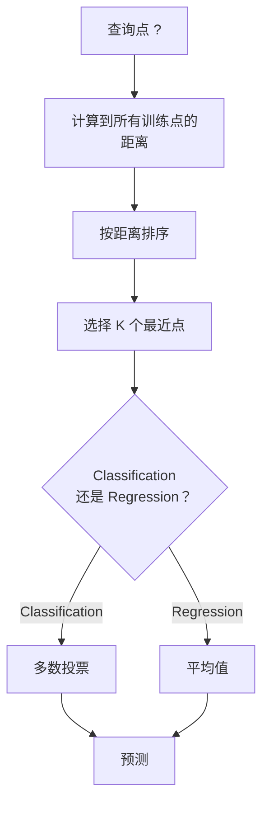
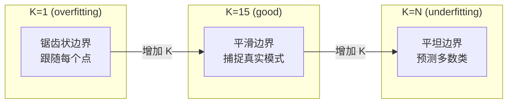
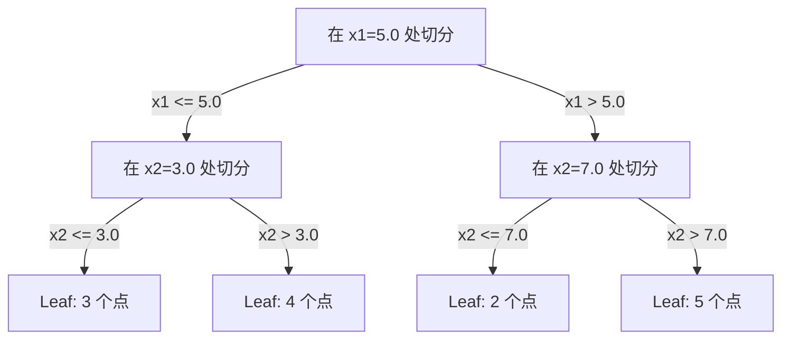

# K- Les voisins les plus proches et les distances

> 储存一切――通过查看你的邻居来预测―― c'est le plus simple et le plus efficace des algorithmes――

**Type:** Build
**Language:**Python
**前置要求：**Phase 1 (Létion 14 Normes et distances)
**Time:** ~90 分钟

## Objectif de l'apprentissage
- De zéro réalisation de la classification KNN et de la régression, de la K et de la distance de la participation au vote
- Comparer L1、L2、cosine 和 Minkowski  distance de mesure, et choisir la mesure appropriée pour un type de données donné
- Expliquer pourquoi la KNN dans l'espace élevé s'est dégradée
- Construire un arbre KD pour réaliser une recherche de voisinage la plus proche, et l'analyser

##  problématique
Vous avez un ensemble de données. Un nouveau point de données est arrivé. Vous devez le classer ou prédire sa valeur. Avec des paramètres d'apprentissage dans les données (par exemple, la régression linéaire ou les SVM), vous devez simplement trouver les K's de formation les plus proches du nouveau point et les laisser voter.

C'est le K-neighbor le plus proche. Il n'a pas de phase de formation. Il n'a pas besoin de paramètres de formation. Il n'a pas besoin de fonction de perte minimale.

Il semble simple à ne pas être capable de travailler. Mais le KNN est compétitif sur de nombreux problèmes, en particulier sur les petits et moyens ensembles de données.

Les bases de données vectorielles se trouvent dans les emplacements et exécutent la recherche KNN. La génération augmentée de récupération (RAG) cherche K 个近期文档片段―― un système de recherche similaire à l'utilisateur ou à l'objet. L'algorithme est le même.

## 概念
### Comment fonctionne KNN

 donner un ensemble de données avec un point de marque et un nouveau point de recherche:

1.  calculer la distance entre chaque point de recherche et le centre de données
2. 按距离排序
3. 取最近的 K 个点
4. 对于分类: dans K 个邻居进行多数投票
5. 对于 Regression:对 K 个邻居的值取平均 (à savoir, à la moyenne)



Voilà le parfait algorithme. Il n'y a pas de résolution. Il n'y a pas de déclin de la phase.

### Choisir K

K est le seul hyperparamètre. Il contrôle le biais-variance trade-off:

| K | 行为 |
|---|----------|
| K = 1 | 决策边界跟随每一个点。训练误差为零。高方差。Overfits |
| Small K (3-5) | 对局部结构敏感。可以捕捉复杂边界 |
| Large K | 边界更平滑。对噪声更稳健。可能 underfit |
| K = N | 对每个点都预测多数类。最大 bias |

Le point de départ commun est l'utilisation de données contenant N 个点 K = sqrt(N)。二分类时使用奇数 K,以避免平票。



### Mesures de distance

La distance définit ce qu'on appelle la proximité.

**L2 (Euclidean)**Il est à la recherche de la solution.

```
d(a, b) = sqrt(sum((a_i - b_i)^2))
```

L'utilisation de L2 et KNN est toujours nécessaire à la normalisation des caractéristiques.

**L1 (Manhattan)**Pour l'absence de différence, il est plus capable de résister aux valeurs étrangères que L2, car il ne résiste pas à la différence de valeur par carré.

```
d(a, b) = sum(|a_i - b_i|)
```

**Cosine distance**∆ Mesurer les angles entre vecteurs ∆, ∆ ignorer ∆. ∆. ∆. ∆. ∆. ∆. ∆. ∆. ∆. ∆. ∆. ∆. ∆. ∆. ∆. ∆. ∆. ∆. ∆. ∆. ∆. ∆. ∆. ∆. ∆. ∆. ∆. ∆. ∆. ∆. ∆. ∆. ∆. ∆. ∆. ∆. ∆. ∆. ∆. ∆. ∆. ∆. ∆. ∆. ∆. ∆. ∆. ∆. ∆. ∆. ∆. ∆. ∆. ∆. ∆. ∆. ∆. ∆. ∆. ∆. ∆. ∆. ∆. ∆. ∆. ∆. ∆. ∆. ∆. ∆. ∆. ∆. ∆. ∆. ∆. ∆. ∆. ∆. ∆. ∆. ∆. ∆. ∆. ∆. ∆. ∆. ∆. ∆. ∆. ∆. ∆. ∆. ∆. ∆. ∆. ∆. ∆

```
d(a, b) = 1 - (a . b) / (||a|| * ||b||)
```

**Minkowski**Utilisation des paramètres P 泛化 L1 和 L2。

```
d(a, b) = (sum(|a_i - b_i|^p))^(1/p)

p=1: Manhattan
p=2: Euclidean
p->inf: Chebyshev (max absolute difference)
```

Quelle est la mesure utilisée selon les données:

| 数据类型 | 最佳度量 | 原因 |
|-----------|------------|-----|
| 数值特征，尺度相近 | L2 (Euclidean) | 默认选择，适用于空间数据 |
| 数值特征，存在 outliers | L1 (Manhattan) | 稳健，不会放大大差异 |
| Text embeddings | Cosine | 大小是噪声，方向是含义 |
| 高维稀疏 | Cosine 或 L1 | L2 受维度灾难影响严重 |
| 混合类型 | Custom distance | 按特征类型组合度量 |

### Nénine pondérée

La norme KNN donne le même poids à tous les voisins K, mais une distance de 0,1 km de la voisine devrait être plus importante que celle de 5,0 km de la voisine.

**Distance-weighted KNN**按距离的倒数为每个邻居加权:

```
weight_i = 1 / (distance_i + epsilon)

For classification: weighted vote
For regression:     weighted average = sum(w_i * y_i) / sum(w_i)
```

Lorsque les points de recherche et les points d'entraînement sont parfaitement alignés, l'epsilon peut empêcher la décomposition à zéro.

Le KNN pondéré n'est pas très sensible au choix de K, car les voisins éloignés contribuent très peu.

### 维度灾难

La performance de KNN est en détérioration à grande échelle. Ce n'est pas une inquiétude vague, mais un fait mathématique.

**问题 1：距离会收敛。**Avec l'augmentation de la dimension, la distance maximale et la distance minimale se rapprochent de 1 ⋅ tous les points deviennent similaires à ceux des points de recherche ⋅ ⋅ ⋅ ⋅ ⋅

```
In d dimensions, for random uniform points:

d=2:    max_dist / min_dist = varies widely
d=100:  max_dist / min_dist ~ 1.01
d=1000: max_dist / min_dist ~ 1.001

When all distances are nearly equal, "nearest" is meaningless.
```

**问题 2：体积会爆炸。**Pour capturer K de voisins dans une proportion fixe de données, vous devez élargir le demi-diagramme de recherche, en faisant couvrir une grande partie de l'espace de caractéristiques.

**问题 3：角落占主导。**Dans d'unités superquadrées, la plupart de l'épaisseur se concentre près du coin, et non au centre. Avec la croissance de l'épaisseur, le nombre de points d'épaisseur contenus dans les sphères du squadré se rapproche de zéro.

实际后果:KNN dans environ 20-50 个特征内表现良好――超过这个范围后, vous devez effectuer une réduction de dimensionnalité de la KNN (PCA、UMAP、t-SNE) ou utiliser des structures de recherche basées sur des arbres à faible niveau pour utiliser les données dans la structure.

### KD-arbres: rapide voisin le plus proche 搜索

La force brute KNN calculera la distance entre chaque point d'entraînement et chaque point de recherche.

KD-tree 会沿征轴递归划分空间―― dans chaque couche, il est effectué selon un certain nombre de dimensions.



Pour trouver le voisin le plus proche, il faut d'abord parcourir le arbre jusqu'à contenir la feuille du point de recherche, puis revenir en arrière, et ne les vérifier que dans le quartier le plus proche.

平均查询时间:低维时为 O(log n) ・・・ mais les KD-arbres 在高维(d > 20) vont être redéterminés en O(n), parce que les branches de retracération peuvent être exclues de plus en plus peu。

### Les arbres à billes: 更适合中等维度

Les arbres de boules diviseront les données en superboules de niches, plutôt que dans des boîtes axées. Chaque point définit une boule (centre + demi-dimension), contient tous les points de cet arbre.

Par rapport aux KD-arbres:
- Dans le milieu de la moyenne, les performances sont meilleures (maximum ~50)
- 能处理 non axé à structure
- Plus de limite de volume signifie que vous pouvez couper plus de branches lors de la recherche

Les arbres KD et les arbres à billes sont des algorithmes précis. Pour une recherche à grande échelle, il faut utiliser le moyen le plus proche du voisin.

### L'apprentissage paresseux contre l'apprentissage par avidité

KNN est un apprenant paresseux: pendant la formation, tout est réalisé en prévision. La plupart des autres algorithmes (régrésion linéaire, SVM, réseaux neuronaux) sont des apprenants avides: ils effectuent des calculs importants pendant la formation pour construire des modèles, puis prévoient rapidement.

| 方面 | Lazy (KNN) | Eager (SVM, neural net) |
|--------|------------|------------------------|
| 训练时间 | O(1)，只存储数据 | O(n * epochs) |
| 预测时间 | 每次查询 O(n * d) | O(d) 或 O(parameters) |
| 预测时内存 | 存储整个训练集 | 只存储模型参数 |
| 适应新数据 | 立即添加点 | 重新训练模型 |
| 决策边界 | 隐式，在运行时计算 | 显式，训练后固定 |

L'apprentissage paresseux 适合以下场景:
- Numéro de changement de données (non nécessaire à la rééducation)
- Il suffit de faire une petite enquête.
- Tu veux que je t'entraîne pour le temps de zéro
- Numéro suffisamment petit, recherche brute-force  très vite

### KNN pour la régression

La régression de la KNN n'est pas un vote majoritaire, mais une moyenne de la valeur cible des voisins de K 个.

```
prediction = (1/K) * sum(y_i for i in K nearest neighbors)

Or with distance weighting:
prediction = sum(w_i * y_i) / sum(w_i)
where w_i = 1 / distance_i
```

La régression KNN 产生分段常数预测(使用加权时为分段平滑) ・・・ elle ne peut être exclue de la portée des données de formation。 Si l'objectif de formation est entièrement compris entre 0 et 100, la KNN 永远不会预测 200。


```figure
knn-smoothness
```

## - Je le construis.
### 步骤 1: Fonctions de distance

实现 L1、L2、cosine 和 Minkowski 距离──────────────────────────────────────────────────────────────────────────────────────────────────────────────────────────────────────────────────────────────────────────────────────────────────────────────────────────────────────────────────────────────────────────────────────────────────────────────────────────────────────────────────────────────────────────────────────────────────────────────────────────────────────────────────────────────────────────────────────────────────────────────────────────────────────────────────────────────────────────────────────────────────────────────────────────────────────────────────────────────────────────────────────────────────────────────────────────────────────────────────────────────────────────────────────────────────────────────────────────────────────────────────────────────────────────────────────────────────────────────────────────────────────────────────────────────────────────────────────────────────────────────────────────

```python
import math

def l2_distance(a, b):
    return math.sqrt(sum((ai - bi) ** 2 for ai, bi in zip(a, b)))

def l1_distance(a, b):
    return sum(abs(ai - bi) for ai, bi in zip(a, b))

def cosine_distance(a, b):
    dot_val = sum(ai * bi for ai, bi in zip(a, b))
    norm_a = math.sqrt(sum(ai ** 2 for ai in a))
    norm_b = math.sqrt(sum(bi ** 2 for bi in b))
    if norm_a == 0 or norm_b == 0:
        return 1.0
    return 1.0 - dot_val / (norm_a * norm_b)

def minkowski_distance(a, b, p=2):
    if p == float('inf'):
        return max(abs(ai - bi) for ai, bi in zip(a, b))
    return sum(abs(ai - bi) ** p for ai, bi in zip(a, b)) ** (1 / p)
```

### 步骤 2: Classificateur et régresseur KNN

Construire une KNN complète, une K de dimensionnement de la distance et une accroissement de la distance choisie.

```python
class KNN:
    def __init__(self, k=5, distance_fn=l2_distance, weighted=False,
                 task="classification"):
        self.k = k
        self.distance_fn = distance_fn
        self.weighted = weighted
        self.task = task
        self.X_train = None
        self.y_train = None

    def fit(self, X, y):
        self.X_train = X
        self.y_train = y

    def predict(self, X):
        return [self._predict_one(x) for x in X]
```

### 步骤 3: arbre KD pour une recherche efficace

De la construction de KD-arbre à zéro, le nombre moyen de chaque dimension est de retour à zéro.

```python
class KDTree:
    def __init__(self, X, indices=None, depth=0):
        # Recursively partition the data
        self.axis = depth % len(X[0])
        # Split on median of the current axis
        ...

    def query(self, point, k=1):
        # Traverse to leaf, then backtrack
        ...
```

完整实现见 `code/knn.py`, qui contient tous les moyens et démonstrations de soutien.

### 步骤 4: Écalement des caractéristiques

La KNN nécessite une mise à l'échelle des caractéristiques, car la distance entre les caractéristiques est très sensible.

```python
def standardize(X):
    n = len(X)
    d = len(X[0])
    means = [sum(X[i][j] for i in range(n)) / n for j in range(d)]
    stds = [
        max(1e-10, (sum((X[i][j] - means[j]) ** 2 for i in range(n)) / n) ** 0.5)
        for j in range(d)
    ]
    return [[((X[i][j] - means[j]) / stds[j]) for j in range(d)] for i in range(n)], means, stds
```

## Utilisez-le
Utilisez le scikit-learn:

```python
from sklearn.neighbors import KNeighborsClassifier
from sklearn.preprocessing import StandardScaler
from sklearn.pipeline import Pipeline

clf = Pipeline([
    ("scaler", StandardScaler()),
    ("knn", KNeighborsClassifier(n_neighbors=5, metric="euclidean")),
])
clf.fit(X_train, y_train)
print(f"Accuracy: {clf.score(X_test, y_test):.4f}")
```

Lorsque le groupe de données est assez grand et la dimension suffisamment faible, Scikit-learn utilisera automatiquement des arbres KD ou des arbres à billes. Pour les données de grande taille, il reviendra à la force brute.`algorithm`Le contrôle des paramètres.

Pour la recherche de voisinage le plus proche à grande échelle ((数百万个矢量), utilisez la base de données FAISS、Annoy 或 Vector:

```python
import faiss

index = faiss.IndexFlatL2(dimension)
index.add(embeddings)
distances, indices = index.search(query_vectors, k=5)
```

## 练习
1. Dans un ensemble de données 2D comprenant 3 catégories, la classification KNN est réalisée.

2. Dans les dimensions 2、5、10、50、100 和 500, on génère 1000 points aléatoires. Pour chaque dimension, on calcule la distance la plus élevée parallèle à la distance la plus faible parallèle.

3. Dans le texte Classification  problèmes sur la comparaison de KNN de L1、L2 et cosine distance ((utiliser TF-IDF Vecteurs)  Quelles mesures donnent la meilleure précision? Pourquoi cosine 往往在文本上胜出?

4. ¢ réaliser KD-arbre, et en 2D、10D et 50D, séparément pour 1k、10k et 100k points de données de mesure de la période de requête et la force brute.

5. Pour y = sin(x) + bruit construire un régresseur KNN pondéré― le comparer avec un KNN non pondéré de K=3、10、30―, montrant une prédiction plus équitable, en particulier dans le K 较大时―.

## 关键术语
| 术语 | 它实际意味着什么 |
|------|----------------------|
| K-nearest neighbors | 一种非参数算法，通过寻找距离查询点最近的 K 个训练点来预测 |
| Lazy learning | 训练时不进行计算。所有工作都发生在预测时。KNN 是典型例子 |
| Eager learning | 训练时进行大量计算以构建紧凑模型。大多数 ML 算法都是 eager |
| Curse of dimensionality | 在高维中，距离会收敛，neighborhoods 会扩展到覆盖空间的大部分，使 KNN 失效 |
| KD-tree | 沿特征轴递归划分空间的二叉树。在低维中查询为 O(log n) |
| Ball tree | 嵌套超球体构成的树。在中等维度（最高约 ~50）中比 KD-trees 表现更好 |
| Weighted KNN | neighbors 按距离倒数加权。更近的 neighbors 对预测影响更大 |
| Feature scaling | 将特征归一化到可比较范围。KNN 等基于距离的方法需要它 |
| Majority vote | 通过统计 K 个 neighbors 中哪个类别最常见来进行 Classification |
| Brute force search | 计算到每个训练点的距离。每次查询 O(n*d)。精确但在大 n 时很慢 |
| Approximate nearest neighbor | 能比精确搜索快得多地找到近似最近点的算法（HNSW、LSH、IVF） |
| Voronoi diagram | 一种空间划分，其中每个区域包含所有比任何其他训练点都更接近某个训练点的点。K=1 KNN 会产生 Voronoi 边界 |

## 延伸阅读
- [Cover & Hart: Nearest Neighbor Pattern Classification (1967)](https://ieeexplore.ieee.org/document/1053964)- 奠基性的 KNN 论文, prouvant son taux d'erreur jusqu'à deux fois le taux optimal de Bayes
- [Friedman, Bentley, Finkel: An Algorithm for Finding Best Matches in Logarithmic Expected Time (1977)](https://dl.acm.org/doi/10.1145/355744.355745)- Origini KD-arbre 论文
- [Beyer et al.: When Is "Nearest Neighbor" Meaningful? (1999)](https://link.springer.com/chapter/10.1007/3-540-49257-7_15)- analyse formelle du voisin le plus proche
- [scikit-learn Nearest Neighbors documentation](https://scikit-learn.org/stable/modules/neighbors.html)- contenant des méthodes de sélection de pratique
- [FAISS: A Library for Efficient Similarity Search](https://github.com/facebookresearch/faiss)- Meta utilise la classe de milliards approximative de recherche du voisin le plus proche
