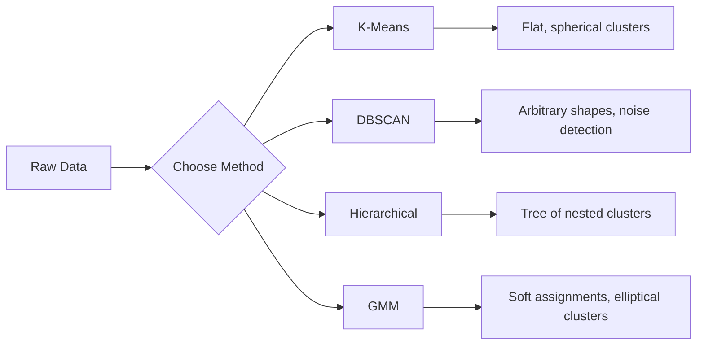

# Apprendre sans surveillance

> Il n'y a pas de marque, pas de professeur.

**类型:**Construction
**语言:**Python
**前置条件:**Phase 1 ((normes et distances, probabilité et répartition)
**时间:**- 90 minutes

## Objectif de l'apprentissage

- De la réalisation de K-Means、DBSCAN et Gaussian Mix Models, et comparer leur comportement de regroupement
- Utilisation de la score de silhouette 和 méthode coude  évaluer le groupe 质量,并选择最优 K
- 解释 DBSCAN 何时优于 K-Means,并识别哪种算法能处理非球形集群 和外形
- Utilisation de méthode de regroupement pour construire un pipeline de détection des anomalies, afin de marquer des points de décalage du mode normal

##  problématique

Jusqu'à présent, chaque section de l'étude de médecine est supposée être marquée par des données:  C'est une entrée, c'est une sortie correcte. Dans le monde réel, le coût de l'étiquetage est élevé. Dans les hôpitaux, il y a des millions de dossiers de patients, mais personne ne marque chaque dossiers.

L'apprentissage non supervisé se retrouve dans un mode de découverte où on ne lui dit pas quoi chercher. Il décompose des données similaires, découvre des structures cachées et expose des anomalies. Si l'apprentissage supervisé est comme une apprentissage avec des réponses provenant du matériel, alors l'apprentissage non supervisé se concentre sur les données originales jusqu'à ce que le modèle apparaisse lui-même.

Le problème réside dans le fait que, sans étiquette, vous ne pouvez pas mesurer directement la vraie ou la fausse structure.

## 核心概念

### Clustering: faire des choses semblables

Le regroupement distribuera chaque point de données dans un groupe, ce qui rendra les points du même groupe plus similaires les uns aux autres que les points du groupe.



### K-Means: méthode de main-d'œuvre habituelle

K-Means va faire une répartition des données en K 个群. Chaque cluster a un centre de centre de centre.

L'algorithme de Lloyd:

1. 随机选择 K 个点 comme centre de départ
2. Distribuer chaque point de données au centre-points le plus proche
3. Résoudre chaque centre-point pour calculer la valeur moyenne de son point de répartition
4. 重复步骤 2-3, jusqu'à ce que le résultat de la distribution ne change plus

目标函数 (inerti) Mesure la distance totale du point au centre de son centre de dépendance. K-Means 会最小化这个值,但只能找到局部最小值.

### 选择 K

两种标准方法:

**Elbow method：**Pour K = 1, 2, 3, ..., n 运行 K-Means── dessiner l'inertie avec K's relation图── chercher elbow, équivaut à continuer à augmenter le cluster 时 inertie 不再显著下降的位置──

**Silhouette score：**Pour chaque point, mesurer la similarité avec son propre cluster a) par rapport aux autres clusters proches b) comment: coefficient de silhouette 为 (b - a) / max a, b), la portée allant de -1 (分错 cluster) à +1 (分错 cluster)

### DBSCAN: Clustering basé sur la densité

K-Means 假设群是球形的,并要求你先选择 K――DBSCAN Ne faites pas ces deux hypothèses―― il va faire du cluster 找成由稀疏区域分开的密区域――

两个参数:
- **eps**: à moitié
- **min_samples**: le nombre minimum de points nécessaires pour former une zone

Trois catégories:
- **Core point**: dans les éps  distance  au moins il y a des min_samples 个点
- **Border point**: situé dans un point central de l'eps, mais lui-même n'est pas un point central
- **Noise point**Ce n'est ni le point central, ni le point de frontière.

DBSCAN 会把彼此位于 eps 范围内的核心点 连接成同一个集群──边界点 会加入附近的核心点 所在的集群──噪音点不属于任何集群──

优点:能发现任意形状的集群,自动确定集群数量,识别outlier──弱点:难以处理密度差异较大的集群──

### Clusterage hiérarchique

构建嵌套群的树dendrogram)

Agglomératif ((自底向上):
1. Chaque point est son propre groupe
2. 合并两个 dernier groupe
3. Je répète, jusqu'à ce qu'il reste un seul groupe
4. Dans l'attente de niveau de détachement dendrogramme, obtenir K 个 cluster

La proximité entre les groupes peut être mesurée de la manière suivante:
- **Single linkage**: distance minimale entre deux clusters
- **Complete linkage**: la distance maximale entre les deux points
- **Average linkage**: distance moyenne entre tous les points
- **Ward's method**: entraînant une augmentation minimale de la différence totale entre les clusters

### Modèles de mélange gaussiens (GMM)

K-Mens 给出硬分: chaque point appartient à un cluster.

GMM 假设数据由 K 个 Gaussian distribution的混合生成, chaque distribution a sa propre moyenne et covariance。Expectation-Maximization (EM) algorithme entre les deux étapes suivantes:

- **E-step**: calculer chaque point appartient à chaque probabilité gaussiale
- **M-step**: mettre à jour la moyenne Gaussian, la covariance et le poids de mélange, pour maximiser la probabilité de données

GMM peut construire des grappes en forme de sphère (non seulement en forme de K-Means), mais aussi en forme de grappe naturelle.

### Quoix utiliser quelles méthodes

| Method | Best for | Avoid when |
|--------|----------|------------|
| K-Means | 大型数据集、球形 cluster、已知 K | 形状不规则、存在 outlier |
| DBSCAN | K 未知、任意形状、outlier detection | 密度差异大、维度非常高 |
| Hierarchical | 小型数据集、需要 dendrogram、K 未知 | 大型数据集（O(n^2) memory） |
| GMM | 重叠 cluster、需要软分配 | 非常大的数据集、维度过多 |

### Utilisation de l'agglomération effectuer la détection des anomalies

Clustering 天然支持 détection des anomalies:
- **K-Means**Le point de la centroid est une anomalie .
- **DBSCAN**Selon la définition, le bruit est une anomalie.
- **GMM**Dans tous les Gaussian , les probabilités sont très faibles .


```figure
kmeans-step
```

## - Je le construis.

### étape 1: de la réalisation des K-Means

```python
import math
import random


def euclidean_distance(a, b):
    return math.sqrt(sum((ai - bi) ** 2 for ai, bi in zip(a, b)))


def kmeans(data, k, max_iterations=100, seed=42):
    random.seed(seed)
    n_features = len(data[0])

    centroids = random.sample(data, k)

    for iteration in range(max_iterations):
        clusters = [[] for _ in range(k)]
        assignments = []

        for point in data:
            distances = [euclidean_distance(point, c) for c in centroids]
            nearest = distances.index(min(distances))
            clusters[nearest].append(point)
            assignments.append(nearest)

        new_centroids = []
        for cluster in clusters:
            if len(cluster) == 0:
                new_centroids.append(random.choice(data))
                continue
            centroid = [
                sum(point[j] for point in cluster) / len(cluster)
                for j in range(n_features)
            ]
            new_centroids.append(centroid)

        if all(
            euclidean_distance(old, new) < 1e-6
            for old, new in zip(centroids, new_centroids)
        ):
            print(f"  Converged at iteration {iteration + 1}")
            break

        centroids = new_centroids

    return assignments, centroids
```

### 步骤 2: méthode du coude et score de la silhouette

```python
def compute_inertia(data, assignments, centroids):
    total = 0.0
    for point, cluster_id in zip(data, assignments):
        total += euclidean_distance(point, centroids[cluster_id]) ** 2
    return total


def silhouette_score(data, assignments):
    n = len(data)
    if n < 2:
        return 0.0

    clusters = {}
    for i, c in enumerate(assignments):
        clusters.setdefault(c, []).append(i)

    if len(clusters) < 2:
        return 0.0

    scores = []
    for i in range(n):
        own_cluster = assignments[i]
        own_members = [j for j in clusters[own_cluster] if j != i]

        if len(own_members) == 0:
            scores.append(0.0)
            continue

        a = sum(euclidean_distance(data[i], data[j]) for j in own_members) / len(own_members)

        b = float("inf")
        for cluster_id, members in clusters.items():
            if cluster_id == own_cluster:
                continue
            avg_dist = sum(euclidean_distance(data[i], data[j]) for j in members) / len(members)
            b = min(b, avg_dist)

        if max(a, b) == 0:
            scores.append(0.0)
        else:
            scores.append((b - a) / max(a, b))

    return sum(scores) / len(scores)


def find_best_k(data, max_k=10):
    print("Elbow method:")
    inertias = []
    for k in range(1, max_k + 1):
        assignments, centroids = kmeans(data, k)
        inertia = compute_inertia(data, assignments, centroids)
        inertias.append(inertia)
        print(f"  K={k}: inertia={inertia:.2f}")

    print("\nSilhouette scores:")
    for k in range(2, max_k + 1):
        assignments, centroids = kmeans(data, k)
        score = silhouette_score(data, assignments)
        print(f"  K={k}: silhouette={score:.4f}")

    return inertias
```

### étape 3: à partir de la réalisation de DBSCAN

```python
def dbscan(data, eps, min_samples):
    n = len(data)
    labels = [-1] * n
    cluster_id = 0

    def region_query(point_idx):
        neighbors = []
        for i in range(n):
            if euclidean_distance(data[point_idx], data[i]) <= eps:
                neighbors.append(i)
        return neighbors

    visited = [False] * n

    for i in range(n):
        if visited[i]:
            continue
        visited[i] = True

        neighbors = region_query(i)

        if len(neighbors) < min_samples:
            labels[i] = -1
            continue

        labels[i] = cluster_id
        seed_set = list(neighbors)
        seed_set.remove(i)

        j = 0
        while j < len(seed_set):
            q = seed_set[j]

            if not visited[q]:
                visited[q] = True
                q_neighbors = region_query(q)
                if len(q_neighbors) >= min_samples:
                    for nb in q_neighbors:
                        if nb not in seed_set:
                            seed_set.append(nb)

            if labels[q] == -1:
                labels[q] = cluster_id

            j += 1

        cluster_id += 1

    return labels
```

### 步骤 4: Modèle de mélange gaussien (algorithme EM)

```python
def gmm(data, k, max_iterations=100, seed=42):
    random.seed(seed)
    n = len(data)
    d = len(data[0])

    indices = random.sample(range(n), k)
    means = [list(data[i]) for i in indices]
    variances = [1.0] * k
    weights = [1.0 / k] * k

    def gaussian_pdf(x, mean, variance):
        d = len(x)
        coeff = 1.0 / ((2 * math.pi * variance) ** (d / 2))
        exponent = -sum((xi - mi) ** 2 for xi, mi in zip(x, mean)) / (2 * variance)
        return coeff * math.exp(max(exponent, -500))

    for iteration in range(max_iterations):
        responsibilities = []
        for i in range(n):
            probs = []
            for j in range(k):
                probs.append(weights[j] * gaussian_pdf(data[i], means[j], variances[j]))
            total = sum(probs)
            if total == 0:
                total = 1e-300
            responsibilities.append([p / total for p in probs])

        old_means = [list(m) for m in means]

        for j in range(k):
            r_sum = sum(responsibilities[i][j] for i in range(n))
            if r_sum < 1e-10:
                continue

            weights[j] = r_sum / n

            for dim in range(d):
                means[j][dim] = sum(
                    responsibilities[i][j] * data[i][dim] for i in range(n)
                ) / r_sum

            variances[j] = sum(
                responsibilities[i][j]
                * sum((data[i][dim] - means[j][dim]) ** 2 for dim in range(d))
                for i in range(n)
            ) / (r_sum * d)
            variances[j] = max(variances[j], 1e-6)

        shift = sum(
            euclidean_distance(old_means[j], means[j]) for j in range(k)
        )
        if shift < 1e-6:
            print(f"  GMM converged at iteration {iteration + 1}")
            break

    assignments = []
    for i in range(n):
        assignments.append(responsibilities[i].index(max(responsibilities[i])))

    return assignments, means, weights, responsibilities
```

### Étape 5: générer des données de test et de tout le contenu

```python
def make_blobs(centers, n_per_cluster=50, spread=0.5, seed=42):
    random.seed(seed)
    data = []
    true_labels = []
    for label, (cx, cy) in enumerate(centers):
        for _ in range(n_per_cluster):
            x = cx + random.gauss(0, spread)
            y = cy + random.gauss(0, spread)
            data.append([x, y])
            true_labels.append(label)
    return data, true_labels


def make_moons(n_samples=200, noise=0.1, seed=42):
    random.seed(seed)
    data = []
    labels = []
    n_half = n_samples // 2
    for i in range(n_half):
        angle = math.pi * i / n_half
        x = math.cos(angle) + random.gauss(0, noise)
        y = math.sin(angle) + random.gauss(0, noise)
        data.append([x, y])
        labels.append(0)
    for i in range(n_half):
        angle = math.pi * i / n_half
        x = 1 - math.cos(angle) + random.gauss(0, noise)
        y = 1 - math.sin(angle) - 0.5 + random.gauss(0, noise)
        data.append([x, y])
        labels.append(1)
    return data, labels


if __name__ == "__main__":
    centers = [[2, 2], [8, 3], [5, 8]]
    data, true_labels = make_blobs(centers, n_per_cluster=50, spread=0.8)

    print("=== K-Means on 3 blobs ===")
    assignments, centroids = kmeans(data, k=3)
    print(f"  Centroids: {[[round(c, 2) for c in cent] for cent in centroids]}")
    sil = silhouette_score(data, assignments)
    print(f"  Silhouette score: {sil:.4f}")

    print("\n=== Elbow Method ===")
    find_best_k(data, max_k=6)

    print("\n=== DBSCAN on 3 blobs ===")
    db_labels = dbscan(data, eps=1.5, min_samples=5)
    n_clusters = len(set(db_labels) - {-1})
    n_noise = db_labels.count(-1)
    print(f"  Found {n_clusters} clusters, {n_noise} noise points")

    print("\n=== GMM on 3 blobs ===")
    gmm_assignments, gmm_means, gmm_weights, _ = gmm(data, k=3)
    print(f"  Means: {[[round(m, 2) for m in mean] for mean in gmm_means]}")
    print(f"  Weights: {[round(w, 3) for w in gmm_weights]}")
    gmm_sil = silhouette_score(data, gmm_assignments)
    print(f"  Silhouette score: {gmm_sil:.4f}")

    print("\n=== DBSCAN on moons (non-spherical clusters) ===")
    moon_data, moon_labels = make_moons(n_samples=200, noise=0.1)
    moon_db = dbscan(moon_data, eps=0.3, min_samples=5)
    n_moon_clusters = len(set(moon_db) - {-1})
    n_moon_noise = moon_db.count(-1)
    print(f"  Found {n_moon_clusters} clusters, {n_moon_noise} noise points")

    print("\n=== K-Means on moons (will fail to separate) ===")
    moon_km, moon_centroids = kmeans(moon_data, k=2)
    moon_sil = silhouette_score(moon_data, moon_km)
    print(f"  Silhouette score: {moon_sil:.4f}")
    print("  K-Means splits moons poorly because they are not spherical")

    print("\n=== Anomaly detection with DBSCAN ===")
    anomaly_data = list(data)
    anomaly_data.append([20.0, 20.0])
    anomaly_data.append([-5.0, -5.0])
    anomaly_data.append([15.0, 0.0])
    anomaly_labels = dbscan(anomaly_data, eps=1.5, min_samples=5)
    anomalies = [
        anomaly_data[i]
        for i in range(len(anomaly_labels))
        if anomaly_labels[i] == -1
    ]
    print(f"  Detected {len(anomalies)} anomalies")
    for a in anomalies[-3:]:
        print(f"    Point {[round(v, 2) for v in a]}")
```

## Utilisez-le

Utilisez un petit apprentissage, le même algorithme peut être réalisé:

```python
from sklearn.cluster import KMeans, DBSCAN, AgglomerativeClustering
from sklearn.mixture import GaussianMixture
from sklearn.metrics import silhouette_score as sklearn_silhouette

km = KMeans(n_clusters=3, random_state=42).fit(data)
db = DBSCAN(eps=1.5, min_samples=5).fit(data)
agg = AgglomerativeClustering(n_clusters=3).fit(data)
gmm_model = GaussianMixture(n_components=3, random_state=42).fit(data)
```

De la première version réalisée, il sera possible de démontrer avec précision ces bases de données dans le calcul. K-Means dans la distribution et le recomptage entre les générations. DBSCAN de la première génération.

## Je le livre.

Le code de regroupement de ce cours peut être utilisé comme base de méthodes non supervisées plus avancées.

## 练习

1. 实现 K-Means++ Initialisation: ne choisissez pas le centre-point au hasard, mais choisissez le premier centre-point au hasard, puis chaque centre-point est choisi en fonction de la probabilité de la distance carrée à la distance correcte du centre-point le plus proche.
2. Pour les autres, il est possible de créer un cluster de données en fonction de la taille de la base de données.
3. Construire un pipeline simple de détection d'anomalies: fonctionnant sur les mêmes données DBSCAN et GMM, marquer deux méthodes sont considérées comme des points de sortie:

## 关键术语

| Term | What people say | What it actually means |
|------|----------------|----------------------|
| Clustering | “把相似的事物分组” | 将数据划分为若干子集，使组内相似度高于组间相似度，并由特定距离度量来衡量 |
| Centroid | “cluster 的中心” | 分配给某个 cluster 的所有点的均值；K-Means 将其用作 cluster 的代表 |
| Inertia | “cluster 有多紧凑” | 每个点到其所属 centroid 的平方距离之和；越低表示越紧凑 |
| Silhouette score | “cluster 分离得有多好” | 对每个点计算 (b - a) / max(a, b)，其中 a 是平均 cluster 内距离，b 是最近 cluster 的平均距离 |
| Core point | “稠密区域中的点” | 在 DBSCAN 中，eps 距离内至少有 min_samples 个邻居的点 |
| EM algorithm | “软 K-Means” | Expectation-Maximization：迭代计算成员概率（E-step）并更新 distribution 参数（M-step） |
| Dendrogram | “cluster 的树” | 一种树状图，展示 hierarchical clustering 中 cluster 被合并的顺序以及合并时的距离 |
| Anomaly | “一个 outlier” | 不符合预期模式的数据点，在 DBSCAN 中被识别为 noise，或在 GMM 中被识别为低概率点 |

## 延伸阅读

- [Stanford CS229 - Unsupervised Learning](https://cs229.stanford.edu/notes2022fall/main_notes.pdf)- Andrew Ng  sur les notes de conférence sur le regroupement et les émissions
- [scikit-learn Clustering Guide](https://scikit-learn.org/stable/modules/clustering.html)- Comparer les pratiques de tous les algorithmes de regroupement avec des exemples visuels
- [DBSCAN original paper (Ester et al., 1996)](https://www.aaai.org/Papers/KDD/1996/KDD96-037.pdf)-  proposer des travaux de clustering basé sur la densité
