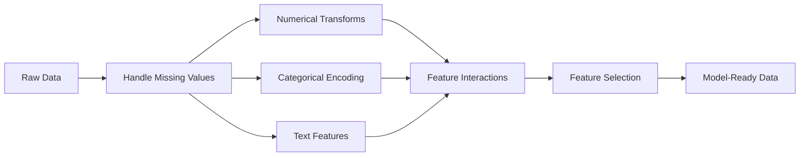

# Caractéristiques de l'ingénierie et de la sélection

> Une bonne fonctionnalité a atteint 1000 points de données.

**Type:** Build
**Languages:** Python
**Prerequisites:** Phase 1（Statistics for ML、Linear Algebra）、Phase 2 Lessons 1-7
**Time:** ~90 分钟

## Objectif de l'apprentissage

- 实现数值变换(standardization、min-max évolutions、log transformations、binning),并解释每种方法适用场景
- Pour les caractéristiques catégoriques construire un label chaud ▌ et le codage cible,并识别 target coding 风险
- De la conception d'un vectorificateur TF-IDF,并解释为什么它在文本分类中优于原始词频
- 应用基于过器的特征选择(variance threshold、correlation、信息互通) 为了降低维度

##  problématique

Vous avez un ensemble de données. Vous avez choisi un algorithme. Vous l'avez entraîné.

Puis quelqu'un a transformé les données originales en une meilleure fonctionnalité, une simple régression logistique, et a vaincu votre ensemble amélioré.

Dans les méthodes classiques de calcul, la façon de représenter les données est plus importante que le choix de l'algorithme.

L'ingénierie des fonctionnalités est le processus de transformation des données originales en formes de représentation, ce qui rend le modèle plus facile à trouver. La sélection des fonctionnalités est de rejeter les fonctionnalités qui ne font que augmenter le bruit et non augmenter le signal.

## 概念

### Caractéristiques du pipeline



### Caractéristiques de valeur

Les nombres primitifs sont très peu utilisés directement dans le modèle.

**Scaling：**Placez la fonction  à la même portée, laissez baser l'algorithme de distance  K-Means、KNN、SVM) équivalent à tous les fonctionnalités  Min-max évolutions 映射到 [0, 1]  標準化  z-score)映射到 mean=0、std=1──

**Log transform：**压缩右偏分布(收入、人口、词频) ∼把乘法关系转换为加法关系──

**Binning：**La relation entre la fonction et le but est non-lineaire mais elle est très utile lors de la fractionnement (par exemple, le groupe d'âge).

**Polynomial features：** Créer x^2、x^3、x1*x2 项── faire en sorte que le modèle de ligne puisse capturer des relations non-lineaires, le prix est de produire plus de fonctionnalités──

### Caractéristiques de la catégorie

Le modèle a besoin de chiffres.

**One-hot encoding：**Pour chaque catégorie, créer une deuxième rangée. La couleur = rouge/bleu/vert se transforme en trois rangées: est_rouge、 est_bleu、 est_vert.

**Label encoding：**Pour chaque classe de cartes, il faut faire un entier: rouge = 0, bleu = 1, vert = 2. Il introduit une mauvaise séquence de relations.

**Target encoding：**Utilisation de cette catégorie pour la variable cible de remplacement de la valeur moyenne de chaque catégorie.

### 文本 Caractéristiques

**Count vectorizer：**统计每个词在文档中出现的次数──the cat sat on the mat会变成 {le: 2, le chat: 1, sat: 1, on: 1, mat: 1}──

**TF-IDF：**La fréquence inverse du document est la fréquence de la fréquence.

```
TF(word, doc) = count(word in doc) / total words in doc
IDF(word) = log(total docs / docs containing word)
TF-IDF = TF * IDF
```

### 缺失值

Les données réelles seront vides.

- **Drop rows：** seulement lorsque les données manquent et que l'utilisation est rare
- **Mean/median imputation：**简单,并保持分布形状(média à des écarts 更稳健)
- **Mode imputation：**Utilisé pour les caractéristiques catégoriques
- **Indicator column：**En imputant  précède ajouter une deuxième structure was_this_missing── cette facture de la carence de données elle-même peut avoir une quantité d'information
- **Forward/backward fill：**Utilisé pour les données de séquences de temps

### Interaction des caractéristiques

Il existe parfois des relations entre les compositions. Il existe des relations entre les compositions. Il existe des relations entre les compositions.

### Sélection de fonctionnalités

Feature 越多 不总是越好──无关 Feature 会增加噪音──提高训练时间,并可能导致过──

**Filter methods（pre-model）：**
- Corrélation: déplacement à hauteur de la relation Feature(冗余)
- Informations mutuelles: mesurer la connaissance d'une fonctionnalité  réduire la quantité d'incertitude concernant la cible
- Térubin de variance: déplacement pratiquement invariable

**Wrapper methods（model-based）：**
- L1 régularisation(Lasso):把无关 Caractéristiques de le faire
- Élimination de la fonction récursive: training、移除最不重要 Feature、重复

**为什么 selection 重要：**Un modèle avec 10 bonnes caractéristiques, gagne généralement un modèle avec 10 bonnes caractéristiques plus 90 bruits caractéristiques.


```figure
feature-scaling
```

## - Je le construis.

### 步骤 1: de zéro réaliser la valeur de change

```python
import math


def min_max_scale(values):
    min_val = min(values)
    max_val = max(values)
    if max_val == min_val:
        return [0.0] * len(values)
    return [(v - min_val) / (max_val - min_val) for v in values]


def standardize(values):
    n = len(values)
    mean = sum(values) / n
    variance = sum((v - mean) ** 2 for v in values) / n
    std = math.sqrt(variance) if variance > 0 else 1.0
    return [(v - mean) / std for v in values]


def log_transform(values):
    return [math.log(v + 1) for v in values]


def bin_values(values, n_bins=5):
    min_val = min(values)
    max_val = max(values)
    bin_width = (max_val - min_val) / n_bins
    if bin_width == 0:
        return [0] * len(values)
    result = []
    for v in values:
        bin_idx = int((v - min_val) / bin_width)
        bin_idx = min(bin_idx, n_bins - 1)
        result.append(bin_idx)
    return result


def polynomial_features(row, degree=2):
    n = len(row)
    result = list(row)
    if degree >= 2:
        for i in range(n):
            result.append(row[i] ** 2)
        for i in range(n):
            for j in range(i + 1, n):
                result.append(row[i] * row[j])
    return result
```

### 步骤 2: réaliser le codage catégorique à partir de zéro

```python
def one_hot_encode(values):
    categories = sorted(set(values))
    cat_to_idx = {cat: i for i, cat in enumerate(categories)}
    n_cats = len(categories)

    encoded = []
    for v in values:
        row = [0] * n_cats
        row[cat_to_idx[v]] = 1
        encoded.append(row)

    return encoded, categories


def label_encode(values):
    categories = sorted(set(values))
    cat_to_int = {cat: i for i, cat in enumerate(categories)}
    return [cat_to_int[v] for v in values], cat_to_int


def target_encode(feature_values, target_values, smoothing=10):
    global_mean = sum(target_values) / len(target_values)

    category_stats = {}
    for feat, target in zip(feature_values, target_values):
        if feat not in category_stats:
            category_stats[feat] = {"sum": 0.0, "count": 0}
        category_stats[feat]["sum"] += target
        category_stats[feat]["count"] += 1

    encoding = {}
    for cat, stats in category_stats.items():
        cat_mean = stats["sum"] / stats["count"]
        weight = stats["count"] / (stats["count"] + smoothing)
        encoding[cat] = weight * cat_mean + (1 - weight) * global_mean

    return [encoding[v] for v in feature_values], encoding
```

### 步骤 3: de zéro réaliser le texte Feature

```python
def count_vectorize(documents):
    vocab = {}
    idx = 0
    for doc in documents:
        for word in doc.lower().split():
            if word not in vocab:
                vocab[word] = idx
                idx += 1

    vectors = []
    for doc in documents:
        vec = [0] * len(vocab)
        for word in doc.lower().split():
            vec[vocab[word]] += 1
        vectors.append(vec)

    return vectors, vocab


def tfidf(documents):
    n_docs = len(documents)

    vocab = {}
    idx = 0
    for doc in documents:
        for word in doc.lower().split():
            if word not in vocab:
                vocab[word] = idx
                idx += 1

    doc_freq = {}
    for doc in documents:
        seen = set()
        for word in doc.lower().split():
            if word not in seen:
                doc_freq[word] = doc_freq.get(word, 0) + 1
                seen.add(word)

    vectors = []
    for doc in documents:
        words = doc.lower().split()
        word_count = len(words)
        tf_map = {}
        for word in words:
            tf_map[word] = tf_map.get(word, 0) + 1

        vec = [0.0] * len(vocab)
        for word, count in tf_map.items():
            tf = count / word_count
            idf = math.log(n_docs / doc_freq[word])
            vec[vocab[word]] = tf * idf
        vectors.append(vec)

    return vectors, vocab
```

### 步骤 4: Imputation de la valeur de la défaillance à partir de zéro

```python
def impute_mean(values):
    present = [v for v in values if v is not None]
    if not present:
        return [0.0] * len(values), 0.0
    mean = sum(present) / len(present)
    return [v if v is not None else mean for v in values], mean


def impute_median(values):
    present = sorted(v for v in values if v is not None)
    if not present:
        return [0.0] * len(values), 0.0
    n = len(present)
    if n % 2 == 0:
        median = (present[n // 2 - 1] + present[n // 2]) / 2
    else:
        median = present[n // 2]
    return [v if v is not None else median for v in values], median


def impute_mode(values):
    present = [v for v in values if v is not None]
    if not present:
        return values, None
    counts = {}
    for v in present:
        counts[v] = counts.get(v, 0) + 1
    mode = max(counts, key=counts.get)
    return [v if v is not None else mode for v in values], mode


def add_missing_indicator(values):
    return [0 if v is not None else 1 for v in values]
```

### 步骤 5: Sélection de fonctionnalité de réalisation à partir de zéro

```python
def correlation(x, y):
    n = len(x)
    mean_x = sum(x) / n
    mean_y = sum(y) / n
    cov = sum((xi - mean_x) * (yi - mean_y) for xi, yi in zip(x, y)) / n
    std_x = math.sqrt(sum((xi - mean_x) ** 2 for xi in x) / n)
    std_y = math.sqrt(sum((yi - mean_y) ** 2 for yi in y) / n)
    if std_x == 0 or std_y == 0:
        return 0.0
    return cov / (std_x * std_y)


def mutual_information(feature, target, n_bins=10):
    feat_min = min(feature)
    feat_max = max(feature)
    bin_width = (feat_max - feat_min) / n_bins if feat_max != feat_min else 1.0
    feat_binned = [
        min(int((f - feat_min) / bin_width), n_bins - 1) for f in feature
    ]

    n = len(feature)
    target_classes = sorted(set(target))

    feat_bins = sorted(set(feat_binned))
    p_feat = {}
    for b in feat_bins:
        p_feat[b] = feat_binned.count(b) / n

    p_target = {}
    for t in target_classes:
        p_target[t] = target.count(t) / n

    mi = 0.0
    for b in feat_bins:
        for t in target_classes:
            joint_count = sum(
                1 for fb, tv in zip(feat_binned, target) if fb == b and tv == t
            )
            p_joint = joint_count / n
            if p_joint > 0:
                mi += p_joint * math.log(p_joint / (p_feat[b] * p_target[t]))

    return mi


def variance_threshold(features, threshold=0.01):
    n_features = len(features[0])
    n_samples = len(features)
    selected = []

    for j in range(n_features):
        col = [features[i][j] for i in range(n_samples)]
        mean = sum(col) / n_samples
        var = sum((v - mean) ** 2 for v in col) / n_samples
        if var >= threshold:
            selected.append(j)

    return selected


def remove_correlated(features, threshold=0.9):
    n_features = len(features[0])
    n_samples = len(features)

    to_remove = set()
    for i in range(n_features):
        if i in to_remove:
            continue
        col_i = [features[r][i] for r in range(n_samples)]
        for j in range(i + 1, n_features):
            if j in to_remove:
                continue
            col_j = [features[r][j] for r in range(n_samples)]
            corr = abs(correlation(col_i, col_j))
            if corr >= threshold:
                to_remove.add(j)

    return [i for i in range(n_features) if i not in to_remove]
```

### Étape 6: L'ensemble du pipeline et la démo

```python
import random


def make_housing_data(n=200, seed=42):
    random.seed(seed)
    data = []
    for _ in range(n):
        sqft = random.uniform(500, 5000)
        bedrooms = random.choice([1, 2, 3, 4, 5])
        age = random.uniform(0, 50)
        neighborhood = random.choice(["downtown", "suburbs", "rural"])
        has_pool = random.choice([True, False])

        sqft_with_missing = sqft if random.random() > 0.05 else None
        age_with_missing = age if random.random() > 0.08 else None

        price = (
            50 * sqft
            + 20000 * bedrooms
            - 1000 * age
            + (50000 if neighborhood == "downtown" else 10000 if neighborhood == "suburbs" else 0)
            + (15000 if has_pool else 0)
            + random.gauss(0, 20000)
        )

        data.append({
            "sqft": sqft_with_missing,
            "bedrooms": bedrooms,
            "age": age_with_missing,
            "neighborhood": neighborhood,
            "has_pool": has_pool,
            "price": price,
        })
    return data


if __name__ == "__main__":
    data = make_housing_data(200)

    print("=== Raw Data Sample ===")
    for row in data[:3]:
        print(f"  {row}")

    sqft_raw = [d["sqft"] for d in data]
    age_raw = [d["age"] for d in data]
    prices = [d["price"] for d in data]

    print("\n=== Missing Value Handling ===")
    sqft_missing = sum(1 for v in sqft_raw if v is None)
    age_missing = sum(1 for v in age_raw if v is None)
    print(f"  sqft missing: {sqft_missing}/{len(sqft_raw)}")
    print(f"  age missing: {age_missing}/{len(age_raw)}")

    sqft_indicator = add_missing_indicator(sqft_raw)
    age_indicator = add_missing_indicator(age_raw)
    sqft_imputed, sqft_fill = impute_median(sqft_raw)
    age_imputed, age_fill = impute_mean(age_raw)
    print(f"  sqft filled with median: {sqft_fill:.0f}")
    print(f"  age filled with mean: {age_fill:.1f}")

    print("\n=== Numerical Transforms ===")
    sqft_scaled = standardize(sqft_imputed)
    age_scaled = min_max_scale(age_imputed)
    sqft_log = log_transform(sqft_imputed)
    age_binned = bin_values(age_imputed, n_bins=5)
    print(f"  sqft standardized: mean={sum(sqft_scaled)/len(sqft_scaled):.4f}, std={math.sqrt(sum(v**2 for v in sqft_scaled)/len(sqft_scaled)):.4f}")
    print(f"  age min-max: [{min(age_scaled):.2f}, {max(age_scaled):.2f}]")
    print(f"  age bins: {sorted(set(age_binned))}")

    print("\n=== Categorical Encoding ===")
    neighborhoods = [d["neighborhood"] for d in data]

    ohe, ohe_cats = one_hot_encode(neighborhoods)
    print(f"  One-hot categories: {ohe_cats}")
    print(f"  Sample encoding: {neighborhoods[0]} -> {ohe[0]}")

    le, le_map = label_encode(neighborhoods)
    print(f"  Label encoding map: {le_map}")

    te, te_map = target_encode(neighborhoods, prices, smoothing=10)
    print(f"  Target encoding: {({k: round(v) for k, v in te_map.items()})}")

    print("\n=== Text Features ===")
    descriptions = [
        "large modern house with pool",
        "small cozy cottage near downtown",
        "spacious family home with large yard",
        "modern apartment downtown with view",
        "rustic cabin in rural area",
    ]
    cv, cv_vocab = count_vectorize(descriptions)
    print(f"  Vocabulary size: {len(cv_vocab)}")
    print(f"  Doc 0 non-zero features: {sum(1 for v in cv[0] if v > 0)}")

    tf, tf_vocab = tfidf(descriptions)
    print(f"  TF-IDF vocabulary size: {len(tf_vocab)}")
    top_words = sorted(tf_vocab.keys(), key=lambda w: tf[0][tf_vocab[w]], reverse=True)[:3]
    print(f"  Doc 0 top TF-IDF words: {top_words}")

    print("\n=== Polynomial Features ===")
    sample_row = [sqft_scaled[0], age_scaled[0]]
    poly = polynomial_features(sample_row, degree=2)
    print(f"  Input: {[round(v, 4) for v in sample_row]}")
    print(f"  Polynomial: {[round(v, 4) for v in poly]}")
    print(f"  Features: [x1, x2, x1^2, x2^2, x1*x2]")

    print("\n=== Feature Selection ===")
    feature_matrix = [
        [sqft_scaled[i], age_scaled[i], float(sqft_indicator[i]), float(age_indicator[i])]
        + ohe[i]
        for i in range(len(data))
    ]

    print(f"  Total features: {len(feature_matrix[0])}")

    surviving_var = variance_threshold(feature_matrix, threshold=0.01)
    print(f"  After variance threshold (0.01): {len(surviving_var)} features kept")

    surviving_corr = remove_correlated(feature_matrix, threshold=0.9)
    print(f"  After correlation filter (0.9): {len(surviving_corr)} features kept")

    binary_prices = [1 if p > sum(prices) / len(prices) else 0 for p in prices]
    print("\n  Mutual information with target:")
    feature_names = ["sqft", "age", "sqft_missing", "age_missing"] + [f"neigh_{c}" for c in ohe_cats]
    for j in range(len(feature_matrix[0])):
        col = [feature_matrix[i][j] for i in range(len(feature_matrix))]
        mi = mutual_information(col, binary_prices, n_bins=10)
        print(f"    {feature_names[j]}: MI={mi:.4f}")

    print("\n  Correlation with price:")
    for j in range(len(feature_matrix[0])):
        col = [feature_matrix[i][j] for i in range(len(feature_matrix))]
        corr = correlation(col, prices)
        print(f"    {feature_names[j]}: r={corr:.4f}")
```

## Utilisez-le

En utilisant un peu de l'apprentissage, ces changements peuvent être constitués en tuyaux:

```python
from sklearn.preprocessing import StandardScaler, OneHotEncoder, PolynomialFeatures
from sklearn.impute import SimpleImputer
from sklearn.feature_extraction.text import TfidfVectorizer
from sklearn.feature_selection import mutual_info_classif, VarianceThreshold
from sklearn.compose import ColumnTransformer
from sklearn.pipeline import Pipeline

numeric_pipe = Pipeline([
    ("imputer", SimpleImputer(strategy="median")),
    ("scaler", StandardScaler()),
])

categorical_pipe = Pipeline([
    ("encoder", OneHotEncoder(sparse_output=False)),
])

preprocessor = ColumnTransformer([
    ("num", numeric_pipe, ["sqft", "age"]),
    ("cat", categorical_pipe, ["neighborhood"]),
])
```

La version de la mise en œuvre de zéro montre chaque transformation  à l'intérieur de ce qui s'est passé                                                                                                                                                                                                                                                  

## Je le livre.

Le cours est ouvert à:
- `outputs/prompt-feature-engineer.md`- Une mise à jour de la fonctionnalité de conception du système de données original

## 练习

1. Pour les variables de valeur, ajoutez une mise à l'échelle robuste avec la moyenne et la plage interquartile, plutôt que la moyenne et la déviation standard.
2. 实现 laisser-un-out codes cibles: pour chaque ligne, calculer exclusion de cette ligne elle-même valeur cible 后的目标平均值── démontrer comment elle est comparée à la codes cibles naïves 减少过匹配──
3. Construire un pipeline de sélection de fonctionnalités automatisée, combiné avec le seuil de variance, le filtrage de corrélation et le classement des informations mutuelles.

## 关键术语

| Term | 人们常说 | 实际含义 |
|------|----------------|----------------------|
| Feature engineering | “做新列” | 将原始数据转换为能向模型暴露模式的表示形式 |
| Standardization | “把它变正常” | 减去 mean 并除以 standard deviation，使该 Feature 具有 mean=0 和 std=1 |
| One-hot encoding | “做 dummy variables” | 为每个类别创建一个二进制列，每一行中恰好有一列为 1 |
| Target encoding | “用答案来编码” | 用该类别的平均 target value 替换每个类别，并通过 smoothing 防止 overfitting |
| TF-IDF | “高级词频” | Term Frequency 乘以 Inverse Document Frequency：根据词在语料库中的区分度进行加权 |
| Imputation | “填空” | 用估计值（mean、median、mode 或模型预测值）替换缺失值 |
| Feature selection | “扔掉坏列” | 移除增加噪声或冗余的 Feature，只保留对 target 有信号的 Feature |
| Mutual information | “一个东西能告诉你另一个东西多少信息” | 观察变量 X 后，对变量 Y 的不确定性减少量的度量 |
| Data leakage | “不小心作弊” | 在训练过程中使用了预测时不可用的信息，从而得到虚假乐观的结果 |

## 延伸阅读

- [Feature Engineering and Selection (Max Kuhn & Kjell Johnson)](http://www.feat.engineering/)- 免费在线书籍, couverture Le design complet de l'ingénierie
- [scikit-learn Preprocessing Guide](https://scikit-learn.org/stable/modules/preprocessing.html)- Tous les critères de transformation
- [Target Encoding Done Right (Micci-Barreca, 2001)](https://dl.acm.org/doi/10.1145/507533.507538)- 关于带滑的目标编码 的原始论文
