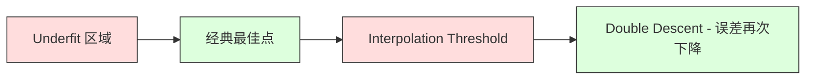
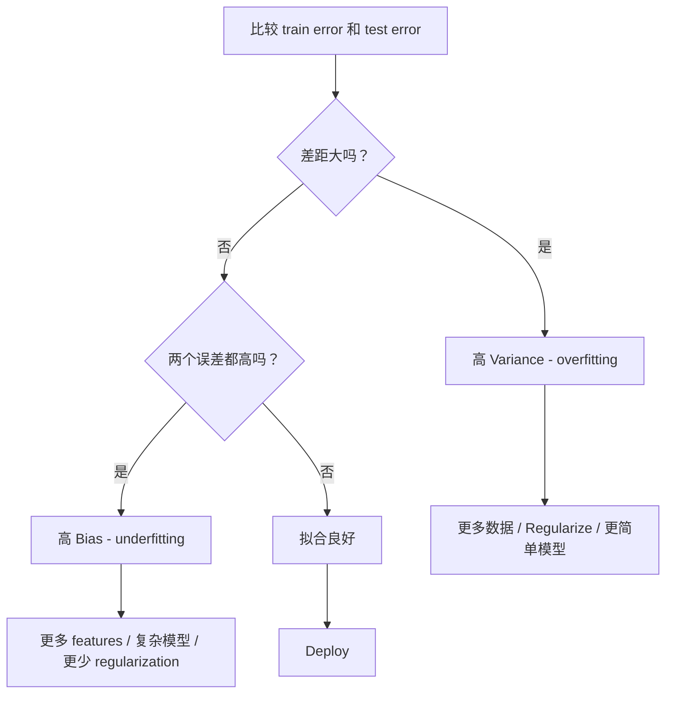
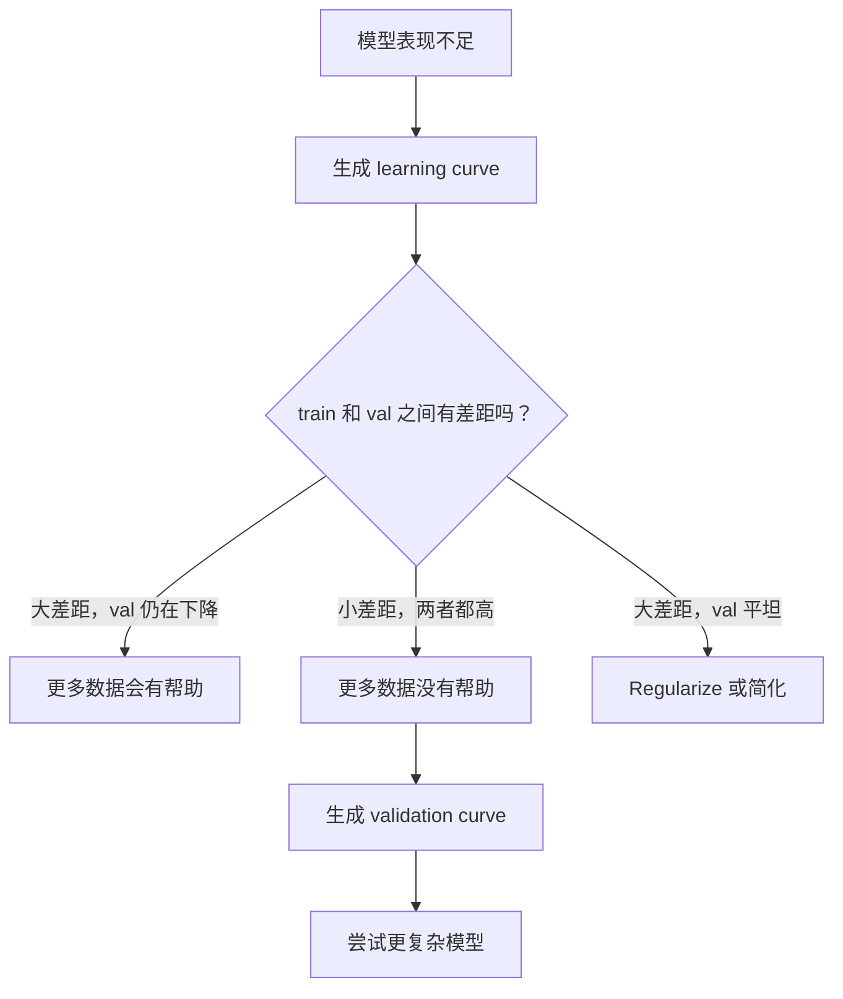

# Commerce des variantes partielles

> Chaque type d'erreur de modèle provient de trois sources: biais, variance ou bruit.

**Type:** Learn
**Language:**Python
**Prerequisites:** Phase 2, Lessons 01-09（ML 基础、Regression、Classification、评估）
**Time:** ~75 分钟

## Objectif de l'apprentissage
- 推导期望预测 erreur de la partition-variance
- Utilisation de l'entraînement de l'erreur et de l'essai de l'erreur mode de diagnostic modèle de l'existence de High Bias ou de High Variance
- 解释 Regroupement 技术(L1、L2、dérapagement、arrêt précoce) comment utiliser les préjugés 换取 Variance
- ¢ réaliser des expériences, des différences de complexité de la perception

##  problématique
Tu as entraîné un modèle. Il y a une erreur dans les données de test.

Si votre modèle est trop simple (par exemple, en utilisant la régression linéaire sur un ensemble de données), il continuera à errer sur le modèle réel. C'est le biais. Si votre modèle est trop complexe (par exemple, en utilisant un polynôme de degré 20 sur 15 points de données), il sera parfaitement adapté aux données d'entraînement, mais donnera une prédiction de changement radical sur les nouvelles données.

Pour une capacité de modèle fixe, vous ne pouvez pas les minimiser simultanément. Réduire les préjugés, augmenter les variantes, diminuer les variantes, augmenter les préjugés. Comprendre ce compromis est la compétence de diagnostic la plus utile dans le Machine Learning.

## 概念
### Préjugés: 系统性误差

Le biais est la mesure de la différence entre la moyenne du modèle et la valeur réelle. Si vous entraînez un modèle dans plusieurs ensembles d'entraînement différents de la même distribution, et que vous prenez la moyenne du modèle, le biais est la différence entre la moyenne et la valeur réelle.

Le "high bias" signifie que le modèle est trop dur, incapable de saisir le modèle réel.

```
高 Bias（underfitting）：
  模型总是预测大致相同的错误结果。
  训练误差：高
  测试误差：高
  二者差距：小
```

### Variance: sensibilité aux données de formation

La variance est mesurée par le nombre de changements prévus lorsque vous vous entraînez sur différents sous-sets de données. Si les petits changements du ensemble de formation entraînent de grands changements dans le modèle, la variance est très élevée.

La haute variance signifie que le modèle est dans le bruit des données de formation adaptées, et non le signal de base. Le polynôme de degré 20 traversera chaque point de formation, mais entre eux, il y aura une forte oscillation.

```
高 Variance（overfitting）：
  模型完美拟合训练数据，但在新数据上失败。
  训练误差：低
  测试误差：高
  二者差距：大
```

### La décomposition

Pour un point x, l'attente de prévision de l'erreur sous perte carrée peut être décomposée en:

```
Expected Error = Bias^2 + Variance + Irreducible Noise

where:
  Bias^2   = (E[f_hat(x)] - f(x))^2
  Variance = E[(f_hat(x) - E[f_hat(x)])^2]
  Noise    = E[(y - f(x))^2]             (sigma^2)
```

- `f(x)`est une vraie fonction
- `f_hat(x)`est un modèle pré测
- `E[...]`Il s'agit de l'expectative de formation différente.
- `y`est la marque de l'observation

Le bruit est incontournable. Dans les données de bruit, aucun modèle ne peut faire mieux que sigma^2.

### Complicité du modèle par rapport à l'erreur


经典的 U 形曲线:

| Complexity | Bias | Variance | Total Error |
|-----------|------|----------|-------------|
| 过低 | 高 | 低 | 高（underfitting） |
| 刚刚好 | 中等 | 中等 | 最低 |
| 过高 | 低 | 高 | 高（overfitting） |

### 作为偏差变化 控制的规范化

La régulation augmentera les préjugés pour réduire la variance. Elle réduira le modèle, ce qui l'empêchera de poursuivre le bruit.

- **L2 (Ridge):**Régler les caractéristiques mais réduire leur impact.
- **L1 (Lasso):**Pour effectuer la sélection des caractéristiques, il faut utiliser le même outil.
- **Dropout:**Pendant l'entraînement, vous devez désactiver les neurones.
- **Early stopping:**Arrêtez de vous entraîner avant que le modèle ne soit parfaitement adapté.

La régulation 强度(lambda、drop-out rate、epoch 数) va directement contrôler votre position sur la courbe de la variance biaisée―

### Double descente: 现代视角

La théorie classique pense que plus de complexité après le meilleur point est toujours nocif. Mais des études réalisées depuis 2019 montrent un phénomène imprévu. Si vous continuez à augmenter la capacité du modèle jusqu'à un seuil de distance de l'interpolation, le modèle a suffisamment de paramètres pour être parfaitement adapté à la position des données de formation, les erreurs de test peuvent à nouveau diminuer.



Ce "double descente" explique pourquoi les réseaux neuronaux surparamétrisés à grande échelle (paramètres de paramètres) peuvent encore être généralisés.

 À propos de la double descente 关键观察:
- Il apparaît dans les modèles linéaires, les arbres de décision et les réseaux neuronaux.
- Dans l'interpolation  région, plus de données en fait pourrait être nocif
- 更多训练 epochs 也可能导致它(double descente selon l'époque)
- La régulation aura un sommet de flattenage, mais ne l'éliminera pas.

Pourquoi cette situation se produit-elle? Au seuil d'interpolation, le modèle est suffisamment encombré pour s'adapter à tous les points d'entraînement. Il est contraint d'entrer dans une solution très spécifique, cette solution traversant chaque point, les petites perturbations dans les données entraînent des changements énormes dans le cadre de l'adaptation.

| Regime | Parameters vs Samples | Behavior |
|--------|----------------------|----------|
| Underparameterized | p << n | 经典 tradeoff 适用 |
| Interpolation threshold | p ~ n | Variance 达到峰值，测试误差激增 |
| Overparameterized | p >> n | Implicit regularization 开始起作用，测试误差下降 |

Dans la pratique, si vous utilisez des réseaux neuraux ou des ensembles d'arbres de grande taille, ne vous arrêtez pas sur le seuil d'interpolation.

### Comment diagnostiquer votre modèle



| Symptom | Diagnosis | Fix |
|---------|-----------|-----|
| 高 train error，高 test error | Bias | 更多 features、复杂模型、更少 regularization |
| 低 train error，高 test error | Variance | 更多数据、regularization、更简单模型、dropout |
| 低 train error，低 test error | 拟合良好 | Ship it |
| Train error 下降，test error 上升 | Overfitting 正在发生 | Early stopping |

### Des stratégies pratiques

**当 Bias 是问题时：**
- 添加 caractéristiques polynomial ou d'interaction
- Utiliser un modèle plus flexible (par exemple, en utilisant un ensemble d'arbres au lieu de linéaires)
- réduction de la résistance à la régularisation
- 訓練更久 (((si encore pas reçu)

**当 Variance 是问题时：**
- obtenir plus de données de formation
- Utilisation de sacs de bois aléatoires
- 增加 regularisation ((更高 lambda、更多 drop-out)
- Sélection de fonctionnalités (en éliminant les fonctions de bruit)
- Utilisez la validation croisée  Comme tôt vous le trouverez

### Métodes d'assemblage et de répartition

Les méthodes d'assemblage sont les outils les plus pratiques pour lutter contre la variance.

**Bagging (Bootstrap Aggregating)**Les différents échantillons de démarrage de données sont formés par des modèles différents, puis les prévisions sont effectuées en moyenne.

Il est efficace en mathématiques parce que si la moyenne N 个独立预测, chaque prédiction de la variance sont sigma^2, alors la variance de la valeur moyenne est sigma^2 / N. Ces modèles ne sont pas vraiment indépendants, ils voient tous des données similaires, donc la diminution de la magnitude est inférieure à 1/N, mais reste assez observable.

**Boosting**通过顺序构建模型来降低Bias, chacun des nouveaux modèles est centré sur les erreurs du ensemble actuel.  Gradient boosting 和 AdaBoost sont les principaux exemples.

| Method | Primary Effect | Bias Change | Variance Change |
|--------|---------------|-------------|-----------------|
| Bagging | 降低 Variance | 不变 | 降低 |
| Boosting | 降低 Bias | 降低 | 可能增加 |
| Stacking | 同时降低两者 | 取决于 meta-learner | 取决于 base models |
| Dropout | Implicit bagging | 略微增加 | 降低 |

**实践规则：**Si votre modèle de base a une grande variance, des arbres profonds, des polynômes de haut degré, utilisez le sachetage, si votre modèle de base a des particules, des troncs superficiels, des modèles linéaires simples, utilisez le boosting,

### Curves d'apprentissage

Les courbes d'apprentissage vont montrer les erreurs de formation et les erreurs d'essai dessinées pour les grandes fonctions de formation. Elles sont les outils de diagnostic les plus pratiques que vous ayez à votre disposition.


Comment les lire ?

| Scenario | Training Error | Validation Error | Gap | What It Means | What to Do |
|----------|---------------|-----------------|-----|---------------|------------|
| 高 Bias | 高 | 高 | 小 | 模型无法捕捉模式 | 更多 features、复杂模型、更少 regularization |
| 高 Variance | 低 | 高 | 大 | 模型记忆训练数据 | 更多数据、regularization、更简单模型 |
| 拟合良好 | 中等 | 中等 | 小 | 模型 generalizes well | Ship it |
| 高 Variance，正在改善 | 低 | 随更多数据下降 | 缩小 | 数据可以修复的 Variance 问题 | 收集更多数据 |
| 高 Bias，平坦 | 高 | 高且平坦 | 小且平坦 | 更多数据没有帮助 | 改变 model architecture |

关键洞察: si les deux courbes sont plateaux, la différence est petite mais les deux erreurs sont élevées, plus de données ne sont pas nécessaires. Vous avez besoin d'un meilleur modèle.

###  comment générer des courbes d'apprentissage

Il y a deux façons:

**Approach 1: 改变训练集大小，固定模型。**保持模型和超参数 不变──在越来越大的训练数据集上训练──测量每大小下训练误差和验证误差──这是一个标准学习曲线──

**Approach 2: 改变模型复杂度，固定数据。**保持数据不变──扫描一个复杂度参数(grade polynomial、arbre depth、layers 数量)──测量每个复杂度下训练误差和验证误差──这是验证曲线,会直接显示Bias-Variance Tradeoff──

Les deux méthodes se complètent. La première vous indique si plus de données sont utiles. La seconde vous indique si les différents modèles sont utiles. Avant de décider de la prochaine étape, les deux devraient fonctionner.




```figure
bias-variance
```

## - Je le construis.
`code/bias_variance.py`Le code de base est le code de base de la base de données.

### Étape 1: générer des données synthétiques à partir de fonctions connues

Nous utilisons le bruit gaussien.`f(x) = sin(1.5x) + 0.5x`◊ savoir les vraies fonctions nous permettent de calculer avec précision les biais et les variations.

```python
def true_function(x):
    return np.sin(1.5 * x) + 0.5 * x

def generate_data(n_samples=30, noise_std=0.5, x_range=(-3, 3), seed=None):
    rng = np.random.RandomState(seed)
    x = rng.uniform(x_range[0], x_range[1], n_samples)
    y = true_function(x) + rng.normal(0, noise_std, n_samples)
    return x, y
```

### 步骤 2: Prise d'échantillons de démarrage et ajustement polynomial

Pour chaque degré polynomial, nous avons tiré de nombreux ensembles de formation de démarrage, adapté à un polynôme et fixé à la grille de test.

```python
def fit_polynomial(x_train, y_train, degree, lam=0.0):
    X = np.column_stack([x_train ** d for d in range(degree + 1)])
    if lam > 0:
        penalty = lam * np.eye(X.shape[1])
        penalty[0, 0] = 0
        w = np.linalg.solve(X.T @ X + penalty, X.T @ y_train)
    else:
        w = np.linalg.lstsq(X, y_train, rcond=None)[0]
    return w
```

Nous avons 200 échantillons de démarrage différents, chacun tiré de la même distribution de basse-planche, mais contenant des points différents.

### 步骤 3: calcul des biais^2, décomposition des variantes

Avec 200 groupes de prédictions sur chaque test, nous pouvons directement calculer selon la définition:

```python
mean_pred = predictions.mean(axis=0)
bias_sq = np.mean((mean_pred - y_true) ** 2)
variance = np.mean(predictions.var(axis=0))
total_error = np.mean(np.mean((predictions - y_true) ** 2, axis=1))
```

- `mean_pred`est de l'échantillon de démarrage  estimation de E[f_hat(x)
- `bias_sq`est le carré de la différence entre la moyenne prédiction et la valeur réelle
- `variance`Prévision moyenne de la dispersion
- `total_error` devrait approximation égale à biais^2 + variance + bruit

### 步骤 4: Curves d'apprentissage

Les courbes d'apprentissage dans le maintien du modèle de complexité fixe en même temps de la sélection de formation. Elles montrent que votre modèle est limité par les données ou par la capacité.

```python
def demo_learning_curves():
    sizes = [10, 15, 20, 30, 50, 75, 100, 150, 200, 300]
    degree = 5

    for n in sizes:
        train_errors = []
        test_errors = []
        for seed in range(50):
            x_train, y_train = generate_data(n_samples=n, seed=seed * 100)
            w = fit_polynomial(x_train, y_train, degree)
            train_pred = predict_polynomial(x_train, w)
            train_mse = np.mean((train_pred - y_train) ** 2)
            test_pred = predict_polynomial(x_test, w)
            test_mse = np.mean((test_pred - y_test) ** 2)
            train_errors.append(train_mse)
            test_errors.append(test_mse)
        # 对多次运行取平均，得到 learning curve 上的点
```

Pour le niveau 5 de la petite data, vous verrez:
- L'erreur d'entraînement commence à être faible, avec plus de données, la mémoire devient difficile à améliorer.
- L'erreur de test est très élevée et diminue avec l'obtention de plus de signaux.
-  La différence s'est accrue avec plus de données

Pour les modèles de haute partialité (grade 1), deux erreurs sont rapidement accumulées jusqu'à la même haute valeur, plus de données n'ont pas aidé.

### 第5 步:Soupe de réglementation

代码 également contenu `demo_regularization_sweep()`, il fixe un polynôme de haut degré (grade 15), et il va faire passer la force de régulation de la crête de 0,001 à 100 扫描.

```python
def demo_regularization_sweep():
    alphas = [0.001, 0.005, 0.01, 0.05, 0.1, 0.5, 1.0, 5.0, 10.0, 50.0, 100.0]
    for alpha in alphas:
        results = bias_variance_decomposition([15], lam=alpha)
        r = results[15]
        print(f"alpha={alpha:.3f}  bias={r['bias_sq']:.4f}  var={r['variance']:.4f}")
```

Dans le bas alpha, le polynôme de degré 15 est presque indéfectible. La variance domine, car le modèle poursuit le bruit de chaque échantillon de démarrage.

Cette modification du degré polynomial est obtenue par la même U 曲线, mais ici elle est contrôlée par la rotation continue plutôt que par les options dispersées.

## Utilisez-le
magasin  fournir `learning_curve`et `validation_curve`On peut automatiser ces diagnostics sans avoir à rédiger des boucles de démarrage.

### Curve de validation: analyse de la complexité du modèle

```python
from sklearn.model_selection import validation_curve
from sklearn.pipeline import make_pipeline
from sklearn.preprocessing import PolynomialFeatures
from sklearn.linear_model import Ridge

degrees = list(range(1, 16))
train_scores_all = []
val_scores_all = []

for d in degrees:
    pipe = make_pipeline(PolynomialFeatures(d), Ridge(alpha=0.01))
    train_scores, val_scores = validation_curve(
        pipe, X, y, param_name="polynomialfeatures__degree",
        param_range=[d], cv=5, scoring="neg_mean_squared_error"
    )
    train_scores_all.append(-train_scores.mean())
    val_scores_all.append(-val_scores.mean())
```

Ceci vous donnera directement des résultats de validation par rapport au score du train, la différence est la plus faible.

### Curve d'apprentissage: taille de l'ensemble de formation

```python
from sklearn.model_selection import learning_curve

pipe = make_pipeline(PolynomialFeatures(5), Ridge(alpha=0.01))
train_sizes, train_scores, val_scores = learning_curve(
    pipe, X, y, train_sizes=np.linspace(0.1, 1.0, 10),
    cv=5, scoring="neg_mean_squared_error"
)
train_mse = -train_scores.mean(axis=1)
val_mse = -val_scores.mean(axis=1)
```

Il va`train_mse`et `val_mse`Par rapport à`train_sizes`Le dessin de la forme de la courbe vous dira tout sur le modèle.

### Utilisation de la régulation 扫描的 横验证

```python
from sklearn.model_selection import cross_val_score

alphas = [0.001, 0.01, 0.1, 1.0, 10.0, 100.0]
for alpha in alphas:
    pipe = make_pipeline(PolynomialFeatures(10), Ridge(alpha=alpha))
    scores = cross_val_score(pipe, X, y, cv=5, scoring="neg_mean_squared_error")
    print(f"alpha={alpha:>7.3f}  MSE={-scores.mean():.4f} +/- {scores.std():.4f}")
```

Ceci va être la force de régularisation du modèle fixe de complexité de scan. Vous verrez la même différence de biais: faible alpha signifie haute variance, haute alpha signifie haut biais.

### 整合起来: dépistage complet du flux de travail

En pratique, vous allez faire ces diagnostics en ordre:

1. 訓練你的模型──計算列車 和 測試錯誤──
2. Si les deux sont élevés: tu as des préjugés  problème ∞
3. Si le train est bas mais le test est élevé, vous avez des variations, vous pouvez générer une courbe d'apprentissage, et voir si vous avez plus de données.
4. Pour obtenir la courbe de validation, analysez les paramètres de complexité de votre système.
5. Dans le meilleur des cas, générez une courbe d'apprentissage. Si le décalage reste important, vous aurez besoin de plus de données ou de régularisation.
6. Utilisation `cross_val_score`尝试不同 alpha 值的Ridge/Lasso──selection d'erreur validée croisée, le plus bas de l'alpha──

Pour la plupart des ensembles de données de table, cela prend 10-15 minutes de temps de calcul, mais peut économiser quelques heures de devinettes.

## Je le livre.
Le programme de formation`outputs/prompt-model-diagnostics.md`

## 练习
1. Utilisation `noise_std=0`(sans bruit) La fonctionnement de la résolution.

2. La taille du groupe d'entraînement va augmenter de 30 à 300. Comment cela affectera-t-il la composante de variance?

3. Pour un polynôme de degré élevé fixe, le lambda va passer de 0 à 100, le biais de dessin à 2 et la variance avec le lambda.

4. 将真实函数 du polynôme 修改为 `sin(x)`◊ La variance de partialité, la différence de différence, la différence de différence, la différence de différence entre les deux, la différence de différence entre les deux, la différence de différence entre les deux, la différence de différence entre les deux, la différence de différence entre les deux, la différence de différence entre les deux, la différence de différence entre les deux, la différence de différence entre les deux, la différence de différence entre les deux, la différence de différence entre les deux et la différence de différence entre les deux, la différence de différence entre les deux, la différence de différence de différence entre les deux, la différence de différence entre les deux, la différence de différence entre les deux, la différence de différence entre les deux, la différence de différence entre les deux et la différence entre les deux, la différence de différence entre les deux, est encore plus claire et la différente.

5. 实现一个简单的bootstrap aggregation(bagging)wrapper:在bootstrap échantillons 上训练 10 个模型并平均预测──展示 这会降低变化,且几乎不增加偏见──

## 关键术语
| Term | What people say | What it actually means |
|------|----------------|----------------------|
| Bias | “模型太简单” | 来自错误假设的系统性误差。平均模型预测与真实值之间的差距。 |
| Variance | “模型在 overfitting” | 来自对训练数据敏感性的误差。预测在不同训练集之间变化的程度。 |
| Irreducible error | “数据中的噪声” | 来自真实数据生成过程中的随机性的误差。没有模型能消除它。 |
| Underfitting | “学得不够” | 模型有高 Bias。即使在训练数据上也会错过真实模式。 |
| Overfitting | “记住了数据” | 模型有高 Variance。它拟合了训练数据中无法 generalize 的噪声。 |
| Regularization | “约束模型” | 添加惩罚来降低模型复杂度，用 Bias 换取更低 Variance。 |
| Double descent | “更多参数可能有帮助” | 当模型容量远超 interpolation threshold 时，测试误差会再次下降。 |
| Model complexity | “模型有多灵活” | 模型拟合任意模式的容量。由 architecture、features 或 regularization 控制。 |

## 延伸阅读
- [Hastie, Tibshirani, Friedman: Elements of Statistical Learning, Ch. 7](https://hastie.su.domains/ElemStatLearn/)-- Bias-Variance 分解的权威论述
- [Belkin et al., Reconciling modern machine learning practice and the bias-variance trade-off (2019)](https://arxiv.org/abs/1812.11118)-- double descente 论文
- [Nakkiran et al., Deep Double Descent (2019)](https://arxiv.org/abs/1912.02292)-- de l'époque et de l'échantillon, double descente
- [Scott Fortmann-Roe: Understanding the Bias-Variance Tradeoff](http://scott.fortmann-roe.com/docs/BiasVariance.html)-- 清晰的可视化解释
