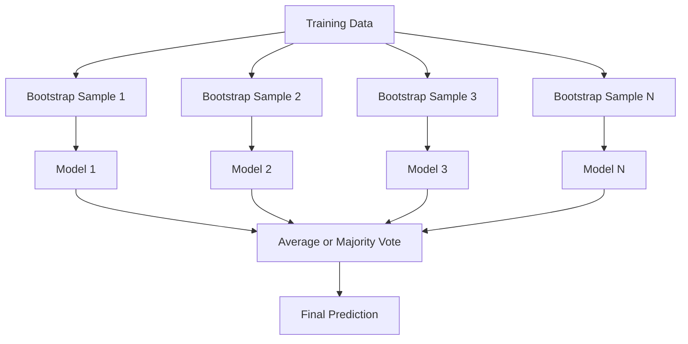
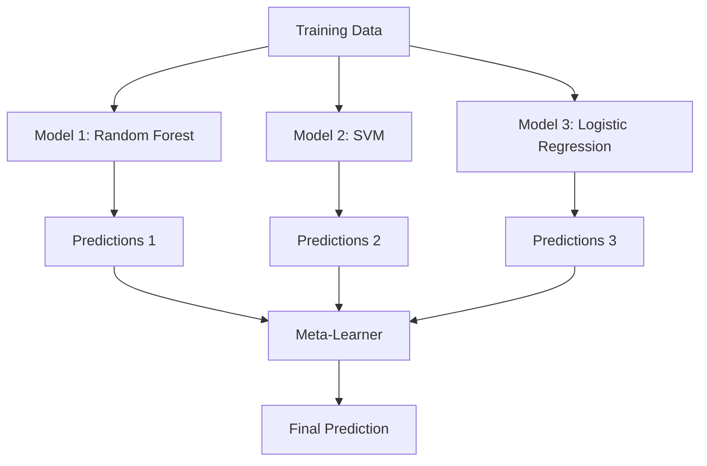

# Métodes de mise en œuvre

> Un groupe d'apprenants faibles, si correctement assemblé, deviendra un apprenant fort. Ce n'est pas une métaphore.

**Type:** Build
**Language:**Python
**Prerequisites:** Phase 2, Lesson 10 (Bias-Variance Tradeoff)
**Time:** ~120 分钟

## Objectif de l'apprentissage

- De la réalisation de AdaBoost et de la hausse du gradient,并 expliquer la hausse  comment selon l'ordre réduire le biais
- Construire un ensemble de sacs, et démontrer comment réduire la variance en cas de biais non accru à la moyenne pour les modèles associés
- Comparer les composants d'erreur à chaque méthode avec le stockage, le renforcement et l'empilage
-  évaluer la diversité de l'ensemble,并 expliquer pourquoi avec l'adhésion de plus de jeunes indépendants faibles, la précision du vote majoritaire augmentera

##  problématique

单个决策树 训练速度快且易解释,但会过. 单个线性模型 在复杂边界上会过. 您可以花几天时间设计完美的模型架构. 或, vous pouvez assembler un lot de modèles imparfaits, obtenir un meilleur résultat que n'importe lequel d'entre eux.

Les méthodes d'assemblage sont faites ainsi. Elles sont basées sur des données tablulaires, gagnent la compétition Kaggle, sont les techniques les plus fiables, supportent la plupart des systèmes de production ML, et démontrent vivement l'effet réel de l'échange de variance-bias.

## 概念

### Pourquoi les ensembles sont efficaces

假设你有N 个独立分类器,每个的精度都是p > 0.5──la majorité du vote est exacte 为:

```
P(majority correct) = sum over k > N/2 of C(N,k) * p^k * (1-p)^(N-k)
```

Pour les 21 catégories, la précision moyenne est de 60%, la majorité des voix est d'environ 74%. Si les 101 catégories sont présentes, elles augmentent à 84%.

关键要求是 **diversity**Si tous les modèles commettent les mêmes erreurs, leur assemblage ne leur est d'aucune aide.

- Il y a des trucs à faire.
- ∆ ∆ ∆ ∆ ∆ ∆ ∆ ∆ ∆ ∆ ∆ ∆ ∆ ∆ ∆ ∆ ∆ ∆ ∆ ∆ ∆ ∆ ∆ ∆ ∆ ∆ ∆ ∆ ∆ ∆ ∆ ∆ ∆ ∆ ∆ ∆ ∆ ∆ ∆ ∆ ∆ ∆ ∆ ∆ ∆ ∆ ∆ ∆ ∆ ∆ ∆ ∆ ∆ ∆ ∆ ∆ ∆ ∆ ∆ ∆ ∆ ∆ ∆ ∆ ∆ ∆ ∆ ∆ ∆ ∆ ∆ ∆ ∆ ∆ ∆ ∆ ∆ ∆ ∆ ∆ ∆ ∆ ∆ ∆ ∆ ∆ ∆ ∆ ∆ ∆ ∆ ∆ ∆ ∆ ∆ ∆ ∆ ∆ ∆ ∆ ∆ ∆ ∆ ∆ ∆ ∆ ∆ ∆ ∆ ∆ ∆ ∆ ∆ ∆ ∆ ∆ ∆ ∆ ∆ ∆ ∆ ∆ ∆ ∆ ∆ ∆ ∆ ∆ ∆ ∆ ∆ ∆ ∆ ∆ ∆ ∆ ∆ ∆ ∆ ∆ ∆ ∆ ∆ ∆ ∆ ∆ ∆ ∆ ∆ ∆ ∆ ∆ ∆ ∆ ∆ ∆ ∆ ∆ ∆ ∆ ∆ ∆ ∆ ∆ ∆ ∆ ∆ ∆ ∆ ∆ ∆ ∆ ∆ ∆ ∆ ∆ ∆ ∆ ∆ ∆ ∆ ∆ ∆ ∆ ∆ ∆ ∆ ∆ ∆ ∆ ∆ ∆ ∆ ∆ ∆ ∆ ∆ ∆ ∆ ∆ ∆ ∆ ∆ ∆ ∆ ∆ ∆ ∆ ∆ ∆ ∆ ∆ ∆ ∆ ∆ ∆ ∆ ∆ ∆ ∆ ∆ ∆ ∆ ∆ ∆ ∆ ∆ ∆ ∆ ∆ ∆ ∆ ∆ ∆ ∆ ∆ ∆ ∆ ∆ ∆ ∆ ∆ ∆ ∆ ∆ ∆ ∆ ∆ ∆ ∆ ∆ ∆ ∆ ∆ ∆
- 顺序式 correction d'erreur(boosting)
- Il y a des gens qui ont des problèmes avec les autres.

### Les produits de la fabrication de boîtes de chargement

Enregistrez les données de chaque modèle de formation en un échantillon de démarrage différent.



L'échantillon de la bande de démarrage est le même que celui obtenu dans les données originales. Pour chaque bande de démarrage, 63,2% des échantillons uniques sont présents.

Le sachetage réduit la variance en cas de biais presque inaugmenté. Chaque arbre individuel est surchargé avec son propre échantillon de démarrage, mais le surchargement de chaque arbre est différent, ce qui nécessite une moyenne de réduction du bruit.

**Random Forests**Il est nécessaire de prendre en compte le sous-ensemble des caractéristiques de chaque division. Cela oblige les arbres à produire plus de diversité.`sqrt(n_features)`, ainsi que la régression`n_features / 3`Il y a une autre.

### Boosting(顺序式 Correction d'erreur)

Encourager le modèle suivant l'ordre de formation. Chaque nouveau modèle est concerné par des exemples de précédents faux modèle.


Augmentation  Réduction des préjugés― Chaque nouveau modèle sera corrigé correctement par les erreurs systémiques de l'ensemble― La prédiction finale est la somme pondérée de tous les modèles, dont les meilleurs modèles qui exécutent obtiendront un poids plus élevé―

Le poids réside dans le fait que si le rouleau est trop long, le booster peut être trop long, car il peut être adapté à des exemples plus difficiles, et certains d'entre eux peuvent être simplement du bruit.

### AdaBoost

AdaBoost (Boosting adaptatif) est le premier algorithme de boosting pratique. Il peut être utilisé avec n'importe quel apprenant de base, généralement avec des troncs de décision de profondeur à un arbre).

- Je suis un peu déçu.

```
1. Initialize sample weights: w_i = 1/N for all i

2. For t = 1 to T:
   a. Train weak learner h_t on weighted data
   b. Compute weighted error:
      err_t = sum(w_i * I(h_t(x_i) != y_i)) / sum(w_i)
   c. Compute model weight:
      alpha_t = 0.5 * ln((1 - err_t) / err_t)
   d. Update sample weights:
      w_i = w_i * exp(-alpha_t * y_i * h_t(x_i))
   e. Normalize weights to sum to 1

3. Final prediction: H(x) = sign(sum(alpha_t * h_t(x)))
```

Les échantillons de catégories erronées obtiennent des poids plus élevés, laissez le modèle suivant se concentrer sur eux.

### Un accroissement progressif

Le boosting du gradient augmentera la fonction de perte de puissance à l'échelle de l'échantillon, mais permettra à chaque nouveau modèle de s'adapter aux résidus de l'ensemble actuel.

```
1. Initialize: F_0(x) = argmin_c sum(L(y_i, c))

2. For t = 1 to T:
   a. Compute pseudo-residuals:
      r_i = -dL(y_i, F_{t-1}(x_i)) / dF_{t-1}(x_i)
   b. Fit a tree h_t to the residuals r_i
   c. Find optimal step size:
      gamma_t = argmin_gamma sum(L(y_i, F_{t-1}(x_i) + gamma * h_t(x_i)))
   d. Update:
      F_t(x) = F_{t-1}(x) + learning_rate * gamma_t * h_t(x)

3. Final prediction: F_T(x)
```

Pour les pertes d'erreur carrée, les pseudo-résidus sont les résidus réels:`r_i = y_i - F_{t-1}(x_i)`◊ Chaque arbre est en fait un ensemble de fausses couleurs.

Le taux d'apprentissage (%) est réduit. Le taux d'apprentissage (%) est réduit.

### XGBoost: Pourquoi est-ce qu'il est à la recherche de données tabulaires

XGBoost (eXtreme Gradient Boosting) est un ajout de gradient de l'amélioration de l'ingénierie, ce qui rend son rapide, précis, et pas facile de surpasser:

- **Regularized objective:**Pour les poids de feuilles, l'ajout de pénalités de L1 et L2, prévenir la surestimation d'un seul arbre
- **Second-order approximation:**En même temps, utiliser les dérivés de première et deuxième phase de la perte, afin de prendre de meilleures décisions de division
- **Sparsity-aware splits:**En apprenant la meilleure direction des données manquantes en chaque fraction, l'origine traite les valeurs manquantes
- **Column subsampling:**Comme les forêts aléatoires, en particulier, les caractéristiques de chaque division sont prises pour augmenter la diversité.
- **Weighted quantile sketch:**Dans les données distribuées 上高效 rechercher des caractéristiques continues des points de fractionnement
- **Cache-aware block structure:** Pour les lignes de cache de la CPU  Optimisation de la mise en page de la mémoire

Pour les données de table, XGBoost (et son successeur LightGBM) continue d'être supérieur au réseau neuronal. Cela ne changera pas à court terme. Si vos données peuvent être placées dans les lignes et les colonnes du tableau, veuillez commencer par le gradient boosting.

### L'accumulation (méta-apprentissage)

L'empilage va permettre de prévoir plusieurs modèles de base  en tant que caractéristiques du méta-apprenant



Si la forêt aléatoire se déplace mieux dans certaines régions, tandis que la SVM se déplace mieux dans d'autres, le méta-apprenant apprend à se déplace sur un chemin.

Pour éviter la fuite de données, les prédictions de modèles de base doivent passer par un ensemble de formation de validation croisée.

### Le vote

Les prédictions de l'ensemble sont les plus simples.

- **Hard voting:**Pour les étiquettes de classe  vote majoritaire 
- **Soft voting:**Pour les probabilités prévues, choisissez la probabilité moyenne la plus élevée.


```figure
f3-ensemble-average
```

## - Je le construis.

### 步骤 1: Décision Stump (apprenant de base)

`code/ensembles.py`Le code central de la pièce de code de la pièce de code de la pièce de code de la pièce de code de la pièce de code de la pièce de code de la pièce de code de code de la pièce de code de la pièce de code de code de la pièce de code de code de la pièce de code de code de la pièce de code de code de la pièce de code de code de la pièce de code de code de la pièce de code de code de la pièce de code de la pièce de code de la pièce de code de code de la pièce de code de code de la pièce de code de la pièce de code de code de la pièce de code de code de la pièce de code de la pièce de code de la pièce de code de la pièce de code de la pièce de code de la pièce de code de la pièce de code de la pièce de code de la pièce de code de la pièce de code de la pièce de la pièce de code de la pièce de code de la pièce de la pièce de la pièce de code de la pièce de la pièce de la pièce de la pièce de la pièce de la pièce de la pièce de la pièce de la pièce de la pièce de la pièce de la pièce de la pièce de la pièce de la pièce de la pièce de la pièce de la pièce de la pièce de la pièce de la pièce de la pièce de la pièce de la pièce de la pièce de la pièce de la pièce de la pièce de la pièce de la pièce de la pièce de la pièce de la pièce de la pièce de la pièce de la décide de la décide de la décide de la décide de la décide de la décide de la décide de la décide de la décide de la décide de la décide de décide de décide de décide de décide de décide de décide de décide de décide de décide de décide de décide de décide de décide de décide de décide de décide de décide de décide de décide de décide de décide de décide de décide de décide de décide de décide de décide de décide de décide de décide de décide de décide de décide de décide de décide de décide de décide de décide de décide de décide de décide de décide de décide de décide de décide de décide de décide de décide de décide de décide

```python
class DecisionStump:
    def __init__(self):
        self.feature_idx = None
        self.threshold = None
        self.polarity = 1
        self.alpha = None

    def fit(self, X, y, weights):
        n_samples, n_features = X.shape
        best_error = float("inf")

        for f in range(n_features):
            thresholds = np.unique(X[:, f])
            for thresh in thresholds:
                for polarity in [1, -1]:
                    pred = np.ones(n_samples)
                    pred[polarity * X[:, f] < polarity * thresh] = -1
                    error = np.sum(weights[pred != y])
                    if error < best_error:
                        best_error = error
                        self.feature_idx = f
                        self.threshold = thresh
                        self.polarity = polarity

    def predict(self, X):
        n = X.shape[0]
        pred = np.ones(n)
        idx = self.polarity * X[:, self.feature_idx] < self.polarity * self.threshold
        pred[idx] = -1
        return pred
```

### 步骤 2: Déployer AdaBoost à partir de zéro

```python
class AdaBoostScratch:
    def __init__(self, n_estimators=50):
        self.n_estimators = n_estimators
        self.stumps = []
        self.alphas = []

    def fit(self, X, y):
        n = X.shape[0]
        weights = np.full(n, 1 / n)

        for _ in range(self.n_estimators):
            stump = DecisionStump()
            stump.fit(X, y, weights)
            pred = stump.predict(X)

            err = np.sum(weights[pred != y])
            err = np.clip(err, 1e-10, 1 - 1e-10)

            alpha = 0.5 * np.log((1 - err) / err)
            weights *= np.exp(-alpha * y * pred)
            weights /= weights.sum()

            stump.alpha = alpha
            self.stumps.append(stump)
            self.alphas.append(alpha)

    def predict(self, X):
        total = sum(a * s.predict(X) for a, s in zip(self.alphas, self.stumps))
        return np.sign(total)
```

### 步骤 3: Réalisation du Boosting Gradient à partir de zéro

```python
class GradientBoostingScratch:
    def __init__(self, n_estimators=100, learning_rate=0.1, max_depth=3):
        self.n_estimators = n_estimators
        self.lr = learning_rate
        self.max_depth = max_depth
        self.trees = []
        self.initial_pred = None

    def fit(self, X, y):
        self.initial_pred = np.mean(y)
        current_pred = np.full(len(y), self.initial_pred)

        for _ in range(self.n_estimators):
            residuals = y - current_pred
            tree = SimpleRegressionTree(max_depth=self.max_depth)
            tree.fit(X, residuals)
            update = tree.predict(X)
            current_pred += self.lr * update
            self.trees.append(tree)

    def predict(self, X):
        pred = np.full(X.shape[0], self.initial_pred)
        for tree in self.trees:
            pred += self.lr * tree.predict(X)
        return pred
```

### 步骤 4: Comparer avec les produits

La rédaction de la série de films de la série de télévision de l'année dernière a été un succès.`AdaBoostClassifier`et `GradientBoostingClassifier`Par rapport à la précision, il fera tous les méthodes.

## Utilisez-le

### Pourquoi utiliser chaque méthode

| Method | Reduces | Best for | Watch out for |
|--------|---------|----------|---------------|
| Bagging / Random Forest | Variance | noisy data、features 很多 | 对 bias 没有帮助 |
| AdaBoost | Bias | clean data、简单 base learners | 对 outliers 和 noise 敏感 |
| Gradient Boosting | Bias | tabular data、比赛 | 训练慢，不调参容易 overfit |
| XGBoost / LightGBM | Both | 生产环境 tabular ML | hyperparameters 很多 |
| Stacking | Both | 争取最后 1-2% accuracy | 复杂，存在 meta-learner overfitting 风险 |
| Voting | Variance | 快速组合 diverse models | 只有在模型足够 diverse 时才有帮助 |

### Tableau de données de la pile de production

Pour la plupart des problèmes de prédiction tabulaire, il est recommandé de suivre les séries suivantes:

1. Utilisation de paramètres**LightGBM 或 XGBoost**
2. 调优 n_estimators、apprentissage_rate、max_depth、min_child_weight
3. Si vous avez besoin d'une amélioration de 0,5%, construisez un ensemble d'empilage contenant 3-5 modèles divers
4. Vérification croisée

Bien que les recherches soient toujours en cours, les données de table neurales augmentent presque toujours la différence entre les gradients.

## Je le livre.

本课会产出 `outputs/prompt-ensemble-selector.md`-- un guide pour vous aider à déterminer un ensemble de données  choisir une méthode adaptée à l'ensemble                                                                                                                                                                                                                                                                                                                                                                                                                                                                                                     `outputs/skill-ensemble-builder.md`, dont contient une orientation de sélection complète.

## 练习

1. Modifier AdaBoost 实现, suivre la précision de formation après chaque tour.

2. 通过向归 regression tree 添加随机特征子样本,从零实现一个随机森林──使用 `max_features=sqrt(n_features)`訓練 100 arbres et les prédictions 求平均──将变化减少与单树比较──

3. Dans le cadre de la mise en place de la mise en place de la mise en place de la mise en place de la mise en place de la mise en place de la mise en place de la mise en œuvre de la mise en place de la mise en œuvre de la mise en œuvre de la mise en œuvre de la mise en œuvre de la mise en œuvre de la mise en œuvre de la mise en œuvre de la mise en œuvre de la mise en œuvre de la mise en œuvre de la mise en œuvre de la mise en œuvre de la mise en œuvre de la mise en œuvre de la mise en œuvre de la mise en œuvre de la mise en œuvre de la mise en œuvre de la mise en œuvre de la mise en œuvre de la mise en œuvre de la mise en œuvre de la mise en œuvre de la mise en œuvre de la mise en œuvre de la mise en œuvre de la mise en œuvre de la mise en œuvre de la mise en œuvre de la mise en œuvre de la mise en œuvre de la mise en œuvre de la mise en œuvre de la mise en œuvre de la mise en œuvre de la mise en œuvre de la mise en œuvre de la mise en œuvre de la mise en œuvre de la mise en œuvre de la mise en œuvre de la mise en œuvre de la mise en œuvre de la mise en œuvre de la mise de la mise de la mise en œuvre de la mise en œuvre de la mise de la mise en œuvre de la mise en œuvre de la mise de la mise en œuvre de la mise de la mise en date de la mise en date de la mise de la mise en date de la mise de la mise en date de la mise en date de la mise en date de la mise en date de la mise en date de la mise en date de la mise en date de la mise en date de la mise en date de la mise en date de la mise en date de la mise en date de la mise en date de la mise en date de la mise en date de la mise en date de la mise en date de la mise en date de la mise en date de la mise en date de la mise en date de la mise en date de la mise en date de la mise en date de la mise en date de la mise en date de la mise en.

4. Construire un ensemble de mise en pile de trois modèles de base (régrésion logistique, arbre de décision, voisins les plus proches) et un ensemble de méta-apprenant de régression logistique ⋅ utiliser une validation croisée 5 fois 生成 méta-features──与每一个基模型 单独使用时比较──

5. Dans le même ensemble de données, utilisez des paramètres par défaut pour exécuter XGBoost. Sa précision augmentera-t-elle avec votre gradient de zéro, augmentant la comparaison?

## 关键术语

| Term | 常见说法 | 实际含义 |
|------|----------------|----------------------|
| Bagging | “在 random subsets 上训练” | Bootstrap aggregating：在 bootstrap samples 上训练模型，对 predictions 求平均以降低 variance |
| Boosting | “关注 hard examples” | 按顺序训练模型，每个模型纠正当前 ensemble 的错误，以降低 bias |
| AdaBoost | “重新加权数据” | 通过 sample weight updates 实现 boosting；misclassified points 会在下一个 learner 中获得更高 weight |
| Gradient boosting | “拟合 residuals” | 通过让每个新模型拟合 Loss Function 的 negative Gradient 来实现 boosting |
| XGBoost | “Kaggle 武器” | 带有 regularization、second-order optimization 和系统级加速技巧的 gradient boosting |
| Stacking | “模型叠在模型上” | 将 base models 的 predictions 作为 meta-learner 的 input features |
| Random forest | “许多 randomized trees” | 使用 decision trees 的 bagging，并在每次 split 时加入 random feature subsampling 以增加 diversity |
| Ensemble diversity | “犯不同错误” | 模型的错误必须不相关，ensemble 才能优于单个模型 |
| Out-of-bag error | “免费 validation” | 不在某次 bootstrap draw 中的 samples（约 36.8%）可作为 validation set，无需单独 holdout |

## 延伸阅读

- [Schapire & Freund: Boosting: Foundations and Algorithms](https://mitpress.mit.edu/9780262526036/)-- AdaBoost 创建者所著的书
- [Friedman: Greedy Function Approximation: A Gradient Boosting Machine (2001)](https://statweb.stanford.edu/~jhf/ftp/trebst.pdf)-- Origini gradient augmentation 论文
- [Chen & Guestrin: XGBoost (2016)](https://arxiv.org/abs/1603.02754)-- XGBoost 论文
- [Wolpert: Stacked Generalization (1992)](https://www.sciencedirect.com/science/article/abs/pii/S0893608005800231)-- Origini stacking 论文
- [scikit-learn Ensemble Methods](https://scikit-learn.org/stable/modules/ensemble.html)-- 实用参考
