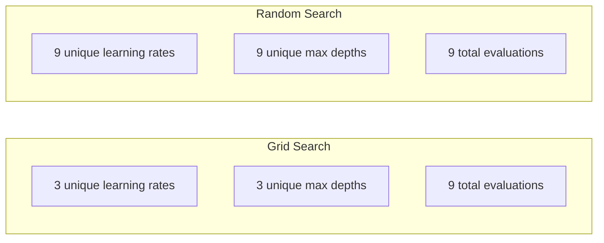
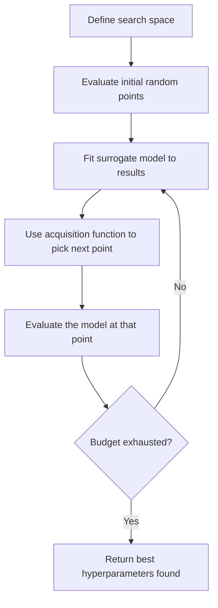
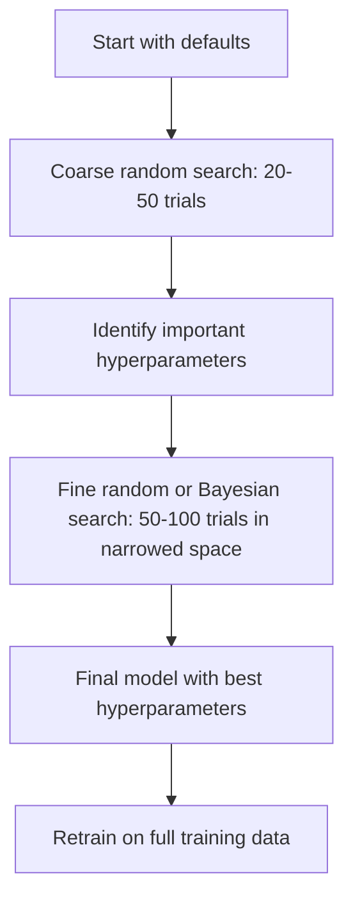
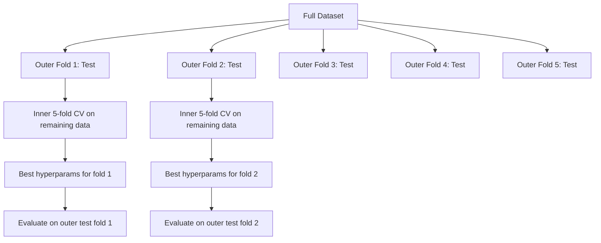

# Téléchargement des paramètres

> Les hyperparametres sont les paramètres de la rotation que vous devez régler avant de commencer à vous entraîner.

**Type:** Build
**Language:**Python
**Prerequisites:** Phase 2, Lesson 11 (Ensemble Methods)
**Time:** ~90 分钟

## Objectif de l'apprentissage
- À partir de la recherche à la grille à zéro, la recherche aléatoire et l'optimisation bayésienne, et comparer leur efficacité de prise de données
- Expliquer pourquoi lorsque la plupart des hyperparametres ont une dimension valide inférieure, la recherche aléatoire sera meilleure que la recherche en grille
- Utiliser le modèle de substitution 和 fonction d'acquisition  Construire l'optimisation bayésienne  cycle pour guider la recherche
-  concevoir un type d'hyperparamètre de réglage  stratégie, par la validation croisée adaptée  éviter de s'adapter à un ensemble de validation 

##  problématique
Votre gradient augmentant 模型 a le taux d'apprentissage, le nombre d'arbres, la profondeur maximale, les échantillons min par feuille, le ratio de sous-échantillons et le ratio d'échantillons de colonnes, c'est-à-dire six hyperparametres. Si chacun a 5 valeurs raisonnables, alors la grille a 5^6 = 15,625 espèces de composés.

La recherche au réseau est la méthode la plus intuitive, mais aussi la plus mauvaise. La recherche au hasard avec moins de calcul peut être mieux réalisée. L'optimisation bayésienne, en apprenant à partir de l'évaluation passée, améliore également les résultats.

## 概念
### Paramètres contre hyperparamètres

Les paramètres sont des paramètres que l'on apprend dans le processus d'entraînement (pesoirs, préjugés, seuils séparés).

| Hyperparameter | 控制什么 | 典型范围 |
|---------------|-----------------|---------------|
| Learning rate | 每次更新的步长 | 0.001 到 1.0 |
| Number of trees/epochs | 训练时长 | 10 到 10,000 |
| Max depth | 模型复杂度 | 1 到 30 |
| Regularization (lambda) | 防止过拟合 | 0.0001 到 100 |
| Batch size | Gradient 估计噪声 | 16 到 512 |
| Dropout rate | 被丢弃的 neurons 比例 | 0.0 到 0.5 |

### Recherche de la grille

La recherche de grille évaluera chaque composition de valeur déterminée.

```
Grid for 2 hyperparameters:

  learning_rate: [0.01, 0.1, 1.0]
  max_depth:     [3, 5, 7]

  Evaluations: 3 x 3 = 9 combinations

  (0.01, 3)  (0.01, 5)  (0.01, 7)
  (0.1,  3)  (0.1,  5)  (0.1,  7)
  (1.0,  3)  (1.0,  5)  (1.0,  7)
```

La recherche de grille a une défaillance fondamentale: si un hyperparamètre est important, tandis que l'autre n'est pas important, la plupart des évaluations sont gaspillées.

### Recherche aléatoire

La recherche aléatoire ne se fait pas à partir de la grille, mais à partir de la distribution, en prenant des hyperparametres.



Pourquoi le hasard 会胜过网(Bergstra & Bengio, 2012):

- La plupart des hyperparametres ont une grande efficacité. Pour un problème donné, il n'y a généralement que 1 à 2 hyperparametres qui sont vraiment importants.
- La recherche de la grille va évaluer les déchets à des niveaux non importants.
- Dans le même budget, la recherche aléatoire couvrirait plus étroitement les dimensions importantes.
- Dans 60 essais aléatoires, si l'espace de recherche a le meilleur score, vous avez 95% de chances de trouver un score de 5% à la distance.

### Optimisation bayésienne

La recherche aléatoire néglige les résultats. Elle n'apprend pas à des taux d'apprentissage plus élevés. Elle entraîne des divergences, elle n'apprend pas à la profondeur.



两个关键组件:

**Surrogate model:**Un modèle d'évaluation à faible coût (habituellement le processus gaussien) est utilisé pour une fonction objective proche coûteuse.

**Acquisition function:**通过平衡利用 (在已知好点附近搜索) 和探索 (在不确定性高的区域搜索),决定下一步评估哪里──常见选择包括:

- **Expected Improvement (EI):**Nous prévoyons que ce point peut augmenter de combien par rapport à la valeur maximale actuelle ?
- **Upper Confidence Bound (UCB):**预测值加上某倍数不确定性――更高的UCB表示这个点有潜力,或者还没有充分探索――
- **Probability of Improvement (PI):**Quelle est la probabilité que ce point soit supérieur à la valeur optimale actuelle ?

L'optimisation bayésienne peut généralement être utilisée pour trouver de meilleurs hyperparametres par rapport à la recherche aléatoire.

### Arrêt précoce

Si une configuration est très mauvaise après 10 périodes, arrêtez-la et continuez la prochaine.

策略:
- **Patience-based:**Si la perte de validation n'a pas augmenté pendant plusieurs périodes, elle s'arrête.
- **Median pruning:**Si le résultat moyen d'un essai est plus faible que le résultat moyen des essais effectués par la même étape, arrêtez.
- **Hyperband:**détablir un budget plus petit pour de nombreuses affectations, puis augmenter progressivement le budget de la meilleure affectation

L'hyperbande est particulièrement efficace. Elle utilise 1 époque pour lancer 81 configurations, conserver le 1er tiers, leur donner 3 périodes, conserver le 1er tiers, en fonction de ce type de recommandations.

### Les programmes d'apprentissage

Le taux d'apprentissage est presque toujours l'hyperparamètre le plus important.

| Scheduler | Formula | 何时使用 |
|-----------|---------|-------------|
| Step decay | 每 N 个 epochs 乘以 0.1 | 经典 CNN 训练 |
| Cosine annealing | lr * 0.5 * (1 + cos(pi * t / T)) | 现代默认选择 |
| Warmup + decay | 先线性增加，再 cosine decay | Transformers |
| One-cycle | 在一个 cycle 内先增加再减少 | 快速收敛 |
| Reduce on plateau | 指标停滞时按因子降低 | 稳妥默认选择 |

### Importance de l'hyperparamètre

Les résultats de la recherche sur les forêts aléatoires et les augmentations de la gradience montrent un modèle cohérent:

**高重要性：**
- Taux d'apprentissage (始终优先调)
- Nombre d'estimatrices / époques(Utiliser l'arrêt précoce, plutôt que de调它)
- Résistance à la régulation

**中等重要性：**
- Profondeur maximale / nombre de couches
- Min des échantillons par feuille / décomposition en poids
- Ratio de sous-échantillon

**低重要性：**
- Max caractéristiques(pour les forêts aléatoires)
- 具体激活函数 的选择
- Taille de lot (à un niveau raisonnable)

La première est importante, le reste reste est de la valeur de la valeur.

### Stratégie pratique



具体工作流:

1. **从库的默认值开始。**Elles sont choisies par des praticiens expérimentés, et ont généralement atteint 80% des résultats.
2. **粗粒度 random search。**Utilisation large de 20 à 50 fois de tests. Utilisation rapide de l'arrêt précoce.
3. **分析结果。**Quels sont les hyperparametres liés à la performance ?
4. **精细搜索。**Dans l'espace de l'envergure, utilisez l'optimisation bayésienne ou la recherche aléatoire à concentration.
5. **使用找到的最佳 hyperparameters 在全部训练数据上重新训练。**

### Validation croisée 集成

Dans une seule division de validation, les hyperparametres sont régulièrement modifiés. Les meilleurs hyperparametres peuvent être adaptés à un pliage de validation spécifique.

- **Outer loop**(évaluation): les données seront divisées en train+val 和 test.
- **Inner loop**(调优):将 train+val 拆分为 train 和 val── chercher les meilleurs hyperparametres──



Chaque pli extérieur sera indépendamment à trouver ses propres meilleurs hyperparametres.

Utilisation de la boîte de vitesses:

```python
from sklearn.model_selection import cross_val_score, GridSearchCV
from sklearn.ensemble import GradientBoostingRegressor

inner_cv = GridSearchCV(
    GradientBoostingRegressor(),
    param_grid={
        "learning_rate": [0.01, 0.05, 0.1],
        "max_depth": [2, 3, 5],
        "n_estimators": [50, 100, 200],
    },
    cv=5,
    scoring="neg_mean_squared_error",
)

outer_scores = cross_val_score(
    inner_cv, X, y, cv=5, scoring="neg_mean_squared_error"
)

print(f"Nested CV MSE: {-outer_scores.mean():.4f} +/- {outer_scores.std():.4f}")
```

Ceci est très cher ((5 plis extérieurs x 5 plis intérieurs x 27 points de grille = 675 fois le modèle s'adapte), mais il peut donner une estimation de performance fiable;; lorsque vous rapportez les résultats finaux dans un article, ou risque de décision plus élevé en l'utilisant;;

### Conseils pratiques

**从 learning rate 开始。**Pour une méthode basée sur les gradients, il est toujours l'hyperparamètre le plus important. Un mauvais taux d'apprentissage fera perdre toute signification à toutes les autres configurations.

**对 learning rate 和 regularization 使用 log-uniform distributions。**Les différences entre 0,001 et 0,01 sont également importantes.

**使用 early stopping，而不是调 n_estimators。**Pour stimuler les réseaux neuraux, en utilisant des n_estimators ou des époques plus élevées, laissez arrêter tôt décider quand arrêter.

**预算分配。**Les deux premiers éléments expliquent la plupart des changements de performance.

**尺度很重要。**永远不要在日志尺度上搜索批量(16、32、64 就可以) ・・・始终在日志尺度上搜索学习率──让搜索分布匹配超参数 影响模型的方式──

| Model Type | Top Hyperparameters | Recommended Search | Budget |
|-----------|--------------------|--------------------|--------|
| Random Forest | n_estimators, max_depth, min_samples_leaf | Random search，50 次 trials | 低（训练快） |
| Gradient Boosting | learning_rate, n_estimators, max_depth | Bayesian，100 次 trials + early stopping | 中 |
| Neural Network | learning_rate, weight_decay, batch_size | Bayesian 或 random，100+ 次 trials | 高（训练慢） |
| SVM | C, gamma (RBF kernel) | 在 log scale 上 grid，25-50 次 trials | 低（2 个参数） |
| Lasso/Ridge | alpha | 在 log scale 上 1D search，20 次 trials | 很低 |
| XGBoost | learning_rate, max_depth, subsample, colsample | Bayesian，100-200 次 trials + early stopping | 中 |

**拿不准时：**Utilisez la recherche aléatoire, les essais numéros au moins pour les hyperparametres 2 fois le nombre de données, par exemple, 6 hyperparametres = au moins 12 essais)


```figure
k-fold-cv
```

## - Je le construis.
### 步骤 1: réaliser la recherche de réseau à partir de zéro

`code/tuning.py`Le code central a réalisé la recherche à grille de zéro, la recherche aléatoire et un simple optimisateur bayésien.

```python
def grid_search(model_fn, param_grid, X_train, y_train, X_val, y_val):
    keys = list(param_grid.keys())
    values = list(param_grid.values())
    best_score = -float("inf")
    best_params = None
    n_evals = 0

    for combo in itertools.product(*values):
        params = dict(zip(keys, combo))
        model = model_fn(**params)
        model.fit(X_train, y_train)
        score = evaluate(model, X_val, y_val)
        n_evals += 1

        if score > best_score:
            best_score = score
            best_params = params

    return best_params, best_score, n_evals
```

### 步骤 2: À partir de zéro réaliser la recherche aléatoire

```python
def random_search(model_fn, param_distributions, X_train, y_train,
                  X_val, y_val, n_iter=50, seed=42):
    rng = np.random.RandomState(seed)
    best_score = -float("inf")
    best_params = None

    for _ in range(n_iter):
        params = {k: sample(v, rng) for k, v in param_distributions.items()}
        model = model_fn(**params)
        model.fit(X_train, y_train)
        score = evaluate(model, X_val, y_val)

        if score > best_score:
            best_score = score
            best_params = params

    return best_params, best_score, n_iter
```

### 步骤 3: Optimisation bayésienne

核心思想: 将Gaussian process 拟合到已观测的(hyperparamètre, score)配对上, puis décider avec la fonction d'acquisition de la prochaine étape看哪里──

```python
class SimpleBayesianOptimizer:
    def __init__(self, search_space, n_initial=5):
        self.search_space = search_space
        self.n_initial = n_initial
        self.X_observed = []
        self.y_observed = []

    def _kernel(self, x1, x2, length_scale=1.0):
        dists = np.sum((x1[:, None, :] - x2[None, :, :]) ** 2, axis=2)
        return np.exp(-0.5 * dists / length_scale ** 2)

    def _fit_gp(self, X_new):
        X_obs = np.array(self.X_observed)
        y_obs = np.array(self.y_observed)
        y_mean = y_obs.mean()
        y_centered = y_obs - y_mean

        K = self._kernel(X_obs, X_obs) + 1e-4 * np.eye(len(X_obs))
        K_star = self._kernel(X_new, X_obs)

        L = np.linalg.cholesky(K)
        alpha = np.linalg.solve(L.T, np.linalg.solve(L, y_centered))
        mu = K_star @ alpha + y_mean

        v = np.linalg.solve(L, K_star.T)
        var = 1.0 - np.sum(v ** 2, axis=0)
        var = np.maximum(var, 1e-6)

        return mu, var

    def _expected_improvement(self, mu, var, best_y):
        sigma = np.sqrt(var)
        z = (mu - best_y) / (sigma + 1e-10)
        ei = sigma * (z * norm_cdf(z) + norm_pdf(z))
        return ei

    def suggest(self):
        if len(self.X_observed) < self.n_initial:
            return sample_random(self.search_space)

        candidates = [sample_random(self.search_space) for _ in range(500)]
        X_cand = np.array([to_vector(c) for c in candidates])
        mu, var = self._fit_gp(X_cand)
        ei = self._expected_improvement(mu, var, max(self.y_observed))
        return candidates[np.argmax(ei)]

    def observe(self, params, score):
        self.X_observed.append(to_vector(params))
        self.y_observed.append(score)
```

GP surrogé donne deux choses à chaque candidat: pré测分数(mu) 和不确定性(var) ――L'amélioration attendue 会平衡二者:

### 步骤 4: Comparer toutes les méthodes

Dans le même objectif synthétique 上运行三种方法并比较──, cette comparaison utilise un enveloppeur simplifié, directement avec la fonction objectif 调用每个优化器(没有模型训练), de sorte que l'API et les modèles ci-dessus 实现不同:

```python
def synthetic_objective(params):
    lr = params["learning_rate"]
    depth = params["max_depth"]
    return -(np.log10(lr) + 2) ** 2 - (depth - 4) ** 2 + 10

param_grid = {
    "learning_rate": [0.001, 0.01, 0.1, 1.0],
    "max_depth": [2, 3, 4, 5, 6, 7, 8],
}

grid_best = None
grid_score = -float("inf")
grid_history = []
for combo in itertools.product(*param_grid.values()):
    params = dict(zip(param_grid.keys(), combo))
    score = synthetic_objective(params)
    grid_history.append((params, score))
    if score > grid_score:
        grid_score = score
        grid_best = params

param_dist = {
    "learning_rate": ("log_float", 0.001, 1.0),
    "max_depth": ("int", 2, 8),
}

rand_best = None
rand_score = -float("inf")
rand_history = []
rng = np.random.RandomState(42)
for _ in range(28):
    params = {k: sample(v, rng) for k, v in param_dist.items()}
    score = synthetic_objective(params)
    rand_history.append((params, score))
    if score > rand_score:
        rand_score = score
        rand_best = params

optimizer = SimpleBayesianOptimizer(param_dist, n_initial=5)
bayes_history = []
for _ in range(28):
    params = optimizer.suggest()
    score = synthetic_objective(params)
    optimizer.observe(params, score)
    bayes_history.append((params, score))
bayes_score = max(s for _, s in bayes_history)

print(f"{'Method':<20} {'Best Score':>12} {'Evaluations':>12}")
print("-" * 50)
print(f"{'Grid Search':<20} {grid_score:>12.4f} {len(grid_history):>12}")
print(f"{'Random Search':<20} {rand_score:>12.4f} {len(rand_history):>12}")
print(f"{'Bayesian Opt':<20} {bayes_score:>12.4f} {len(bayes_history):>12}")
```

Dans le même budget, l'optimisation bayésienne peut généralement trouver le meilleur score le plus rapidement, car elle ne met pas l'évaluation des dépenses dans des zones nettement médiocres.

## Utilisez-le
### L'optuné en pratique

Optuna est une recommandation de réglage strict des hyperparamètres.

```python
import optuna

def objective(trial):
    lr = trial.suggest_float("learning_rate", 1e-4, 1e-1, log=True)
    n_est = trial.suggest_int("n_estimators", 50, 500)
    max_depth = trial.suggest_int("max_depth", 2, 10)

    model = GradientBoostingRegressor(
        learning_rate=lr,
        n_estimators=n_est,
        max_depth=max_depth,
    )
    model.fit(X_train, y_train)
    return mean_squared_error(y_val, model.predict(X_val))

study = optuna.create_study(direction="minimize")
study.optimize(objective, n_trials=100)

print(f"Best params: {study.best_params}")
print(f"Best MSE: {study.best_value:.4f}")
```

Les principales caractéristiques de l'option:
- `suggest_float(..., log=True)`Utilisé pour le mieux adapté à l'échelle de journaux (paramètres de recherche)
- `suggest_int`Utilisé pour les paramètres entiers
- `suggest_categorical`Utilisé pour la sélection
- Introduction MedianPruner, utilisé pour les mauvais essais  pour effectuer un arrêt précoce
- `study.trials_dataframe()`Utilisé pour l'analyse

### Optuna avec taille

La taille des essais de taille est arrêtée sans espoir, ce qui permet d'économiser une grande quantité de calcul.

```python
import optuna
from sklearn.model_selection import cross_val_score

def objective(trial):
    params = {
        "learning_rate": trial.suggest_float("lr", 1e-4, 0.5, log=True),
        "max_depth": trial.suggest_int("max_depth", 2, 10),
        "n_estimators": trial.suggest_int("n_estimators", 50, 500),
        "subsample": trial.suggest_float("subsample", 0.5, 1.0),
    }

    model = GradientBoostingRegressor(**params)
    scores = cross_val_score(model, X_train, y_train, cv=3,
                             scoring="neg_mean_squared_error")
    mean_score = -scores.mean()

    trial.report(mean_score, step=0)
    if trial.should_prune():
        raise optuna.TrialPruned()

    return mean_score

pruner = optuna.pruners.MedianPruner(n_startup_trials=10, n_warmup_steps=5)
study = optuna.create_study(direction="minimize", pruner=pruner)
study.optimize(objective, n_trials=200)
```

`MedianPruner`Le nombre moyen de tests terminés est plus faible lorsqu'ils sont arrêtés.`trial.report()`报告中间指标,并调用 `trial.should_prune()`L'essai doit être arrêté.`n_startup_trials=10` Assurez-vous qu'au moins 10 essais  après la finalisation, la taille  est lancée

### Les Tuners intégrés de sklearn

Pour une expérience rapide, apprenez à faire.`GridSearchCV`- Je suis là.`RandomizedSearchCV`et `HalvingRandomSearchCV`- Le numéro de la liste:

```python
from sklearn.model_selection import RandomizedSearchCV
from scipy.stats import loguniform, randint

param_dist = {
    "learning_rate": loguniform(1e-4, 0.5),
    "max_depth": randint(2, 10),
    "n_estimators": randint(50, 500),
}

search = RandomizedSearchCV(
    GradientBoostingRegressor(),
    param_dist,
    n_iter=100,
    cv=5,
    scoring="neg_mean_squared_error",
    random_state=42,
    n_jobs=-1,
)
search.fit(X_train, y_train)
print(f"Best params: {search.best_params_}")
print(f"Best CV MSE: {-search.best_score_:.4f}")
```

Pour le taux d'apprentissage et la régularisation de l'utilisation de l'apprentissage`loguniform`◊ Pour un nombre total d'hyperparametres `randint`Il y a une autre.`n_jobs=-1`Le signal se trouve dans tous les cœurs de la CPU.

### Paramètre d'hypertonie

**通过 preprocessing 产生 data leakage。**Si vous êtes en validation croisée avant de passer à un ensemble de données complet, vous pouvez mettre un scaler, les informations de validation seront divulguées dans l'entraînement.`Pipeline`Il ne peut pas être plus long que dans le train.

**对 validation set 过拟合。**运行数千次试验 实际上等于在验证集上训练――最终性能估计应使用嵌套横验证,或留出一个在调优期间从不碰的独立试验集――

**搜索范围太窄。**Si votre meilleur prix se trouve à la limite de l'espace de recherche, indiquez que la portée de recherche n'est pas assez large.

**忽略交互效应。**En effet, les taux d'apprentissage et le nombre d'estimatrices sont en augmentation.

**没有对 iterative models 使用 early stopping。**Pour augmenter le gradient et les réseaux neuraux, les n_estimators ou les époques seront mis en place pour une valeur plus élevée et utilisent l'arrêt précoce.

## 练习
1. Avec le même budget total, la recherche sur le réseau et la recherche aléatoire (par exemple, 50 fois évaluation)

2. De zéro à zéro, chaque formation commence par une période de 81 configurations. De même, chaque formation commence par une période de 1ère période.

3. 给 Lesson 11 中的梯度增强 实现添加一个学习率调度器 ()                                                                                                                                                                                                                                                   

4. Utilisation de l'option dans le jeu de données réels (par exemple, le jeu de données sur le cancer du sein de sklearn)`optuna.visualization.plot_param_importances(study)`查看哪些超参数最重要――它是否匹配本课中的重要性排序?

5. 实现一简单的收购功能(Expected Improvement),并演示探索与利用──绘制替代模型的平均值和不确定性,并演示 EI 选择下一步评估的位置──

## 关键术语
| Term | 人们通常说 | 实际含义 |
|------|----------------|----------------------|
| Hyperparameter | “你选择的一个设置” | 训练前设置的值，用来控制学习过程，不是从数据中学习得到的 |
| Grid search | “尝试每一种组合” | 在指定 parameter grid 上进行穷举搜索。成本呈指数级增长。 |
| Random search | “就是随机采样” | 从分布中采样 hyperparameters。比 grid search 更好地覆盖重要维度。 |
| Bayesian optimization | “智能搜索” | 使用 objective 的 surrogate model 来决定下一步评估哪里，平衡 exploration 和 exploitation |
| Surrogate model | “一个便宜的近似” | 一个模型（通常是 Gaussian process），根据已观测评估来近似昂贵的 objective function |
| Acquisition function | “下一步看哪里” | 通过平衡 expected improvement 和不确定性，为候选点打分。EI 和 UCB 是常见选择。 |
| Early stopping | “停止浪费时间” | 当 validation performance 停止提升时，提前终止训练 |
| Hyperband | “配置的锦标赛分组” | 自适应资源分配：用小预算启动许多 configs，保留最好的并增加它们的预算 |
| Learning rate scheduler | “训练期间改变 lr” | 一个函数，用于在训练过程中调整 learning rate，以获得更好的收敛 |

## 延伸阅读
- [Bergstra & Bengio: Random Search for Hyper-Parameter Optimization (2012)](https://jmlr.org/papers/v13/bergstra12a.html)-- 证明 random 胜过网 的论文
- [Snoek et al., Practical Bayesian Optimization of Machine Learning Algorithms (2012)](https://arxiv.org/abs/1206.2944)-- utilise pour l' optimisation bayésienne de ML
- [Li et al., Hyperband: A Novel Bandit-Based Approach (2018)](https://jmlr.org/papers/v18/16-558.html)-- Hyperband 论文
- [Optuna: A Next-generation Hyperparameter Optimization Framework](https://arxiv.org/abs/1907.10902)-- Optuna 论文
- [Probst et al., Tunability: Importance of Hyperparameters (2019)](https://jmlr.org/papers/v20/18-444.html)-- 哪些 hyperparametres importants
