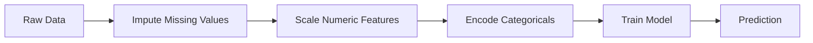
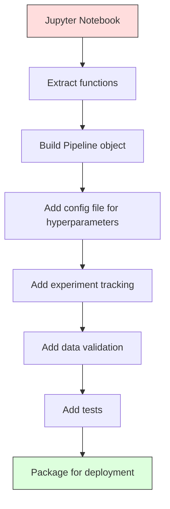

# Les pipelines ML

> Le modèle n'est pas un produit. La pipeline couvre le processus complet de la prédiction, de la base de données à la prédiction déployée, et chaque étape doit être réalisable.

**Type:** Build
**Language:**Python
**Prerequisites:** Phase 2, Lesson 12 (Hyperparameter Tuning)
**Time:** ~120 minutes

## Objectif de l'apprentissage
- De la conception à partir de zéro, un pipeline ML, imputation, étalonnage, codage et formation de modèle seront liés à un seul objet réalisable
- Identifier la fuite de données scenario,并解释 Pipeline 如何通过仅在训练数据 上拟合变压器以防止泄漏
-  Construire un colonneTransformer, à des caractéristiques numériques et catégoriques  appliquer différents pré-traitement
- ¢ réaliser la sérialisation du pipeline, et prouver qu'un pipeline déjà conçu produit des résultats cohérents dans la formation et la production

##  problématique
Vous avez un bloc-notes: il charge des données, utilise la médiane pour remplir les valeurs manquantes, les caractéristiques de raccourcissement, le modèle d'entraînement, et imprime la précision.

Un mois plus tard, quelqu'un a re-entraîné le modèle, mais il a obtenu des résultats différents. La moyenne est contenue dans l'ensemble complet des données de test.

Ces phénomènes ne sont pas hypothétiques. Ce sont les causes les plus courantes de défaillance des systèmes de gestion de contenu en production.

## 概念
### Ce qu'est un pipeline

Le pipeline est un ensemble de transformations de données organisées, suivie d'un modèle. Chaque étape est une sortie de chaque étape précédente en tant qu'entrée.



Le pipeline:
- Les transformations sont seulement en train de faire des données
- L'inference 时应用 des transformations complètement identiques
- L'ensemble de l'objet peut être sérialisé, et déployé comme un artefact.
- La validation croisée sera appliquée dans chaque pliage du pipeline, pour prévenir les fuites de détail

### Les données sont divulguées:

Les fuites de données se produisent lors de la formation en matière de contamination des données de test ou de futures données.

**Leaky（错误）：**
```python
X = df.drop("target", axis=1)
y = df["target"]

scaler = StandardScaler()
X_scaled = scaler.fit_transform(X)

X_train, X_test = X_scaled[:800], X_scaled[800:]
y_train, y_test = y[:800], y[800:]
```

Les données de test sont observées. La moyenne et l'écart standard contiennent des échantillons de test.

**Correct：**
```python
X_train, X_test = X[:800], X[800:]

scaler = StandardScaler()
X_train_scaled = scaler.fit_transform(X_train)
X_test_scaled = scaler.transform(X_test)
```

Utiliser le pipeline 时, vous n'avez pas besoin de penser spécifiquement à ce problème.

### L'équipement de transport

Les produits de la boutique`Pipeline`Il y a des transformateurs et un estimateur.`.fit()`- Je suis là.`.predict()`et `.score()`, selon l'ordre appliqué tous les étapes:.

```python
from sklearn.pipeline import Pipeline
from sklearn.preprocessing import StandardScaler
from sklearn.linear_model import LogisticRegression

pipe = Pipeline([
    ("scaler", StandardScaler()),
    ("model", LogisticRegression()),
])

pipe.fit(X_train, y_train)
predictions = pipe.predict(X_test)
```

Quand tu t' en fais`pipe.fit(X_train, y_train)`时:
1. Scaler dans X_train 上调用 `fit_transform`
2. Modèle dans l'échelle X_train 上调用 `fit`

Quand tu t' en fais`pipe.predict(X_test)`时:
1. Scaler dans X_test 上调用 `transform`(es pas adapté)
2. Modèle dans l'échelle X_test 上调用 `predict`

Dans le processus de montage, vous ne verrez jamais les données de test.

### ColonneTransformateur:不同列使用不同管道

L'ensemble de données réel contient également des colonnes numériques et catégoriques, elles nécessitent un traitement préalable différent.`ColumnTransformer` responsable de la gestion de cette situation.

```python
from sklearn.compose import ColumnTransformer
from sklearn.preprocessing import StandardScaler, OneHotEncoder
from sklearn.impute import SimpleImputer

numeric_pipe = Pipeline([
    ("impute", SimpleImputer(strategy="median")),
    ("scale", StandardScaler()),
])

categorical_pipe = Pipeline([
    ("impute", SimpleImputer(strategy="most_frequent")),
    ("encode", OneHotEncoder(handle_unknown="ignore")),
])

preprocessor = ColumnTransformer([
    ("num", numeric_pipe, ["age", "income", "score"]),
    ("cat", categorical_pipe, ["city", "gender", "plan"]),
])

full_pipeline = Pipeline([
    ("preprocess", preprocessor),
    ("model", GradientBoostingClassifier()),
])
```

UnHotEncoder 中的 `handle_unknown="ignore"`Pour la production, il est important de noter que lorsque de nouvelles catégories (par exemple, les villes que l'on n'a jamais vues) apparaissent, elles produisent un vecteur complet, plutôt que de s'effondrer directement.

### Suivi des expériences

Pipeline 让训练可复现, mais vous devez également suivre les expériences 之间 ce qui s'est passé: utiliser quels hyperparametres 哪个数据集版本、什么是什么?,运行的是哪个代码──

**MLflow**Les solutions open source les plus courantes:

```python
import mlflow

with mlflow.start_run():
    mlflow.log_param("max_depth", 5)
    mlflow.log_param("n_estimators", 100)
    mlflow.log_param("learning_rate", 0.1)

    pipe.fit(X_train, y_train)
    accuracy = pipe.score(X_test, y_test)

    mlflow.log_metric("accuracy", accuracy)
    mlflow.sklearn.log_model(pipe, "model")
```

Chaque fois que vous exécutez, vous enregistrerez des paramètres, des métriques, des objets et des modèles complets. Vous pouvez comparer des exécutions, réécrire des expériences, et déployer des versions de modèles.

**Weights & Biases (wandb)**提供相同功能,并带有托管仪表板:

```python
import wandb

wandb.init(project="my-pipeline")
wandb.config.update({"max_depth": 5, "n_estimators": 100})

pipe.fit(X_train, y_train)
accuracy = pipe.score(X_test, y_test)

wandb.log({"accuracy": accuracy})
```

### Modèle de version

Après avoir terminé le suivi des expériences, vous devez gérer les versions des modèles.

Le modèle de registre MLflow 提供:
- **Version tracking:**Chaque modèle conservé obtient un numéro de version
- **Stage transitions:**"Stage" ‒ "Production" ‒ "Archivé"
- **Approval workflow:**Le modèle doit être clairement promu à la production
- **Rollback:**立即切回 précédent version

### Versionnement des données avec DVC

代码使用 git faire la versionation. DATA should also be versioned, but git 无法处理大文件.

```
dvc init
dvc add data/training.csv
git add data/training.csv.dvc data/.gitignore
git commit -m "Track training data"
dvc push
```

DVC va stocker les données réelles dans un stockage à distance dans S3 、 GCS 、 Azure) et en conserver une très petite en git`.dvc`Quand tu fais un dépôt,`dvc checkout`Récupérer les données précises utilisées à l'époque.

Cela signifie que chaque commande est fixée en même temps par le code et les données.

### Experiments reproducibles

Une expérience réalisable nécessite quatre choses:

1. **Fixed random seeds:**Pour numpy、random 和 framework(torch、sklearn) mettre en place des graines
2. **Pinned dependencies:**Utilisation avec une version précise des exigences.txt ou poésie.lock
3. **Versioned data:**Utiliser DVC ou des outils similaires
4. **Config files:**Tous les hyperparametres sont placés dans la configuration, et non dans le code dur.

```python
import numpy as np
import random

def set_seed(seed=42):
    random.seed(seed)
    np.random.seed(seed)
    try:
        import torch
        torch.manual_seed(seed)
        torch.cuda.manual_seed_all(seed)
        torch.backends.cudnn.deterministic = True
    except ImportError:
        pass
```

### Du bloc-notes à la production



Le processus de développement:

1. **Notebook exploration:**快速 expériences  visualisations  idées de fonctionnalités
2. **Extract functions:**La pré-traitement, l'ingénierie des caractéristiques, l'évaluation, le transfert dans les modules
3. **Build Pipeline:**Les transformations 串联成 sklearn Pipeline ou classe personnalisée
4. **Config management:**Toutes les hyperparamètres seront déplacées dans la configuration YAML/JSON
5. **Experiment tracking:**添加 MLflow ou logging à la barre
6. **Data validation:**En formation, pré-examen des schémas, des distributions et des valeurs manquantes
7. **Tests:**Pour les transformateurs  rédiger des tests unitaires, pour l'intégration complète du pipeline  rédiger des tests d'intégration
8. **Deployment:**Sérialiser Pipeline, utiliser API(FastAPI、Flask)封装,并 contenant

### Erreurs courantes dans les pipelines

| Mistake | Why it is bad | Fix |
|---------|-------------|-----|
| 在 splitting 前对完整数据 fitting | Data leakage | 使用带 cross_val_score 的 Pipeline |
| 在 Pipeline 外做 feature engineering | Train 与 serve 时 transforms 不一致 | 把所有 transforms 放入 Pipeline |
| 不处理 unknown categories | Production 中出现新值会崩溃 | OneHotEncoder(handle_unknown="ignore") |
| Hardcoded column names | schema 变化时会出错 | 从 config 使用 column name lists |
| 没有 data validation | bad data 会导致悄无声息的错误 predictions | 在 prediction 前添加 schema checks |
| Training/serving skew | 模型在 prod 中看到不同 features | training 和 serving 共用一个 Pipeline 对象 |


```figure
f3-pipeline-flow
```

## - Je le construis.
`code/pipeline.py`Le code de l'interface est de créer un pipeline de ML complet:

### 步骤 1: Transformateur personnalisé

```python
class CustomTransformer:
    def __init__(self):
        self.means = None
        self.stds = None

    def fit(self, X):
        self.means = np.mean(X, axis=0)
        self.stds = np.std(X, axis=0)
        self.stds[self.stds == 0] = 1.0
        return self

    def transform(self, X):
        return (X - self.means) / self.stds

    def fit_transform(self, X):
        return self.fit(X).transform(X)
```

### 步骤 2: Construction du pipeline à partir de zéro

```python
class PipelineFromScratch:
    def __init__(self, steps):
        self.steps = steps

    def fit(self, X, y=None):
        X_current = X.copy()
        for name, step in self.steps[:-1]:
            X_current = step.fit_transform(X_current)
        name, model = self.steps[-1]
        model.fit(X_current, y)
        return self

    def predict(self, X):
        X_current = X.copy()
        for name, step in self.steps[:-1]:
            X_current = step.transform(X_current)
        name, model = self.steps[-1]
        return model.predict(X_current)
```

### étape 3: Utilisation du pipeline  effectuer une validation croisée

代码演示了使用管道的跨验证 如何防止数据泄漏:scaler 会分别在每个折的训练数据上合――

### 第4 步: utiliser le pipeline de production complet de sklearn

Un pipeline complet, contenant`ColumnTransformer`、多条 chemin de pré-traitement 和一个模型,并使用正确的交叉验证与实验记录 进行训练──

## Je le livre.
Le programme de formation
- `outputs/prompt-ml-pipeline.md`-- Utilisation de la compétence pour la construction et le contrôle des pipelines ML
- `code/pipeline.py`-- un pipeline complet, de zéro à réaliser à sklearn

## 练习
1. Construire un pipeline, traiter un ensemble de données contenant 3 colonnes numériques et 2 colonnes catégoriques ⋅ usage ⋅`ColumnTransformer`Pour la numérique  appliquer l'imputation médiane + l'échelle, pour les catégories  appliquer l'imputation la plus fréquente + le codage à chaud ⋅ utiliser la validation croisée 5 fois  exercer ⋅

2. Pour les données qui ont été filtrées, il est nécessaire de vérifier si les données sont correctement validées.

3. Utilisation `joblib.dump`Vous avez été sérialisé. Vous avez été sérialisé.

4. Pour le pipeline, ajoutez un transformateur personnalisé, pour les deux colonnes numériques les plus importantes, créant des caractéristiques polynomielles (grade 2):

5. Pour le pipeline  définition de suivi des flux ML。 utiliser différents hyperparametres 运行 5 fois expériences。 utiliser UI de flux ML(`mlflow ui`) Compare les courses,并选择最佳模型──

## 关键术语
| Term | What people say | What it actually means |
|------|----------------|----------------------|
| Pipeline | "Chain of transforms + model" | 一组有序的已拟合 transformers 和一个模型，作为一个整体应用以防止泄漏 |
| Data leakage | "Test info leaked into training" | 使用 training set 之外的信息构建模型，从而夸大 performance estimates |
| ColumnTransformer | "Different preprocessing per column" | 对不同列子集应用不同 Pipelines，并合并结果 |
| Experiment tracking | "Logging your runs" | 为每次 training run 记录 parameters、metrics、artifacts 和 code versions |
| MLflow | "Track and deploy models" | 用于 experiment tracking、model registry 和 deployment 的 open-source platform |
| DVC | "Git for data" | 面向 large data files 的 version control system，在 git 中存储 hashes，在 remote storage 中存储数据 |
| Model registry | "Model version catalog" | 使用 stage labels（staging、production、archived）追踪 model versions 的系统 |
| Training/serving skew | "It worked in the notebook" | Training 与 inference 期间数据处理方式存在差异，导致 silent errors |
| Reproducibility | "Same code, same result" | 使用相同代码、数据和配置获得完全相同结果的能力 |

## 延伸阅读
- [scikit-learn Pipeline docs](https://scikit-learn.org/stable/modules/compose.html)-- 官方 référence du pipeline
- [MLflow documentation](https://mlflow.org/docs/latest/index.html)-- suivi des expériences et le registre des modèles
- [DVC documentation](https://dvc.org/doc)-- versionnement des données
- [Sculley et al., Hidden Technical Debt in Machine Learning Systems (2015)](https://papers.nips.cc/paper/2015/hash/86df7dcfd896fcaf2674f757a2463eba-Abstract.html)--                                                                                                                                                                                                                                                                                                                                                                                                                                                                                                                             
- [Google ML Best Practices: Rules of ML](https://developers.google.com/machine-learning/guides/rules-of-ml)--                                                                                                                                                                                                                                                                                                                                                                                                                                                                                                                             
