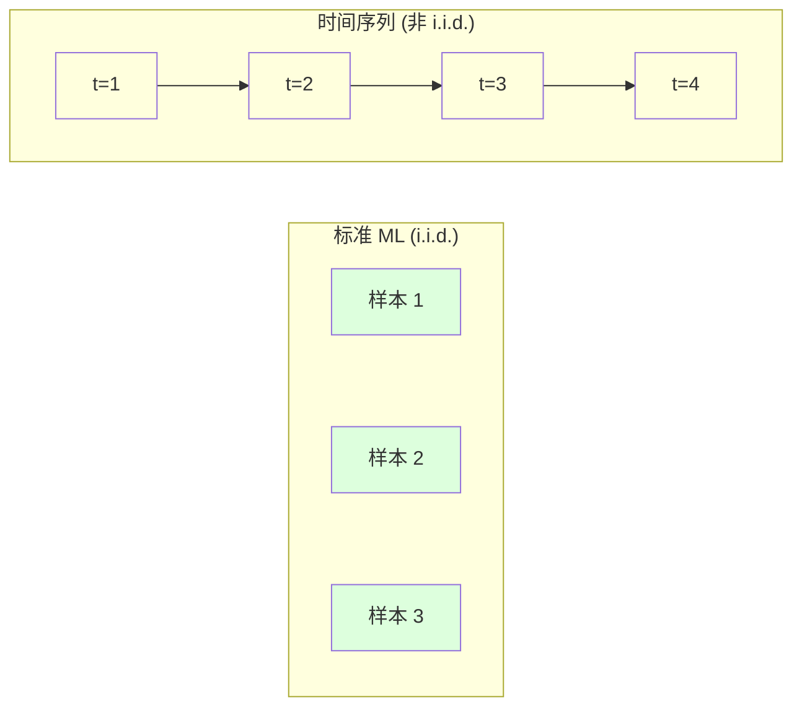
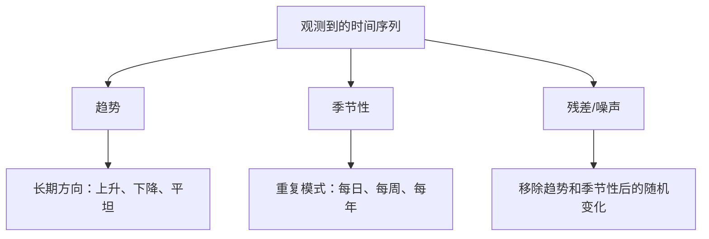
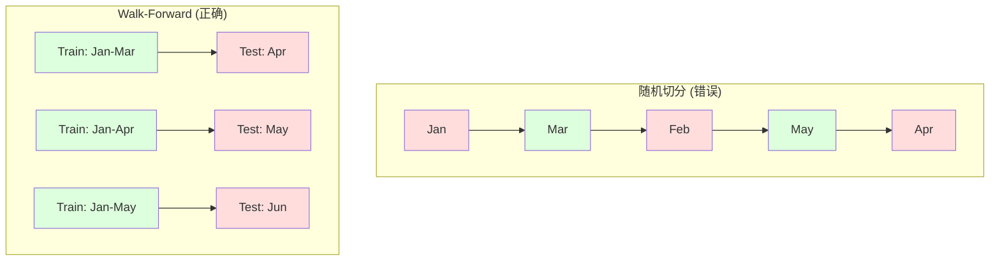

# 时间序列基础

> Le passé peut vraiment prédire le futur.

**Type:** Build
**Language:**Python
**Prerequisites:** Phase 2, Lessons 01-09
**Time:** ~90 分钟

## Objectif de l'apprentissage

- Décomposer la séquence temporelle en composants de tendance, de saison et de décalage, et vérifier l'équilibre
- ¢ réaliser des caractéristiques de retard et des statistiques en roulement, transformer la séquence de temps en problème de surveillance
- construire une validation progressive cadre, prévenir les fuites de données futures dans l'entraînement
- Expliquer pourquoi la division de train/test de la séquence de temps est inefficace, et montrer la différence de performance entre la séquence de temps réelle et la séquence de temps réelle

##  problématique

Vous avez des données en temps réel. Les ventes quotidiennes, la température de l'heure, le taux d'utilisation du processeur, le prix des actions par semaine.

Vous obtenez une norme ML 工具箱:随机列车/测试分区、十字验证、输入特征矩阵、输出预测──每一步都是错的──

La température d'aujourd'hui dépend de la température d'hier, et le temps de séquence va rompre avec le standard ML.

Un modèle avec une validation croisée aléatoire obtient une précision de 95%, avec une évaluation correcte basée sur le temps ne peut être que de 55%. Cette différence n'est pas un détail technique.

Ce cours couvre les éléments de base: quels sont les différents types de données de temps, comment évaluer honnêtement le modèle, et comment transformer le système de temps en un modèle standard ML .

## 概念

### La séquence de temps est différente

标准 ML 假设 i.i.d. -- 独立同分布── chaque échantillon est extrait de la même distribution, et indépendant des autres échantillons── la séquence de temps est simultanément contraire à ces deux points:

- **不独立。**Le prix des actions d'aujourd'hui dépend du prix d'hier.
- **不同分布。**Les ventes de 12 mois sont différentes de celles de 3 mois.

Ces violations ne sont pas légères. Elles vont changer la façon dont vous construisez des caractéristiques, la façon dont vous évaluez les modèles, ainsi que les algorithmes disponibles.



Dans la norme ML, les échantillons peuvent être échangés. Ils ne changent rien.

### 时间序列的组成部分

Chaque séquence de temps est composée de:



- **趋势**Les revenus augmentent de 10% par an, la température mondiale augmente.
- **季节性**Le taux de vente de la vente en vente au détail a augmenté en décembre.
- **残差**Si le résidu ressemble à un bruit blanc, expliquez la décomposition du signal capturé.

### Régime de sécurité

Si les attributs statistiques d'une séquence de temps ne changent pas avec le temps, il est stable.

**为什么重要：**Dans le modèle de formation sur les données de janvier, la moyenne apprise diffère de la moyenne présentée en janvier.

**如何检查：**Dans le tableau, la moyenne de roulement et l'écart standard de roulement sont calculées.

**如何修复：**差分── ne construisez pas la valeur initiale, mais construisez la variation entre les valeurs continuelles:

```
diff[t] = value[t] - value[t-1]
```

Si une fois la différence ne peut pas stabiliser la séquence, on la re-applique une fois.

**示例：**

Première séquence: [100, 102, 106, 112, 120]
Un épisode de la série: [2, 4, 6, 8]
Deuxièmement, deuxièmement, deuxièmement, deuxièmement, deuxièmement, deuxièmement, deuxièmement, deuxièmement, deuxièmement, deuxièmement, deuxièmement, deuxièmement, deuxièmement, deuxièmement, deuxièmement, deuxièmement, deuxièmement, deuxièmement, deuxièmement, deuxièmement, deuxièmement, deuxièmement, troisièmement, troisièmement, troisièmement, troisièmement, troisièmement, troisièmement, troisièmement, troisièmement, troisièmement, troisièmement, troisièmement, troisièmement, troisièmement, troisièmement, troisièmement, troisièmement, troisièmement, troisièmement, troisièm, troisièm, troisi, troisi, troisi, troisi, troisi, troisi, troisi, troisi, troisi, troisi, troisi, troisi, troisi, troisi, troisi, troisi, troisi, troisi, troisi, troisi, troisi, troisi, troisi, troisi, troisi, troisi, troisi, troisi, troisi, troisi, troisi, troisi, troisi, troisi, troisi, troisi, trois, trois, troisi, trois, et troisi, troisi, troisi, troisi, trois, troisi, et troisi, troisi, troisi, troisi, trois, et troisi, sixixixixi, et trois, sixixixi, sixi, trois, sixi, trois, trois, et trois, sixi, trois, trois, et trois, si, trois, si, si, trois, trois, trois, trois, trois, et trois, si, si, trois, et trois, trois, trois, trois, si, si, trois, trois, et trois, trois, et trois, si, trois, trois, si, trois, trois, et trois, trois, trois, trois, trois, trois, trois, trois, trois, et trois, trois, trois, si, et trois, si, si, trois, trois, trois, et trois, si

La séquence initiale a deux tendances. La première tendance est de la transformer en tendance linéaire. La seconde tendance est de la transformer en tendance linéaire.

**形式化检验：**Le test Augmented Dickey-Fuller (ADF) est un test statistique standard de stabilité planeuse. La hypothèse originale est une série de phénomènes non stables. Une valeur p inférieure à 0,05 indique que vous pouvez rejeter la hypothèse originale et obtenir une conclusion de stabilité planeuse.

### Depuis

La fonction d'autocorrélation (ACF) traitera cette corrélation entre la valeur de la mesure du temps t et la valeur du temps t-k(passer les étapes.

**ACF 告诉你：**
- Si l'ACF est en retard de 5 后降到零, alors la valeur de 5 步前 est sans importance.
- Si l'ACF est en retard de 12 mois, il y a des pics, il y a des saisons annuelles.
- Il faut créer des traits de retard. Utiliser jusqu'à ce que l'ACF soit négligeable.

**PACF (Partial Autocorrelation Function)**Si aujourd'hui est lié à 3 天前, simplement parce que les deux sont liés à hier, alors le retard de PACF 3 sera zéro, tandis que le retard de ACF 3 ne sera pas zéro.

### 滞后特征:把时间序列转换为监督学习

标准 ML 模型 需要特征矩阵 X 和目标 y──时间序列只给你一列值──桥梁就是滞后特征──

取序列 [10, 12, 14, 13, 15], créer lag-1 和 lag-2 Caractéristiques:

| lag_2 | lag_1 | target |
|-------|-------|--------|
| 10    | 12    | 14     |
| 12    | 14    | 13     |
| 14    | 13    | 15     |

Il y a maintenant un problème de régression standard. Tout modèle de réaction (ML) peut être utilisé pour les objectifs de prévision.

Vous pouvez modifier d'autres caractéristiques:
- **Rolling statistics:**Récemment, la valeur moyenne de k 个 estd, min, max
- **Calendar features:**C'est le week-end.
- **Differenced values:**Comparé à l'étape précédente
- **Expanding statistics:**累计平均 累计 sum
- **Ratio features:**当前值 / rolling mean (à distance de la moyenne à court terme)
- **Interaction features:**1 * jour de semaine (la journée de travail a un impact sur la quantité de travail)

**多少个 lag？**Utilisez la fonction de corrélation automatique. Si le ACF à 10 délais est important, utilisez au moins 10 délais. Si il y a des délais de 7 semaines, il peut également y avoir 14 délais.

**target 对齐陷阱。**Lorsque vous créez un attribut retardé, le but doit être la valeur du temps t, et tous les attributs doivent utiliser la valeur du temps t-1 ou plus tôt. Si vous ne voulez pas considérer la valeur du temps t comme un attribut inclus, vous avez un prédicteur parfait - ainsi qu'un modèle totalement inutile. C'est le bug le plus courant dans le génie des attributs de séquences de temps.

### Une validation à l'avance

C'est le concept le plus important de cette classe. La validation croisée standard K-fold sera distribuée au train et au test.



Validation à l'avance:
1. En train de faire des exercices
2. 预测时间 t+1(或用于多步预测的 t+1到 t+k)
3. La fenêtre s'ouvre
4. Récapitulatif

Chaque test ne contient que les données de l'entraînement après le début. Il n'y a pas de fuites futures. Cela vous donnera une estimation honnête, indiquant comment le modèle se produira après le déploiement.

**Expanding window**Utilisez tous les données historiques pour faire des exercices.**Sliding window**Utilisez la fenêtre de formation fixe de taille (en anglais seulement) lorsque vous croyez que les données plus anciennes sont toujours pertinentes, utilisez l'expansion lorsque le monde est en train de changer et que les données anciennes sont nocives, utilisez le glissement de données.

### ARIMA 直觉

ARIMA est un modèle classique de séquences de temps. Il a trois composants:

- **AR (Autoregressive):**Depuis le passé pour effectuer des prévisions.
- **I (Integrated):**通过差分实现平稳性──I(d) 应用 d 次差分──
- **MA (Moving Average):**Depuis le passé prédiction erreur effectuer prédiction──MA(q) Utilisation récente q 个误差──

ARIMA(p, d, q) 组合了三者──你基于ACF/PACF 分析或自动搜索(auto-ARIMA) 组合了三者──你基于ACF/PACF 分析或自动搜索(auto-ARIMA) 组合了三者──你基于ACF/PACF 分析或自动搜索(auto-ARIMA) 组合了三者──你基于ACF/PACF 分析或自动搜索(auto-ARIMA) 组合了三者──你基于ACF/PACF 分析或自动搜索(auto-ARIMA) 组合了三者──你基于ACF/PACF 分析或自动搜索的选择 p、d、q──

Nous ne réaliserons pas ARIMA à partir de zéro - il nécessite une optimisation numérique, au-delà de la portée de la classe.

### Qu'est-ce que vous utilisez ?

| Approach | Best For | Handles Seasonality | Handles External Features |
|----------|---------|-------------------|------------------------|
| 滞后特征 + ML | 有很多外部特征的表格数据 | 通过 calendar features | 是 |
| ARIMA | 单个单变量序列、短期 | SARIMA 变体 | 否（ARIMAX 支持有限） |
| Exponential smoothing | 简单趋势 + 季节性 | 是（Holt-Winters） | 否 |
| Prophet | 业务预测、节假日 | 是（Fourier terms） | 有限 |
| Neural networks (LSTM, Transformer) | 长序列、多序列 | 学习得到 | 是 |

Pour la plupart des problèmes réels, le retard + le boost de gradient est le point de départ le plus fort. Il soutient naturellement les caractéristiques externes, ne nécessite pas de stabilité et est facile à déboguer.

### 预测 Horizon et stratégie

单步预测会预测未来一个时间步――多步预测会预测多个时间步―― Il existe trois stratégies:

**Recursive (iterated):**预测 Next step, considérez le résultat de la prédiction comme une entrée de la prochaine étape.

**Direct:**Pour chaque horizon entraînement de modèle unique―Model-1  prédiction t+1,Model-5  prédiction t+5― pas d'erreur accumulée, mais chaque modèle de formation a moins de modèle, et ils ne partagent pas d'information―

**Multi-output:**训练一个同时输出所有视界的模型――跨视界共享信息,但需要支持多输出模型(或自定义 Loss Function)―

Pour la plupart des problèmes réels, l'horizon court (de 1 à 5 étapes) est de la forme récursive (de commencer à la plus longue) à l'horizon direct (de commencer à la plus longue).

### 时间序列中的常见错误

| Mistake | Why it happens | How to fix |
|---------|---------------|-----------|
| 随机 train/test split | 来自标准 ML 的习惯 | 使用 walk-forward 或 temporal split |
| 使用未来特征 | 误把时间 t 的特征包含进去 | 审计每个特征的时间对齐 |
| 对季节性 overfitting | 模型记住了日历模式 | 在 test set 中留出一个完整季节周期 |
| 忽略尺度变化 | 收入翻倍但模式保持 | 建模百分比变化而非绝对值 |
| 过多滞后特征 | “更多历史更好” | 使用 ACF 确定相关 lag |
| 不做差分 | “模型会自己搞定” | 树模型能处理趋势；线性模型需要平稳性 |


```figure
f3-series-decompose
```

## - Je le construis.

`code/time_series.py`Le code central a réalisé le bloc de construction de base à partir de zéro.

### 滞后特征创建器

```python
def make_lag_features(series, n_lags):
    n = len(series)
    X = np.full((n, n_lags), np.nan)
    for lag in range(1, n_lags + 1):
        X[lag:, lag - 1] = series[:-lag]
    valid = ~np.isnan(X).any(axis=1)
    return X[valid], series[valid]
```

Il transforme la séquence 1D en matrice de fonctionnalités, chaque ligne étant la plus proche.`n_lags`个值作为特征,并以当前值作为目标──

### Validation croisée à l'avance

```python
def walk_forward_split(n_samples, n_splits=5, min_train=50):
    assert min_train < n_samples, "min_train must be less than n_samples"
    step = max(1, (n_samples - min_train) // n_splits)
    for i in range(n_splits):
        train_end = min_train + i * step
        test_end = min(train_end + step, n_samples)
        if train_end >= n_samples:
            break
        yield slice(0, train_end), slice(train_end, test_end)
```

Chaque séance de formation est soigneusement prévue pour les tests.

### 简单 Autorégressive 模型

Le modèle pur AR est une régression linéaire sur les traits de retard:

```python
class SimpleAR:
    def __init__(self, n_lags=5):
        self.n_lags = n_lags
        self.weights = None
        self.bias = None

    def fit(self, series):
        X, y = make_lag_features(series, self.n_lags)
        # Solve via normal equations
        X_b = np.column_stack([np.ones(len(X)), X])
        theta = np.linalg.lstsq(X_b, y, rcond=None)[0]
        self.bias = theta[0]
        self.weights = theta[1:]
        return self
```

Cette régression linéaire est totalement la même dans le concept que dans la leçon 02 mais elle est appliquée à la version retardée de la même variable dans le temps.

### Inspection de la stabilité

代码计算 rolling statistics, pour évaluer la visibilité et la stabilité numérique:

```python
def check_stationarity(series, window=50):
    rolling_mean = np.array([
        series[max(0, i - window):i].mean()
        for i in range(1, len(series) + 1)
    ])
    rolling_std = np.array([
        series[max(0, i - window):i].std()
        for i in range(1, len(series) + 1)
    ])
    return rolling_mean, rolling_std
```

Si la moyenne de roulement 漂移或滚动 std 变化, le processus est non-plain ⋅ appliqué 差分后再检查一次 ⋅

Le code passe également par la première moitié et la seconde moitié de la séquence de comparaison pour vérifier la stabilité. Si la différence moyenne de valeur dépasse la moitié de la différence standard, ou si la différence de dimension dépasse 2 fois, la séquence est marquée comme non-stable.

### Depuis

```python
def autocorrelation(series, max_lag=20):
    n = len(series)
    mean = series.mean()
    var = series.var()
    acf = np.zeros(max_lag + 1)
    for k in range(max_lag + 1):
        cov = np.mean((series[:n-k] - mean) * (series[k:] - mean))
        acf[k] = cov / var if var > 0 else 0
    return acf
```

## Utilisez-le

Avec le schlaarn, vous pouvez directement donner les traits de retard à n'importe quel régresseur:

```python
from sklearn.linear_model import Ridge
from sklearn.ensemble import GradientBoostingRegressor

X, y = make_lag_features(series, n_lags=10)

for train_idx, test_idx in walk_forward_split(len(X)):
    model = Ridge(alpha=1.0)
    model.fit(X[train_idx], y[train_idx])
    predictions = model.predict(X[test_idx])
```

 Pour ARIMA, utiliser des modèles statistiques:

```python
from statsmodels.tsa.arima.model import ARIMA

model = ARIMA(train_series, order=(5, 1, 2))
fitted = model.fit()
forecast = fitted.forecast(steps=30)
```

`time_series.py`Le code de l'interface a présenté deux méthodes, et a utilisé la validation progressive pour effectuer une comparaison.

### sklearn TempsSeriesSplit

sklearn a fourni la validation de marche en avant`TimeSeriesSplit`- Le numéro de la liste:

```python
from sklearn.model_selection import TimeSeriesSplit

tscv = TimeSeriesSplit(n_splits=5)
for train_index, test_index in tscv.split(X):
    X_train, X_test = X[train_index], X[test_index]
    y_train, y_test = y[train_index], y[test_index]
    model.fit(X_train, y_train)
    score = model.score(X_test, y_test)
```

C' est le prix de notre réalisation à partir de zéro.`walk_forward_split`, mais intégré dans le cadre de validation croisée de sklearn.`cross_val_score`Une utilisation:

```python
from sklearn.model_selection import cross_val_score

scores = cross_val_score(model, X, y, cv=TimeSeriesSplit(n_splits=5))
print(f"Mean score: {scores.mean():.4f} +/- {scores.std():.4f}")
```

### évaluation

时间序列预测 utiliser Regression 指标, mais带有时间感知的 上下文:

- **MAE (Mean Absolute Error):**Y_true - la valeur moyenne de y_prédit  facile à utiliser en unités originales  moyenne en termes de prédiction de la différence de 3,2° 
- **RMSE (Root Mean Squared Error):**La moyenne d'erreur carrées de la racine carrée.
- **MAPE (Mean Absolute Percentage Error):**Il n'y a pas de rapport avec la mesure, mais les valeurs vraies sont définis à zéro heure.
- **Naive baseline comparison:**始终与简单基线比较――季节性天才基线 会预测上一周期的价值(昨天、上周) ―― Si votre modèle ne peut pas vaincre les naïfs, il y a un problème,

### Caractéristiques roulantes

Le code démontre des caractéristiques de retard ajoutées aux statistiques de roulement ((7 天和 14 天窗口 mean、std、min、max) ⋅ Ces caractéristiques fournissent au modèle des informations de tendances et de volatilité à court terme, alors que ces informations ne peuvent être capturées que par les caractéristiques de retard ⋅

Par exemple, si la moyenne de roulement est en hausse, il y a une tendance à la hausse. Si la rotation est en augmentation, il y a une augmentation de la volatilité.

## Je le livre.

Le programme de formation
- `outputs/prompt-time-series-advisor.md`-- une demande pour définir la séquence de temps
- `code/time_series.py`-- 滞后特征、前行验证、AR 模型、平稳性检查

### Tu dois battre la ligne de base

Avant de construire un modèle, établir la base:

1. **Last value (persistence).**Pour beaucoup de séries, il est difficile de vaincre.
2. **Seasonal naive.**预测 Aujourd'hui et la semaine dernière, le même jour que l'année dernière. Si votre modèle ne peut pas le vaincre, il n'a appris aucun modèle utile en dehors de la saison.
3. **Moving average.**预测 La moyenne de la valeur récente de k 个 值──能平滑噪音, mais pas capture de mutation──

Si votre modèle de ML supérieur donne une base saisonnière naïve, vous avez un bug. Le plus courant est: les fuites futures dans les caractéristiques, les méthodes d'évaluation erronées, ou la séquence elle-même est vraiment aléatoire et imprévisible.

### 实用建议

1. **从绘图开始。**Avant toute construction, dessinez d'abord la séquence initiale. Cherchez les tendances, les saisons, les ruptures structurelles, les changements subits de comportement.

2. **先差分，再建模。**Si la séquence a une tendance évidente, on fait des différences avant de créer des traits de retard. Les modèles basés sur des arbres peuvent traiter les tendances, mais les modèles linéaires ne peuvent pas, et les différences ne sont généralement pas malheureuses.

3. **至少留出一个完整季节周期。**Si il y a une semaine de saison, le test doit être effectué au moins une semaine entière. Si c'est une semaine de saison, il faut au moins une semaine entière.

4. **在生产中监控。**Avec le changement du monde, le modèle de séquence de temps se détériore avec le temps.

5. **警惕 regime changes。**Les modèles de formation sur les données antérieures à l'épidémie ne peuvent pas prédire le comportement post-épidémie.

6. **对偏斜序列做 log-transform。**Le log peut être stabilisé, et le modèle de multiplication est transformé en mode de multiplication, de sorte que le modèle de ligne peut être traité.

## 练习

1. **平稳性实验。**Il est nécessaire de vérifier la stabilité des roues.

2. **Lag 选择。**Dans la séquence saisonnière (période = 7) calculée sur ACF, quel est le plus haut taux de retard ?

3. **Walk-forward vs random split。**Dans le cadre de la formation de la régression de la Ridge, il est possible de faire une analyse de la régression de la Ridge.

4. **特征工程。**À côté de la moyenne de roulement (window=7) ‧ la roulement std (window=7) 和 les caractéristiques du jour de la semaine── utilisation de la validation progressive

5. **多步预测。**修改 AR 模型,让它预测未来 5 步而不是 1 步──比较两种策略: a) 预测一步,把预测作为下一步的输入(recursive),以及 (b) 为每个视野 训练单独模型(直接)──哪个更准确?

## 关键术语

| Term | What people say | What it actually means |
|------|----------------|----------------------|
| Stationarity | “统计量不随时间变化” | 均值、方差和自相关结构随时间保持不变的序列 |
| Differencing | “连续值相减” | 计算 y[t] - y[t-1] 来移除趋势并实现平稳性 |
| Autocorrelation (ACF) | “一个序列与自身的相关程度” | 时间序列与自身滞后副本之间的相关性，作为 lag 的函数 |
| Partial autocorrelation (PACF) | “只有直接相关” | 移除所有更短 lag 的影响后，lag k 上的自相关 |
| Lag features | “把过去值作为输入” | 使用 y[t-1]、y[t-2]、...、y[t-k] 作为特征来预测 y[t] |
| Walk-forward validation | “尊重时间顺序的 cross-validation” | 训练数据在时间上始终先于测试数据的评估方式 |
| ARIMA | “经典时间序列模型” | AutoRegressive Integrated Moving Average：组合过去值（AR）、差分（I）和过去误差（MA） |
| Seasonality | “重复的日历模式” | 与日历周期（每日、每周、每年）相关的、规则且可预测的时间序列周期 |
| Trend | “长期方向” | 序列水平随时间持续上升或下降 |
| Expanding window | “使用所有历史” | 训练集随每个 fold 增长的 walk-forward validation |
| Sliding window | “固定大小的历史” | 训练集是向前滑动的固定长度窗口的 walk-forward validation |

## 延伸阅读

- [Hyndman and Athanasopoulos, Forecasting: Principles and Practice (3rd ed.)](https://otexts.com/fpp3/)-- le meilleur cours de prédiction
- [scikit-learn Time Series Split](https://scikit-learn.org/stable/modules/generated/sklearn.model_selection.TimeSeriesSplit.html)-- le séparateur de marche avant de sklearn
- [statsmodels ARIMA docs](https://www.statsmodels.org/stable/generated/statsmodels.tsa.arima.model.ARIMA.html)-- 带诊断的ARIMA 实现
- [Makridakis et al., The M5 Competition (2022)](https://www.sciencedirect.com/science/article/pii/S0169207021001874)-- 展示 ML 方法与统计方法大规模预测竞赛
