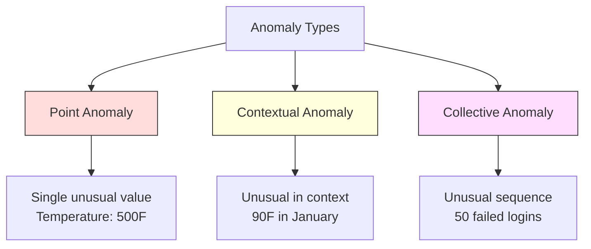
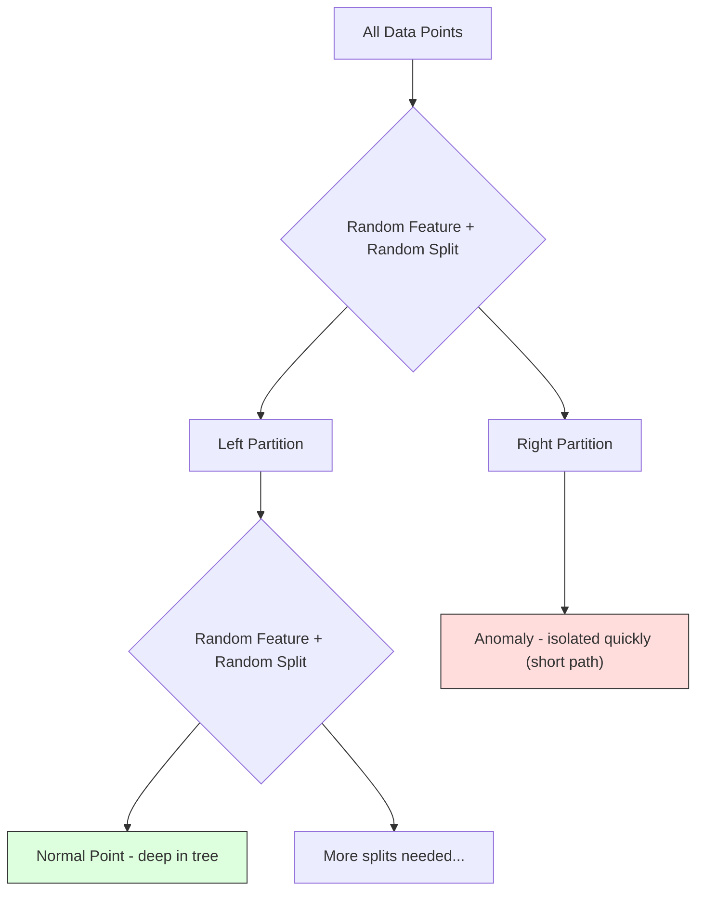
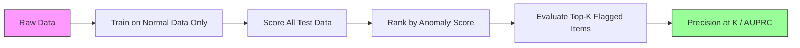

# Détection d'anomalies

> Normalement, c'est facile à définir.

**Type:** Build
**Language:**Python
**Prerequisites:** Phase 2, Lessons 01-09
**Time:** ~75 minutes

## Objectif de l'apprentissage

- De zéro réalisation de Z-score, RSI et méthode de détection de l'anomalie forestière d'isolement
- 区分点、contextuelle 和 collective anomalies,并为每种选择合适的检测方法
- 解释为什么异常检测被表述为对正常数据 建模而不是对异常进行分类
- Comparer la détection des anomalies non surveillées à la classification surveillée, et évaluer la portée et la précision des anomalies nouvelles

##  problématique

Une carte de crédit à New York à 2 heures du midi, puis à Tokyo à 2 heures de l'après-midi, est utilisée.

Ce sont des anomalies. Les trouver est important. La fraude entraîne des pertes de milliards de dollars. Les pannes d'équipement entraînent des temps d'arrêt.

Le défi réside dans: vous avez très peu d'anomalies avec des étiquettes Exemple: La fraude ne représente que 0,1% des transactions. Les défaillances d'appareils ne se produisent que quelques fois par an. Vous ne pouvez pas former le classifiateur standard, car la catégorie "anomalies" ▌ n'a presque aucun contenu à apprendre.

La détection d'anomalies Réponse à la question. Ne pas apprendre ce qui est anormal, mais apprendre ce qui est normal. Tout ce qui est déviant de la normale est douteux.

## 概念

### Types de anomalies

Toutes les anomalies ne sont pas les mêmes:

- **Point anomalies.**单个数据点不管上下文如何都很异常──500°C de température$50 的账户发生 $50 000 de transactions.
- **Contextual anomalies.**Un point de données est donné en dessous des caractéristiques anormales.
- **Collective anomalies.**Un groupe de points de données en tant qu'ensemble est anormal, même si chaque point de données individuel peut être normal.

La plupart des méthodes de contrôle des anomalies de point de vue  Les anomalies contextuelles  Les anomalies collectives  Les anomalies collectives  Les anomalies de point de vue  Les anomalies contextuelles  Les anomalies contextuelles  Les anomalies de temps ou de position  Les anomalies collectives  Les anomalies collectives  Les anomalies collectives  Les anomalies collectives  Les anomalies de point de vue  Les anomalies contextuelles  Les anomalies contextuelles  Les anomalies de position  Les anomalies collectives  Les anomalies collectives  Les anomalies collectives  Les anomalies collectives  Les anomalies de position  Les anomalies sont des anomalies de position  Les anomalies de la séquence  Les anomalies sont des anomalies



### Expression non surveillée

Dans la classification standard, vous avez deux catégories d'étiquettes. Dans la détection des anomalies, vous rencontrez généralement l'une des trois situations suivantes:

1. **Fully unsupervised.**完全没有标签──你在所有数据上适合探测器,并希望异常性 足够稀少,不会污染"正常"模型──
2. **Semi-supervised.**Vous avez un ensemble de données qui contient uniquement des données normales. Vous vous adaptez à ce ensemble de données, puis à toutes les autres données. Si possible, c'est la configuration la plus forte.
3. **Weakly supervised.**Vous avez une petite quantité d'anomalies de marque. Vous les utiliserez pour évaluer, et non pour faire des exercices.

关键洞见:Détection et classification de l'anomalie ont des différences de nature. Vous êtes en train de construire une distribution de données normales, et non de déterminer la frontière entre deux catégories.

### Surveillance contre non-surveillance:权衡

Si vous avez des anomalies de marquage, devriez-vous les utiliser pour l'entraînement de la classification supervisée ou seulement pour l'évaluation de la détection non supervisée ?

**Supervised（当作 Classification 处理）：**
- - Vous avez déjà vu une anomalie ?
- Pour les types d'anomalies connues, une précision plus élevée
- Une anomalie novatrice
- Lorsque de nouvelles anomalies apparaissent, il faut se réapproprier.
- 需要足够多的异常示例(habituellement trop peu)

**Unsupervised（对 normal 建模，标记偏离项）：**
- 能 capter toute situation déviant de la normale, y compris le type de roman 
- Il n' y a pas besoin de marquer des anomalies
- Le taux de faux positifs était plus élevé.
- Pour le changement de distribution plus robuste

pratique, le meilleur système se combine entre les deux: détection non supervisée  obtenir une large couverture, traitement des anomalies de haut niveau de priorité connues  types, et faire examiner les cas de maladresse 

### Z-Score 方法

La méthode la plus simple est de calculer la moyenne et l'écart standard de chaque caractéristique.

```text
z_score = (x - mean) / std
anomaly if |z_score| > threshold
```

Le seuil de référence est de 3,0 ((pour la distribution gaussienne, 99,7% des données normales sont dans la limite de 3 écarts standard))

**优点：**简单――快速――可解释(" Cette valeur à distance de la normale a 4,5 déviations standards")

**缺点：**假设数据服从正常分布──对训练数据中的异值 敏感(异值 会移动 mean并增大 std,使它们更难被检测出来)──在多模分布上失效──

**适用场景：**Les données de la distribution de données sont généralement fournies en fonction de la taille de l'écran.

**失效场景：**Les données de plusieurs clusters sont différentes dans les deux bureaux.

### RSI 方法

Avec un score Z plus robuste, il est préférable d'utiliser la gamme interquartile plutôt que la moyenne et l'écart standard.

```
Q1 = 25th percentile
Q3 = 75th percentile
IQR = Q3 - Q1
lower_bound = Q1 - factor * IQR
upper_bound = Q3 + factor * IQR
anomaly if x < lower_bound or x > upper_bound
```

Le facteur de reconnaissance est de 1,5:

**优点：**Pour les valeurs anormales robustes, les pourcentages ne sont pas affectés par la valeur extrême.

**缺点：**                                                                                                                                                                                                                                                              

**实践说明：**Le facteur de 1,5 dans le RQ est le facteur de 1,5 dans le tableau de la boîte de réaction. Le facteur de 1,5 dans le tableau de réaction.

### Forêt isolée

关键洞见: les anomalies sont en petit nombre et diffèrent de la population. Lorsqu'on partage des données au hasard, les anomalies sont plus faciles à séparer, elles ne nécessitent que moins de fractions aléatoires pour pouvoir se séparer des autres données.



**工作方式：**
1. Construire beaucoup d'arbres aléatoires
2. Dans chaque nœud, choisissez une fonctionnalité et choisissez une valeur divisée entre le min et le max de cette fonctionnalité
3. continuer à se diviser jusqu'à ce que chaque point soit séparé  dans sa propre feuille)
4. Anomalies dans tous les arbres avec des longueurs de cheminement moyennes plus courtes

**为什么有效：**Les points normaux se trouvent dans des régions denses. Il faut de nombreuses divisions aléatoires pour qu'un point soit séparé de son voisin.

Score anormal basé sur la longueur moyenne du chemin de tous les arbres, et la longueur de chemin de recherche binaire aléatoire de l'arbre  pour effectuer la normalisation:

```
score(x) = 2^(-average_path_length(x) / c(n))
```

Parmi eux `c(n)`est n 个 échantillons de longueur de cheminement attendue──Score 接近 1 表示异常──Score 接近 0.5 表示正常──Score 接近 0 表示非常正常(位于密集集集深处)。

**优点：**没有分布假设──适用于高尺寸──扩展性好(由于每棵树使用子样本,所以相对于样本大小是子线性)──处理混合特征类型──

**缺点：**難以處理密集區 中的異常們 () ──────────────────────────────────────────────────────────────────────────────────────────────────────────────────────────────────────────────────────────────────────────────────────────────────────────────────────────────────────────────────────────────────────────────────────────────────────────────────────────────────────────────────────────────────────────────────────────────────────────────────────────────────────────────────────────────────────────────────────────────────────────────────────────────────────────────────────────────────────────────────────────────────────────────────────────────────────────────────────────────────────────────────────────────────────────────────────────────────────────────────────────────────────────────────────────────────────────────────────────────────────────────────────────────────────────────────────────────────────────────────────────────────────────────────────────────────────────────────────────────────────────────────────────

**关键 hyperparameters：**
- `n_estimators`Les arbres: nombre, 100 sont généralement suffisants.
- `max_samples`: Numéro de échantillons de chaque arbre. La valeur par défaut est de 256. La valeur inférieure rendra un arbre moins précis, mais augmentera la diversité.
- `contamination`: 预期 anomalies 比例── seulement utilisé pour définir un seuil──不影响分 本身──

### Facteur local d'outrages (LOF)

LOF compare la densité locale entourant un certain point à celle de ses voisins, une densité qui se situe dans une région rare, mais qui est entourée de régions denses, ce point est anormal.

**工作方式：**
1. Pour chaque point, trouver ses voisins les plus proches
2. 计算 local densité de disponibilité (neighborhood has多密)
3. Comparer la densité de chaque point avec celle de ses voisins
4. Si la densité d'un point est inférieure à celle de ses voisins, il est plus éloigné.

**LOF score：**
- LOF  approximativement 1,0 indique la densité par rapport aux voisins
- LOF est supérieur à 1,0 indique la densité  faible à celle des voisins(可能異常)
- LOF 远大于 1.0 (par exemple, 2.0+) indique la densité 显著更低 (très probablement est une anomalie)

"local" 部分至关重要── considérer un ensemble de données de deux clusters: un qui contient 1000 points de cluster dense, un autre qui contient 50 points de cluster rare── un point de cluster sparsé à la périphérie n'est pas un tout-terrain inhabituel, il a 50 voisins── mais si ses voisins directs sont plus denses que lui, alors il est localement inhabituel──LOF 捕捉到全球方法会漏掉的这种微微差别──

**优点：**检测 local anomalies  dans son voisinage de zones inhabituelles, même si elles ne sont pas inhabituelles dans le monde entier  Approprié pour les groupes de densités différentes

**缺点：**Dans les grandes données, la mise en œuvre est lente.

### Par rapport à

| Method | Assumptions | Speed | Handles High Dims | Detects Local Anomalies |
|--------|------------|-------|-------------------|------------------------|
| Z-score | Normal distribution | 非常快 | 是（逐 feature） | 否 |
| IQR | 无（逐 feature） | 非常快 | 是（逐 feature） | 否 |
| Isolation Forest | 无 | 快 | 是 | 部分 |
| LOF | Distance 有意义 | 慢 | 较差 | 是 |

### évaluer le défi

évaluer les détecteurs d'anomalies par rapport aux classifiateurs d'évaluation

- **Extreme class imbalance.**Si les anomalies représentent 0,1%, le contenu de la prédiction est "normal" et obtient une précision de 99,9%.
- **AUROC 具有误导性。**Dans un déséquilibre grave, même dans les seuils réels, l'AUROC peut aussi paraître mal.
- **更好的 metrics：**Précision@k(top k 被标记项中的多少是真异常) 、AUPRC(précision-recall curve 下面积), ainsi que dans le taux de faux positifs fixe 下的回忆──



### Pipeline de détection des anomalies

实践中,Detection de l'anomalie  Suivre le flux de travail suivant:

1. **收集 baseline data.**Dans l'idéal, choisir une période où il n'y a pas de "anomalies"
2. **Feature engineering.**Les caractéristiques primitives, les caractéristiques dérivées, les statistiques de roulement, les caractéristiques temporelles, les rapports)
3. **训练 detector.**Dans les données de base, le modèle apprend à être "normal".
4. **对新数据打分.**Chaque nouvelle observation obtient un score d'anomalie.
5. **Threshold selection.**选择分分截止――这是业务决策:更高门意味着虚假报警更少,但错过异常更多――
6. **Alert and investigate.**Le point de référence est l'examen ou la réponse automatique.
7. **Feedback collection.**记录被标记项是真异常还是虚假警报――使用这些数据评估探测器,并随时间调整门――

Le pipeline n'est jamais "fait"[3]. Les distributions de données vont se déplacer, de nouvelles anomalies apparaîtront, des seuils doivent également être ajustés[3].


```figure
f3-anomaly-fence
```

## - Je le construis.

`code/anomaly_detection.py`Le code central a réalisé le score Z à partir de zéro, le RQI et la forêt d'isolement.

### Détecteur de Z-Score

```python
def zscore_detect(X, threshold=3.0):
    mean = X.mean(axis=0)
    std = X.std(axis=0)
    std[std == 0] = 1.0
    z = np.abs((X - mean) / std)
    return z.max(axis=1) > threshold
```

 simple et vectorié. Si une caractéristique dépasse le seuil, on note le point.

### Détecteur de RCI

```python
def iqr_detect(X, factor=1.5):
    q1 = np.percentile(X, 25, axis=0)
    q3 = np.percentile(X, 75, axis=0)
    iqr = q3 - q1
    iqr[iqr == 0] = 1.0
    lower = q1 - factor * iqr
    upper = q3 + factor * iqr
    outside = (X < lower) | (X > upper)
    return outside.any(axis=1)
```

### De la réalisation de l'isolement forestier

De la version de réalisation de zéro construire des arbres d'isolement, effectuer une partition aléatoire sur l'espace de fonctionnalités:

```python
class IsolationTree:
    def __init__(self, max_depth):
        self.max_depth = max_depth

    def fit(self, X, depth=0):
        n, p = X.shape
        if depth >= self.max_depth or n <= 1:
            self.is_leaf = True
            self.size = n
            return self
        self.is_leaf = False
        self.feature = np.random.randint(p)
        x_min = X[:, self.feature].min()
        x_max = X[:, self.feature].max()
        if x_min == x_max:
            self.is_leaf = True
            self.size = n
            return self
        self.threshold = np.random.uniform(x_min, x_max)
        left_mask = X[:, self.feature] < self.threshold
        self.left = IsolationTree(self.max_depth).fit(X[left_mask], depth + 1)
        self.right = IsolationTree(self.max_depth).fit(X[~left_mask], depth + 1)
        return self
```

La longueur du chemin nécessaire à l'isolement d'un point décide de sa partition anormale.

`IsolationForest`classe 包装了多棵树:

```python
class IsolationForest:
    def __init__(self, n_estimators=100, max_samples=256, seed=42):
        self.n_estimators = n_estimators
        self.max_samples = max_samples

    def fit(self, X):
        sample_size = min(self.max_samples, X.shape[0])
        max_depth = int(np.ceil(np.log2(sample_size)))
        for _ in range(self.n_estimators):
            idx = rng.choice(X.shape[0], size=sample_size, replace=False)
            tree = IsolationTree(max_depth=max_depth)
            tree.fit(X[idx])
            self.trees.append(tree)

    def anomaly_score(self, X):
        avg_path = average path length across all trees
        scores = 2.0 ** (-avg_path / c(max_samples))
        return scores
```

Facteur de normalisation `c(n)`est contenu dans n 个元素的二进制搜索树 中一次失败搜索的预期路径长度──它等于`2 * H(n-1) - 2*(n-1)/n`, parmi lesquels `H`C'est un nombre harmonieux. Cette normalisation permet de comparer les scores entre différents ensembles de données.

### Démo

代码生成多个测试场景:

1. **Single cluster with outliers.**Un cluster gaussien 2D, et à une position éloignée du centre, infuse des anomalies.
2. **Multimodal data.**Les points entre les groupes sont anormaux. Le score Z est très important, car la portée de chaque caractéristique est très large.
3. **High-dimensional data.**50 caractéristiques, mais les anomalies ne se trouvent que dans 5 caractéristiques.

Chaque démo utilise la précision, le rappel, le F1 et le Precision.

## Utilisez-le

Utilisation de la base de données:

```python
from sklearn.ensemble import IsolationForest
from sklearn.neighbors import LocalOutlierFactor

iso = IsolationForest(n_estimators=100, contamination=0.05, random_state=42)
iso.fit(X_train)
predictions = iso.predict(X_test)

lof = LocalOutlierFactor(n_neighbors=20, contamination=0.05, novelty=True)
lof.fit(X_train)
predictions = lof.predict(X_test)
```

Attention,`contamination`设置预期异常例如──正确设置它很重要,太低会漏掉异常,太高会产生虚假警报──

`anomaly_detection.py`Le code central est comparé sur les mêmes données à partir de la version de réalisation à partir de zéro.

### Paramètre de contamination

Les produits de la société`contamination`Le paramètre décide comment mettre en place des scores d'anomalie continue  transformés en seuils de prédictions binaires― il ne changera pas les scores de base―.

```python
iso_5 = IsolationForest(contamination=0.05)
iso_10 = IsolationForest(contamination=0.10)
```

Les deux génèrent les mêmes scores d'anomalie.`iso_5`标记 top 5%, alors que `iso_10`Si vous ne savez pas le taux d'anomalie réel, vous pouvez définir la contamination comme "auto", et utiliser directement les scores bruts.

### M.S.V. de classe unique

Un autre détecteur d'anomalies non surveillées à savoir. Une classe SVM se trouve dans un espace de fonctionnalités haute dimension autour de données normales.

```python
from sklearn.svm import OneClassSVM

oc_svm = OneClassSVM(kernel="rbf", gamma="auto", nu=0.05)
oc_svm.fit(X_train)
predictions = oc_svm.predict(X_test)
```

`nu`Paramètre proche représente la proportion d'anomalies. Un SVM de classe moyenne est très efficace, mais ne peut pas être étendu à de très grands données.

### Approche de l'auto-encodeur

L'autoencodeur est un système de compression et de reconstruction des données du réseau neuronal. Dans les données normales, les anomalies entraînent une erreur de reconstruction plus élevée, car le réseau ne reçoit que des modèles normaux.

Ceci se fera dans la phase 3 de l'apprentissage en profondeur, mais le principe est le même: à la normale, le modèle est marqué par des déviations.

### Ensemble de détection des anomalies

Comme les méthodes ensemble, la classification sera améliorée, la leçon 11), le rassemblement de plusieurs détecteurs d'anomalies sera également amélioré.

1. 运行多个探测器(Z-score、IQR、Isolation Forest、LOF)
2. Les scores de chaque détecteur se normaliseront à [0, 1]
3. Pour les scores normalisés  moyenne
4. 标记 moyenne score Higher than threshold 的点

Cela réduira les faux positifs, car les différentes méthodes ont des modes d'échec différents. Les points marqués par les quatre méthodes sont presque certainement anormaux.

Les ensembles plus complexes seront attribués un pouvoir de validation en fonction de l'estimation de la fiabilité de chaque détecteur (si des anomalies connues sont établies, elles peuvent être mesurées).

### Environnement de production

1. **Threshold drift.**随着数据分布 漂移, fixes threshold 会过时――监控 anomalies scores 的分布,并定期调整――
2. **Alert fatigue.**Les opérateurs cessent de s'inquiéter lorsque les alarmes sont trop nombreuses.
3. **Ensemble approach.**Dans un environnement de production, la combinaison de plusieurs détecteurs ne permet que de détecter une anomalie de plusieurs façons.
4. **Feature engineering.**Les caractéristiques primitives sont généralement insuffisantes. Ajouter des statistiques de roulement, des rapports, du temps depuis le dernier événement et des caractéristiques spécifiques au domaine.
5. **Feedback loop.**Lorsque les opérateurs de l'enquête sont identifiés et confirment ou rejettent ces données, ils les utilisent pour évaluer et améliorer le détecteur.

## Je le livre.

Le programme de formation
- `outputs/skill-anomaly-detector.md`-- une compétence de décision à utiliser pour choisir un détecteur de conformité
- `code/anomaly_detection.py`- - Z-score de zéro réalisé, RSI et forêt d'isolement, et par rapport à la forêt de Skelern

### 选择 Le seuil

Le score anormal est la valeur continue. Vous avez besoin d'un seuil pour prendre des décisions binaires.

考虑两个场景:
- **Fraud detection.**Le coût des fausses alertes est un coût de 5 minutes. Il sera donc plus bas pour capturer plus de fraude et recevoir plus de fausses alertes.
- **Equipment maintenance.**Faux alarmes signifie une fois pas nécessaire de s'arrêter, coût pour$50,000。missed failure 意味着 $500 000 de travaux de réparation et de mise en place d'un seuil pour équilibrer ces coûts.

Dans les deux cas, le seuil optimal dépend du rapport de coûts entre faux positifs et faux négatifs.

###  étendre à l'environnement de production

¢ Pour la détection en temps réel d'anomalies dans l'environnement de production:

1. **Batch training, online scoring.**定期(每天、每周) dans les données normales de la période récente 上训练模型── chaque nouvelle observation jusqu'à la réalisation de scores──
2. **Feature computation must match.**Si vous avez utilisé des statistiques de roulement de 30 jours pendant votre entraînement, il vous faudra 30 jours pour faire de nouvelles observations  calculer les caractéristiques 缓存 需史──
3. **Score distribution monitoring.**Suivre les scores d'anomalie  Avec la répartition du temps  Si le score médian monte, les données changent, le modèle est passé 
4. **Explainability.**Lorsque vous marquez une anomalie 时,说明原因──Z-score:"Fitur X par rapport à la normale 高 4.2 个标准偏差──"Isolation Forest:"这个点平均在 3.1 次分中被隔离了(normal points 需要8.5 次) 』"

## 练习

1. **Threshold tuning.**Utilisez des seuils de 1.0 à 5.0 步长为0.5 运行Z-score detector──绘制每个门下的精度和回忆──您的数据的最佳平衡点在哪里?

2. **Multivariate anomalies.** Créer des données 2D, dont chacune des caractéristiques 单独看都像正常, mais le rassemblement est anormal (par exemple, loin des points de diagonale du cluster principal)  présenter chaque caractéristique du Z-score va rater ces points, mais Isolation Forest 能捕捉它们──

3. **从零实现 LOF.**Utiliser les voisins les plus proches  réaliser Local Outlier Factor                                                                                                                                                                                                                                                                                                                                                                                                                                                                                                            

4. **Streaming Anomaly Detection.**Modifier le détecteur de Z-score, le rendre en streaming en mode travail: avec le nouveau point d'arrivée, la moyenne de fonctionnement et la variance sont modifiées.

5. **Real-world evaluation.**Choisir un ensemble de données avec des anomalies connues (par exemple, fraude par carte de crédit de Kaggle)  utiliser precision@100、precision@500 和 AUPRC  évaluer toutes les quatre méthodes  Quelle méthode est la meilleure ? Pourquoi ?

## 关键术语

| Term | 人们通常怎么说 | 它实际意味着什么 |
|------|----------------|----------------------|
| Anomaly | "Outlier，异常点" | 一个明显偏离 normal data 预期模式的数据点 |
| Point anomaly | "单个奇怪的值" | 一个无论上下文如何都异常的单独 observation |
| Contextual anomaly | "normal 值，错误上下文" | 一个在给定上下文（时间、位置等）下异常、但在另一个上下文中可能 normal 的 observation |
| Isolation Forest | "用 random splits 找 outliers" | 一种 random trees 的 ensemble，它能用比 normal points 更少的 splits 隔离 anomalies |
| Local Outlier Factor | "把 density 和 neighbors 比较" | 一种标记 local density 明显低于其 neighbors density 的点的方法 |
| Z-score | "距离 mean 的 standard deviations 数" | (x - mean) / std，用 standard deviation 为单位衡量某个点距离中心有多远 |
| IQR | "Interquartile range" | Q3 - Q1，衡量数据中间 50% 的 spread，用于 robust outlier detection |
| Contamination | "预期 anomalies 比例" | 一个 hyperparameter，用于告诉 detector 应该将数据中多大比例标记为 anomalous |
| Precision@k | "top k flags 中有多少是真的" | 只在 k 个最可疑点上计算的 precision，适用于 imbalanced Anomaly Detection |
| AUPRC | "Precision-recall curve 下的面积" | 一个汇总所有 thresholds 下 precision-recall 表现的 metric，对 imbalanced data 比 AUROC 更好 |

## 延伸阅读

- [Liu et al., Isolation Forest (2008)](https://cs.nju.edu.cn/zhouzh/zhouzh.files/publication/icdm08b.pdf)-- 原始 Isolation Forêt 论文
- [Breunig et al., LOF: Identifying Density-Based Local Outliers (2000)](https://dl.acm.org/doi/10.1145/342009.335388)-- 原始 LOF 论文
- [scikit-learn Outlier Detection docs](https://scikit-learn.org/stable/modules/outlier_detection.html)-- Tous les détecteurs d'anomalies de la machine
- [Chandola et al., Anomaly Detection: A Survey (2009)](https://dl.acm.org/doi/10.1145/1541880.1541882)-- Commentaire sur les méthodes de détection des anomalies
- [Goldstein and Uchida, A Comparative Evaluation of Unsupervised Anomaly Detection Algorithms (2016)](https://journals.plos.org/plosone/article?id=10.1371/journal.pone.0152173)-- comparer les données réelles à 10 méthodes réelles
