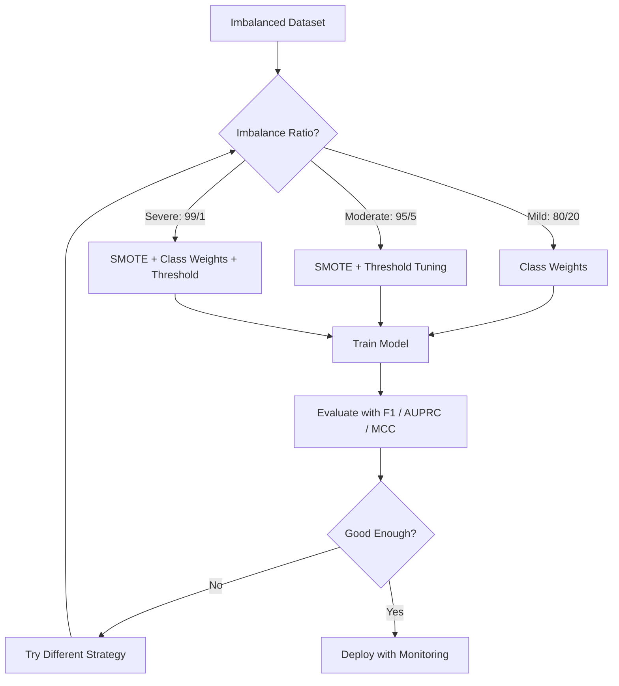
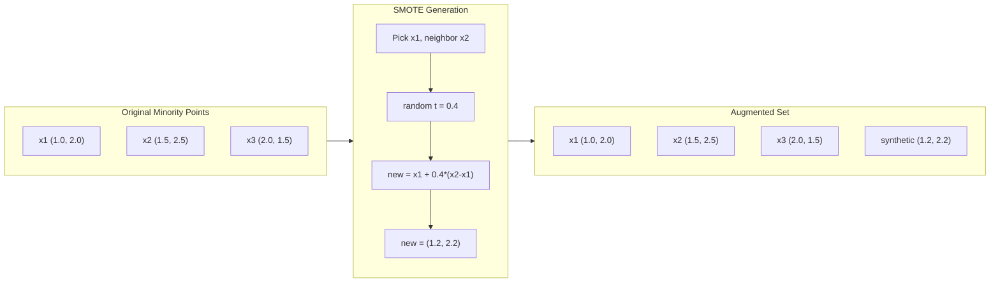
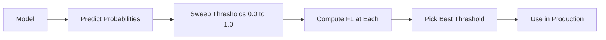
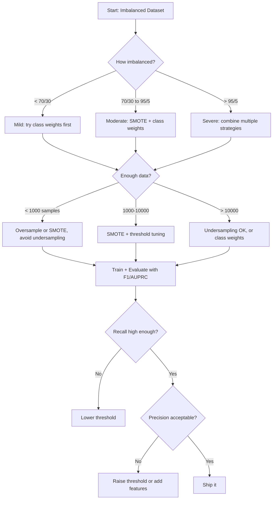

# 处理不平衡数据

> Quand vos données sont à 99% normales, l'exactitude est un mensonge.

**类型：**Construire
**语言：**Python
**先修要求：**Phase 2, leçons 01-09 (en particulier l'indicateur d'évaluation)
**时间：**À environ 90 minutes.

## Objectif de l'apprentissage

- De la réalisation de SMOTE à la réalisation de SMOTE,并 expliquer la suréchantillonnage synthétique est différent de la copie automatique
- Utiliser le coefficient de corrélation F1、AUPRC 和 Matthews  évaluer le classifiant de déséquilibre, plutôt que d'utiliser la précision
- Comparer les pondérations de classe, les seuils de réglage et les stratégies de reéchantillonnage,并为给定的不平衡比例选择合适方法
- Construire un pipeline de données complètes d'inéquilibres, combiné à SMOTE、peux de classe et optimisation des seuils

##  problématique

Tu as construit un modèle de test de fraude. Il a atteint une précision de 99,9%. Tu es très heureux.

Ceci n'est pas un bug. Lorsque seulement 0,1% des transactions sont frauduleuses, c'est une pratique logique.

Toutes les catégories de données sont très importantes, tout le monde est confronté à ce type de situation.

La précision échouera, car elle traite toutes les prédictions correctes de la même manière. La précision marque une transaction légale et la saisie d'une fraude, mais elle ne comporte qu'une fraction de la précision. Mais la saisie d'une fraude est la raison pour laquelle le modèle existe.

## 概念

### Pourquoi la précision va échouer

考虑一个包含1000个样本的数据集:990个负,10个正――一个始终预测负的模型:

|  | Predicted Positive | Predicted Negative |
|--|---|---|
| Actually Positive | 0 (TP) | 10 (FN) |
| Actually Negative | 0 (FP) | 990 (TN) |

La précision est de 0 + 990) / 1000 = 99,0%

Le modèle a capturé le 0 fois la fraude, la 0 maladie, la 0 défaut, mais l'exactitude montre 99% de l'exactitude.

### Un meilleur indicateur

**Precision**= TP / (TP + FP) ⋅ parmi tous les échantillons marqués comme positifs, il y a vraiment beaucoup de positifs ?

**Recall**= TP / (TP + FN) ⋅ Dans tous les exemples de vrais positifs, nous avons saisi combien ?

**F1 Score**= 2 * précision * rappel / (precision + rappel) ――调和平均数──相比算术平均数, il sera plus sévère地惩罚 précision 和 rappel 之间极端不平衡──

**F-beta Score**= (1 + bêta^2) * précision * rappel / (bêta^2 * précision + rappel)。 lorsque bêta > 1 时, rappel 更重要。当 bêta < 1 时, précision 更重要。 F2 在欺诈检测中很常见(漏掉欺诈比误报更糟)。

**AUPRC**(Area Under Precision-Retall Curve)── similaire à AUC-ROC, mais à l'égard des données déséquilibrées, la proportion de la classe positive du classifiant AUPRC est comparable à celle de la classe positive.

**Matthews Correlation Coefficient**= (TP * TN - FP * FN) / sqrt((TP+FP)(TP+FN)(TN+FP)(TN+FN))。 la gamme va de -1 à +1── seulement lorsque le modèle sur deux catégories se démarque bien, il donne un bon résultat.

Pour le modèle: précision = 0/0(non défini, habituellement en 0), rappel = 0/10 = 0,F1 = 0,MCC = 0── ces indicateurs permettent de bien identifier ce modèle sans valeur──

### Inéquilibre des données



### SMOTE: technique de dépistage des échantillons de la minorité synthétique

Le modèle est en suréchantillonnage et reproduit le modèle minoritaire existant.

SMOTE va créer de nouveaux modèles de minorité synthétique, ces modèles semblent raisonnables, mais pas de sous-modèles.

1. Pour chaque échantillon minoritaire, on trouve son voisin le plus proche parmi les autres échantillons minoritaires.
2. Choisissez un voisin
3. Créer un nouveau modèle sur la ligne entre x et le voisin

公式:`new_sample = x + random(0, 1) * (neighbor - x)`

Cela se produit dans la vraie minorité de points entre les valeurs, dans la même région de l'espace de fonctionnalités, plutôt que de simplement copier les données déjà disponibles.



### Prise d'échantillons  stratégies par rapport

**Random Oversampling**: Répondre à la minorité 样本, faire correspondre sa quantité à la majorité 
- 优点: simple, pas de perte d'information
- 缺点: complètement reprendre entraîne une suradaptation, augmenter le temps d'entraînement

**Random Undersampling**: élimination de la majorité 样本, en faisant correspondre la minorité à sa quantité 
- 优点: entraînement rapide,简单
- 缺点: abandonner la majorité potentiellement utile des données, plus de

**SMOTE**: par le biais de la création d'une minorité synthétique
- 优点: générer de nouveaux données, par rapport à l'échantillonnage aléatoire  réduit
- 缺点:可能在决策边界 附近创建噪声样本,不考虑多数阶级的分布

| Strategy | Data Changed | Risk | When to Use |
|----------|-------------|------|-------------|
| Oversample | 复制 minority | 过拟合 | 小数据集，中等不平衡 |
| Undersample | 移除 majority | 信息损失 | 大数据集，需要快速训练 |
| SMOTE | 添加 synthetic minority | 边界噪声 | 中等不平衡，有足够 minority 样本用于 k-NN |

### Poids de classe

Au lieu de modifier les données, il est préférable de modifier le modèle de traitement de l'erreur.

Pour un modèle contenant 950 questions négatives et 50 questions positives:
- classe négative 的权重 = n_samples / (2 * n_negative) = 1000 / (2 * 950) = 0,526
- classe positive 的权重 = n_samples / (2 * n_positive) = 1000 / (2 * 50) = 10,0

classe positive  obtient 19 倍权重──误分类 错分类 错分类 错分类 错分类 错分类 19 负类 错分类 错分类 错分类 错分类 错分类 错分类 错分类 错分类 错分类 错分类 错分类 错分类 错分类 错分类 错分类 错分类 错分类 错分类 错分类 错分类 错分类 错分类 错分类 错分类 错分类 错分类 错分类 错分类 错分类 错分类 错分类 错分类 错分类 错分类 错分类 错分类 错分类 错分类 错分类 错分类 错分类 错分类 错分类 错分类 错分类 错 错分类 错 错分类 错 错 错 分类 错分类 错 错 错 错 错 负类 错 错 负类 错 错 错 负类 错 错 错 错 负 错 负 类 错 错 错 错 负 错 负 类 错 错 错 错 错 负 负 负 类 错 负 负 负 负 负 负 负 负 负 负 负 负 负 负 负 负 负 负 负 负 负 负 负 负 负 负 负 负 负 负 负 负 负 负 负 负 负 负 负 负 负 负 负 负 负 负 负 负 负 负 负 负 负 负 负 负 负 负 负 负 负 负 负 负 负 负 负 负 负 负 负 负 负 负 负 负 负 负 负 负 负 负 负 负 负 负 负 负 负 负 负 负 负

Dans la régression logistique, cela modifie la fonction Perte:

```
weighted_loss = -sum(w_i * [y_i * log(p_i) + (1-y_i) * log(1-p_i)])
```

Parmi eux, il y a des échantillons qui dépendent de la catégorie.

Les poids de classe sont en termes d'expectative et de suréchantillonnage en termes d'équivalence mathématique, mais ne créent pas de nouveaux points de données. Cela les rend plus rapides et évite le risque de suradaptation de l'échantillon de répétition.

### Réglage du seuil

La majorité des classifiateurs va produire une probabilité. La valeur de prédiction est de 0,5. Si P (positif) >= 0,5, la prédiction est positive.

Le processus:
1. 训练一个模型
2. Dans l'ensemble de validation 上获取预测概率
3. De 0,0 à 1,0                                                                                                                                                                                                                                                                                                                                                                                                                                                                                                                         
4. Dans chaque valeur calculée F1 ((ou indicateur de votre choix)
5. 选择使指标最大的值



Un modèle peut être classé comme non-frauduceur pour une transaction frauduleuse P (fraud) = 0,15♦ en valeur de 0,5°, il sera classé comme non-frauduceur. En valeur de 0,10°, il sera correctement saisi.

### Un apprentissage peu coûteux

Les poids de classe ne sont pas une forme de coût unifié, mais une distribution de coûts de classe de classe:

| | Predict Positive | Predict Negative |
|--|---|---|
| Actually Positive | 0 (correct) | C_FN = 100 |
| Actually Negative | C_FP = 1 | 0 (correct) |

Le coût de la fraude par défaut est supérieur à celui d'une erreur par défaut.

Lorsque vous pouvez estimer le coût du monde réel, c'est la méthode la plus élémentaire. Une erreur de diagnostic et une erreur de rapport entraînent des examens supplémentaires, dont le coût est complètement différent.

###  processus de décision




```figure
class-imbalance
```

## - Je le construis.

### étape 1: générer un ensemble de données déséquilibré

```python
import numpy as np


def make_imbalanced_data(n_majority=950, n_minority=50, seed=42):
    rng = np.random.RandomState(seed)

    X_maj = rng.randn(n_majority, 2) * 1.0 + np.array([0.0, 0.0])
    X_min = rng.randn(n_minority, 2) * 0.8 + np.array([2.5, 2.5])

    X = np.vstack([X_maj, X_min])
    y = np.concatenate([np.zeros(n_majority), np.ones(n_minority)])

    shuffle_idx = rng.permutation(len(y))
    return X[shuffle_idx], y[shuffle_idx]
```

### 步骤 2: réalisation de la SMOTE à partir de zéro

```python
def euclidean_distance(a, b):
    return np.sqrt(np.sum((a - b) ** 2))


def find_k_neighbors(X, idx, k):
    distances = []
    for i in range(len(X)):
        if i == idx:
            continue
        d = euclidean_distance(X[idx], X[i])
        distances.append((i, d))
    distances.sort(key=lambda x: x[1])
    return [d[0] for d in distances[:k]]


def smote(X_minority, k=5, n_synthetic=100, seed=42):
    rng = np.random.RandomState(seed)
    n_samples = len(X_minority)
    k = min(k, n_samples - 1)
    synthetic = []

    for _ in range(n_synthetic):
        idx = rng.randint(0, n_samples)
        neighbors = find_k_neighbors(X_minority, idx, k)
        neighbor_idx = neighbors[rng.randint(0, len(neighbors))]
        t = rng.random()
        new_point = X_minority[idx] + t * (X_minority[neighbor_idx] - X_minority[idx])
        synthetic.append(new_point)

    return np.array(synthetic)
```

### 步骤 3: échantillonnage aléatoire et échantillonnage aléatoire

```python
def random_oversample(X, y, seed=42):
    rng = np.random.RandomState(seed)
    classes, counts = np.unique(y, return_counts=True)
    max_count = counts.max()

    X_resampled = list(X)
    y_resampled = list(y)

    for cls, count in zip(classes, counts):
        if count < max_count:
            cls_indices = np.where(y == cls)[0]
            n_needed = max_count - count
            chosen = rng.choice(cls_indices, size=n_needed, replace=True)
            X_resampled.extend(X[chosen])
            y_resampled.extend(y[chosen])

    X_out = np.array(X_resampled)
    y_out = np.array(y_resampled)
    shuffle = rng.permutation(len(y_out))
    return X_out[shuffle], y_out[shuffle]


def random_undersample(X, y, seed=42):
    rng = np.random.RandomState(seed)
    classes, counts = np.unique(y, return_counts=True)
    min_count = counts.min()

    X_resampled = []
    y_resampled = []

    for cls in classes:
        cls_indices = np.where(y == cls)[0]
        chosen = rng.choice(cls_indices, size=min_count, replace=False)
        X_resampled.extend(X[chosen])
        y_resampled.extend(y[chosen])

    X_out = np.array(X_resampled)
    y_out = np.array(y_resampled)
    shuffle = rng.permutation(len(y_out))
    return X_out[shuffle], y_out[shuffle]
```

### 步骤 4: Régression logistique des poids de classe

```python
def sigmoid(z):
    return 1.0 / (1.0 + np.exp(-np.clip(z, -500, 500)))


def logistic_regression_weighted(X, y, weights, lr=0.01, epochs=200):
    n_samples, n_features = X.shape
    w = np.zeros(n_features)
    b = 0.0

    for _ in range(epochs):
        z = X @ w + b
        pred = sigmoid(z)
        error = pred - y
        weighted_error = error * weights

        gradient_w = (X.T @ weighted_error) / n_samples
        gradient_b = np.mean(weighted_error)

        w -= lr * gradient_w
        b -= lr * gradient_b

    return w, b


def compute_class_weights(y):
    classes, counts = np.unique(y, return_counts=True)
    n_samples = len(y)
    n_classes = len(classes)
    weight_map = {}
    for cls, count in zip(classes, counts):
        weight_map[cls] = n_samples / (n_classes * count)
    return np.array([weight_map[yi] for yi in y])
```

### 步骤 5: réglage du seuil

```python
def find_optimal_threshold(y_true, y_probs, metric="f1"):
    best_threshold = 0.5
    best_score = -1.0

    for threshold in np.arange(0.05, 0.96, 0.01):
        y_pred = (y_probs >= threshold).astype(int)
        tp = np.sum((y_pred == 1) & (y_true == 1))
        fp = np.sum((y_pred == 1) & (y_true == 0))
        fn = np.sum((y_pred == 0) & (y_true == 1))

        if metric == "f1":
            precision = tp / (tp + fp) if (tp + fp) > 0 else 0.0
            recall = tp / (tp + fn) if (tp + fn) > 0 else 0.0
            score = 2 * precision * recall / (precision + recall) if (precision + recall) > 0 else 0.0
        elif metric == "recall":
            score = tp / (tp + fn) if (tp + fn) > 0 else 0.0
        elif metric == "precision":
            score = tp / (tp + fp) if (tp + fp) > 0 else 0.0

        if score > best_score:
            best_score = score
            best_threshold = threshold

    return best_threshold, best_score
```

### 步骤 6: évaluer la fonction

```python
def confusion_matrix_values(y_true, y_pred):
    tp = np.sum((y_pred == 1) & (y_true == 1))
    tn = np.sum((y_pred == 0) & (y_true == 0))
    fp = np.sum((y_pred == 1) & (y_true == 0))
    fn = np.sum((y_pred == 0) & (y_true == 1))
    return tp, tn, fp, fn


def compute_metrics(y_true, y_pred):
    tp, tn, fp, fn = confusion_matrix_values(y_true, y_pred)
    accuracy = (tp + tn) / (tp + tn + fp + fn)
    precision = tp / (tp + fp) if (tp + fp) > 0 else 0.0
    recall = tp / (tp + fn) if (tp + fn) > 0 else 0.0
    f1 = 2 * precision * recall / (precision + recall) if (precision + recall) > 0 else 0.0

    denom = np.sqrt(float((tp + fp) * (tp + fn) * (tn + fp) * (tn + fn)))
    mcc = (tp * tn - fp * fn) / denom if denom > 0 else 0.0

    return {
        "accuracy": accuracy,
        "precision": precision,
        "recall": recall,
        "f1": f1,
        "mcc": mcc,
    }
```

### 步骤 7: Comparer toutes les méthodes

```python
X, y = make_imbalanced_data(950, 50, seed=42)
split = int(0.8 * len(y))
X_train, X_test = X[:split], X[split:]
y_train, y_test = y[:split], y[split:]

# Baseline: no treatment
w_base, b_base = logistic_regression_weighted(
    X_train, y_train, np.ones(len(y_train)), lr=0.1, epochs=300
)
probs_base = sigmoid(X_test @ w_base + b_base)
preds_base = (probs_base >= 0.5).astype(int)

# Oversampled
X_over, y_over = random_oversample(X_train, y_train)
w_over, b_over = logistic_regression_weighted(
    X_over, y_over, np.ones(len(y_over)), lr=0.1, epochs=300
)
preds_over = (sigmoid(X_test @ w_over + b_over) >= 0.5).astype(int)

# SMOTE
minority_mask = y_train == 1
X_minority = X_train[minority_mask]
synthetic = smote(X_minority, k=5, n_synthetic=len(y_train) - 2 * int(minority_mask.sum()))
X_smote = np.vstack([X_train, synthetic])
y_smote = np.concatenate([y_train, np.ones(len(synthetic))])
w_sm, b_sm = logistic_regression_weighted(
    X_smote, y_smote, np.ones(len(y_smote)), lr=0.1, epochs=300
)
preds_smote = (sigmoid(X_test @ w_sm + b_sm) >= 0.5).astype(int)

# Class weights
sample_weights = compute_class_weights(y_train)
w_cw, b_cw = logistic_regression_weighted(
    X_train, y_train, sample_weights, lr=0.1, epochs=300
)
probs_cw = sigmoid(X_test @ w_cw + b_cw)
preds_cw = (probs_cw >= 0.5).astype(int)

# Threshold tuning (tune on held-out validation set, not test set)
probs_val = sigmoid(X_val @ w_cw + b_cw)
best_thresh, best_f1 = find_optimal_threshold(y_val, probs_val, metric="f1")
preds_thresh = (probs_cw >= best_thresh).astype(int)
```

Le code-fichier fonctionne dans un seul scénario et imprime les résultats.

## Utilisez-le

借助小学学习和失衡学习, ces techniques sont toutes nécessaires:

```python
from sklearn.linear_model import LogisticRegression
from sklearn.metrics import classification_report, f1_score
from sklearn.model_selection import train_test_split
from imblearn.over_sampling import SMOTE
from imblearn.under_sampling import RandomUnderSampler
from imblearn.pipeline import Pipeline

X_train, X_test, y_train, y_test = train_test_split(X, y, stratify=y)

model_weighted = LogisticRegression(class_weight="balanced")
model_weighted.fit(X_train, y_train)
print(classification_report(y_test, model_weighted.predict(X_test)))

smote = SMOTE(random_state=42)
X_resampled, y_resampled = smote.fit_resample(X_train, y_train)
model_smote = LogisticRegression()
model_smote.fit(X_resampled, y_resampled)
print(classification_report(y_test, model_smote.predict(X_test)))

pipeline = Pipeline([
    ("smote", SMOTE()),
    ("model", LogisticRegression(class_weight="balanced")),
])
pipeline.fit(X_train, y_train)
print(classification_report(y_test, pipeline.predict(X_test)))
```

De la version réalisée à zéro, il sera clair que chaque technique a fait quelque chose de concret.

## Je le livre.

Le cours est ouvert à:
- `outputs/skill-imbalanced-data.md`-- units traitement déséquilibre Classification  liste de décisions

## 练习

1. **Borderline-SMOTE**: modifier SMOTE 实现, uniquement pour une minorité proche de la limite de décision 点生成合成样本(即那些 k-neighborhood contained majority class 样本的点) ⋅ 在类别重叠的数据集上与标准 SMOTE比较结果──

2. **Cost matrix optimization**: réaliser un apprentissage sensible aux coûts, dont la matrice de coûts est un paramètre. Créer une fonction, recevoir une matrice de coûts et retourner à la meilleure prédiction du coût attendu.

3. **Threshold calibration**: réaliser une échelle plate ((( sur le modèle original output sur la régression logistique adaptée, pour générer la probabilité de recall de précision de la précédente édition de la précédente édition de la précédente édition de la précédente édition de la précédente édition de la précédente édition de la précédente édition de la précédente édition de la précédente édition de la précédente édition de la précédente édition de la précédente édition de la précédente édition de la précédente édition de la précédente édition de la précédente édition de la précédente édition de la précédente édition de la précédente édition de la précédente édition de la précédente édition de la précédente édition de la précédente édition de la précédente édition de la précédente édition de la précédente édition de la précédente édition de la précédente édition de la précédente édition de la précédente édition de la précédente édition de la précédente édition de la précédente édition de la précédente édition de la précédente édition de la dernière édition de la dernière édition de la dernière édition de la dernière édition de la dernière édition de la dernière édition de la dernière édition de la dernière édition de la dernière édition de la dernière édition de la dernière édition de la dernière édition de la dernière édition de la dernière édition de la dernière édition de la dernière édition de la dernière édition de la dernière édition de la dernière édition de la dernière édition de la dernière édition de la dernière édition de la dernière édition de la dernière édition de la dernière édition de la dernière édition de la dernière édition de la dernière édition de la dernière édition de la dernière édition de la dernière édition de la dernière édition de la dernière édition de la dernière édition de la dernière édition de la dernière édition de la dernière édition de la dernière édition

4. **Ensemble with balanced bagging**: entraîner plusieurs modèles, chaque modèle utilisant un bootstrap équilibré 样本(toutes les minorités + majorité de l'association) ⋅ pour les prévoir en moyenne── comparer cette méthode avec un modèle SMOTE utilisé individuellement── mesurer la performance ainsi que la différence entre plusieurs opérations──

5. **Imbalance ratio experiment**: Prenez un ensemble de données équilibrées, et améliorez progressivement le ratio de déséquilibre ((50/50、70/30、90/10、95/5、99/1)  pour chaque proportion, séparément dans les situations d'utilisation et non d'utilisation de SMOTE

## 关键术语

| Term | What people say | What it actually means |
|------|----------------|----------------------|
| Class imbalance | “一个类别的样本多得多” | 数据集中类别分布显著偏斜，导致模型偏向 majority class |
| SMOTE | “Synthetic oversampling” | 通过在现有 minority 样本及其 k-nearest minority neighbors 之间插值，创建新的 minority 样本 |
| Class weights | “让 rare class 上的错误代价更高” | 用特定类别的权重乘以 Loss Function，使模型对 minority 误分类施加更重惩罚 |
| Threshold tuning | “移动 decision boundary” | 将 Classification 的概率 cutoff 从默认 0.5 改为能优化目标指标的值 |
| Precision-recall tradeoff | “你不能两者兼得” | 降低阈值会抓住更多 positive（更高 recall），但也会标记更多 false positive（更低 precision），反之亦然 |
| AUPRC | “PR curve 下的面积” | 将 precision-recall curve 汇总为一个数字；当类别严重不平衡时，比 AUC-ROC 信息量更大 |
| Matthews Correlation Coefficient | “平衡指标” | 预测标签与真实标签之间的相关性；只有模型在两个类别上都表现良好时才会产生高分 |
| Cost-sensitive learning | “不同错误的代价不同” | 将现实世界中的误分类成本纳入训练目标，使模型优化总成本，而不是错误数量 |
| Random oversampling | “复制 minority” | 重复 minority class 样本以平衡类别数量；简单，但有过拟合到重复点的风险 |

## 延伸阅读

- [SMOTE: Synthetic Minority Over-sampling Technique (Chawla et al., 2002)](https://arxiv.org/abs/1106.1813)-- Origini SMOTE 论文, qui est encore le travail le plus cité dans l'apprentissage de l'inégalité
- [Learning from Imbalanced Data (He & Garcia, 2009)](https://ieeexplore.ieee.org/document/5128907)- - Des méthodes de prélèvement complète, à faible coût et à niveau algorithmique
- [imbalanced-learn documentation](https://imbalanced-learn.org/stable/)-- Python 库, fournir SMOTE 变体、 sous-échantillonnage  stratégies et pipeline 集成
- [The Precision-Recall Plot Is More Informative than the ROC Plot (Saito & Rehmsmeier, 2015)](https://journals.plos.org/plosone/article?id=10.1371/journal.pone.0118432)-- Quoi et pourquoi dans les problèmes d'équilibre, il faut prioriser l'utilisation de courbes de relations publiques plutôt que de courbes ROC
