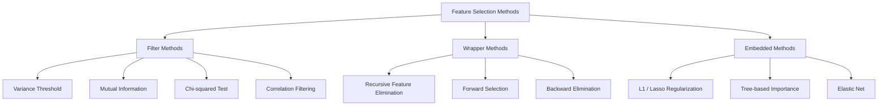
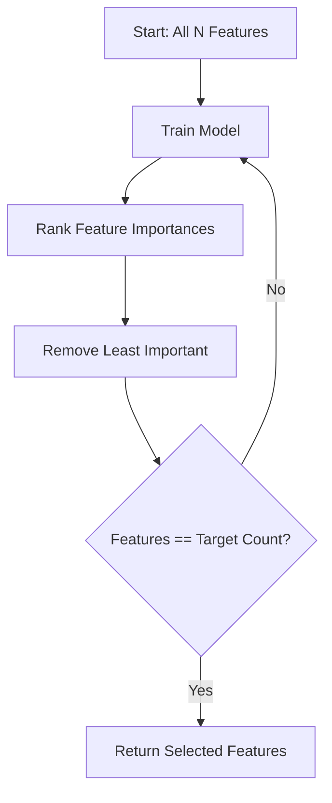
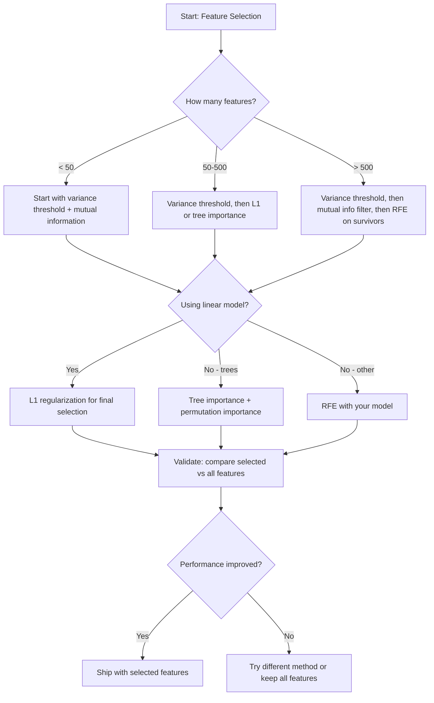

# Sélection de fonctionnalités

> Plus de fonctionnalités ne sont pas meilleures.

**Type:** Build
**Language:**Python
**先修要求：**Phase 2, leçons 01-09, 08
**Time:** ~75 分钟

## Objectif de l'apprentissage
- De la réalisation de méthodes de filtre à zéro (méthodes de sortie de la variante, de l'information mutuelle, du carré) et de l'emballage (méthodes de sélection de l'avance)
- explication de pourquoi les informations mutuelles  capture de corrélation  Répercussions de caractéristiques non liées  relation 
- Comparer la régularisation de L1 (sélection intégrée) avec la sélection de l'emballage (RFE) (sélection d'emballage),并评估它们的计算权衡
- Construire un pipeline de sélection de fonctionnalités combiné à plusieurs méthodes, et démontrer son efficacité dans les données conservées pour améliorer la généralisation

##  problématique
Vous avez 500 fonctionnalités. Votre modèle s'entraîne très lentement, il est souvent trop bien, et personne ne peut expliquer ce qu'il a appris. Vous ajoutez toujours plus de fonctionnalités, vous souhaitez améliorer ses performances.

C'est la malédiction de la dimensionnalité. Avec les caractéristiques de la quantité de croissance, l'espace de caractéristiques de l'épaisseur se développe de façon explosive.

La sélection de fonctionnalités est la solution. Désaccage du bruit. Élimination de la redondance. Réservation des caractéristiques qui portent réellement des informations.

L'objectif n'est pas d'utiliser toutes les informations disponibles, mais d'utiliser les informations exactes.

## 概念
### Sélection de fonctionnalités

Chaque méthode de sélection de caractéristiques appartient à l'une des trois catégories suivantes:



**Filter methods**Utilisez la statistique indépendamment pour chaque fonctionnalité 打分── elles n'utilisent pas de modèle──速度快, mais vont manquer d'interactions fonctionnelles──

**Wrapper methods**訓練模型 来评估 feature subset── elles utilisent la performance du modèle 作为分数──结果更好,但成本更高,因为需要多次重训练模型──

**Embedded methods**Dans le processus de formation du modèle, la sélection des caractéristiques. La régularisation de L1 va faire avancer les poids vers zéro. Les arbres de décision seront basés sur les caractéristiques les plus utiles.

### Un seuil de variation

Si une fonctionnalité entre les échantillons  presque pas de changement, il ne contient presque pas d'information 

 considérez une caractéristique, parmi les 1000 échantillons, il y en a 999 qui sont 0,0― sa variance 接近零― pas de modèle 能用它来区分类别―移除它―

```
variance(x) = mean((x - mean(x))^2)
```

设置一个门️ (exemple 0.01)  丢弃每个变量 低于这个门的特征──                                                                                                                                                                                                                                                

Utilisation: comme étape de pré-traitement précédant d'autres méthodes, il capture à peu près à tout prix des caractéristiques évidemment inutiles.

 Limite: une caractéristique peut avoir une forte variance, mais reste pur bruit― un seuil de variation est nécessaire, mais insuffisant―

### Informations mutuelles

L'information mutuelle  mesure la valeur de la fonction X peut réduire en grande partie l'incertitude de la fonction Y visée 

```
I(X; Y) = sum_x sum_y p(x, y) * log(p(x, y) / (p(x) * p(y)))
```

Si X 和 Y 独立, alors p(x, y) = p(x) * p(y), alors log 项为零,I(X; Y) = 0。X 能告诉你越多关于Y的信息,相互信息就越高。

Par rapport à la corrélation, les informations mutuelles peuvent être captées par des relations non-lineaires. Une caractéristique peut être correlative à la cible, mais les informations mutuelles sont très élevées, car les relations peuvent être quadratiques ou périodiques.

Pour les caractéristiques continues, on doit d'abord discerner les contenus des contenus.


### Élimination de la caractéristique récursive (RFE)

RFE est une méthode d'emballage. Elle utilise le modèle de la taille de la branche.

1. Utilisation de toutes les fonctionnalités  formation modèle
2. 按重点对特征 排名(modèles linéaires Utilisez des coefficients, des arbres Utilisez la réduction des impuretés)
3. 移除最不重要 feature (s)
4. 重复, jusqu'à ce que restent des caractéristiques du nombre d'expectations



RFE considérera les interactions de fonctionnalités, car le modèle verra simultanément toutes les fonctionnalités restantes. Le retrait d'une fonctionnalité modifiera l'importance des autres fonctionnalités.

Pour les 500 fonctionnalités, le but est de 10 et c'est 490 fois de formation. Pour les modèles coûteux, c'est très lent.

### L1 (Lasso) Régularisation

L1 régularisation 会把 weights 的绝对值加入 Loss Function:

```
loss = prediction_error + alpha * sum(|w_i|)
```

Les caractéristiques de contrôle des paramètres alpha sont modifiées.

Pourquoi se définir exactement pour zéro ? L1 pénalité dans l'espace de poids crée une zone de contraction en forme de ︎. Le meilleur résultat est souvent situé dans un coin de cette forme, où un ou plusieurs poids pour zéro. L2 régularisation.

C'est la sélection de fonctionnalités intégrées: modèle pendant l'entraînement Quelles fonctionnalités devriez-vous ignorer ?

优势: seulement une formation nécessaire,能处理相关特征(选择其中一个并把其他置零),内置于大多数线性模型实现中──

Limitation: uniquement applicable aux modèles linéaires.

### L'importance de la caractéristique d'un arbre

Les arbres de décision et leurs ensembles (forêts aléatoires, augmentation du degré) vont naturellement réduire les impuretés, chaque section réduira les impuretés, la classification utilise Gini ou entropie, la régression utilise la variance, produisent des réductions plus importantes des impuretés, plus important.

Pour les arbres de la forêt:

```
importance(feature_j) = (1/T) * sum over all trees of
    sum over all nodes splitting on feature_j of
        (n_samples * impurity_decrease)
```

Il fournit un score d'importance normalisé pour chaque fonctionnalité. Il peut traiter automatiquement les relations non-lineaires et les interactions de fonctionnalités.

Attention:l'importance basée sur l'arbre 会偏向具有许多独特的价值的特征 (high cardinality) 随机ID 列会显得重要,因为它能完美分每样品──使用变量重要性──作为智能检查──

### Importance de la permutation

Une méthode de modèle-agnostique:

1. entraînement modèle, et les données de validation 上 enregistrer la performance de base
2. Pour chaque fonctionnalité: à chaque fois que vous mélangez ses valeurs, la performance de mesure diminue
3. La baisse est plus importante.

Si le mélange d'une fonction ne nuit pas à la performance, explique que le modèle ne dépend pas de lui. Si la performance s'effondre, cette fonction est très importante.

L'importance de la permutation  a évité le biais de la cardinalité de l'importance basée sur l'arbre  mais c'est très lent: chaque caractéristique a besoin d'une évaluation complète et doit être répétée plusieurs fois pour obtenir la stabilité

### Tableau de comparaison

| Method | Type | Speed | Nonlinear | Feature Interactions |
|--------|------|-------|-----------|---------------------|
| Variance threshold | Filter | 非常快 | 否 | 否 |
| Mutual information | Filter | 快 | 是 | 否 |
| Correlation filter | Filter | 快 | 否 | 否 |
| RFE | Wrapper | 慢 | 取决于 model | 是 |
| L1 / Lasso | Embedded | 快 | 否（linear） | 否 |
| Tree importance | Embedded | 中等 | 是 | 是 |
| Permutation importance | Model-agnostic | 慢 | 是 | 是 |

### Tableau de débit des décisions




```figure
f3-feature-prune
```

## - Je le construis.
### 步骤 1: Générer des données synthétiques avec une structure de fonctionnalités connue

```python
import numpy as np


def make_feature_selection_data(n_samples=500, seed=42):
    rng = np.random.RandomState(seed)

    x1 = rng.randn(n_samples)
    x2 = rng.randn(n_samples)
    x3 = rng.randn(n_samples)
    x4 = x1 + 0.1 * rng.randn(n_samples)
    x5 = x2 + 0.1 * rng.randn(n_samples)

    informative = np.column_stack([x1, x2, x3, x4, x5])

    correlated = np.column_stack([
        x1 * 0.9 + 0.1 * rng.randn(n_samples),
        x2 * 0.8 + 0.2 * rng.randn(n_samples),
        x3 * 0.7 + 0.3 * rng.randn(n_samples),
        x1 * 0.5 + x2 * 0.5 + 0.1 * rng.randn(n_samples),
        x2 * 0.6 + x3 * 0.4 + 0.1 * rng.randn(n_samples),
    ])

    noise = rng.randn(n_samples, 10) * 0.5

    X = np.hstack([informative, correlated, noise])
    y = (2 * x1 - 1.5 * x2 + x3 + 0.5 * rng.randn(n_samples) > 0).astype(int)

    feature_names = (
        [f"info_{i}" for i in range(5)]
        + [f"corr_{i}" for i in range(5)]
        + [f"noise_{i}" for i in range(10)]
    )

    return X, y, feature_names
```

Nous savons que la vérité fondamentale: les caractéristiques 0-4 sont informatives, et 3 和 4 sont des copies correlatives de 0 和 1), les caractéristiques 5-9 sont associées aux caractéristiques informatives, les caractéristiques 10-19 sont purement bruyantes, une bonne méthode de sélection devrait être 0-4 排得最高,把 10-19 排得最低,

### 步骤 2: seuil de variance

```python
def variance_threshold(X, threshold=0.01):
    variances = np.var(X, axis=0)
    mask = variances > threshold
    return mask, variances
```

### 步骤 3: Informations mutuelles (discrètes)

```python
def discretize(x, n_bins=10):
    min_val, max_val = x.min(), x.max()
    if max_val == min_val:
        return np.zeros_like(x, dtype=int)
    bin_edges = np.linspace(min_val, max_val, n_bins + 1)
    binned = np.digitize(x, bin_edges[1:-1])
    return binned


def mutual_information(X, y, n_bins=10):
    n_samples, n_features = X.shape
    mi_scores = np.zeros(n_features)

    y_vals, y_counts = np.unique(y, return_counts=True)
    p_y = y_counts / n_samples

    for f in range(n_features):
        x_binned = discretize(X[:, f], n_bins)
        x_vals, x_counts = np.unique(x_binned, return_counts=True)
        p_x = dict(zip(x_vals, x_counts / n_samples))

        mi = 0.0
        for xv in x_vals:
            for yi, yv in enumerate(y_vals):
                joint_mask = (x_binned == xv) & (y == yv)
                p_xy = np.sum(joint_mask) / n_samples
                if p_xy > 0:
                    mi += p_xy * np.log(p_xy / (p_x[xv] * p_y[yi]))
        mi_scores[f] = mi

    return mi_scores
```

### 步骤 4: Élimination de la caractéristique récursive

```python
def simple_logistic_importance(X, y, lr=0.1, epochs=100):
    n_samples, n_features = X.shape
    w = np.zeros(n_features)
    b = 0.0

    for _ in range(epochs):
        z = X @ w + b
        pred = 1.0 / (1.0 + np.exp(-np.clip(z, -500, 500)))
        error = pred - y
        w -= lr * (X.T @ error) / n_samples
        b -= lr * np.mean(error)

    return w, b


def rfe(X, y, n_features_to_select=5, lr=0.1, epochs=100):
    n_total = X.shape[1]
    remaining = list(range(n_total))
    rankings = np.ones(n_total, dtype=int)
    rank = n_total

    while len(remaining) > n_features_to_select:
        X_subset = X[:, remaining]
        w, _ = simple_logistic_importance(X_subset, y, lr, epochs)
        importances = np.abs(w)

        least_idx = np.argmin(importances)
        original_idx = remaining[least_idx]
        rankings[original_idx] = rank
        rank -= 1
        remaining.pop(least_idx)

    for idx in remaining:
        rankings[idx] = 1

    selected_mask = rankings == 1
    return selected_mask, rankings
```

### 步骤 5: sélection de fonctionnalités L1

```python
def soft_threshold(w, alpha):
    return np.sign(w) * np.maximum(np.abs(w) - alpha, 0)


def l1_feature_selection(X, y, alpha=0.1, lr=0.01, epochs=500):
    n_samples, n_features = X.shape
    w = np.zeros(n_features)
    b = 0.0

    for _ in range(epochs):
        z = X @ w + b
        pred = 1.0 / (1.0 + np.exp(-np.clip(z, -500, 500)))
        error = pred - y

        gradient_w = (X.T @ error) / n_samples
        gradient_b = np.mean(error)

        w -= lr * gradient_w
        w = soft_threshold(w, lr * alpha)
        b -= lr * gradient_b

    selected_mask = np.abs(w) > 1e-6
    return selected_mask, w
```

### 步骤 6: Importance basée sur l'arbre (arbre de décision simple)

```python
def gini_impurity(y):
    if len(y) == 0:
        return 0.0
    classes, counts = np.unique(y, return_counts=True)
    probs = counts / len(y)
    return 1.0 - np.sum(probs ** 2)


def best_split(X, y, feature_idx):
    values = np.unique(X[:, feature_idx])
    if len(values) <= 1:
        return None, -1.0

    best_threshold = None
    best_gain = -1.0
    parent_gini = gini_impurity(y)
    n = len(y)

    for i in range(len(values) - 1):
        threshold = (values[i] + values[i + 1]) / 2.0
        left_mask = X[:, feature_idx] <= threshold
        right_mask = ~left_mask

        n_left = np.sum(left_mask)
        n_right = np.sum(right_mask)

        if n_left == 0 or n_right == 0:
            continue

        gain = parent_gini - (n_left / n) * gini_impurity(y[left_mask]) - (n_right / n) * gini_impurity(y[right_mask])

        if gain > best_gain:
            best_gain = gain
            best_threshold = threshold

    return best_threshold, best_gain


def tree_importance(X, y, n_trees=50, max_depth=5, seed=42):
    rng = np.random.RandomState(seed)
    n_samples, n_features = X.shape
    importances = np.zeros(n_features)

    for _ in range(n_trees):
        sample_idx = rng.choice(n_samples, size=n_samples, replace=True)
        feature_subset = rng.choice(n_features, size=max(1, int(np.sqrt(n_features))), replace=False)

        X_boot = X[sample_idx]
        y_boot = y[sample_idx]

        tree_imp = _build_tree_importance(X_boot, y_boot, feature_subset, max_depth)
        importances += tree_imp

    total = importances.sum()
    if total > 0:
        importances /= total

    return importances


def _build_tree_importance(X, y, feature_subset, max_depth, depth=0):
    n_features = X.shape[1]
    importances = np.zeros(n_features)

    if depth >= max_depth or len(np.unique(y)) <= 1 or len(y) < 4:
        return importances

    best_feature = None
    best_threshold = None
    best_gain = -1.0

    for f in feature_subset:
        threshold, gain = best_split(X, y, f)
        if gain > best_gain:
            best_gain = gain
            best_feature = f
            best_threshold = threshold

    if best_feature is None or best_gain <= 0:
        return importances

    importances[best_feature] += best_gain * len(y)

    left_mask = X[:, best_feature] <= best_threshold
    right_mask = ~left_mask

    importances += _build_tree_importance(X[left_mask], y[left_mask], feature_subset, max_depth, depth + 1)
    importances += _build_tree_importance(X[right_mask], y[right_mask], feature_subset, max_depth, depth + 1)

    return importances
```

### 步骤 7: Exécuter toutes les méthodes et comparer

代码文件会在同一合成数据集上运行全部五种方法,并打印一个比较表,显示每个方法选择了哪些功能──

## Utilisez-le
Utilisation de la fonctionnalité de la sélection de fonctionnalités

```python
from sklearn.feature_selection import (
    VarianceThreshold,
    mutual_info_classif,
    RFE,
    SelectFromModel,
)
from sklearn.linear_model import Lasso, LogisticRegression
from sklearn.ensemble import RandomForestClassifier

vt = VarianceThreshold(threshold=0.01)
X_filtered = vt.fit_transform(X)

mi_scores = mutual_info_classif(X, y)
top_k = np.argsort(mi_scores)[-10:]

rfe_selector = RFE(LogisticRegression(), n_features_to_select=10)
rfe_selector.fit(X, y)
X_rfe = rfe_selector.transform(X)

lasso_selector = SelectFromModel(Lasso(alpha=0.01))
lasso_selector.fit(X, y)
X_lasso = lasso_selector.transform(X)

rf = RandomForestClassifier(n_estimators=100)
rf.fit(X, y)
importances = rf.feature_importances_
```

Ces processus de mise à jour ont montré exactement ce qui se passe à l'intérieur de chaque méthode.`var(X, axis=0)`Il est également utilisé pour la mise en œuvre de la mise en œuvre de la méthode de calcul de la fréquence de l'émission de données.

Les données de l'équipe de recherche ont été analysées dans le cadre de la recherche sur les données de recherche et de recherche.

## Je le livre.
Le programme de formation
- `outputs/skill-feature-selector.md`-- Utilisé pour choisir correctement la méthode de sélection de fonctionnalités de l' arbre de décision de référence rapide

## 练习
1. **Forward selection**: réaliser le processus inversé de la RFE. Débuter à partir de 0 caractéristiques. Chaque étape ajoute une caractéristique qui améliore le mieux les performances du modèle.

2. **Stability selection**: fonctionnalité L1 sélection 50 fois, chaque fois que vous utilisez des données, 80% de chaque sous-échantillon, et utilisez des valeurs alpha légèrement différentes.

3. **Multicollinearity detection**: calcul de toutes les caractéristiques de la matrice de corrélation. Pour réaliser une fonction, un seuil de corrélation donné, par exemple 0,9, de chaque par rapport à des caractéristiques hautement corrélatives, il est possible de déplacer une caractéristique.

4. **Feature selection pipeline**Le filtre de l'information mutuelle et la RFE sont en train de former un pipeline.

5. **Permutation importance from scratch**Pour réaliser l'importance de la permutation, mélangez les valeurs de chaque fonctionnalité 10 fois, mesurez la moyenne de la note F1.

## 关键术语
| Term | What people say | What it actually means |
|------|----------------|----------------------|
| Filter method | “独立为 features 打分” | 一种 feature selection 方法，不训练 model，而是使用统计度量对 features 排名，并孤立地评估每个 feature |
| Wrapper method | “用 model 挑 features” | 一种 feature selection 方法，通过训练 model 并使用其 performance 作为 selection criterion 来评估 feature subsets |
| Embedded method | “model 在训练期间选择 features” | 作为 model fitting 一部分发生的 feature selection，例如 L1 regularization 会把 weights 推向零 |
| Mutual information | “一个变量能告诉你关于另一个变量的多少信息” | 给定 X 的知识后，关于 Y 的不确定性减少量的度量，能够捕捉线性和非线性 dependencies |
| Recursive Feature Elimination | “训练、排名、剪枝、重复” | 一种迭代式 wrapper method，会训练 model、移除最不重要的 feature(s)，并重复直到达到 target count |
| L1 / Lasso regularization | “会消灭 features 的 penalty” | 将 weight 绝对值之和加入 Loss Function，这会把不重要 feature 的 weights 推到精确为零 |
| Variance threshold | “移除 constant features” | 丢弃在 samples 之间 variance 低于指定 threshold 的 features，过滤掉不携带信息的 features |
| Feature importance | “哪些 features 最重要” | 表示每个 feature 对 model predictions 贡献程度的分数，可由 split gains（trees）或 coefficient magnitudes（linear）计算 |
| Permutation importance | “shuffle 并测量损害” | 通过随机 shuffle 每个 feature 的 values，并测量由此导致的 model performance 下降来评估 feature importance |
| Curse of dimensionality | “features 太多，data 不够” | 添加 features 会使 feature space 的体积指数级增长，导致 data 稀疏且 distances 失去意义的现象 |

## 延伸阅读
- [An Introduction to Variable and Feature Selection (Guyon & Elisseeff, 2003)](https://jmlr.org/papers/v3/guyon03a.html)- des méthodes de sélection de caractéristiques, qui sont encore largement citées
- [scikit-learn Feature Selection Guide](https://scikit-learn.org/stable/modules/feature_selection.html)--                                                                                                                                                                                                                                                                                                                                                                                                                                                                                                                             
- [Stability Selection (Meinshausen & Buhlmann, 2010)](https://arxiv.org/abs/0809.2932)-- combiner le sous-échantillonnage avec la sélection des caractéristiques, pour obtenir des résultats robustes et reproducibles
- [Beware Default Random Forest Importances (Strobl et al., 2007)](https://bmcbioinformatics.biomedcentral.com/articles/10.1186/1471-2105-8-25)-- montrer l'importance basée sur l'arbre 中的 Kardinality bias,并提出条件重要性 作为替代方案
