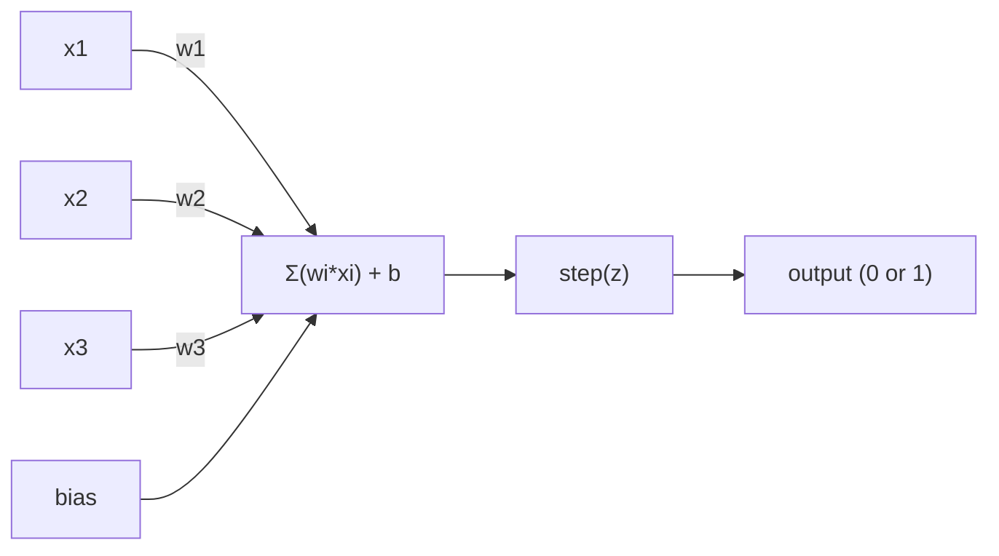
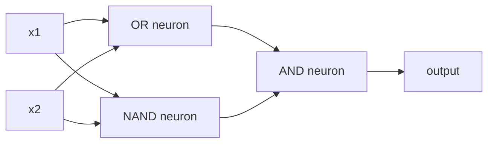

# Le Perceptron

> Le Perceptron est l'atome du réseau neuronal. Quand on le décompose, on voit des poids, un biais, une décision.

**类型：**Construction
**语言：**Python
**先修要求：**Phase 1 ((Algebra linéaire 直觉)
**时间：**- 60 minutes

## Objectif de l'apprentissage
- Utilisez Python à partir de zéro pour réaliser un Perceptron, y compris la règle de mise à jour du poids et la fonction d'activation des étapes
- Expliquer pourquoi un seul Perceptron ne peut résoudre que des problèmes séparables linéairement, et démontrer le cas de défaillance XOR
- 通过组合OR、NAND 和 AND gates 构建一个多层感觉器来解决XOR
- Utiliser l'activation sigmoïde et la propagation en arrière  entraîner un réseau à deux couches, faire son apprentissage automatique XOR

##  problématique
Vous avez compris le produit vecteur et point. Vous savez que la Matrice transformera les entrées en sorties. Mais comment les machines apprennent-elles à utiliser cette transformation ?

Perceptron répond à cette question. C'est la machine d'apprentissage la plus simple: il reçoit des entrées, multiplie les poids, ajoute les biais, puis prend une décision binaire.

Comprendre Perceptron, ça signifie comprendre le code dans le code.

## 概念
### Un neurone, une décision.

Un Perceptron reçoit n'importe quel input, multiplie chaque input par un poids, demande et ajoute un biais, puis transfère le résultat dans une fonction d'activation.



fonction de étape 非常直接: si la somme pondérée加 bias >= 0, alors la sortie 为 1──否则, la sortie 为 0──

```
step(z) = 1  if z >= 0
           0  if z < 0
```

Ceci est un classifiateur linéaire. Les poids et les biais définissent une ligne.

### La limite de décision

Pour deux entrées, Perceptron se trouve dans l'espace 2D.

```
  x2
  ┤
  │  Class 1        /
  │    (0)          /
  │                /
  │               / w1·x1 + w2·x2 + b = 0
  │              /
  │             /     Class 2
  │            /        (1)
  ┼───────────/──────────── x1
```

Le processus de formation se déplace sur cette ligne jusqu'à ce qu'elle puisse être correctement séparée de ces classes.

### La règle de l'apprentissage

La règle d'apprentissage de Perceptron est très simple:

```
For each training example (x, y_true):
    y_pred = predict(x)
    error = y_true - y_pred

    For each weight:
        w_i = w_i + learning_rate * error * x_i
    bias = bias + learning_rate * error
```

Si la prédiction est correcte, l'erreur = 0, tout ne changera pas. Si elle prévoit 0 mais devrait être 1, les poids augmenteront. Si elle prévoit 1 mais devrait être 0, les poids diminueront.

### Le problème de la XOR

Regardez ces portes logiques:

```
AND gate:           OR gate:            XOR gate:
x1  x2  out         x1  x2  out         x1  x2  out
0   0   0           0   0   0           0   0   0
0   1   0           0   1   1           0   1   1
1   0   0           1   0   1           1   0   1
1   1   1           1   1   1           1   1   0
```

ET 和 OR est linéairement séparable de: vous pouvez dessiner une ligne,把 0 和 1 分开;; XOR 则不是──没有任何一条直线能把 [0,1] 和 [1,0] 与 [0,0] 和 [1,1] 分开──

```
AND (separable):        XOR (not separable):

  x2                      x2
  1 ┤  0     1            1 ┤  1     0
    │     /                 │
  0 ┤  0 / 0              0 ┤  0     1
    ┼──/──────── x1         ┼──────────── x1
       line works!          no single line works!
```

Ceci est une limite fondamentale. Un seul Perceptron ne peut résoudre que des problèmes séparables linéairement. Minsky et Papert en 1969 l'ont prouvé, ce qui a presque fait que les recherches sur les réseaux neuronaux ont été suspendues pendant une décennie.

 solución: mettre la perception  堆叠成层──multi-layer perception 通过把两个 décisions linéaires 组合成一个非线性决定来解决XOR──


```figure
perceptron-boundary
```

## - Je le construis.
### 步骤 1: La classe Perceptron

```python
class Perceptron:
    def __init__(self, n_inputs, learning_rate=0.1):
        self.weights = [0.0] * n_inputs
        self.bias = 0.0
        self.lr = learning_rate

    def predict(self, inputs):
        total = sum(w * x for w, x in zip(self.weights, inputs))
        total += self.bias
        return 1 if total >= 0 else 0

    def train(self, training_data, epochs=100):
        for epoch in range(epochs):
            errors = 0
            for inputs, target in training_data:
                prediction = self.predict(inputs)
                error = target - prediction
                if error != 0:
                    errors += 1
                    for i in range(len(self.weights)):
                        self.weights[i] += self.lr * error * inputs[i]
                    self.bias += self.lr * error
            if errors == 0:
                print(f"Converged at epoch {epoch + 1}")
                return
        print(f"Did not converge after {epochs} epochs")
```

### 步骤 2: dans les portes de la logique 上训练

```python
and_data = [
    ([0, 0], 0),
    ([0, 1], 0),
    ([1, 0], 0),
    ([1, 1], 1),
]

or_data = [
    ([0, 0], 0),
    ([0, 1], 1),
    ([1, 0], 1),
    ([1, 1], 1),
]

not_data = [
    ([0], 1),
    ([1], 0),
]

print("=== AND Gate ===")
p_and = Perceptron(2)
p_and.train(and_data)
for inputs, _ in and_data:
    print(f"  {inputs} -> {p_and.predict(inputs)}")

print("\n=== OR Gate ===")
p_or = Perceptron(2)
p_or.train(or_data)
for inputs, _ in or_data:
    print(f"  {inputs} -> {p_or.predict(inputs)}")

print("\n=== NOT Gate ===")
p_not = Perceptron(1)
p_not.train(not_data)
for inputs, _ in not_data:
    print(f"  {inputs} -> {p_not.predict(inputs)}")
```

### 步骤 3: observer XOR 失败

```python
xor_data = [
    ([0, 0], 0),
    ([0, 1], 1),
    ([1, 0], 1),
    ([1, 1], 0),
]

print("\n=== XOR Gate (single perceptron) ===")
p_xor = Perceptron(2)
p_xor.train(xor_data, epochs=1000)
for inputs, expected in xor_data:
    result = p_xor.predict(inputs)
    status = "OK" if result == expected else "WRONG"
    print(f"  {inputs} -> {result} (expected {expected}) {status}")
```

Il ne converge jamais. C'est une seule preuve que le Perceptron ne peut pas apprendre XOR.

### 步骤 4: Avec deux couches  résoudre XOR

技巧是:XOR = (x1 OR x2) ET NON (x1 ET x2)



```python
def xor_network(x1, x2):
    or_neuron = Perceptron(2)
    or_neuron.weights = [1.0, 1.0]
    or_neuron.bias = -0.5

    nand_neuron = Perceptron(2)
    nand_neuron.weights = [-1.0, -1.0]
    nand_neuron.bias = 1.5

    and_neuron = Perceptron(2)
    and_neuron.weights = [1.0, 1.0]
    and_neuron.bias = -1.5

    hidden1 = or_neuron.predict([x1, x2])
    hidden2 = nand_neuron.predict([x1, x2])
    output = and_neuron.predict([hidden1, hidden2])
    return output


print("\n=== XOR Gate (multi-layer network) ===")
for inputs, expected in xor_data:
    result = xor_network(inputs[0], inputs[1])
    print(f"  {inputs} -> {result} (expected {expected})")
```

Les quatre situations sont toutes correctes.

### Étape 5: entraîner un réseau à deux couches

Étape 4 La connexion à la fonction de la ligne de mesure est efficace pour XOR, mais pour ceux qui ne connaissent pas les poids exacts, la solution est de remplacer la fonction de la ligne de mesure par la sigmoïde et de revenir à la propagation automatique des poids.

```python
class TwoLayerNetwork:
    def __init__(self, learning_rate=0.5):
        import random
        random.seed(0)
        self.w_hidden = [[random.uniform(-1, 1), random.uniform(-1, 1)] for _ in range(2)]
        self.b_hidden = [random.uniform(-1, 1), random.uniform(-1, 1)]
        self.w_output = [random.uniform(-1, 1), random.uniform(-1, 1)]
        self.b_output = random.uniform(-1, 1)
        self.lr = learning_rate

    def sigmoid(self, x):
        import math
        x = max(-500, min(500, x))
        return 1.0 / (1.0 + math.exp(-x))

    def forward(self, inputs):
        self.inputs = inputs
        self.hidden_outputs = []
        for i in range(2):
            z = sum(w * x for w, x in zip(self.w_hidden[i], inputs)) + self.b_hidden[i]
            self.hidden_outputs.append(self.sigmoid(z))
        z_out = sum(w * h for w, h in zip(self.w_output, self.hidden_outputs)) + self.b_output
        self.output = self.sigmoid(z_out)
        return self.output

    def train(self, training_data, epochs=10000):
        for epoch in range(epochs):
            total_error = 0
            for inputs, target in training_data:
                output = self.forward(inputs)
                error = target - output
                total_error += error ** 2

                d_output = error * output * (1 - output)

                saved_w_output = self.w_output[:]
                hidden_deltas = []
                for i in range(2):
                    h = self.hidden_outputs[i]
                    hd = d_output * saved_w_output[i] * h * (1 - h)
                    hidden_deltas.append(hd)

                for i in range(2):
                    self.w_output[i] += self.lr * d_output * self.hidden_outputs[i]
                self.b_output += self.lr * d_output

                for i in range(2):
                    for j in range(len(inputs)):
                        self.w_hidden[i][j] += self.lr * hidden_deltas[i] * inputs[j]
                    self.b_hidden[i] += self.lr * hidden_deltas[i]
```

```python
net = TwoLayerNetwork(learning_rate=2.0)
net.train(xor_data, epochs=10000)
for inputs, expected in xor_data:
    result = net.forward(inputs)
    predicted = 1 if result >= 0.5 else 0
    print(f"  {inputs} -> {result:.4f} (rounded: {predicted}, expected {expected})")
```

Il est différent de l'étape 4 et il y a deux différences importantes. Premièrement, le sigmoïde a remplacé la fonction de l'étape, car il est plane, donc le gradient existe.`train`方法把 error from output Backpropagation to hidden layer,并按每个重量调整它们对错误的贡献比例──这是20 行代码中的 Backpropagation──

C'est le pont de la leçon 03`d_output`et `hidden_deltas`La mathématique de derrière, est de mettre la règle de la chaîne à l'application du graphique réseau.

## Utilisez-le
Tout ce que vous avez construit depuis le zéro, est dans un seul import:

```python
from sklearn.linear_model import Perceptron as SkPerceptron
import numpy as np

X = np.array([[0,0],[0,1],[1,0],[1,1]])
y = np.array([0, 0, 0, 1])

clf = SkPerceptron(max_iter=100, tol=1e-3)
clf.fit(X, y)
print([clf.predict([x])[0] for x in X])
```

Tu as 30 pages.`Perceptron`La classe fait la même chose. La version de Sklearn a augmenté les contrôles de convergence, plusieurs types de fonctions de perte, ainsi que le support de saisie rare, mais le cycle central est complètement le même: fonction pondérée de somme, de pas, d'erreur, de mise à jour de poids.

Les différences réelles se manifestent à l'échelle des réseaux de production.

- fonction étape 会变成 sigmoid、ReLU ou autre activation de plane
- Les poids seront répartis par la répartition automatique
- Les couches deviendront plus profondes: 3 ̊10 ̊100+ couches
- Le même principe est toujours valable: chaque couche est de la production de la couche précédente en créant de nouvelles fonctionnalités

Un seul Perceptron ne peut que dessiner une ligne droite.

## Je le livre.
Le cours est ouvert à:
- `outputs/skill-perceptron.md`- Une compétence, explique quand il faut des architectures à couche unique et à couche multi-architecture

## 练习
1. Dans la porte NAND, tout circuit logique peut être construit par NAND.
2. Modifier la classe Perceptron, faire en sorte qu'elle se déplace à chaque époque avec la limite de décision ((w1*x1 + w2*x2 + b = 0) ▽ 打印在 AND gate 训练期间这条线如何移动──
3. Construire un Perceptron à 3 entrées: seulement lorsque 3 entrées sont en production 1 个为 1 时才输出 1 个 (la fonction de vote majoritaire) ⋅ est-il séparable de manière linéaire ? Pourquoi ?

## 关键术语
| Term | What people say | What it actually means |
|------|----------------|----------------------|
| Perceptron | “一个假的 neuron” | 一个 linear classifier：inputs 与 weights 的 dot product，加上 bias，再通过 step function |
| Weight | “一个 input 有多重要” | 一个 multiplier，用来缩放每个 input 对 decision 的贡献 |
| Bias | “threshold” | 一个 constant，用来平移 decision boundary，让 Perceptron 即使在 inputs 为零时也能触发 |
| Activation function | “压缩数值的东西” | 一个在 weighted sum 之后应用的 function：Perceptron 使用 step function，现代 networks 使用 sigmoid/ReLU |
| Linearly separable | “你能在它们之间画一条线” | 一个 dataset，其中单个 hyperplane 可以完美分离 classes |
| XOR problem | “Perceptron 做不到的那件事” | single-layer networks 无法学习 non-linearly-separable functions 的证明 |
| Decision boundary | “classifier 发生切换的位置” | 将 input space 分成两个 classes 的 hyperplane w*x + b = 0 |
| Multi-layer perceptron | “一个真正的 Neural Network” | 按 layers 堆叠的 Perceptron，其中每一层的 output 会输入到下一层 |

## 延伸阅读
- Frank Rosenblatt, Le Perceptron: un modèle probabiliste de stockage et d'organisation de l'information dans le cerveau(1958) -- 开创这一切的原始论文
- Minsky & Papert, Perceptrons(1969) -- Ce livre prouve que XOR ne peut pas être résolu par des réseaux à couche unique, et que la recherche sur Perceptron s'est arrêtée pendant une décennie.
- Michael Nielsen, Réseaux neuraux et apprentissage profond,chapitre 1http://neuralnetworksanddeeplearning.com/）--免费在线资源, est la meilleure explication visuelle de la façon dont Perceptron compose les réseaux
