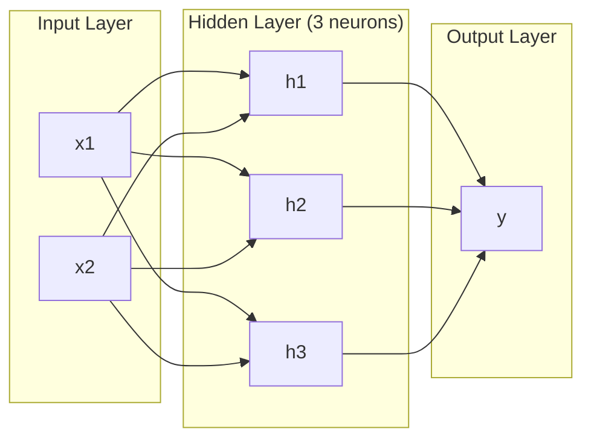
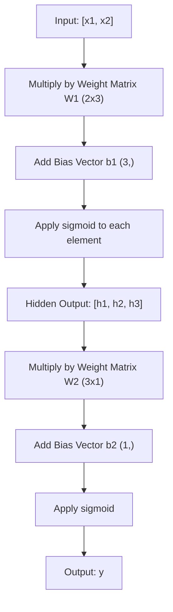
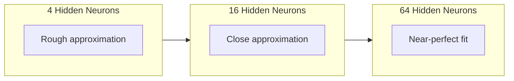

# Réseau multi-couches et passe-passe

> Un neurone dessine une ligne... et les pose, tu peux dessiner n'importe quoi...

**Type:** 构建
**Languages:** Python
**Prerequisites:** Phase 01（Math Foundations），Lesson 03.01（The Perceptron）
**Time:** 约 90 分钟

## Objectif de l'apprentissage

- Utilisation de la classe Layer 和 Network de zéro construire un réseau multi-couches, terminer le complet Pass avant
-  Trace réseau Matrix  Dimensions dans chaque couche,并identifier la forme non correspondant
- 解释堆叠非线性激活 如何让网络学习曲的决策边界
- Utilisation 2-2-1 架构和手工调好的 sigmoid 权重解决 XOR 问题

##  problématique

Un seul neurone est un appareil de dessin. Il ne peut que tracer une ligne droite dans vos données. Chaque véritable problème de l'IA - image identification, compréhension de la langue, compréhension du jeu - a besoin de courbes.

En 1969, Minsky et Papert ont prouvé que cette limite est fatale: le réseau de niveau unique ne peut pas apprendre XOR. Il n'est pas très difficile à apprendre.

Cela a fait que le financement du réseau neural s'est arrêté pendant plus de dix ans. En revanche, la méthode de réparation est évidente: ne pas utiliser une seule couche.

Ce complément est un réseau à plusieurs niveaux. Il est la base de chaque modèle d'apprentissage profond dans l'environnement de production actuel. Le passage à l'avant - données de la couche d'entrée à la couche cachée à la couche de sortie - est la première chose que vous devez construire avant que tout le reste ne fonctionne.

## 概念

### L'équipe de l'équipe de l'équipe de l'équipe de l'équipe de l'équipe de l'équipe de l'équipe de l'équipe de l'équipe de l'équipe de l'équipe de l'équipe de l'équipe de l'équipe de l'équipe de l'équipe de l'équipe de l'équipe de l'équipe de l'équipe de l'équipe de l'équipe de l'équipe de l'équipe de l'équipe de l'équipe de l'équipe de l'équipe

Un réseau multicouche a trois niveaux:

**输入层**--  strictement speaking ≠ un seul niveau. ≠ un seul niveau. ≠ un seul niveau. ≠ un seul niveau. ≠ un seul niveau. ≠ un seul niveau. ≠ un seul niveau. ≠ un seul niveau. ≠ un seul niveau. ≠ un seul niveau. ∞

**Hidden layer**-- 工作发生的地方── chaque neuron reçoit chaque sortie de la couche supérieure, applique le poids et un biais, puis transfère le résultat dans la fonction activation── est appelé Hidden, car vous ne verrez pas directement ces valeurs dans les données de formation──

**输出层**-- 最终答案── Pour les classes, utilisez un neurone avec sigmoïde── Pour les classes, chaque classe un neurone──



Ceci est un 2-3-1 网络── deux entrées, trois neurones cachés, une sortie── chaque connexion porte un poids── chaque neurone (à l'exclusion de l'entrée) porte un biais──

Chaque couche produit un ensemble de vecteurs numériques composés, appelés état caché. Pour le texte, l'état caché augmente la dimension. Pour les images, elles diminuent la dimension. Pour les images, elles réduisent la dimension. Pour les millions de images, elles se compriment en expressions gérables.

### Neurons et actives

Chaque neurone fait trois choses:

1. Chaque entrée sera multipliée par le poids du résultat
2. Toutes les multiples sont ajoutées à un biais
3. Pour le faire et pour le faire

Maintenant, la fonction activée est sigmoïde:

```
sigmoid(z) = 1 / (1 + e^(-z))
```

Le sigmoïde va réduire l'emplacement numérique à (0, 1) ⋅ dans la gamme de la plus grande entrée positive à 1 ⋅ dans la plus grande entrée négative à 0 ⋅ dans la plus grande entrée négative à 0,5 ⋅ dans la même gamme de la plus grande entrée négative.

### Pass avant: données comment流动

Le passage à l'avant passera l'entrée de données de niveau en niveau sur le réseau jusqu'à ce qu'il arrive à la sortie.



Dans chaque étape, trois opérations se dérouleront en ordre:

```
z = W * input + b       (linear transformation)
a = sigmoid(z)           (activation)
```

Une couche de pass pass devient une couche de pass de pass.

### Matrice 维度

追踪维度 est la plus importante des compétences de référencement dans l'apprentissage profond.

| Step | Operation | Dimensions | Result Shape |
|------|-----------|------------|-------------|
| 输入 | x | -- | (2,) |
| Hidden 线性部分 | W1 * x + b1 | W1: (3, 2), b1: (3,) | (3,) |
| Hidden 激活 | sigmoid(z1) | -- | (3,) |
| 输出线性部分 | W2 * h + b2 | W2: (1, 3), b2: (1,) | (1,) |
| 输出激活 | sigmoid(z2) | -- | (1,) |

規則:第 k 層の重量 Matrix W's shape is (neurons_in_layer_k, neurons_in_layer_k_minus_1)。行对应应应上一层。列对应应上一层。

### Théorème de l'approximation universelle

En 1989, George Cybenko a prouvé un fait extraordinaire: un réseau neural possédant une seule couche cachée et suffisamment de neurones, peut approcher avec une précision souhaitée toute fonction continue.

Cela ne signifie pas qu'une couche cachée 总是最佳选择── cela signifie que cette structure est théoriquement capable── en pratique, un réseau plus profond (environ plus de couches, plus de couches) peut utiliser beaucoup moins de fonctionnalités similaires que le réseau plus large et plus basses.

直觉是: chaque neurone dans la couche cachée apprend une formation ou une caractéristique. Tant qu'il y a suffisamment de formation, il les place en bonne position, et peut approcher n'importe quelle courbe plane.



### La composition

Le réseau neural est configurable. Vous pouvez les compiler, les connecter, les faire fonctionner. Le modèle de chuchotement utilise un réseau de décodeur.


```figure
mlp-forward
```

## - Je le construis.

純 Python──不使用 numpy──每一个矩阵操作都从零编写──

### 步骤 1: Sigmoid 激活

```python
import math

def sigmoid(x):
    x = max(-500.0, min(500.0, x))
    return 1.0 / (1.0 + math.exp(-x))
```

Mettez la valeur de la clé à [500, 500] pour empêcher le débordement.`math.exp(500)`Très grand mais encore limité.`math.exp(1000)`C'est un peu grand.

### 步骤 2: Classe de couche

Toutes les opérations les plus importantes dans l'apprentissage profond sont la matrice 乘法──每一层、每次注意头──每次前进通过-- 底层都是 matmul──一线层 接收一个输入向量,将它乘以权重矩阵,并加上偏差向向量:y = Wx + b──这个单一程占据90%的计算量在神经网络中──

Une couche de sauvegarde d'une matrice de poids et d'un vecteur de biais. Sa méthode de progression reçoit un vecteur d'entrée et retourne à l'extrait activé.

```python
class Layer:
    def __init__(self, n_inputs, n_neurons, weights=None, biases=None):
        if weights is not None:
            self.weights = weights
        else:
            import random
            self.weights = [
                [random.uniform(-1, 1) for _ in range(n_inputs)]
                for _ in range(n_neurons)
            ]
        if biases is not None:
            self.biases = biases
        else:
            self.biases = [0.0] * n_neurons

    def forward(self, inputs):
        self.last_input = inputs
        self.last_output = []
        for neuron_idx in range(len(self.weights)):
            z = sum(
                w * x for w, x in zip(self.weights[neuron_idx], inputs)
            )
            z += self.biases[neuron_idx]
            self.last_output.append(sigmoid(z))
        return self.last_output
```

权重矩阵的形状是 (n_neurons, n_inputs) ⋅每一行是一个神经元跨所有输入的权重──前进方法 遍历神经元,计算加权和加偏见,应用 sigmoid,并收集结果──

### 步骤 3: Classe réseau

Un réseau est une liste de couches. Le passage à l'avant les liera: les sorties de la première couche entreront dans la première couche.

```python
class Network:
    def __init__(self, layers):
        self.layers = layers

    def forward(self, inputs):
        current = inputs
        for layer in self.layers:
            current = layer.forward(current)
        return current
```

C'est tout le passage à l'avant.

### 步骤 4: Utiliser un bon pouvoir de résoudre XOR

Dans la leçon 01 , nous avons résolu XOR à travers la combinaison OR、NAND 和 AND perceptron.

```python
hidden = Layer(
    n_inputs=2,
    n_neurons=2,
    weights=[[20.0, 20.0], [-20.0, -20.0]],
    biases=[-10.0, 30.0],
)

output = Layer(
    n_inputs=2,
    n_neurons=1,
    weights=[[20.0, 20.0]],
    biases=[-30.0],
)

xor_net = Network([hidden, output])

xor_data = [
    ([0, 0], 0),
    ([0, 1], 1),
    ([1, 0], 1),
    ([1, 1], 0),
]

for inputs, expected in xor_data:
    result = xor_net.forward(inputs)
    predicted = 1 if result[0] >= 0.5 else 0
    print(f"  {inputs} -> {result[0]:.6f} (rounded: {predicted}, expected: {expected})")
```

较大的权重(20, -20) Faire apparaître le sigmoïde comme une fonction de phase jump。 la première neurone cachée 近似 OR。 la deuxième proche NAND。输出神经元把它们组合成 AND,也就是 XOR。

### 步骤 5: 圆形分类

Un problème plus difficile: classer les points 2D en centre de point d'origine, en demi-dôme de 0,5 d'un cercle intérieur ou extérieur.

```python
import random
import math

random.seed(42)

data = []
for _ in range(200):
    x = random.uniform(-1, 1)
    y = random.uniform(-1, 1)
    label = 1 if (x * x + y * y) < 0.25 else 0
    data.append(([x, y], label))

circle_net = Network([
    Layer(n_inputs=2, n_neurons=8),
    Layer(n_inputs=8, n_neurons=1),
])
```

Utilisation du pouvoir à chaque fois, le réseau de distribution ne fonctionnera pas bien. Mais le passage avant continuera à fonctionner.

```python
correct = 0
for inputs, expected in data:
    result = circle_net.forward(inputs)
    predicted = 1 if result[0] >= 0.5 else 0
    if predicted == expected:
        correct += 1

print(f"Accuracy with random weights: {correct}/{len(data)} ({100*correct/len(data):.1f}%)")
```

Leur capacité à se révéler est plus faible que celle de la plupart des neurones.

## Utilisez-le

PyTorch utilise quatre lignes de code pour terminer tout ce qui précède:

```python
import torch
import torch.nn as nn

model = nn.Sequential(
    nn.Linear(2, 8),
    nn.Sigmoid(),
    nn.Linear(8, 1),
    nn.Sigmoid(),
)

x = torch.tensor([[0.0, 0.0], [0.0, 1.0], [1.0, 0.0], [1.0, 1.0]])
output = model(x)
print(output)
```

`nn.Linear(2, 8)`C'est votre classe de couche: forme 为 (8, 2) du poids de la matrice, forme 为 (8,) du vecteur de biais.`nn.Sigmoid()`Il est votre sigmoid 函数, chaque élément appliquée.`nn.Sequential`C'est votre classe de réseau:

La différence est en termes de vitesse et de taille. PyTorch fonctionne sur les GPU, traite des millions d'échantillons en lots, et se comporte automatiquement pour le gradient de backpropagation.

## Je le livre.

Cette formation a été créée pour une mise en page réutilisable, destinée à concevoir des architectures de réseau:

- `outputs/prompt-network-architect.md`

Quand vous devez décider de combien de niveaux, de niveaux de neurones, et de quelles fonctions d'activation vous devez utiliser pour un problème donné, vous pouvez l'utiliser.

## 练习

1. Construire une 2-4-2-1 网络(deux couches cachées), et utiliser le XOR données sur le pouvoir de chargement de l'avance passe。 imprimer le milieu de couche cachée de sortie, observer indiquer comment les changements dans chaque couche。

2. La couche cachée du cercle de la machine à répartition grandit de 8 à 2, à 32 à 32 fois.

3. Dans la classe réseau, il y a une mise en œuvre.`count_parameters`Le nombre total de poids et de biais à retourner.

4. Pour un 3-4-4-2 网络构建 Forward pass. Pour l'intégrer dans la RGB 颜值 (RGB) 归结到0-1,并观察两个输出.

5. Utilisez une fonction de mesure de mesure de mesure de la valeur de la valeur de la valeur de la valeur de la valeur de la valeur de la valeur de la valeur de la valeur de la valeur de la valeur de la valeur de la valeur de la valeur de la valeur de la valeur de la valeur de la valeur de la valeur de la valeur de la valeur de la valeur de la valeur de la valeur de la valeur de la valeur de la valeur de la valeur de la valeur de la valeur de la valeur de la valeur de la valeur de la valeur de la valeur de la valeur de la valeur de la valeur de la valeur de la valeur de la valeur de la valeur de la valeur de la valeur de la valeur de la valeur de la valeur de la valeur de la valeur de la valeur de la valeur de la valeur de la valeur de la valeur de la valeur de la valeur de la valeur de la valeur de la valeur de la valeur de la valeur de la valeur de la valeur de la valeur de la valeur de la valeur de la valeur de la valeur de la valeur de la valeur de la valeur de la valeur de la valeur de la valeur de la valeur de la valeur de la valeur de la valeur de la valeur de la valeur de la valeur de la valeur de la valeur de la valeur de la valeur de la valeur de la valeur de la valeur de la valeur de la valeur de la valeur de la valeur de la valeur de la valeur de la valeur de la valeur de la valeur de la valeur de la valeur de la valeur de la valeur de la valeur de la valeur de la valeur de la valeur de la valeur de la valeur de la valeur de la valeur de la valeur de la valeur de la valeur de la valeur de la valeur de la valeur de la valeur de la valeur de la valeur de la valeur de la valeur de la valeur de la valeur de la valeur de la valeur de la valeur de la valeur de la valeur de la valeur de la valeur de la valeur de la valeur de la valeur de la valeur de la valeur de la valeur de la valeur de la valeur de la valeur de la valeur de la valeur de la valeur de la valeur de la valeur de la valeur de la valeur de la valeur de la valeur de la valeur de la valeur de la valeur de la valeur de la valeur de la valeur de la valeur de la valeur de la valeur de la valeur de la valeur de la valeur de la valeur de la valeur de la valeur de la valeur de la valeur de la valeur de la valeur

## 关键术语

| Term | 人们会怎么说 | 它实际意味着什么 |
|------|----------------|----------------------|
| Forward pass | “运行模型” | 将输入推过每一层 -- 乘以权重、加上 bias、激活 -- 以产生输出 |
| Hidden layer | “中间部分” | 输入和输出之间的任意层，其值不会在数据中被直接观察到 |
| Multi-layer network | “一个深的 Neural Network” | 按顺序堆叠的神经元层，其中每一层的输出会输入到下一层 |
| Activation function | “非线性” | 在线性变换之后应用的函数，用来把曲线引入决策边界 |
| Sigmoid | “S 曲线” | sigma(z) = 1/(1+e^(-z))，将任意实数压缩到 (0,1)，平滑且处处可微 |
| Weight matrix | “参数” | 一个 shape 为 (current_layer_neurons, previous_layer_neurons) 的 Matrix W，包含可学习的连接强度 |
| Bias vector | “偏移量” | 在 Matrix 乘法之后添加的 Vector，使神经元即使在所有输入为零时也能激活 |
| Universal approximation | “Neural Network 可以学习任何东西” | 一个拥有足够多神经元的单 hidden layer 可以逼近任意连续函数 -- 但“足够多”可能意味着数十亿 |
| Linear transformation | “Matrix 乘法步骤” | z = W * x + b，激活前的计算，将输入映射到一个新空间 |
| Decision boundary | “分类器切换的地方” | 输入空间中的一个曲面，网络输出在这里跨过分类阈值 |

## 延伸阅读

- Michael Nielsen, "Réseaux neuronaux et apprentissage profond", chapitre 1-2 (http://neuralnetworksanddeeplearning.com/) -- 关于 Forward pass 和网络结构最清晰的免费解释, contenant une interaction visualisée
- Cybenko, " Approximation par superposition d'une fonction sigmoïdale " (1989) -- le théorème d'approximation universel initial 论文,出乎意料地易读
- 3Blue1Brown, "Mais qu'est-ce qu'un réseau neural?"https://www.youtube.com/watch?v=aircAruvnKk) -- 20 minutes de visibilité de la classe, du poids et du passage à l'avant, aide à établir un modèle de cœur correct
- Bienfaiteur, Bengio, Courville, "Apprentissage en profondeur", chapitre 6 (https://www.deeplearningbook.org/) -- référence standard de réseau multilayer, lecture en ligne gratuite
