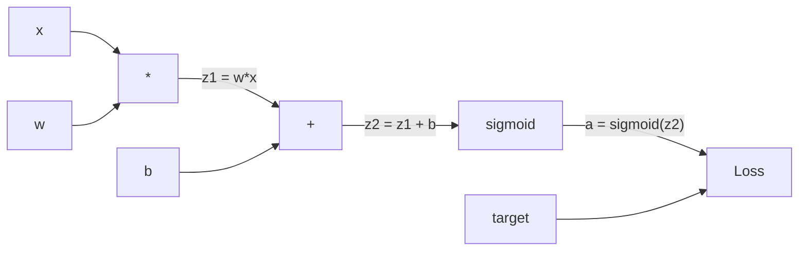
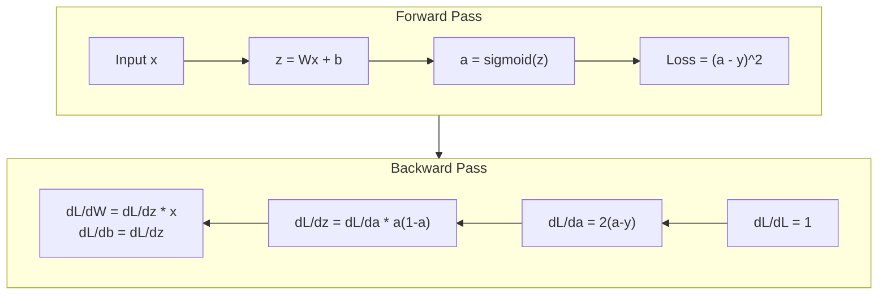
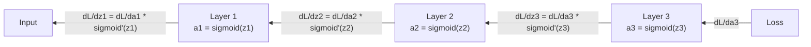

# De zéro réaliser la propagation de l' arrière

> La répartition est un algorithme qui permet d'apprendre. Sans elle, le réseau neural n'est qu'un générateur de nombres aléatoires coûteux.

**Type:** Build
**Languages:** Python
**Prerequisites:** Lesson 03.02 (Multi-Layer Networks)
**Time:** ~120 minutes

## Objectif de l'apprentissage
-  réaliser un moteur autograd basé sur la valeur, il construira un graphique informatique, et par le sort topologique  calculer le gradient
- Utiliser la règle de la chaîne 推导 addition、multiplication 和 sigmoid's Backward Pass
-  utiliser seulement vous de la réalisation de la moteur de répartition, dans XOR et la classification de cercle  entraîner un réseau multicouche
- Identification du gradient de disparition du réseau sigmoïde à niveau profond

##  problématique
Votre réseau a une couche cachée, comprenant 768 entrées et 3072 sorties. C'est le poids de 2,359,296 pouvoirs. Il a fait une erreur de prédiction. Quels pouvoirs ont conduit à cette erreur?

La pratique simple est: prendre un poids, le déplacer légèrement un point, le faire refaire une fois de plus, mesurer la perte est de monter ou de descendre. Ceci donne le poids Gradient.

La répartition de l'arrière-plan a résolu ce problème. Une fois avant, une fois après, tous les gradients sont calculés. La clé est la règle de chaîne du calcul, appliquée systématiquement au graphique informatique.

## 概念
### Règlement de chaîne, appliqué au réseau

Vous êtes en phase 01, leçon 05 中见过链条规则──快速回顾:

Dans le réseau neuronal, 链条 est la séquence d'opération de l'entrée à la perte. Chaque couche d'application a un poids de charge, une mise en place de la position, une réaction de mise en activation. La fonction de perte comporte la sortie finale et la mise en relation avec la cible.

### Graphiques de calcul

Chaque fois que le Forward Pass construit un graphique, chaque nœud est une opération, le "multiplication" est un "add" (sigmoid) ".



Passage à l'avant: valeur de gauche vers droite流动──x 和 w 产生 z1 = w*x──加上 b 得到 z2──Sigmoid 给出激活 a──使用 Loss Function 将 a 与 target y 比较──

Pass en arrière:Gradient de droite vers gauche流动。 de dL/da 开始(Loss 如何随激活 改变)。乘以 da/dz2(sigmoid derivative)。 obtenir dL/dz2。拆分成 dL/db((il équivaut à dL/dz2, puisque z2 = z1 + b) 和 dL/dz1。 puis dL/dw = dL/dz1 * x,dL/dx = dL/dz1 * w。

Chaque nœud dans le graphique pendant le passage en arrière a une seule tâche: recevoir le gradient du passage en haut, multiplier par son propre dérivé local, puis le transmettre vers le bas.

### En avant et en arrière



Le Pass à l'avant est le stockage de chaque valeur intermédiaire:z、a、 de chaque couche d'entrée. Le Pass à l'arrière est le stockage de chaque valeur intermédiaire.

### Gradient dans le réseau

Pour un réseau de 3 couches, les chaînes de gradient traversent chaque couche:



Dans chaque couche, le gradient est multiplié par une dérivation sigmoïde. La dérivation sigmoïde est un * (1 - a), la valeur maximale est 0,25 ((quand a = 0,5 时) ⋅ profondément dans les trois couches, le gradient jusqu'à présent est multiplié par 0,25^3 = 0,0156⋅ profondément dans les dix couches: 0,25^10 = 0,000001⋅

### Des gradients qui disparaissent

C'est le gradient qui disparaît. Le segment sigmoïde se réduit à 0,25 et le segment sigmoïde se réduit à 0,25 et le segment sigmoïde se réduit à 0,2 et le segment sigmoïde se réduit à 0,2 et le segment sigmoïde se réduit à 0,2 et le segment sigmoïde se réduit à 0,2 et le segment sigmoïde se réduit à 0,2 et le segment sigmoïde se réduit à 0,2 et le segment sigmoïde se réduit à 0,2 et le segment sigmoïde se réduit à 0,2 et le segment sigmoïde se réduit à 0,2 et le segment sigmoïde se réduit à 0,2 et le segment sigmoïde se réduit à 0,2 et le segment sigmoïde se réduit à 0,2 et le segment sigmoïde se réduit à 0,2 et le segment sigmoïde se réduit à 0,2 et le segment sigmoïde se réduit à 0,2 et le segment sigmoïde.

```
sigmoid(z):     Output range [0, 1]
sigmoid'(z):    Max value 0.25 (at z = 0)

After 5 layers:   gradient * 0.25^5 = 0.001x original
After 10 layers:  gradient * 0.25^10 = 0.000001x original
```

C'est pourquoi le réseau sigmoïde de profondeur est presque impossible à entraîner. Le problème réside dans ce qu'il traverse.

### 推导 Gradient du réseau à deux couches

Le tableau ci-dessous est un exemple mathématique concret: réseau avec une entrée x 带 sigmoid de couche cachée 带 sigmoid de couche de sortie, ainsi que MSE Loss ⋅

Pass avant:
```
z1 = W1 * x + b1
a1 = sigmoid(z1)
z2 = W2 * a1 + b2
a2 = sigmoid(z2)
L = (a2 - y)^2
```

Pass rétrograde (à l'arrière)
```
dL/da2 = 2(a2 - y)
da2/dz2 = a2 * (1 - a2)
dL/dz2 = dL/da2 * da2/dz2 = 2(a2 - y) * a2 * (1 - a2)

dL/dW2 = dL/dz2 * a1
dL/db2 = dL/dz2

dL/da1 = dL/dz2 * W2
da1/dz1 = a1 * (1 - a1)
dL/dz1 = dL/da1 * da1/dz1

dL/dW1 = dL/dz1 * x
dL/db1 = dL/dz1
```

Chaque gradient est une dérivé locale de la perte suivie par la multiplication.


```figure
backprop-vanishing
```

## - Je le construis.
### 步骤 1: Nœud de valeur

Chaque chiffre de notre calcul devient une valeur. Il stocke ses propres données, Gradient, ainsi que la façon dont il est créé.

```python
class Value:
    def __init__(self, data, children=(), op=''):
        self.data = data
        self.grad = 0.0
        self._backward = lambda: None
        self._children = set(children)
        self._op = op

    def __repr__(self):
        return f"Value(data={self.data:.4f}, grad={self.grad:.4f})"
```

Il n'y a pas de fonction de décalage.`_children`La valeur de la graphie est de type topologique.

### 步骤 2: Opération de la fonction rétroactive

Chaque opération crée une nouvelle valeur, définit le degré de réaction.

```python
def __add__(self, other):
    other = other if isinstance(other, Value) else Value(other)
    out = Value(self.data + other.data, (self, other), '+')

    def _backward():
        self.grad += out.grad
        other.grad += out.grad

    out._backward = _backward
    return out

def __mul__(self, other):
    other = other if isinstance(other, Value) else Value(other)
    out = Value(self.data * other.data, (self, other), '*')

    def _backward():
        self.grad += other.data * out.grad
        other.grad += self.data * out.grad

    out._backward = _backward
    return out
```

Pour l'ajout: d(a+b)/da = 1,d(a+b)/db = 1── donc les deux entrées seront directement obtenues en sortie.

Pour la multiplication:d(a*b)/da = b,d(a*b)/db = a。 chaque entrée aura une autre valeur d'entrée 乘以 sortie Gradient。

`+=`Une valeur peut être utilisée par plusieurs opérations. Son gradient est le gradient de tous les chemins.

### 步骤 3: Sigmoïde et perte

```python
import math

def sigmoid(self):
    x = self.data
    x = max(-500, min(500, x))
    s = 1.0 / (1.0 + math.exp(-x))
    out = Value(s, (self,), 'sigmoid')

    def _backward():
        self.grad += (s * (1 - s)) * out.grad

    out._backward = _backward
    return out
```

Dérivé de sigmoïde: sigmoïde(x) * (1 - sigmoïde(x))。

```python
def mse_loss(predicted, target):
    diff = predicted + Value(-target)
    return diff * diff
```

单个输出的 MSE:(prévisible - target) ^2── 我们把减法表达为加上一个取负的值──

### 步骤 4: Passage à l' arrière

Type topologique  Assurez-vous que nous traitons le nœud en ordre correct ∙  Un nœud de Gradient  sera complètement accumulé avant de continuer à se propager 

```python
def backward(self):
    topo = []
    visited = set()

    def build_topo(v):
        if v not in visited:
            visited.add(v)
            for child in v._children:
                build_topo(child)
            topo.append(v)

    build_topo(self)
    self.grad = 1.0
    for v in reversed(topo):
        v._backward()
```

Depuis la perte 开始(Gradient = 1.0, parce que dL/dL = 1)。 le graphe suivant la séquence △`_backward`Gradient va être envoyé à ses enfants.

### 步骤 5: Couche et réseau

```python
import random

class Neuron:
    def __init__(self, n_inputs):
        scale = (2.0 / n_inputs) ** 0.5
        self.weights = [Value(random.uniform(-scale, scale)) for _ in range(n_inputs)]
        self.bias = Value(0.0)

    def __call__(self, x):
        act = sum((wi * xi for wi, xi in zip(self.weights, x)), self.bias)
        return act.sigmoid()

    def parameters(self):
        return self.weights + [self.bias]


class Layer:
    def __init__(self, n_inputs, n_outputs):
        self.neurons = [Neuron(n_inputs) for _ in range(n_outputs)]

    def __call__(self, x):
        out = [n(x) for n in self.neurons]
        return out[0] if len(out) == 1 else out

    def parameters(self):
        params = []
        for n in self.neurons:
            params.extend(n.parameters())
        return params


class Network:
    def __init__(self, sizes):
        self.layers = []
        for i in range(len(sizes) - 1):
            self.layers.append(Layer(sizes[i], sizes[i + 1]))

    def __call__(self, x):
        for layer in self.layers:
            x = layer(x)
            if not isinstance(x, list):
                x = [x]
        return x[0] if len(x) == 1 else x

    def parameters(self):
        params = []
        for layer in self.layers:
            params.extend(layer.parameters())
        return params

    def zero_grad(self):
        for p in self.parameters():
            p.grad = 0.0
```

Un Neuron recevoir l'entrée, calculer la somme pondérée + biais, puis appliquer le sigmoïde── le poids de départ en fonction du squrt (2/n_inputs) réduire, pour empêcher la saturation de sigmoïdes dans le réseau plus profond── une couche est la liste des neurones── une réseau est la liste des couches──`parameters()`La méthode va collecter toutes les valeurs à apprendre, afin que nous puissions les mettre à jour.

### Étape 6: entraînement au XOR

```python
random.seed(42)
net = Network([2, 4, 1])

xor_data = [
    ([0.0, 0.0], 0.0),
    ([0.0, 1.0], 1.0),
    ([1.0, 0.0], 1.0),
    ([1.0, 1.0], 0.0),
]

learning_rate = 1.0

for epoch in range(1000):
    total_loss = Value(0.0)
    for inputs, target in xor_data:
        x = [Value(i) for i in inputs]
        pred = net(x)
        loss = mse_loss(pred, target)
        total_loss = total_loss + loss

    net.zero_grad()
    total_loss.backward()

    for p in net.parameters():
        p.data -= learning_rate * p.grad

    if epoch % 100 == 0:
        print(f"Epoch {epoch:4d} | Loss: {total_loss.data:.6f}")

print("\nXOR Results:")
for inputs, target in xor_data:
    x = [Value(i) for i in inputs]
    pred = net(x)
    print(f"  {inputs} -> {pred.data:.4f} (expected {target})")
```

观察 Loss 下降── de la prédiction de l'événement au débit XOR exact, entièrement par la réaction de la réaction de la réaction de la réaction de la réaction de la réaction de la réaction de la réaction de la réaction de la réaction de la réaction de la réaction de la réaction de la réaction de la réaction de la réaction de la réaction de la réaction de la réaction de la réaction de la réaction de la réaction de la réaction de la réaction de la réaction de la réaction de la réaction de la réaction de la réaction de la réaction de la réaction de la réaction de la réaction de la réaction de la réaction de la réaction de la réaction de la réaction de la réaction de la réaction de la réaction de la réaction de la réaction de la réaction de la réaction de la réaction de la réaction de la réaction de la réaction de la réaction de la réaction de la réaction de la réaction de la réaction de la réaction de la réaction de la réaction de la réaction de la réaction de la réaction de la réaction de la réaction de la réaction de la réaction de la réaction de la réaction de la réaction de la réaction de la réaction de la réaction de la réaction de la réaction de la réaction de la réaction de la réaction de la réaction de la réaction de la réaction de la réaction de la réaction de la réaction de la réaction de la réaction de la réaction de la réaction de la réaction de la réaction de la réaction de la réaction de la réaction de la réaction de la réaction de la réaction de la réaction de la réaction de la réaction de la réaction de la réaction de la réaction de la réaction de la réaction de la réaction de la réaction de la réaction de la réaction de la réaction de la réaction de la réaction de la réaction de la réaction de la réaction de la réaction de la réaction de la réaction de la réaction de la réaction de la réaction de la réaction de la réaction de la réaction de la réaction

### 步骤 7: Classification du cercle

Dans la leçon 02 tu es pour la classification du cercle, tu fais le changement de poids.

```python
random.seed(7)

def generate_circle_data(n=100):
    data = []
    for _ in range(n):
        x1 = random.uniform(-1.5, 1.5)
        x2 = random.uniform(-1.5, 1.5)
        label = 1.0 if x1 * x1 + x2 * x2 < 1.0 else 0.0
        data.append(([x1, x2], label))
    return data

circle_data = generate_circle_data(80)

circle_net = Network([2, 8, 1])
learning_rate = 0.5

for epoch in range(2000):
    random.shuffle(circle_data)
    total_loss_val = 0.0
    for inputs, target in circle_data:
        x = [Value(i) for i in inputs]
        pred = circle_net(x)
        loss = mse_loss(pred, target)
        circle_net.zero_grad()
        loss.backward()
        for p in circle_net.parameters():
            p.data -= learning_rate * p.grad
        total_loss_val += loss.data

    if epoch % 200 == 0:
        correct = 0
        for inputs, target in circle_data:
            x = [Value(i) for i in inputs]
            pred = circle_net(x)
            predicted_class = 1.0 if pred.data > 0.5 else 0.0
            if predicted_class == target:
                correct += 1
        accuracy = correct / len(circle_data) * 100
        print(f"Epoch {epoch:4d} | Loss: {total_loss_val:.4f} | Accuracy: {accuracy:.1f}%")
```

Ici, nous utilisons le SGD en ligne - chaque échantillon  après nous met à jour le poids, plutôt que de cumuler un lot complet ⋅ ceci va plus rapidement briser la couverture, et éviter la saturation sigmoïde sur le paysage complet de perte ⋅ chaque époque pour le mélange des données, vous pouvez empêcher le réseau  remember sequence ⋅

没有手动调参──网络会自己发现圆形决策界限──这就是反扩散的力量:你定义建筑、损失函数和数据──算法会找到权重──

## Utilisez-le
PyTorch utilise plusieurs lignes de code pour effectuer tout le travail ci-dessus.

```python
import torch
import torch.nn as nn

model = nn.Sequential(
    nn.Linear(2, 4),
    nn.Sigmoid(),
    nn.Linear(4, 1),
    nn.Sigmoid(),
)
optimizer = torch.optim.SGD(model.parameters(), lr=1.0)
criterion = nn.MSELoss()

X = torch.tensor([[0,0],[0,1],[1,0],[1,1]], dtype=torch.float32)
y = torch.tensor([[0],[1],[1],[0]], dtype=torch.float32)

for epoch in range(1000):
    pred = model(X)
    loss = criterion(pred, y)
    optimizer.zero_grad()
    loss.backward()
    optimizer.step()

print("PyTorch XOR Results:")
with torch.no_grad():
    for i in range(4):
        pred = model(X[i])
        print(f"  {X[i].tolist()} -> {pred.item():.4f} (expected {y[i].item()})")
```

`loss.backward()`C'est à toi !`total_loss.backward()`Il y a une autre.`optimizer.step()`C'est ce que tu as écrit à la main.`p.data -= lr * p.grad`Il y a une autre.`optimizer.zero_grad()`C'est à toi !`net.zero_grad()` Le même algorithme, réalisation industrielle  PyTorch  responsable de l'accélération de la GPU  la précision mixte  le contrôle des gradients, ainsi que des centaines de types de couches  Mais Backward Pass   reste la même règle de chaîne, appliquée sur le même graphique informatique 

訓練會运行前行通行,然后运行后行通行,再更新权重──Inference 只运行前行通行──没有 Gradient,没有更新── Cette différence est importante, car l'inférence 才是 dans l'environnement de production ‖ lorsque vous répondez à Claude ou GPT, comme dans une API, vous exécutez l'inférence -- Votre prompt 向前流经网络,Token from the other end output── pas de pouvoir de se changer── comprendre la propagation du retour ‖ est important, car elle a façonné chaque pouvoir de charge dans ce réseau‖

## Je le livre.
Le cours est ouvert à:
- `outputs/prompt-gradient-debugger.md`-- une requête réutilisable, pour diagnostiquer tout problème de gradient dans le réseau neural

## 练习
1. 给 Value class 添加一个 `__sub__`méthode ((a - b = a + (-1 * b))― puis réaliser une `__neg__`La méthode de calcul manuel (a - b) ^ 2) est comparée à la méthode de calcul simple (a - b) ^ 2 par exemple.

2.  donner une valeur  ajouter une `relu`méthode(output 为 max(0, x), dérivé 在 x > 0 时为 1,否则为 0) ・・・ dans la couche cachée dans l'utilisation de relu 替换 sigmoid,并再次在 XOR 上训练──比较收速度──你应该会看到训练更快――这是第04课的预告──

3. Dans la valeur de réaliser une utilisation de pouvoirs entiers de `__pow__`La méthode...`mse_loss`替换成真正的 `(predicted - target) ** 2`Éprouvées: △ Éprouvées: Gradient avec original réalisation

4. 给训练循环 添加梯度剪辑:调用 `backward()`后,把所有Gradant clip到 [-1, 1]──训练一个更深的网络(4+ couches avec sigmoid),并比较有无剪切的损失曲线──这是你对抗爆炸梯度的第一道防线──

5. Construire une visualisation: après la fin de la formation XOR, imprimez le gradient de chaque paramètre du réseau ⋅ trouver le gradient de chaque paramètre ⋅ le gradient de la dernière couche ⋅ qui vous montrera dans le concept ⋅ partie de la lecture ⋅ la question ⋅

## 关键术语
| Term | What people say | What it actually means |
|------|----------------|----------------------|
| Backpropagation | “Network 学会了” | 一种算法，通过沿 Computational Graph 反向应用 chain rule，为每个权重计算 dL/dw |
| Computational graph | “Network 结构” | 一个有向无环 graph，其中 node 是 operation，edge 承载 value（forward）和 Gradient（backward） |
| Chain rule | “把 derivative 相乘” | 如果 y = f(g(x))，那么 dy/dx = f'(g(x)) * g'(x) -- Backpropagation 的数学基础 |
| Gradient | “最陡上升方向” | Loss 相对于某个 parameter 的 partial derivative -- 告诉你如何改变该 parameter 来降低 Loss |
| Vanishing gradient | “深层 network 学不会” | 当 Gradient 通过带有 sigmoid 这类 saturating activation 的 layer 传播时，会指数级缩小 |
| Forward pass | “运行 network” | 通过顺序应用每一层的 operation，从 input 计算 output，并存储 intermediate value |
| Backward pass | “计算 Gradient” | 反向遍历 Computational Graph，在每个 node 使用 chain rule 累积 Gradient |
| Learning rate | “学习速度” | 一个控制权重更新步长的 scalar：w_new = w_old - lr * gradient |
| Topological sort | “正确顺序” | 一种 graph node 排序方式，使每个 node 都出现在其依赖的所有 node 之后 -- 确保 Gradient 在传播前已完全累积 |
| Autograd | “自动微分” | 一个在 forward computation 期间构建 Computational Graph，并自动计算 Gradient 的系统 -- PyTorch 的 engine 做的就是这个 |

## 延伸阅读
- Rumelhart, Hinton & Williams, "Apprendre les représentations par des erreurs de propagation de l'arrière" (1986) -- Cet article fait de la propagation de l'arrière-plan la principale,并解锁了多层网络培训
- 3Blue1Brown, série "Réseaux neuronaux" (https://www.youtube.com/playlist?list=PLZHQObOWTQDNU6R1_67000Dx_ZCJB-3pi) --                                                                                                                                                                                                                                                                                                                                                                                                                                                                                                                            
