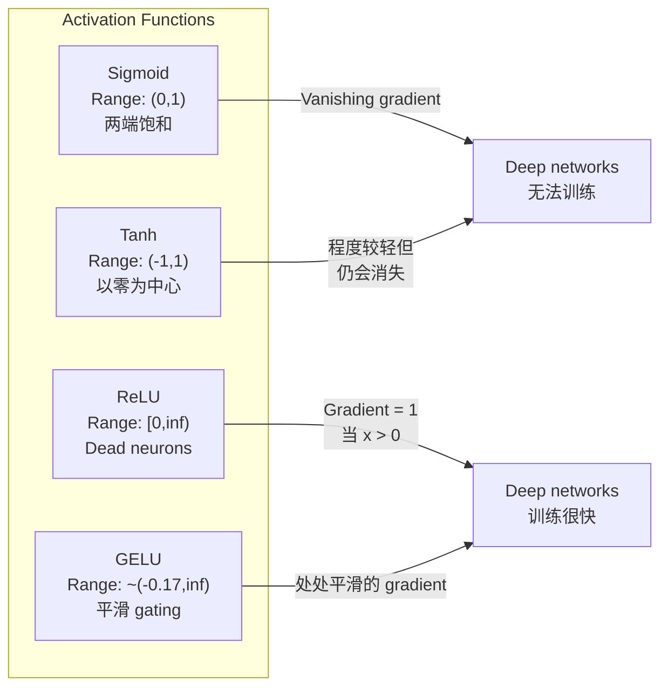
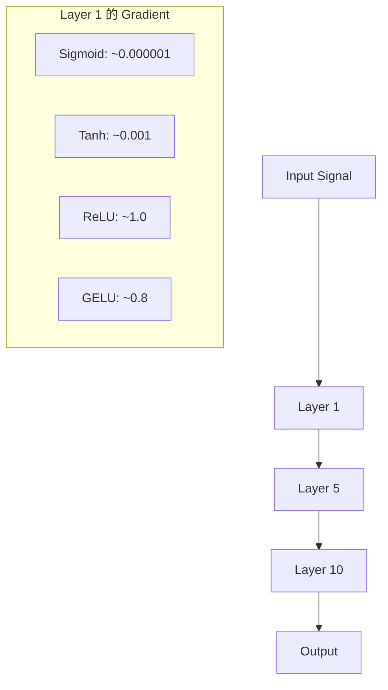
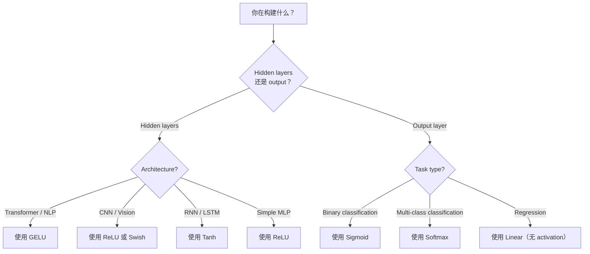

# 激活函数

> 没有非线性, votre réseau de 100 couches 只是 une fois éliminée de la Matrice multiplication ⋅ Activation est de permettre au réseau neural ⋅ être capable de penser avec des courbes ⋅

**Type:** Build
**Languages:** Python
**Prerequisites:** Lesson 03.03 (Backpropagation)
**Time:** ~75 分钟

## Objectif de l'apprentissage

- De zéro réalisation sigmoid、tanh、ReLU、Leaky ReLU、GELU、Swish 和 softmax  et ses dérivés
- 通过测量不同激活在10+ 层中的激活大小, diagnostiquer le problème de gradient de disparition
- 检测 ReLU réseau de neurones morts,并 expliquer pourquoi GELU 能避免这种 défaillance mode
- Pour une architecture spécifique, choisir correctement la fonction d'activation

##  problématique

堆叠两个线性转变:y = W2(W1x + b1) + b2。展开它:y = W2W1x + W2b1 + b2。这只是 y = Ax + c一个单一线性转变──无论你堆叠多少线性层,结果都会缩短成一次矩阵乘倍──你的100层网络与单层 具有相同表示能力──

Ceci n'est pas une spéculation théorique. Il signifie que le réseau linéaire profond 字面上不能学习 XOR, impossible à classer en spirale, impossible à reconnaître les visages de l'homme 没有激活功能,深度只是一种幻觉.

Les fonctions d'activation 打破线性── elles passent par une fonction non linéaire 扭曲每一层的输出,让网络 能够曲决策界限、近似任意函数,并真正学习── mais si vous choisissez une activation erronée, vos gradients disparaîtront à zéro (sigmoid)  dans les réseaux profonds (explosion à infinité)  (pas de précaution pour initialiser des activations illimitées), ou vos neurones seront définitivement morts  (RELU)  (réaction de la fonction d'activation)  (la sélection de la fonction d'activation détermine directement votre réseau si vous pouvez apprendre──).

## 概念

### Pourquoi l'inline est nécessaire

La multiplication de matrice est comptable. Toutes ces paramètres, toutes ces profondeurs sont gaspillées. Vous avez besoin de quelque chose pour briser cette chaîne.

Une couche linéaire 计算 f(x) = Wx + b──堆叠两个:

```
Layer 1: h = W1 * x + b1
Layer 2: y = W2 * h + b2
```

Je suis en train de vous dire:

```
y = W2 * (W1 * x + b1) + b2
y = (W2 * W1) * x + (W2 * b1 + b2)
y = A * x + c
```

Une couche. Une activation non linéaire entre couches:

```
h = g(W1 * x + b1)
y = W2 * h + b2
```

现在代入被打破了──W2 * g(W1 * x + b1) + b2 不能再简化为单线性转变──网络可以表示非线性函数──每增加一层带激活的层,都会增加表示能力──

### Sigmoïde

La dernière fonction d'activation du réseau neuronal.

```
sigmoid(x) = 1 / (1 + e^(-x))
```

输出范围:(0, 1)──平滑、可微, sera le nombre réel arbitrary de cartographier à la valeur similaire de la probabilité──

dérivé:

```
sigmoid'(x) = sigmoid(x) * (1 - sigmoid(x))
```

Cette dérivée a une valeur maximale de 0,25, apparaissant à x = 0── dans la propagation de retour, les gradients seront classés étape par étape.

```
0.25^10 = 0.000000953674
```

Le problème des gradients disparaît. Les gradients des premières couches deviennent très petits, les poids sont presque inchangés. Le réseau semble être en train de se détériorer.

另一个问题:sigmoid 输出始终为正(0到 1), ce qui signifie les poids des gradients supérieurs 总是同号―― ceci entraînera l'apparition de la forme de la chute des gradients dans le processus de déclin ──

### Tanh

Sigmoid est une version de la série.

```
tanh(x) = (e^x - e^(-x)) / (e^x + e^(-x))
```

输出范围:(-1, 1)──以零为中心,可以消除之字形问题──

dérivé:

```
tanh'(x) = 1 - tanh(x)^2
```

Le dérivé maximal dans x = 0 时为 1.0比sigmoid 好四倍──但消失梯度问题 仍然存在──对于很大的正输入或负输入, dérivé 会趋近零──十层仍然会压碎梯度,只是没有那么激烈──

### Je suis désolé .

La fonction même remonte à Fukushima 1969), elle a tout changé.

```
relu(x) = max(0, x)
```

输出范围:[0, infinité) ・ dérivé 非常简单:

```
relu'(x) = 1  if x > 0
            0  if x <= 0
```

Pour les réseaux de transmission, il n'y a pas de gradient qui disparaît. Le gradient est correctement 1, il sera transmis directement au passé.

Mais il a un mode d'échec: problème de neurones morts. Si une entrée pondérée d'un neurone est toujours négative (en raison d'un biais négatif plus important ou d'une initialization malheureuse du poids), sa sortie sera toujours à zéro, le gradient à zéro, donc elle ne sera jamais mise à jour.

### Lecture de la réaction

Les neurones morts sont les plus simples à réparer.

```
leaky_relu(x) = x        if x > 0
                alpha * x if x <= 0
```

Parmi eux, l'alpha est un petit nombre ordinaire, généralement de 0,01──un demi-axe négatif ayant une petite inclination plutôt que zéro, de sorte que les neurones morts peuvent toujours obtenir un signal de gradient, et ont la chance de récupérer──.

### GELU:现代默认选择

Unité linéaire d'erreur gaussienne ⋅ proposée en 2016 par Hendrycks 和 Gimpel ⋅ est l'activation par défaut de la plupart des transformateurs modernes ⋅

```
gelu(x) = x * Phi(x)
```

Parmi eux, Phi(x) est la fonction de distribution cumulée de la distribution normale standard.

```
gelu(x) ~= 0.5 * x * (1 + tanh(sqrt(2/pi) * (x + 0.044715 * x^3)))
```

GELU est en position de plat, permet une plus petite valeur négative (((((((((((((((((((((((((((((((((((((((((((((((((((((((((((((((((((((((((((((((((((((((((((((((((((((((((((((((((((((((((((((((((((((((((((((((((((((((((((((((((((((((((((((((((((((((((((((((((((((((((((((((((((((((((((((((((((((((((((((((((((((((((((((((((((((((((((((((((((((((((((((((((((((((((((((((((((((((((((((((((((((((((((((((((((((((((((((((((((((((((((((((((((((((((((((((((((((((((((((((((((((((((((((((((((((((((((((((((((((((((((((((((((((((((((((((((((((((((((((((((((((((((((((((

### Suisse / SiLU

Par Ramachandran et coll. En 2017, par la recherche automatisée, l'activation auto-arrêtée de la découverte.

```
swish(x) = x * sigmoid(x)
```

La forme de Swish est x * sigmoid(x)。 Google a effectué une recherche automatisée dans l'espace de fonction d'activation  trouvé un réseau neural dans la conception de la partie du réseau neural。

Comme GELU, il est relativement simple, il permet une plus petite négativité. La différence est très subtile:Swish utilise le sigmoïde comme un gateau, tandis que GELU utilise le CDF gaussien.

### Softmax: activation de sortie

Non utilisé pour les couches cachées。Softmax va utiliser les scores bruts (logits) du vecteur 转换为概率分布。

```
softmax(x_i) = e^(x_i) / sum(e^(x_j) for all j)
```

Chaque sortie est entre 0 et 1 ⋅ toutes les sorties et pour 1⋅ ce qui en fait l'activation finale standard de la classification multi-classe⋅ la logite la plus grande obtiendra la plus grande probabilité, mais différente de l'argmax, le softmax est minuscule, et conserve des informations relativement fiables⋅

### 形状对比



### Flux de gradient par rapport à



### Quelle est la durée de l'activation ?



## 动手构建

### 步骤 1: réaliser toutes les fonctions d' activation  et leurs dérivés

Chaque fonction reçoit un flot et retourne à un flot. Chaque fonction dérivée reçoit le même ingress et retourne à un gradient.

```python
import math

def sigmoid(x):
    x = max(-500, min(500, x))
    return 1.0 / (1.0 + math.exp(-x))

def sigmoid_derivative(x):
    s = sigmoid(x)
    return s * (1 - s)

def tanh_act(x):
    return math.tanh(x)

def tanh_derivative(x):
    t = math.tanh(x)
    return 1 - t * t

def relu(x):
    return max(0.0, x)

def relu_derivative(x):
    return 1.0 if x > 0 else 0.0

def leaky_relu(x, alpha=0.01):
    return x if x > 0 else alpha * x

def leaky_relu_derivative(x, alpha=0.01):
    return 1.0 if x > 0 else alpha

def gelu(x):
    return 0.5 * x * (1 + math.tanh(math.sqrt(2 / math.pi) * (x + 0.044715 * x ** 3)))

def gelu_derivative(x):
    phi = 0.5 * (1 + math.erf(x / math.sqrt(2)))
    pdf = math.exp(-0.5 * x * x) / math.sqrt(2 * math.pi)
    return phi + x * pdf

def swish(x):
    return x * sigmoid(x)

def swish_derivative(x):
    s = sigmoid(x)
    return s + x * s * (1 - s)

def softmax(xs):
    max_x = max(xs)
    exps = [math.exp(x - max_x) for x in xs]
    total = sum(exps)
    return [e / total for e in exps]
```

### Étape 2: la visibilité des gradients dans la mort

En calculant le gradient à partir de -5 à 5 de 100 个均间隔点, imprimez un histogramme de texte, montrant le gradient de chaque activation, où il approche de zéro.

```python
def gradient_scan(name, derivative_fn, start=-5, end=5, n=100):
    step = (end - start) / n
    near_zero = 0
    healthy = 0
    for i in range(n):
        x = start + i * step
        g = derivative_fn(x)
        if abs(g) < 0.01:
            near_zero += 1
        else:
            healthy += 1
    pct_dead = near_zero / n * 100
    print(f"{name:15s}: {healthy:3d} healthy, {near_zero:3d} near-zero ({pct_dead:.0f}% dead zone)")

gradient_scan("Sigmoid", sigmoid_derivative)
gradient_scan("Tanh", tanh_derivative)
gradient_scan("ReLU", relu_derivative)
gradient_scan("Leaky ReLU", leaky_relu_derivative)
gradient_scan("GELU", gelu_derivative)
gradient_scan("Swish", swish_derivative)
```

### 步骤 3: Échec de la phase 实验

Utilisez le sigmoïde avec la LUR, faites passer un signal à travers N 层 forward-pass.

```python
import random

def vanishing_gradient_experiment(activation_fn, name, n_layers=10, n_inputs=5):
    random.seed(42)
    values = [random.gauss(0, 1) for _ in range(n_inputs)]

    print(f"\n{name} through {n_layers} layers:")
    for layer in range(n_layers):
        weights = [random.gauss(0, 1) for _ in range(n_inputs)]
        z = sum(w * v for w, v in zip(weights, values))
        activated = activation_fn(z)
        magnitude = abs(activated)
        bar = "#" * int(magnitude * 20)
        print(f"  Layer {layer+1:2d}: magnitude = {magnitude:.6f} {bar}")
        values = [activated] * n_inputs

vanishing_gradient_experiment(sigmoid, "Sigmoid")
vanishing_gradient_experiment(relu, "ReLU")
vanishing_gradient_experiment(gelu, "GELU")
```

### 步骤 4: Neurone mort 检测器

Créer un réseau ReLU, transmettre des entrées aléatoires, calculer le nombre de neurones qui n'ont pas été activés.

```python
def dead_neuron_detector(n_inputs=5, hidden_size=20, n_samples=1000):
    random.seed(0)
    weights = [[random.gauss(0, 1) for _ in range(n_inputs)] for _ in range(hidden_size)]
    biases = [random.gauss(0, 1) for _ in range(hidden_size)]

    fire_counts = [0] * hidden_size

    for _ in range(n_samples):
        inputs = [random.gauss(0, 1) for _ in range(n_inputs)]
        for neuron_idx in range(hidden_size):
            z = sum(w * x for w, x in zip(weights[neuron_idx], inputs)) + biases[neuron_idx]
            if relu(z) > 0:
                fire_counts[neuron_idx] += 1

    dead = sum(1 for c in fire_counts if c == 0)
    rarely_fire = sum(1 for c in fire_counts if 0 < c < n_samples * 0.05)
    healthy = hidden_size - dead - rarely_fire

    print(f"\nDead Neuron Report ({hidden_size} neurons, {n_samples} samples):")
    print(f"  Dead (never fired):     {dead}")
    print(f"  Barely alive (<5%):     {rarely_fire}")
    print(f"  Healthy:                {healthy}")
    print(f"  Dead neuron rate:       {dead/hidden_size*100:.1f}%")

    for i, c in enumerate(fire_counts):
        status = "DEAD" if c == 0 else "WEAK" if c < n_samples * 0.05 else "OK"
        bar = "#" * (c * 40 // n_samples)
        print(f"  Neuron {i:2d}: {c:4d}/{n_samples} fires [{status:4s}] {bar}")

dead_neuron_detector()
```

### 步骤 5: entraînement par rapport à Sigmoid vs ReLU vs GELU

Dans le jeu de données de cercle, les points de l'intérieur = classe 1, l'extérieur = classe 0), avec trois activations différentes, entraînons-nous avec un réseau à deux couches.

```python
def make_circle_data(n=200, seed=42):
    random.seed(seed)
    data = []
    for _ in range(n):
        x = random.uniform(-2, 2)
        y = random.uniform(-2, 2)
        label = 1.0 if x * x + y * y < 1.5 else 0.0
        data.append(([x, y], label))
    return data


class ActivationNetwork:
    def __init__(self, activation_fn, activation_deriv, hidden_size=8, lr=0.1):
        random.seed(0)
        self.act = activation_fn
        self.act_d = activation_deriv
        self.lr = lr
        self.hidden_size = hidden_size

        self.w1 = [[random.gauss(0, 0.5) for _ in range(2)] for _ in range(hidden_size)]
        self.b1 = [0.0] * hidden_size
        self.w2 = [random.gauss(0, 0.5) for _ in range(hidden_size)]
        self.b2 = 0.0

    def forward(self, x):
        self.x = x
        self.z1 = []
        self.h = []
        for i in range(self.hidden_size):
            z = self.w1[i][0] * x[0] + self.w1[i][1] * x[1] + self.b1[i]
            self.z1.append(z)
            self.h.append(self.act(z))

        self.z2 = sum(self.w2[i] * self.h[i] for i in range(self.hidden_size)) + self.b2
        self.out = sigmoid(self.z2)
        return self.out

    def backward(self, target):
        error = self.out - target
        d_out = error * self.out * (1 - self.out)

        for i in range(self.hidden_size):
            d_h = d_out * self.w2[i] * self.act_d(self.z1[i])
            self.w2[i] -= self.lr * d_out * self.h[i]
            for j in range(2):
                self.w1[i][j] -= self.lr * d_h * self.x[j]
            self.b1[i] -= self.lr * d_h
        self.b2 -= self.lr * d_out

    def train(self, data, epochs=200):
        losses = []
        for epoch in range(epochs):
            total_loss = 0
            correct = 0
            for x, y in data:
                pred = self.forward(x)
                self.backward(y)
                total_loss += (pred - y) ** 2
                if (pred >= 0.5) == (y >= 0.5):
                    correct += 1
            avg_loss = total_loss / len(data)
            accuracy = correct / len(data) * 100
            losses.append(avg_loss)
            if epoch % 50 == 0 or epoch == epochs - 1:
                print(f"    Epoch {epoch:3d}: loss={avg_loss:.4f}, accuracy={accuracy:.1f}%")
        return losses


data = make_circle_data()

configs = [
    ("Sigmoid", sigmoid, sigmoid_derivative),
    ("ReLU", relu, relu_derivative),
    ("GELU", gelu, gelu_derivative),
]

results = {}
for name, act_fn, act_d_fn in configs:
    print(f"\n=== Training with {name} ===")
    net = ActivationNetwork(act_fn, act_d_fn, hidden_size=8, lr=0.1)
    losses = net.train(data, epochs=200)
    results[name] = losses

print("\n=== Final Loss Comparison ===")
for name, losses in results.items():
    print(f"  {name:10s}: start={losses[0]:.4f} -> end={losses[-1]:.4f} (improvement: {(1 - losses[-1]/losses[0])*100:.1f}%)")
```


```figure
softmax-temperature
```

## Utilisez-le

PyTorch fournit simultanément toutes ces fonctions sous deux formes fonctionnelles et modulaires:

```python
import torch
import torch.nn as nn
import torch.nn.functional as F

x = torch.randn(4, 10)

relu_out = F.relu(x)
gelu_out = F.gelu(x)
sigmoid_out = torch.sigmoid(x)
swish_out = F.silu(x)

logits = torch.randn(4, 5)
probs = F.softmax(logits, dim=1)

model = nn.Sequential(
    nn.Linear(10, 64),
    nn.GELU(),
    nn.Linear(64, 32),
    nn.GELU(),
    nn.Linear(32, 5),
)
```

L'équipe de transformateur Interface:GELU──CNN Interface:GELU──CNN Interface:ReLU──classification:Softmax──régrésion:无(linear)──probabilité de la couche de sortie:sigmoid──就是这样──先从这些默认值开始──只有你有证据时才改变它们──

Les RNN et les LSTM sont à l'état caché, utilisent des tanh, utilisent des portes, utilisent des sigmoïdes, mais si vous construisez aujourd'hui à partir de zéro, vous ne l'utiliserez probablement pas. Si vos neurones de votre réseau ReLU sont en train de mourir, changez à GELU, ne choisissez pas avec vous le Leaky ReLU, sauf si vous avez une raison claire.

## 交付成果

Le cours est ouvert à:
- `outputs/prompt-activation-selector.md` Un prompt réutilisable, vous aider à toute architecture  Choisir correctement la fonction d'activation

## 练习

1. 实现 Parametric ReLU (PReLU), dont la pente négative alpha est un paramètre appréciable.

2. L'expérience de gradient de disparition va être transformée de 10 niveaux en 50 niveaux de fonctionnement.

3. 实现 ELU (Unité linéaire exponentielle):elu(x) = x si x > 0, alpha * (e^x - 1) si x <= 0── dans le même réseau 上将它的 taux de neurones morts par rapport à la RELU──

4. Construire un moniteur de santé à degré, pendant la formation: pour chaque époque, calculer la magnitude moyenne du gradient de chaque couche, lorsque le gradient de chaque couche est inférieur à 0,001 ou supérieur à 100 heures.

5.  Modifier l'entraînement par rapport, utiliser le XOR dataset dans le cours 01 au lieu de cercles. Quelle activation en XOR s'effectue le plus rapidement? Pourquoi est-ce différent des résultats du cercle?

## 关键术语

| Term | 人们怎么说 | 它实际是什么意思 |
|------|----------------|----------------------|
| Activation function | “非线性部分” | 应用于每个 neuron 输出的函数，用于打破线性，使 network 能够学习 nonlinear mappings |
| Vanishing gradient | “Gradients 在 deep networks 中消失” | 当 activation 的 derivative 小于 1 时，gradients 会通过 layers 指数级缩小，使早期 layers 无法训练 |
| Exploding gradient | “Gradients 爆炸” | 当有效乘数超过 1 时，gradients 会通过 layers 指数级增长，导致训练不稳定 |
| Dead neuron | “停止学习的 neuron” | 输入永久为负的 ReLU neuron，会产生零输出和零 gradient |
| Sigmoid | “把值压缩到 0-1” | logistic function 1/(1+e^-x)，历史上很重要，但会在 deep networks 中导致 vanishing gradients |
| ReLU | “把负数裁剪为零” | max(0, x)——通过保留 gradient magnitude 让 deep learning 变得实用的 activation |
| GELU | “transformer activation” | Gaussian Error Linear Unit，一种平滑 activation，会根据输入为正的概率对输入加权 |
| Swish/SiLU | “Self-gated ReLU” | x * sigmoid(x)，通过 automated search 发现，用于 EfficientNet |
| Softmax | “把分数变成概率” | 将 logits 的 Vector 归一化为 probability distribution，其中所有值都在 (0,1) 内且总和为 1 |
| Leaky ReLU | “不会死亡的 ReLU” | max(alpha*x, x)，其中 alpha 很小（0.01），通过允许较小的 negative gradients 来防止 dead neurons |
| Saturation | “sigmoid 的平坦部分” | activation 的 derivative 趋近于零的区域，会阻断 gradient flow |
| Logit | “softmax 之前的原始分数” | 应用 softmax 或 sigmoid 之前，final layer 的未归一化输出 |

## 延伸阅读

- Nair & Hinton, "Unités linéaires rectifiées améliorent les machines Boltzmann restreintes" (2010) 介绍 ReLU 并促成深度网络 训练的论文
- Hendrycks & Gimpel, " Gaussian Error Linear Units (GELU) " (2016)  proposé plus tard devenir transformateurs 默认选择的激活函数
- Ramachandran et coll., "Réchercher les fonctions d'activation" (2017) utiliser la recherche automatisée découvrir Swish, montrer l'activation design可以自动化
- Glorot & Bengio, "Comprendre la difficulté de former des réseaux neuronaux en flux profond" (2010)  diagnostiquer des gradients disparus/explosifs 并提出 Xavier initialization 的论文
- Bienvenu, Bengio, Courville, "Apprentissage en profondeur" Chapitre 6.3 (https://www.deeplearningbook.org/) Expositions rigoureuses des unités cachées et des fonctions d'activation
