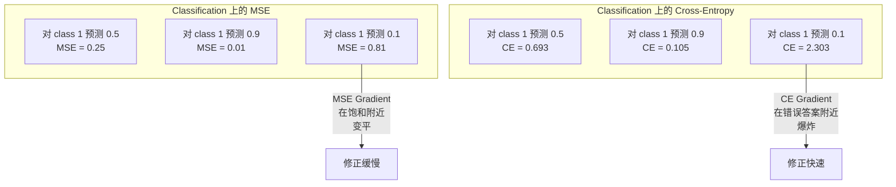
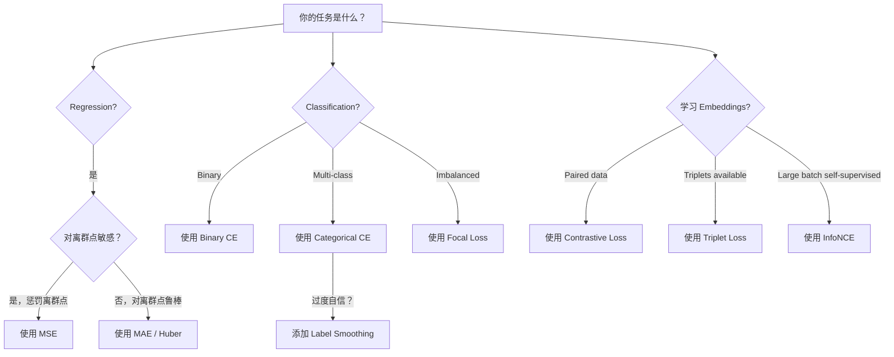
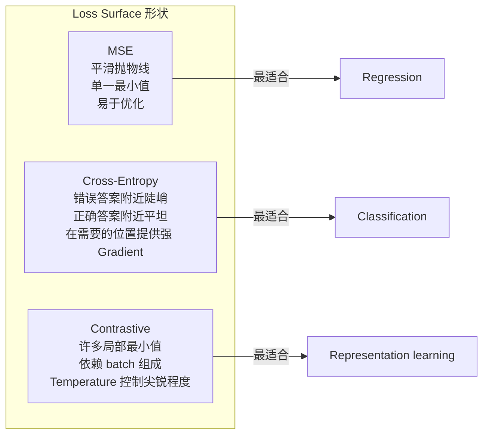

# Perte de fonction

> Votre réseau neural fait une prédiction. La vérité de base donne une réponse différente. Il faut que ce soit un nombre de différences.

**Type:** Build
**Languages:** Python
**Prerequisites:** Lesson 03.04 (Activation Functions)
**Time:** ~75 minutes

## Objectif de l'apprentissage

- De la réalisation de l'entropie croisée binaire à l'entropie croisée catégorique et à la perte de contraste (InfoNCE), ainsi que de leur gradient
- 通过演示对所有样本都预测 0.5的失败模式, explique pourquoi MSE ne convient pas à la classification
- Légalisation de l'étiquette  Appliquer à l'entropie croisée,并 décrire comment il empêche la prédiction de l'excès de confiance
- Pour régression, classification binaire, classification multi-classe, et intégration, apprendre à choisir correctement la fonction de perte

##  problématique

En matière de classification  le modèle de MSE minimisée sur le problème, sera très confiant à tout prévoir 0.5― il est en effet à minimiser les pertes― mais il n'est pas encore totalement utilisé―

La fonction de perte est le seul objet de l'optimisation réelle du modèle. Pas la précision. Pas le score F1.

Il y a un exemple spécifique. Vous avez une classification binaire 任务。 deux catégories, 50/50 分布。 vous utilisez MSE 作为 Loss。 un modèle pour chaque entrée                                                                                                                                                                                                                                         

 situation va également être pire. Dans l'apprentissage autosuffisant, vous n'avez même pas de marque. Contrastive Loss définit parfaitement le signal d'apprentissage: qu'est-ce qui est similaire, qu'est-ce qui est différent, et le modèle devrait être plus utile pour les séparer. Contrastive Loss écrit l'erreur, vos intégrations vont se réduire à un point.

## 概念

### Échec moyen carré (MSE)

Régrésion de la sélection par défaut.

```
MSE = (1/n) * sum((y_pred - y_true)^2)
```

Pourquoi le carré est important: il punirait les grandes erreurs de manière secondaire. Le coût d'une erreur de 2 est 4 fois celui d'une erreur de 1 fois. Le coût d'une erreur de 10 fois est 100 fois.

Si votre modèle prévoit le prix de la maison, il y a une différence de la plupart des maisons.$10,000，但对一栋豪宅偏差 $200 000 $, MSE va essayer de réparer le premier immeuble, peut-être endommager la performance des 99 autres.

Le gradient de MSE par rapport à la valeur de prédiction est:

```
dMSE/dy_pred = (2/n) * (y_pred - y_true)
```

Il est lié à l'erreur de ligne. Les erreurs plus grandes obtiennent un degré plus grand. Ceci est une caractéristique de la régression.

### Perte de l'entropie croisée

La fonction de perte de classification, qui est basée sur l'information, mesure la différence entre la distribution de probabilité prévue et la réelle distribution.

**Binary Cross-Entropy (BCE):**

```
BCE = -(y * log(p) + (1 - y) * log(1 - p))
```

Parmi eux y est le réel étiquette ((0 ou 1),p est la probabilité de prédiction。

Pourquoi -log(p) Effectif: lorsque le vrai étiquette est 1 et vous prédictez p = 0,99 时, Loss est -log(0,99) = 0,01。 lorsque vous prédictez p = 0,01 时, Loss est -log(0,01) = 4,6。 cette différence de 460 倍 est la croisée entropie Effectif des raisons。 il sera sévèrement punir la confiance mais la prédiction erronée, presque non punir la confiance et la prédiction correcte。

Gradient raconte la même histoire:

```
dBCE/dp = -(y/p) + (1-y)/(1-p)
```

Lorsque y = 1 et p 接近零时, le gradient est -1/p, tendra vers le négatif et il n'y a pas de fin. Le modèle obtient un signal énorme pour corriger l'erreur.

**Categorical Cross-Entropy:**

Utilisé pour la classification multi-classe d'objectifs de code unique.

```
CCE = -sum(y_i * log(p_i))
```

只有真实类别会贡献损失(因为其他所有 y_i 都是零) ⋅如果有10类别,正确类别得到的概率是0.1(随机猜测),Loss是 -log(0.1) = 2.3──如果正确类别得到的概率是0.9,Loss是 -log(0.9) =0.105──模型会学习把概率质量集中到正确答案上──

### Pourquoi les EMS ne sont pas conformes à la classification



Lorsque le prévé­sage approche 0 ou 1 时, le gradient MSE change de niveau (en raison du gradient sigmoïde) 和) ── le gradient cross-entropie compensé ce point - - -log 抵消了sigmoïde's flat region, en fournissant un gradient fort en position la plus nécessaire──

### Légalisation des étiquettes

                                                                                                                                                                                                                                                              

```
smooth_label = (1 - alpha) * one_hot + alpha / num_classes
```

Lorsque alpha = 0,1 且有10 个类别时: l'objectif n'est plus [0, 0, 1, 0, ...], mais [0,01, 0.01, 0.91, 0.01,...]。

Pourquoi cela est efficace: une tentative de passer par un modèle de softmax 输出精确 1.0 , nécessite de faire avancer les logits 推向无穷── ceci entraînera une trop grande confiance en soi, une perte de la capacité de généralisation, et rendra le modèle plus fragile face au décalage de distribution── étiquette de lissage.

### Perte de contraste

没有标签. 没有类别. 只有输入对和一个问题: elles sont similaires ou différentes?

**SimCLR-style contrastive loss (NT-Xent / InfoNCE):**

取一张图像── Créer ses deux augmentations视图 (crop, rotate, color jitter)── elles sont une paire positive - elles devraient avoir des embellissements similaires── elles forment une paire négative - elles devraient avoir des embellissements différents──

```
L = -log(exp(sim(z_i, z_j) / tau) / sum(exp(sim(z_i, z_k) / tau)))
```

Parmi les sim() est la similitude cosine, z_i 和 z_j est une paire positive, et couvre tous les négatifs,tau (température)  contrôler la distribution de pointe ◦°°°°°°°°°°°°°°°°°°°°°°°°°°°°°°°°°°°°°°°°°°°°°°°°°°°°°°°°°°°°°°°°°°°°°°°°°°°°°°°°°°°°°°°°°°°°°°°°°°°°°°°°°°°°°°°°°°°°°°°°°°°°°°°°°°°°°°°°°°°°°°°°°°°°°°°°°°°°°°°°°°°°°°°°°°°°°°°°°°°°°°°°°°°°°°°°°°°°°°°°°°°°°°°°°°°°°°°°°°°°°°°°°°°°°°°°°°°°°°°°°°°°°°°°°°°°°°°°°°°°°°°°°°°°°°°°°°°°°°°°°°°°°°°°°°°°°°°°°°°°°°°°°°°°°°°°°°°°°°°°°°°°°°°°°°°°°°°°°°°°°°°°°°°°°°°°°°°°°°°°°°°°°°°°°°°°°°°°°°°°°°°°°°°°°°°°°°°°°°°°°°°°°°°°°°°°°°°°°°°°°°°°°°°°°°°°°°°°°°°°°°°°°°°°°°°°°°°°°°°°

Réel: taille de lot 256 signifie chaque paire positive il y a 255 个负面――Temperature tau = 0.07(SimCLR 默认值)。 Cette perte ressemble à une comparaison à la douceur max - elle veut que la comparaison de paire positive soit la plus élevée de toutes les 256 个选项──

**Triplet Loss:**

接收三个输入:anchor、positive(同一类别)、negative(不同类别)。

```
L = max(0, d(anchor, positive) - d(anchor, negative) + margin)
```

Marge (en général 0,2-1.0) Forcez la distance positive et négative entre les deux à la plus petite distance possible. Si le négatif est assez loin, la perte est zero.

### Perte de la vue

Utilisé pour des données inéquilibrées. Les normes de l'entropie croisée sont égales à toutes les formes de traitement.

```
FL = -alpha * (1 - p_t)^gamma * log(p_t)
```

Parmi les p_t, il y a une probabilité de prédiction de la gamma, une concentration de gamma à la charge.

- Exemple simple (p_t = 0,9): poids = (0,1) ^2 = 0,01── fondamentalement été ignoré──
- Exemple dur (p_t = 0,1): poids = (0,9) ^2 = 0,81──完整的渐进信号──

La perte de focus proposée par Lin et coll. est utilisée pour la détection d'objets, dont 99% des zones candidates sont des arrière-plan (faibles négatives) ⋅ sans perte de focus ⋅ le modèle se noie dans des exemples de fond faciles, il ne peut jamais tester un objet.

### Fonction de perte  décision tree



### Des pertes de paysage




```figure
cross-entropy-loss
```

## - Je le construis.

### 步骤 1: MSE  et son gradient

```python
def mse(predictions, targets):
    n = len(predictions)
    total = 0.0
    for p, t in zip(predictions, targets):
        total += (p - t) ** 2
    return total / n

def mse_gradient(predictions, targets):
    n = len(predictions)
    grads = []
    for p, t in zip(predictions, targets):
        grads.append(2.0 * (p - t) / n)
    return grads
```

### 步骤 2: Entropie croisée binaire

log(0)                                                                                                                                                                                                                                                                                                                                                                                                                                                                                                                           

```python
import math

def binary_cross_entropy(predictions, targets, eps=1e-15):
    n = len(predictions)
    total = 0.0
    for p, t in zip(predictions, targets):
        p_clipped = max(eps, min(1 - eps, p))
        total += -(t * math.log(p_clipped) + (1 - t) * math.log(1 - p_clipped))
    return total / n

def bce_gradient(predictions, targets, eps=1e-15):
    grads = []
    for p, t in zip(predictions, targets):
        p_clipped = max(eps, min(1 - eps, p))
        grads.append(-(t / p_clipped) + (1 - t) / (1 - p_clipped))
    return grads
```

### 步骤 3: 带 Softmax 的 catégorique croisée entropie

Softmax va transformer les logits originaux en probabilité.

```python
def softmax(logits):
    max_val = max(logits)
    exps = [math.exp(x - max_val) for x in logits]
    total = sum(exps)
    return [e / total for e in exps]

def categorical_cross_entropy(logits, target_index, eps=1e-15):
    probs = softmax(logits)
    p = max(eps, probs[target_index])
    return -math.log(p)

def cce_gradient(logits, target_index):
    probs = softmax(logits)
    grads = list(probs)
    grads[target_index] -= 1.0
    return grads
```

Pour les classes réelles, il s'agit simplement de la probabilité de prédiction - 1), pour toutes les autres classes, il s'agit simplement de la probabilité de prédiction) ― cette simplification élégante n'est pas un hasard -- c'est précisément la raison pour laquelle Softmax et la traite de l'entropie sont utilisées.

### 步骤 4: Légalisation de l'étiquette

```python
def label_smoothed_cce(logits, target_index, num_classes, alpha=0.1, eps=1e-15):
    probs = softmax(logits)
    loss = 0.0
    for i in range(num_classes):
        if i == target_index:
            smooth_target = 1.0 - alpha + alpha / num_classes
        else:
            smooth_target = alpha / num_classes
        p = max(eps, probs[i])
        loss += -smooth_target * math.log(p)
    return loss
```

### 步骤 5: Perte de contraste (InfoNCE)

```python
def cosine_similarity(a, b):
    dot = sum(x * y for x, y in zip(a, b))
    norm_a = math.sqrt(sum(x * x for x in a))
    norm_b = math.sqrt(sum(x * x for x in b))
    if norm_a < 1e-10 or norm_b < 1e-10:
        return 0.0
    return dot / (norm_a * norm_b)

def contrastive_loss(anchor, positive, negatives, temperature=0.07):
    sim_pos = cosine_similarity(anchor, positive) / temperature
    sim_negs = [cosine_similarity(anchor, neg) / temperature for neg in negatives]

    max_sim = max(sim_pos, max(sim_negs)) if sim_negs else sim_pos
    exp_pos = math.exp(sim_pos - max_sim)
    exp_negs = [math.exp(s - max_sim) for s in sim_negs]
    total_exp = exp_pos + sum(exp_negs)

    return -math.log(max(1e-15, exp_pos / total_exp))
```

### Étape 6: Classification des MSE et de l'entropie croisée

Utilisation de deux types de fonction de perte de données Le même réseau neural en classe 4

```python
import random

def sigmoid(x):
    x = max(-500, min(500, x))
    return 1.0 / (1.0 + math.exp(-x))

def make_circle_data(n=200, seed=42):
    random.seed(seed)
    data = []
    for _ in range(n):
        x = random.uniform(-2, 2)
        y = random.uniform(-2, 2)
        label = 1.0 if x * x + y * y < 1.5 else 0.0
        data.append(([x, y], label))
    return data


class LossComparisonNetwork:
    def __init__(self, loss_type="bce", hidden_size=8, lr=0.1):
        random.seed(0)
        self.loss_type = loss_type
        self.lr = lr
        self.hidden_size = hidden_size

        self.w1 = [[random.gauss(0, 0.5) for _ in range(2)] for _ in range(hidden_size)]
        self.b1 = [0.0] * hidden_size
        self.w2 = [random.gauss(0, 0.5) for _ in range(hidden_size)]
        self.b2 = 0.0

    def forward(self, x):
        self.x = x
        self.z1 = []
        self.h = []
        for i in range(self.hidden_size):
            z = self.w1[i][0] * x[0] + self.w1[i][1] * x[1] + self.b1[i]
            self.z1.append(z)
            self.h.append(max(0.0, z))

        self.z2 = sum(self.w2[i] * self.h[i] for i in range(self.hidden_size)) + self.b2
        self.out = sigmoid(self.z2)
        return self.out

    def backward(self, target):
        if self.loss_type == "mse":
            d_loss = 2.0 * (self.out - target)
        else:
            eps = 1e-15
            p = max(eps, min(1 - eps, self.out))
            d_loss = -(target / p) + (1 - target) / (1 - p)

        d_sigmoid = self.out * (1 - self.out)
        d_out = d_loss * d_sigmoid

        for i in range(self.hidden_size):
            d_relu = 1.0 if self.z1[i] > 0 else 0.0
            d_h = d_out * self.w2[i] * d_relu
            self.w2[i] -= self.lr * d_out * self.h[i]
            for j in range(2):
                self.w1[i][j] -= self.lr * d_h * self.x[j]
            self.b1[i] -= self.lr * d_h
        self.b2 -= self.lr * d_out

    def compute_loss(self, pred, target):
        if self.loss_type == "mse":
            return (pred - target) ** 2
        else:
            eps = 1e-15
            p = max(eps, min(1 - eps, pred))
            return -(target * math.log(p) + (1 - target) * math.log(1 - p))

    def train(self, data, epochs=200):
        losses = []
        for epoch in range(epochs):
            total_loss = 0.0
            correct = 0
            for x, y in data:
                pred = self.forward(x)
                self.backward(y)
                total_loss += self.compute_loss(pred, y)
                if (pred >= 0.5) == (y >= 0.5):
                    correct += 1
            avg_loss = total_loss / len(data)
            accuracy = correct / len(data) * 100
            losses.append((avg_loss, accuracy))
            if epoch % 50 == 0 or epoch == epochs - 1:
                print(f"    Epoch {epoch:3d}: loss={avg_loss:.4f}, accuracy={accuracy:.1f}%")
        return losses
```

## Utilisez-le

PyTorch a fourni toutes les fonctions standard de perte, et a intégré la stabilité numérique:

```python
import torch
import torch.nn as nn
import torch.nn.functional as F

predictions = torch.tensor([0.9, 0.1, 0.7], requires_grad=True)
targets = torch.tensor([1.0, 0.0, 1.0])

mse_loss = F.mse_loss(predictions, targets)
bce_loss = F.binary_cross_entropy(predictions, targets)

logits = torch.randn(4, 10)
labels = torch.tensor([3, 7, 1, 9])
ce_loss = F.cross_entropy(logits, labels)
ce_smooth = F.cross_entropy(logits, labels, label_smoothing=0.1)
```

Utilisation `F.cross_entropy`(au lieu de `F.nll_loss`加手动 softmax) ―― il va log-softmax 和 négative log-probabilité 合并为一个数值稳定的操作――先单独应用 softmax 再取 log 稳定性更差--在大指数的相减中会丢失精度――

Pour l'apprentissage contrasté, la plupart des équipes utilisent l'auto-définition réalisée, ou l'utilisation.`lightly`- Je suis là.`pytorch-metric-learning`Ainsi, le cycle central est toujours le même: calculé par similitude, basé sur les positifs et négatifs, créant softmax, puis Backpropagation.

## Je le livre.

Le cours est ouvert à:
- `outputs/prompt-loss-function-selector.md`-- Une demande réutilisable, pour choisir correctement la fonction Perte
- `outputs/prompt-loss-debugger.md`-- un diagnostic rapide, pour traiter la perte de la courbe semble pas à l'état

## 练习

1. 实现 Huber loss(smooth L1 loss), il se confronte à une petite erreur en utilisant MSE, à une grande erreur en utilisant MAE。 entraînement d'un réseau neural de régression 来预测 y = sin(x), et à 5% 训练目标被加入随机噪声(离群点) comparer MSE avec Huber。 comparer

2. Pour ce faire, il est nécessaire de créer un ensemble de données non équilibré (90% classe 0,10% classe 1) ⋅ comparer la norme BCE avec la perte de focus (gamma=2) dans 200 époques ⋅ après le rappel de la minorité de classes ⋅

3. 实现带带半硬负矿的三重损失──为 5 个类别生成 2D Embedding 数据──对每个,找到仍然比积极更远的最硬负(半硬)──将收情况与随机三重选择进行比较──

4. 运行 MSE vs entropie croisée par rapport à la comparaison, mais pendant l'entraînement suivre chaque couche de magnitude de gradient―, dessiner la norme moyenne de gradient de chaque époque―, vérifier dans les époques précoces du modèle les plus incertaines, l'entropie croisée aura un plus grand gradient―.

5. 实现 KL divergence loss,并验证当真实分布是单热时,最小化 KL(true 预测) 会给与交叉 Entropie相同的 Gradient──然后尝试软目标──如知识蒸留),其中真实分布来自教师模型的软max 输出──

## 关键术语

| Term | 人们常说的说法 | 它实际意味着什么 |
|------|----------------|----------------------|
| Loss function | “模型错得有多离谱” | 一个可微函数，将预测和目标映射到 Optimizer 要最小化的标量 |
| MSE | “平均平方误差” | 预测和目标之间平方差的均值；以二次方式惩罚大误差 |
| Cross-entropy | “Classification 的 Loss” | 使用 -log(p) 衡量预测概率分布和真实分布之间的差异 |
| Binary cross-entropy | “BCE” | 两个类别的 cross-entropy：-(y*log(p) + (1-y)*log(1-p)) |
| Label smoothing | “软化目标” | 用软值（例如 0.1/0.9）替换硬 0/1 目标，以防止过度自信并提升泛化能力 |
| Contrastive loss | “拉近，推远” | 一种通过让相似对在 Embedding 空间中更近、非相似对更远来学习表示的 Loss |
| InfoNCE | “CLIP/SimCLR Loss” | 对相似度分数进行 normalized temperature-scaled cross-entropy；将 contrastive learning 视为 Classification |
| Focal loss | “不平衡数据修复方案” | 用 (1-p_t)^gamma 加权的 cross-entropy，用于降低 easy examples 的权重并聚焦 hard examples |
| Triplet loss | “Anchor-positive-negative” | 在 Embedding 空间中，使 anchor 比 negative 至少按一个 margin 更接近 positive |
| Temperature | “尖锐度旋钮” | 作用在 logits/相似度上的标量除数，用于控制结果分布的峰值程度；越低越尖锐 |

## 延伸阅读

- Lin et coll., " Perte de focus pour la détection d'objets denses " (2017) --  Introduction de perte de focus, utilisé pour traiter la détection d'objets 中的极端类别不平衡(RetinaNet)
- Chen et coll., "Un cadre simple pour l'apprentissage contrasté des représentations visuelles" (SimCLR, 2020) -- Utilize NT-Xent loss defini了现代 contrastive learning 流程
- Szegedy et coll., "Répenser l'architecture d'initiation" (2016) -- 引入标签 smoothing 作为正则化技术,如今已成为多数大模型的标准做法
- Hinton et coll., "Distiler les connaissances dans un réseau neuronal" (2015) -- Using soft targets 和 KL divergence of knowledge distillation, is模型压缩的基础
