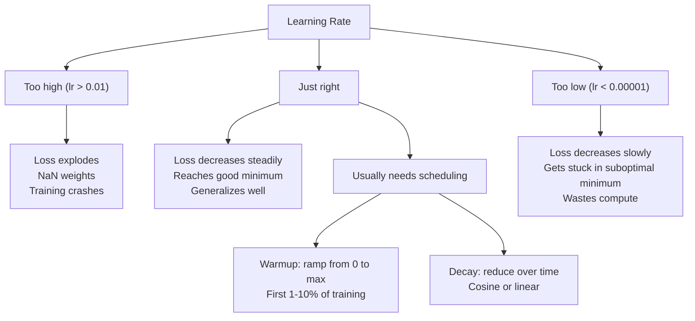
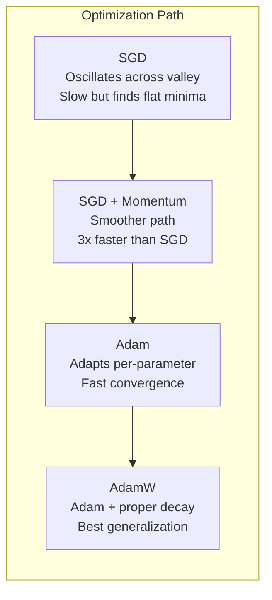
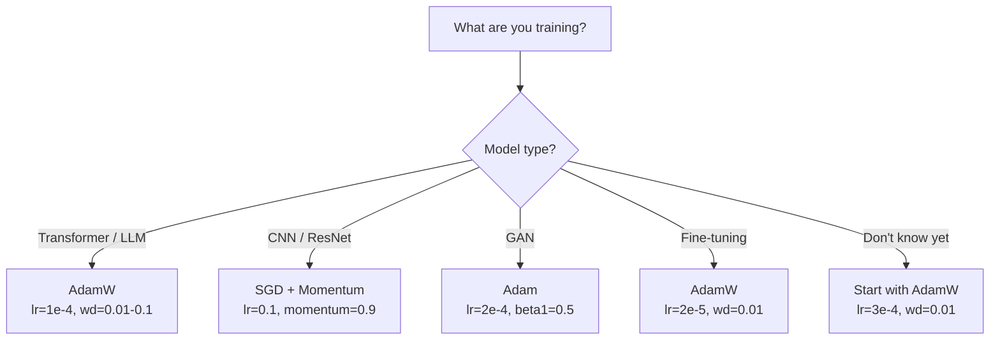

# Optimisateurs

> La descente graduelle vous indique dans quelle direction vous devez vous déplacer. Elle ne précise pas combien de distance vous devez parcourir, ni combien de temps vous devez parcourir.

**Type:** Build
**Languages:** Python
**Prerequisites:** Lesson 03.05 (Loss Functions)
**Time:** ~75 minutes

## Objectif de l'apprentissage

- Utilisez Python pour réaliser SGD 带 momentum de SGD  Adami 和 AdamW Optimisers
- Expliquer la correction du biais d'Adam Comment réparer entraînement étapes précoces de la phase initiale à zéro
-  démontrer pourquoi dans la même mission, AdamW a une meilleure capacité de généralisation que l'Adam avec la régulation L2
- Pour les transformateurs, les CNN, les GAN et les réglages, choisir un optimisateur adapté aux hyperparametres par défaut

##  problématique

Vous avez calculé le gradient. Vous savez que les 4,721 unités de poids devraient être réduites de 0,003 pour réduire les pertes. Mais quelle est la taille de 0,003 ?

La dégradation du gradient de vanille dans chaque étape de chaque paramètre  appliquer le même taux d'apprentissage: w = w - lr * gradient。 Cela entraînera trois problèmes, faire entraîner le réseau neural dans la pratique devient très douloureux。

La perte de paysage est très rare comme une plaine de boisson. Elle ressemble plus à une longue et étroite vallée. La perte de paysage est orientée vers la direction de la vallée.

Deuxièmement, pour tous les paramètres, utiliser le même taux d'apprentissage est erroné. Certains poids doivent être grandement mis à jour.

Troisième, les points de selle. Dans le haut de l'espace, il existe un grand paysage de perte de surface, dans lequel le gradient approche de zéro. La vanille SGD peut grimper à la vitesse du gradient sur ces zones, alors que cette vitesse est en fait proche de zéro.

Adam a résolu ces trois problèmes. Il a maintenu deux moyennes courantes pour chaque paramètre - gradient moyen, moment, traitement de la vibration) et gradient carré moyen, taux d'adaptation, traitement de différentes dimensions) et a réintégré la correction de biais des quelques étapes précédentes, il a fourni un seul optimisateur pour traiter 80% des problèmes.

## 概念

### Déclin de gradient stochastique (DGS)

Le plus simple est l'optimisateur.

```
w = w - lr * gradient
```

stochastique indique que vous utilisez des données de type random (miniremplacement) pour estimer le gradient, plutôt que d'utiliser un ensemble de données complet. Ce bruit est en fait utile - il aide à échapper aux minima locaux les plus élevés.

Le taux d'apprentissage est unique. Trop élevé: Perte de diffusion. Trop bas: l'entraînement prend beaucoup de temps. La valeur optimale dépend de l'architecture, des données, de la taille du lot et des étapes de formation actuelles.

### Le momentum

Les classes de petit ball roll down mountain slope sont utilisées trop souvent, mais c'est exact. Vous ne vous contentez pas de la progression du gradient, mais de maintenir une vitesse, pour accumuler les gradients passés.

```
m_t = beta * m_{t-1} + gradient
w = w - lr * m_t
```

Beta(habituellement à 0,9) contrôle conserver beaucoup d'informations historiques;; lorsque beta = 0,9 时,momentum 大致等于最近10 个 Gradients的平均值;;1/ (1 - 0,9) = 10);;

Pourquoi cela peut-il réparer la vibration: les gradients se rassemblent dans la même direction. Les gradients se contredisent les uns les autres. Dans cette section étroite de la vallée, la partition change à chaque étape et est affaiblie.

Réel: dans un paysage de perte très difficile, l'utilisation de SGD peut nécessiter 10 000 étapes. Avec SGD de dynamique, la bêta est de 0,9.

### RMSProp

La première méthode d'apprentissage adaptatif réellement efficace par paramètre ⋅ proposée par Hinton en cours ⋅ coursera ⋅ jamais publiée officiellement

```
s_t = beta * s_{t-1} + (1 - beta) * gradient^2
w = w - lr * gradient / (sqrt(s_t) + epsilon)
```

s_t Suivre la moyenne de fonctionnement des gradients carrés──continuer à avoir des paramètres de plus grands gradients − divisés par un nombre plus grand − moins élevé − taux d'apprentissage efficace − − les gradients − plus faibles − par un nombre plus petit − plus élevé − taux d'apprentissage efficace − −

Ceci a résolu tous les paramètres à l'aide du même taux d'apprentissage. Un a continuellement obtenu un poids considérablement amélioré.

Epsilon (habituellement pour 1e-8) se situe dans un paramètre qui n'a pas encore été mis à jour pour empêcher l'extinction de zéro.

### Adam: Momentum + RMSProp

Adam a combiné deux types de pensées. Il maintient deux moyennes mobiles exponentielles pour chaque paramètre:

```
m_t = beta1 * m_{t-1} + (1 - beta1) * gradient        (first moment: mean)
v_t = beta2 * v_{t-1} + (1 - beta2) * gradient^2       (second moment: variance)
```

**Bias correction**La plupart des explications vont sauter de la clé des détails. Dans la première étape, m_1 = (1 - beta1) * gradient.

```
m_hat = m_t / (1 - beta1^t)
v_hat = v_t / (1 - beta2^t)
```

La correction de la partialité à l'égard des précédents ~ 10 étapes est importante, après ~50 étapes, elle est fondamentalement sans importance.

更新公式:

```
w = w - lr * m_hat / (sqrt(v_hat) + epsilon)
```

Adam 默认值:lr = 0,001,beta1 = 0,9,beta2 = 0,999,epsilon = 1e-8。 ces valeurs de faille s'appliquent à 80% des problèmes。 lorsque elles ne s'appliquent pas, d'abord modifier lr。 puis modifier beta2── presque jamais ne pas modifier beta1 ou epsilon。

### AdamW: C' est vraiment une perte de poids

L2 régularisation 会向损失 中添加兰布 * w^2──在瓦尼拉 SGD, this is equivalent to weight decay((每步从重中减去兰布 * w)──在亚当,这种等价关系会失效──

Loshchilov & Hutter's洞见是: lorsque vous mettez L2 dans la perte, puis laissez Adam traiter Gradient 时, taux d'apprentissage adaptatif aussi diminuer le terme de régularisation.

AdamW                                                                                                                                                                                                                                                                                                                                                                                                                                                                                                                            

```
w = w - lr * m_hat / (sqrt(v_hat) + epsilon) - lr * lambda * w
```

Le terme de déclin du poids (lr * lambda * w) ne sera pas affecté par le facteur d'adaptation d'Adam 缩放── chaque paramètre a obtenu le même pourcentage de contraction──

Il est utilisé dans les transformateurs de formation PyTorch, les modèles de diffusion et la plupart des architectures modernes, l'optimisateur par défaut.

### Taux d'apprentissage: Hyperparamètre le plus important



Si vous ne modifiez qu'un seul hyperparamètre, alors il y a un taux d'apprentissage.

- SGD: lr = 0,01 à 0,1
- Adam/AdamW: lr = 1e-4 à 3e-4
- Modèles pré-entraînés à réglage fin: lr = 1e-5 à 5e-5
- Résistance à l'apprentissage: 1 à 10% des étapes

### Optimisateur par rapport à



### Chaque type d' optimisateur




```figure
optimizer-trajectory
```

## - Je le construis.

### 步骤 1: SGD de vanille

```python
class SGD:
    def __init__(self, lr=0.01):
        self.lr = lr

    def step(self, params, grads):
        for i in range(len(params)):
            params[i] -= self.lr * grads[i]
```

### 步骤 2: 带 Momentum de SGD

```python
class SGDMomentum:
    def __init__(self, lr=0.01, beta=0.9):
        self.lr = lr
        self.beta = beta
        self.velocities = None

    def step(self, params, grads):
        if self.velocities is None:
            self.velocities = [0.0] * len(params)
        for i in range(len(params)):
            self.velocities[i] = self.beta * self.velocities[i] + grads[i]
            params[i] -= self.lr * self.velocities[i]
```

### 步骤 3: Adam

```python
import math

class Adam:
    def __init__(self, lr=0.001, beta1=0.9, beta2=0.999, epsilon=1e-8):
        self.lr = lr
        self.beta1 = beta1
        self.beta2 = beta2
        self.epsilon = epsilon
        self.m = None
        self.v = None
        self.t = 0

    def step(self, params, grads):
        if self.m is None:
            self.m = [0.0] * len(params)
            self.v = [0.0] * len(params)

        self.t += 1

        for i in range(len(params)):
            self.m[i] = self.beta1 * self.m[i] + (1 - self.beta1) * grads[i]
            self.v[i] = self.beta2 * self.v[i] + (1 - self.beta2) * grads[i] ** 2

            m_hat = self.m[i] / (1 - self.beta1 ** self.t)
            v_hat = self.v[i] / (1 - self.beta2 ** self.t)

            params[i] -= self.lr * m_hat / (math.sqrt(v_hat) + self.epsilon)
```

### 步骤 4: AdamW

```python
class AdamW:
    def __init__(self, lr=0.001, beta1=0.9, beta2=0.999, epsilon=1e-8, weight_decay=0.01):
        self.lr = lr
        self.beta1 = beta1
        self.beta2 = beta2
        self.epsilon = epsilon
        self.weight_decay = weight_decay
        self.m = None
        self.v = None
        self.t = 0

    def step(self, params, grads):
        if self.m is None:
            self.m = [0.0] * len(params)
            self.v = [0.0] * len(params)

        self.t += 1

        for i in range(len(params)):
            self.m[i] = self.beta1 * self.m[i] + (1 - self.beta1) * grads[i]
            self.v[i] = self.beta2 * self.v[i] + (1 - self.beta2) * grads[i] ** 2

            m_hat = self.m[i] / (1 - self.beta1 ** self.t)
            v_hat = self.v[i] / (1 - self.beta2 ** self.t)

            params[i] -= self.lr * m_hat / (math.sqrt(v_hat) + self.epsilon)
            params[i] -= self.lr * self.weight_decay * params[i]
```

### 步骤 5: entraînement par rapport

Dans le jeu de données de cercle de la leçon 05 , utilisez tous les quatre Optimisateurs pour entraîner un réseau à deux niveaux.

```python
import random

def sigmoid(x):
    x = max(-500, min(500, x))
    return 1.0 / (1.0 + math.exp(-x))

def make_circle_data(n=200, seed=42):
    random.seed(seed)
    data = []
    for _ in range(n):
        x = random.uniform(-2, 2)
        y = random.uniform(-2, 2)
        label = 1.0 if x * x + y * y < 1.5 else 0.0
        data.append(([x, y], label))
    return data


class OptimizerTestNetwork:
    def __init__(self, optimizer, hidden_size=8):
        random.seed(0)
        self.hidden_size = hidden_size
        self.optimizer = optimizer

        self.w1 = [[random.gauss(0, 0.5) for _ in range(2)] for _ in range(hidden_size)]
        self.b1 = [0.0] * hidden_size
        self.w2 = [random.gauss(0, 0.5) for _ in range(hidden_size)]
        self.b2 = 0.0

    def get_params(self):
        params = []
        for row in self.w1:
            params.extend(row)
        params.extend(self.b1)
        params.extend(self.w2)
        params.append(self.b2)
        return params

    def set_params(self, params):
        idx = 0
        for i in range(self.hidden_size):
            for j in range(2):
                self.w1[i][j] = params[idx]
                idx += 1
        for i in range(self.hidden_size):
            self.b1[i] = params[idx]
            idx += 1
        for i in range(self.hidden_size):
            self.w2[i] = params[idx]
            idx += 1
        self.b2 = params[idx]

    def forward(self, x):
        self.x = x
        self.z1 = []
        self.h = []
        for i in range(self.hidden_size):
            z = self.w1[i][0] * x[0] + self.w1[i][1] * x[1] + self.b1[i]
            self.z1.append(z)
            self.h.append(max(0.0, z))

        self.z2 = sum(self.w2[i] * self.h[i] for i in range(self.hidden_size)) + self.b2
        self.out = sigmoid(self.z2)
        return self.out

    def compute_grads(self, target):
        eps = 1e-15
        p = max(eps, min(1 - eps, self.out))
        d_loss = -(target / p) + (1 - target) / (1 - p)
        d_sigmoid = self.out * (1 - self.out)
        d_out = d_loss * d_sigmoid

        grads = [0.0] * (self.hidden_size * 2 + self.hidden_size + self.hidden_size + 1)
        idx = 0
        for i in range(self.hidden_size):
            d_relu = 1.0 if self.z1[i] > 0 else 0.0
            d_h = d_out * self.w2[i] * d_relu
            grads[idx] = d_h * self.x[0]
            grads[idx + 1] = d_h * self.x[1]
            idx += 2

        for i in range(self.hidden_size):
            d_relu = 1.0 if self.z1[i] > 0 else 0.0
            grads[idx] = d_out * self.w2[i] * d_relu
            idx += 1

        for i in range(self.hidden_size):
            grads[idx] = d_out * self.h[i]
            idx += 1

        grads[idx] = d_out
        return grads

    def train(self, data, epochs=300):
        losses = []
        for epoch in range(epochs):
            total_loss = 0.0
            correct = 0
            for x, y in data:
                pred = self.forward(x)
                grads = self.compute_grads(y)
                params = self.get_params()
                self.optimizer.step(params, grads)
                self.set_params(params)

                eps = 1e-15
                p = max(eps, min(1 - eps, pred))
                total_loss += -(y * math.log(p) + (1 - y) * math.log(1 - p))
                if (pred >= 0.5) == (y >= 0.5):
                    correct += 1
            avg_loss = total_loss / len(data)
            accuracy = correct / len(data) * 100
            losses.append((avg_loss, accuracy))
            if epoch % 75 == 0 or epoch == epochs - 1:
                print(f"    Epoch {epoch:3d}: loss={avg_loss:.4f}, accuracy={accuracy:.1f}%")
        return losses
```

## Utilisez-le

PyTorch Optimizers 会 traitement des groupes de paramètres, de la coupe de gradients et de la planification du taux d'apprentissage:

```python
import torch
import torch.optim as optim

model = torch.nn.Sequential(
    torch.nn.Linear(784, 256),
    torch.nn.ReLU(),
    torch.nn.Linear(256, 10),
)

optimizer = optim.AdamW(model.parameters(), lr=3e-4, weight_decay=0.01)

scheduler = optim.lr_scheduler.CosineAnnealingLR(optimizer, T_max=100)

for epoch in range(100):
    optimizer.zero_grad()
    output = model(torch.randn(32, 784))
    loss = torch.nn.functional.cross_entropy(output, torch.randint(0, 10, (32,)))
    loss.backward()
    torch.nn.utils.clip_grad_norm_(model.parameters(), max_norm=1.0)
    optimizer.step()
    scheduler.step()
```

模式始终是:zero_grad、forward、loss、backward、(clip)、step、(schedule)。记住这个顺序──弄错它──例如在优化器.step() 之前调用 scheduler.step(((是细微 bug 的常见来源──

Pour les CNN, de nombreux praticiens préfèrent encore utiliser le SGD avec l'élan de l'ADM (l=0.1,momentum=0.9,weight_decay=1e-4), et le SGD trouvera des minima plus plates, ce qui a généralement une meilleure capacité de généralisation. Pour les transformateurs et les LLM, le AdamW avec le réchauffement + le déclin du cosine est un choix par défaut.

## Je le livre.

Le programme de formation
- `outputs/prompt-optimizer-selector.md`-- un prompt de décision utilisé pour l'architecture  choisir correct Optimiser et taux d'apprentissage

## 练习

1. 实现 Nesterov momentum, dans lequel vous êtes dans lookhead 位置(w - lr * beta * v) plutôt que dans la position actuelle calculer Gradient。

2.  réaliser un calendrier de réchauffement de taux d'apprentissage: dans les étapes de 10% de l'entraînement, de 0 à la rampe linéaire max_lr, puis de la décomposition cosytique à 0 ⋅ comparer Adam + réchauffement avec Adam sans réchauffement ⋅ mesurer dans un ensemble de données de cercle à 90% de précision ⋅ nécessiter plusieurs époques ⋅

3. Pendant l'entraînement, suivre le taux d'apprentissage efficace de chaque paramètre. Le taux d'apprentissage efficace est lr * m_hat / (sqrt(v_hat) + eps)

4. 实现 gradient clipping(according to global norm clip) ・・・将max gradient norm 设置为 1.0。使用较高学习率(Adam's lr=0.01)分别在有剪裁和无剪裁的情况下训练──统计10 种子中,有多少次运行 会发散(Loss 变为 NaN) ・・・

5. Dans un réseau de grands poids, comparer Adam et AdamW── tous les poids seront initialement classés en [-5, 5] avec une valeur aléatoire [( loin de la valeur normale)── utiliser le poids_décaissement=0,1 entraînement 200 époques── dessiner deux optimisateurs norme L2 des poids pendant le processus d'entraînement──AdamW  devrait montrer une contraction de poids plus rapide──

## 关键术语

| Term | 人们通常怎么说 | 它实际意味着什么 |
|------|----------------|----------------------|
| Learning rate | “Step size” | Gradient update 上的标量乘数；训练中影响最大的单个 hyperparameter |
| SGD | “Basic gradient descent” | Stochastic Gradient Descent：通过减去 lr * gradient 来更新 weights，Gradient 在 mini-batch 上计算 |
| Momentum | “Rolling ball analogy” | 过去 Gradients 的 exponential moving average；削弱振荡，并加速一致方向 |
| RMSProp | “Adaptive learning rate” | 用近期 Gradients 的 running RMS 除以每个 parameter 的 Gradient；均衡 learning rates |
| Adam | “The default optimizer” | 将 momentum（first moment）和 RMSProp（second moment）结合起来，并对初始 steps 进行 bias correction |
| AdamW | “Adam done right” | 带 decoupled weight decay 的 Adam；直接对 weights 应用 regularization，而不是通过 Gradient |
| Bias correction | “Warmup for running averages” | 除以 (1 - beta^t)，用于补偿 Adam 的 moment estimates 的零初始化 |
| Weight decay | “Shrink the weights” | 每一步减去 weight 值的一部分；一种惩罚大 weights 的 regularizer |
| Learning rate schedule | “Changing lr over time” | 在训练期间调整 learning rate 的函数；warmup + cosine decay 是现代默认方案 |
| Gradient clipping | “Capping the gradient norm” | 当 Gradient Vector 的 norm 超过阈值时对其进行缩放；防止 exploding gradient updates |

## 延伸阅读

- Kingma & Ba, Adam: Une méthode d'optimisation stochastique (2014) -- 原始 Adam paper, contenant une analyse de convergence 和 correction de biais 推导
- Loshchilov & Hutter, Régulation de la perte de poids découpée (2017) -- provait la régulation de l'L2 en Adam avec la perte de poids 不等价,并提出 AdamW
- Smith, Taux d'apprentissage cycliques pour la formation des réseaux neuraux (2017) --  Introduction de tests de gamme LR et de calendriers cycliques, réduction de la demande de taux d'apprentissage fixe
- Ruder, Un aperçu des algorithmes d'optimisation de la descente graduelle (2016) -- 关于所有优化器 变体的最佳单篇综述,比较清晰,直觉解释也明确
