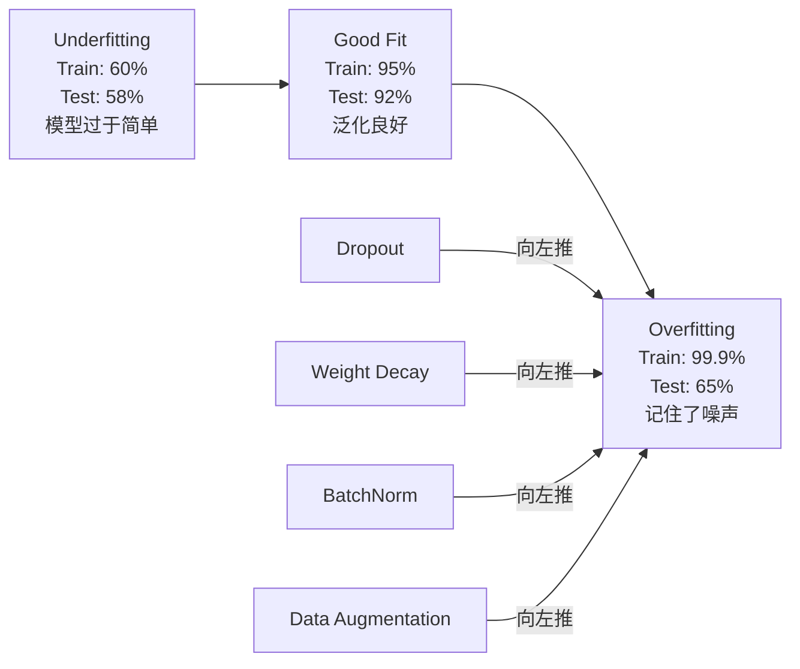
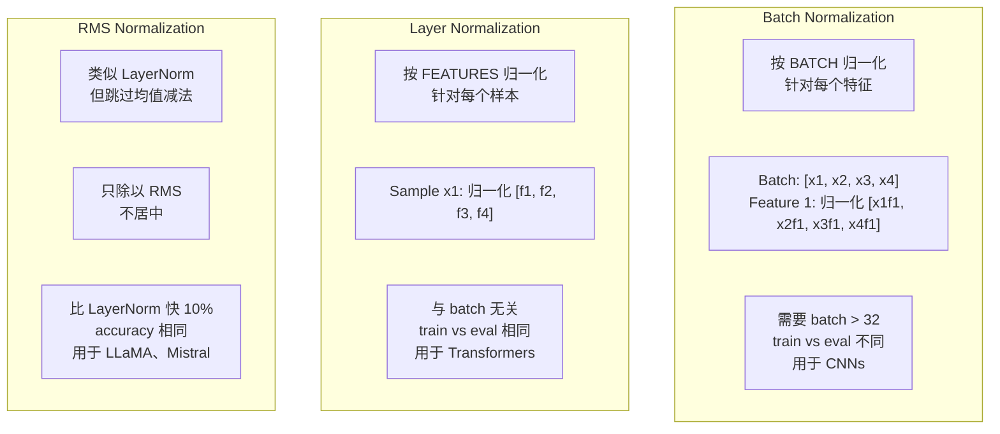
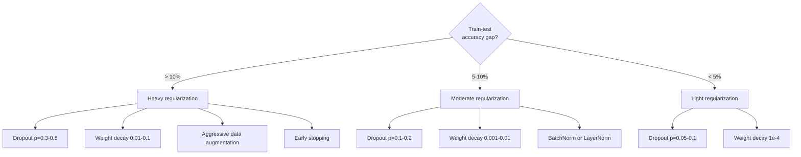

# Régularisation

> Votre modèle atteint 99% sur les données d'entraînement, mais seulement 60% sur les données de test. Il se souvient des données, et non des règles.

**Type:** Build
**Languages:** Python
**Prerequisites:** Lesson 03.06 (Optimizers)
**Time:** ~75 minutes

## Objectif de l'apprentissage
- De la réalisation à zéro avec l'inversion de l'échelle de la chute de l'échelle L2 déclin du poids L2 normalisation de lot normalisation de couche RMSNorm
- Méter la différence de précision des essais en train,并 par régularisation  expérience de diagnostic sur-adaptation
-  expliquer pourquoi Transformer utilise LayerNorm et non BatchNorm, ainsi que pourquoi les LLM modernes préfèrent RMSNorm
- En fonction de la gravité du surcoût, l'application de la régulation correcte 技术组合

##  problématique
Un réseau neural suffisamment large peut se souvenir de n'importe quel ensemble de données. Ce n'est pas une hypothèse Zhang et al. (2017)  通过带随机标签的ImageNet 上训标准网络证明这一点.

C'est le problème de l'excès de cohésion, et le modèle est plus grand, le problème est plus grave. Le GPT-3 a 175 milliards de paramètres.

La différence entre la performance de formation et la performance de test est un écart de sur-adaptation. Chaque technique de la classe attaque cette différence sous un angle différent. Le déploiement oblige le réseau à ne pas dépendre de n'importe quel neurone. La détérioration du poids empêche un seul poids de devenir trop grand. La normalisation de la série permet à l'optimisateur de trouver des minima plus simples. La normalisation de couche fait la même chose, mais peut fonctionner dans les lieux où la normalisation de lot ne fonctionne pas. La séquence de longueur peut changer. La norme RMS permet de supprimer la valeur moyenne en calcul, en rendant la norme plus rapide de 10%. Chaque technique est très simple.

## 概念
### Le spectre de l'excès

Chaque modèle est situé à une certaine position du sous-ensemble (des modèles simples, incapables de capter) aux modèles sur-ensemble (des modèles trop complexes, jusqu'à capter le bruit).



### Démission

La technique de régulation la plus simple, mais la plus élégante, est l'explication.

```
output = activation(z) * mask    where mask[i] ~ Bernoulli(1 - p)
```

Lorsque p = 0,5 , chaque fois que le passage en avant mettra la moitié des neurones à zéro. Le réseau doit apprendre à exécuter le redoutable, car il ne peut pas prédire quels neurones sont disponibles. Cela empêchera la co-adaptation, c'est-à-dire que les neurones dépendent de l'existence d'autres neurones spécifiques.

Ensemble  Expliquer: un réseau avec N 个神经元并使用落后的网络会创建2^N 个可能的子网络 ()  所有神经元开关的组合)   使用落后的训练近似于同时训练所有2^N 个子网络,每个都在不同的小批上训练 测试时,你使用所有神经元(无落后),并将输出按 (1 - p)缩小,缩小,以匹配训练期间的期望值 

实践中,缩放会在训练期间应用,而不是测试期间应用(reversé dérapté):

```
During training:  output = activation(z) * mask / (1 - p)
During testing:   output = activation(z)   (no change needed)
```

C'est mieux, parce que le code de test n'a pas besoin de savoir qu'il a abandonné.

默认比例:Transformer 使用 p = 0,1,MLPs 使用 p = 0,5,CNNs 使用 p = 0,2-0,3──更高的 dropout = 更强的规范化 = 更高的不适应风险──

### Déclinaison du poids (régularisation de l' L2)

Prendre le droit de propriété à la perte:

```
total_loss = task_loss + (lambda / 2) * sum(w_i^2)
```

Le gradient de régulation est lambda * w。 ce qui signifie que, à chaque étape, chaque poids sera réduit à zéro en fonction de sa taille proportionnelle à la taille de la taille.

Pourquoi cela contribue à la généralisation: le modèle de surpoids a tendance à avoir un poids plus élevé, augmentant le bruit dans les données d'entraînement.

L'hyperparamètre lambda  contrôle de la force ∞

- Transformateur de dessus AdamW Utilisation 0.01
- Les cns sont en haut de la SGD Utiliser 1e-4
- 严重 overfit 的模型使用 0.1

Comme le montre la leçon 06 dans le cours de discussion: déclin de poids et L2 régularisation, mais pas en Adam.

### Normalité des lots

Avant de transférer la sortie de chaque couche à la couche suivante, d'abord en mini-batch  dimension à son intégration.

Pour une série d'activations:

```
mu = (1/B) * sum(x_i)           (batch mean)
sigma^2 = (1/B) * sum((x_i - mu)^2)   (batch variance)
x_hat = (x_i - mu) / sqrt(sigma^2 + eps)   (normalize)
y = gamma * x_hat + beta        (scale and shift)
```

Gamma et bêta sont des paramètres appréciables, permettant au réseau dans les meilleurs cas de supprimer cette normalisation. Sans eux, vous forcerez chaque couche de sortie à devenir zéro moyenne, une différence de valeur, ce qui n'est pas nécessairement ce que le réseau veut.

**Training vs inference split:**Pendant la période d'entraînement, mu 和 sigma provient du mini-batch actuel. Pendant la période de formation, vous utilisez les moyennes de course cumulées.

Le concept de BatchNorm est toujours en cause. Le texte original affirme qu'il a réduit le "changement de covariates internes" (en anglais seulement) et que le changement de la distribution de l'entrée de gamme est plus rapide.

La norme de lot a une limite fondamentale: elle dépend des statistiques de lot. Lorsque le lot est de taille = 1, la moyenne et la différence de taille n'ont pas d'importance.

### Normalité des couches

Pour les échantillons individuels:

```
mu = (1/D) * sum(x_j)           (feature mean)
sigma^2 = (1/D) * sum((x_j - mu)^2)   (feature variance)
x_hat = (x_j - mu) / sqrt(sigma^2 + eps)
y = gamma * x_hat + beta
```

D est la dimension caractéristique. Chaque échantillon est indépendant de la taille du lot. C'est pourquoi le transformateur utilise la norme de couche et non la norme de lot.

LayerNorm de transformateur central sera appliqué dans chaque bloc d'attention à soi et chaque bloc de flux vers le haut  après Post-LN), ou appliqué avant eux Pre-LN, entraînement 

### RMSNorm

Il est également possible de réduire la valeur moyenne de la valeur de l'équipement.

```
rms = sqrt((1/D) * sum(x_j^2))
y = gamma * x / rms
```

Pour les modèles, la contribution à la performance est faible, mais il y a des coûts de calcul.

LLaMA、LLaMA 2、LLaMA 3、Mistral ainsi que la plupart des LLM modernes utilisent RMSNorm plutôt que LayerNorm── dans la taille de milliards de paramètres et de milliards de Tokens, cette économie de 10% est très importante──

### Comparaison de normalisation



### As Regularisation de l' Augmentation des données

Il ne s'agit pas de modifier le modèle, mais de modifier les données.

- Images: coupure aléatoire, retour, rotation, frisson de couleur, coupure
- Text: remplacement synonyme, traduction récurrente, suppression aléatoire
- Audio: décalage de temps, changement de ton, addition de bruit

effet et régularisation similaires: il augmente la taille efficace du groupe d'entraînement, rendant le modèle plus difficile à mémoriser un échantillon spécifique.

### Arrêt précoce

Le plus simple est de suivre la perte de validation, conserver le meilleur modèle, et de continuer à former une fenêtre de "patience" (généralement 5 à 20 époques). Si la perte de validation ne s'améliore pas dans la fenêtre de patience, alors arrêtez de charger le meilleur modèle de conservation.

### Quand appliquer quoi




```figure
l2-regularization
```

## - Je le construis.
### 步骤 1: Démission (Mode train et éval)

```python
import random
import math


class Dropout:
    def __init__(self, p=0.5):
        self.p = p
        self.training = True
        self.mask = None

    def forward(self, x):
        if not self.training:
            return list(x)
        self.mask = []
        output = []
        for val in x:
            if random.random() < self.p:
                self.mask.append(0)
                output.append(0.0)
            else:
                self.mask.append(1)
                output.append(val / (1 - self.p))
        return output

    def backward(self, grad_output):
        grads = []
        for g, m in zip(grad_output, self.mask):
            if m == 0:
                grads.append(0.0)
            else:
                grads.append(g / (1 - self.p))
        return grads
```

### 步骤 2: L2 Décomposition du poids

```python
def l2_regularization(weights, lambda_reg):
    penalty = 0.0
    for w in weights:
        penalty += w * w
    return lambda_reg * 0.5 * penalty

def l2_gradient(weights, lambda_reg):
    return [lambda_reg * w for w in weights]
```

### 步骤 3: Normalité du lot

```python
class BatchNorm:
    def __init__(self, num_features, momentum=0.1, eps=1e-5):
        self.gamma = [1.0] * num_features
        self.beta = [0.0] * num_features
        self.eps = eps
        self.momentum = momentum
        self.running_mean = [0.0] * num_features
        self.running_var = [1.0] * num_features
        self.training = True
        self.num_features = num_features

    def forward(self, batch):
        batch_size = len(batch)
        if self.training:
            mean = [0.0] * self.num_features
            for sample in batch:
                for j in range(self.num_features):
                    mean[j] += sample[j]
            mean = [m / batch_size for m in mean]

            var = [0.0] * self.num_features
            for sample in batch:
                for j in range(self.num_features):
                    var[j] += (sample[j] - mean[j]) ** 2
            var = [v / batch_size for v in var]

            for j in range(self.num_features):
                self.running_mean[j] = (1 - self.momentum) * self.running_mean[j] + self.momentum * mean[j]
                self.running_var[j] = (1 - self.momentum) * self.running_var[j] + self.momentum * var[j]
        else:
            mean = list(self.running_mean)
            var = list(self.running_var)

        self.x_hat = []
        output = []
        for sample in batch:
            normalized = []
            out_sample = []
            for j in range(self.num_features):
                x_h = (sample[j] - mean[j]) / math.sqrt(var[j] + self.eps)
                normalized.append(x_h)
                out_sample.append(self.gamma[j] * x_h + self.beta[j])
            self.x_hat.append(normalized)
            output.append(out_sample)
        return output
```

### 步骤 4: Normalization de la couche

```python
class LayerNorm:
    def __init__(self, num_features, eps=1e-5):
        self.gamma = [1.0] * num_features
        self.beta = [0.0] * num_features
        self.eps = eps
        self.num_features = num_features

    def forward(self, x):
        mean = sum(x) / len(x)
        var = sum((xi - mean) ** 2 for xi in x) / len(x)

        self.x_hat = []
        output = []
        for j in range(self.num_features):
            x_h = (x[j] - mean) / math.sqrt(var + self.eps)
            self.x_hat.append(x_h)
            output.append(self.gamma[j] * x_h + self.beta[j])
        return output
```

### 步骤 5: RMSNorm

```python
class RMSNorm:
    def __init__(self, num_features, eps=1e-6):
        self.gamma = [1.0] * num_features
        self.eps = eps
        self.num_features = num_features

    def forward(self, x):
        rms = math.sqrt(sum(xi * xi for xi in x) / len(x) + self.eps)
        output = []
        for j in range(self.num_features):
            output.append(self.gamma[j] * x[j] / rms)
        return output
```

### 步骤 6: Formation avec et sans régularisation

```python
def sigmoid(x):
    x = max(-500, min(500, x))
    return 1.0 / (1.0 + math.exp(-x))


def make_circle_data(n=200, seed=42):
    random.seed(seed)
    data = []
    for _ in range(n):
        x = random.uniform(-2, 2)
        y = random.uniform(-2, 2)
        label = 1.0 if x * x + y * y < 1.5 else 0.0
        data.append(([x, y], label))
    return data


class RegularizedNetwork:
    def __init__(self, hidden_size=16, lr=0.05, dropout_p=0.0, weight_decay=0.0):
        random.seed(0)
        self.hidden_size = hidden_size
        self.lr = lr
        self.dropout_p = dropout_p
        self.weight_decay = weight_decay
        self.dropout = Dropout(p=dropout_p) if dropout_p > 0 else None

        self.w1 = [[random.gauss(0, 0.5) for _ in range(2)] for _ in range(hidden_size)]
        self.b1 = [0.0] * hidden_size
        self.w2 = [random.gauss(0, 0.5) for _ in range(hidden_size)]
        self.b2 = 0.0

    def forward(self, x, training=True):
        self.x = x
        self.z1 = []
        self.h = []
        for i in range(self.hidden_size):
            z = self.w1[i][0] * x[0] + self.w1[i][1] * x[1] + self.b1[i]
            self.z1.append(z)
            self.h.append(max(0.0, z))

        if self.dropout and training:
            self.dropout.training = True
            self.h = self.dropout.forward(self.h)
        elif self.dropout:
            self.dropout.training = False
            self.h = self.dropout.forward(self.h)

        self.z2 = sum(self.w2[i] * self.h[i] for i in range(self.hidden_size)) + self.b2
        self.out = sigmoid(self.z2)
        return self.out

    def backward(self, target):
        eps = 1e-15
        p = max(eps, min(1 - eps, self.out))
        d_loss = -(target / p) + (1 - target) / (1 - p)
        d_sigmoid = self.out * (1 - self.out)
        d_out = d_loss * d_sigmoid

        for i in range(self.hidden_size):
            d_relu = 1.0 if self.z1[i] > 0 else 0.0
            d_h = d_out * self.w2[i] * d_relu
            self.w2[i] -= self.lr * (d_out * self.h[i] + self.weight_decay * self.w2[i])
            for j in range(2):
                self.w1[i][j] -= self.lr * (d_h * self.x[j] + self.weight_decay * self.w1[i][j])
            self.b1[i] -= self.lr * d_h
        self.b2 -= self.lr * d_out

    def evaluate(self, data):
        correct = 0
        total_loss = 0.0
        for x, y in data:
            pred = self.forward(x, training=False)
            eps = 1e-15
            p = max(eps, min(1 - eps, pred))
            total_loss += -(y * math.log(p) + (1 - y) * math.log(1 - p))
            if (pred >= 0.5) == (y >= 0.5):
                correct += 1
        return total_loss / len(data), correct / len(data) * 100

    def train_model(self, train_data, test_data, epochs=300):
        history = []
        for epoch in range(epochs):
            total_loss = 0.0
            correct = 0
            for x, y in train_data:
                pred = self.forward(x, training=True)
                self.backward(y)
                eps = 1e-15
                p = max(eps, min(1 - eps, pred))
                total_loss += -(y * math.log(p) + (1 - y) * math.log(1 - p))
                if (pred >= 0.5) == (y >= 0.5):
                    correct += 1
            train_loss = total_loss / len(train_data)
            train_acc = correct / len(train_data) * 100
            test_loss, test_acc = self.evaluate(test_data)
            history.append((train_loss, train_acc, test_loss, test_acc))
            if epoch % 75 == 0 or epoch == epochs - 1:
                gap = train_acc - test_acc
                print(f"    Epoch {epoch:3d}: train_acc={train_acc:.1f}%, test_acc={test_acc:.1f}%, gap={gap:.1f}%")
        return history
```

## Utilisez-le
PyTorch en forme de module fournit toutes les normalisations et régularisations:

```python
import torch
import torch.nn as nn

model = nn.Sequential(
    nn.Linear(784, 256),
    nn.BatchNorm1d(256),
    nn.ReLU(),
    nn.Dropout(0.3),
    nn.Linear(256, 128),
    nn.BatchNorm1d(128),
    nn.ReLU(),
    nn.Dropout(0.3),
    nn.Linear(128, 10),
)

model.train()
out_train = model(torch.randn(32, 784))

model.eval()
out_test = model(torch.randn(1, 784))
```

`model.train()`- Je suis là .`model.eval()`切换非常关键──它会开/关闭 drop-out,并告诉BatchNorm  使用批量统计 还是运行统计──推理前忘记调用 `model.eval()`L'une des erreurs les plus courantes de l'apprentissage profond est que votre précision des tests est variable, car le dérapagement est toujours en état d'activation, tandis que la norme de série utilise encore les statistiques mini-partie.

Pour Transformer, mode différent:

```python
class TransformerBlock(nn.Module):
    def __init__(self, d_model=512, nhead=8, dropout=0.1):
        super().__init__()
        self.attention = nn.MultiheadAttention(d_model, nhead, dropout=dropout)
        self.norm1 = nn.LayerNorm(d_model)
        self.ff = nn.Sequential(
            nn.Linear(d_model, d_model * 4),
            nn.GELU(),
            nn.Linear(d_model * 4, d_model),
            nn.Dropout(dropout),
        )
        self.norm2 = nn.LayerNorm(d_model)
        self.dropout = nn.Dropout(dropout)

    def forward(self, x):
        attended, _ = self.attention(x, x, x)
        x = self.norm1(x + self.dropout(attended))
        x = self.norm2(x + self.ff(x))
        return x
```

LayerNorm, plutôt que BatchNorm. De déploiement p = 0,1, plutôt que p = 0,5 .

## Je le livre.
Le cours est ouvert à:
- `outputs/prompt-regularization-advisor.md`-- un prompt, pour diagnostiquer le surcoût et proposer une stratégie de régularisation correcte

## 练习
1. Pour réaliser le déclin spatial des données 2D: ne pas abandonner un seul neurone, mais abandonner l'ensemble des canaux de fonctionnalités.

2. Pour les résultats de l'étude, il est nécessaire de calculer les différences de précision de chaque configuration et de mesurer les différences de précision des tests de train.

3. Dans votre réseau de cercle-ensemble de données, entre la couche cachée et l'activation  Ajouter une couche BatchNorm ⋅ dans les taux d'apprentissage 0.01、0.05 和 0.1 下, séparément utiliser et ne pas utiliser BatchNorm 訓練── BatchNorm ⋅ devrait pouvoir diffuser des taux d'apprentissage plus élevés dans le réseau vanille ⋅ dans le cadre de l'exercice de la stabilité ⋅

4. 实现 l'arrêt précoce: chaque époque Suivre la perte de test, conserver le meilleur poids, si la perte de test 连续 20 个时代 没有改善则停止――运行规律化网络 1000 个时代――报告哪个时代 拥有最佳测试精度,以及你节省了多少时代的计算――

5. Dans un réseau de 4 couches ((non seulement 2 couches) comparer LayerNorm et RMSNorm.

## 关键术语
| Term | What people say | What it actually means |
|------|----------------|----------------------|
| Overfitting | "模型记住了数据" | 当模型的训练表现显著高于测试表现时，表示它学到了噪声而不是信号 |
| Regularization | "防止 overfitting" | 任何约束模型复杂度以改善泛化的技术：dropout、weight decay、normalization、augmentation |
| Dropout | "随机删除神经元" | 训练期间以概率 p 将随机神经元置零，迫使模型学习冗余表示；等价于训练一个 ensemble |
| Weight decay | "L2 penalty" | 每一步通过减去 lambda * w 将所有权重向零收缩；通过权重大小惩罚复杂度 |
| Batch normalization | "按 batch 归一化" | 训练期间使用 batch statistics、推理期间使用 running averages，在 batch 维度上对层输出进行归一化 |
| Layer normalization | "按样本归一化" | 在每个样本内部跨特征归一化；与 batch 无关，用于 batch size 可变的 Transformer |
| RMSNorm | "没有均值的 LayerNorm" | Root mean square normalization；从 LayerNorm 中去掉均值减法，以相同 accuracy 获得 10% 加速 |
| Early stopping | "在 overfit 前停止" | 当 validation loss 不再改善时停止训练；最简单的 regularizer，通常与其他方法一起使用 |
| Data augmentation | "用更少数据生成更多数据" | 变换训练输入（flip、crop、noise）以增加有效数据集大小，并迫使模型学习不变性 |
| Generalization gap | "Train-test split" | 训练表现与测试表现之间的差异；regularization 的目标是最小化这个 gap |

## 延伸阅读
- Srivastava et coll., "Dropout: un moyen simple d'empêcher les réseaux neuraux de trop se dépasser" (2014) -- 原始 dropout 论文,包含 ensemble 解释和大量实验
- Ioffe & Szegedy, " Batch Normalization: Accélérer la formation en réseau profond en réduisant le changement de covariate interne " (2015) -- Introduction à BatchNorm et à son processus de formation, est l'un des thèmes les plus cités en matière d'apprentissage profond
- Zhang & Sennrich, "Rot Mean Square Layer Normalization" (2019) --  montrent que RMSNorm 能以更少计算匹配 LayerNorm précision; été adopté par LLaMA 和 Mistral 
- Zhang et coll., "Comprendre l'apprentissage profond nécessite une rééducation générale" (2017) -- 里程碑论文, démonstration du réseau neural peuvent se souvenir de chaque marque, défiant le point de vue généraliste traditionnel
