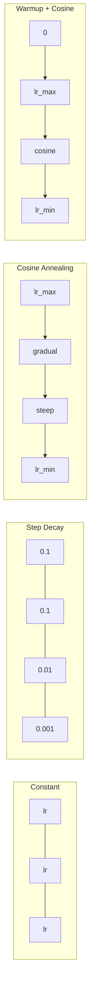
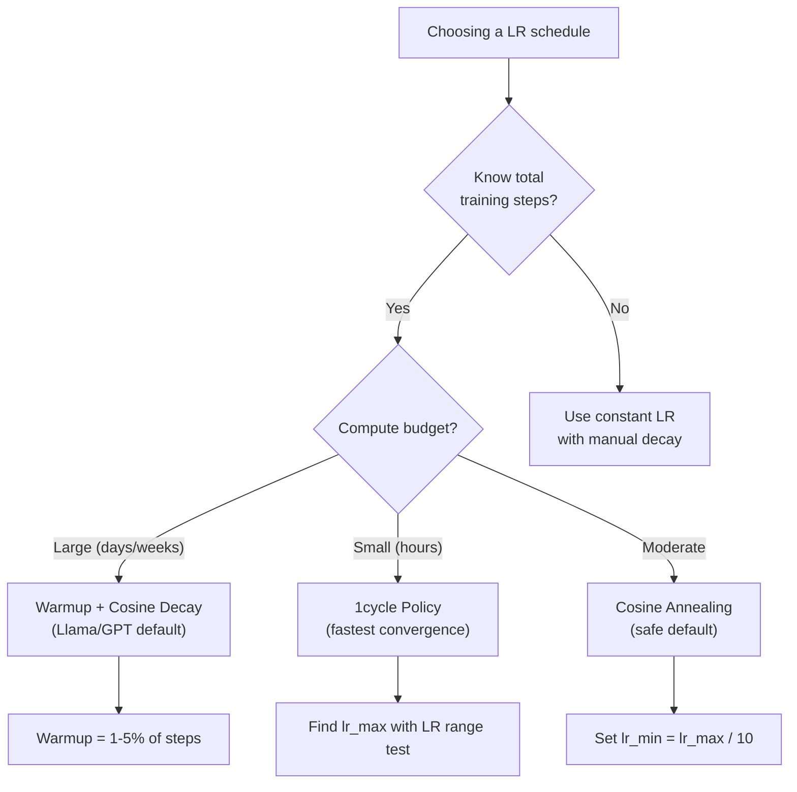
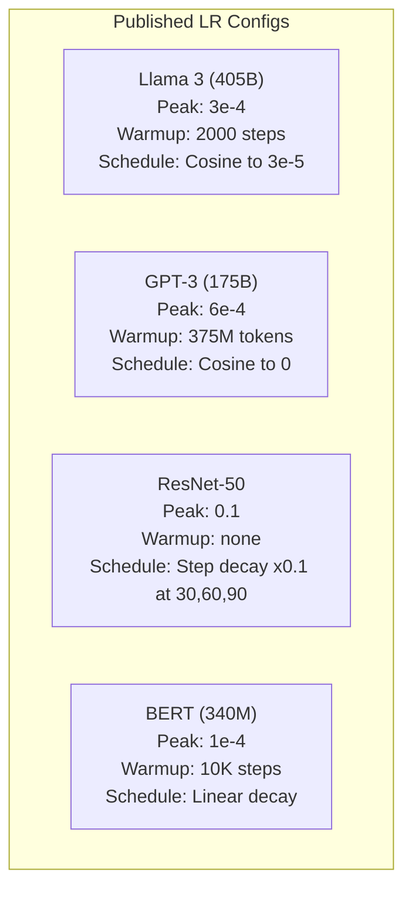

# Les horaires d'apprentissage et le réchauffement

> Le taux d'apprentissage est le seul hyperparamètre le plus important. Pas l'architecture. Pas la taille du jeu de données.

**类型：**Construction
**语言：**Python
**先修：**Leçon 03.06 (optimisateurs), leçon 03.08 (initialisation du poids)
**时间：**À environ 90 minutes.

## Objectif de l'apprentissage

- De la réalisation de la constante, de la décomposition en étapes, de l'anneillage des cosines, du réchauffement + des cosines et des horaires de taux d'apprentissage de 1 cycle
- 演示 apprentissage 选择的三种失败模式:divergence(过高) 、stalling(过低) 及振荡(没有衰退)
- Expliquer pourquoi l'optimisateur basé sur Adam a besoin de réchauffement, ainsi que comment il stabilise l'entraînement précoce
- Comparer la vitesse de convergence des cinq programmes sur la même tâche, et choisir le programme approprié pour un budget de formation donné

##  problématique

Le taux d'apprentissage est de 0,1... la formation varie... la perte est de 3 étapes, elle est de 0,0001... la formation est lente et s'accélère... 100 époques plus tard, le modèle reste presque inchangé... la formation est de 0,01... la perte est de 50 étapes plus tard, elle est de 50 étapes plus tard.

Le taux d'apprentissage optimal n'est pas un nombre constant. Il varie au cours du processus d'entraînement.

Llama 3 utilise des étapes de réchauffement de pointe lr=3e-4,2000, et passe par la détérioration cosine détérioration à 3e-5―GPT-3 utilise lr=6e-4, et 375 millions de jetons  sur réchauffement.

Vous devez comprendre les horaires, car la valeur par défaut ne s'applique pas nécessairement à votre problème. Lorsque vous ajustez un modèle prétrainé, le bon horaire n'est pas comme si vous pratiquiez un entraînement à zéro. Lorsque vous augmentez la taille du lot, la période de réchauffement doit également changer.

## 概念

### Taux d'apprentissage constant

Le plus simple est de choisir un nombre, chaque étape est utilisée.

```
lr(t) = lr_0
```

很少是最优的──它要么对训练末期来说太高 (((在最小 附近的振荡),要么对训练初步来说太低 ((在小步上浪费计算) ──对小模型和调试来说也可以──对任何需要训练超过一小时的任务都是个糟糕的选择──

### Décomposition des étapes

De la méthode ancienne de ResNet 时代.

```
lr(t) = lr_0 * gamma^(floor(epoch / step_size))
```

Parmi eux, gamma = 0,1 et step_size = 30 indique: lr Chaque 30 époques  réduire 10x。ResNet-50 en utilisant cette -- lr=0,1, en époques 30、60 和 90 时 降低 10x。

Le problème est: le meilleur déclin Dependent du jeu de données et de l'architecture.

### Le cosine annealing

Selon la courbe cosine, du taux d'apprentissage le plus élevé à la valeur minimale:

```
lr(t) = lr_min + 0.5 * (lr_max - lr_min) * (1 + cos(pi * t / T))
```

Parmi les étapes suivantes, il y a toujours des étapes.

Lorsque t=0 时,cosine 项为1,所以 lr = lr_max──当 t=T 时,cosine 项为 -1,所以 lr = lr_min──décay 一开始很平缓,中间加速,接近末尾时再次变得平缓──

C'est la plupart des exercices modernes qui fonctionnent par défaut. À l'exception de lr_max et de lr_min, il n'y a pas besoin de modifier les hyperparametres.

### Pourquoi commencer de petite ?

Adam 和其他适应优化器 会维护 Gradient mean 和 variance 运行估计――在步骤 0, ces estimations sont initialized为零――最初几次 Gradient updates 基于非常差的统计量――如果你的学习率在此段时间很大,模型会迈出巨大且方向不良的步子――

Le réchauffement peut réparer ce problème. D'abord, il commence à un taux d'apprentissage très faible. Il commence généralement par lr_max/warmup_steps, voire pour zéro.

```
lr(t) = lr_max * (t / warmup_steps)     for t < warmup_steps
```

Le réchauffement typique: 1 à 5% des étapes de formation totale. Llama 3 a entraîné environ 1,8 billions de jetons, et réchauffé jusqu'à 2000 étapes.

### Réchauffement linéaire + décomposition cosine

现代默认方案──abord une rampe linéaire, puis une décomposition cosine:

```
if t < warmup_steps:
    lr(t) = lr_max * (t / warmup_steps)
else:
    progress = (t - warmup_steps) / (total_steps - warmup_steps)
    lr(t) = lr_min + 0.5 * (lr_max - lr_min) * (1 + cos(pi * progress))
```

C'est ce que font les transformateurs modernes.

### Politique du cycle

Les résultats de Leslie Smith: dans la première moitié de l'entraînement, le taux d'apprentissage passe de la basse à la haute, et dans la seconde moitié, il diminue.

理論是: taux d'apprentissage élevé, en passant par la trajectoire d'optimisation, entraîne le bruit et l'action de régularisation.

```
Phase 1 (0 to T/2):    lr ramps from lr_max/25 to lr_max
Phase 2 (T/2 to T):    lr ramps from lr_max to lr_max/10000
```

Dans le budget calculé fixe, le cycle suivant est généralement plus rapide que l'anneillage cosine.

### Tableau 形状



###  processus de décision



### 已发表的模型 中的真实数值




```figure
lr-schedule
```

## - Je le construis.

### 步骤 1:Téléchargement des fonctions

Chaque fonction recevoir la première étape,并返回 la vitesse d'apprentissage de cette étape.

```python
import math


def constant_schedule(step, lr=0.01, **kwargs):
    return lr


def step_decay_schedule(step, lr=0.1, step_size=100, gamma=0.1, **kwargs):
    return lr * (gamma ** (step // step_size))


def cosine_schedule(step, lr=0.01, total_steps=1000, lr_min=1e-5, **kwargs):
    if step >= total_steps:
        return lr_min
    return lr_min + 0.5 * (lr - lr_min) * (1 + math.cos(math.pi * step / total_steps))


def warmup_cosine_schedule(step, lr=0.01, total_steps=1000, warmup_steps=100, lr_min=1e-5, **kwargs):
    if total_steps <= warmup_steps:
        return lr * (step / max(warmup_steps, 1))
    if step < warmup_steps:
        return lr * step / warmup_steps
    progress = (step - warmup_steps) / (total_steps - warmup_steps)
    return lr_min + 0.5 * (lr - lr_min) * (1 + math.cos(math.pi * progress))


def one_cycle_schedule(step, lr=0.01, total_steps=1000, **kwargs):
    mid = max(total_steps // 2, 1)
    if step < mid:
        return (lr / 25) + (lr - lr / 25) * step / mid
    else:
        progress = (step - mid) / max(total_steps - mid, 1)
        return lr * (1 - progress) + (lr / 10000) * progress
```

### 步骤 2: visualisation de tous les horaires

Imprimez un plan basé sur le texte, montrant chaque calendrier dans le processus d'entraînement.

```python
def visualize_schedule(name, schedule_fn, total_steps=500, **kwargs):
    steps = list(range(0, total_steps, total_steps // 20))
    if total_steps - 1 not in steps:
        steps.append(total_steps - 1)

    lrs = [schedule_fn(s, total_steps=total_steps, **kwargs) for s in steps]
    max_lr = max(lrs) if max(lrs) > 0 else 1.0

    print(f"\n{name}:")
    for s, lr_val in zip(steps, lrs):
        bar_len = int(lr_val / max_lr * 40)
        bar = "#" * bar_len
        print(f"  Step {s:4d}: lr={lr_val:.6f} {bar}")
```

### 步骤 3: Réseau de formation

Dans le jeu de données de cercle, utilisez un réseau simple à deux couches, le même que les quelques cours précédents, mais cette fois, nous avons changé le calendrier.

```python
import random


def sigmoid(x):
    x = max(-500, min(500, x))
    return 1.0 / (1.0 + math.exp(-x))


def relu(x):
    return max(0.0, x)


def relu_deriv(x):
    return 1.0 if x > 0 else 0.0


def make_circle_data(n=200, seed=42):
    random.seed(seed)
    data = []
    for _ in range(n):
        x = random.uniform(-2, 2)
        y = random.uniform(-2, 2)
        label = 1.0 if x * x + y * y < 1.5 else 0.0
        data.append(([x, y], label))
    return data


def train_with_schedule(schedule_fn, schedule_name, data, epochs=300, base_lr=0.05, **kwargs):
    random.seed(0)
    hidden_size = 8
    total_steps = epochs * len(data)

    std = math.sqrt(2.0 / 2)
    w1 = [[random.gauss(0, std) for _ in range(2)] for _ in range(hidden_size)]
    b1 = [0.0] * hidden_size
    w2 = [random.gauss(0, std) for _ in range(hidden_size)]
    b2 = 0.0

    step = 0
    epoch_losses = []

    for epoch in range(epochs):
        total_loss = 0
        correct = 0

        for x, target in data:
            lr = schedule_fn(step, lr=base_lr, total_steps=total_steps, **kwargs)

            z1 = []
            h = []
            for i in range(hidden_size):
                z = w1[i][0] * x[0] + w1[i][1] * x[1] + b1[i]
                z1.append(z)
                h.append(relu(z))

            z2 = sum(w2[i] * h[i] for i in range(hidden_size)) + b2
            out = sigmoid(z2)

            error = out - target
            d_out = error * out * (1 - out)

            for i in range(hidden_size):
                d_h = d_out * w2[i] * relu_deriv(z1[i])
                w2[i] -= lr * d_out * h[i]
                for j in range(2):
                    w1[i][j] -= lr * d_h * x[j]
                b1[i] -= lr * d_h
            b2 -= lr * d_out

            total_loss += (out - target) ** 2
            if (out >= 0.5) == (target >= 0.5):
                correct += 1
            step += 1

        avg_loss = total_loss / len(data)
        accuracy = correct / len(data) * 100
        epoch_losses.append(avg_loss)

    return epoch_losses
```

### 步骤 4: Comparer tous les horaires

Utilisez chaque calendrier pour entraîner le même réseau, et comparez les pertes et convergences finales.

```python
def compare_schedules(data):
    configs = [
        ("Constant", constant_schedule, {}),
        ("Step Decay", step_decay_schedule, {"step_size": 15000, "gamma": 0.1}),
        ("Cosine", cosine_schedule, {"lr_min": 1e-5}),
        ("Warmup+Cosine", warmup_cosine_schedule, {"warmup_steps": 3000, "lr_min": 1e-5}),
        ("1cycle", one_cycle_schedule, {}),
    ]

    print(f"\n{'Schedule':<20} {'Start Loss':>12} {'Mid Loss':>12} {'End Loss':>12} {'Best Loss':>12}")
    print("-" * 70)

    for name, schedule_fn, extra_kwargs in configs:
        losses = train_with_schedule(schedule_fn, name, data, epochs=300, base_lr=0.05, **extra_kwargs)
        mid_idx = len(losses) // 2
        best = min(losses)
        print(f"{name:<20} {losses[0]:>12.6f} {losses[mid_idx]:>12.6f} {losses[-1]:>12.6f} {best:>12.6f}")
```

### 步骤 5: LR 过高 vs 过低

演示三种失败模式:过高(divergence) 过低(爬行) 和刚刚好──

```python
def lr_sensitivity(data):
    learning_rates = [1.0, 0.1, 0.01, 0.001, 0.0001]

    print("\nLR Sensitivity (constant schedule, 100 epochs):")
    print(f"  {'LR':>10} {'Start Loss':>12} {'End Loss':>12} {'Status':>15}")
    print("  " + "-" * 52)

    for lr in learning_rates:
        losses = train_with_schedule(constant_schedule, f"lr={lr}", data, epochs=100, base_lr=lr)
        start = losses[0]
        end = losses[-1]

        if end > start or math.isnan(end) or end > 1.0:
            status = "DIVERGED"
        elif end > start * 0.9:
            status = "BARELY MOVED"
        elif end < 0.15:
            status = "CONVERGED"
        else:
            status = "LEARNING"

        end_str = f"{end:.6f}" if not math.isnan(end) else "NaN"
        print(f"  {lr:>10.4f} {start:>12.6f} {end_str:>12} {status:>15}")
```

## Utilisez-le

PyTorch est en train de`torch.optim.lr_scheduler`Les programmes sont fournis:

```python
import torch
import torch.optim as optim
from torch.optim.lr_scheduler import CosineAnnealingLR, OneCycleLR, StepLR

model = nn.Sequential(nn.Linear(10, 64), nn.ReLU(), nn.Linear(64, 1))
optimizer = optim.Adam(model.parameters(), lr=3e-4)

scheduler = CosineAnnealingLR(optimizer, T_max=1000, eta_min=1e-5)

for step in range(1000):
    loss = train_step(model, optimizer)
    scheduler.step()
```

Pour le réchauffement + cosine, utilisez un calendrier lambda, ou utilisez HuggingFace `get_cosine_schedule_with_warmup`- Le numéro de la liste:

```python
from transformers import get_cosine_schedule_with_warmup

scheduler = get_cosine_schedule_with_warmup(
    optimizer,
    num_warmup_steps=2000,
    num_training_steps=100000,
)
```

La fonction HuggingFace est la plupart des scripts de réglage de llama et GPT.

## Je le livre.

Le cours est ouvert à:
- `outputs/prompt-lr-schedule-advisor.md`-- un prompt, pour être utilisé selon votre formation de configuration de recommandations adapté à l'horaire de taux d'apprentissage et hyperparametres

## 练习

1. 实现 exponentiel de décomposition:lr(t) = lr_0 * gamma^t, dont gamma = 0,999。

2. 实现 learning rate range test(Leslie Smith): entraînement à plusieurs centaines de pas, tout en augmentant le LR de 1e à 7 indices à 1― dessiner la perte contre le LR― le maximum de LR 位于 Loss 开始增加之前―

3. Utilisez le réchauffement + cosine entraînement, mais modifiez le réchauffement 长度:总步骤的 0%、1%、5%、10%、20%──找到训练最稳定的甜点──

4. 实现带热启动的共性连接 (SGDR): à chaque étape, le taux d'apprentissage sera redéfini à lr_max, puis à nouveau décliné.

5. Construire un chirurgien l'horaire , surveiller l'entraînement l'entraînement l'entraînement l'entraînement l'entraînement l'entraînement l'entraînement l'entraînement l'entraînement l'entraînement l'entraînement l'entraînement l'entraînement l'entraînement l'entraînement l'entraînement l'entraînement l'entraînement l'entraînement l'entraînement l'entraînement l'entraînement l'entraînement l'entraînement l'entraînement l'entraînement l'entraînement l'entraînement l'entraînement l'entraînement l'entraînement l'entraînement l'entraînement l'entraînement l'entraînement l'entraînement 

## 关键术语

| Term | 人们通常怎么说 | 它真正的含义 |
|------|----------------|----------------------|
| Learning rate | “model 学得有多快” | 用来乘以 Gradient、决定参数更新大小的标量 |
| Schedule | “随时间改变 LR” | 将 training step 映射到 learning rate 的 function，旨在优化 convergence |
| Warmup | “从小 LR 开始” | 在最初 N steps 中，将 LR 从接近零 linearly ramp 到目标值，以稳定 Optimizer 统计量 |
| Cosine annealing | “平滑 LR decay” | 在训练过程中，让 LR 按 cosine 曲线从 lr_max 降低到 lr_min |
| Step decay | “在 milestones 降低 LR” | 在固定 epoch intervals，将 LR 乘以一个因子（通常是 0.1） |
| 1cycle policy | “先上后下” | Leslie Smith 的方法：在单个 cycle 中将 LR 先 ramp up 再 ramp down，以获得更快 convergence |
| LR range test | “找到最佳 learning rate” | 在短时间训练中逐步增加 LR，以找到 Loss 开始 diverge 的数值 |
| Cosine with warm restarts | “重置并重复” | 周期性地将 LR 重置为 lr_max，并再次 decay（SGDR） |
| Eta min | “LR 的下限” | schedule 最终 decay 到的最小 learning rate |
| Peak learning rate | “最大 LR” | 训练过程中达到的最高 LR，通常出现在 warmup 之后 |

## 延伸阅读

- Loshchilov & Hutter, "SGDR: Descente du gradient stochastique avec des redémarrages chauds" (2017) -- introduit l'anneillage cosine et les redémarrages chauds
- Smith, "Super-convergence: formation très rapide des réseaux neuronaux utilisant des taux d'apprentissage élevés" (2018) -- politique de 1 cycle 论文
- Touvron et coll., "Llama 2: Fondation ouverte et modèles de chat bien ajustés" (2023) -- 记录了大规模使用的暖化 + cosine scheduler
- Goyal et coll., "Gréf, Grand Minibatch SGD: Training ImageNet en 1 heure" (2017) -- grande partie de formation de la règle de l'échelle linéaire 和 chauffage
