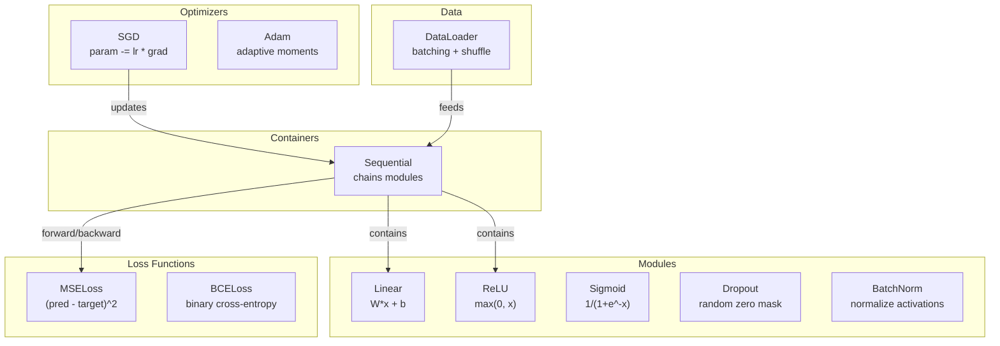
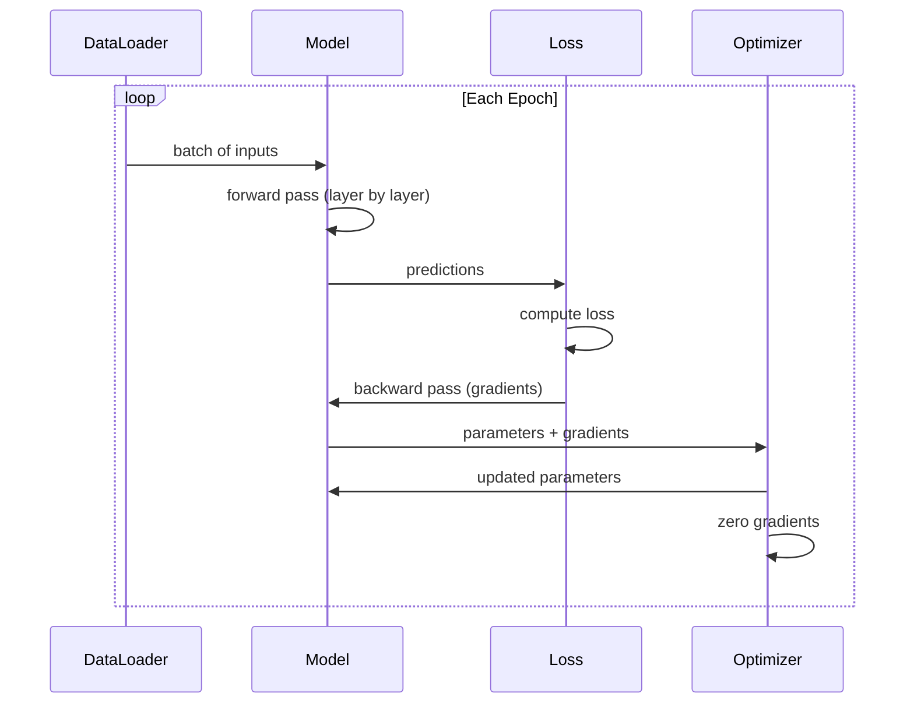
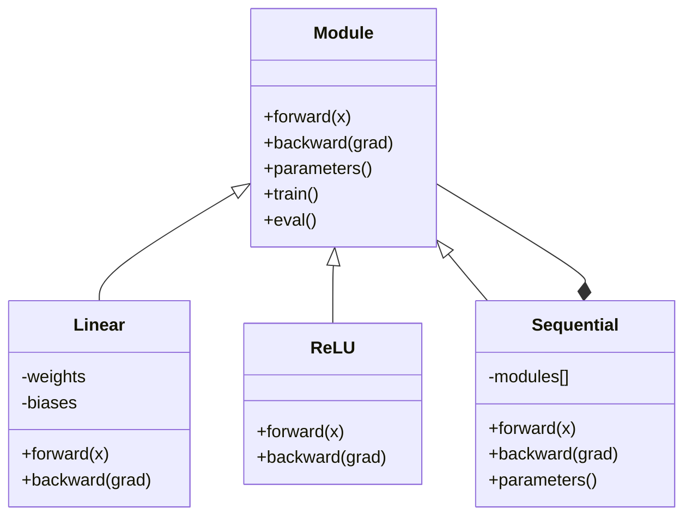

#  Construire votre propre Mini Framework

> Vous avez déjà construit des neurones, des couches, des réseaux, des backprops, des activations, des Perte de fonction, des optimisateurs, de régulation, d'initialisation et de calendriers LR.

**类型:**Construction
**语言:**Python
**前置知识:**Phase 03 Tous les contenus
**时间:**- 120 minutes

## Objectif de l'apprentissage

- Construire un cadre complet d'apprentissage profond (environ 500 pages), contenant des modules, des logiciels, des logiciels, des logiciels, des logiciels, des logiciels, des logiciels, des logiciels, des logiciels, des logiciels, des logiciels, des logiciels, des logiciels, des logiciels, des logiciels, des logiciels, des logiciels, des logiciels, des logiciels, des logiciels, des logiciels, des logiciels, des logiciels, des logiciels, des logiciels, des logiciels, des logiciels, des logiciels, des logiciels, des logiciels, des logiciels, des logiciels, des logiciels, des logiciels, des logiciels, des logiciels, des logiciels, des logiciels, des logiciels, des logiciels, des logiciels, des logiciels, des logiciels, des logiciels, des logiciels, des logiciels, des logiciels, des logiciels, des logiciels, des logiciels, des logiciels, etc.
- Expliquer l'abstraction du module ((avant, arrière, paramètres), ainsi que pourquoi il faut changer de mode train/éval
- Connecter tous les composants à une boucle de formation fonctionnelle, utilisée pour former un réseau de 4 couches dans la classification en cercle
- Pour que chaque composant de votre framework soit cartographié à la suite de PyTorch et autres objets (n.Module,n.Sequential,optimum,Adam,DataLoader)

##  problématique

Vous avez déjà construit des blocs de construction dispersés dans différents documents dans 10 sections.`Value`Dans une classe, il y a une boucle de formation, un autre fichier avec une initialisation de poids, un autre fichier avec des horaires de taux d'apprentissage. Pour former un réseau, vous devez copier le code de collage dans cinq sections différentes, puis les connecter manuellement.

C'est le cadre qui doit résoudre le problème.`nn.Module`- Je suis là.`nn.Sequential`- Je suis là.`optim.Adam`- Je suis là.`DataLoader`, ainsi que le modèle de cycle d'entraînement qui s'est formé en les assemblant.`keras.Layer`- Je suis là.`keras.Sequential`- Je suis là.`keras.optimizers.Adam`Tous ces éléments ne sont pas magiques, ils sont des modèles d'organisation qui permettent de définir, d'entraîner et d'évaluer les réseaux sans avoir à réinventer à chaque fois la logique de connexion de base.

Vous utiliserez environ 500 pages Python pour construire la même chose. Vous n'avez pas besoin de numpy. Vous n'avez pas besoin de dépendance externe. Ce cadre peut être défini comme un réseau de flux de référence, avec SGD ou Adam.

Après avoir terminé, tu comprendras parfaitement.`model = nn.Sequential(...)`Tu sais pourquoi il y a eu ça.`model.train()`et `model.eval()`Tu comprendras pourquoi.`optimizer.zero_grad()`C'est un seul usage. Tu comprendras tout ça, car c'est toi qui les as construits.

## 核心概念

### Abstraction du module

Chaque couche de PyTorch est héréditaire .`nn.Module`◊ Un module a trois responsabilités:

1. **forward()**-- 给定输入, calcul de sortie
2. **parameters()**-- 返回所有可训练权重
3. **backward()**-- 计算 gradients( dans PyTorch 中由自动级 处理, dans notre cadre 中显式实现)

La couche linéaire est un module。L'activation de RELU est un module。La couche de dérapagement est un module。La couche de normalisation de lot est également un module。Ils ont la même interface。

### Contenant séquentiel

`nn.Sequential`会串联模块──Forward pass:让数据依次通过模块 1、模块 2、模块 3──Backward pass:反向遍历这条链──container 本身也是一个模块--它有前面()、参数() 和后面(()──这是一个复合模式:一串模块 本身也是一个模块──

### 训练 vs Évaluation 模式

Le décrochage dans l'entraînement est une opportunité de placer les neurones à zéro, mais en évaluation, la normalisation de lot utilise des statistiques de lot lors de l'entraînement, mais en évaluation utilise des moyennes courantes。`train()`et `eval()`Les méthodes utilisées pour changer ce comportement.`training`drapeau

### Optimisateur

Optimiser Utilisez les gradients des paramètres pour les mettre à jour.`param -= lr * grad` Adam:维护 momentum 和 variance estimations, puis effectuer une mise à jour.

### Le chargeur de données

Le batchage est important, il y a deux raisons. Premièrement, pour les grands problèmes, vous ne pouvez pas mettre tout le ensemble de données dans l'in-memory. Deuxièmement, le petit lot de Gradient Descent fournit du bruit, aidant à échapper aux minima locaux.

### Architecture de cadre



### Le cycle d'entraînement



### Hiérarchie des modules




```figure
gradient-clipping
```

## - Je le construis.

### 步骤 1: Classe de base du module

Chaque couche doit réaliser une interface abstraite.

```python
class Module:
    def __init__(self):
        self.training = True

    def forward(self, x):
        raise NotImplementedError

    def backward(self, grad):
        raise NotImplementedError

    def parameters(self):
        return []

    def train(self):
        self.training = True

    def eval(self):
        self.training = False
```

### 步骤 2: Couche linéaire

Le calcul des poids et des objets de stockage, avant, arrière, avant, avant, avant, avant, avant, avant, avant, avant, avant, avant, avant, avant, avant, avant, avant, avant, avant, avant, avant, après, après, après, après, après, après, après, après, après, après, après, après, après, après, après, après, après, après, après, après, après, après, après, après, après, après, après, après, après, après, après, après, après, après, après, après, après, après, après, après, après, après, après, après, après, après, après, après, après, après, après, après, après, après, après, après, après, après, après, après, après, après, après, après, après, après, après, après, après, après,

```python
import math
import random


class Linear(Module):
    def __init__(self, fan_in, fan_out):
        super().__init__()
        std = math.sqrt(2.0 / fan_in)
        self.weights = [[random.gauss(0, std) for _ in range(fan_in)] for _ in range(fan_out)]
        self.biases = [0.0] * fan_out
        self.weight_grads = [[0.0] * fan_in for _ in range(fan_out)]
        self.bias_grads = [0.0] * fan_out
        self.fan_in = fan_in
        self.fan_out = fan_out
        self.input = None

    def forward(self, x):
        self.input = x
        output = []
        for i in range(self.fan_out):
            val = self.biases[i]
            for j in range(self.fan_in):
                val += self.weights[i][j] * x[j]
            output.append(val)
        return output

    def backward(self, grad):
        input_grad = [0.0] * self.fan_in
        for i in range(self.fan_out):
            self.bias_grads[i] += grad[i]
            for j in range(self.fan_in):
                self.weight_grads[i][j] += grad[i] * self.input[j]
                input_grad[j] += grad[i] * self.weights[i][j]
        return input_grad

    def parameters(self):
        params = []
        for i in range(self.fan_out):
            for j in range(self.fan_in):
                params.append((self.weights, i, j, self.weight_grads))
            params.append((self.biases, i, None, self.bias_grads))
        return params
```

### 步骤 3: Modules d'activation

RELUCION, Sigmoid et Tanh seront réalisés en modules.

```python
class ReLU(Module):
    def __init__(self):
        super().__init__()
        self.mask = None

    def forward(self, x):
        self.mask = [1.0 if v > 0 else 0.0 for v in x]
        return [max(0.0, v) for v in x]

    def backward(self, grad):
        return [g * m for g, m in zip(grad, self.mask)]


class Sigmoid(Module):
    def __init__(self):
        super().__init__()
        self.output = None

    def forward(self, x):
        self.output = []
        for v in x:
            v = max(-500, min(500, v))
            self.output.append(1.0 / (1.0 + math.exp(-v)))
        return self.output

    def backward(self, grad):
        return [g * o * (1 - o) for g, o in zip(grad, self.output)]


class Tanh(Module):
    def __init__(self):
        super().__init__()
        self.output = None

    def forward(self, x):
        self.output = [math.tanh(v) for v in x]
        return self.output

    def backward(self, grad):
        return [g * (1 - o * o) for g, o in zip(grad, self.output)]
```

### 步骤 4: Module de démission

訓練時随机将元素置零──将保留下来的元素按1/(1-p) 缩放,使期望值保持不变──在 eval 时不做任何处理──

```python
class Dropout(Module):
    def __init__(self, p=0.5):
        super().__init__()
        self.p = p
        self.mask = None

    def forward(self, x):
        if not self.training:
            return x
        self.mask = [0.0 if random.random() < self.p else 1.0 / (1 - self.p) for _ in x]
        return [v * m for v, m in zip(x, self.mask)]

    def backward(self, grad):
        if self.mask is None:
            return grad
        return [g * m for g, m in zip(grad, self.mask)]
```

### 步骤 5: Module de série

按 feature 在批量上将激活 归一化为零 mean 和单元变异――为 eval mode 维护运行统计――

```python
class BatchNorm(Module):
    def __init__(self, size, momentum=0.1, eps=1e-5):
        super().__init__()
        self.size = size
        self.gamma = [1.0] * size
        self.beta = [0.0] * size
        self.gamma_grads = [0.0] * size
        self.beta_grads = [0.0] * size
        self.running_mean = [0.0] * size
        self.running_var = [1.0] * size
        self.momentum = momentum
        self.eps = eps
        self.x_norm = None
        self.std_inv = None
        self.batch_input = None

    def forward_batch(self, batch):
        batch_size = len(batch)
        output_batch = []

        if self.training:
            mean = [0.0] * self.size
            for sample in batch:
                for j in range(self.size):
                    mean[j] += sample[j]
            mean = [m / batch_size for m in mean]

            var = [0.0] * self.size
            for sample in batch:
                for j in range(self.size):
                    var[j] += (sample[j] - mean[j]) ** 2
            var = [v / batch_size for v in var]

            self.std_inv = [1.0 / math.sqrt(v + self.eps) for v in var]

            self.x_norm = []
            self.batch_input = batch
            for sample in batch:
                normed = [(sample[j] - mean[j]) * self.std_inv[j] for j in range(self.size)]
                self.x_norm.append(normed)
                output = [self.gamma[j] * normed[j] + self.beta[j] for j in range(self.size)]
                output_batch.append(output)

            for j in range(self.size):
                self.running_mean[j] = (1 - self.momentum) * self.running_mean[j] + self.momentum * mean[j]
                self.running_var[j] = (1 - self.momentum) * self.running_var[j] + self.momentum * var[j]
        else:
            std_inv = [1.0 / math.sqrt(v + self.eps) for v in self.running_var]
            for sample in batch:
                normed = [(sample[j] - self.running_mean[j]) * std_inv[j] for j in range(self.size)]
                output = [self.gamma[j] * normed[j] + self.beta[j] for j in range(self.size)]
                output_batch.append(output)

        return output_batch

    def forward(self, x):
        result = self.forward_batch([x])
        return result[0]

    def backward(self, grad):
        if self.x_norm is None:
            return grad
        for j in range(self.size):
            self.gamma_grads[j] += self.x_norm[0][j] * grad[j]
            self.beta_grads[j] += grad[j]
        return [grad[j] * self.gamma[j] * self.std_inv[j] for j in range(self.size)]

    def parameters(self):
        params = []
        for j in range(self.size):
            params.append((self.gamma, j, None, self.gamma_grads))
            params.append((self.beta, j, None, self.beta_grads))
        return params
```

### 步骤 6: Contenant séquentiel

串联模块──Forward de gauche à droite, arrière de droite à gauche──

```python
class Sequential(Module):
    def __init__(self, *modules):
        super().__init__()
        self.modules = list(modules)

    def forward(self, x):
        for module in self.modules:
            x = module.forward(x)
        return x

    def backward(self, grad):
        for module in reversed(self.modules):
            grad = module.backward(grad)
        return grad

    def parameters(self):
        params = []
        for module in self.modules:
            params.extend(module.parameters())
        return params

    def train(self):
        self.training = True
        for module in self.modules:
            module.train()

    def eval(self):
        self.training = False
        for module in self.modules:
            module.eval()
```

### 步骤 7: Perte de fonctions

MSE 和 Binary Cross-Entropy── chacun de nous revient à la valeur de perte,并提供一个倒退() 返回 Gradient──

```python
class MSELoss:
    def __call__(self, predicted, target):
        self.predicted = predicted
        self.target = target
        n = len(predicted)
        self.loss = sum((p - t) ** 2 for p, t in zip(predicted, target)) / n
        return self.loss

    def backward(self):
        n = len(self.predicted)
        return [2 * (p - t) / n for p, t in zip(self.predicted, self.target)]


class BCELoss:
    def __call__(self, predicted, target):
        self.predicted = predicted
        self.target = target
        eps = 1e-7
        n = len(predicted)
        self.loss = 0
        for p, t in zip(predicted, target):
            p = max(eps, min(1 - eps, p))
            self.loss += -(t * math.log(p) + (1 - t) * math.log(1 - p))
        self.loss /= n
        return self.loss

    def backward(self):
        eps = 1e-7
        n = len(self.predicted)
        grads = []
        for p, t in zip(self.predicted, self.target):
            p = max(eps, min(1 - eps, p))
            grads.append((-t / p + (1 - t) / (1 - p)) / n)
        return grads
```

### 步骤 8: SGD et Adam Optimisateurs

两者都接收参数 list,并使用梯度 更新重量──

```python
class SGD:
    def __init__(self, parameters, lr=0.01):
        self.params = parameters
        self.lr = lr

    def step(self):
        for container, i, j, grad_container in self.params:
            if j is not None:
                container[i][j] -= self.lr * grad_container[i][j]
            else:
                container[i] -= self.lr * grad_container[i]

    def zero_grad(self):
        for container, i, j, grad_container in self.params:
            if j is not None:
                grad_container[i][j] = 0.0
            else:
                grad_container[i] = 0.0


class Adam:
    def __init__(self, parameters, lr=0.001, beta1=0.9, beta2=0.999, eps=1e-8):
        self.params = parameters
        self.lr = lr
        self.beta1 = beta1
        self.beta2 = beta2
        self.eps = eps
        self.t = 0
        self.m = [0.0] * len(parameters)
        self.v = [0.0] * len(parameters)

    def step(self):
        self.t += 1
        for idx, (container, i, j, grad_container) in enumerate(self.params):
            if j is not None:
                g = grad_container[i][j]
            else:
                g = grad_container[i]

            self.m[idx] = self.beta1 * self.m[idx] + (1 - self.beta1) * g
            self.v[idx] = self.beta2 * self.v[idx] + (1 - self.beta2) * g * g

            m_hat = self.m[idx] / (1 - self.beta1 ** self.t)
            v_hat = self.v[idx] / (1 - self.beta2 ** self.t)

            update = self.lr * m_hat / (math.sqrt(v_hat) + self.eps)

            if j is not None:
                container[i][j] -= update
            else:
                container[i] -= update

    def zero_grad(self):
        for container, i, j, grad_container in self.params:
            if j is not None:
                grad_container[i][j] = 0.0
            else:
                grad_container[i] = 0.0
```

### 步骤 9: DataLoader

Les données peuvent être coupées en lots, et choisies à chaque époque.

```python
class DataLoader:
    def __init__(self, data, batch_size=32, shuffle=True):
        self.data = data
        self.batch_size = batch_size
        self.shuffle = shuffle

    def __iter__(self):
        indices = list(range(len(self.data)))
        if self.shuffle:
            random.shuffle(indices)
        for start in range(0, len(indices), self.batch_size):
            batch_indices = indices[start:start + self.batch_size]
            batch = [self.data[i] for i in batch_indices]
            inputs = [item[0] for item in batch]
            targets = [item[1] for item in batch]
            yield inputs, targets

    def __len__(self):
        return (len(self.data) + self.batch_size - 1) // self.batch_size
```

### 第 10 步: dans la classification de cercle 上训练 4 couches réseau

Pour le classement des résultats, vous devez définir le modèle, choisir la fonction de perte, choisir l'optimisateur, utiliser la boucle de formation.

```python
def make_circle_data(n=500, seed=42):
    random.seed(seed)
    data = []
    for _ in range(n):
        x = random.uniform(-2, 2)
        y = random.uniform(-2, 2)
        label = 1.0 if x * x + y * y < 1.5 else 0.0
        data.append(([x, y], [label]))
    return data


def train():
    random.seed(42)

    model = Sequential(
        Linear(2, 16),
        ReLU(),
        Linear(16, 16),
        ReLU(),
        Linear(16, 8),
        ReLU(),
        Linear(8, 1),
        Sigmoid(),
    )

    criterion = BCELoss()
    optimizer = Adam(model.parameters(), lr=0.01)

    data = make_circle_data(500)
    split = int(len(data) * 0.8)
    train_data = data[:split]
    test_data = data[split:]

    loader = DataLoader(train_data, batch_size=16, shuffle=True)

    model.train()

    for epoch in range(100):
        total_loss = 0
        total_correct = 0
        total_samples = 0

        for batch_inputs, batch_targets in loader:
            batch_loss = 0
            for x, t in zip(batch_inputs, batch_targets):
                pred = model.forward(x)
                loss = criterion(pred, t)
                batch_loss += loss

                optimizer.zero_grad()
                grad = criterion.backward()
                model.backward(grad)
                optimizer.step()

                predicted_class = 1.0 if pred[0] >= 0.5 else 0.0
                if predicted_class == t[0]:
                    total_correct += 1
                total_samples += 1

            total_loss += batch_loss

        avg_loss = total_loss / total_samples
        accuracy = total_correct / total_samples * 100

        if epoch % 10 == 0 or epoch == 99:
            print(f"Epoch {epoch:3d} | Loss: {avg_loss:.6f} | Train Accuracy: {accuracy:.1f}%")

    model.eval()
    correct = 0
    for x, t in test_data:
        pred = model.forward(x)
        predicted_class = 1.0 if pred[0] >= 0.5 else 0.0
        if predicted_class == t[0]:
            correct += 1
    test_accuracy = correct / len(test_data) * 100
    print(f"\nTest Accuracy: {test_accuracy:.1f}% ({correct}/{len(test_data)})")

    return model, test_accuracy
```

## Utilisez-le

Voici la version ci-dessous du contenu que vous venez de créer:

```python
import torch
import torch.nn as nn
from torch.utils.data import DataLoader, TensorDataset

model = nn.Sequential(
    nn.Linear(2, 16),
    nn.ReLU(),
    nn.Linear(16, 16),
    nn.ReLU(),
    nn.Linear(16, 8),
    nn.ReLU(),
    nn.Linear(8, 1),
    nn.Sigmoid(),
)

criterion = nn.BCELoss()
optimizer = torch.optim.Adam(model.parameters(), lr=0.01)

for epoch in range(100):
    model.train()
    for inputs, targets in dataloader:
        optimizer.zero_grad()
        predictions = model(inputs)
        loss = criterion(predictions, targets)
        loss.backward()
        optimizer.step()

    model.eval()
    with torch.no_grad():
        test_predictions = model(test_inputs)
```

La structure est parfaitement cohérente.`Sequential`- Je suis là.`Linear`- Je suis là.`ReLU`- Je suis là.`Sigmoid`- Je suis là.`BCELoss`- Je suis là.`Adam`- Je suis là.`zero_grad`- Je suis là.`backward`- Je suis là.`step`- Je suis là.`train`- Je suis là.`eval` Chaque concept est un seul traitement. La différence est que PyTorch se charge automatiquement sur chaque module, mais il est possible de le faire avec le GPU et de le faire fonctionner pendant plusieurs années.

Maintenant, quand vous voyez le code PyTorch, vous savez vraiment ce qui se passe dans chaque ligne.

## 交付内容

Le cours est ouvert à:
- `outputs/prompt-framework-architect.md`-- une mise à jour de l'architecture de réseau neural basée sur des abstractions de cadre

## 练习

1. Pour la classification multi-classe 添加一个 `SoftmaxCrossEntropyLoss`classe── pour les prédictions faire la douce max, calculer la perte d'entropie croisée,并处理组合后的倒退通过──在一个3级螺旋数据集上测试它──

2. Dans Optimiser, il est possible de planifier le taux d'apprentissage:`set_lr()`méthode,并接入 Lesson 09 中的kosine scheduling──使用暖化+kosine 训练圈分类器,并与恒例LR对比──

3. Pour la séquence 添加 `save()`et `load()`méthode, tous les poids seront sérifiés dans un fichier JSON, et seront rechargés.

4. Dans Adam Optimizer, réaliser une perte de poids (L2)`weight_decay`Paramètre, les poids sont réduits à zéro à chaque étape.

5. Utiliser un véritable mini-batch Accumulation de gradients  remplacement par cycle de formation par échantillon: dans tous les échantillons d'un lot, les gradients de cumulation, puis déduction en taille de lot, rééxecute une fois l'optimisation étape── mesure est la mesure de changement de la vitesse de réception──

## 关键术语

| Term | 人们通常怎么说 | 它真正的含义 |
|------|----------------|----------------------|
| Module | “一个 layer” | framework 中的基础 abstraction -- 任何具有 forward()、backward() 和 parameters() 的东西 |
| Sequential | “按顺序堆叠 layers” | 一个串联 modules 的 container，在 forward 时按顺序应用，在 backward 时反向应用 |
| Forward pass | “运行 network” | 按顺序让 input 通过每个 module 来计算 output |
| Backward pass | “计算 gradients” | 将 Loss Gradient Backpropagation通过每个 module，以计算 parameter gradients |
| Parameters | “可训练 weights” | network 中 Optimizer 可以更新的所有值 -- weights 和 biases |
| Optimizer | “更新 weights 的东西” | 一种使用 gradients 更新 parameters 的算法，实现 SGD、Adam 或其他规则 |
| DataLoader | “喂 data 的东西” | 一个 iterator，将 dataset 切分为 batches，并可选择在 epochs 之间 shuffle |
| Training mode | “model.train()” | 一个启用 stochastic 行为的 flag，例如 dropout，以及使用 batch stats 的 batch normalization |
| Evaluation mode | “model.eval()” | 一个禁用 dropout 并让 batch normalization 使用 running statistics 的 flag |
| Zero grad | “清空 gradients” | 在计算下一个 batch 的 gradients 之前，将所有 parameter gradients 重置为零 |

## 延伸阅读

- Paszke et coll., "PyTorch: un style impératif, bibliothèque d'apprentissage profond de haute performance" (2019) -- 描述 PyTorch 设计决策的论文
- Chollet, "Deep Learning with Python, Second Edition" (2021) -- Chapitre 3 介绍 Keras internals, utilisant la même abstraction de module/couche
- Johnson, "Tiny-DNN" (https://github.com/tiny-dnn/tiny-dnn) -- un cadre de Deep Learning C++ en en-tête uniquement, utilisé pour comprendre les internes du cadre
