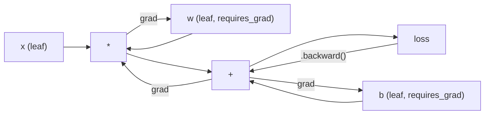
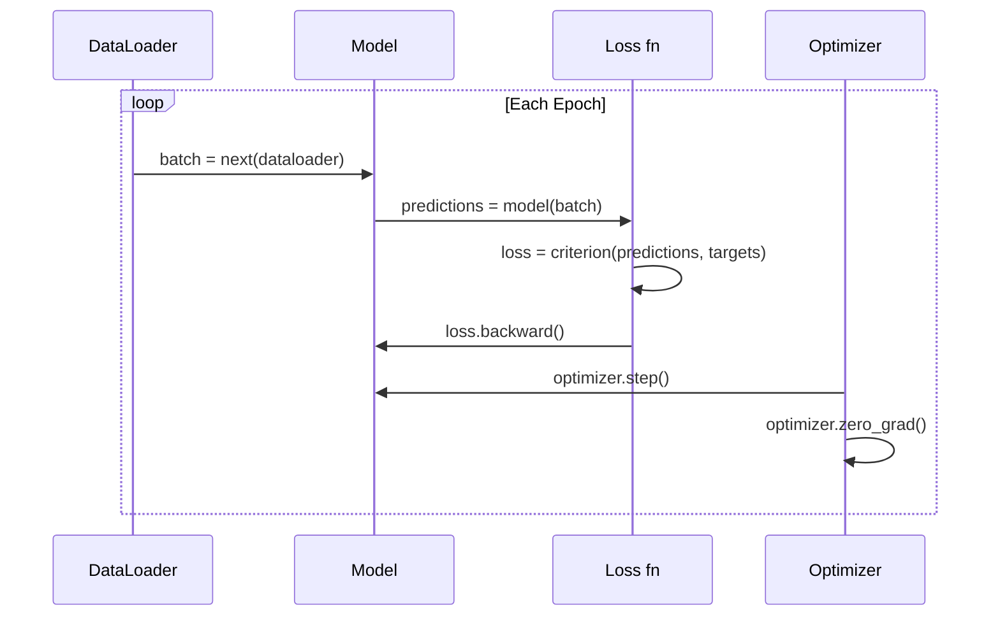

# PyTorch Entrée

> Tu as déjà construit un moteur avec du poids et du poids.

**Type:** Build
**Languages:** Python
**Prerequisites:** Lesson 03.10 (Build Your Own Mini Framework)
**Time:** ~75 minutes

## Objectif de l'apprentissage
- Utilisation de PyTorch de nn.Module、nn.Sequentiel 和 autograd 构建并训练 Réseau neuronal
- Utilisation de PyTorch Tensor、GPU 加速, ainsi que le cycle de formation standard ((zero_grad、forward、loss、backward、step)
- Transformer le mini-cadre de réalisation de votre composant en PyTorch et autres
- Comparer votre cadre Python pur à la vitesse de formation de PyTorch

##  problématique
Vous avez déjà un mini-cadre fonctionnel. Il peut utiliser Python purement en forme de classification ronde pour former un réseau à 4 couches.

Mais dans le même cas, il est aussi 500 fois plus lent que PyTorch.

Votre mini-framework utilise un schéma Python cycle une fois pour traiter un échantillon. PyTorch va distribuer la même opération à des noyaux C++/CUDA optimisés et fonctionner sur le GPU.

速度不是唯一差距──你的框架 没有GPU 支持──没有自动区分你为每个模块写回来了()──没有序列化──没有分布式训练──没有混合精度──除了打印 语句,没有办法调试渐流──

PyTorch a comblé tous ces lacunes. Il a conservé le même modèle de pensée que vous avez déjà créé: Module, avance, paramètres, arrière, optimisateur, étape.

## 概念
### Pourquoi PyTorch a gagné

En 2015, TensorFlow  exige que vous soyez en train de faire tout ce que vous voulez avant de définir un graphique de calcul statique.

PyTorch a été publié en 2017, en adoptant différents concepts: exécution désireuse.`y = model(x)`Il est également possible de calculer le temps de calcul en utilisant le système de calcul en Python.

En 2020, le marché a déjà donné une réponse. La part de PyTorch dans les travaux de recherche sur le ML est passée de 7% en 2017 à plus de 75% en 2022.

L'expérience du développeur va augmenter. Un ralenti de 10%, mais débogage de près de 50% du cadre, chaque fois que tu gagnes.

### Les tenseurs

Le tensor est un nombre de dimensions, avec trois attributs clés: forme, type et dispositif.

```python
import torch

x = torch.zeros(3, 4)           # shape: (3, 4), dtype: float32, device: cpu
x = torch.randn(2, 3, 224, 224) # batch of 2 RGB images, 224x224
x = torch.tensor([1, 2, 3])     # from a Python list
```

**Shape**Prononcer la forme de la taille et de l'échelle est (), Le vecteur est (n), la matrice est (m, n), un ensemble d'images est (batch, canaux, hauteur, largeur)

**Dtype**- Je ne sais pas.

| dtype | Bits | Range | Use case |
|-------|------|-------|----------|
| float32 | 32 | ~7 位十进制数字 | 默认训练 |
| float16 | 16 | ~3.3 位十进制数字 | Mixed precision |
| bfloat16 | 16 | 与 float32 相同的范围，精度更低 | LLM 训练 |
| int8 | 8 | -128 到 127 | Quantized inference |

**Device**Décider de calculer ce qui se passe dans le monde.

```python
device = torch.device("cuda" if torch.cuda.is_available() else "cpu")
x = torch.randn(3, 4, device=device)
x = x.to("cuda")
x = x.cpu()
```

Chaque opération exige que tout le tension soit dans le même appareil. C'est l'erreur la plus fréquente des débutants.`RuntimeError: Expected all tensors to be on the same device`◊ Modifier la méthode est de calculer avant de déplacer tout le contenu vers le même appareil.

**Reshaping**Il modifie les métadonnées, et non les données.

```python
x = torch.randn(2, 3, 4)
x.view(2, 12)      # reshape to (2, 12) -- must be contiguous
x.reshape(6, 4)    # reshape to (6, 4) -- works always
x.permute(2, 0, 1) # reorder dimensions
x.unsqueeze(0)     # add dimension: (1, 2, 3, 4)
x.squeeze()        # remove size-1 dimensions
```

### Autograd

Votre mini-cadre vous demande de réaliser chaque module en arrière-plan. PyTorch n'a pas besoin. Il met chaque opération de la tension en arrière-plan dans un graphique acyclique dirigé, puis reverse travers ce graphique, automatiquement calculer Gradient.



Avec votre framework: PyTorch Utilisez l'auto-défi basé sur une bande. Chaque opération sera ajoutée à une section.`.backward()`Je vais refaire cette bande.

```python
x = torch.randn(3, requires_grad=True)
y = x ** 2 + 3 * x
z = y.sum()
z.backward()
print(x.grad)  # dz/dx = 2x + 3
```

Autograd 的三条规则:

1. Il n' y a que des`requires_grad=True`La tension de la feuille accumule un gradient
2. Gradient 默认会累积                                                                                                                                                                                                                                                                                                                                                                                                                                                                                                                    `optimizer.zero_grad()`
3. `torch.no_grad()`会禁用 Suivi de la qualité de l'information (à l'heure de l'évaluation)

### nn.Module

`nn.Module`C'est le cas de chaque réseau neural de PyTorch. Vous avez déjà construit cet abstrait dans la leçon 10. La version de PyTorch a ajouté l'enregistrement automatique des paramètres, la découverte de modules récursifs, la gestion de l'appareil et la sérialisation de l'état.

```python
import torch.nn as nn

class MLP(nn.Module):
    def __init__(self, input_dim, hidden_dim, output_dim):
        super().__init__()
        self.layer1 = nn.Linear(input_dim, hidden_dim)
        self.relu = nn.ReLU()
        self.layer2 = nn.Linear(hidden_dim, output_dim)

    def forward(self, x):
        x = self.layer1(x)
        x = self.relu(x)
        x = self.layer2(x)
        return x
```

Quand tu étais là`__init__`Je suis en train de le faire .`nn.Module`Ou `nn.Parameter`Quand le nom est attribué, PyTorch l'enregistre automatiquement.`model.parameters()`Retourner à collecter chaque paramètre enregistré. C'est pourquoi vous n'aurez plus besoin de collecter des poids comme dans le mini-cadre.

核心 éléments de construction:

| Module | What it does | Parameters |
|--------|-------------|------------|
| nn.Linear(in, out) | Wx + b | in*out + out |
| nn.Conv2d(in_ch, out_ch, k) | 2D convolution | in_ch*out_ch*k*k + out_ch |
| nn.BatchNorm1d(features) | Normalize activations | 2 * features |
| nn.Dropout(p) | Random zeroing | 0 |
| nn.ReLU() | max(0, x) | 0 |
| nn.GELU() | Gaussian error linear | 0 |
| nn.Embedding(vocab, dim) | Lookup table | vocab * dim |
| nn.LayerNorm(dim) | Per-sample normalization | 2 * dim |

### Perte de fonctions et optimisateurs

PyTorch est une version prête à la production de tout ce que vous avez construit.

**Loss functions**(de la`torch.nn`):

| Loss | Task | Input |
|------|------|-------|
| nn.MSELoss() | Regression | 任意 shape |
| nn.CrossEntropyLoss() | Multi-class classification | Logits（不是 softmax） |
| nn.BCEWithLogitsLoss() | Binary classification | Logits（不是 sigmoid） |
| nn.L1Loss() | Regression（robust） | 任意 shape |
| nn.CTCLoss() | Sequence alignment | Log probabilities |

Attention !`CrossEntropyLoss`内部组合了 `LogSoftmax`+ `NLLLoss` Passer dans les logits bruts, et non les sorties de softmax.

**Optimizers**(de la`torch.optim`):

| Optimizer | When to use | Typical LR |
|-----------|-------------|-----------|
| SGD(params, lr, momentum) | CNNs、调优良好的 pipelines | 0.01--0.1 |
| Adam(params, lr) | 默认起点 | 1e-3 |
| AdamW(params, lr, weight_decay) | Transformers、fine-tuning | 1e-4--1e-3 |
| LBFGS(params) | Small-scale、second-order | 1.0 |

### Le cycle de formation

Chaque cycle d'entraînement PyTorch suit le même modèle de 5 étapes.



规范模式:

```python
for epoch in range(num_epochs):
    model.train()
    for inputs, targets in train_loader:
        inputs, targets = inputs.to(device), targets.to(device)
        optimizer.zero_grad()
        outputs = model(inputs)
        loss = criterion(outputs, targets)
        loss.backward()
        optimizer.step()
```

L'architecture va changer, les données vont changer, les données vont changer.

### Ensemble de données et DataLoader

PyTorch de `Dataset`C'est une classe abstraite avec deux méthodes:`__len__`et `__getitem__`Il y a une autre.`DataLoader`Dans ce cas, le chargement de données de plusieurs processus est effectué.

```python
from torch.utils.data import Dataset, DataLoader

class MNISTDataset(Dataset):
    def __init__(self, images, labels):
        self.images = images
        self.labels = labels

    def __len__(self):
        return len(self.labels)

    def __getitem__(self, idx):
        return self.images[idx], self.labels[idx]

loader = DataLoader(dataset, batch_size=64, shuffle=True, num_workers=4)
```

`num_workers=4`Il est possible de faire double le train de la GPU en fonction de la charge de travail liée au disque.

### Formation en GPU

Mettre le modèle  déplacer à la GPU:

```python
device = torch.device("cuda" if torch.cuda.is_available() else "cpu")
model = model.to(device)
```

Ceci va se retourner vers le GPU pour déplacer chaque paramètre et tampon.

```python
inputs, targets = inputs.to(device), targets.to(device)
```

**Mixed precision**会在现代 GPU(A100、H100、RTX 4090) 上把内存使用减半、吞吐量翻倍:前后使用浮16 运行,同时主权保持在浮32:

```python
from torch.amp import autocast, GradScaler

scaler = GradScaler()
for inputs, targets in loader:
    with autocast(device_type="cuda"):
        outputs = model(inputs)
        loss = criterion(outputs, targets)
    scaler.scale(loss).backward()
    scaler.step(optimizer)
    scaler.update()
    optimizer.zero_grad()
```

### Pour le compte de: Mini Framework vs PyTorch vs JAX

| Feature | Mini Framework (L10) | PyTorch | JAX |
|---------|---------------------|---------|-----|
| Autodiff | Manual backward() | Tape-based autograd | Functional transforms |
| Execution | Eager（Python loops） | Eager（C++ kernels） | Traced + JIT compiled |
| GPU support | 无 | 有（CUDA、ROCm、MPS） | 有（CUDA、TPU） |
| Speed (MNIST MLP) | ~300s/epoch | ~0.5s/epoch | ~0.3s/epoch |
| Module system | Custom Module class | nn.Module | Stateless functions（Flax/Equinox） |
| Debugging | print() | print()、pdb、breakpoint() | 更难（JIT tracing 会破坏 print） |
| Ecosystem | 无 | Hugging Face、Lightning、timm | Flax、Optax、Orbax |
| Learning curve | 你已经构建过它 | 中等 | 陡峭（functional paradigm） |
| Production use | Toy problems | Meta、OpenAI、Anthropic、HF | Google DeepMind、Midjourney |


```figure
dropout-mask
```

## - Je le construis.
Un seul utilisant des primitifs PyTorch dans le MNIST en haut de l'entraînement de 3 couches MLP.`torchvision.datasets`◊ Nous téléchargons et analysons nous-mêmes les données brutes.

### 步骤 1: du fichier original

MNIST 以 4 个 gziped fichiers 发布:training images(60,000 x 28 x 28) ‧training labels、test images(10,000 x 28 x 28) ‧test labels──我们下载它们并解析二进制形式──

```python
import torch
import torch.nn as nn
import struct
import gzip
import urllib.request
import os

def download_mnist(path="./mnist_data"):
    base_url = "https://storage.googleapis.com/cvdf-datasets/mnist/"
    files = [
        "train-images-idx3-ubyte.gz",
        "train-labels-idx1-ubyte.gz",
        "t10k-images-idx3-ubyte.gz",
        "t10k-labels-idx1-ubyte.gz",
    ]
    os.makedirs(path, exist_ok=True)
    for f in files:
        filepath = os.path.join(path, f)
        if not os.path.exists(filepath):
            urllib.request.urlretrieve(base_url + f, filepath)

def load_images(filepath):
    with gzip.open(filepath, "rb") as f:
        magic, num, rows, cols = struct.unpack(">IIII", f.read(16))
        data = f.read()
        images = torch.frombuffer(bytearray(data), dtype=torch.uint8)
        images = images.reshape(num, rows * cols).float() / 255.0
    return images

def load_labels(filepath):
    with gzip.open(filepath, "rb") as f:
        magic, num = struct.unpack(">II", f.read(8))
        data = f.read()
        labels = torch.frombuffer(bytearray(data), dtype=torch.uint8).long()
    return labels
```

### 步骤 2: Définir le modèle

Une 3 couches MLP:784 -> 256 -> 128 -> 10。 RéLU activations。 avec DROPOUT faire régularisation。 afin de garder la simple, pas utiliser la norme de lot。

```python
class MNISTModel(nn.Module):
    def __init__(self):
        super().__init__()
        self.net = nn.Sequential(
            nn.Linear(784, 256),
            nn.ReLU(),
            nn.Dropout(0.2),
            nn.Linear(256, 128),
            nn.ReLU(),
            nn.Dropout(0.2),
            nn.Linear(128, 10),
        )

    def forward(self, x):
        return self.net(x)
```

couche de sortie  produire 10 个 logits bruts( chaque chiffre 一个) ――不使用softmax`CrossEntropyLoss`Il sera traité à l'intérieur.

Le nombre de paramètres: 784*256 + 256 + 256*128 + 128 + 128*10 + 10 = 235,146。 selon les normes modernes, très petit。 GPT-2 petit, il y a 124M。 ce modèle peut être terminé en quelques secondes。

### 步骤 3: cycle d'entraînement

规范的前进损失后退步模式

```python
def train_one_epoch(model, loader, criterion, optimizer, device):
    model.train()
    total_loss = 0
    correct = 0
    total = 0
    for images, labels in loader:
        images, labels = images.to(device), labels.to(device)
        optimizer.zero_grad()
        outputs = model(images)
        loss = criterion(outputs, labels)
        loss.backward()
        optimizer.step()
        total_loss += loss.item() * images.size(0)
        _, predicted = outputs.max(1)
        correct += predicted.eq(labels).sum().item()
        total += labels.size(0)
    return total_loss / total, correct / total


def evaluate(model, loader, criterion, device):
    model.eval()
    total_loss = 0
    correct = 0
    total = 0
    with torch.no_grad():
        for images, labels in loader:
            images, labels = images.to(device), labels.to(device)
            outputs = model(images)
            loss = criterion(outputs, labels)
            total_loss += loss.item() * images.size(0)
            _, predicted = outputs.max(1)
            correct += predicted.eq(labels).sum().item()
            total += labels.size(0)
    return total_loss / total, correct / total
```

Attention à l'évaluation`torch.no_grad()`Il va désactiver l'autograd, réduire l'utilisation de la mémoire et accélérer l'inférence. Sans elle, PyTorch va construire un graphique informatique que vous n'utiliserez pas.

### Étape 4: connectez toutes les parties

```python
def main():
    device = torch.device("cuda" if torch.cuda.is_available() else "cpu")

    download_mnist()
    train_images = load_images("./mnist_data/train-images-idx3-ubyte.gz")
    train_labels = load_labels("./mnist_data/train-labels-idx1-ubyte.gz")
    test_images = load_images("./mnist_data/t10k-images-idx3-ubyte.gz")
    test_labels = load_labels("./mnist_data/t10k-labels-idx1-ubyte.gz")

    train_dataset = torch.utils.data.TensorDataset(train_images, train_labels)
    test_dataset = torch.utils.data.TensorDataset(test_images, test_labels)
    train_loader = torch.utils.data.DataLoader(
        train_dataset, batch_size=64, shuffle=True
    )
    test_loader = torch.utils.data.DataLoader(
        test_dataset, batch_size=256, shuffle=False
    )

    model = MNISTModel().to(device)
    criterion = nn.CrossEntropyLoss()
    optimizer = torch.optim.Adam(model.parameters(), lr=1e-3)

    num_params = sum(p.numel() for p in model.parameters())
    print(f"Device: {device}")
    print(f"Parameters: {num_params:,}")
    print(f"Train samples: {len(train_dataset):,}")
    print(f"Test samples: {len(test_dataset):,}")
    print()

    for epoch in range(10):
        train_loss, train_acc = train_one_epoch(
            model, train_loader, criterion, optimizer, device
        )
        test_loss, test_acc = evaluate(
            model, test_loader, criterion, device
        )
        print(
            f"Epoch {epoch+1:2d} | "
            f"Train Loss: {train_loss:.4f} | Train Acc: {train_acc:.4f} | "
            f"Test Loss: {test_loss:.4f} | Test Acc: {test_acc:.4f}"
        )

    torch.save(model.state_dict(), "mnist_mlp.pt")
    print(f"\nModel saved to mnist_mlp.pt")
    print(f"Final test accuracy: {test_acc:.4f}")
```

10 个时代 后的预期输出: ~97.8% de précision de test。CPU 上训练时间: ~30 秒──GPU 上: ~5 秒──Utilisez votre mini-cadre de même architecture: ~45 分钟──

## Utilisez-le
### 快速对比: Mini Framework contre PyTorch

| Mini Framework (Lesson 10) | PyTorch |
|---------------------------|---------|
| `model = Sequential(Linear(784, 256), ReLU(), ...)` | `model = nn.Sequential(nn.Linear(784, 256), nn.ReLU(), ...)` |
| `pred = model.forward(x)` | `pred = model(x)` |
| `optimizer.zero_grad()` | `optimizer.zero_grad()` |
| `grad = criterion.backward()` then `model.backward(grad)` | `loss.backward()` |
| `optimizer.step()` | `optimizer.step()` |
| 无 GPU | `model.to("cuda")` |
| 每个 module 都要手写 backward | Autograd 处理所有内容 |

L'interface est presque identique.

### Modèles de sauvegarde et de chargement

```python
torch.save(model.state_dict(), "model.pt")

model = MNISTModel()
model.load_state_dict(torch.load("model.pt", weights_only=True))
model.eval()
```

始终保存 `state_dict()`(paramètre dictionnaire), plutôt que l'objet modèle.

### Calendrier des taux d'apprentissage

```python
scheduler = torch.optim.lr_scheduler.CosineAnnealingLR(
    optimizer, T_max=10
)
for epoch in range(10):
    train_one_epoch(model, train_loader, criterion, optimizer, device)
    scheduler.step()
```

PyTorch 自带15+ schedulers:StepLR、ExponentialLR、CosineAnnealingLR、OneCycleLR、ReduceLROnPlateau── elles peuvent toutes se connecter à une interface d'optimisation──

## Je le livre.
Le cours est composé de deux objets:

- `outputs/prompt-pytorch-debugger.md` Pour le diagnostic habituel PyTorch  entraînement de défaillance rapide
- `outputs/skill-pytorch-patterns.md`Référence de compétences du mode de formation de PyTorch

## 练习
1. **添加 batch normalization。**Dans chaque couche linéaire  après  avant  avant  avant  avant  avant  avant`nn.BatchNorm1d` Comparer la précision des tests et la vitesse de formation, avec la version de l'abandon de l'utilisation uniquement.

2. **实现 learning rate finder。**Utiliser le taux d'apprentissage augmenté à partir de 1e-7 à 1,0) pour entraîner une époque.

3. **迁移到 GPU 并使用 mixed precision。**Dans la boucle de formation`torch.amp.autocast`et `GradScaler` Dans le GPU 上测量使用和不使用混合精度 时的吞吐量(échantillons/seconde)  Dans le A100 上, l'anticipatie est d'environ 2x la vitesse。

4. **构建 custom Dataset。**La mode est similaire à la mode, mais elle contient des vêtements.`__getitem__`et `__len__``FashionMNISTDataset(Dataset)`Les classes sont les mêmes que les MLP et ne sont pas plus précises.

5. **用 SGD + momentum 替换 Adam。**Utilisation `SGD(params, lr=0.01, momentum=0.9)`訓練── comparer les courbes de convergence──然后加入 `CosineAnnealingLR`Je suis un homme qui a fait le choix de la vie.

## 关键术语
| Term | What people say | What it actually means |
|------|----------------|----------------------|
| Tensor | “一个多维数组” | 一个有类型、device-aware 的数组，每个操作都内置 automatic differentiation 支持 |
| Autograd | “Automatic backprop” | 一个 tape-based 系统，在 forward pass 期间记录操作，然后反向重放它们以计算精确 Gradient |
| nn.Module | “一个 layer” | 任意 differentiable computation block 的基类——注册 parameters、支持 nesting、处理 train/eval modes |
| state_dict | “model weights” | 一个把 parameter names 映射到 Tensor 的 OrderedDict——trained model 的可移植、可序列化表示 |
| .backward() | “计算 Gradient” | 反向遍历 computational graph，为每个带有 requires_grad=True 的 leaf Tensor 计算并累积 Gradient |
| .to(device) | “移动到 GPU” | 递归地把所有 parameters 和 buffers 转移到指定 device（CPU、CUDA、MPS） |
| DataLoader | “data pipeline” | 一个 iterator，会对来自 Dataset 的数据执行 batching、shuffling，并可选地并行化 data loading |
| Mixed precision | “使用 float16” | 使用 float16 forward/backward 提升速度，同时保留 float32 master weights 以保证 numerical stability |
| Eager execution | “立即运行” | 操作在被调用时立即执行，而不是推迟到之后的 compilation step——这是区分 PyTorch 与 TF 1.x 的核心设计选择 |
| zero_grad | “重置 Gradient” | 在下一次 backward pass 前把所有 parameter gradients 置零，因为 PyTorch 默认会累积 Gradient |

## 延伸阅读
- Paszke et coll., PyTorch: un style impératif, bibliothèque d'apprentissage profond de haute performance (2019) 解释 PyTorch 设计权衡的原始论文
- Tutoriels PyTorch: apprendre PyTorch avec des exemples (https://pytorch.org/tutorials/beginner/pytorch_with_examples.html) du Tensor au nn.Module
- Guide de réglage des performances de PyTorch (https://pytorch.org/tutorials/recipes/recipes/tuning_guide.html)precision mixte, travailleurs de DataLoader, mémoire pincée et autres optimisations de production
- Horace He, "Faire de l'apprentissage profond"https://horace.io/brrr_intro.html) Pourquoi la formation de GPU 很快, ainsi que des stratégies d'optimisation spécifiques à PyTorch
