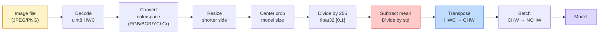
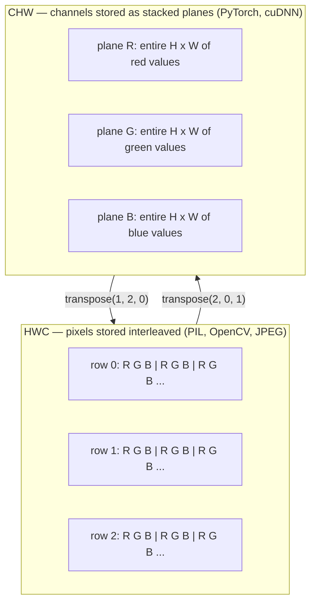

# 图像基础  Pixel、Channel、Espace de couleur

> L'image est une forme de tension. Chaque modèle de vision que vous utiliserez plus tard, commence par ce fait.

**类型：**Construire
**语言：**Python
**前置要求：**Phase 1 Leçon 12 (opérations de tenseur), phase 3 Leçon 11 (introduction à pyTorch)
**时间：**Il est 45 minutes.

## Objectif de l'apprentissage

- Expliquer comment les scènes continuelles sont dispersées en pixels, ainsi que pourquoi les décisions de prélèvement et de quantification déterminent les limites supérieures de chaque modèle de sous-scenes
- Prendre l'image en tant qu'array NumPy 读取、切片和检查, et apprendre à changer entre la mise en page HWC et la mise en page CHW
- Dans le cadre de la transition entre RGB, l'échelle de gris, HSV et YCbCr, expliquez les raisons de l'existence de chaque espace de couleurs.
- 严格按照火vision的预期应用 Pixel 级预处理(normalize、standardize、size、channel-first)

##  problématique

Vous allez lire chaque article de l'article, télécharger chaque poids prétrainé, modifier chaque API de vision, vous devrez supposer que l'entrée a un codage spécifique.`uint8`                                                                                                                                                                                                                                                                                                                                                                                                                                                                                                                             `float32`Le modèle, il fonctionnera toujours, et il produira des résultats sans signification. Donner à BGR  le réseau entraîné en RGB, la précision diminuera de dix pour cent points. Lorsque le modèle attend les canaux-premiers, et que vous lui donnez les canaux-derniers entrés, la première couche de convection considérera la hauteur comme le canal fonctionnel.

Une fois que vous savez que la convulsion se déplace sur quoi, elle ne se complique pas en elle-même. Le problème est que,  un image sur la caméra, JPEG décodeur, PIL, OpenCV, torchvision et CUDA noyau pour avoir des significations différentes.

Cette classe va corriger cette base, pour que le contenu de la phase suivante puisse être construit sur elle. Finalement, vous saurez ce qu'est un pixel, pourquoi chaque pixel a trois chiffres et non un, normalizer avec les statistiques d'ImageNet  ce que l'on fait réellement, ainsi que comment se déplacer entre les deux ou trois types de mise en page utilisés par défaut dans la phase suivante.

## 概念

### 完整预处理 pipeline 一览

Chaque système de vision de production est le même processus de transformation inverse.



Les deux boîtes rouge et bleu sont les endroits où 80% de la silence a échoué: manque de normalisation, ainsi que la mise en page  err errements.

### Le pixel est un échantillon, pas un carré

Le capteur de caméra se trouve dans un petit détecteur de photons sur le net. Chaque détecteur produit une tension proportionnelle à la quantité de photons qui l'attrapent.

```
Continuous scene                 Sensor grid                     Digital image
(infinite detail)                (H x W detectors)               (H x W integers)

    ~~~~~                        +--+--+--+--+--+                 210 198 180 155 120
   Je suis un homme qui a une grande expérience.
  - L'équipe de la police de la ville de New York
   ~~~~~                         |  |  |  |  |  |                 195 185 170 148 112
                                 +--+--+--+--+--+                 188 180 165 145 108
```

Cette étape se déroule en deux sélections, qui déterminent les limites maximales de toutes les missions suivantes:

- **Spatial sampling**Il est également possible de décider de la quantité de détecteurs à chaque fois dans le cadre de la scène.
- **Intensity quantization**Déterminer la tension est divisé en 8 bits  fournir 256 niveaux, est l'affichage de normes 10、12、16 bits  fournir un gradient plus étroit, pour l'imagerie médicale、HDR et le capteur brut pipeline  très important 

Le pixel n'est pas un petit bloc de couleur de surface. C'est une mesure unique.

### Pourquoi il y a trois canaux ?

Un détecteur 会统计整个可见光谱范围内的光子,那就是灰度. Pour obtenir la couleur, le capteur 会使用红、绿、蓝过 mozaic 覆盖网格──经过 демосаизация 经过测试后, chaque emplacement spatial 已有三个整数:

```
One pixel in memory:

    (R, G, B) = (210, 140, 30)   <- reddish-orange

An H x W RGB image:

    shape (H, W, 3)     stored as   H rows of W pixels of 3 values
                                    each in [0, 255] for uint8
```

La caméra de profondeur ajoutera un canal Z, la caméra de satellite ajoutera un canal infrarouge et une bande ultraviolette, la numérisation médicale a généralement un canal, la radiographie, la radiographie ou bien beaucoup de canaux, la quantité de canaux est le dernier axe, la couche de convection, la formation à travers le canal.

### 两种布局公约:HWC 和 CHW

Avec un tensor, deux séries. Chacun choisit une.

```
HWC (height, width, channels)           CHW (channels, height, width)

   W ->                                    H ->
  +-----+-----+-----+                     +-----+-----+
H |R G B|R G B|R G B|                   C |R R R R R R|
| +-----+-----+-----+                   | +-----+-----+
v |R G B|R G B|R G B|                   v |G G G G G G|
  +-----+-----+-----+                     +-----+-----+
                                          |B B B B B B|
                                          +-----+-----+

   PIL, OpenCV, matplotlib,              PyTorch, most deep learning
   almost every image file on disk       frameworks, cuDNN kernels
```

La raison de l'existence de CHW est que le noyau de convection était placé en face de l'axe du canal, ce qui signifie que chaque noyau pouvait voir chaque canal en 2D, afin de nettoyer le format vectoriel.

Tu sais, tu sais, tu sais, tu sais, tu sais, tu sais, tu sais, tu sais, tu sais, tu sais, tu sais, tu sais, tu sais, tu sais, tu sais, tu sais, tu sais, tu sais, tu sais, tu sais, tu sais, tu sais, tu sais, tu sais, tu sais, tu sais, tu sais, tu sais, tu sais, tu sais, tu sais, tu sais, tu sais, tu sais, tu sais, tu sais, tu sais, tu sais, tu sais, tu sais, tu sais, tu sais, tu sais, tu sais, tu sais, tu sais, tu sais, tu sais, tu sais, tu sais, tu sais, tu sais, tu sais, tu sais, tu sais, tu sais, tu sais, tu sais, tu sais, tu sais, tu es, tu es, tu sais, tu sais, tu es, tu sais, tu sais, tu es, tu sais, tu es, tu es, tu sais, tu es, tu es, tu sais, tu es, tu es, tu es, tu es, tu sais, tu es, tu es, tu es, tu es, tu es, tu es, tu es, tu es, tu es, tu es, tu es, tu es, tu es, tu es, tu es, tu es, tu es, tu es, tu es, tu es, tu es, tu es, tu es, tu es, tu es, tu es, tu es, tu es, tu es, tu es, tu es, tu es, tu es, tu es, tu es, tu es, tu es, tu es, tu es, tu es, tu es, tu es, tu es, tu es, tu es, tu es, tu es, tu es, tu es, tu es, tu es

```
img_chw = img_hwc.transpose(2, 0, 1)      # NumPy
img_chw = img_hwc.permute(2, 0, 1)        # PyTorch tensor
```

L'état de la mémoire 可视化:



### Range de octets et type d

3 conventions Les conventions les plus courantes

| Convention | dtype | Range | 你会在哪里见到它 |
|------------|-------|-------|------------------|
| Raw | `uint8` | [0, 255] | Disk 上的文件、PIL、OpenCV output |
| Normalized | `float32` | [0.0, 1.0] | `img.astype('float32') / 255` 之后 |
| Standardized | `float32` | 大约 [-2, +2] | 减去 mean 并除以 std 之后 |

Le réseau convolutif est dans les entrées standardisées.`mean=[0.485, 0.456, 0.406]`- Je suis là.`std=[0.229, 0.224, 0.225]`est dans l'ensemble complet de formation ImageNet 上, pour [0, 1] normalisé Pixel 计算得到的三个频道的算法平均 和标准偏差──把原`uint8`输入给期望标准化浮游的模型,是应用视觉中最常见的静默失败──

### Les espaces de couleur et pourquoi ils existent

RGB est un format de capture, mais ce n'est pas toujours le plus utile pour le modèle.

```
 RGB               HSV                       YCbCr / YUV

 R red             H hue (angle 0-360)       Y luminance (brightness)
 G green           S saturation (0-1)        Cb chroma blue-yellow
 B blue            V value/brightness (0-1)  Cr chroma red-green

 Linear to         Separates color from      Separates brightness from
 sensor output     brightness. Useful for    color. JPEG and most video
                   color thresholding, UI    codecs compress the chroma
                   sliders, simple filters   channels harder because the
                                             human eye is less sensitive
                                             to chroma detail than to Y.
```

Pour la plupart des CNN modernes, vous allez entrer dans le RGB.

- **HSV** code de CV classique  segmentation basée sur la couleur  équilibre blanc 
- **YCbCr** 读取 JPEG 内部、视频管道、只在Y上操作的超分辨率模型──
- **Grayscale** Le modèle de document OCR, ainsi que toute couleur, est une variable de nuisance et non une situation de signal.

De l'échelle RGB 转灰是加权和, non pas la moyenne, car l'œil humain est plus sensible au vert que au rouge ou au bleu:

```
Y = 0.299 R + 0.587 G + 0.114 B       (ITU-R BT.601, the classic weights)
```

### Ratio d'aspect, taille et interpolation

Chaque modèle a une taille d'entrée fixe. La plupart des classifiants de ImageNet sont 224x224, le détecteur moderne 常用 384x384或 512x512)

- **Resize shorter side, then center crop** 标准 ImageNet recette。 conserver le rapport d'aspect, abandonner un bord de pixel。
- **Resize and pad** Réservation du rapport d'aspect et de chaque pixel, ajouter un côté noir.
- **Resize directly to target** 拉伸图像──便宜, va tordre la géométrie, mais pour de nombreuses tâches de classification 足够好──

Lorsque le nouveau réseau ne correspond pas au vieux réseau, la méthode d'interpolation décide comment calculer le pixel intermédiaire:

```
Nearest neighbour     fastest, blocky, only choice for masks/labels
Bilinear              fast, smooth, default for most image resizing
Bicubic               slower, sharper on upscaling
Lanczos               slowest, best quality, used for final display
```

经验法则:training avec bilinéaire, vous verrez de près des actifs avec bicube ou lanczos, tout contenant un nombre complet d'identifiants de classe avec le plus proche.


```figure
conv-output-size
```

## - Je le construis.

### 步骤 1: Charger l'image et vérifier la forme

Utilisez le coussin, chargez JPEG ou PNG, convertissez en NumPy, et imprimez le contenu que vous obtenez.

```python
import numpy as np
from PIL import Image

def synthetic_rgb(h=128, w=192, seed=0):
    rng = np.random.default_rng(seed)
    yy, xx = np.meshgrid(np.linspace(0, 1, h), np.linspace(0, 1, w), indexing="ij")
    r = (np.sin(xx * 6) * 0.5 + 0.5) * 255
    g = yy * 255
    b = (1 - yy) * xx * 255
    rgb = np.stack([r, g, b], axis=-1) + rng.normal(0, 6, (h, w, 3))
    return np.clip(rgb, 0, 255).astype(np.uint8)

arr = synthetic_rgb()
# 或从 disk 加载：
# arr = np.asarray(Image.open("your_image.jpg").convert("RGB"))

print(f"type:   {type(arr).__name__}")
print(f"dtype:  {arr.dtype}")
print(f"shape:  {arr.shape}     # (H, W, C)")
print(f"min:    {arr.min()}")
print(f"max:    {arr.max()}")
print(f"pixel at (0, 0): {arr[0, 0]}")
```

预期 de sortie:`shape: (H, W, 3)`- Je suis là.`dtype: uint8`La gamme`[0, 255]`❖ Qu'il s'agisse d'un octet de la caméra ❖ JPEG décodeur ou générateur synthétique, c'est une représentation canonique sur disque ❖

### 步骤 2: décomposer le canal et redéfinir la mise en page

R、G、B, puis de la HWC 转换为 PyTorch utilisant le CHW

```python
R = arr[:, :, 0]
G = arr[:, :, 1]
B = arr[:, :, 2]
print(f"R shape: {R.shape}, mean: {R.mean():.1f}")
print(f"G shape: {G.shape}, mean: {G.mean():.1f}")
print(f"B shape: {B.shape}, mean: {B.mean():.1f}")

arr_chw = arr.transpose(2, 0, 1)
print(f"\nHWC shape: {arr.shape}")
print(f"CHW shape: {arr_chw.shape}")
```

Trois plans à l'échelle de la grise, chaque canal un. CHW 只是 un axe de répartition; lorsque la mise en page de la mémoire est autorisée, strictement, pas besoin de copie de données.

### 步骤 3:Conversion de la grise et du HSV

Ajouter des écarts de gris, puis passer RGB à HSV.

```python
def rgb_to_grayscale(rgb):
    weights = np.array([0.299, 0.587, 0.114], dtype=np.float32)
    return (rgb.astype(np.float32) @ weights).astype(np.uint8)

def rgb_to_hsv(rgb):
    rgb_f = rgb.astype(np.float32) / 255.0
    r, g, b = rgb_f[..., 0], rgb_f[..., 1], rgb_f[..., 2]
    cmax = np.max(rgb_f, axis=-1)
    cmin = np.min(rgb_f, axis=-1)
    delta = cmax - cmin

    h = np.zeros_like(cmax)
    mask = delta > 0
    rmax = mask & (cmax == r)
    gmax = mask & (cmax == g)
    bmax = mask & (cmax == b)
    h[rmax] = ((g[rmax] - b[rmax]) / delta[rmax]) % 6
    h[gmax] = ((b[gmax] - r[gmax]) / delta[gmax]) + 2
    h[bmax] = ((r[bmax] - g[bmax]) / delta[bmax]) + 4
    h = h * 60.0

    s = np.where(cmax > 0, delta / cmax, 0)
    v = cmax
    return np.stack([h, s, v], axis=-1)

gray = rgb_to_grayscale(arr)
hsv = rgb_to_hsv(arr)
print(f"gray shape: {gray.shape}, range: [{gray.min()}, {gray.max()}]")
print(f"hsv   shape: {hsv.shape}")
print(f"hue range: [{hsv[..., 0].min():.1f}, {hsv[..., 0].max():.1f}] degrees")
print(f"sat range: [{hsv[..., 1].min():.2f}, {hsv[..., 1].max():.2f}]")
print(f"val range: [{hsv[..., 2].min():.2f}, {hsv[..., 2].max():.2f}]")
```

L'unité de sortie de Hue est le degré, la saturation 和 la valeur dans [0, 1]`hsv_full`Conférence 匹配

### 步骤 4: normaliser, normaliser et rétablir

De byte brut 转到预训练的 ImageNet modèle 期望的精确 Tensor, puis de nouveau revenir à la suite

```python
mean = np.array([0.485, 0.456, 0.406], dtype=np.float32)
std = np.array([0.229, 0.224, 0.225], dtype=np.float32)

def preprocess_imagenet(rgb_uint8):
    x = rgb_uint8.astype(np.float32) / 255.0
    x = (x - mean) / std
    x = x.transpose(2, 0, 1)
    return x

def deprocess_imagenet(chw_float32):
    x = chw_float32.transpose(1, 2, 0)
    x = x * std + mean
    x = np.clip(x * 255.0, 0, 255).astype(np.uint8)
    return x

x = preprocess_imagenet(arr)
print(f"preprocessed shape: {x.shape}     # (C, H, W)")
print(f"preprocessed dtype: {x.dtype}")
print(f"preprocessed mean per channel:  {x.mean(axis=(1, 2)).round(3)}")
print(f"preprocessed std  per channel:  {x.std(axis=(1, 2)).round(3)}")

roundtrip = deprocess_imagenet(x)
max_diff = np.abs(roundtrip.astype(int) - arr.astype(int)).max()
print(f"roundtrip max pixel diff: {max_diff}    # 应该是 0 或 1")
```

La moyenne par canal 应接近0,std 接近1── cette paire de pré-processus/déprocessus 正是每个火vision `transforms.Normalize`Appelez les choses à faire au fond.

### 步骤 5: redimensionner avec trois méthodes d'interpolation

Dans la plus haute échelle, la différence est plus évidente.

```python
target = (arr.shape[0] * 3, arr.shape[1] * 3)

nearest = np.asarray(Image.fromarray(arr).resize(target[::-1], Image.NEAREST))
bilinear = np.asarray(Image.fromarray(arr).resize(target[::-1], Image.BILINEAR))
bicubic = np.asarray(Image.fromarray(arr).resize(target[::-1], Image.BICUBIC))

def local_roughness(x):
    gy = np.diff(x.astype(float), axis=0)
    gx = np.diff(x.astype(float), axis=1)
    return float(np.abs(gy).mean() + np.abs(gx).mean())

for name, out in [("nearest", nearest), ("bilinear", bilinear), ("bicubic", bicubic)]:
    print(f"{name:>8}  shape={out.shape}  roughness={local_roughness(out):6.2f}")
```

La rugosité la plus proche est la plus élevée, car elle conserve une rigidité.

## Utilisez-le

`torchvision.transforms`Je vais mettre tout ce qui est ci-dessus en un pipeline composable.`preprocess_imagenet`Faites des choses,并额外加入 resize 和 crop。

```python
import torch
from torchvision import transforms
from PIL import Image

img = Image.fromarray(synthetic_rgb(256, 256))

pipeline = transforms.Compose([
    transforms.Resize(256),
    transforms.CenterCrop(224),
    transforms.ToTensor(),
    transforms.Normalize(mean=[0.485, 0.456, 0.406], std=[0.229, 0.224, 0.225]),
])

x = pipeline(img)
print(f"tensor type:  {type(x).__name__}")
print(f"tensor dtype: {x.dtype}")
print(f"tensor shape: {tuple(x.shape)}      # (C, H, W)")
print(f"per-channel mean: {x.mean(dim=(1, 2)).tolist()}")
print(f"per-channel std:  {x.std(dim=(1, 2)).tolist()}")

batch = x.unsqueeze(0)
print(f"\nbatched shape: {tuple(batch.shape)}   # (N, C, H, W) — ready for a model")
```

Quatre étapes, le processus doit être tel:`Resize(256)`Rendre le côté plus court  réduit à 256;`CenterCrop(224)`Prenez une plaquette de 224x224.`ToTensor()`À partir de 255 et en remplaçant la HWC par la CHW;`Normalize`减去ImageNet signifie并除以 std──颠倒这个顺序会改变到达模型的内容──

## Je le livre.

Le cours est ouvert à:

- `outputs/prompt-vision-preprocessing-audit.md` Une carte de modèle ou de jeu de données peut être transférée en une liste, la liste des équipes doit être respectée par l'invariable de pré-traitement précis.
- `outputs/skill-image-tensor-inspector.md` Une compétence, donné à un Tensor ou un tableau en forme d'image, rapport dtype, mise en page, gamme, ainsi qu'il semble être brut, normalisé ou standardisé.

## 练习

1. **(Easy)**分別使用 OpenCV (`cv2.imread`) 和 Coussin 加载一张 JPEG──打印`(0, 0)`处的Pixel── Expliquer la différence d'ordre de canal, puis écrire une ligne de transfert, faire l'array OpenCV avec l'array Pillow 完全一致──
2. **(Medium)**编写 `standardize(img, mean, std)` et inversement, faire faire le second être dans l'image de l'image`roundtrip_max_diff <= 1`测试── Votre fonction doit être capable d'utiliser le même appel simultanément pour traiter les images de HWC et les lots de NCHW──
3. **(Hard)**Prenez un Tensor normalisé à 3 canaux ImageNet, laissez-le passer par un 1x1 con, ce con, apprenez à RGB à un seul canal grise de la combinaison de puissance.`[0.299, 0.587, 0.114]`,结结它们,并验证输出与你的手动 `rgb_to_grayscale`Dans le cadre d'une erreur de point flottant, quelle transformation classique de l'espace couleur peut être écrite en convection 1x1 ?

## 关键术语

| Term | 人们的说法 | 它实际的意思 |
|------|----------------|----------------------|
| Pixel | “一个彩色方块” | 一个 grid location 上的一次光强采样；color 用三个数字，grayscale 用一个数字 |
| Channel | “颜色” | 堆叠成 image Tensor 的并行 spatial grid 之一；在 HWC 中是最后一个 axis，在 CHW 中是第一个 |
| HWC / CHW | “shape” | image Tensor 的 axis ordering；disk 和 PIL 使用 HWC，PyTorch 和 cuDNN 使用 CHW |
| Normalize | “缩放图像” | 除以 255，让 Pixel 落在 [0, 1] 中；这是必要的，但还不充分 |
| Standardize | “零中心化” | 按 channel 减去 mean 并除以 std，使 input distribution 匹配模型训练时看到的分布 |
| Grayscale conversion | “对 channel 求平均” | 使用系数 0.299/0.587/0.114 的加权和，匹配人类 luminance perception |
| Interpolation | “resize 如何选 Pixel” | 当新 grid 与旧 grid 不对齐时决定 output value 的规则；label 用 nearest，training 用 bilinear，display 用 bicubic |
| Aspect ratio | “宽高比” | 区分“resize and pad”和“resize and stretch”的 ratio |

## 延伸阅读

- [Charles Poynton — A Guided Tour of Color Space](https://poynton.ca/PDFs/Guided_tour.pdf)                                                                                                                                                                                                                                                                                                                                                                                                                                                                                                                            
- [PyTorch Vision Transforms Docs](https://pytorch.org/vision/stable/transforms.html) Vous êtes en production de la réalisation de composer des transformations complètes du pipeline
- [How JPEG Works (Colt McAnlis)](https://www.youtube.com/watch?v=F1kYBnY6mwg) Pour le sous-échantillonnage de chrome, la DCT et pourquoi JPEG code YCbCr plutôt que RGB
- [ImageNet Preprocessing Conventions (torchvision models)](https://pytorch.org/vision/stable/models.html) `mean=[0.485, 0.456, 0.406]`La source de l'autorité, ainsi que le modèle de zoo dans chaque modèle pourquoi tout le monde l'attend
