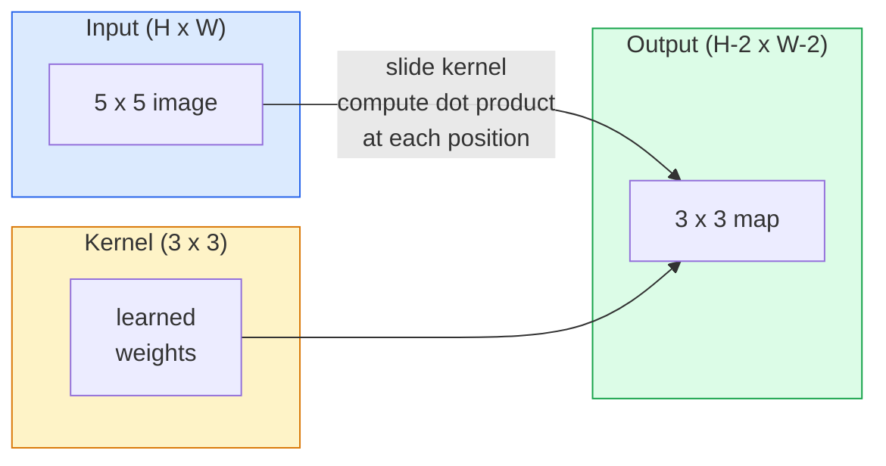
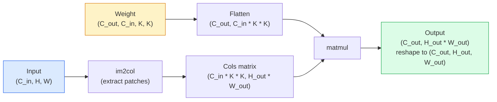

# Les conversions à partir de zéro

> La convulsion est une très petite couche dense, tu la glisses sur une image et partage le même poids à chaque position.

**Type:** Build
**Languages:** Python
**Prerequisites:** Phase 3 (Deep Learning Core), Phase 4 Lesson 01 (Image Fundamentals)
**Time:** ~75 分钟

## Objectif de l'apprentissage
- Il suffit d'utiliser NumPy de zéro pour réaliser une convolutions 2D, y compris en boucle nichée  version et vectorisée `im2col` version
- 针对输入尺寸, kernel size, padding 和 step's arbitrary组合,计算输出空间尺寸,并解释 `(H - K + 2P) / S + 1`公式为什么成立
- Les noyaux de conception de l'écran sont très clairs, et expliquent chaque activation de la fonction.
- Rassembler les convolutions en un extracteur de caractéristiques, et connecter la profondeur de la compilation avec la taille du champ réceptif

##  problématique
Dans une image RGB 224x224 utilisant une couche entièrement connectée, chaque neurone a besoin de 224 * 224 * 3 = 150,528 poids d'entrée. Une couche cachée de seulement 1000 unités a déjà 1,5 milliard de paramètres, et c'est avant que vous appreniez quelque chose d'utile. Pire encore, cette couche ne sait pas si un chien du coin supérieur gauche et un chien du coin inférieur droit sont de la même manière. Elle considère chaque position de l'image comme un objet indépendant de l'autre, mais c'est en fait une erreur: déplacer un chat de trois images, ne devrait pas forcer le réseau à recommencer à apprendre ce concept.

L'image modèle nécessite deux qualités:**translation equivariance**(entrée mobile) et **parameter sharing**(Le même détecteur de fonctionnement dans toutes les positions)

La conversion n'a pas été inventée pour le Deep Learning. Elle est également la compression JPEG, la détection de bord Gaussian blur dans Photoshop, ainsi que la même opération derrière presque tous les filtres audio. Les CNN ont dominé ImageNet de 2012 à 2020. La raison en est que la conversion est une méthode adaptée à ce type de données.

## 概念
### Un noyau, glissant

La convulsion 2D prend une petite matrice de poids appelée noyau, la transpose et en calcule chaque élément à chaque position.



Un exemple concret de 3x3 , pour 5x5 ((( sans rembourrage, étape 1):

```
Input X (5 x 5):                Kernel W (3 x 3):

  1  2  0  1  2                   1  0 -1
  0  1  3  1  0                   2  0 -2
  2  1  0  2  1                   1  0 -1
  1  0  2  1  3
  2  1  1  0  1

The kernel slides across every valid 3 x 3 window. Output Y is 3 x 3:

 Y[0,0] = sum( W * X[0:3, 0:3] )
 Y[0,1] = sum( W * X[0:3, 1:4] )
 Y[0,2] = sum( W * X[0:3, 2:5] )
 Y[1,0] = sum( W * X[1:4, 0:3] )
 ... and so on
```

Ceci est une formule, c'est ça.**shared weights、locality、sliding window**Tout le reste est de la comptabilité.

### Formule de taille de sortie

给定输入空间尺寸 `H`Taille du noyau`K`- Le rembourrage`P`- Je suis en train de marcher.`S`- Le numéro de la liste:

```
H_out = floor( (H - K + 2P) / S ) + 1
```

Tu le calculeras dans chaque architecture.

| Scenario | H | K | P | S | H_out |
|----------|---|---|---|---|-------|
| Valid conv，无 padding | 32 | 3 | 0 | 1 | 30 |
| Same conv（保持尺寸） | 32 | 3 | 1 | 1 | 32 |
| 按 2 倍 downsample | 32 | 3 | 1 | 2 | 16 |
| Pool 2x2 | 32 | 2 | 0 | 2 | 16 |
| 大 receptive field | 32 | 7 | 3 | 2 | 16 |

"Same padding" signifie sélectionner P, de sorte que lorsque S == 1 时 H_out == H。 pour le nombre de nombres étranges K, y'a P = (K - 1) / 2。 c'est pourquoi les noyaux 3x3 occupent la position dominante: ils sont toujours possédant le noyau de nombres étranges le plus petit au centre de leur point。

### Padding

 sans rembourrage , chaque convection réduira la carte de fonctionnement                                                                                                                                                                                                                                                     

```
Zero padding (P = 1) on a 5 x 5 input:

  0  0  0  0  0  0  0
  0  1  2  0  1  2  0
  0  0  1  3  1  0  0
  0  2  1  0  2  1  0       Now the kernel can centre on pixel
  0  1  0  2  1  3  0       (0, 0) and still have three rows and
  0  2  1  1  0  1  0       three columns of values to multiply.
  0  0  0  0  0  0  0
```

实践中会遇到的模式:`zero`Je suis là.`reflect`(à l'image du bord, dans les modèles génératifs éviter les limites)`replicate`(réplique le bord)`circular`(environ, dans les problèmes toroïdaux 中使用)

### Passe à pas

La marche est un pas mouvementé.`stride=1`C'est une valeur de référence.`stride=2`La taille de l'espace sera réduite de moitié, en utilisant une couche de pooling unique à l'intérieur de CNN, mais en effectuant des échantillons de bas de la méthode classique.

```
Stride 1 on a 5 x 5 input, 3 x 3 kernel:

  starts: (0,0) (0,1) (0,2)        -> output row 0
          (1,0) (1,1) (1,2)        -> output row 1
          (2,0) (2,1) (2,2)        -> output row 2

  Output: 3 x 3

Stride 2 on the same input:

  starts: (0,0) (0,2)              -> output row 0
          (2,0) (2,2)              -> output row 1

  Output: 2 x 2
```

### Chaque entrée est effectuée par un canal de communication.

En réalité, chaque image a trois canaux. Dans chaque position spatiale, vous allez multiplier et obtenir les trois morceaux, et vous y ajouterez un biais.

```
Input:   (C_in,  H,  W)        3 x 5 x 5
Kernel:  (C_in,  K,  K)        3 x 3 x 3 (one kernel)
Output:  (1,     H', W')       2D map

For a layer that produces C_out output channels, you stack C_out kernels:

Weight:  (C_out, C_in, K, K)   e.g. 64 x 3 x 3 x 3
Output:  (C_out, H', W')       64 x 3 x 3

Parameter count: C_out * C_in * K * K + C_out   (the + C_out is biases)
```

Le dernier est le contenu du modèle de planification.`64 * 3 * 3 * 3 + 64 = 1,792`C'est très bon.

### Le truc de l'im2col

Les boucles nichées  facile à lire, mais très lentement. Les GPU  veulent des multiples de matrice de grande taille.



Chaque convection de production est réalisée par cette méthode, avec un certain type de cache-tiling technique.

### champ récepteur

单个3x3 conv 会查看9 输入像素──堆叠两个3x3 conv, un neurone dans la deuxième couche 会查看5x5 输入像素──三个3x3 conv 给出7x7──一般来说:

```
RF after L stacked K x K convs (stride 1) = 1 + L * (K - 1)

With strides:   RF grows multiplicatively with stride along each layer.
```

La raison fondamentale de "一路 3x3" 能够有效 (VGG、ResNet、ConvNeXt) est que deux conv ̇s 3x3 看到的输入区域与一个5x5 conv 类似,但参数较少,而且中间多一个非线性──


```figure
convolution-kernel
```

## - Je le construis.
### 步骤 1: Pâte un tableau

From the smallest primitive 开始: une fonction dans l'ordre H x W  autour de complément zéro ⋅

```python
import numpy as np

def pad2d(x, p):
    if p == 0:
        return x
    h, w = x.shape[-2:]
    out = np.zeros(x.shape[:-2] + (h + 2 * p, w + 2 * p), dtype=x.dtype)
    out[..., p:p + h, p:p + w] = x
    return out

x = np.arange(9).reshape(3, 3)
print(x)
print()
print(pad2d(x, 1))
```

Les axes de traîneau 技巧 `x.shape[:-2]`En d'autres termes, la même fonction peut être modifiée sans modification.`(H, W)`- Je suis là.`(C, H, W)`Ou `(N, C, H, W)`Il y a une autre.

### Étape 2: Utiliser un cycle de mise en œuvre de la convulsion 2D

参考实现: lent, mais毫不含糊.`torch.nn.functional.conv2d`Faire quelque chose.

```python
def conv2d_naive(x, w, b=None, stride=1, padding=0):
    c_in, h, w_in = x.shape
    c_out, c_in_w, kh, kw = w.shape
    assert c_in == c_in_w

    x_pad = pad2d(x, padding)
    h_out = (h + 2 * padding - kh) // stride + 1
    w_out = (w_in + 2 * padding - kw) // stride + 1

    out = np.zeros((c_out, h_out, w_out), dtype=np.float32)
    for oc in range(c_out):
        for i in range(h_out):
            for j in range(w_out):
                hs = i * stride
                ws = j * stride
                patch = x_pad[:, hs:hs + kh, ws:ws + kw]
                out[oc, i, j] = np.sum(patch * w[oc])
        if b is not None:
            out[oc] += b[oc]
    return out
```

Les quatre boucles encastrées (en anglais) sont les canaux de sortie, les rangées, les colonnes, les réactions à la demande de C_in、kh、kw.

### Étape 3: vérification du noyau de conception manuelle

Construire un noyau vertical de Sobel, l'appliquer à une image de phase synthétique, puis observer le bord vertical été illuminé.

```python
def synthetic_step_image():
    img = np.zeros((1, 16, 16), dtype=np.float32)
    img[:, :, 8:] = 1.0
    return img

sobel_x = np.array([
    [[-1, 0, 1],
     [-2, 0, 2],
     [-1, 0, 1]]
], dtype=np.float32)[None]

x = synthetic_step_image()
y = conv2d_naive(x, sobel_x, padding=1)
print(y[0].round(1))
```

预期在第7 列出现较大的正值 (((从左到右亮度增加),其他位置为零──这个印就是你确认数学正确的智能检查──

### 步骤 4: im2col

Pour chaque fenêtre de taille de noyau, la matrice est transformée en une colonne.`C_in=3, K=3`, chaque rangée est de 27 chiffres.

```python
def im2col(x, kh, kw, stride=1, padding=0):
    c_in, h, w = x.shape
    x_pad = pad2d(x, padding)
    h_out = (h + 2 * padding - kh) // stride + 1
    w_out = (w + 2 * padding - kw) // stride + 1

    cols = np.zeros((c_in * kh * kw, h_out * w_out), dtype=x.dtype)
    col = 0
    for i in range(h_out):
        for j in range(w_out):
            hs = i * stride
            ws = j * stride
            patch = x_pad[:, hs:hs + kh, ws:ws + kw]
            cols[:, col] = patch.reshape(-1)
            col += 1
    return cols, h_out, w_out
```

Il reste une boucle Python, mais maintenant le calcul lourd se transforme en une matmul vectoriée.

### 步骤 5: par le biais de l' im2col + matmul 实现快速 conv

Utilisez une fois la multiplication de la matrice pour remplacer la boucle quadruple.

```python
def conv2d_im2col(x, w, b=None, stride=1, padding=0):
    c_out, c_in, kh, kw = w.shape
    cols, h_out, w_out = im2col(x, kh, kw, stride, padding)
    w_flat = w.reshape(c_out, -1)
    out = w_flat @ cols
    if b is not None:
        out += b[:, None]
    return out.reshape(c_out, h_out, w_out)
```

L'accès à l'information est possible en fonction des deux éléments.

```python
rng = np.random.default_rng(0)
x = rng.normal(0, 1, (3, 16, 16)).astype(np.float32)
w = rng.normal(0, 1, (8, 3, 3, 3)).astype(np.float32)
b = rng.normal(0, 1, (8,)).astype(np.float32)

y_naive = conv2d_naive(x, w, b, padding=1)
y_im2col = conv2d_im2col(x, w, b, padding=1)

print(f"max abs diff: {np.max(np.abs(y_naive - y_im2col)):.2e}")
```

`max abs diff`Il faut que tu le fasses .`1e-5`左右── Cette différence provient du point flottant 累加顺序, pas du bug──

### 步骤 6: Un groupe de noyaux de conception manuelle

5 filtres, une seule couche de convection avant tout entraînement.

```python
KERNELS = {
    "identity": np.array([[0, 0, 0], [0, 1, 0], [0, 0, 0]], dtype=np.float32),
    "blur_3x3": np.ones((3, 3), dtype=np.float32) / 9.0,
    "sharpen": np.array([[0, -1, 0], [-1, 5, -1], [0, -1, 0]], dtype=np.float32),
    "sobel_x": np.array([[-1, 0, 1], [-2, 0, 2], [-1, 0, 1]], dtype=np.float32),
    "sobel_y": np.array([[-1, -2, -1], [0, 0, 0], [1, 2, 1]], dtype=np.float32),
}

def apply_kernel(img2d, kernel):
    x = img2d[None].astype(np.float32)
    w = kernel[None, None]
    return conv2d_im2col(x, w, padding=1)[0]
```

 appliqué à l'image grise à l'échelle de l'image; 上时,blur 会柔化,sharpen 会让边缘更清晰,Sobel-x 会点亮垂直边缘,Sobel-y 会点亮水平边缘──这些正是AlexNet 和 VGG中第一个训练出的 conv layer 最终学到的模式,因为优秀的图像模型无论后续任务是什么,都需要边缘和斑探测器──

## Utilisez-le
PyTorch de `nn.Conv2d`Utilisez les noyaux de code automatique et l'optimisation de code numérique.

```python
import torch
import torch.nn as nn

conv = nn.Conv2d(in_channels=3, out_channels=64, kernel_size=3, stride=1, padding=1)
print(conv)
print(f"weight shape: {tuple(conv.weight.shape)}   # (C_out, C_in, K, K)")
print(f"bias shape:   {tuple(conv.bias.shape)}")
print(f"param count:  {sum(p.numel() for p in conv.parameters())}")

x = torch.randn(8, 3, 224, 224)
y = conv(x)
print(f"\ninput  shape: {tuple(x.shape)}")
print(f"output shape: {tuple(y.shape)}")
```

Je ne sais pas .`padding=1`- Je suis là !`padding=0`Je suis en train de faire une petite rencontre.`stride=1`- Je suis là !`stride=2`C'est la même formule que vous avez mentionnée.

## Je le livre.
Le cours est ouvert à:

- `outputs/prompt-cnn-architect.md`Un prompt, donné la taille de l'entrée, le budget paramètre et le champ réceptif objectif,`Conv2d`couches et utilisez chaque étape correctement K/S/P
- `outputs/skill-conv-shape-calculator.md`Une compétence, étape par étape, par le réseau spécifique, et retourner à la forme de sortie de chaque bloc, champ réceptif et nombre de paramètres.

## 练习
1. **(Easy)**给定一个 128x128 grayscale 输入, ainsi qu'un groupe `[Conv3x3(s=1,p=1), Conv3x3(s=2,p=1), Conv3x3(s=1,p=1), Conv3x3(s=2,p=1)]`, calculer manuellement la taille de l'espace de sortie et le champ réceptif de chaque couche avec un pyTorch composé de convecteurs de poupée`nn.Sequential` effectuer une vérification.
2. **(Medium)**扩展 `conv2d_naive`et `conv2d_im2col`, laissez-les accepter `groups`参数―― preuve `groups=C_in=C_out`Il peut être reconstitué en convolutions de profondeur, et son nombre de paramètres est `C * K * K`, au lieu de `C * C * K * K`Il y a une autre.
3. **(Hard)**réalisation`conv2d_im2col`De l'arrière passe: given determined output Gradient, calculé `x`et `w`de la même entrée et de la même charge`torch.autograd.grad`Le facteur de référence de l'im2col est:`col2im`Il faut aussi la mettre sur la fenêtre.

## 关键术语
| Term | What people say | What it actually means |
|------|----------------|----------------------|
| Convolution | “滑动一个 filter” | 一个在每个空间位置用 shared weights 应用的可学习 dot product；数学上是 cross-correlation，但大家都叫它 convolution |
| Kernel / filter | “feature detector” | 一个形状为 (C_in, K, K) 的小型 weight tensor，它与输入窗口的 dot product 会产生一个输出像素 |
| Stride | “每次跳多远” | 连续 kernel placements 之间的步长；stride 2 会让每个空间维度减半 |
| Padding | “边缘上的零” | 在输入周围添加的额外值，使 kernel 可以以边界像素为中心；`same` padding 会让输出尺寸等于输入尺寸 |
| Receptive field | “neuron 能看到多少” | 某个输出 activation 所依赖的原始输入 patch，会随着深度和 stride 增长 |
| im2col | “GEMM trick” | 把每个 receptive window 重排成列，让 convolution 变成一次大型 matrix multiply，这是每个快速 conv kernel 的核心 |
| Depthwise conv | “每个 channel 一个 kernel” | 一个满足 `groups == C_in` 的 conv，每个输出 channel 只由匹配的输入 channel 计算得到；是 MobileNet 和 ConvNeXt 的 backbone |
| Translation equivariance | “输入平移，输出平移” | 输入平移 k 个像素时，输出也平移 k 个像素的性质；shared weights 天然带来这个性质 |

## 延伸阅读
- [A guide to convolution arithmetic for deep learning (Dumoulin & Visin, 2016)](https://arxiv.org/abs/1603.07285) Chaque cours                                                                                                                                                                                                                                                             
- [CS231n: Convolutional Neural Networks for Visual Recognition](https://cs231n.github.io/convolutional-networks/) 经典讲座笔记,including最初的 im2col 解释
- [The Annotated ConvNet (fast.ai)](https://nbviewer.org/github/fastai/fastbook/blob/master/13_convolutions.ipynb) Un livre de notes de convection à la main
- [Receptive Field Arithmetic for CNNs (Dang Ha The Hien)](https://distill.pub/2019/computing-receptive-fields/)  posséder un champ réceptif de la qualité de l'article 计算交互式讲解器
