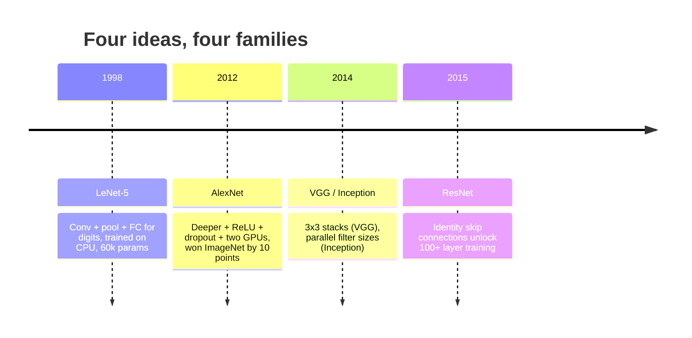
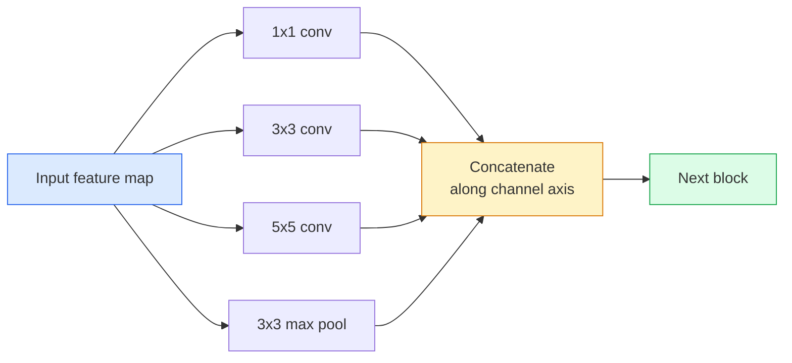
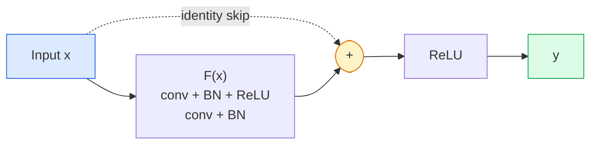

# Les CNN  LeNet à ResNet

> Au cours des trois dernières décennies, chaque CNN importante a été en substance le même modèle de non-linéarisation, reconditionné et reconditionné.

**Type:** 学习 + 构建
**Languages:** Python
**先修要求：**Leur objectif est de fournir des informations sur les différents types de données et de la manière de les analyser.
**Time:** ~75 分钟

## Objectif de l'apprentissage
-  Suivre LeNet-5 -> AlexNet -> VGG -> Inception -> Le réseau résidentiel de l'architecture, et expliquer chaque contribution de chaque famille
- Dans PyTorch, il y a un bloc de style VGG et un bloc de base ResNet, chacun contrôlé dans 40 routes.
- Expliquez pourquoi les connexions résiduelles peuvent transformer un réseau de 1000 couches inexpérimenté en un état de pointe
- 阅读一个现代脊椎 (ResNet-18, ResNet-50), et查看源码前预测 sa forme de sortie、compte de champs réceptifs 和 paramètres

##  problématique
En 2011, le meilleur classifiateur ImageNet a atteint la 5e place avec une précision d'environ 74%[6]. En 2012, AlexNet a atteint 85%[6]. En 2015, ResNet a atteint 96%[6]. Pas de nouvelles données[6]. Pas de nouvelle génération de GPU[6]. L'amélioration provient de l'idée d'architecture[6]. Un ingénieur de vision capable de travailler doit savoir quelle idée provient de quel article, car chaque colonne vertébrale de production publiée en 2026 est une recombinaison de ces mêmes composants; et parce que ces idées continuent à se déplacer: convex groupés de CNN à transformateurs, connexions résiduelles de ResNet à chaque LLM existant, normalisation de batches existe dans les modèles de diffusion actuels.

按顺序学习这些网络也能让你避免一个常见错误: dans le réseau de taille LeNet 就能解决问题时,直接使用可用最大模型──MNIST 不需要ResNet──了解每个家庭的规模曲线,能告诉你应该落在曲线的位置──

## 概念
###  changer la vision                                                                                                                                                                                                                                                                                                                                                                                                                                                                                                                          



Dans la vision classique, rien n'est plus important que ce qu'on appelle ces quatre mouvements.

### LeNet-5 (1998)

Le reconnaisseur de chiffres de Yann LeCun ∼60.000 个参数 ∼ 2 blocs de conve-pool ∼ 2 couches entièrement connectées ∼ activations de tanh ∼ définit chaque modèle de CNN 继承:

```
input (1, 32, 32)
  conv 5x5 -> (6, 28, 28)
  avg pool 2x2 -> (6, 14, 14)
  conv 5x5 -> (16, 10, 10)
  avg pool 2x2 -> (16, 5, 5)
  flatten -> 400
  dense -> 120
  dense -> 84
  dense -> 10
```

Ce que dit CNN, c'est que les convolutions alternatives et le dépréciation, à nouveau un petit classifiateur, en fait, est un nombre de canaux plus grand, plus d'activations plus de LeNet.

### Le réseau électronique

Trois changements ont été réalisés:

1. - Je veux le faire .**ReLU**Les grades ne disparaissent plus.
2. Dans la tête entièrement connectée 中使用 **Dropout**La régulation est devenue une couche, et non une technique.
3. **Depth and width**❖ 5 couches de convection, 3 couches denses, 60M de paramètres, dans deux blocs de GPUs

La figure 2 du thème montre encore la division de la GPU, c'est-à-dire deux flux parallèles. Ce parallélisme est une solution de travail au niveau du matériel, pas une structure. Mais les trois idées ci-dessus existent toujours dans chaque modèle que vous utilisez.

### VGG (2014)

VGG                                                                                                                                                                                                                                                                                                                                                                                                                                                                                                                            

```
stack:   conv 3x3 -> conv 3x3 -> pool 2x2
repeat:  16 or 19 conv layers
```

两个 conve 3x3 看到的输入面积与一个5x5 conv相似,但参数更少 (2*9*C^2 = 18C^2 vs 25*C^2),并且中间额外多多一个 ReLU──VGG 把这个观察变成完整的架构──它的简单性,即一个块类型反复堆叠,让它成为所有架构的后点参照──

Paramètres de 138 M, entraînement lent, inférence

### Création (2014,同年)

La réponse de Google à la question de quelle taille de noyau devrais-je utiliser est:



Chaque branche est spécialement conçue pour: 1x1 pour le mélange de canaux, 3x3 pour la texture locale, 5x5 pour les motifs plus grands, le regroupement pour les caractéristiques invariables de changement; concatement 让下一层选择任何有用的分支.

### Problème de dégradation

En 2015, VGG-19 能工作, alors que VGG-32 不能──Deepth devrait être utile, mais après environ 20 niveaux, la perte de formation et la perte de test ont changé.

```
Plain deep network:
  y = f_L( f_{L-1}( ... f_1(x) ... ) )

Gradient wrt early layer:
  dL/dW_1 = dL/dy * df_L/df_{L-1} * ... * df_2/df_1 * df_1/dW_1

Each multiplicative term has magnitude roughly (weight magnitude) * (activation gain).
Stack 100 of them with gains < 1 and the gradient is effectively zero.
```

Les VGG peuvent être activés à 19 niveaux, en raison de la norme de lot (environ en même temps) et permettent de maintenir une bonne mesure de l'activation.

### Réserve de données

Il, Zhang, Ren, Sun ont proposé une solution pour tout changer:

```
standard block:   y = F(x)
residual block:   y = F(x) + x
```

`+ x`La couche de définition 总能通过把 `F(x)`推到零来选择什么都不做── Un réseau résidentiel de 1000 couches 现在最差也不差于1 layer network 差,因为每个额外块都有一个轻微的逃离门──有这个保证,优化器愿意让每个块 变得*稍微*有用;而一个稍微有用的块 堆叠100次,就是最先进的――



Les deux variantes du bloc sont partout:

- **BasicBlock**(ResNet-18, ResNet-34): deux convois 3x3, sauter 跨过二者──
- **Bottleneck**(ResNet-50, -101, -152): 1x1 en bas, 3x3 moyen, 1x1 en haut, saute 跨过三者──

Lorsque le saut  doit traverser l'échantillon descendant (étape = 2) 时, le chemin d'identité 会被替换为一个1x1étape = 2 conv,以匹配形状──

### Pourquoi les résidus de la vision

Cette idée ne se concentre pas vraiment sur la classification d'images. Elle se concentre sur la transformation des réseaux profonds de la prière Gradients 能幸存下来 en outils d'ingénierie fiables, extensibles.


```figure
pooling
```

## - Je le construis.
### 步骤 1: LeNet-5

Un réseau minimal et fidèle. Il y a aussi des activations, des regroupements moyens.`nn.CrossEntropyLoss`, et non les connexions gaussiennes originales.

```python
import torch
import torch.nn as nn
import torch.nn.functional as F

class LeNet5(nn.Module):
    def __init__(self, num_classes=10):
        super().__init__()
        self.conv1 = nn.Conv2d(1, 6, kernel_size=5)
        self.conv2 = nn.Conv2d(6, 16, kernel_size=5)
        self.pool = nn.AvgPool2d(2)
        self.fc1 = nn.Linear(16 * 5 * 5, 120)
        self.fc2 = nn.Linear(120, 84)
        self.fc3 = nn.Linear(84, num_classes)

    def forward(self, x):
        x = self.pool(torch.tanh(self.conv1(x)))
        x = self.pool(torch.tanh(self.conv2(x)))
        x = torch.flatten(x, 1)
        x = torch.tanh(self.fc1(x))
        x = torch.tanh(self.fc2(x))
        return self.fc3(x)

net = LeNet5()
x = torch.randn(1, 1, 32, 32)
print(f"output: {net(x).shape}")
print(f"params: {sum(p.numel() for p in net.parameters()):,}")
```

Résultats attendus: `output: torch.Size([1, 10])`- Je suis là .`params: 61,706`C'est le classifiateur à chiffres complets de la vision moderne.

### 步骤 2: Un bloc VGG

Un bloc réutilisable: deux convecteurs 3x3, ReLU, norme de lot, pool max.

```python
class VGGBlock(nn.Module):
    def __init__(self, in_c, out_c):
        super().__init__()
        self.conv1 = nn.Conv2d(in_c, out_c, kernel_size=3, padding=1)
        self.bn1 = nn.BatchNorm2d(out_c)
        self.conv2 = nn.Conv2d(out_c, out_c, kernel_size=3, padding=1)
        self.bn2 = nn.BatchNorm2d(out_c)
        self.pool = nn.MaxPool2d(2)

    def forward(self, x):
        x = F.relu(self.bn1(self.conv1(x)))
        x = F.relu(self.bn2(self.conv2(x)))
        return self.pool(x)

class MiniVGG(nn.Module):
    def __init__(self, num_classes=10):
        super().__init__()
        self.stack = nn.Sequential(
            VGGBlock(3, 32),
            VGGBlock(32, 64),
            VGGBlock(64, 128),
        )
        self.head = nn.Sequential(
            nn.AdaptiveAvgPool2d(1),
            nn.Flatten(),
            nn.Linear(128, num_classes),
        )

    def forward(self, x):
        return self.head(self.stack(x))

net = MiniVGG()
x = torch.randn(1, 3, 32, 32)
print(f"output: {net(x).shape}")
print(f"params: {sum(p.numel() for p in net.parameters()):,}")
```

Dans les entrées de taille CIFAR, il est possible d'utiliser trois blocs VGG, un pool adaptatif, une couche linéaire.

### 步骤 3: Un résnet de baseBlock

Le bâtiment central de ResNet-18 et de ResNet-34

```python
class BasicBlock(nn.Module):
    def __init__(self, in_c, out_c, stride=1):
        super().__init__()
        self.conv1 = nn.Conv2d(in_c, out_c, kernel_size=3, stride=stride, padding=1, bias=False)
        self.bn1 = nn.BatchNorm2d(out_c)
        self.conv2 = nn.Conv2d(out_c, out_c, kernel_size=3, stride=1, padding=1, bias=False)
        self.bn2 = nn.BatchNorm2d(out_c)
        if stride != 1 or in_c != out_c:
            self.shortcut = nn.Sequential(
                nn.Conv2d(in_c, out_c, kernel_size=1, stride=stride, bias=False),
                nn.BatchNorm2d(out_c),
            )
        else:
            self.shortcut = nn.Identity()

    def forward(self, x):
        out = F.relu(self.bn1(self.conv1(x)))
        out = self.bn2(self.conv2(out))
        out = out + self.shortcut(x)
        return F.relu(out)
```

couches de convection`bias=False`C'est une règle de lot, car le paramètre bêta de BN a déjà traité le biais, donc en même temps, il est inutile de porter le biais conventionnel.`shortcut`Il faut une véritable conviction, sinon c'est une identité non-op.

### Étape 4: Un petit réseau de résistance

堆叠四组 BasicBlocks, obtenir un adapté aux entrées de taille CIFAR de la ResNet.

```python
class TinyResNet(nn.Module):
    def __init__(self, num_classes=10):
        super().__init__()
        self.stem = nn.Sequential(
            nn.Conv2d(3, 32, kernel_size=3, stride=1, padding=1, bias=False),
            nn.BatchNorm2d(32),
            nn.ReLU(inplace=True),
        )
        self.layer1 = self._make_group(32, 32, num_blocks=2, stride=1)
        self.layer2 = self._make_group(32, 64, num_blocks=2, stride=2)
        self.layer3 = self._make_group(64, 128, num_blocks=2, stride=2)
        self.layer4 = self._make_group(128, 256, num_blocks=2, stride=2)
        self.head = nn.Sequential(
            nn.AdaptiveAvgPool2d(1),
            nn.Flatten(),
            nn.Linear(256, num_classes),
        )

    def _make_group(self, in_c, out_c, num_blocks, stride):
        blocks = [BasicBlock(in_c, out_c, stride=stride)]
        for _ in range(num_blocks - 1):
            blocks.append(BasicBlock(out_c, out_c, stride=1))
        return nn.Sequential(*blocks)

    def forward(self, x):
        x = self.stem(x)
        x = self.layer1(x)
        x = self.layer2(x)
        x = self.layer3(x)
        x = self.layer4(x)
        return self.head(x)

net = TinyResNet()
x = torch.randn(1, 3, 32, 32)
print(f"output: {net(x).shape}")
print(f"params: {sum(p.numel() for p in net.parameters()):,}")
```

Chaque étape de l'utilisation de la phase 2 est effectuée à l'aide de l'échantillon de temps de débit de chaîne.

### 步骤 5: Comparer l'efficacité par paramètre à caractéristique

Donner la même entrée à travers trois réseaux, et comparer les paramètres.

```python
def summary(name, net, x):
    y = net(x)
    params = sum(p.numel() for p in net.parameters())
    print(f"{name:12s}  input {tuple(x.shape)} -> output {tuple(y.shape)}  params {params:>10,}")

x = torch.randn(1, 3, 32, 32)
summary("LeNet5",     LeNet5(),       torch.randn(1, 1, 32, 32))
summary("MiniVGG",    MiniVGG(),      x)
summary("TinyResNet", TinyResNet(),   x)
```

Pour ce qui est de la précision du CIFAR-10, il faut entraîner plusieurs époques: LeNet 60%, MiniVGG 89%, TinyResNet 93%。

## Utilisez-le
`torchvision.models`提供上所有模型的预训练版本──不同家族的呼叫签名 完全一致, c'est exactement ce que signifie l'abstraction de la colonne vertébrale──

```python
from torchvision.models import resnet18, ResNet18_Weights, vgg16, VGG16_Weights

r18 = resnet18(weights=ResNet18_Weights.IMAGENET1K_V1)
r18.eval()

print(f"ResNet-18 params: {sum(p.numel() for p in r18.parameters()):,}")
print(r18.layer1[0])
print()

v16 = vgg16(weights=VGG16_Weights.IMAGENET1K_V1)
v16.eval()
print(f"VGG-16   params: {sum(p.numel() for p in v16.parameters()):,}")
```

ResNet-18 a 11,7M de paramètres. VGG-16 a 138M. ImageNet top-1 précision approximative (69,8% contre 71,6%)  Résiduelles connexions  vous apportent 12x de paramètres d'efficacité  bénéfice. C'est pourquoi de 2016 à ViT avant l'apparition de 2021 , les variantes de ResNet ont toujours dominé, et dans le calcul sont restées dominantes dans les déploiements réels.

Pour l'apprentissage de transfert, le dispositif est toujours le même: charge préentrainée, gel de colonne vertébrale, remplacement de tête de classifiateur.

```python
for p in r18.parameters():
    p.requires_grad = False
r18.fc = nn.Linear(r18.fc.in_features, 10)
```

Vous avez maintenant un classifiateur CIFAR de 10 classes, il a hérité des représentations de l'imageNet.

## Je le livre.
Le cours est ouvert à:

- `outputs/prompt-backbone-selector.md`: un prompt, en fonction de la tâche, de la taille du jeu de données et du budget de calcul  choisir la famille CNN (LeNet/VGG/ResNet/MobileNet/ConvNeXt)
- `outputs/skill-residual-block-reviewer.md`: une compétence, va apprendre le module PyTorch et marquer le saut de la connexion  erreur(changement de pas 时缺少快捷径、快捷径激活顺序、BN 相对的位置)

## 练习
1. **(Easy)**Hand动逐层计算 `TinyResNet`Les paramètres de la`sum(p.numel() for p in net.parameters())`Par rapport au budget par paramètre, la partie principale est-elle allée où, est-ce que c'est le convsBN ou le chef de la classification?
2. **(Medium)**实现 Bottleneck block (1x1 -> 3x3 -> 1x1 avec saut), et l'utiliser pour construire un réseau de style ResNet-50 face à CIFAR.`TinyResNet`Pour le contraste.
3. **(Hard)**De `BasicBlock`Le réseau de connexion de CIFAR-10 est un réseau "plain" de 34 blocs et un réseau de résistance de 34 blocs.

## 关键术语
| Term | What people say | What it actually means |
|------|----------------|----------------------|
| Backbone | “模型” | 产生 feature map 并馈送给 task head 的 convolutional blocks 堆栈 |
| Residual connection | “Skip connection” | `y = F(x) + x`；通过将 F 设为零，让 Optimizer 学习 identity，从而让任意 depth 可训练 |
| BasicBlock | “两个带 skip 的 3x3 convs” | ResNet-18/34 的 building block：conv-BN-ReLU-conv-BN-add-ReLU |
| Bottleneck | “1x1 down，3x3，1x1 up” | ResNet-50/101/152 block；在高 channel counts 下成本低，因为 3x3 运行在缩减后的 width 上 |
| Degradation problem | “更深反而更差” | 超过约 20 个 plain conv layers 后，training error 和 test error 都会增加；由 residual connections 解决，而不是靠更多数据 |
| Stem | “第一层” | 将 3-channel input 转换为基础 feature width 的初始 conv；ImageNet 通常是 7x7 stride 2，CIFAR 通常是 3x3 stride 1 |
| Head | “分类器” | final backbone block 之后的 layers：adaptive pool、flatten、linear(s) |
| Transfer learning | “Pretrained weights” | 加载在 ImageNet 上训练过的 backbone，并且只在你的 task 上 fine-tune head |

## 延伸阅读
- [Deep Residual Learning for Image Recognition (He et al., 2015)](https://arxiv.org/abs/1512.03385) ResNet 论文; chaque image est digne d'étude
- [Very Deep Convolutional Networks (Simonyan & Zisserman, 2014)](https://arxiv.org/abs/1409.1556) VGG 论文; encore est de comprendre pourquoi il est la meilleure référence de 3x3
- [ImageNet Classification with Deep CNNs (Krizhevsky et al., 2012)](https://papers.nips.cc/paper_files/paper/2012/hash/c399862d3b9d6b76c8436e924a68c45b-Abstract.html) AlexNet;终结 fonctionnalité faite à la main 时代的论文
- [Going Deeper with Convolutions (Szegedy et al., 2014)](https://arxiv.org/abs/1409.4842) Inception v1; encore apparaîtra dans les transformateurs de vision
