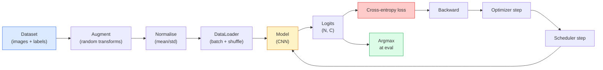

# Classification des images

> Le classifiateur est une fonction de la distribution de probabilité des pixels aux classes supérieures.

**Type:** Build
**Languages:** Python
**Prerequisites:** Phase 2 Lesson 09 (Model Evaluation), Phase 3 Lesson 10 (Mini Framework), Phase 4 Lesson 03 (CNNs)
**Time:** ~75 minutes

## Objectif de l'apprentissage

- Dans le cadre de la CIFAR-10, le pipeline de classification des images de bout en bout est construit:
- 解释每个组件的作用(datloader、loss、optimiser、scheduler、augmentation),并预测其中任何一个出错会如何体现在 Loss 曲线上
- De la mise à jour à la mixture, à la coupe et au lissage des étiquettes, et de l'explication de la valeur de leur ajout
- 阅读混矩阵 和 précision/reprise table par classe, avec précision agrégée 之外的信息诊断数据集与模型的失败模式

##  problématique

Chaque tâche de vision finale, à un certain niveau, sera reprise autour de la classification d'images. Détection, répartition, répartition, répartition, répartition, répartition, répartition, répartition, répartition, répartition, répartition, répartition, répartition, répartition, répartition, répartition, répartition, répartition, répartition, répartition, répartition, répartition, répartition, répartition, répartition, répartition, répartition, répartition, répartition, répartition, répartition, répartition, répartition, répartition, répartition, répartition, répartition, répartition, répartition, répartition, répartition, répartition, répartition, répartition, répartition, répartition, répartition, répartition, répartition, répartition, répartition, répartition, répartition, répartition, répartition, répartition, répartition, répartition, répartition, répartition, répartition, répartition, répartition, répartition, répartition, répartition, répartition, répartition, répartition, répartition, répartition, répartition, répartition, répartition, répartition, répartition, répartition, répartition, répartition, répartition, répartition, répartition, répartition, répartition, répartition, répartition, répartition, répartition, répartition, répartition, répartition, répartition, répartition, répartition, répartition, répartition, répartition, répartition, répartition, répartition, répartition, répartition, répartition, répartition, répartition, répartition, répartition, répartition, répartition, répartition, répartition, répartition, répartition, répartition, répartition, répartition, répartition, répartition, répartition, répartition, répartition,

La plupart des bugs de classification ne sont pas dans le modèle. Ils sont dans le pipeline: la normalisation des dégâts, aucun mélange de formation, l'augmentation des étiquettes, la distorsion des données, la validation des contaminations, la division des données, le taux d'apprentissage après la période 30  diffusion  après la période 30.

Ce cours sera manuel et construira le pipeline, et chaque partie sera examinée.`torchvision.datasets`Tout ce qui peut être caché.

## 核心概念

### L'équipement de classification



Chaque ligne de ce cycle peut contenir des bugs.`model(x).softmax()`Les augmentations ne doivent être utilisées que pour les entrées, pas pour les étiquettes, sauf pour le mélange, car elles seront mélangées simultanément.`optimizer.zero_grad()`Il faut faire chaque étape une fois; sauter dessus accumulera Gradient, il ressemble à un taux d'apprentissage extrêmement instable. Chacun de ces bugs permettra à la courbe d'apprentissage de se flatter, mais ne mettra pas de erreur.

### Entrapée croisée ̊logits avec softmax

Classifiateur 会为每张图像产生 `C`个数字, appelés logits. Applique softmax 会把它们转换为概率分布:

```
softmax(z)_i = exp(z_i) / sum_j exp(z_j)
```

Cross-entropie 衡量正确 class 的 log négatif probabilité:

```
CE(z, y) = -log( softmax(z)_y )
        = -z_y + log( sum_j exp(z_j) )
```

Le côté droit forme est la forme de valeur stable de la log-sum-exp.`nn.CrossEntropyLoss`La mise en œuvre de la logique de logiciel de logiciel de logiciel de logiciel de logiciel de logiciel de logiciel de logiciel de logiciel de logiciel de logiciel de logiciel de logiciel de logiciel de logiciel de logiciel de logiciel de logiciel de logiciel de logiciel de logiciel de logiciel de logiciel de logiciel de logiciel de logiciel de logiciel de logiciel de logiciel de logiciel de logiciel de logiciel de logiciel de logiciel de logiciel de logiciel de logiciel de logiciel de logiciel de logiciel de logiciel de logiciel de logiciel de logiciel de logiciel de logiciel de logiciel de logiciel de logiciel de logiciel de logiciel de logiciel de logiciel de logiciel de logiciel de logiciel de logiciel de logiciel de logiciel de logiciel de logiciel de logiciel de logiciel de logiciel de logiciel de logiciel de logiciel de logiciel de logiciel de logiciel de logiciel de logiciel de logiciel de logiciel de logiciel de logiciel de logiciel de logiciel de logiciel de logiciel de logiciel de logiciel de logiciel de logiciel de logiciel de logiciel de logiciel de logiciel de logiciel de logiciel de logiciel de logiciel de logiciel de logiciel de logiciel de logiciel de logiciel de logiciel de logiciel de logiciel de logiciel de logiciel de logiciel de logiciel de logiciel de logiciel de logiciel de logiciel de logiciel de logiciel de logiciel de logiciel de logiciel de logiciel de logiciel de logiciel de logiciel de logiciel de logiciel de logiciel de logiciel de logiciel de logiciel de logiciel de logiciel de logiciel de logiciel de logiciel de logiciel de logiciel de logiciel de logiciel de logiciel de logiciel de logiciel de logiciel de logiciel de logiciel de logiciel de logiciel de logiciel de logiciel de logiciel de logiciel de logiciel de logiciel de logiciel de logiciel de logiciel de logiciel de logiciel de logiciel de logiciel de logiciel de logiciel de logiciel de logiciel de logiciel de logiciel de logiciel de logiciel de logiciel de logiciel de logiciel de logiciel de logiciel de logiciel de

### Pourquoi augmentation efficace

CNN a un biais inductif à l'égard de la traduction, mais il n'y a pas d'invariance interne à la traduction, mais il y a un lien entre les images et les images.

```
Original crop:  "dog facing left"
Flip:           "dog facing right"       <- same label, different pixels
Rotate(+15):    "dog, slight tilt"
Colour jitter:  "dog in warmer light"
RandomErasing:  "dog with patch missing"
```

规则是:augmentation 必须保留标签──对数字做切割和旋转可能将将6 变成9; pour ce jeu de données, vous devez utiliser des plages de rotation plus petites,并选择尊重数字-specific invariations .

### mélange et coupe

L'augmentation normale va changer de pixels, mais garder les étiquettes pour un seul coup.**Mixup**et **cutmix**Il faut que les deux parties se mettent en place.

```
Mixup:
  lambda ~ Beta(a, a)
  x = lambda * x_i + (1 - lambda) * x_j
  y = lambda * y_i + (1 - lambda) * y_j

Cutmix:
  paste a random rectangle of x_j into x_i
  y = area-weighted mix of y_i and y_j
```

Il est utile: le modèle ne se souvient plus de ses objectifs de pointe, mais apprend entre les classes 插值──perte de formation augmentera, précision des tests augmentera── c'est un classifiant le plus bon marché pour améliorer la robustesse──

### Légalisation des étiquettes

Ne pas utiliser.`[0, 0, 1, 0, 0]`作为训练目标,而用 `[eps/C, eps/C, 1-eps, eps/C, eps/C]`, parmi lesquels `eps`Il empêche le modèle de produire des logits de pointe, et améliore presque à aucun coût l'étalonnage. Depuis le PyTorch 1.10 , il est déjà intégré à la`nn.CrossEntropyLoss(label_smoothing=0.1)`Il y a une autre.

### Évaluation en dehors de l'exactitude

La précision globale va couvrir le déséquilibre. Si on prédit toujours la classe majoritaire, on peut aussi obtenir 90%.

- **Per-class accuracy** Chaque classe un chiffre; seront immédiatement exposés à des catégories de manque de performance.
- **Confusion matrix** Grille C x C, dont la ligne i col j = vraie classe i est prévue pour le nombre de classes j; diagonale est correct prévue, hors diagonale 才是模型 问题所在。
- **Top-1 / Top-5** Classe exacte oui ou non dans le top 1 ou dans le top 5 prédictions; Top-5 pour ImageNet  très important, parce que comme Norwich Terrier et Norfolk Terrier de ces classes 确实存在歧义──
- **Calibration (ECE)** 0.8 confiance prédiction Est-ce que 80% du temps est exact ? Les réseaux modernes  systématieusement trop confiants; peut être utilisé pour l'échelle de température ou l'étiquette de lissage 修正。


```figure
receptive-field
```

## - Je le construis.

### 步骤 1: ensemble de données synthétiques déterminants

CIFAR-10 est situé sur le disque. Pour que ce cours soit reproduisable et rapide, nous avons construit un ensemble de données synthétiques qui ressemble à CIFAR, c'est-à-dire avec une structure spécifique à la classe, un modèle doit être étudié 32x32 images RGB.

```python
import numpy as np
import torch
from torch.utils.data import Dataset


def synthetic_cifar(num_per_class=1000, num_classes=10, seed=0):
    rng = np.random.default_rng(seed)
    X = []
    Y = []
    for c in range(num_classes):
        centre = rng.uniform(0, 1, (3,))
        freq = 2 + c
        for _ in range(num_per_class):
            yy, xx = np.meshgrid(np.linspace(0, 1, 32), np.linspace(0, 1, 32), indexing="ij")
            r = np.sin(xx * freq) * 0.5 + centre[0]
            g = np.cos(yy * freq) * 0.5 + centre[1]
            b = (xx + yy) * 0.5 * centre[2]
            img = np.stack([r, g, b], axis=-1)
            img += rng.normal(0, 0.08, img.shape)
            img = np.clip(img, 0, 1)
            X.append(img.astype(np.float32))
            Y.append(c)
    X = np.stack(X)
    Y = np.array(Y)
    idx = rng.permutation(len(X))
    return X[idx], Y[idx]


class ArrayDataset(Dataset):
    def __init__(self, X, Y, transform=None):
        self.X = X
        self.Y = Y
        self.transform = transform

    def __len__(self):
        return len(self.X)

    def __getitem__(self, i):
        img = self.X[i]
        if self.transform is not None:
            img = self.transform(img)
        img = torch.from_numpy(img).permute(2, 0, 1)
        return img, int(self.Y[i])
```

Chaque classe a sa propre palette de couleurs et son propre modèle de fréquence, à la suite du bruit gaussien, oblige le modèle à apprendre le signal, plutôt que des pixels de mémoire.

### 步骤 2:Normalité et augmentation

Chaque pipeline de vision a ces deux transformations.

```python
def standardize(mean, std):
    mean = np.array(mean, dtype=np.float32)
    std = np.array(std, dtype=np.float32)
    def _fn(img):
        return (img - mean) / std
    return _fn


def random_hflip(p=0.5):
    def _fn(img):
        if np.random.random() < p:
            return img[:, ::-1, :].copy()
        return img
    return _fn


def random_crop(pad=4):
    def _fn(img):
        h, w = img.shape[:2]
        padded = np.pad(img, ((pad, pad), (pad, pad), (0, 0)), mode="reflect")
        y = np.random.randint(0, 2 * pad)
        x = np.random.randint(0, 2 * pad)
        return padded[y:y + h, x:x + w, :]
    return _fn


def compose(*fns):
    def _fn(img):
        for fn in fns:
            img = fn(img)
        return img
    return _fn
```

Dans la culture, il est préférable d'utiliser le reflet-pad, plutôt que le zéro-pad, car le bord noir est un signal, le modèle l'ignore d'une manière inutile.

### 步骤 3: mélange

En phase de formation 内部混合两张图像和两个标签── elle se réalise pour la transformation de lot, elle se trouve donc à proximité du passage avant, et non à l'intérieur du jeu de données──

```python
def mixup_batch(x, y, num_classes, alpha=0.2):
    if alpha <= 0:
        return x, torch.nn.functional.one_hot(y, num_classes).float()
    lam = float(np.random.beta(alpha, alpha))
    idx = torch.randperm(x.size(0), device=x.device)
    x_mixed = lam * x + (1 - lam) * x[idx]
    y_onehot = torch.nn.functional.one_hot(y, num_classes).float()
    y_mixed = lam * y_onehot + (1 - lam) * y_onehot[idx]
    return x_mixed, y_mixed


def soft_cross_entropy(logits, soft_targets):
    log_probs = torch.log_softmax(logits, dim=-1)
    return -(soft_targets * log_probs).sum(dim=-1).mean()
```

`soft_cross_entropy`Il s'agit d'une distribution de l'entropie croisée de la distribution de l'étiquette douce.

### 步骤 4: boucle de formation

完整配方: à travers une fois les données, chaque lot 计算 une fois les gradients, chaque époque  exécuter une étape de planification。

```python
import torch
import torch.nn as nn
from torch.utils.data import DataLoader
from torch.optim import SGD
from torch.optim.lr_scheduler import CosineAnnealingLR

def train_one_epoch(model, loader, optimizer, device, num_classes, use_mixup=True):
    model.train()
    total, correct, loss_sum = 0, 0, 0.0
    for x, y in loader:
        x, y = x.to(device), y.to(device)
        if use_mixup:
            x_m, y_soft = mixup_batch(x, y, num_classes)
            logits = model(x_m)
            loss = soft_cross_entropy(logits, y_soft)
        else:
            logits = model(x)
            loss = nn.functional.cross_entropy(logits, y, label_smoothing=0.1)
        optimizer.zero_grad()
        loss.backward()
        optimizer.step()
        loss_sum += loss.item() * x.size(0)
        total += x.size(0)
        # Training accuracy vs the un-mixed labels `y` is only an approximation
        # when mixup is on (the model saw soft targets, not y). Treat it as a
        # rough progress signal; rely on val accuracy for real performance.
        with torch.no_grad():
            pred = logits.argmax(dim=-1)
            correct += (pred == y).sum().item()
    return loss_sum / total, correct / total


@torch.no_grad()
def evaluate(model, loader, device, num_classes):
    model.eval()
    total, correct = 0, 0
    loss_sum = 0.0
    cm = torch.zeros(num_classes, num_classes, dtype=torch.long)
    for x, y in loader:
        x, y = x.to(device), y.to(device)
        logits = model(x)
        loss = nn.functional.cross_entropy(logits, y)
        pred = logits.argmax(dim=-1)
        for t, p in zip(y.cpu(), pred.cpu()):
            cm[t, p] += 1
        loss_sum += loss.item() * x.size(0)
        total += x.size(0)
        correct += (pred == y).sum().item()
    return loss_sum / total, correct / total, cm
```

Chaque fois que vous écrivez une boucle de formation , vous devez vérifier cinq invariants:

1. formation `model.train()`,évaluation 前调用 `model.eval()`, qui changera de comportement de démission et de lot.
2. Dans le`.backward()`Précédent`.zero_grad()`Il y a une autre.
3. 累积 métriques 时使用 `.item()`, ce qui ne permettra pas de calcul graphique de toujours survivre.
4. évaluation 期间使用 `@torch.no_grad()`, économiser de la mémoire et du temps, prévenir les accidents.
5. Pour les logits bruts faire argmax, plutôt que pour les softmax faire argmax, le résultat est le même, moins une op¬¬¬¬¬¬¬¬¬¬¬¬¬¬¬¬¬¬¬¬¬¬¬¬¬¬

### 步骤 5: Rassemblement

Utilisation de la première classe`TinyResNet`On apprend à étudier plusieurs époques, puis on évalue.

```python
from main import synthetic_cifar, ArrayDataset
from main import standardize, random_hflip, random_crop, compose
from main import mixup_batch, soft_cross_entropy
from main import train_one_epoch, evaluate
# TinyResNet comes from the previous lesson (03-cnns-lenet-to-resnet).
# Adjust the import path to wherever you stored the previous lesson's code.
from cnns_lenet_to_resnet import TinyResNet  # example placeholder

X, Y = synthetic_cifar(num_per_class=500)
split = int(0.9 * len(X))
X_train, Y_train = X[:split], Y[:split]
X_val, Y_val = X[split:], Y[split:]

mean = [0.5, 0.5, 0.5]
std = [0.25, 0.25, 0.25]
train_tf = compose(random_hflip(), random_crop(pad=4), standardize(mean, std))
eval_tf = standardize(mean, std)

train_ds = ArrayDataset(X_train, Y_train, transform=train_tf)
val_ds = ArrayDataset(X_val, Y_val, transform=eval_tf)

train_loader = DataLoader(train_ds, batch_size=128, shuffle=True, num_workers=0)
val_loader = DataLoader(val_ds, batch_size=256, shuffle=False, num_workers=0)

device = "cuda" if torch.cuda.is_available() else "cpu"
model = TinyResNet(num_classes=10).to(device)
optimizer = SGD(model.parameters(), lr=0.1, momentum=0.9, weight_decay=5e-4, nesterov=True)
scheduler = CosineAnnealingLR(optimizer, T_max=10)

for epoch in range(10):
    tr_loss, tr_acc = train_one_epoch(model, train_loader, optimizer, device, 10, use_mixup=True)
    va_loss, va_acc, _ = evaluate(model, val_loader, device, 10)
    scheduler.step()
    print(f"epoch {epoch:2d}  lr {scheduler.get_last_lr()[0]:.4f}  "
          f"train {tr_loss:.3f}/{tr_acc:.3f}  val {va_loss:.3f}/{va_acc:.3f}")
```

Dans le jeu de données synthétiques, il atteindra une précision de validation presque parfaite en cinq périodes, c'est précisément le point: le pipeline est correct, le modèle peut apprendre quelque chose.

### 步骤 6: Lire la matrice de confusion

                                                                                                                                                                                                                                                              

```python
def print_confusion(cm, labels=None):
    c = cm.shape[0]
    labels = labels or [str(i) for i in range(c)]
    print(f"{'':>6}" + "".join(f"{l:>5}" for l in labels))
    for i in range(c):
        row = cm[i].tolist()
        print(f"{labels[i]:>6}" + "".join(f"{v:>5}" for v in row))
    print()
    tp = cm.diag().float()
    fp = cm.sum(dim=0).float() - tp
    fn = cm.sum(dim=1).float() - tp
    prec = tp / (tp + fp).clamp_min(1)
    rec = tp / (tp + fn).clamp_min(1)
    f1 = 2 * prec * rec / (prec + rec).clamp_min(1e-9)
    for i in range(c):
        print(f"{labels[i]:>6}  prec {prec[i]:.3f}  rec {rec[i]:.3f}  f1 {f1[i]:.3f}")

_, _, cm = evaluate(model, val_loader, device, 10)
print_confusion(cm)
```

行是真实类,列是预测. Entre les classes 3 et 5, un nombre hors diagonale apparaît, ce qui signifie que le modèle a mélangé ces deux classes, et a fourni un point de départ.

## Utilisez-le

`torchvision`Pour le vrai CIFAR-10, tout le pipeline ne nécessite que quatre lignes, ajouter une boucle de formation.

```python
from torchvision.datasets import CIFAR10
from torchvision.transforms import Compose, RandomCrop, RandomHorizontalFlip, ToTensor, Normalize

mean = (0.4914, 0.4822, 0.4465)
std = (0.2470, 0.2435, 0.2616)
train_tf = Compose([
    RandomCrop(32, padding=4, padding_mode="reflect"),
    RandomHorizontalFlip(),
    ToTensor(),
    Normalize(mean, std),
])
eval_tf = Compose([ToTensor(), Normalize(mean, std)])

train_ds = CIFAR10(root="./data", train=True,  download=True, transform=train_tf)
val_ds   = CIFAR10(root="./data", train=False, download=True, transform=eval_tf)
```

Il faut noter que le moyen est**dataset-specific**En effet, ils sont calculés sur le jeu de formation CIFAR-10, et non sur ImageNet; le reflet est la politique de culture par défaut de la communauté.

## Je le livre.

Le cours est ouvert à:

- `outputs/prompt-classifier-pipeline-auditor.md` Un script de formation rapide, utilisé pour l'audit, si les cinq invariants ci-dessus sont satisfaits, et révèle la première violation.
- `outputs/skill-classification-diagnostics.md` Une compétence, une matrice de confusion déterminée, et les noms de classes 列表后,总结 per class faillites,并提出最有影响力的单个修复──

## 练习

1. **(Easy)**Dans un ensemble de données synthétiques, avec le même modèle, chaque entraînement a une combinaison et une version sans combinaison, chaque entraînement a cinq époques.
2. **(Medium)**实现 Cutout: dans chaque image de formation 中随机把一个8x8 方块置零,并运行ablation,对比无增强、hflip+crop、hflip+crop+cutout、hflip+crop+mixup──报告每种设置的 val accuracy──
3. **(Hard)**Construire un pipeline CIFAR-100 ((100 classes, la même taille d'entrée),并复现一次 ResNet-34 entraînement run, rendant les résultats et la différence de précision publiée dans 1% 以内。

## 关键术语

| Term | 人们通常怎么说 | 它实际是什么意思 |
|------|----------------|----------------------|
| Logits | “Raw outputs” | 每张图像对应的 pre-softmax C 维 Vector；cross-entropy 期望接收它们，而不是 softmaxed values |
| Cross-entropy | “The loss” | 正确 class 的 negative log-probability；在一个稳定 op 中结合 log-softmax 和 NLL |
| DataLoader | “The batcher” | 用 shuffling、batching 和（可选）multi-worker loading 包装 dataset；一半 training bugs 都会被怪到它头上 |
| Augmentation | “Random transforms” | training time 的任何 pixel-level transform，只要它保留 label；教会 CNN 它原生不具备的 invariances |
| Mixup / Cutmix | “Mix two images” | 同时混合 inputs 和 labels，让 classifier 学习平滑插值，而不是硬边界 |
| Label smoothing | “Softer targets” | 用 (1-eps, eps/(C-1), ...) 替换 one-hot；改善 calibration，并略微提升 accuracy |
| Top-k accuracy | “Top-5” | 正确 class 位于 k 个最高 probability predictions 之中；用于包含真实歧义 classes 的 datasets |
| Confusion matrix | “Where errors live” | C x C table，其中 entry (i, j) 统计 true class i 被预测为 j 的 images 数量；diagonal 是正确项，off-diagonal 告诉你该修什么 |

## 延伸阅读

- [CS231n: Training Neural Networks](https://cs231n.github.io/neural-networks-3/)                                                                                                                                                                                                                                                                                                                                                                                                                                                                                                                            
- [Bag of Tricks for Image Classification (He et al., 2019)](https://arxiv.org/abs/1812.01187) Toutes les petites techniques combinées, vous pouvez faire augmenter la précision de ResNet de ImageNet de 3-4%
- [mixup: Beyond Empirical Risk Minimization (Zhang et al., 2017)](https://arxiv.org/abs/1710.09412) Le premier article de confusion; trois pages de théorie et des expériences convaincantes
- [Why temperature scaling matters (Guo et al., 2017)](https://arxiv.org/abs/1706.04599)Ce document prouve que les réseaux modernes ont une mauvaise calibration et les a corrigés avec un paramètre scalaire.
