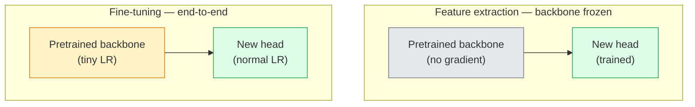

# Le transfert de l'apprentissage et l'ajustement

> D'autres ont déjà dépensé des millions de GPU, en utilisant un réseau neural pour identifier les bordures, les textures et les éléments des objets. Avant de former votre propre modèle, vous devriez emprunter ces fonctionnalités.

**Type:** Build
**Languages:** Python
**Prerequisites:** Phase 4 Lesson 03 (CNNs), Phase 4 Lesson 04 (Image Classification)
**Time:** ~75 minutes

## Objectif de l'apprentissage
- 区分 fonctionnalité extraction 和 fine-tuning,并 selon la taille du jeu de données, la distance du domaine et le budget de calcul 选择合适方法
- Charger la colonne vertébrale prétrainée, remplacer sa tête de classifiateur, et en 20 行 seulement la tête de formation  obtenir la ligne de base disponible
- Utilisation des taux d'apprentissage discriminatoires  étape par étape  déchiffrer les couches, faire les premières caractéristiques génériques de la mise à jour amplitude inférieure à la dernière phase des caractéristiques spécifiques à la tâche
- 诊断三类常见失败:blocs non congelés 上 LR 过高导致特征漂移、小数据集 上 BN statistiques effondrement, ainsi que l'oubli catastrophique

##  problématique
En imageNet, une formation de ResNet-50 nécessite environ 2000 heures de GPU. Peu d'équipes peuvent assumer ce budget pour chaque tâche qui doit être effectuée en ligne.

Ce n'est pas un moyen de parcours. Toutes les personnes qui ont été formées sur ImageNet, dont la première convection, les blocs de citoyens, les bordures d'apprentissage et les filtres similaires à ceux de Gabor, ont été formés sur CNN. Les blocs suivants, les textures et les motifs simples, les blocs intermédiaires, les parties d'objet, les composants, les derniers blocs, les composants, les composants, les composants, les composants, les composants, les composants, les composants, les composants, les composants, les composants, les composants, les composants, les composants, les composants, les composants, les composants, les composants, les composants, les composants, les composants, les composants, les composants, les composants, les composants, les composants, les composants, les composants, les composants, les composants, les composants, les composants, les composants, les composants, les composants, les composants, les composants, les composants, les composants, les composants, les composants, les composants, les composants, les composants, les composants, les composants, les composants, les composants, les composants, les composants, les composants, les composants, les composants, les composants, les composants, les composants, les composants, les composants, les composants, les composants, les composants, les composants, les composants, les composants, les composants, les composants, les composants, les composants, les composants, les composants, les composants, les composants, les composants, les composants, les composants, les composants, les composants, les composants, les composants, les composants, les composants, les composants, les composants, les composants, les composants, les composants, les composants, les composants, les composants, les composants, les composants, les composants, les composants, les composants, les composants, les composants, les composants, les composants, les composants, les composants, les composants, les composants, les

Faites un bon transfert Il y a trois bugs en attente de vous: utiliser un taux d'apprentissage trop élevé pour détruire les fonctionnalités prétendues; résoudre trop pour entraîner une insuffisance d'informations; faire déménager les statistiques de fonctionnement de BatchNorm dans un petit ensemble de données, tandis que le reste du réseau neural n'a jamais appris à survivre à ce ensemble de données.

## 概念
### Caractéristiques de la mise en forme

两种模式, dépend de votre confiance en fonction des caractéristiques prétrainées, ainsi que de votre confiance en données.



经验法则:

| Dataset size | Domain distance | Recipe |
|--------------|-----------------|--------|
| < 1k images | 接近 ImageNet | 冻结 backbone，只训练 head |
| 1k-10k | 接近 | 冻结前 2-3 个 stages，fine-tune 其余部分 |
| 10k-100k | 任意 | 使用 discriminative LR 进行 end-to-end fine-tune |
| 100k+ | 远 | Fine-tune 全部参数；如果 domain 足够远，考虑从零训练 |

 approximation à ImageNet大致 signifie avec un contenu objet-comme des photos naturelles RGB。 scanners CT médicaux、 images satellites et microscopie  appartiennent à des domaines lointains, les fonctionnalités  encore utile, mais vous devez permettre plus de couches 适应。

### Pourquoi le gel fonctionne-t-il ?

Les fonctionnalités d'ImageNet apprises par CNN ne sont pas spécifiquement destinées aux 1000 catégories de images. Elles s'adaptent spécifiquement aux caractéristiques statistiques des images naturelles: bordures, textures, contrastes, formes primitives: des orientations spécifiques. Ces caractéristiques statistiques sont très stables dans presque tous les domaines visuels que l'homme peut exprimer. C'est pourquoi un modèle entraîné sur ImageNet, lors d'une nouvelle évaluation à zéro-shot sur CIFAR-10, ne peut ajouter qu'une tête linéaire (non-tune fine) pour atteindre 80% de précision.

### Taux d'apprentissage discriminatoire

Lorsque vous avez réellement déchiffré, les premières couches  devraient être plus lentes que les dernières couches  entraîner plus lentement  Les premières couches  coder sont des caractéristiques génériques que vous voulez conserver; les dernières couches  coder sont des structures spécifiques à la tâche que vous devez modifier considérablement 

```
Typical recipe:

  stage 0 (stem + first group): lr = base_lr / 100    (mostly fixed)
  stage 1:                       lr = base_lr / 10
  stage 2:                       lr = base_lr / 3
  stage 3 (last backbone group): lr = base_lr
  head:                          lr = base_lr  (or slightly higher)
```

Dans PyTorch, c'est juste transmettre à Optimizer des groupes de paramètres 列表── un modèle, cinq taux d'apprentissage, zéro code supplémentaire──

### Le problème de la norme de série

Les couches BN sont détenues sur ImageNet`running_mean`et `running_var`Buffers. Si votre tâche a une distribution de pixels différente, par exemple, un éclairage différent, un capteur différent, un espace de couleur différent, ces buffers sont des erreurs.

1. **在 train mode 下 fine-tune BN。**让 BN 随其它部分一起更新运行统计――当任务数据集 中等大小(>= 5k exemples)
2. **在 eval mode 下冻结 BN。**Gardez les statistiques de ImageNet, seulement entraîner les poids...
3. **用 GroupNorm 替换 BN。**完全移除 moving-average 问题── utilisé pour la détection et la segmentation des colonne vertébrale, parce que chaque GPU de taille de lot 很小──

C'est une erreur de faire, une précision de 5 à 15% en baisse.

### Conception de la tête

La tête de classification est de 1 à 3 couches linéaires avec un dérapagement optionnel.

```
backbone.fc = nn.Linear(backbone.fc.in_features, num_classes)          # ResNet
backbone.classifier[1] = nn.Linear(..., num_classes)                    # EfficientNet, MobileNet
backbone.heads.head = nn.Linear(..., num_classes)                       # torchvision ViT
```

Pour les petits ensembles de données, une seule couche linéaire est généralement suffisante. Lorsque la distribution des tâches et la distribution de formation du dos sont plus éloignées, l'ajout d'une couche cachée (Linear -> ReLU -> Dropout -> Linear) sera utile.

### L'éclatement de la LR par couche

C'est une version plus simple de LR utilisée dans le mode moderne de réglage fin (BEiT、DINOv2、ViT-B) et non pour séparer les couches en étapes, mais pour que chaque couche de LR soit plus petite que la première.

```
lr_layer_k = base_lr * decay^(L - k)
```

Lorsque la décomposition = 0,75 et L = 12 blocs transformateurs 时, le premier bloc de formation LR est la tête LR `0.75^11 ≈ 0.04x`Pour les transformateurs, c'est plus important que pour les CNN. Pour les CNN, les LR de groupe de scène sont généralement suffisants.

### Ce qu'il faut évaluer

Les cours de transfert-apprentissage  nécessitent deux vous allez dans la course à zéro ne suivent pas les chiffres:

- **Pretrained-only accuracy**La tête est précise. C'est ton étage.
- **Fine-tuned accuracy** Exécution de la formation de bout en bout 后同一个模型的精度──这是你的天花板──

Si bien ajusté 低于预训练的, tu auras un taux d'apprentissage ou un bug BN──始终印两者──


```figure
transfer-learning
```

## - Je le construis.
### 步骤 1: Charger une colonne vertébrale prétrainée et l'inspecter

```python
import torch
import torch.nn as nn
from torchvision.models import resnet18, ResNet18_Weights

backbone = resnet18(weights=ResNet18_Weights.IMAGENET1K_V1)
print(backbone)
print()
print("classifier head:", backbone.fc)
print("feature dim:", backbone.fc.in_features)
```

`ResNet18`Il y a quatre étapes.`layer1..layer4`), extraire une tige et une `fc`Chaque colonne vertébrale de la classification de la torche a une structure similaire.

### 步骤 2: Extraction de fonctionnalités  geler tout, remplacer la tête

```python
def make_feature_extractor(num_classes=10):
    model = resnet18(weights=ResNet18_Weights.IMAGENET1K_V1)
    for p in model.parameters():
        p.requires_grad = False
    model.fc = nn.Linear(model.fc.in_features, num_classes)
    return model

model = make_feature_extractor(num_classes=10)
trainable = sum(p.numel() for p in model.parameters() if p.requires_grad)
frozen = sum(p.numel() for p in model.parameters() if not p.requires_grad)
print(f"trainable: {trainable:>10,}")
print(f"frozen:    {frozen:>10,}")
```

- Je ne sais pas .`model.fc`C'est un extracteur de fonctionnalités gelées.

### 步骤 3: réglage des mesures discriminatoires

Un outil, utilisé pour construire des groupes de paramètres de taux d'apprentissage spécifiques à une étape.

```python
def discriminative_param_groups(model, base_lr=1e-3, decay=0.3):
    stages = [
        ["conv1", "bn1"],
        ["layer1"],
        ["layer2"],
        ["layer3"],
        ["layer4"],
        ["fc"],
    ]
    groups = []
    for i, names in enumerate(stages):
        lr = base_lr * (decay ** (len(stages) - 1 - i))
        params = [p for n, p in model.named_parameters()
                  if any(n.startswith(k) for k in names)]
        if params:
            groups.append({"params": params, "lr": lr, "name": "_".join(names)})
    return groups

model = resnet18(weights=ResNet18_Weights.IMAGENET1K_V1)
model.fc = nn.Linear(model.fc.in_features, 10)
for p in model.parameters():
    p.requires_grad = True

groups = discriminative_param_groups(model)
for g in groups:
    print(f"{g['name']:>10s}  lr={g['lr']:.2e}  params={sum(p.numel() for p in g['params']):>8,}")
```

`decay=0.3`Indiquer que le taux d'entraînement de chaque étape est de 30% de la prochaine étape.`fc`Je l' ai reçu .`base_lr`- Je suis désolé .`layer4`Je l' ai reçu .`0.3 * base_lr`- Je suis désolé .`conv1`Je l' ai reçu .`0.3^5 * base_lr ≈ 0.00243 * base_lr`                                                                                                                                                                                                                                                              

### 步骤 4: Traitement de la série

U 结 BN en cours d'exécution des statistiques et non 结其体重的辅助者──

```python
def freeze_bn_stats(model):
    for m in model.modules():
        if isinstance(m, (nn.BatchNorm1d, nn.BatchNorm2d, nn.BatchNorm3d)):
            m.eval()
            for p in m.parameters():
                p.requires_grad = False
    return model
```

Dans chaque époque , commencez à mettre en place`model.train()`Il est en train de le faire.`model.train()`La fonction sera de coupe à la mode de formation.

### 步骤 5: Une boucle de réglage fin de bout en bout minimale

```python
from torch.optim import SGD
from torch.utils.data import DataLoader
from torch.optim.lr_scheduler import CosineAnnealingLR
import torch.nn.functional as F

def fine_tune(model, train_loader, val_loader, device, epochs=5, base_lr=1e-3, freeze_bn=False):
    model = model.to(device)
    groups = discriminative_param_groups(model, base_lr=base_lr)
    optimizer = SGD(groups, momentum=0.9, weight_decay=1e-4, nesterov=True)
    scheduler = CosineAnnealingLR(optimizer, T_max=epochs)

    for epoch in range(epochs):
        model.train()
        if freeze_bn:
            freeze_bn_stats(model)
        tr_loss, tr_correct, tr_total = 0.0, 0, 0
        for x, y in train_loader:
            x, y = x.to(device), y.to(device)
            logits = model(x)
            loss = F.cross_entropy(logits, y, label_smoothing=0.1)
            optimizer.zero_grad()
            loss.backward()
            optimizer.step()
            tr_loss += loss.item() * x.size(0)
            tr_total += x.size(0)
            tr_correct += (logits.argmax(-1) == y).sum().item()
        scheduler.step()

        model.eval()
        va_total, va_correct = 0, 0
        with torch.no_grad():
            for x, y in val_loader:
                x, y = x.to(device), y.to(device)
                pred = model(x).argmax(-1)
                va_total += x.size(0)
                va_correct += (pred == y).sum().item()
        print(f"epoch {epoch}  train {tr_loss/tr_total:.3f}/{tr_correct/tr_total:.3f}  "
              f"val {va_correct/va_total:.3f}")
    return model
```

Utiliser la recette ci-dessus dans CIFAR-10 en train de cinq époques, vous pouvez le mettre en place.`ResNet18-IMAGENET1K_V1`De 70% à zéro, la précision de la sonde linéaire s'améliore à 93% et est ajustée à la perfection. Si l'on ne fait que s'entraîner la tête et ne bouge pas complètement la colonne vertébrale, la précision atteindra environ 86%.

### 步骤 6: Défrilage progressif

Une sorte de schéma de chaque époque de fin à fin de phase, à la différence de la différence de prix, est appliquée à des périodes supplémentaires.

```python
def progressive_unfreeze_schedule(model):
    stages = ["layer4", "layer3", "layer2", "layer1"]
    yielded = set()

    def start():
        for p in model.parameters():
            p.requires_grad = False
        for p in model.fc.parameters():
            p.requires_grad = True

    def unfreeze(epoch):
        if epoch < len(stages):
            name = stages[epoch]
            yielded.add(name)
            for n, p in model.named_parameters():
                if n.startswith(name):
                    p.requires_grad = True
            return name
        return None

    return start, unfreeze
```

Dans la première époque , avant de faire usage une fois .`start()`                                                                                                                                                                                                                                                              `unfreeze(epoch)` Chaque fois que les paramètres entraînables  collection se modifient, il faut reconstruire Optimiser, sinon les paramètres gelés  conservent encore des moments cachés, ça va le perturber 

## Utilisez-le
Pour la plupart des tâches réelles,`torchvision.models`Le mécanisme de plus lourd est suffisant, mais il est important que vous rencontriez des problèmes de bibliothèque non résolus.

```python
from torchvision.models import resnet50, ResNet50_Weights

model = resnet50(weights=ResNet50_Weights.IMAGENET1K_V2)
model.fc = nn.Linear(model.fc.in_features, num_classes)
optimizer = torch.optim.AdamW(model.parameters(), lr=1e-4, weight_decay=1e-4)
```

 Deux autres défauts de production:

- `timm`提供约800 个预训练视觉脊椎,并带一致的API(`timm.create_model("resnet50", pretrained=True, num_classes=10)`Pour tout type de musique fine en dehors du zoo, c'est le choix standard.
- Pour les transformateurs,`transformers.AutoModelForImageClassification.from_pretrained(name, num_labels=N)`Il vous donne ViT / BEiT / DeiT, et le chargement de la sémantique avec les modèles de texte est similaire.

## Je le livre.
Le cours est ouvert à:

- `outputs/prompt-fine-tune-planner.md` Un prompt, en fonction de la taille du jeu de données, de la distance de domaine et du budget de calcul, choisir l'extraction de fonctionnalités, l'ajustement progressif ou l'ajustement fin de bout en bout.
- `outputs/skill-freeze-inspector.md` Une compétence, donnée par le modèle PyTorch 后, rapportera quels paramètres sont entraînables, quels couches BatchNorm 处于评估模式, ainsi que si l'optimisateur 否确实获得了训练可行的参数──

## 练习
1. **(Easy)**Dans le même ensemble de données CIFAR synthétique,`ResNet18`Répondre à la question suivante: comment expliquer les différences entre les deux ?
2. **(Medium)**J'ai l'intention d'introduire un bug: mettre la colonne vertébrale à l'étape supérieure`base_lr = 1e-1`, au lieu de tête, montre la perte d'entraînement, explose, puis passe à l'application`discriminative_param_groups`L'aide à récupérer.
3. **(Hard)**选取一个医学成像数据集 (例如 CheXpert-small、PatchCamelyon 或 HAM10000),比较三种制度: a) Réduction de la colonne vertébrale gelée + tête linéaire pré-entrainée par ImageNet; b) Réduction de la finition fine finition pré-entrainée par ImageNet; c) Réduction de la précision de chaque méthode et coût de calcul.

## 关键术语
| Term | What people say | What it actually means |
|------|----------------|----------------------|
| Feature extraction | “Freeze and train head” | Backbone parameters 冻结，只有新的 classifier head 接收 Gradient |
| Fine-tuning | “Retrain end-to-end” | 所有 parameters 都 trainable，通常使用比 scratch training 小得多的 LR |
| Discriminative LR | “Smaller LR for early layers” | Optimizer parameter groups，其中 early-stage LR 是 late-stage LR 的一部分 |
| Layer-wise LR decay | “Smooth LR gradient” | 每层 LR 乘以 decay^(L - k)；常见于 transformer fine-tunes |
| Catastrophic forgetting | “The model lost ImageNet” | 过高 LR 在新任务信号被学到之前覆盖了 pretrained features |
| BN statistics drift | “Running mean is wrong” | BatchNorm running_mean/var 是在不同于当前任务的 distribution 上计算的，会悄悄损害 accuracy |
| Linear probe | “Frozen backbone + linear head” | 对 pretrained features 的评估，即 frozen representation 之上最佳 linear classifier 的 accuracy |
| Catastrophic collapse | “Everything predicts one class” | 当 fine-tuning 的 LR 高到在 head 的 Gradient 能稳定之前就破坏 features 时发生 |

## 延伸阅读
- [How transferable are features in deep neural networks? (Yosinski et al., 2014)](https://arxiv.org/abs/1411.1792) Cet article a mesuré les caractéristiques entre les différentes couches 
- [Universal Language Model Fine-tuning (ULMFiT, Howard & Ruder, 2018)](https://arxiv.org/abs/1801.06146) Récipitatif de décongélation discriminatoire / progressif initial; ces idées peuvent être directement transférées à la vision
- [timm documentation](https://huggingface.co/docs/timm) 现代 vision backbone 以 et ses entraînements 时精确细调默认的参考
- [A Simple Framework for Linear-Probe Evaluation (Kornblith et al., 2019)](https://arxiv.org/abs/1805.08974) Pourquoi l'exactitude de la sonde linéaire  est importante, ainsi que comment correctement le rapporter
