# 目标检测  De zéro réalisation de YOLO

> La détection est la classification plus la régression, dans chaque position de la carte des caractéristiques, puis avec la suppression non maximale 清理结果──

**类型：**Construction
**语言：**Python
**前置要求：**La phase 4 leçon 03 (CNN), la phase 4 leçon 04 (classification des images), la phase 4 leçon 05 (apprentissage de transfert)
**时间：**À environ 75 minutes.

## Objectif de l'apprentissage

-  expliquer la grille et l'ancrage  concevoir comment faire la détection  transformer en prédiction dense  problème,并说明输出テンসর 中每个数字的含义
- 计算 box   之间 Intersection-over-Union,并从零 réaliser la suppression non maximale
- Construire une tête de style YOLO minime sur la colonne vertébrale prétrainée, y compris les pertes de classification, d'objets et de régression de boîte
- 读懂一行检测测指标(precision@0.5, recall, mAP@0.5, mAP@0.5:0.95),并判断下一步应该调整哪个扣

##  problématique

Classification 会说 This张图是一个狗──Detection 会说在像素 (112, 40, 280, 210) 处有一个狗,在 (400, 180, 560, 310) 处有一个猫,画面中没有其他东西──这个结构变化预测数量可变的带标签盒,而不是每张图一个标签是每个自动驾驶系统、每个监控产品、每个文档布局解析器 和每个工厂视觉产线的依赖能力──

La détection est également le lieu où tout l'élaboration de la vidéo se produit simultanément. Vous voulez que la boîte 准确(régrésion tête), que chaque boîte de classe 正确(classification tête), que le modèle sache quand il n'y a rien besoin de tester (score d'objets), que chaque objet réel ne doit que répondre à une prédiction (non suppression maximale) ✿.

YOLO(You Only Look Once, Redmon et al. 2016) est une conception, qui passe par le connet de la connexion à l'avance 让所有这些实时运行起来;同样结构决策至今仍然是现代探测器 (YOLOv8, YOLOv9, YOLO-NAS, RT-DETR) est la colonne vertébrale de YOLOv8, YOLOv9, YOLO-NAS, RT-DETR).

## 概念

### Détection  en tant que prédiction dense

Classificateur 每张图输出 C 个数字──YOLO 风格探测器 每张图输出 `(S x S x (5 + C))`个数字, dont S est la taille de la grille spatiale.

```mermaid
flowchart LR
    IMG["Input 416x416 RGB"] --> BB["Backbone<br/>(ResNet, DarkNet, ...)"]
    BB --> FM["Feature map<br/>(C_feat, 13, 13)"]
    FM --> HEAD["Detection head<br/>(1x1 convs)"]
    HEAD --> OUT["Output tensor<br/>(13, 13, B * (5 + C))"]
    OUT --> DEC["Decode<br/>(grid + sigmoid + exp)"]
    DEC --> NMS["Non-max suppression"]
    NMS --> RESULT["Final boxes"]

    style IMG fill:#dbeafe,stroke:#2563eb
    style HEAD fill:#fef3c7,stroke:#d97706
    style NMS fill:#fecaca,stroke:#dc2626
    style RESULT fill:#dcfce7,stroke:#16a34a
```



Chaque .`S * S`cellule de grille 会预测 `B`Pour chaque boîte:

- 4 chiffres décrivent les informations:`tx, ty, tw, th`Il y a une autre.
- 1 个数字是对象性分数: y a-t-il un objet dans le centre de cette cellule?
- C 个数字 sont des probabilités de classe.

Nombre total de cellules:`B * (5 + C)` Pour le VOC, si`S=13, B=2, C=20`, c'est que chaque cellule a 50 chiffres.

### Pourquoi avoir besoin de grilles et d'ancres

朴素回归 会为每个对象 预测绝对坐标形式 的 预测 预测 预测 预测 预测 预测 预测 预测 预测 预测 预测 预测 预测 预测 预测 预测 预测 预测 预测 预测 预测 预测 预测 预测 预测 预测 预测 预测 预测 预测 预测 预测 预测 预测 预测 预测 预测 预测 预测 预测 预测 预测 预测 预测 预测 预测 预测 预测 预测 预测 预测 预测 预测 预测 预测 预测 预测 预测 预测 预测 预测 预测 预测 预测 预测 预测 预测 预测 预测 预测 预测 预测 预测 预测 预测 预测 预测 预测 预测 预测 预测 预测 预测 预测 预测 预测 预测 预测 预测 预测 预测 预测 预测 预测 预测 预测 预测 预测 预测 预测 预测 预测 预测 预测 预测 预测 预测 预计`(x, y, w, h)` C'est difficile à dire sur le réseau conv, car les images de plan ne devraient pas permettre à toutes les prédictions de déplacer de la même façon  chaque objet est fixé sur l'espace  grille  en distribuant chaque boîte de vérité de base à la cellule de grille située au centre de celle-ci pour résoudre ce problème; seule cette cellule ⋅ est responsable de cet objet 

Anchors  résoudre un deuxième problème── 3x3 con  très difficile de voir la cellule de la fonctionnalité du champ réceptif de 16 pixels  Régrésion sortant d'une boîte de 500 pixels  Par conséquent, nous sommes dans chaque cellule  prédéfinition `B`个先验 box shape(anchors),并从每个anker 预测小的deltas──模型学习选择正确的anker 并微调它,而不是从零 Regression──

```
Anchor box priors (example for 416x416 input):

  small:   (30,  60)
  medium:  (75,  170)
  large:   (200, 380)

At each grid cell, every anchor emits (tx, ty, tw, th, obj, c_1, ..., c_C).
```

Le détecteur moderne utilise généralement FPN, en différentes résolutions, en utilisant différents ensembles d'ancres.

### 解码 prédictions

 Originaires`tx, ty, tw, th`Ce ne sont pas des coordonnées de boîte; elles sont des objectifs de régression qui doivent être transformés avant de le faire:

```
centre x  = (sigmoid(tx) + cell_x) * stride
centre y  = (sigmoid(ty) + cell_y) * stride
width     = anchor_w * exp(tw)
height    = anchor_h * exp(th)
```

`sigmoid`La délocalisation du centre est limitée à la cellule.`exp`La largeur peut être réduite à partir de l'ancre sans qu'il y ait de changement de taille.`stride`Remplissez les coordonnées de la grille en réduisant les pixels. Ce décodeur est le même depuis v2 dans chaque version de YOLO.

### Le secteur de l'énergie

Détection en mesure de deux boîtes de comparaison métrique générale:

```
IoU(A, B) = area(A intersect B) / area(A union B)
```

IoU = 1 indique la même chose; IoU = 0 indique aucune superposition. La prédiction et la boîte de vérité fondamentale décident si une prédiction est vraie positive.

### Suppression non maximale

Le réseau de convection de l'entraînement est généralement utilisé pour le même objet.

```
NMS(boxes, scores, iou_threshold):
    sort boxes by score descending
    keep = []
    while boxes not empty:
        pick the top-scoring box, add to keep
        remove every box with IoU > iou_threshold to the picked box
    return keep
```

典型值:détection d'objet 中为0.45──récent détecteur 会用 `soft-NMS`- Je suis là.`DIoU-NMS`替代标准 NMS, ou directement apprendre suppression (RT-DETR), mais le but structurel est le même.

### Perte de fonds

Les pertes de YOLO sont trois pertes de poids en plus:

```
L = lambda_coord * L_box(pred, target, where obj=1)
  + lambda_obj   * L_obj(pred, 1,     where obj=1)
  + lambda_noobj * L_obj(pred, 0,     where obj=0)
  + lambda_cls   * L_cls(pred, target, where obj=1)
```

只有包含对象的细胞 才会贡献盒回归和分类损失──不含对象的细胞 只贡献对象性损失──教模型保持沉默──`lambda_noobj`Normalement, environ 0,5, car la plupart des cellules sont vides, sinon elles auront une perte totale.

现代变体会把 MSE box loss 换成 CIoU / DIoU(直接优化 IoU), utiliser la perte de focus 处理类失衡,并使用质量焦失平衡对象性──三组件结构保持不变──

### Mesures de détection

La précision ne peut pas être directement transférée à la détection.

- **Precision@IoU=0.5** Dans les prédictions positives, il y a beaucoup de vérités réelles.
- **Recall@IoU=0.5** Dans les vrais objets, nous avons trouvé beaucoup.
- **AP@0.5** L'objectif de la courbe de rappel de précision de l'UIO est de 0,5°; chaque classe un un un un un.
- **mAP@0.5:0.95** Dans les seuils de l'UE 0,5, 0,55, ..., 0,95 上对 AP 求平均──COCO métrique;

Si un détecteur est très fort, mais très faible, il indique que le détecteur est correct mais pas assez fort; utilise une meilleure perte de régression de boîte 修复── Si la précision du détecteur est élevée, rappelez-vous que c'est trop faible; réduisez le seuil de confiance ou augmentez le poids de l'objet.


```figure
object-detection-nms
```

## - Je le construis.

### 步骤 1: Vous

Les deux outils principaux de l'ensemble du cours`(x1, y1, x2, y2)`Les tableaux de boîtes de format

```python
import numpy as np

def box_iou(boxes_a, boxes_b):
    ax1, ay1, ax2, ay2 = boxes_a[:, 0], boxes_a[:, 1], boxes_a[:, 2], boxes_a[:, 3]
    bx1, by1, bx2, by2 = boxes_b[:, 0], boxes_b[:, 1], boxes_b[:, 2], boxes_b[:, 3]

    inter_x1 = np.maximum(ax1[:, None], bx1[None, :])
    inter_y1 = np.maximum(ay1[:, None], by1[None, :])
    inter_x2 = np.minimum(ax2[:, None], bx2[None, :])
    inter_y2 = np.minimum(ay2[:, None], by2[None, :])

    inter_w = np.clip(inter_x2 - inter_x1, 0, None)
    inter_h = np.clip(inter_y2 - inter_y1, 0, None)
    inter = inter_w * inter_h

    area_a = (ax2 - ax1) * (ay2 - ay1)
    area_b = (bx2 - bx1) * (by2 - by1)
    union = area_a[:, None] + area_b[None, :] - inter
    return inter / np.clip(union, 1e-8, None)
```

Retournez à l' un`(N_a, N_b)`Pour une seule boîte de vérité de base, faites une des matrices en forme.`(1, 4)`Il y a une autre.

### 步骤 2: Suppression non maximale

```python
def nms(boxes, scores, iou_threshold=0.45):
    order = np.argsort(-scores)
    keep = []
    while len(order) > 0:
        i = order[0]
        keep.append(i)
        if len(order) == 1:
            break
        rest = order[1:]
        ious = box_iou(boxes[[i]], boxes[rest])[0]
        order = rest[ious <= iou_threshold]
    return np.array(keep, dtype=np.int64)
```

确定性实现, répartition et réalisation `O(N log N)`La complexité, et correspondant à la même entrée`torchvision.ops.nms`Le comportement de la femme

### 步骤 3:Codeur et décodeur de boîte

Dans les coordonnées de pixel et réseau  réelle régression `(tx, ty, tw, th)`Les objectifs sont transférés entre les deux.

```python
def encode(box_xyxy, cell_x, cell_y, stride, anchor_wh):
    x1, y1, x2, y2 = box_xyxy
    cx = 0.5 * (x1 + x2)
    cy = 0.5 * (y1 + y2)
    w = x2 - x1
    h = y2 - y1
    tx = cx / stride - cell_x
    ty = cy / stride - cell_y
    tw = np.log(w / anchor_wh[0] + 1e-8)
    th = np.log(h / anchor_wh[1] + 1e-8)
    return np.array([tx, ty, tw, th])


def decode(tx_ty_tw_th, cell_x, cell_y, stride, anchor_wh):
    tx, ty, tw, th = tx_ty_tw_th
    cx = (sigmoid(tx) + cell_x) * stride
    cy = (sigmoid(ty) + cell_y) * stride
    w = anchor_wh[0] * np.exp(tw)
    h = anchor_wh[1] * np.exp(th)
    return np.array([cx - w / 2, cy - h / 2, cx + w / 2, cy + h / 2])


def sigmoid(x):
    return 1.0 / (1.0 + np.exp(-x))
```

测试:encode une boîte Reencode Tu devrais pouvoir obtenir très proche de la valeur initiale du résultat`tx`Il n'y a pas de réaction inverse de la sigmoïde dans la plage post-sigmoïde, donc il y a de légères différences.

### Étape 4: Une tête YOLO minimale

Carte de caractéristiques sur une convex 1x1, remodeler pour`(B, S, S, num_anchors, 5 + C)`Il y a une autre.

```python
import torch
import torch.nn as nn

class YOLOHead(nn.Module):
    def __init__(self, in_c, num_anchors, num_classes):
        super().__init__()
        self.num_anchors = num_anchors
        self.num_classes = num_classes
        self.conv = nn.Conv2d(in_c, num_anchors * (5 + num_classes), kernel_size=1)

    def forward(self, x):
        n, _, h, w = x.shape
        y = self.conv(x)
        y = y.view(n, self.num_anchors, 5 + self.num_classes, h, w)
        y = y.permute(0, 3, 4, 1, 2).contiguous()
        return y
```

输出 forme:`(N, H, W, num_anchors, 5 + C)`                                                                                                                                                                                                                                                              `[tx, ty, tw, th, obj, cls_0, ..., cls_{C-1}]`Il y a une autre.

### 步骤 5: attribution de la vérité fondamentale

Pour chaque boîte de vérité, décide qui.`(cell, anchor)`- Je suis responsable.

```python
def assign_targets(boxes_xyxy, classes, anchors, stride, grid_size, num_classes):
    num_anchors = len(anchors)
    target = np.zeros((grid_size, grid_size, num_anchors, 5 + num_classes), dtype=np.float32)
    has_obj = np.zeros((grid_size, grid_size, num_anchors), dtype=bool)

    for box, cls in zip(boxes_xyxy, classes):
        x1, y1, x2, y2 = box
        cx, cy = 0.5 * (x1 + x2), 0.5 * (y1 + y2)
        gx, gy = int(cx / stride), int(cy / stride)
        bw, bh = x2 - x1, y2 - y1

        ious = np.array([
            (min(bw, aw) * min(bh, ah)) / (bw * bh + aw * ah - min(bw, aw) * min(bh, ah))
            for aw, ah in anchors
        ])
        best = int(np.argmax(ious))
        aw, ah = anchors[best]

        target[gy, gx, best, 0] = cx / stride - gx
        target[gy, gx, best, 1] = cy / stride - gy
        target[gy, gx, best, 2] = np.log(bw / aw + 1e-8)
        target[gy, gx, best, 3] = np.log(bh / ah + 1e-8)
        target[gy, gx, best, 4] = 1.0
        target[gy, gx, best, 5 + cls] = 1.0
        has_obj[gy, gx, best] = True
    return target, has_obj
```

La sélection d'ancrage est  avec la vérité de base  avec la meilleure forme IoU c'est un proxy bon marché, correspondant à l'affectation de YOLOv2/v3。 v5 及后续版本使用更复杂的策略(task-aligned matching, dynamique k) 來细化同一思路。

### Étape 6: Trois pertes

```python
def yolo_loss(pred, target, has_obj, lambda_coord=5.0, lambda_obj=1.0, lambda_noobj=0.5, lambda_cls=1.0):
    has_obj_t = torch.from_numpy(has_obj).bool()
    target_t = torch.from_numpy(target).float()

    # box-regression loss: only on cells with objects
    box_pred = pred[..., :4][has_obj_t]
    box_true = target_t[..., :4][has_obj_t]
    loss_box = torch.nn.functional.mse_loss(box_pred, box_true, reduction="sum")

    # objectness loss
    obj_pred = pred[..., 4]
    obj_true = target_t[..., 4]
    loss_obj_pos = torch.nn.functional.binary_cross_entropy_with_logits(
        obj_pred[has_obj_t], obj_true[has_obj_t], reduction="sum")
    loss_obj_neg = torch.nn.functional.binary_cross_entropy_with_logits(
        obj_pred[~has_obj_t], obj_true[~has_obj_t], reduction="sum")

    # classification loss on cells with objects
    cls_pred = pred[..., 5:][has_obj_t]
    cls_true = target_t[..., 5:][has_obj_t]
    loss_cls = torch.nn.functional.binary_cross_entropy_with_logits(
        cls_pred, cls_true, reduction="sum")

    total = (lambda_coord * loss_box
             + lambda_obj * loss_obj_pos
             + lambda_noobj * loss_obj_neg
             + lambda_cls * loss_cls)
    return total, {"box": loss_box.item(), "obj_pos": loss_obj_pos.item(),
                   "obj_neg": loss_obj_neg.item(), "cls": loss_cls.item()}
```

5 hyper-paramètres, chaque tutoriel YOLO, soit le code dur, soit le balayage.`lambda_coord=5, lambda_noobj=0.5`Il est également utilisé dans les produits de la société de l'information.

### 步骤 7: L'écoulement de l'inference

Décodez la tête de sortie initiale, appliquer sigmoid/exp, selon le seuil d'objets 过, puis exécuter NMS。

```python
def postprocess(pred_tensor, anchors, stride, img_size, conf_threshold=0.25, iou_threshold=0.45):
    pred = pred_tensor.detach().cpu().numpy()
    grid_h, grid_w = pred.shape[1], pred.shape[2]
    num_anchors = len(anchors)

    boxes, scores, classes = [], [], []
    for gy in range(grid_h):
        for gx in range(grid_w):
            for a in range(num_anchors):
                tx, ty, tw, th, obj, *cls = pred[0, gy, gx, a]
                score = sigmoid(obj) * sigmoid(np.array(cls)).max()
                if score < conf_threshold:
                    continue
                cls_idx = int(np.argmax(cls))
                cx = (sigmoid(tx) + gx) * stride
                cy = (sigmoid(ty) + gy) * stride
                w = anchors[a][0] * np.exp(tw)
                h = anchors[a][1] * np.exp(th)
                boxes.append([cx - w / 2, cy - h / 2, cx + w / 2, cy + h / 2])
                scores.append(float(score))
                classes.append(cls_idx)

    if not boxes:
        return np.zeros((0, 4)), np.zeros((0,)), np.zeros((0,), dtype=int)
    boxes = np.array(boxes)
    scores = np.array(scores)
    classes = np.array(classes)
    keep = nms(boxes, scores, iou_threshold)
    return boxes[keep], scores[keep], classes[keep]
```

Voilà la définition complète de l'évaluation.

## Utilisez-le

`torchvision.models.detection`提供具有相同概念结构的生产级探测器──加载预训练模型只需要三行──

```python
import torch
from torchvision.models.detection import fasterrcnn_resnet50_fpn_v2

model = fasterrcnn_resnet50_fpn_v2(weights="DEFAULT")
model.eval()
with torch.no_grad():
    predictions = model([torch.randn(3, 400, 600)])
print(predictions[0].keys())
print(f"boxes:  {predictions[0]['boxes'].shape}")
print(f"scores: {predictions[0]['scores'].shape}")
print(f"labels: {predictions[0]['labels'].shape}")
```

pour les pipelines d'inférence en temps réel,`ultralytics`(YOLOv8/v9) est un standard sélection:`from ultralytics import YOLO; model = YOLO('yolov8n.pt'); model(img)` Le modèle traitera le décoding et le NMS en interne, et reviendra à la même chose que celui construit dessus `boxes / scores / labels`Il y a trois groupes.

## Je le livre.

Le cours est ouvert à:

- `outputs/prompt-detection-metric-reader.md`Une seule réponse, une seule ligne.`precision, recall, AP, mAP@0.5:0.95`转换为一句诊断和最有用的下一个实验.
- `outputs/skill-anchor-designer.md`Une compétence, une base de vérité,`(w, h)`上运行 k-means,并返回 de chaque niveau FPN des ensembles d'ancre ainsi que de choisir correctement l'ancre numéros de statistiques de couverture nécessaires.

## 练习

1. **（简单）** réaliser `box_iou`, et 1000 组随机盒对上与 `torchvision.ops.box_iou`Pour comparer, la plus grande différence absolue est inférieure à la plus grande différence absolue.`1e-6`Il y a une autre.
2. **（中等）**Il va`yolo_loss`移植为使用 `CIoU`La perte de boîte n'est pas la version de MSE.
3. **（困难）**实现 multi-échelle d'inférence: en trois résolutions, utiliser le même image, intégrer des prédictions de boîte, et ensuite utiliser une fois NMS── dans un ensemble de mesures élevées par rapport à une inférence à l'échelle unique.

## 关键术语

| Term | 人们怎么说 | 它实际是什么意思 |
|------|----------------|----------------------|
| Anchor | “Box prior” | 每个 grid cell 上的预定义 box shape，network 从中预测 deltas，而不是预测绝对坐标 |
| IoU | “Overlap” | 两个 box 的 Intersection-over-union；detection 中通用的相似度度量 |
| NMS | “Deduplicate” | 贪心算法，保留最高分 predictions，并移除高于阈值的重叠 predictions |
| Objectness | “Is there something here” | 每个 anchor、每个 cell 的 scalar，用于预测是否有 object 的中心落在该 cell 中 |
| Grid stride | “Downsample factor” | 每个 grid cell 对应的 pixels 数；416-px input 配 13-grid head 时 stride 为 32 |
| mAP | “Mean average precision” | precision-recall curve 下方面积的平均值，对 classes 求平均，并且（对 COCO）也对 IoU thresholds 求平均 |
| AP@0.5 | “PASCAL VOC AP” | IoU threshold 0.5 下的 average precision；该 metric 的宽松版本 |
| mAP@0.5:0.95 | “COCO AP” | 在 IoU thresholds 0.5..0.95、步长 0.05 上求平均；严格版本，也是当前社区标准 |

## 延伸阅读

- [YOLOv1: You Only Look Once (Redmon et al., 2016)](https://arxiv.org/abs/1506.02640)  fondation papier; chaque YOLO qui suit est une amélioration de la structure
- [YOLOv3 (Redmon & Farhadi, 2018)](https://arxiv.org/abs/1804.02767)  Introduction du papier de tête à style FPN à plusieurs échelles; jusqu'à présent, il existe encore un diagramme le plus clair
- [Ultralytics YOLOv8 docs](https://docs.ultralytics.com) 当前生产参考; couvre les formats de l'ensemble de données, les augmentations, les recettes de formation
- [The Illustrated Guide to Object Detection (Jonathan Hui)](https://jonathan-hui.medium.com/object-detection-series-24d03a12f904) Pour le zoo de détecteur complet, le meilleur en anglais simple 导览; pour comprendre la relation entre DETR、RetinaNet、FCOS et YOLO est très précieuse
