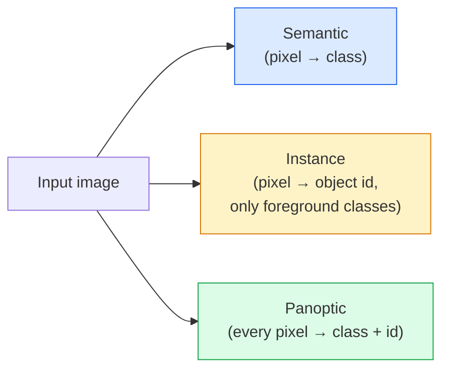
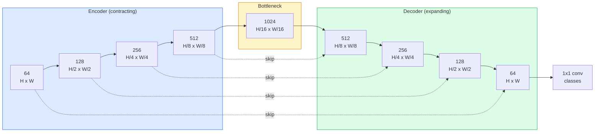

# Segmentation sémantique  U-Net

> La segmentation est effectuée par chaque pixel pour effectuer une classification. U-Net par le biais de l'encodeur de l'échantillon et du décodeur de l'échantillon.

**Type:** Build
**Languages:** Python
**Prerequisites:** Phase 4 Lesson 03 (CNNs), Phase 4 Lesson 04 (Image Classification)
**Time:** ~75 minutes

## Objectif de l'apprentissage
- 区分语义,实例和全观分区,并为给定问题选择正确任务
- Dans PyTorch, le décodeur de U-Net est construit à partir de zéro, contenant des blocs d'encodeur, des coups de bottin, des convolutions transposées, ainsi que des connexions de saut.
- ¢ réaliser une entropie croisée par pixel ¢ perte de DICE, ainsi que la perte combinée par défaut de segmentation médicale et industrielle actuelle
- 按类 解读 IoU 和 Dice métriques,并诊断低分是来自小物回忆、边界精度,还是类失衡

##  problématique
Classification pour chaque image 输出一个标签──Détection pour chaque image 输出少量框──Segmentation pour chaque pixel 输出一个标签──对于大小为`H x W`Les données de l'entrée, de la sortie sont en forme de`H x W`(sémantique) ou `H x W x N_instances`Le tensor de chaque image a des millions de prédictions, pas une seule.

La structure de la segmentation explique pourquoi elle fournit presque toutes les visions de prédiction dense. Produits: imagerie médicale (masques tumorales)  conduite autonome (route, voie, obstacle)  satellite (marque de pied de bâtiment, limites de culture)  partage de documents (zones de mise en page)  robotique (régions capables de saisir)  Ces tâches ne peuvent pas être passées à un objet  dessiner une boîte pour résoudre; elles nécessitent une silhouette précise.

Le problème de l'architecture est simple, mais il n'est pas simple à résoudre: vous avez besoin d'un réseau pour voir le contexte global de l'image.

## 概念
### 语义 vs 实例 vs 全景



- **Semantic**Exprimez que ce pixel est la route, ce pixel est la voiture.
- **Instance**Indiquez que ce pixel est la voiture n°3, que ce pixel est la voiture n°5.
- **Panoptic**Pour chaque pixel, il y a une étiquette de classe, chaque instance a un id unique, les objets et les choses sont segmentés.

Le cours de la formation en sciences de la psychologie et de la psychologie est un cours de la psychologie de la psychologie.

### La forme du réseau U-Net



L'encodeur va réduire la résolution spatiale  moitié quatre fois,并将频道 翻倍──decoder 反向执行:将空间分辨率 翻倍四次,并将频道 减半──Skip connections 会在每个分辨率上把匹配的编码功能与解码功能 进行连接──最终的1x1 conv 在完整分辨率下将`64 -> num_classes`Il y a une autre.

Pourquoi sauter des connexions est nécessaire: lorsque le décodeur tente de produire des prédictions au niveau des pixels, il ne voit que de très petites cartes de fonctionnalités. Il ne saute pas, il ne peut pas localiser les bords avec précision, car ces informations sont déjà compressées dans l'encodeur. Sauter des connexions.

### Transposé vers l'échantillon ascendant bilinéaire

Le décodeur doit élargir les dimensions spatiales.

- **Transposed convolution**(le secteur de l'énergie)`nn.ConvTranspose2d`  可学习的上方示例──历史上的 U-Net 默认方案──如果步步和内核尺寸 不能整除,可能产生棋牌文物──
- **Bilinear upsample + 3x3 conv**  平滑 upsample 后一个 conv──Artifacts 更少,parametres 更少,现在是现代默认方案──

Les deux projets concrets sont tous visibles.

### Grille de pixels de l' entropique croisée

Pour la segmentation sémantique de la classe C, la sortie du modèle est`(N, C, H, W)`❖ L'objectif est`(N, H, W)`, contient des identifiants de classe entière.

```
Loss = mean over (n, h, w) of -log( softmax(logits[n, :, h, w])[target[n, h, w]] )
```

PyTorch 中的 `F.cross_entropy`Origines pour traiter cette forme.

### Perte de dés et pourquoi vous en avez besoin

L'entropie croisée est égale à chaque pixel. Dans la grande majorité des images de la classe, c'est une erreur.

Perte de dés  via une optimisation directe de la superposition entre le masque prédit et le masque réel  pour résoudre ce problème:

```
Dice(p, y) = 2 * sum(p * y) / (sum(p) + sum(y) + epsilon)
Dice_loss = 1 - Dice
```

Parmi eux `p`C'est une carte de probabilité sigmoïde/softmax de classe.`y`C'est une vérité de base binaire. Mais quand on se chevauche, la perte est à zéro.

实践中, usage **combined loss**- Le numéro de la liste:

```
L = L_cross_entropy + lambda * L_dice       (lambda ~ 1)
```

La croisée entropie dans la formation  début fournir un gradient stable; Dice va donner une formation 后段聚焦在真正匹配面具形上――. Ce composé est un schéma standard de l'imagerie médicale, dans tout ensemble de données déséquilibré en classe 上都很难被超越――.

### Mesures d'évaluation

- **Pixel accuracy** 预测 百分比──计算便宜──与分类中精度一样,在失衡数据上会失效──
- **IoU per class** Chaque classe de masque de l'intersection sur l'union;
- **Dice (F1 on pixels)** 类似 IoU;`Dice = 2 * IoU / (1 + IoU)`❖ Imagerie médicale, plus préférée Dice, conduite de la communauté, plus préférée IoU;
- **Boundary F1** Mesurer les limites prévues et la proximité des limites de la vérité au sol, même les petits décalages seront punis.

 Rapport de l'UO par classe, pas seulement de l'UO.  La moyenne de l'UO couvrirait une classe de seulement 15% ‒ tandis que les neuf autres classes avaient 85% de la situation ‒

### Résolution d'entrée 权衡

L'encodeur U-Net va réduire la résolution de la vidéo à 4 fois, donc l'entrée doit être intégrée à 16 images. Les images médicales sont généralement 512x512 ou 1024x1024.`H * W * C_max`缩放, dans les canaux 1024x1024 且瓶喉为 1024 时,forward pass 已经会使用数GB VRAM──

∆ Deux critères de dépannage:
1. Tire la prise de charge  处理带 de 256x256 carreaux, puis couture。
2. Utilisez des convolutions dilatées  remplacez le col de bouteille, en conservant une résolution spatiale plus élevée   while expanding the receptive field (la famille DeepLab) ⋅

Pour le premier modèle, utilisez 256x256 entrée et U-Net basé sur 64 canaux, vous pouvez vous entraîner à 8 Go de VRAM.


```figure
segmentation-flood
```

## - Je le construis.
### 步骤 1: bloc de l'encodeur

Deux convex 3x3, avec la norme de lot et la réLU.

```python
import torch
import torch.nn as nn
import torch.nn.functional as F

class DoubleConv(nn.Module):
    def __init__(self, in_c, out_c):
        super().__init__()
        self.net = nn.Sequential(
            nn.Conv2d(in_c, out_c, kernel_size=3, padding=1, bias=False),
            nn.BatchNorm2d(out_c),
            nn.ReLU(inplace=True),
            nn.Conv2d(out_c, out_c, kernel_size=3, padding=1, bias=False),
            nn.BatchNorm2d(out_c),
            nn.ReLU(inplace=True),
        )

    def forward(self, x):
        return self.net(x)
```

Ce bloc sera utilisé tout au long de la journée.`bias=False`C'est parce que la bêta de BN a déjà traité le biais.

### 步骤 2: Blocs vers le bas et vers le haut

```python
class Down(nn.Module):
    def __init__(self, in_c, out_c):
        super().__init__()
        self.net = nn.Sequential(
            nn.MaxPool2d(2),
            DoubleConv(in_c, out_c),
        )

    def forward(self, x):
        return self.net(x)


class Up(nn.Module):
    def __init__(self, in_c, out_c):
        super().__init__()
        self.up = nn.Upsample(scale_factor=2, mode="bilinear", align_corners=False)
        self.conv = DoubleConv(in_c, out_c)

    def forward(self, x, skip):
        x = self.up(x)
        if x.shape[-2:] != skip.shape[-2:]:
            x = F.interpolate(x, size=skip.shape[-2:], mode="bilinear", align_corners=False)
        x = torch.cat([skip, x], dim=1)
        return self.conv(x)
```

Il faut voir la forme spatiale.`shape[-2:]`) peut traiter des dimensions non pas être intégralement décomposé; une sécurité `F.interpolate`Les différences de couleur de la chaîne doivent être clairement établies, et ne doivent pas être interpolées silencieusement.

### 步骤 3: Le réseau

```python
class UNet(nn.Module):
    def __init__(self, in_channels=3, num_classes=2, base=64):
        super().__init__()
        self.inc = DoubleConv(in_channels, base)
        self.d1 = Down(base, base * 2)
        self.d2 = Down(base * 2, base * 4)
        self.d3 = Down(base * 4, base * 8)
        self.d4 = Down(base * 8, base * 16)
        self.u1 = Up(base * 16 + base * 8, base * 8)
        self.u2 = Up(base * 8 + base * 4, base * 4)
        self.u3 = Up(base * 4 + base * 2, base * 2)
        self.u4 = Up(base * 2 + base, base)
        self.outc = nn.Conv2d(base, num_classes, kernel_size=1)

    def forward(self, x):
        x1 = self.inc(x)
        x2 = self.d1(x1)
        x3 = self.d2(x2)
        x4 = self.d3(x3)
        x5 = self.d4(x4)
        x = self.u1(x5, x4)
        x = self.u2(x, x3)
        x = self.u3(x, x2)
        x = self.u4(x, x1)
        return self.outc(x)

net = UNet(in_channels=3, num_classes=2, base=32)
x = torch.randn(1, 3, 256, 256)
print(f"output: {net(x).shape}")
print(f"params: {sum(p.numel() for p in net.parameters()):,}")
```

Forme de sortie `(1, 2, 256, 256)` Comparable à la taille spatiale de l'entrée, contenu `num_classes`Les chaînes sont en train de se dérouler.`base=32`Paramètres de 7,7 M

### 步骤 4: Perte

```python
def dice_loss(logits, targets, num_classes, eps=1e-6):
    probs = F.softmax(logits, dim=1)
    targets_one_hot = F.one_hot(targets, num_classes).permute(0, 3, 1, 2).float()
    dims = (0, 2, 3)
    intersection = (probs * targets_one_hot).sum(dim=dims)
    denom = probs.sum(dim=dims) + targets_one_hot.sum(dim=dims)
    dice = (2 * intersection + eps) / (denom + eps)
    return 1 - dice.mean()


def combined_loss(logits, targets, num_classes, lam=1.0):
    ce = F.cross_entropy(logits, targets)
    dc = dice_loss(logits, targets, num_classes)
    return ce + lam * dc, {"ce": ce.item(), "dice": dc.item()}
```

Dice 按类 计算后再平均 `eps`防止批 中缺失某些类 时出现除零──

### 步骤 5: métrique de l'UO

```python
@torch.no_grad()
def iou_per_class(logits, targets, num_classes):
    preds = logits.argmax(dim=1)
    ious = torch.zeros(num_classes)
    for c in range(num_classes):
        pred_c = (preds == c)
        true_c = (targets == c)
        inter = (pred_c & true_c).sum().float()
        union = (pred_c | true_c).sum().float()
        ious[c] = (inter / union) if union > 0 else torch.tensor(float("nan"))
    return ious
```

返回长度为 C's Vector。`nan`标记批 中缺失类  计算 mIoU 时不要把这些值纳入平均――

### 步骤 6: Ensemble de données synthétiques pour la vérification de bout en bout

Dans les arrière-plans en couleur, les formes sont générées, ce qui rend le réseau obligatoire d'apprendre la forme, plutôt que la couleur des pixels.

```python
import numpy as np
from torch.utils.data import Dataset, DataLoader

def synthetic_segmentation(num_samples=200, size=64, seed=0):
    rng = np.random.default_rng(seed)
    images = np.zeros((num_samples, size, size, 3), dtype=np.float32)
    masks = np.zeros((num_samples, size, size), dtype=np.int64)
    for i in range(num_samples):
        bg = rng.uniform(0, 1, (3,))
        images[i] = bg
        masks[i] = 0
        num_shapes = rng.integers(1, 4)
        for _ in range(num_shapes):
            cls = int(rng.integers(1, 3))
            color = rng.uniform(0, 1, (3,))
            cx, cy = rng.integers(10, size - 10, size=2)
            r = int(rng.integers(4, 12))
            yy, xx = np.meshgrid(np.arange(size), np.arange(size), indexing="ij")
            if cls == 1:
                mask = (xx - cx) ** 2 + (yy - cy) ** 2 < r ** 2
            else:
                mask = (np.abs(xx - cx) < r) & (np.abs(yy - cy) < r)
            images[i][mask] = color
            masks[i][mask] = cls
        images[i] += rng.normal(0, 0.02, images[i].shape)
        images[i] = np.clip(images[i], 0, 1)
    return images, masks


class SegDataset(Dataset):
    def __init__(self, images, masks):
        self.images = images
        self.masks = masks

    def __len__(self):
        return len(self.images)

    def __getitem__(self, i):
        img = torch.from_numpy(self.images[i]).permute(2, 0, 1).float()
        mask = torch.from_numpy(self.masks[i]).long()
        return img, mask
```

Trois classes: arrière-plan (0) 、cercles (1) 、quadrés (2) ‧Réseau ∞

### 步骤 7: cycle de formation

```python
def train_one_epoch(model, loader, optimizer, device, num_classes):
    model.train()
    loss_sum, total = 0.0, 0
    iou_sum = torch.zeros(num_classes)
    for x, y in loader:
        x, y = x.to(device), y.to(device)
        logits = model(x)
        loss, _ = combined_loss(logits, y, num_classes)
        optimizer.zero_grad()
        loss.backward()
        optimizer.step()
        loss_sum += loss.item() * x.size(0)
        total += x.size(0)
        iou_sum += iou_per_class(logits, y, num_classes).nan_to_num(0)
    return loss_sum / total, iou_sum / len(loader)
```

Dans le ensemble de données synthétiques 上运行 10-30 époques, observer les classes de forme de mIoU 爬升到 0.9 以上──注意,`nan_to_num(0)`Pour obtenir une valeur de l'UIO exacte par classe, pendant la phase d'évaluation, il faut faire une présence en masque et passer par lots.`torch.nanmean`C'est une moyenne directe.

## Utilisez-le
pour la production,`segmentation_models_pytorch`("smp") avec une vision de torche ou une colonne vertébrale de temps 封装了所有标准分类架构──三行代码:

```python
import segmentation_models_pytorch as smp

model = smp.Unet(
    encoder_name="resnet34",
    encoder_weights="imagenet",
    in_channels=3,
    classes=3,
)
```

实际工作中:
- **DeepLabV3+**Utiliser des convois dilatés  remplacement basé sur le dépistage maximal, de sorte que le col de bouteille  maintenir la résolution;
- **SegFormer**Le codeur de convaincre est remplacé par un transformateur hiérarchique; dans de nombreux critères de référence, il est actuellement SOTA。
- **Mask2Former**- Je suis là .**OneFormer**Dans une architecture unique, la segmentation sémantique, l'instance et la panoptique sont uniques.

C'est le troisième qui est là.`smp`Ou `transformers`Il peut être utilisé comme un remplacement de dépôt,并使用相同的数据载体──

## Je le livre.
Le programme de formation

- `outputs/prompt-segmentation-task-picker.md` Un prompt, utilisé pour faire le choix entre la segmentation sémantique, de l'instance et de la segmentation panoptique, et pour une architecture de nommage de tâche déterminée.
- `outputs/skill-segmentation-mask-inspector.md` Une compétence, pour rapporter la distribution des classes  statistiques de masques prévisibles, ainsi que les classes sous-prévisées ou confuses de limites

## 练习
1. **(Easy)**Pour réaliser la tâche de segmentation binaire (frontale contre arrière-plan) `bce_dice_loss` Dans un ensemble de données de deux classes synthétiques, en premier plan, la perte combinée ne représente que 5% des pixels 时, par rapport à la perte individuelle BCE 收更快──
2. **(Medium)**Il va`nn.Upsample + conv`- up-block 替换为 `nn.ConvTranspose2d`Up-block── dans le jeu de données synthétiques 上 train二者并比较 mIoU── observar transposé-conv 版本中棋牌文物 出现位置──
3. **(Hard)**选取一个真实分区数据集(Oxford-IIIT Petes、Citiescapes mini split, ou un sous-ensemble médical),并将 U-Net 训练到距离 `smp.Unet`Le rapport par classe de l'UO ne dépasse pas 2 points de référence.

## 关键术语
| Term | What people say | What it actually means |
|------|----------------|----------------------|
| Semantic segmentation | “标注每个 pixel” | 对每个 pixel 进行 C classes 的 Classification；同一 class 的 instances 会合并 |
| Instance segmentation | “标注每个 object” | 分离同一 class 的不同 instances；仅 foreground |
| Panoptic segmentation | “Semantic + instance” | 每个 pixel 得到一个 class；每个 thing instance 还得到一个唯一 id |
| Skip connection | “U-Net bridge” | 将 encoder features concatenate 到匹配 resolution 的 decoder features 中；保留 high-frequency detail |
| Transposed conv | “Deconvolution” | 可学习的 upsampling；可能产生 checkerboard artifacts |
| Dice loss | “Overlap loss” | 1 - 2|A ∩ B| / (|A| + |B|)；直接优化 mask overlap，并且对 class imbalance 鲁棒 |
| mIoU | “Mean intersection over union” | 跨 classes 平均 IoU；segmentation 的 community-standard metric |
| Boundary F1 | “Boundary accuracy” | 只在 boundary pixels 上计算的 F1 score；对 precision-critical tasks 很重要 |

## 延伸阅读
- [U-Net: Convolutional Networks for Biomedical Image Segmentation (Ronneberger et al., 2015)](https://arxiv.org/abs/1505.04597) Le papier original; tout le monde va reprendre le chiffre à la deuxième page
- [Fully Convolutional Networks (Long et al., 2015)](https://arxiv.org/abs/1411.4038) 首个将分区 变成 un problème de convection de bout en bout
- [segmentation_models_pytorch](https://github.com/qubvel/segmentation_models.pytorch) référence à la segmentation de la production; contient toutes les normes d'architecture et toutes les pertes de normes
- [Lessons learned from training SOTA segmentation (kaggle.com competitions)](https://www.kaggle.com/code/iafoss/carvana-unet-pytorch) 讲解为什么 TTA、pseudo-labelling 和 class weights sont très importants sur les données réelles
