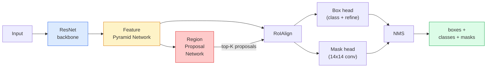

# Segmentation d'instance  Masque R-CNN

> Donnez un détecteur R-CNN plus rapide, plus une très petite branche de masque, vous obtenez une segmentation d'exemple.

**Type:** Build + Learn
**Languages:** Python
**Prerequisites:** Phase 4 Lesson 06 (YOLO), Phase 4 Lesson 07 (U-Net)
**Time:** ~75 minutes

## Objectif de l'apprentissage
- 端到端追踪 Masque R-CNN 架构:réseau de dos FPN、RPN、RoIAlign、boîte tête  मुखौटा tête
- De la réalisation RoIAlign,并 expliquer pourquoi RoIPool n'est plus utilisé
- Utiliser la vision de la torche `maskrcnn_resnet50_fpn_v2`modèle prétrainé 生成生产质量 instance masques,并正确读取它的输出格式
- 通过换盒 和面具头,并保持脊椎 结, dans un petit groupe de données à définition personnelle, afin de régler le masque R-CNN

##  problématique
La segmentation sémantique pour chaque classe donne un masque. La segmentation d'instantation pour chaque objet donne un masque, même si deux objets appartiennent à la même classe.

Mask R-CNN (He et al., 2017) 通过把实例细分重新表述为检测-plus-a-mask来解决这个问题――这个设计非常简单,到下五年里,几乎每篇实例细分论文都是Mask R-CNN的变体,而火视觉实施至今仍然是中小型数据集的生产默认选择――

Le problème de l'ingénierie est le suivant: comment couper une région de fonctionnalités de taille fixe dans une boîte de proposition, alors que le point d'angle de cette boîte ne correspond pas aux limites des pixels ?

## 概念
### L'architecture



Il faut comprendre cinq parties:

1. **Backbone** Dans l'ImageNet 上 training de ResNet-50 ou ResNet-101── générer des étapes pour 4、8、16、32 de cartes fonctionnalités niveaux──
2. **FPN (Feature Pyramid Network)** connexions latérales + de haut en bas, que chaque niveau ait des caractéristiques significatives de canaux C。 Détection 会查询与对象大小匹配的FPN级别。
3. **RPN (Region Proposal Network)** Une petite tête de convexe, en position de chaque ancrage 上预测 ici y a-t-il un objet? ainsi que 我该如何精细盒?──
4. **RoIAlign** De niveau FPN arbitral à niveau de boîte arbitrale 中采样固定大小(exemple 7x7) de patch de fonctionnalité── utiliser l'échantillonnage bilinéaire, pas faire la quantification──
5. **Heads** 两层盒头,用于精细盒并选择类;再加一个小型卷头,为每一个提案 输出一个 `28x28`masque binaire

### Pourquoi RoIAlign et non RoIPool

Le premier Fast R-CNN utilisait RoIPool, il décompose la boîte de proposition en une grille, prend la plus grande fonctionnalité dans chaque cellule, et met tous les coordinats ronds à l'intégralité. Ce rondeur permettrait de faire une carte de fonctionnalités avec les coordonnées des pixels d'entrée.

```
RoIPool:
  box (34.7, 51.3, 98.2, 142.9)
  round -> (34, 51, 98, 142)
  split grid -> round each cell boundary
  misalignment accumulates at every step

RoIAlign:
  box (34.7, 51.3, 98.2, 142.9)
  sample at exact float coordinates using bilinear interpolation
  no rounding anywhere
```

Le détecteur de localisation de chaque point de vue l'utilise, y compris YOLOv7 seg、RT-DETR、Mask2Former。

### Le RPN en un seul paragraphe

Pour chaque ancrage, prévoir un score d'objets, ainsi qu'un offset de régression, pour faire de l'ancre une boîte plus apposée à l'objet. Pour chaque carte, conserver environ 1000 boîtes, en utilisant le NMS 0.7 en IoU, puis conserver les boîtes suivantes.

### La tête du masque

Pour chaque proposition, le masque est un très petit FCN: quatre convex 3x3`28x28`résolution 下生成 `num_classes`个输出︎ ︎ ︎ ︎ ︎ ︎ ︎ ︎ ︎ ︎ ︎ ︎ ︎ ︎ ︎ ︎ ︎ ︎ ︎ ︎ ︎ ︎ ︎ ︎ ︎ ︎ ︎ ︎ ︎ ︎ ︎ ︎ ︎ ︎ ︎ ︎ ︎ ︎ ︎ ︎ ︎ ︎ ︎ ︎ ︎ ︎ ︎ ︎ ︎ ︎ ︎ ︎ ︎ ︎ ︎ ︎ ︎ ︎ ︎ ︎ ︎ ︎ ︎ ︎ ︎ ︎ ︎ ︎ ︎ ︎ ︎ ︎ ︎ ︎ ︎ ︎ ︎ ︎ ︎ ︎ ︎ ︎ ︎ ︎ ︎ ︎ ︎ ︎ ︎ ︎ ︎ ︎ ︎ ︎ ︎ ︎ ︎ ︎ ︎ ︎ ︎ ︎ ︎ ︎ ︎ ︎ ︎ ︎ ︎ ︎

Mettez le masque 28x28 en plus de l'échantillon à la proposition de la taille originale du pixel, obtenez le masque binaire final.

### Les pertes

Le masque R-CNN a quatre types de pertes en plus:

```
L = L_rpn_cls + L_rpn_box + L_box_cls + L_box_reg + L_mask
```

- `L_rpn_cls`- Je suis là .`L_rpn_box` Objettivité des propositions RPN + boîte Régrésion。
- `L_box_cls` classifiateur de tête 上 cible (C+1) classes  contenant des antécédents)
- `L_box_reg`Le raffinement de la boîte à tête de la L1
- `L_mask` 28x28 sortie de masque 上的每像素二进制交叉

Chaque perte a son propre poids par défaut; la mise en œuvre de la torchvision les exposera comme des arguments constructeurs.

### Format de sortie

`torchvision.models.detection.maskrcnn_resnet50_fpn_v2`Retour à une liste de dictes, chaque image à un dicté:

```
{
    "boxes":  (N, 4) in (x1, y1, x2, y2) pixel coordinates,
    "labels": (N,) class IDs, 0 = background so indices are 1-based,
    "scores": (N,) confidence scores,
    "masks":  (N, 1, H, W) float masks in [0, 1] — threshold at 0.5 for binary,
}
```

Le masque 已是全图像分辨率──28x28 tête de sortie 已在内部完成上样子──


```figure
cv3-roialign-sampling
```

## - Je le construis.
### 步骤 1: aligner le roi à partir de zéro

Ce composant de Mask R-CNN est plus simple à comprendre avec le code qu'avec la description en caractères.

```python
import torch
import torch.nn.functional as F

def roi_align_single(feature, box, output_size=7, spatial_scale=1 / 16.0):
    """
    feature: (C, H, W) single-image feature map
    box: (x1, y1, x2, y2) in original image pixel coordinates
    output_size: side of the output grid (7 for box head, 14 for mask head)
    spatial_scale: reciprocal of the feature map stride
    """
    C, H, W = feature.shape
    x1, y1, x2, y2 = [c * spatial_scale - 0.5 for c in box]
    bin_w = (x2 - x1) / output_size
    bin_h = (y2 - y1) / output_size

    grid_y = torch.linspace(y1 + bin_h / 2, y2 - bin_h / 2, output_size)
    grid_x = torch.linspace(x1 + bin_w / 2, x2 - bin_w / 2, output_size)
    yy, xx = torch.meshgrid(grid_y, grid_x, indexing="ij")

    gx = 2 * (xx + 0.5) / W - 1
    gy = 2 * (yy + 0.5) / H - 1
    grid = torch.stack([gx, gy], dim=-1).unsqueeze(0)
    sampled = F.grid_sample(feature.unsqueeze(0), grid, mode="bilinear",
                            align_corners=False)
    return sampled.squeeze(0)
```

Chaque valeur numérique provient de la position bilinéaire échantillonnée, sans arrondissement, sans quantification, ni gradients perdus.

### 步骤 2: Comparer avec la ligne RoIA de la torchvision

```python
from torchvision.ops import roi_align

feature = torch.randn(1, 16, 50, 50)
boxes = torch.tensor([[0, 10, 20, 100, 90]], dtype=torch.float32)  # (batch_idx, x1, y1, x2, y2)

ours = roi_align_single(feature[0], boxes[0, 1:].tolist(), output_size=7, spatial_scale=1/4)
theirs = roi_align(feature, boxes, output_size=(7, 7), spatial_scale=1/4, sampling_ratio=1, aligned=True)[0]

print(f"shape ours:   {tuple(ours.shape)}")
print(f"shape theirs: {tuple(theirs.shape)}")
print(f"max|diff|:    {(ours - theirs).abs().max().item():.3e}")
```

Dans le`sampling_ratio=1`且 `aligned=True`时, les deux peuvent être `1e-5`Pour le coup.

### étape 3: Charger un masque R-CNN prétrainé

```python
import torch
from torchvision.models.detection import maskrcnn_resnet50_fpn_v2, MaskRCNN_ResNet50_FPN_V2_Weights

model = maskrcnn_resnet50_fpn_v2(weights=MaskRCNN_ResNet50_FPN_V2_Weights.DEFAULT)
model.eval()
print(f"params: {sum(p.numel() for p in model.parameters()):,}")
print(f"classes (including background): {len(model.roi_heads.box_predictor.cls_score.out_features * [0])}")
```

46M paramètres, 91 classes ((COCO) ⋅ 1ère classe ((id 0) est l'arrière-plan; modèle de réelle inspection tout le contenu sont de l'id 1 开始。

### 步骤 4: Exécuter l'inférence

```python
with torch.no_grad():
    x = torch.randn(3, 400, 600)
    predictions = model([x])
p = predictions[0]
print(f"boxes:  {tuple(p['boxes'].shape)}")
print(f"labels: {tuple(p['labels'].shape)}")
print(f"scores: {tuple(p['scores'].shape)}")
print(f"masks:  {tuple(p['masks'].shape)}")
```

forme du tensor du masque est `(N, 1, H, W)`Pour chaque objet, on obtient un masque binaire:

```python
binary_masks = (p['masks'] > 0.5).squeeze(1)  # (N, H, W) boolean
```

### 步骤 5: Faites échanger les têtes pour un compte de classe personnalisé

Récipes de réglage de la régularisation: réutiliser la colonne vertébrale、FPN 和 RPN; remplacer les deux têtes de classification。

```python
from torchvision.models.detection.faster_rcnn import FastRCNNPredictor
from torchvision.models.detection.mask_rcnn import MaskRCNNPredictor

def build_custom_maskrcnn(num_classes):
    model = maskrcnn_resnet50_fpn_v2(weights=MaskRCNN_ResNet50_FPN_V2_Weights.DEFAULT)
    in_features = model.roi_heads.box_predictor.cls_score.in_features
    model.roi_heads.box_predictor = FastRCNNPredictor(in_features, num_classes)
    in_features_mask = model.roi_heads.mask_predictor.conv5_mask.in_channels
    hidden_layer = 256
    model.roi_heads.mask_predictor = MaskRCNNPredictor(in_features_mask, hidden_layer, num_classes)
    return model

custom = build_custom_maskrcnn(num_classes=5)
print(f"custom cls_score.out_features: {custom.roi_heads.box_predictor.cls_score.out_features}")
```

`num_classes`must contain background class, donc un a 4 classes d'objets `num_classes=5`Il y a une autre.

### 步骤 6: Congeler ce qui n'a pas besoin d'être formé

Dans les petits ensembles de données, il y a une colonne vertébrale et un FPN.

```python
def freeze_backbone_and_fpn(model):
    # torchvision Mask R-CNN packs the FPN inside `model.backbone` (as
    # `model.backbone.fpn`), so iterating `model.backbone.parameters()` covers
    # both the ResNet feature layers and the FPN lateral/output convs.
    for p in model.backbone.parameters():
        p.requires_grad = False
    return model

custom = freeze_backbone_and_fpn(custom)
trainable = sum(p.numel() for p in custom.parameters() if p.requires_grad)
print(f"trainable after freeze: {trainable:,}")
```

Dans les données de 500 images, c'est la différence entre la réception et le surmatchage.

## Utilisez-le
Le cycle complet de formation de Mask R-CNN n'est que de 40 pages, et il est essentiellement inchangé entre les différentes tâches: remplacer les ensembles de données, puis commencer à s'entraîner.

```python
def train_step(model, images, targets, optimizer):
    model.train()
    loss_dict = model(images, targets)
    losses = sum(loss for loss in loss_dict.values())
    optimizer.zero_grad()
    losses.backward()
    optimizer.step()
    return {k: v.item() for k, v in loss_dict.items()}
```

`targets`La liste doit contenir chaque image de la commande, dont`boxes`- Je suis là.`labels`et `masks`(en tant que `(num_instances, H, W)`Les tenseurs binaires) ―― modèle en formation 时返回四个损失的句,在 eval 时返回预测列表,由 `model.training`Décision

`pycocotools`Vous avez besoin de deux chiffres pour juger si le boîtier est en tête de boîte ou en tête de masque.

## Je le livre.
Le cours est ouvert à:

- `outputs/prompt-instance-vs-semantic-router.md` Un prompt, présentera trois questions,并选择实例 vs. sémantique vs. panoptique, ainsi que le modèle de démarrage précis.
- `outputs/skill-mask-rcnn-head-swapper.md`Une compétence, une nouvelle.`num_classes`, pour le modèle de détection de la torche volontaire 生成 pour le changement de tête de 10 行代码。

## 练习
1. **(Easy)**Dans 100 boîtes aléatoires`torchvision.ops.roi_align`验证你的RoIAlign──报告最大绝对差值──同时运行RoIPool(pre-2017 behavior),并显示它在靠近边界的盒子上会偏离约1-2个特色地图像素──
2. **(Medium)**Dans un ensemble de données personnalisées de 50 images, ajoutez deux classes: ballons, poissons, trous, logos)`maskrcnn_resnet50_fpn_v2`结脊椎, entraînement 20 époques, rapport masque AP@0.5
3. **(Hard)**Pour le modèle R-CNN, la tête de masque est remplacé par la version prévue 56x56 au lieu de 28x28.

## 关键术语
| Term | What people say | What it actually means |
|------|----------------|----------------------|
| Mask R-CNN | “Detection plus masks” | Faster R-CNN + 一个小型 FCN head，为每个 proposal 的每个 class 预测一个 28x28 mask |
| FPN | “Feature pyramid” | top-down + lateral connections，让每个 stride level 都有 C channels 的语义丰富 features |
| RPN | “Region proposer” | 一个小型 conv head，每张图像生成约 1000 个 object/no-object proposals |
| RoIAlign | “No-rounding crop” | 从任意 float-coordinate box 中以 bilinear 方式采样固定大小的 feature grid |
| RoIPool | “Pre-2017 crop” | 与 RoIAlign 用途相同，但会 round box coordinates；已经过时 |
| Mask AP | “Instance mAP” | 使用 mask IoU 而不是 box IoU 计算的 average precision；COCO instance segmentation metric |
| Binary mask head | “Per-class mask” | 为每个 proposal 的每个 class 预测一个 binary mask；只保留 predicted class 的 channel |
| Background class | “Class 0” | 兜底的 “no object” class；真实 classes 的 indices 从 1 开始 |

## 延伸阅读
- [Mask R-CNN (He et al., 2017)](https://arxiv.org/abs/1703.06870) 论文; À propos de RoIAlign  节 3  论文; 论文; 论文; 论文; 论文; 论文; 论文; 论文; 论文; 论文; 论文; 论文; 论文; 论文; 论文; 论文; 论文; 论文; 论文; 论文; 论文; 论文; 论文; 论文; 论文; 论文; 论文; 论文; 论文; 论文; 论文; 论文; 论文; 论文; 论文; 论文; 论文; 论文; 论文; 论文; 论文; 论文; 论文; 论文; 论文; 论文; 论文; 论文; 论文; 论文; 论文; 论文; 论文; 论文; 论文; 论文; 论文; 论文; 论文; 论文; 论文; 论文; 论文; 论文; 论文; 论文; 论文; 论文; 论文; 论文; 论文; 论文; 论文; 论文; 论文; 论文; 论文; 论文; 论文; 论文; 论文; 论文; 论文; 论文; 论文; 论文; 论文; 论文; 论文; 论文; 论文; 论文; 论文; 论文; 论文; 论文; 论文; 论
- [FPN: Feature Pyramid Networks (Lin et al., 2017)](https://arxiv.org/abs/1612.03144) FPN 论文; chaque détecteur moderne
- [torchvision Mask R-CNN tutorial](https://pytorch.org/tutorials/intermediate/torchvision_tutorial.html) boucle de réglage de la finition
- [Detectron2 model zoo](https://github.com/facebookresearch/detectron2/blob/main/MODEL_ZOO.md) Implementations de niveau de production, fournissant presque toutes les mesures de détection et de segmentation  changements de poids formés
